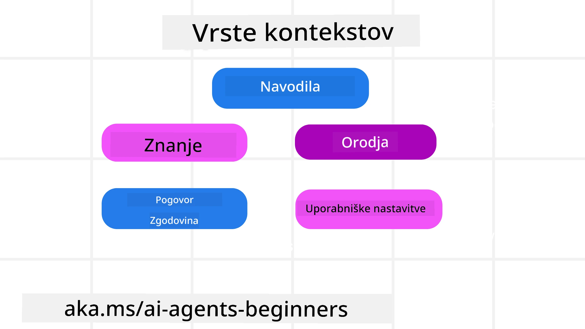
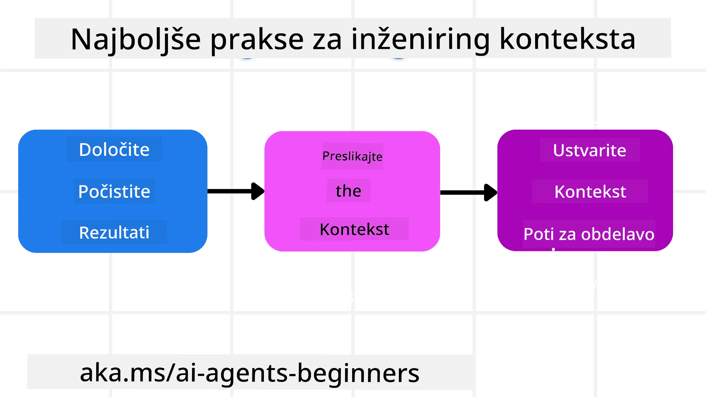

# Inženiring konteksta za AI agente

> _(Kliknite zgornjo sliko za ogled videa te lekcije)_

Razumevanje kompleksnosti aplikacije, za katero gradite AI agenta, je pomembno za izdelavo zanesljivega. Potrebujemo AI agente, ki učinkovito upravljajo informacije, da bi naslovili kompleksne potrebe, ki presegajo samo inženiring pozivov.

V tej lekciji bomo pogledali, kaj je inženiring konteksta in kakšna je njegova vloga pri gradnji AI agentov.

## Uvod

Ta lekcija bo zajemala:

• **Kaj je inženiring konteksta** in zakaj se razlikuje od inženiringa pozivov.

• **Strategije za učinkovit inženiring konteksta**, vključno s tem, kako pisati, izbirati, stiskati in izolirati informacije.

• **Pogoste napake v kontekstu**, ki lahko ohromijo vašega AI agenta in kako jih popraviti.

## Cilji učenja

Po zaključku te lekcije boste razumeli, kako:

• **Opredeliti inženiring konteksta** in ga razlikovati od inženiringa pozivov.

• **Prepoznati ključne komponente konteksta** v aplikacijah velikih jezikovnih modelov (LLM).

• **Uporabiti strategije za pisanje, izbiro, kompresijo in izolacijo konteksta** za izboljšanje učinkovitosti agenta.

• **Prepoznati pogoste napake v kontekstu**, kot so zastrupitev, motenje, zmeda in konflikt ter uvesti tehnike za njihovo omilitev.

## Kaj je inženiring konteksta?

Za AI agente je kontekst tisto, kar vodi načrtovanje AI agenta za izvajanje določenih dejanj. Inženiring konteksta je praksa zagotavljanja, da ima AI agent prave informacije za dokončanje naslednjega koraka naloge. Okno konteksta je omejeno po velikosti, zato moramo kot graditelji agentov vzpostaviti sisteme in procese za upravljanje dodajanja, odstranjevanja in strnjevanja informacij v oknu konteksta.

### Inženiring pozivov v primerjavi z inženiringom konteksta

Inženiring pozivov je osredotočen na en sam nabor statičnih navodil, da učinkovito vodi AI agente z naborom pravil. Inženiring konteksta pa je upravljanje dinamičnega nabora informacij, vključno z začetnim pozivom, da se zagotovi, da ima AI agent skozi čas vse, kar potrebuje. Glavna ideja inženiringa konteksta je narediti ta proces ponovljiv in zanesljiv.

### Vrste konteksta

Pomembno je vedeti, da kontekst ni samo ena stvar. Informacije, ki jih AI agent potrebuje, lahko izvirajo iz različnih virov, in naša naloga je zagotoviti, da ima agent dostop do teh virov:

Vrste konteksta, ki jih mora AI agent morda upravljati, vključujejo:

• **Navodila:** To so kot "pravila" agenta – pozivi, sistemska sporočila, nekaj primerov (ki kažejo AI, kako narediti nekaj), in opisi orodij, ki jih lahko uporablja. Tu se fokus inženiringa pozivov združi z inženiringom konteksta.

• **Znanje:** Pokriva dejstva, informacije, pridobljene iz podatkovnih baz, ali dolgoročne spomine, ki jih je agent nabrala. To vključuje integracijo sistema pridobivanja z obogateno generacijo (RAG), če agent potrebuje dostop do različnih skladišč znanja in podatkovnih baz.

• **Orodja:** To so definicije zunanjih funkcij, API-jev in MCP strežnikov, ki jih agent lahko pokliče, skupaj z odzivi (rezultati), ki jih dobi z njihovo uporabo.

• **Zgodovina pogovora:** Nenehen dialog z uporabnikom. S časom ti pogovori postajajo daljši in bolj kompleksni, kar pomeni, da zasedejo prostor v oknu konteksta.

• **Uporabniške preference:** Informacije, pridobljene o uporabnikovih všečkih ali nepripravah skozi čas. Te informacije se lahko shranijo in uporabijo pri ključnih odločitvah za pomoč uporabniku.

## Strategije za učinkovit inženiring konteksta

### Strategije načrtovanja

Dobro inženirstvo konteksta se začne z dobrim načrtovanjem. Tukaj je pristop, ki vam bo pomagal začeti razmišljati o tem, kako uporabiti koncept inženiringa konteksta:

1. **Opredelite jasne rezultate** – rezultati nalog, dodeljenih AI agentom, morajo biti jasno definirani. Odgovorite na vprašanje - "Kako bo svet izgledal, ko bo AI agent zaključil svojo nalogo?" Z drugimi besedami, kakšna sprememba, informacija ali odziv naj ima uporabnik po interakciji z AI agentom.
2. **Mapa konteksta** – Ko ste opredelili rezultate AI agenta, morate odgovoriti na vprašanje "Katere informacije AI agent potrebuje za dokončanje te naloge?". Tako lahko začnete kartirati, kje so te informacije lahko locirane.
3. **Ustvarite tokove konteksta** – Zdaj, ko veste, kje so informacije, morate odgovoriti na vprašanje "Kako bo agent pridobil te informacije?". To lahko storite na različne načine, vključno z RAG, uporabo MCP strežnikov in drugih orodij.

### Praktične strategije

Načrtovanje je pomembno, ampak ko informacije začnejo vstopati v okno konteksta našega agenta, potrebujemo praktične strategije za njihovo upravljanje:

#### Upravljanje konteksta

Medtem ko se določene informacije samodejno dodajajo v okno konteksta, je inženiring konteksta v tem, da aktivno upravljamo s temi informacijami, kar lahko storimo z nekaj strategijami:

 1. **Pametna beležka agenta**  
 Ta omogoča AI agentu, da med posamezno sejo beleži ustrezne informacije o trenutnih nalogah in uporabniških interakcijah. Ta naj obstaja zunaj okna konteksta v datoteki ali objektu v času izvajanja, ki ga agent lahko kasneje v tej seji pridobi, če je potrebno.

 2. **Spomini**  
 Beležke so dobre za upravljanje informacij zunaj okna konteksta ene seje. Spomini omogočajo agentom shranjevanje in pridobivanje relevantnih informacij čez več sej. To lahko vključuje povzetke, uporabniške preference in povratne informacije za izboljšave v prihodnosti.

 3. **Kompresija konteksta**  
 Ko okno konteksta raste in se bliža svoji meji, lahko uporabimo tehnike, kot so povzemanje in krajšanje. To vključuje hranjenje samo najbolj relevantnih informacij ali odstranjevanje starejših sporočil.
  
 4. **Sistemi z več agenti**  
 Razvijanje sistemov z več agenti je oblika inženiringa konteksta, ker ima vsak agent svoje okno konteksta. Kako se ta kontekst deli in predaja različnim agentom, je še ena stvar, ki jo je treba načrtovati pri gradnji teh sistemov.
  
 5. **Sandbox okolja**  
 Če agent potrebuje zagnati kodo ali obdelati velike količine informacij v dokumentu, to lahko zahteva veliko število tokenov za obdelavo rezultatov. Namesto da bi bilo vse to shranjeno v oknu konteksta, lahko agent uporabi sandbox okolje, ki lahko zažene to kodo in prebere le rezultate ter druge relevantne informacije.
  
 6. **Objekti stanja v času izvajanja**  
 To se izvaja z ustvarjanjem vsebnikov informacij za upravljanje situacij, ko agent potrebuje dostop do določenih informacij. Za kompleksno nalogo bi to omogočilo agentu, da shranjuje rezultate posameznih korakov podnalog, kar omogoča, da kontekst ostane povezan samo s to specifično podnalogo.

#### Pregled konteksta

Po uporabi katere od teh strategij je vredno preveriti, kaj je naslednji poziv modelu dejansko prejel. Uporaben vprašanje za odpravljanje težav je:

> Ali je agent naložil preveč konteksta, napačen kontekst ali manjkal kontekst, ki ga je potreboval?

Ni vam treba beležiti surovih pozivov, izhodov orodij ali vsebine spomina, da bi odgovorili na to vprašanje. V produkciji raje uporabljajte majhne zapise pregleda konteksta, ki zajemajo števce, ID-je, zgoščene vrednosti in oznake pravil:

- **Izbira:** Spremljate, koliko kandidatnih delcev, orodij ali spominov je bilo obravnavanih, koliko jih je bilo izbranih in katera pravila ali ocena so povzročila filtracijo ostalih.
- **Kompresija:** Zapišite obseg vira ali sledi ID, ID povzetka, ocenjeno število tokenov pred in po kompresiji ter ali je bil surovi vsebine izključen iz naslednjega poziva.
- **Izolacija:** Zabeležite, katera podnaloga je tekla v ločenem agentu, seji ali sandboxu, kateri omejeni povzetek je bil vrnjen in ali je velik izhod orodja ostal zunaj konteksta glavnega agenta.
- **Spomin in RAG:** Shranjujte ID-je dokumentov pridobivanja, ID-je spominov, ocene, izbrane ID-je in status redakcije namesto celotnega pridobljenega besedila.
- **Varnost in zasebnost:** Raje uporabljajte zgoščene vrednosti, ID-je, košare tokenov in oznake pravil namesto občutljivega besedila poziva, argumentov orodij, rezultatov orodij ali teles uporabniškega spomina.

Cilj ni obdržati več konteksta. Cilj je pustiti dovolj dokazov, da razvijalec lahko pove, katera strategija konteksta je bila uporabljena in ali je spremenila naslednji poziv modela na želeni način.

### Primer inženiringa konteksta

Recimo, da želimo, da AI agent **"Rezervira potovanje v Pariz."**

• Preprost agent, ki uporablja samo inženiring pozivov, bi morda odgovoril: **"V redu, kdaj želite iti v Pariz?"** Odgovoril je samo na vaše neposredno vprašanje v trenutku, ko ste ga postavili.

• Agent, ki uporablja strategije inženiringa konteksta, ki smo jih obravnavali, bi naredil veliko več. Preden sploh odgovori, njegov sistem lahko:

  ◦ **Preveri vaš koledar** za razpoložljive datume (pridobivanje podatkov v realnem času).

 ◦ **Pridobi pretekle preference potovanj** (iz dolgoročnega spomina), kot so vaša priljubljena letalska družba, proračun ali ali imate raje neposredne lete.

 ◦ **Določi razpoložljiva orodja** za rezervacijo letov in hotelov.

- Nato bi lahko bil primer odgovora: "Hej [Vaše ime]! Vidim, da ste prosti prvo oktobrsko tedno. Naj iščem neposredne lete v Pariz z [priljubljena letalska družba] v okviru vašega običajnega proračuna [proračun]?" Ta bogatejši, na kontekst občutljiv odgovor prikazuje moč inženiringa konteksta.

## Pogoste napake v kontekstu

### Zastrupitev konteksta

**Kaj je to:** Ko halucinacija (napačne informacije, ustvarjene z LLM) ali napaka vstopi v kontekst in se ponavljajoče sklicuje nanjo, zaradi česar agent sledi nemogočim ciljem ali razvija nesmiselne strategije.

**Kaj storiti:** Uvedite **validacijo konteksta** in **karanteno**. Preverite informacije, preden jih dodate v dolgoročni spomin. Če zaznate možnost zastrupitve, začnite nove niti konteksta, da preprečite širjenje napačnih informacij.

**Primer rezervacije potovanja:** Vaš agent halucinira **neposredni let iz majhnega lokalnega letališča v oddaljeno mednarodno mesto**, ki dejansko ne nudi mednarodnih letov. Ta neobstoječi podatek o letu se shrani v kontekst. Kasneje, ko od agenta zahtevate rezervacijo, nenehno išče vozovnice za to nemogočo pot, kar vodi v ponavljajoče se napake.

**Rešitev:** Uvedite korak, ki **validira obstoj letov in poti z API-jem v realnem času** _pred_ dodajanjem podatkov o letu v delovni kontekst agenta. Če validacija ne uspe, se napačne informacije "karenantno" in ne uporabljajo več.

### Motenje konteksta

**Kaj je to:** Ko kontekst postane tako velik, da se model preveč osredotoča na kumulirano zgodovino namesto na to, kar se je naučil med usposabljanjem, kar vodi do ponavljajočih se ali neuporabnih dejanj. Modeli lahko začnejo delati napake celo preden je okno konteksta polno.

**Kaj storiti:** Uporabite **povzemanje konteksta**. Občasno strnite akumulirane informacije v krajše povzetke, obdržite pomembne podrobnosti in odstranite odvečno zgodovino. To pomaga "ponastaviti" fokus.

**Primer rezervacije potovanja:** Dolgo časa ste razpravljali o različnih sanjskih destinacijah za potovanja, vključno z detaljnim pripovedovanjem o vašem potovanju s nahrbtnikom pred dvema letoma. Ko končno vprašate: **"Najdi mi poceni let za naslednji mesec,"** se agent zatakne v starih, nepomembnih podrobnostih in stalno sprašuje o vaši nahrbtnikarski opremi ali preteklih načrtih, pri tem pa zanemarja vašo trenutno zahtevo.

**Rešitev:** Po določenem številu potez ali ko kontekst preraste meje, naj agent **povzame zadnje in relevantne dele pogovora** – osredotočajoč se na vaše trenutne datume potovanja in destinacijo – in uporabi ta strnjen povzetek za naslednji poziv LLM, medtem ko manj relevantne zgodovinske pogovore zavrže.

### Zmeda v kontekstu

**Kaj je to:** Ko nepotreben kontekst, pogosto v obliki prevelikega števila razpoložljivih orodij, povzroči, da model ustvarja slabe odgovore ali kliče nepomembna orodja. Manjši modeli so še posebej dovzetni za to.

**Kaj storiti:** Uvedite **upravljanje naloženosti orodij** z uporabo RAG tehnik. Shranjujte opise orodij v vektorski bazi podatkov in izberite _samo_ najbolj relevantna orodja za posamezno nalogo. Raziskave kažejo, da je priporočljivo omejiti izbiro orodij na manj kot 30.

**Primer rezervacije potovanja:** Vaš agent ima dostop do desetine orodij: `book_flight`, `book_hotel`, `rent_car`, `find_tours`, `currency_converter`, `weather_forecast`, `restaurant_reservations`, itd. Zato vprašate: **"Kateri je najboljši način za premikanje po Parizu?"** Zaradi velikega števila orodij postane agent zmeden in poskuša poklicati `book_flight` _v_ Parizu ali `rent_car`, čeprav raje uporabljate javni prevoz, ker se opisi orodij lahko prekrivajo ali agent preprosto ne more razločiti najboljšega.

**Rešitev:** Uporabite **RAG nad opisi orodij**. Ko vprašate o premikanju po Parizu, sistem dinamično pridobi _samo_ najbolj relevantna orodja, kot so `rent_car` ali `public_transport_info`, glede na vašo poizvedbo, in predloži osredotočen "nabor" orodij LLM-u.

### Konflikt v kontekstu

**Kaj je to:** Ko v kontekstu obstajajo nasprotujoče si informacije, kar vodi do nepojasnjenega sklepanja ali slabih končnih odgovorov. To se pogosto zgodi, ko informacije prihajajo v fazah, pri čemer zgodnje, napačne predpostavke ostanejo v kontekstu.

**Kaj storiti:** Uporabite **obrezovanje konteksta** in **odlaganje**. Obrezovanje pomeni odstranjevanje zastarelih ali nasprotujočih si informacij, ko pridejo nove podrobnosti. Odlaganje daje modelu ločeno "beležko" za obdelavo informacij, ne da bi zasedal glavni kontekst.
**Primer rezervacije potovanja:** Sprva poveš svojemu agentu, **"Želim leteti v ekonomski razred."** Kasneje v pogovoru pa spremeniš svoje mnenje in rečeš, **"Pravzaprav pojdiva na tem potovanju v poslovni razred."** Če oba navodila ostaneta v kontekstu, lahko agent dobi nasprotujoče si rezultate iskanja ali se zmede, katero prednost naj upošteva.

**Rešitev:** Uvedite **obrezovanje konteksta**. Ko novo navodilo nasprotuje staremu, se starejše navodilo odstrani ali eksplicitno prekliče v kontekstu. Alternativno lahko agent uporabi **delovni zvezek** za uskladitev nasprotujočih si želja, preden sprejme odločitev, s čimer zagotovi, da samo končno, dosledno navodilo vodi njegove akcije.

## Imate več vprašanj o upravljanju konteksta?

Pridružite se [Microsoft Foundry Discord](https://aka.ms/ai-agents/discord), da se povežete z drugimi učenci, udeležite ur pisarne in dobite odgovore na vaša vprašanja o AI agentih.

---

<!-- CO-OP TRANSLATOR DISCLAIMER START -->
**Omejitev odgovornosti**:
Ta dokument je bil preveden z uporabo AI prevajalske storitve [Co-op Translator](https://github.com/Azure/co-op-translator). Čeprav si prizadevamo za natančnost, vas prosimo, da upoštevate, da avtomatizirani prevodi lahko vsebujejo napake ali netočnosti. Izvirni dokument v njegovem izvirnem jeziku je treba obravnavati kot avtoritativni vir. Za kritične informacije je priporočljiv strokovni človeški prevod. Ne odgovarjamo za morebitna nesporazume ali napačne interpretacije, ki izhajajo iz uporabe tega prevoda.
<!-- CO-OP TRANSLATOR DISCLAIMER END -->