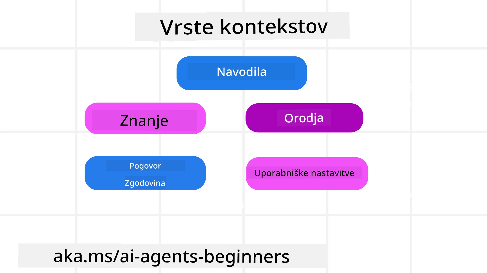
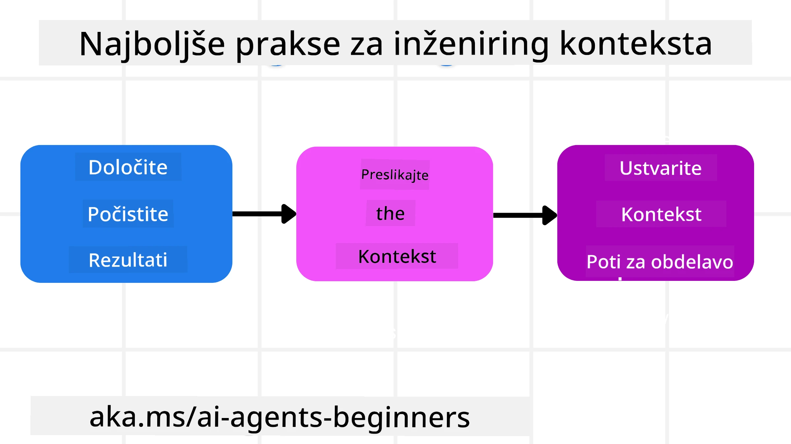

# Kontekstno inženirstvo za AI agente

> _(Kliknite na zgornjo sliko za ogled posnetka lekcije)_

Razumevanje kompleksnosti aplikacije, za katero razvijate AI agenta, je pomembno za izdelavo zanesljivega. Moramo ustvariti AI agente, ki učinkovito upravljajo informacije, da zadovoljijo zapletene potrebe, ki presegajo samo oblikovanje pozivov.

V tej lekciji si bomo ogledali, kaj je kontekstno inženirstvo in kakšno vlogo ima pri gradnji AI agentov.

## Uvod

Ta lekcija bo obravnavala:

• **Kaj je kontekstno inženirstvo** in zakaj se razlikuje od oblikovanja pozivov.

• **Strategije za učinkovito kontekstno inženirstvo**, vključno s pisanjem, izbiranjem, stiskanjem in izoliranjem informacij.

• **Pogoste napake v kontekstu**, ki lahko sabotirajo vašega AI agenta, in kako jih odpraviti.

## Cilji učenja

Po zaključku te lekcije boste razumeli, kako:

• **Določiti kontekstno inženirstvo** in ga razlikovati od oblikovanja pozivov.

• **Prepoznati ključne sestavine konteksta** v aplikacijah z velikimi jezikovnimi modeli (LLM).

• **Uporabiti strategije za pisanje, izbiro, stiskanje in izoliranje konteksta**, da izboljšate zmogljivost agenta.

• **Prepoznati pogoste napake v kontekstu**, kot so zastrupitev, motnje, zmeda in konflikt, ter uvesti tehnike za zmanjševanje teh težav.

## Kaj je kontekstno inženirstvo?

Za AI agente je kontekst tisto, kar usmerja načrtovanje agenta k določenim dejanjem. Kontekstno inženirstvo je praksa zagotavljanja, da ima AI agent prave informacije za dokončanje naslednjega koraka naloge. Okno konteksta je omejeno po velikosti, zato moramo kot razvijalci agentov ustvariti sisteme in postopke za upravljanje dodajanja, odstranjevanja in kondenziranja informacij v oknu konteksta.

### Oblikovanje poziva vs. kontekstno inženirstvo

Oblikovanje poziva se osredotoča na en nabor statičnih navodil za učinkovito usmerjanje AI agentov s pravilnim nizom pravil. Kontekstno inženirstvo pa pomeni upravljanje dinamičnega nabora informacij, vključno z začetnim pozivom, da se zagotovi, da ima AI agent skozi čas vse, kar potrebuje. Glavna ideja kontekstnega inženirstva je, da je ta postopek ponovljiv in zanesljiv.

### Vrste konteksta

Pomembno je vedeti, da kontekst ni zgolj ena stvar. Informacije, ki jih AI agent potrebuje, lahko prihajajo iz različnih virov, in na nas je, da zagotovimo dostop agenta do teh virov:

Vrste konteksta, ki jih mora AI agent morda upravljati, vključujejo:

• **Navodila:** To so kot "pravila" agenta – pozivi, sistemska sporočila, primeri z nekaj posnetki (ki pokažejo AI, kako nekaj narediti) in opisi orodij, ki jih lahko uporablja. Tukaj se prepletata oblikovanje poziva in kontekstno inženirstvo.

• **Znanje:** Sem spadajo dejstva, informacije pridobljene iz baz podatkov ali dolgoročni spomini, ki jih je agent nabrala. To vključuje integracijo sistema za pridobivanje podatkov (RAG), če agent potrebuje dostop do različnih skladišč znanja in baz podatkov.

• **Orodja:** To so definicije zunanjih funkcij, API-jev in MCP strežnikov, ki jih lahko agent kliče, skupaj z odzivi (rezultati), ki jih prejme ob uporabi.

• **Zgodovina pogovora:** Trenutni dialog z uporabnikom. Z časom ti pogovori postajajo daljši in bolj kompleksni, kar pomeni, da zavzamejo več prostora v oknu konteksta.

• **Uporabniške preference:** Informacije, ki so bile skozi čas pridobljene o uporabnikovih željah ali nepripravljenosti. Te se lahko shranijo in uporabijo pri ključnih odločitvah za pomoč uporabniku.

## Strategije za učinkovito kontekstno inženirstvo

### Strategije načrtovanja

Dobro kontekstno inženirstvo se začne z dobrim načrtovanjem. Tukaj je pristop, ki vam bo pomagal začeti razmišljati o tem, kako uporabiti koncept kontekstnega inženirstva:

1. **Določite jasne rezultate** – Rezultati nalog, ki jih bodo AI agenti opravljali, naj bodo jasno opredeljeni. Odgovorite na vprašanje: "Kako bo svet izgledal, ko bo AI agent zaključil svojo nalogo?" Z drugimi besedami, kakšna sprememba, informacija ali odziv naj uporabnik prejme po interakciji z AI agentom.
2. **Načrtujte kontekst** – Ko ste določili rezultate AI agenta, morate odgovoriti na vprašanje: "Kakšne informacije potrebuje AI agent, da dokonča to nalogo?" Tako lahko začnete načrtovati kontekst, kje se te informacije nahajajo.
3. **Ustvarite kontekstne tokove** – Zdaj, ko veste, kje so informacije, morate odgovoriti na vprašanje: "Kako bo agent pridobil te informacije?" To lahko opravite na različne načine, vključno z uporabo RAG, MCP strežnikov in drugih orodij.

### Praktične strategije

Načrtovanje je pomembno, vendar ko informacije začnejo pritekati v okno konteksta našega agenta, potrebujemo praktične strategije za upravljanje:

#### Upravljanje konteksta

Medtem ko bo nekaj informacij dodanih samodejno, je kontekstno inženirstvo aktivnejši pristop k tem informacijam, ki ga je mogoče uresničiti z nekaj strategijami:

1. **Agentov zvezek za beležke**  
Omogoča AI agentu, da beleži relevantne informacije o trenutnih nalogah in interakcijah z uporabnikom med eno sejo. Naj bo shranjen zunaj okna konteksta v datoteki ali zagonu objekta, ki ga lahko agent kasneje po potrebi pridobi med to sejo.

2. **Spomini**  
Zvezki za beležke so dobri za upravljanje informacij zunaj okna konteksta ene same seje. Spomini omogočajo agentom shranjevanje in pridobivanje relevantnih informacij čez več sej. To lahko vključuje povzetke, uporabniške preference in povratne informacije za prihodnje izboljšave.

3. **Stiskanje konteksta**  
Ko okno konteksta raste in se približuje meji, lahko uporabimo tehnike, kot so povzemanje in obrezovanje. To lahko pomeni hranjenje samo najbolj pomembnih informacij ali odstranjevanje starejših sporočil.

4. **Sistemi z več agenti**  
Razvijanje sistemov z več agenti je oblika kontekstnega inženirstva, ker ima vsak agent svoje okno konteksta. Kako se ta kontekst deli in prenaša med različnimi agenti, je nekaj, kar je treba načrtovati pri gradnji teh sistemov.

5. **Sandbox okolja**  
Če agent potrebuje zagnati kodo ali obdelati veliko količino informacij v dokumentu, to lahko zahteva veliko žetonov za obdelavo rezultatov. Namesto da bi vse to hranili v oknu konteksta, lahko agent uporabi sandbox okolje, ki omogoča izvajanje kode in prebere samo rezultate ter druge relevantne informacije.

6. **Objekti stanja pri izvajanju**  
To se naredi z ustvarjanjem vsebnikov informacij za upravljanje situacij, ko agent potrebuje dostop do določenih informacij. Za kompleksno nalogo bi to agentu omogočilo shranjevanje rezultatov posameznih podnalog korak za korakom, kar omogoča, da kontekst ostane povezan samo s to specifično podnalogo.

#### Pregledovanje konteksta

Ko uporabite eno od teh strategij, je vredno preveriti, kaj je naslednji klic modela dejansko prejel. Uporaben debug vprašanje je:

> Ali je agent naložil preveč konteksta, napačen kontekst ali pa mu je manjkal kontekst, ki ga je potreboval?

Za odgovor na to vprašanje ni treba beležiti surovih pozivov, izhodov orodij ali vsebine spomina. V produkciji raje uporabljajte majhne zapise pregleda konteksta, ki zajamejo števila, ID-je, hashe in oznake pravil:

- **Izbira:** Spremljajte, koliko kandidatovih kosov, orodij ali spominov je bilo upoštevanih, koliko je bilo izbranih in katero pravilo ali ocena je povzročila filtracijo ostalih.
- **Stiskanje:** Zabeležite obseg vira ali sledilni ID, ID povzetka, ocenjeno število žetonov pred in po stiskanju ter ali je bila surova vsebina izključena iz naslednjega klica.
- **Izolacija:** Zapišite, katera podnaloga je tekla v ločenem agentu, seji ali sandboxu, kakšen omejen povzetek je bil vrnjen in ali je veliki izhod orodij ostal zunaj glavnega konteksta agenta.
- **Spomin in RAG:** Shranjujte ID-je pridobitnih dokumentov, ID-je spominov, ocene, izbrane ID-je in stanje redakcije namesto celotnega pridobljenega besedila.
- **Varnost in zasebnost:** Raje uporabljajte hashe, ID-je, vedra za žetone in oznake pravil namesto občutljivega besedila poziva, argumentov orodij, rezultatov orodij ali vsebine uporabniških spominov.

Cilj ni hraniti več konteksta, temveč pustiti dovolj dokazov, da razvijalec lahko ugotovi, katera strategija konteksta je bila uporabljena in ali je spremenila naslednji klic modela na želeni način.

### Primer kontekstnega inženirstva

Recimo, da želimo, da AI agent **"Rezervira potovanje v Pariz."**

• Enostaven agent, ki uporablja le oblikovanje poziva, bi lahko enostavno odgovoril: **"V redu, kdaj bi radi šli v Pariz?"** Odgovor bi obdelal samo vaše neposredno vprašanje ob trenutku, ko ste ga zastavili.

• Agent, ki uporablja strategije kontekstnega inženirstva, bi naredil mnogo več. Preden bi sploh odgovoril, bi njegov sistem lahko:

  ◦ **Preveril vaš koledar** za razpoložljive datume (pridobivanje podatkov v realnem času).

 ◦ **Približal pretekle potovalne preference** (iz dolgoročnega spomina), kot je vaša priljubljena letalska družba, proračun ali ali imate raje neposredne lete.

 ◦ **Identificiral razpoložljiva orodja** za rezervacijo letov in hotelov.

- Nato bi lahko bil primer odgovora: "Živjo [Vaše ime]! Vidim, da ste prosti prvi teden oktobra. Ali naj iščem neposredne lete v Pariz z [priljubljeno letalsko družbo] znotraj vašega običajnega proračuna [proračun]?" Ta bogat, kontekstno ozaveščen odgovor prikazuje moč kontekstnega inženirstva.

## Pogoste napake pri upravljanju konteksta

### Zastrupitev konteksta

**Kaj je:** Ko se v kontekst vnese halucinacija (napačna informacija, ki jo generira LLM) ali napaka in se večkrat navaja, zaradi česar agent zasleduje nemogoče cilje ali razvija nesmiselne strategije.

**Kaj storiti:** Uvedite **overjanje konteksta** in **karanteno**. Preverjajte informacije pred dodajanjem v dolgoročni spomin. Če zaznate potencialno zastrupitev, začnite nove nitke konteksta, da preprečite širjenje napačnih informacij.

**Primer rezervacije potovanja:** Vaš agent halucinira **neposredni let z majhnega lokalnega letališča do oddaljenega mednarodnega mesta**, ki v resnici ne ponuja mednarodnih letov. Ta neobstoječi podatek o letu se shrani v kontekst. Kasneje, ko prosite agenta za rezervacijo, se ta vztrajno trudi najti vozovnice za to nemogočo pot, zaradi česar prihaja do ponavljajočih se napak.

**Rešitev:** Uvedite korak, ki **preveri obstoj in poti letov z realno API povezavo** _pred_ dodajanjem podatka o letu v delovni kontekst agenta. Če preverjanje ne uspe, se napačna informacija "karanteni" in se je ne uporablja naprej.

### Motnja v kontekstu

**Kaj je:** Ko kontekst postane tako velik, da se model preveč osredotoča na nabrano zgodovino namesto na to, kar se je naučil med usposabljanjem, kar vodi v ponavljajoča ali nekoristna dejanja. Modeli lahko začnejo delati napake še preden je okno konteksta polno.

**Kaj storiti:** Uporabite **povzemanje konteksta**. Občasno stisnite nabrane informacije v krajše povzetke, pri čemer ohranite pomembne podrobnosti in odstranite odvečno zgodovino. To pomaga "ponastaviti" osredotočenost.

**Primer rezervacije potovanja:** Dolgo ste govorili o različnih sanjskih potovalnih destinacijah, vključno z podrobnim pripovedovanjem o vaši nahrbtnikarski turi pred dvema letoma. Ko končno prosite, da **"najdem poceni let za naslednji mesec,"** se agent zaplete v stare, nepomembne podrobnosti in vas ves čas sprašuje o vaši opremi ali preteklih načrtih, ne da bi upošteval trenutno zahtevo.

**Rešitev:** Po določenem številu krogov ali če kontekst postane prevelik, naj agent **povzame zadnje in najbolj relevantne dele pogovora** – osredotočeno na vaše trenutne datume potovanja in destinacijo – in uporabi ta skondenziran povzetek za naslednji klic LLM, medtem ko zavrže manj pomemben zgodovinski pogovor.

### Zmeda v kontekstu

**Kaj je:** Ko nepotreben kontekst, pogosto v obliki prevelikega števila razpoložljivih orodij, povzroči, da model generira slabe odgovore ali kliče nepomembna orodja. Manjši modeli so za to še posebej dovzetni.

**Kaj storiti:** Uvedite **upravljanje obremenitve orodij** z uporabo tehnik RAG. Shranjujte opise orodij v vektorski bazi in izbirajte _samo_ najbolj relevantna orodja za vsako specifično nalogo. Raziskave kažejo, da je najbolje omejiti izbor orodij na manj kot 30.

**Primer rezervacije potovanja:** Vaš agent ima dostop do več deset orodij: `book_flight`, `book_hotel`, `rent_car`, `find_tours`, `currency_converter`, `weather_forecast`, `restaurant_reservations` itd. Prosite: **"Kateri je najboljši način za premikanje po Parizu?"** Zaradi velikega števila orodij se agent zmede in poskuša klicati `book_flight` _v_ Parizu ali `rent_car`, čeprav imate raje javni prevoz, ker se opisi orodij prekrivajo ali pa ne zna izbrati najboljšega.

**Rešitev:** Uporabite **RAG nad opisi orodij**. Ko vprašate, kako se premikati po Parizu, sistem dinamično pridobi _samo_ najbolj relevantna orodja, kot sta `rent_car` ali `public_transport_info` glede na vašo poizvedbo, in predstavi osredotočen "nabor" orodij modelu LLM.

### Konflikt v kontekstu

**Kaj je:** Ko v kontekstu obstajajo nasprotujoče si informacije, kar vodi v nekonsistentno sklepanje ali slabe končne odzive. Pogosto se to zgodi, ko informacije prispejo postopoma, in zgodnje napačne predpostavke ostanejo v kontekstu.

**Kaj storiti:** Uporabite **obrezovanje konteksta** in **odlaganje**. Obrezovanje pomeni odstranjevanje zastarelih ali nasprotujočih si informacij, ko prispevajo nove podrobnosti. Odlaganje daje modelu ločeno "delovno površino" za obdelavo informacij brez zamegljevanja glavnega konteksta.
**Primer rezervacije potovanja:** Sprva agentu poveste, **"Želim leteti v ekonomski razred."** Kasneje v pogovoru spremenite mnenje in rečete, **"Pravzaprav za to potovanje pojdimo v poslovni razred."** Če obe navodili ostaneta v kontekstu, lahko agent dobi nasprotujoče si rezultate iskanja ali se zmede, katero željo naj da prednost.

**Rešitev:** Uvedite **obrezovanje konteksta**. Ko nova navodila nasprotujejo starejšim, se starejša navodila odstranijo ali eksplicitno nadomestijo v kontekstu. Alternativno lahko agent uporabi **skicirni blok**, da uskladi nasprotujoče si želje pred odločitvijo, tako da le končno, dosledno navodilo usmerja njegove dejavnosti.

## Imate več vprašanj o inženirstvu konteksta?

Pridružite se [Microsoft Foundry Discord](https://discord.com/invite/ATgtXmAS5D), da se srečate z drugimi učenci, obiščete pisarne za vprašanja in dobite odgovore na vaša vprašanja o AI agentih.

---

<!-- CO-OP TRANSLATOR DISCLAIMER START -->
**Omejitev odgovornosti**:
Ta dokument je bil preveden z uporabo AI prevajalske storitve [Co-op Translator](https://github.com/Azure/co-op-translator). Čeprav si prizadevamo za natančnost, vas prosimo, da upoštevate, da avtomatizirani prevodi lahko vsebujejo napake ali netočnosti. Izvirni dokument v njegovem izvirnem jeziku je treba obravnavati kot avtoritativni vir. Za kritične informacije je priporočljiv strokovni človeški prevod. Ne odgovarjamo za morebitna nesporazume ali napačne interpretacije, ki izhajajo iz uporabe tega prevoda.
<!-- CO-OP TRANSLATOR DISCLAIMER END -->