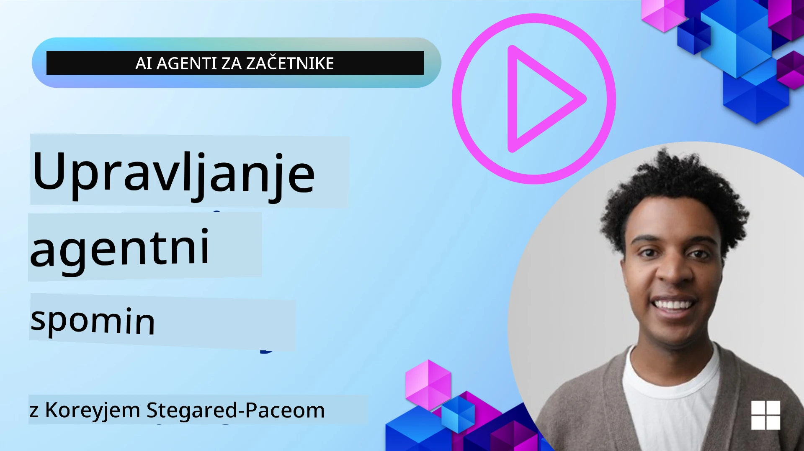

# Memoria za AI agente 

Ko govorimo o edinstvenih prednostih ustvarjanja AI agentov, se običajno izpostavljata dve glavni stvari: sposobnost klica orodij za dokončanje nalog in sposobnost izboljševanja skozi čas. Pomnilnik je temelj ustvarjanja samopopravljenega agenta, ki lahko ustvari boljše izkušnje za naše uporabnike.

V tej lekciji si bomo ogledali, kaj je pomnilnik za AI agente in kako ga lahko upravljamo ter uporabimo v prid našim aplikacijam.

## Uvod

Ta lekcija bo obravnavala:

• **Razumevanje pomnilnika AI agentov**: Kaj je pomnilnik in zakaj je bistven za agente.

• **Implementacija in shranjevanje pomnilnika**: Praktične metode za dodajanje sposobnosti pomnilnika vašim AI agentom, s poudarkom na kratkoročnem in dolgoročnem pomnilniku.

• **Nareditev AI agentov samopopravljivih**: Kako pomnilnik omogoča agentom učenje iz preteklih interakcij in izboljševanje skozi čas.

## Na voljo implementacije

Ta lekcija vsebuje dva obsežna vodnika v zvezkih:

• **[13-agent-memory.ipynb](./13-agent-memory.ipynb)**: Implementira pomnilnik z uporabo Mem0 in Azure AI Search z Microsoft Agent Framework

• **[13-agent-memory-cognee.ipynb](./13-agent-memory-cognee.ipynb)**: Implementira strukturiran pomnilnik z uporabo Cognee, ki samodejno gradi graf znanja podprt z embeddingi, vizualizira graf in omogoča inteligentno iskanje

## Cilji učenja

Po zaključku te lekcije boste vedeli, kako:

• **Razlikovati med različnimi vrstami pomnilnika AI agentov**, vključno z delovnim, kratkoročnim in dolgoročnim pomnilnikom, pa tudi specializiranimi oblikami, kot sta persona in epizodični pomnilnik.

• **Implementirati in upravljati kratkoročni in dolgoročni pomnilnik za AI agente** z uporabo Microsoft Agent Framework, izkoriščanjem orodij, kot so Mem0, Cognee, Whiteboard memory, ter integracijo z Azure AI Search.

• **Razumeti načela za samopopravljive AI agente** in kako robustni sistemi upravljanja pomnilnika prispevajo k nenehnemu učenju in prilagajanju.

## Razumevanje pomnilnika AI agentov

V svoji jedru **pomnilnik za AI agente pomeni mehanizme, ki jim omogočajo ohranjanje in priklic informacij**. Te informacije so lahko specifični podatki o pogovoru, uporabniške preference, pretekla dejanja ali celo naučeni vzorci.

Brez pomnilnika so AI aplikacije pogosto brezstanje (stateless), kar pomeni, da vsaka interakcija začne znova. To vodi v ponavljajočo se in frustrirajočo uporabniško izkušnjo, kjer agent "pozabi" prejšnji kontekst ali preference.

### Zakaj je pomnilnik pomemben?

Inteligenca agenta je močno povezana z njegovo sposobnostjo priklica in uporabe preteklih informacij. Pomnilnik agentom omogoča, da so:

• **Reflektivni**: Učenje iz preteklih dejanj in rezultatov.

• **Interaktivni**: Ohranjanje konteksta v teku pogovora.

• **Proaktivni in reaktivni**: Predvidevanje potreb ali ustrezno odzivanje na podlagi zgodovinskih podatkov.

• **Avtonomni**: Bolj neodvisno delovanje z uporabo shranjenega znanja.

Cilj implementacije pomnilnika je narediti agente bolj **zanesljive in sposobne**.

### Vrste pomnilnika

#### Delovni pomnilnik

Predstavljajte si to kot kos beležnice, ki jo agent uporablja med eno tekočo nalogo ali miselnim procesom. Vsebuje neposredne informacije, potrebne za izračun naslednjega koraka.

Za AI agente delovni pomnilnik pogosto zajame najustreznejše informacije iz pogovora, tudi če je celotna zgodovina pogovora dolga ali skrajšana. Osredotoča se na izluščitev ključnih elementov, kot so zahteve, predlogi, odločitve in ukrepi.

**Primer delovnega pomnilnika**

Pri agentu za rezervacijo potovanj bi delovni pomnilnik lahko zajel trenutno zahtevo uporabnika, na primer "Želim rezervirati potovanje v Pariz". Ta specifična zahteva se hrani v neposrednem kontekstu agenta, da usmerja trenutno interakcijo.

#### Kratkoročni pomnilnik

Ta vrsta pomnilnika ohranja informacije za čas trajanja enega pogovora ali seje. To je kontekst trenutnega pogovora, ki agentu omogoča sklicevanje na prejšnje zanke v dialogu.

**Primer kratkoročnega pomnilnika**

Če uporabnik vpraša: "Koliko bi stal let v Pariz?" in nato doda: "Kaj pa nastanitev tam?", kratkoročni pomnilnik zagotovi, da agent ve, da se "tam" v istem pogovoru nanaša na "Pariz".

#### Dolgoročni pomnilnik

To so informacije, ki vztrajajo čez več pogovorov ali sej. Omogoča agentom, da si zapomnijo uporabniške preference, zgodovinske interakcije ali splošno znanje v daljšem časovnem obdobju. To je pomembno za personalizacijo.

**Primer dolgoročnega pomnilnika**

Dolgoročni pomnilnik bi lahko shranil, da "Ben uživa v smučanju in dejavnostih na prostem, ima rad kavo z razgledom na gore in se želi izogibati zahtevnim smučarskim progah zaradi pretekle poškodbe". Te informacije, pridobljene iz prejšnjih interakcij, vplivajo na priporočila v prihodnjih načrtih potovanja, zaradi česar so zelo personalizirana.

#### Persona pomnilnik

Ta specializirana vrsta pomnilnika pomaga agentu razviti konstantno "osebnost" ali "persono". Daje agentu možnost, da si zapomni podrobnosti o sebi ali svoji vlogi, zaradi česar so interakcije bolj tekoče in osredotočene.

**Primer persona pomnilnika**
Če je potovalni agent zasnovan kot "strokovnjak za smučanje", lahko persona pomnilnik okrepi to vlogo in vpliva na njegove odgovore, da se ujemajo s tonom in znanjem strokovnjaka.

#### Delovni/epizodični pomnilnik

Ta pomnilnik shranjuje zaporedje korakov, ki jih agent izvede med kompleksno nalogo, vključno z uspehi in neuspehi. Podobno kot spominjanje specifičnih "epizod" ali preteklih izkušenj, da se iz njih nekaj nauči.

**Primer epizodičnega pomnilnika**

Če je agent poskušal rezervirati določen let, a je to spodletelo zaradi nedostopnosti, bi epizodični pomnilnik lahko zabeležil ta neprijeten poskus, kar agentu omogoči, da poskusi alternative ali obvesti uporabnika o težavi bolj informirano pri naslednjem poskusu.

#### Entitetni pomnilnik

To vključuje izluščevanje in zapomnitev specifičnih entitet (kot so ljudje, kraji ali stvari) in dogodkov iz pogovorov. Agentu omogoča gradnjo strukturiranega razumevanja ključnih elementov pogovora.

**Primer entitetnega pomnilnika**

Iz pogovora o preteklem potovanju bi agent lahko izluščil "Pariz", "Eifflov stolp" in "večerja v restavraciji Le Chat Noir" kot entitete. Pri prihodnji interakciji bi se agent lahko spomnil "Le Chat Noir" in ponudil, da ponovno rezervira mizo tam.

#### Structured RAG (Retrieval Augmented Generation)

Medtem ko je RAG širša tehnika, je "Structured RAG" izpostavljen kot močna tehnologija pomnilnika. Izlušči gosto, strukturirano informacijo iz različnih virov (pogovori, e-pošta, slike) in jo uporablja za izboljšanje natančnosti, priklica in hitrosti odgovorov. V nasprotju s klasičnim RAG, ki temelji izključno na semantični podobnosti, Structured RAG deluje znotraj same strukture informacij.

**Primer Structured RAG**

Namesto da bi le ujemal ključne besede, bi Structured RAG lahko izpisal podrobnosti leta (destinacija, datum, čas, letalska družba) iz e-pošte in jih shranil na strukturiran način. To omogoča natančna poizvedovanja, kot je "Kateri let sem rezerviral v Pariz v torek?"

## Implementacija in shranjevanje pomnilnika

Implementacija pomnilnika za AI agente vključuje sistematičen postopek upravljanja pomnilnika, ki vključuje generiranje, shranjevanje, priklic, integracijo, posodabljanje in celo "pozabljanje" (ali brisanje) informacij. Priklic je še posebej ključni vidik.

### Specializirana orodja za pomnilnik

#### Mem0

Eden od načinov za shranjevanje in upravljanje pomnilnika agenta je uporaba specializiranih orodij, kot je Mem0. Mem0 deluje kot trajna plast pomnilnika, ki agentom omogoča priklic relevantnih interakcij, shranjevanje uporabniških preferenc in dejanskega konteksta ter učenje iz uspehov in neuspehov skozi čas. Ideja je, da se stateless agenti spremenijo v stateful.

Deluje skozi **dvofazni pomnilniški potek: izluščevanje in posodobitev**. Najprej se sporočila, dodana v nit agenta, pošljejo v storitev Mem0, ki uporablja velik jezikovni model (LLM) za povzemanje zgodovine pogovora in izluščevanje novih spominov. V nadaljevanju faza posodobitve, ki jo vodi LLM, določi, ali je treba te spomine dodati, spremeniti ali izbrisati, pri čemer jih shrani v hibridno podatkovno shrambo, ki lahko vključuje vektorsko, grafno in ključ-vrednost bazo. Ta sistem prav tako podpira različne vrste pomnilnika in lahko vključi grafovni pomnilnik za upravljanje odnosov med entitetami.

#### Cognee

Drug močan pristop je uporaba **Cognee**, odprtokodnega semantičnega pomnilnika za AI agente, ki strukturirane in nestrukturirane podatke pretvori v poizvedljiv graf znanja, podprt z embeddingi. Cognee ponuja **arhitekturo z dvema shrambama**, ki združuje vektorsko iskanje podobnosti z grafnimi odnosi, kar agentom omogoča razumevanje ne le tega, katera informacija je podobna, temveč tudi kako koncepti med seboj sobivajo.

Odlikuje se v **hibridnem priklicu**, ki združuje vektorsko podobnost, grafno strukturo in LLM sklepanje - od surovega iskanja po chunkih do grafu prijaznega odgovarjanja na vprašanja. Sistem vzdržuje **živ pomnilnik**, ki se razvija in raste, hkrati pa ostaja poizvedljiv kot en povezan graf, podpira tako kratkoročni kontekst seje kot dolgoročni trajni pomnilnik.

Vadnica v zvezku Cognee ([13-agent-memory-cognee.ipynb](./13-agent-memory-cognee.ipynb)) prikazuje izgradnjo te združene plasti pomnilnika, z praktičnimi primeri vpisa raznolikih virov podatkov, vizualizacijo grafa znanja in poizvedovanjem z različnimi strategijami iskanja, prilagojenimi potrebam določenih agentov.

### Shranjevanje pomnilnika z RAG

Poleg specializiranih orodij za pomnilnik, kot je mem0, lahko kot hrbtenico za shranjevanje in priklic spominov uporabite tudi robustne iskalne storitve, kot je **Azure AI Search**, zlasti za strukturiran RAG.

To vam omogoča, da temeljujete odgovore agenta na lastnih podatkih, kar zagotavlja bolj relevantne in natančne odgovore. Azure AI Search se lahko uporablja za shranjevanje uporabniško specifičnih potovalnih spominov, katalogov izdelkov ali katere koli druge domensko specifične zbirke znanja.

Azure AI Search podpira zmogljivosti, kot je **Structured RAG**, ki izstopa pri izluščevanju in priklicu gostih, strukturiranih informacij iz velikih zbirk podatkov, kot so zgodovine pogovorov, e-pošta ali celo slike. To zagotavlja "nadčloveško natančnost in priklic" v primerjavi s tradicionalnimi pristopi segmentiranja besedila in embeddingov.

## Nareditev AI agentov samopopravljivih

Pogost vzorec za samopopravljive agente vključuje uvedbo **"knowledge agenta"**. Ta ločen agent opazuje glavni pogovor med uporabnikom in primarnim agentom. Njegova vloga je:

1. **Prepoznati dragocene informacije**: Določiti, ali je katerikoli del pogovora vreden shranjevanja kot splošno znanje ali specifična uporabniška preferenca.

2. **Izluščevanje in povzemanje**: Destilirati bistveno učenje ali preference iz pogovora.

3. **Shranjevanje v bazo znanja**: Ohranjanje teh izluščenih informacij, pogosto v vektorski bazi podatkov, da jih je mogoče pozneje priklicati.

4. **Obogatitev prihodnjih poizvedb**: Ko uporabnik začne novo poizvedbo, knowledge agent prikliče relevantne shranjene informacije in jih pripne v poziv uporabnika, da zagotovi ključen kontekst primarnemu agentu (podobno kot RAG).

### Optimizacije za pomnilnik

• **Upravljanje latence**: Da se izognete upočasnitvi uporabniških interakcij, lahko sprva uporabite cenejši, hitrejši model za hitro preverjanje, ali je informacija vredna shranjevanja ali priklica, in šele po potrebi sprožite bolj kompleksen postopek izluščevanja/priklica.

• **Vzdrževanje baze znanja**: Za rastočo bazo znanja se manj pogosto uporabljene informacije lahko preselijo v "hladno shrambo", da se upravljajo stroški.

## Imate več vprašanj o pomnilniku agentov?

Pridružite se [Microsoft Foundry Discord](https://aka.ms/ai-agents/discord) za srečanja z drugimi učenjaki, udeležbo uradnih ur in za odgovor na vaša vprašanja o AI agentih.

---

<!-- CO-OP TRANSLATOR DISCLAIMER START -->
Izjava o omejitvi odgovornosti:
Ta dokument je bil preveden z uporabo storitve za prevajanje z umetno inteligenco [Co-op Translator](https://github.com/Azure/co-op-translator). Čeprav si prizadevamo za natančnost, upoštevajte, da avtomatizirani prevodi lahko vsebujejo napake ali netočnosti. Izvirni dokument v njegovem izvirnem jeziku se šteje za uradni vir. Za kritične informacije priporočamo strokovni prevod, opravljen s strani človeka. Ne odgovarjamo za kakršnekoli nesporazume ali napačne razlage, ki izhajajo iz uporabe tega prevoda.
<!-- CO-OP TRANSLATOR DISCLAIMER END -->