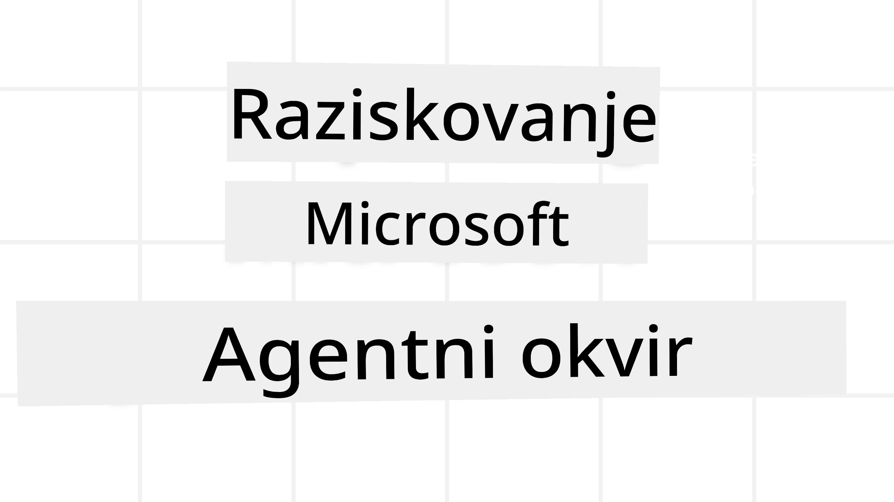
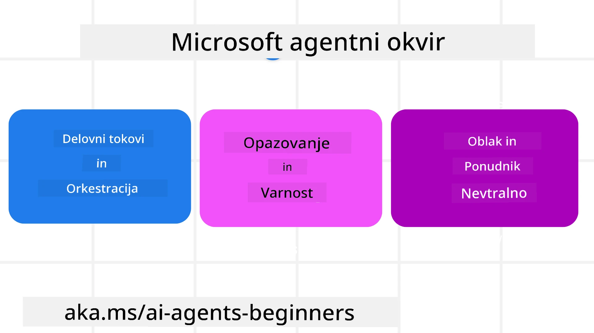

# Raziščemo Microsoft Agent Framework



### Uvod

Ta lekcija bo zajemala:

- Razumevanje Microsoft Agent Framework: Ključne funkcije in vrednost  
- Raziskovanje ključnih konceptov Microsoft Agent Framework
- Napredni MAF vzorci: Delovni procesi, Middleware in pomnilnik

## Cilji učenja

Po zaključku te lekcije boste znali:

- Zgraditi proizvodne AI agente z uporabo Microsoft Agent Framework
- Uporabiti osnovne funkcije Microsoft Agent Framework za vaše agentske primere uporabe
- Uporabiti napredne vzorce, vključno z delovnimi procesi, middleware in opazovanjem

## Vzorce kode

Vzorce kode za [Microsoft Agent Framework (MAF)](https://aka.ms/ai-agents-beginners/agent-framewrok) lahko najdete v tem repozitoriju pod datotekami `xx-python-agent-framework` in `xx-dotnet-agent-framework`.

## Razumevanje Microsoft Agent Framework



[Microsoft Agent Framework (MAF)](https://aka.ms/ai-agents-beginners/agent-framewrok) je Microsoftov enotni okvir za gradnjo AI agentov. Omogoča prilagodljivost za reševanje širokega spektra agentskih primerov uporabe, ki jih vidimo tako v produkciji kot raziskovalnih okoljih, vključno z:

- **Zaporedno orkestracijo agentov** v scenarijih, kjer so potrebni korak za korakom delovni procesi.
- **Sodobno orkestracijo** v scenarijih, kjer agenti potrebujejo istočasno dokončati naloge.
- **Orkestracijo skupinskega klepeta** v scenarijih, kjer lahko agenti sodelujejo pri eni nalogi.
- **Orkestracijo predaje** v scenarijih, kjer agenti predajo nalogo drug drugemu, ko so podnaloge končane.
- **Magnetno orkestracijo** v scenarijih, kjer upravljavski agent ustvarja in spreminja seznam nalog ter usklajuje podagente za dokončanje naloge.

Za zagotavljanje AI agentov v produkciji MAF vključuje tudi funkcije za:

- **Opazovanje** prek uporabe OpenTelemetry, kjer vsak ukrep AI agenta vključuje klic orodja, korake orkestracije, tokove sklepov in spremljanje zmogljivosti prek Microsoft Foundry nadzornih plošč.
- **Varnost** z gostovanjem agentov neposredno na Microsoft Foundry, ki vključuje varnostne kontrole, kot so dostop na podlagi vlog, ravnanje s privatnimi podatki in vgrajena varnost vsebin.
- **Vzdržljivost** saj lahko niti in delovni procesi agentov začasno presenetijo, nadaljujejo in se obnesejo po napakah, kar omogoča daljše trajanje procesov.
- **Nadzor** saj so omogočeni delovni procesi z vključenim človekom, kjer so naloge označene, da zahtevajo človeško odobritev.

Microsoft Agent Framework se tudi osredotoča na interoperabilnost z:

- **Neodvisnostjo od oblaka** - agenti lahko delujejo v kontejnerjih, na lokaciji in preko različnih oblakov.
- **Neodvisnostjo dobavitelja** - agenti lahko nastanejo z vašim priljubljenim SDK, vključno z Azure OpenAI in OpenAI
- **Integracijo odprtih standardov** - agenti lahko uporabljajo protokole, kot so Agent-to-Agent (A2A) in Model Context Protocol (MCP) za odkrivanje in uporabo drugih agentov in orodij.
- **Vtičniki in povezovalniki** - povezave se lahko vzpostavijo do storitev podatkov in pomnilnikov, kot so Microsoft Fabric, SharePoint, Pinecone in Qdrant.

Poglejmo, kako se te funkcije uporabljajo za nekatere ključne koncepte Microsoft Agent Framework.

## Ključni koncepti Microsoft Agent Framework

### Agenti


**Ustvarjanje agentov**

Ustvarjanje agenta poteka z določanjem storitve sklepanja (ponudnik LLM), niza navodil, ki jih AI agent sledi, in dodeljenega `imena`:

```python
agent = AzureOpenAIChatClient(credential=AzureCliCredential()).create_agent( instructions="You are good at recommending trips to customers based on their preferences.", name="TripRecommender" )
```

Zgoraj je uporabljen `Azure OpenAI`, vendar lahko agente ustvarite z različnimi storitvami, vključno z `Microsoft Foundry Agent Service`:

```python
AzureAIAgentClient(async_credential=credential).create_agent( name="HelperAgent", instructions="You are a helpful assistant." ) as agent
```

OpenAI `Responses`, `ChatCompletion` API-ji

```python
agent = OpenAIResponsesClient().create_agent( name="WeatherBot", instructions="You are a helpful weather assistant.", )
```

```python
agent = OpenAIChatClient().create_agent( name="HelpfulAssistant", instructions="You are a helpful assistant.", )
```

ali oddaljene agente z uporabo protokola A2A:

```python
agent = A2AAgent( name=agent_card.name, description=agent_card.description, agent_card=agent_card, url="https://your-a2a-agent-host" )
```

**Zagon agentov**

Agent se zažene s pomočjo metod `.run` ali `.run_stream` za nepretokovne ali pretočne odzive.

```python
result = await agent.run("What are good places to visit in Amsterdam?")
print(result.text)
```

```python
async for update in agent.run_stream("What are the good places to visit in Amsterdam?"):
    if update.text:
        print(update.text, end="", flush=True)

```

Vsak zagon agenta lahko vsebuje možnosti za prilagoditev parametrov, kot so `max_tokens`, ki jih agent uporablja, `orodja`, ki jih agent lahko kliče, in celo `model`, ki ga agent uporablja.

To je uporabno v primerih, ko za dokončanje uporabnikove naloge potrebujete specifične modele ali orodja.

**Orodja**

Orodja je mogoče določiti tako pri definiranju agenta:

```python
def get_attractions( location: Annotated[str, Field(description="The location to get the top tourist attractions for")], ) -> str: """Get the top tourist attractions for a given location.""" return f"The top attractions for {location} are." 


# Ko neposredno ustvarjate ChatAgent

agent = ChatAgent( chat_client=OpenAIChatClient(), instructions="You are a helpful assistant", tools=[get_attractions]

```

kot tudi pri zagonu agenta:

```python

result1 = await agent.run( "What's the best place to visit in Seattle?", tools=[get_attractions] # Orodje na voljo samo za to izvajanje )
```

**Niti agentov**

Niti agentov se uporabljajo za obravnavo pogovorov z več potezami. Niti lahko ustvarite z:

- Uporabo `get_new_thread()`, kar omogoča shranjevanje niti skozi čas
- Samodejnim ustvarjanjem niti ob zagonu agenta, kjer nit traja le med tekočim zagonom.

Za ustvarjanje niti izgleda koda takole:

```python
# Ustvari novo nit.
thread = agent.get_new_thread() # Zaženi agenta z nitjo.
response = await agent.run("Hello, I am here to help you book travel. Where would you like to go?", thread=thread)

```

Nit lahko nato serializirate za kasnejšo uporabo:

```python
# Ustvari novo nit.
thread = agent.get_new_thread() 

# Zaženi agenta z nitjo.

response = await agent.run("Hello, how are you?", thread=thread) 

# Serijaliziraj nit za shranjevanje.

serialized_thread = await thread.serialize() 

# Deserijaliziraj stanje niti po nalaganju iz shranjevanja.

resumed_thread = await agent.deserialize_thread(serialized_thread)
```

**Agent Middleware**

Agenti sodelujejo z orodji in LLM-ji, da dokončajo naloge uporabnika. V določenih scenarijih želimo izvajati ali slediti tem interakcijam. Agent middleware nam omogoča to preko:

*Funkcijskega middleware*

Ta middleware nam omogoča izvajanje dejanja med agentom in funkcijo/orodjem, ki jo agent kliče. Primer uporabe je, ko želite beležiti klic funkcije.

V spodnji kodi `next` določa, ali naj se kliče naslednji middleware ali dejanska funkcija.

```python
async def logging_function_middleware(
    context: FunctionInvocationContext,
    next: Callable[[FunctionInvocationContext], Awaitable[None]],
) -> None:
    """Function middleware that logs function execution."""
    # Predobdelava: Zabeleži pred izvajanjem funkcije
    print(f"[Function] Calling {context.function.name}")

    # Nadaljuj na naslednji vmesni program ali izvedbo funkcije
    await next(context)

    # Obdelava po: Zabeleži po izvajanju funkcije
    print(f"[Function] {context.function.name} completed")
```

*Chat middleware*

Ta middleware omogoča izvajanje ali beleženje dejanja med agentom in zahtevami med LLM.

Vsebuje pomembne informacije, kot so `messages`, ki se pošiljajo AI storitvi.

```python
async def logging_chat_middleware(
    context: ChatContext,
    next: Callable[[ChatContext], Awaitable[None]],
) -> None:
    """Chat middleware that logs AI interactions."""
    # Predobdelava: Zabeleži pred klicem AI
    print(f"[Chat] Sending {len(context.messages)} messages to AI")

    # Nadaljuj na naslednji vmesnik ali AI storitev
    await next(context)

    # Obdelava po: Zabeleži po odgovoru AI
    print("[Chat] AI response received")

```

**Pomnilnik agentov**

Kot je bilo pokrito v lekciji `Agentic Memory`, je pomnilnik pomemben element za omogočanje agenta delovati v različnih kontekstih. MAF ponuja več različic pomnilnika:

*Pomnilnik v pomnilniku*

To je pomnilnik, shranjen v nitih med izvajanjem aplikacije.

```python
# Ustvari novo nit.
thread = agent.get_new_thread() # Zaženi agent z nitjo.
response = await agent.run("Hello, I am here to help you book travel. Where would you like to go?", thread=thread)
```

*Trajni sporočili*

Ta pomnilnik se uporablja za shranjevanje zgodovine pogovora med različnimi sejami. Določen je z uporabo `chat_message_store_factory`:

```python
from agent_framework import ChatMessageStore

# Ustvari lastno shrambo sporočil
def create_message_store():
    return ChatMessageStore()

agent = ChatAgent(
    chat_client=OpenAIChatClient(),
    instructions="You are a Travel assistant.",
    chat_message_store_factory=create_message_store
)

```

*Dinamični pomnilnik*

Ta pomnilnik se doda v kontekst, preden se agenti zaženejo. Ti pomnilniki se lahko shranjujejo v zunanjih storitvah, kot je mem0:

```python
from agent_framework.mem0 import Mem0Provider

# Uporaba Mem0 za napredne zmogljivosti pomnilnika
memory_provider = Mem0Provider(
    api_key="your-mem0-api-key",
    user_id="user_123",
    application_id="my_app"
)

agent = ChatAgent(
    chat_client=OpenAIChatClient(),
    instructions="You are a helpful assistant with memory.",
    context_providers=memory_provider
)

```

**Opazovanje agentov**

Opazovanje je pomembno za gradnjo zanesljivih in vzdržljivih agentskih sistemov. MAF se integrira z OpenTelemetry za zagotavljanje sledenja in meritev za boljšo opazovalnost.

```python
from agent_framework.observability import get_tracer, get_meter

tracer = get_tracer()
meter = get_meter()
with tracer.start_as_current_span("my_custom_span"):
    # naredi nekaj
    pass
counter = meter.create_counter("my_custom_counter")
counter.add(1, {"key": "value"})
```

### Delovni procesi

MAF omogoča delovne procese, ki so vnaprej določeni koraki za dokončanje naloge in vključujejo AI agente kot komponente teh korakov.

Delovni procesi sestojijo iz različnih komponent, ki omogočajo boljši nadzor poteka. Omogočajo tudi **multi-agentno orkestracijo** in **checkpointing** za shranjevanje stanj delovnih procesov.

Osnovne komponente delovnega procesa so:

**Izvrševalci (Executors)**

Izvrševalci sprejemajo vhodna sporočila, opravijo določene naloge in nato proizvedejo izhodno sporočilo. To premakne delovni proces naprej proti dokončanju večje naloge. Izvrševalci so lahko AI agent ali prilagojena logika.

**Robovi (Edges)**

Robovi se uporabljajo za definiranje toka sporočil v delovnem procesu. Ti so lahko:

*Neposredni robovi* - Preproste povezave ena na ena med izvrševalci:

```python
from agent_framework import WorkflowBuilder

builder = WorkflowBuilder()
builder.add_edge(source_executor, target_executor)
builder.set_start_executor(source_executor)
workflow = builder.build()
```

*Pogojni robovi* - Aktivirajo se, ko je izpolnjen določen pogoj. Na primer, ko hotelskih sob ni na voljo, izvrševalec lahko predlaga druge možnosti.

*Preklopno-izbirni robovi* - Usmerjajo sporočila različnim izvrševalcem glede na določene pogoje. Na primer, če ima potnik prednostni dostop, bodo njegove naloge obdelane skozi drug delovni proces.

*Razvejeni robovi (Fan-out)* - Pošljite eno sporočilo več ciljem.

*Združeni robovi (Fan-in)* - Zberejo več sporočil iz različnih izvrševalcev in pošljejo enemu cilju.

**Dogodki**

Za boljšo opazljivost delovnih procesov MAF ponuja vgrajene dogodke za izvajanje, vključno z:

- `WorkflowStartedEvent`  - Začetek izvajanja delovnega procesa
- `WorkflowOutputEvent` - Delovni proces proizvede izhod
- `WorkflowErrorEvent` - Delovni proces naleti na napako
- `ExecutorInvokeEvent`  - Izvrševalec začne obdelavo
- `ExecutorCompleteEvent`  - Izvrševalec zaključi obdelavo
- `RequestInfoEvent` - Izdan je zahtevek

## Napredni MAF vzorci

Zgornji odseki pokrivajo ključne koncepte Microsoft Agent Framework. Ko gradite bolj kompleksne agente, upoštevajte nekaj naprednih vzorcev:

- **Sestavljanje middleware**: Povežite več middleware obdelovalcev (beleženje, avtentikacija, omejevanje hitrosti) z uporabo funkcijskega in chat middleware za natančen nadzor vedenja agenta.
- **Checkpointing delovnih procesov**: Uporabite dogodke delovnih procesov in serializacijo za shranjevanje in nadaljevanje dolgo trajajočih procesov agentov.
- **Dinamična izbira orodij**: Združite RAG preko opisov orodij z registracijo orodij v MAF za predstavitev le relevantnih orodij za posamezen poizvedbo.
- **Multi-Agent predaja**: Uporabite robove delovnih procesov in pogojno usmerjanje za orkestracijo predaj med specializiranimi agenti.

## Vzorce kode

Vzorce kode za Microsoft Agent Framework lahko najdete v tem repozitoriju pod datotekami `xx-python-agent-framework` in `xx-dotnet-agent-framework`.

## Imate več vprašanj o Microsoft Agent Framework?

Pridružite se [Microsoft Foundry Discord](https://aka.ms/ai-agents/discord), da se srečate z drugimi učenci, udeležite ur za podoporo in dobite odgovore na vaša vprašanja o AI agentih.

---

<!-- CO-OP TRANSLATOR DISCLAIMER START -->
**Omejitev odgovornosti**:
Ta dokument je bil preveden z uporabo storitve za prevajanje z umetno inteligenco [Co-op Translator](https://github.com/Azure/co-op-translator). Čeprav si prizadevamo za natančnost, vas opozarjamo, da lahko avtomatski prevodi vsebujejo napake ali netočnosti. Prvotni dokument v njegovem izvirnem jeziku velja za avtoritativni vir. Za pomembne informacije priporočamo strokovni človeški prevod. Nismo odgovorni za kakršna koli nesporazumevanja ali napačne razlage, ki izhajajo iz uporabe tega prevoda.
<!-- CO-OP TRANSLATOR DISCLAIMER END -->