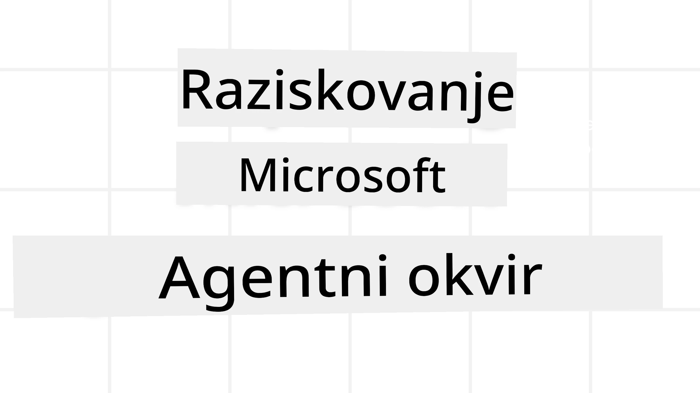
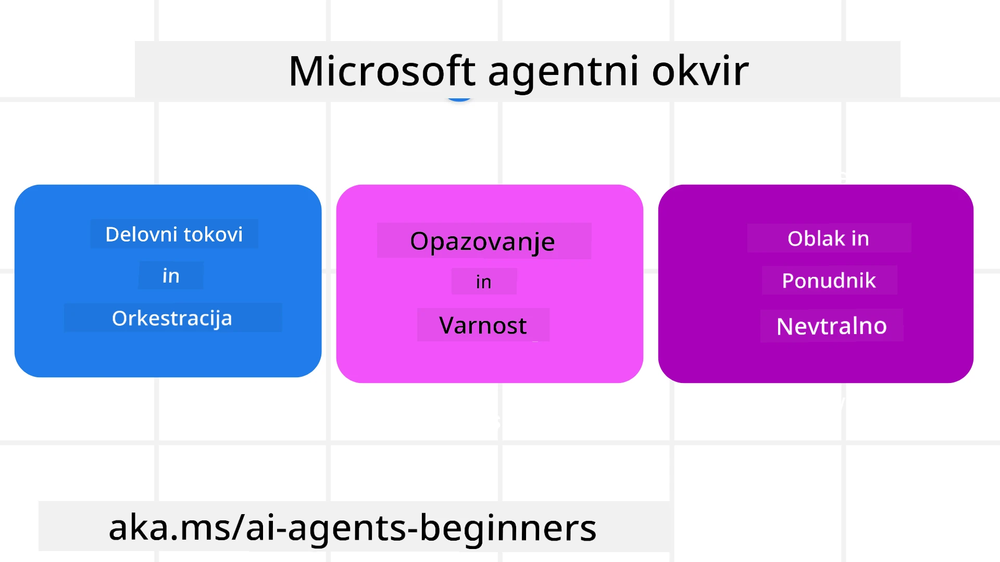
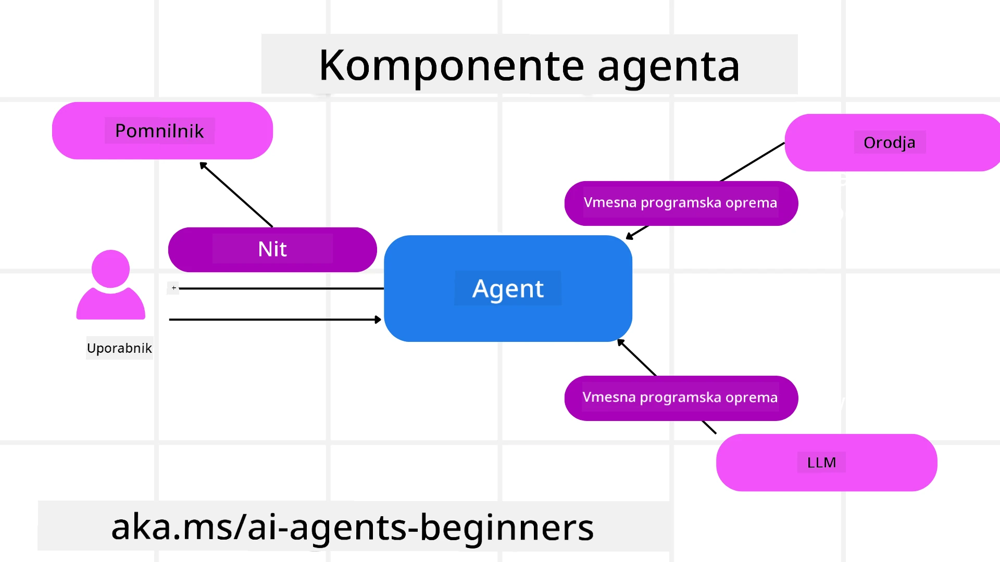

# Raziščite Microsoft Agent Framework



### Uvod

Ta lekcija bo zajemala:

- Razumevanje Microsoft Agent Framework: Ključne funkcije in vrednost  
- Raziskovanje ključnih konceptov Microsoft Agent Framework
- Napredni MAF vzorci: delovni tokovi, vmesna programska oprema in pomnilnik

## Cilji učenja

Po zaključku te lekcije boste znali:

- Zgraditi produkcijsko pripravljene AI agente z uporabo Microsoft Agent Framework
- Uporabiti osnovne funkcije Microsoft Agent Framework za vaše agentne primere uporabe
- Uporabiti napredne vzorce, vključno z delovnimi tokovi, vmesno programsko opremo in opazovanjem

## Primeri kode

Primeri kode za [Microsoft Agent Framework (MAF)](https://aka.ms/ai-agents-beginners/agent-framework) so na voljo v tem repozitoriju v datotekah `xx-python-agent-framework` in `xx-dotnet-agent-framework`.

## Razumevanje Microsoft Agent Framework



[Microsoft Agent Framework (MAF)](https://aka.ms/ai-agents-beginners/agent-framework) je Microsoftov enoten okvir za izdelavo AI agentov. Ponuja prilagodljivost za reševanje široke palete agentskih primerov uporabe, ki se pojavljajo tako v produkcijskih kot raziskovalnih okoljih, vključno z:

- **Zaporedna orkestracija agentov** v scenarijih, kjer so potrebni korak-po-korak delovni tokovi.
- **Vzporedna orkestracija** v scenarijih, kjer morajo agenti opravljati naloge istočasno.
- **Orkestracija skupinskega klepeta** v scenarijih, kjer lahko agenti sodelujejo pri eni nalogi.
- **Orkestracija predaje** v scenarijih, kjer agenti predajajo nalogo drug drugemu, ko so podnaloge opravljene.
- **Magnetna orkestracija** v scenarijih, kjer upravljalski agent ustvarja in spreminja seznam nalog ter usklajuje podagente za dokončanje naloge.

Za zagotavljanje AI agentov v produkciji ima MAF tudi funkcije za:

- **Opazovanje** z uporabo OpenTelemetry, kjer je vsaka akcija AI agenta, vključno z zagonom orodij, koraki orkestracije, tokovi razmišljanja in spremljanjem zmogljivosti preko Microsoft Foundry nadzornih plošč.
- **Varnost** z gosti agentov neposredno na Microsoft Foundry, ki vključuje varnostne kontrole, kot so dostop na podlagi vlog, ravnanje z zasebnimi podatki in vgrajena varnost vsebine.
- **Vzdržljivost** saj se agentni nitki in delovni tokovi lahko ustavijo, nadaljujejo in obnovijo po napakah, kar omogoča daljše trajanje procesa.
- **Nadzor** ker so podprti delovni tokovi z vmešavanjem človeka, kjer so naloge označene kot tiste, ki zahtevajo človeško odobritev.

Microsoft Agent Framework je prav tako osredotočen na interoperabilnost z:

- **Neodvisnostjo od oblaka** – agenti lahko tečejo v vsebnikih, na lokaciji in preko več različnih oblakov.
- **Neodvisnostjo od ponudnika** – agenti se lahko ustvarijo prek vašega priljubljenega SDK-ja, vključno z Azure OpenAI in OpenAI
- **Integracijo odprtih standardov** – agenti lahko uporabljajo protokole, kot sta Agent-to-Agent (A2A) in Model Context Protocol (MCP), za odkrivanje in uporabo drugih agentov in orodij.
- **Vtičniki in priključki** – povezave z lahko vzpostavljene do podatkovnih in pomnilniških storitev, kot so Microsoft Fabric, SharePoint, Pinecone in Qdrant.

Poglejmo, kako so te funkcije uporabljene pri nekaterih ključnih konceptih Microsoft Agent Framework.

## Ključni koncepti Microsoft Agent Framework

### Agenti



**Ustvarjanje agentov**

Ustvarjanje agenta poteka z definiranjem storitve sklepanja (LLM ponudnik), niza navodil za sledenje AI agenta in dodeljenega `imena`:

```python
agent = AzureOpenAIChatClient(credential=AzureCliCredential()).create_agent( instructions="You are good at recommending trips to customers based on their preferences.", name="TripRecommender" )
```

Zgoraj se uporablja `Azure OpenAI`, vendar se lahko agenti ustvarijo z različnimi storitvami, vključno z `Microsoft Foundry Agent Service`:

```python
AzureAIAgentClient(async_credential=credential).create_agent( name="HelperAgent", instructions="You are a helpful assistant." ) as agent
```

OpenAI `Responses`, `ChatCompletion` API-ji

```python
agent = OpenAIResponsesClient().create_agent( name="WeatherBot", instructions="You are a helpful weather assistant.", )
```

```python
agent = OpenAIChatClient().create_agent( name="HelpfulAssistant", instructions="You are a helpful assistant.", )
```

ali [MiniMax](https://platform.minimaxi.com/), ki omogoča API združljiv z OpenAI z velikimi kontekstnimi okni (do 204K tokenov):

```python
agent = OpenAIChatClient(base_url="https://api.minimax.io/v1", api_key=os.environ["MINIMAX_API_KEY"], model_id="MiniMax-M3").create_agent( name="HelpfulAssistant", instructions="You are a helpful assistant.", )
```

ali oddaljeni agenti z uporabo protokola A2A:

```python
agent = A2AAgent( name=agent_card.name, description=agent_card.description, agent_card=agent_card, url="https://your-a2a-agent-host" )
```

**Zagon agentov**

Agente poženemo z metodama `.run` ali `.run_stream` za ne-streaming ali streaming odzive.

```python
result = await agent.run("What are good places to visit in Amsterdam?")
print(result.text)
```

```python
async for update in agent.run_stream("What are the good places to visit in Amsterdam?"):
    if update.text:
        print(update.text, end="", flush=True)

```

Vsak zagon agenta ima lahko tudi možnosti prilagoditve parametrov, kot so `max_tokens`, orodja (`tools`), ki jih lahko agent kliče, in celo sam `model` uporabljen za agenta.

To je koristno v primerih, kjer so za dokončanje naloge uporabnika potrebni določeni modeli ali orodja.

**Orodja**

Orodja se lahko definirajo tako pri definiranju agenta:

```python
def get_attractions( location: Annotated[str, Field(description="The location to get the top tourist attractions for")], ) -> str: """Get the top tourist attractions for a given location.""" return f"The top attractions for {location} are." 


# Ko neposredno ustvarjate ChatAgent

agent = ChatAgent( chat_client=OpenAIChatClient(), instructions="You are a helpful assistant", tools=[get_attractions]

```

kot tudi pri zagonu agenta:

```python

result1 = await agent.run( "What's the best place to visit in Seattle?", tools=[get_attractions] # Orodje zagotovljeno samo za to izvedbo )
```

**Agentni nitki**

Agentni nitki služijo za upravljanje večkračnih pogovorov. Niti lahko ustvarite:

- z uporabo `get_new_thread()`, kar omogoča shranjevanje niti skozi čas
- avtomatsko ustvarjanje niti med izvajanjem agenta, pri čemer nit traja le za ta zagon.

Za ustvarjanje niti izgleda koda takole:

```python
# Ustvari novo nit.
thread = agent.get_new_thread() # Zaženi agenta z nitjo.
response = await agent.run("Hello, I am here to help you book travel. Where would you like to go?", thread=thread)

```

Nit lahko nato seralizirate za shranjevanje za kasnejšo uporabo:

```python
# Ustvari novo nit.
thread = agent.get_new_thread() 

# Zaženi agenta z nitjo.

response = await agent.run("Hello, how are you?", thread=thread) 

# Seriliziraj nit za shranjevanje.

serialized_thread = await thread.serialize() 

# Deseriliziraj stanje niti po nalaganju iz shranjevanja.

resumed_thread = await agent.deserialize_thread(serialized_thread)
```

**Agentna vmesna programska oprema**

Agenti sodelujejo z orodji in LLM-ji, da dokončajo naloge uporabnikov. V določenih primerih želimo vmes izvesti ali slediti interakcijam. Agentna vmesna programska oprema nam omogoča to preko:

*Funkcijske vmesne programske opreme*

Ta vmesna programska oprema omogoča izvajanje akcije med agentom in funkcijo/orodjem, ki ga bo klical. Primer uporabe je beleženje klica funkcije.

V spodnji kodi `next` določa, ali naj se kliče naslednja vmesna programska oprema ali sama funkcija.

```python
async def logging_function_middleware(
    context: FunctionInvocationContext,
    next: Callable[[FunctionInvocationContext], Awaitable[None]],
) -> None:
    """Function middleware that logs function execution."""
    # Predobdelava: Zabeleži pred izvajanjem funkcije
    print(f"[Function] Calling {context.function.name}")

    # Nadaljuj na naslednji vmesni sloj ali izvajanje funkcije
    await next(context)

    # Poobdelava: Zabeleži po izvajanju funkcije
    print(f"[Function] {context.function.name} completed")
```

*Chat vmesna programska oprema*

Ta vmesna programska oprema omogoča izvajanje ali beleženje akcije med agentom in zahtevki znotraj LLM.

Vsebuje pomembne informacije, kot so `messages`, ki se pošiljajo AI storitvi.

```python
async def logging_chat_middleware(
    context: ChatContext,
    next: Callable[[ChatContext], Awaitable[None]],
) -> None:
    """Chat middleware that logs AI interactions."""
    # Predobdelava: Zabeleži pred klicem AI
    print(f"[Chat] Sending {len(context.messages)} messages to AI")

    # Nadaljuj na naslednjo vmesno programsko opremo ali AI storitev
    await next(context)

    # Poobdelava: Zabeleži po odgovoru AI
    print("[Chat] AI response received")

```

**Agentni pomnilnik**

Kot je opisano v lekciji `Agentic Memory`, je pomnilnik pomemben element za omogočanje delovanja agenta čez različne kontekste. MAF ponuja več različnih vrst pomnilnikov:

*Shranjevanje v pomnilniku*

To je pomnilnik, shranjen v nitih med izvajanjem aplikacije.

```python
# Ustvari novo nit.
thread = agent.get_new_thread() # Zaženi agenta z nitjo.
response = await agent.run("Hello, I am here to help you book travel. Where would you like to go?", thread=thread)
```

*Vzdržna sporočila*

Ta pomnilnik se uporablja za shranjevanje zgodovine pogovora preko različnih sej. Določen je z uporabo `chat_message_store_factory`:

```python
from agent_framework import ChatMessageStore

# Ustvari prilagojeno shrambo sporočil
def create_message_store():
    return ChatMessageStore()

agent = ChatAgent(
    chat_client=OpenAIChatClient(),
    instructions="You are a Travel assistant.",
    chat_message_store_factory=create_message_store
)

```

*Dinamični pomnilnik*

Ta pomnilnik se doda v kontekst pred zagonom agentov. Ti pomnilniki so lahko shranjeni v zunanjih storitvah, kot je mem0:

```python
from agent_framework.mem0 import Mem0Provider

# Uporaba Mem0 za napredne spominske zmožnosti
memory_provider = Mem0Provider(
    api_key="your-mem0-api-key",
    user_id="user_123",
    application_id="my_app"
)

agent = ChatAgent(
    chat_client=OpenAIChatClient(),
    instructions="You are a helpful assistant with memory.",
    context_providers=memory_provider
)

```

**Agentno opazovanje**

Opazovanje je pomembno za zanesljive in vzdržljive agentske sisteme. MAF se integrira z OpenTelemetry za zagotavljanje sledenja in meritev za boljšo opazovanje.

```python
from agent_framework.observability import get_tracer, get_meter

tracer = get_tracer()
meter = get_meter()
with tracer.start_as_current_span("my_custom_span"):
    # naredi nekaj
    pass
counter = meter.create_counter("my_custom_counter")
counter.add(1, {"key": "value"})
```

### Delovni tokovi

MAF ponuja delovne tokove, ki so vnaprej določeni koraki za dokončanje naloge in vključujejo AI agente kot sestavne dele teh korakov.

Delovni tokovi so sestavljeni iz različnih komponent, ki omogočajo boljši nadzor poteka. Delovni tokovi omogočajo tudi **večagentno orkestracijo** in **checkpointing** za shranjevanje stanj delovnega toka.

Glavne komponente delovnega toka so:

**Izvajalci**

Izvajalci sprejmejo vhodna sporočila, opravijo dodeljene naloge in nato proizvedejo izhodno sporočilo. Tako delavni tok poteka naprej proti dokončanju večje naloge. Izvajalci so lahko AI agenti ali po meri narejena logika.

**Povezave**

Povezave definirajo pretok sporočil v delovnem toku. Te so lahko:

*Neposredne povezave* - preproste enonapojne povezave med izvajalci:

```python
from agent_framework import WorkflowBuilder

builder = WorkflowBuilder()
builder.add_edge(source_executor, target_executor)
builder.set_start_executor(source_executor)
workflow = builder.build()
```

*Pogojne povezave* - aktivirajo se, ko je izpolnjen določen pogoj. Na primer, kadar sobe v hotelu niso na voljo, lahko izvajalec predlaga druge možnosti.

*Povezave stikalo* - usmerjajo sporočila k različnim izvajalcem glede na določene pogoje. Na primer, če ima potnik prednostni dostop, se njegove naloge obdelujejo skozi drug delovni tok.

*Razvejitvene povezave* - pošljejo eno sporočilo na več ciljev.

*Združevalne povezave* - zbirajo več sporočil iz različnih izvajalcev in jih pošljejo enemu cilju.

**Dogodki**

Za boljšo opazovanje delovnih tokov MAF ponuja vgrajene dogodke za izvajanje, vključno z:

- `WorkflowStartedEvent`  - Začetek izvajanja delovnega toka
- `WorkflowOutputEvent` - Delovni tok proizvede izhod
- `WorkflowErrorEvent` - Delovni tok naleti na napako
- `ExecutorInvokeEvent`  - Izvajalec začne obdelavo
- `ExecutorCompleteEvent`  - Izvajalec zaključi obdelavo
- `RequestInfoEvent` - Oddan je zahtevek

## Napredni MAF vzorci

Zgoraj so opisani ključni koncepti Microsoft Agent Framework. Ko gradite bolj kompleksne agente, upoštevajte naslednje napredne vzorce:

- **Sestava vmesne programske opreme**: Verižite več rokovalcev vmesne programske opreme (beleženje, avtorizacija, omejevanje hitrosti) z uporabo funkcijske in klepetalne vmesne programske opreme za natančen nadzor vedenja agenta.
- **Checkpointing delovnih tokov**: Uporabite dogodke delovnega toka in serializacijo za shranjevanje in nadaljevanje daljše tekočih agentnih procesov.
- **Dinamična izbira orodij**: Združite RAG nad opisi orodij z registracijo orodij v MAF za prikaz samo relevantnih orodij na poizvedbo.
- **Večagentna predaja**: Uporabite povezave delovnih tokov in pogojno usmerjanje za orkestracijo predaje med specializiranimi agenti.

## Primeri kode

Primeri kode za Microsoft Agent Framework so na voljo v tem repozitoriju v datotekah `xx-python-agent-framework` in `xx-dotnet-agent-framework`.

## Imate več vprašanj o Microsoft Agent Framework?

Pridružite se [Microsoft Foundry Discord](https://discord.com/invite/ATgtXmAS5D), da se srečate z drugimi učenci, sodelujete na urah uradnih ur in dobite odgovore na vprašanja o AI agentih.

---

<!-- CO-OP TRANSLATOR DISCLAIMER START -->
**Omejitev odgovornosti**:
Ta dokument je bil preveden z uporabo AI prevajalske storitve [Co-op Translator](https://github.com/Azure/co-op-translator). Čeprav si prizadevamo za natančnost, vas prosimo, da upoštevate, da avtomatizirani prevodi lahko vsebujejo napake ali netočnosti. Izvirni dokument v njegovem izvirnem jeziku je treba obravnavati kot avtoritativni vir. Za kritične informacije je priporočljiv strokovni človeški prevod. Ne odgovarjamo za morebitna nesporazume ali napačne interpretacije, ki izhajajo iz uporabe tega prevoda.
<!-- CO-OP TRANSLATOR DISCLAIMER END -->