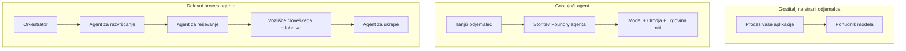
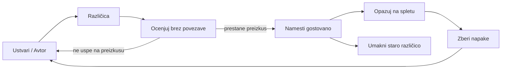
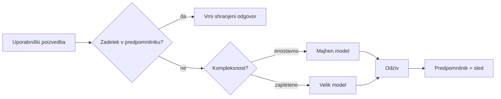
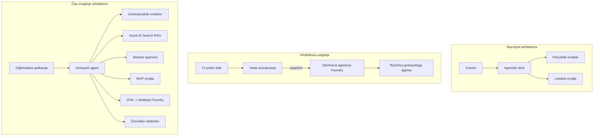

# Uvajanje prilagodljivih agentov z Microsoft Foundryjem


Do zdaj v tečaju ste gradili agente, ki tečejo na vašem prenosniku, znotraj zapiska, upravljani z ukazom `az login` in nekaj okoljskimi spremenljivkami. To je pravilen način za učenje. Ni pa pravilen način za zagon agenta, na katerega zanaša tisoče strank ob 3. uri zjutraj.

Ta lekcija obravnava razliko med "deluje na mojem računalniku" in "deluje zanesljivo in dostopno v produkciji". To razliko zapremo z uporabo **Microsoft Foundry** in **Microsoft Foundry Agent Service**, in to storimo tako, da zgradimo resničnega podpornega agenta, ki ima orodja, iskanje, pomnilnik, ocenjevanje in nadzor.

## Uvod

Ta lekcija bo obravnavala:

- Razliko med **prototipnim agentom** in **uvetim agentom** ter zakaj je prehod največkrat povezan z vsemi stvarmi *okoli* modela.
- **Vzorce uvajanja** za agente: gostovanje na odjemalcu, na storitvi (Gostovani Agenti) in orkestracija poteka dela.
- **Življenjski cikel agenta** na Microsoft Foundry — ustvarjanje, različica, uvajanje, ocenjevanje, opazovanje, upokojitev.
- **Strategije skaliranja**: usmerjanje modela, predpomnjenje, sočasnost in brezstanje zasnova.
- **Opazljivost** z OpenTelemetry in sledenjem v Foundryju.
- **Optimizacija stroškov** preko izbire modela, usmerjanja in vrat za ocenjevanje.
- **Podjetniške razmisleke**: upravljanje, človeško odobritev in varen zagon MCP strežnikov v produkciji.

## Cilji učenja

Po zaključku te lekcije boste znali:

- Izbrati pravi vzorec uvajanja za določeno delovno obremenitev agenta.
- Uvajati agenta v Microsoft Foundry Agent Service tako, da je različiciran, upravljan in opazen.
- Instrumentirati agenta za sledenje in povezati cevovod ocenjevanja, ki teče pred vsako izdajo.
- Uporabiti usmerjanje modela in predpomnjenje za ohranjanje latence in stroškov pod kontrolo pri skaliranju.
- Dodati človeška odobritev za tvegana dejanja in integrirati MCP strežnik na varen način za produkcijo.

## Predpogoji

Ta lekcija predpostavlja, da ste zaključili prejšnje lekcije in ste vešči:

- Gradnja agentov z [Microsoft Agent Framework](../14-microsoft-agent-framework/README.md) (Lekcija 14).
- [Uporaba orodij](../04-tool-use/README.md) (Lekcija 4) in [Agentic RAG](../05-agentic-rag/README.md) (Lekcija 5).
- [Agent Memory](../13-agent-memory/README.md) (Lekcija 13) in [Agentic Protocols / MCP](../11-agentic-protocols/README.md) (Lekcija 11).
- [Opazovanje in ocenjevanje](../10-ai-agents-production/README.md) (Lekcija 10) — ta lekcija neposredno nadaljuje nanj.

Potrebovali boste tudi:

- **Azure naročnino** in **Microsoft Foundry projekt** z vsaj enim uvajenim klepetalnim modelom.
- Avtentikacijo z **Azure CLI** (`az login`).
- Python 3.12+ in pakete v repozitoriju [`requirements.txt`](../../../requirements.txt).

## Od prototipa do produkcije: kaj se dejansko spremeni

Prototipni agent in produkcijski agent imata enak osnovni cikel — razmišljanje, klic orodij, odgovor. Spremeni se vse, kar je ovito okoli tega cikla. Model je morda 20% produkcijskega agenta; ostalih 80% je operativni skelet.

| Skrb | Prototip | Produkcija |
| --- | --- | --- |
| **Gostovanje** | Teče v vašem zapisku | Teče kot gostovana storitev, verzionirana in razširjena |
| **Identiteta** | Vaš `az login` žeton | Upravljana identiteta z omejenim RBAC-om |
| **Stanje** | V pomnilniku, izgubljeno ob ponovnem zagonu | Zunanjeno (shranjevanje po niti, pomnilniška storitev) |
| **Napaka** | Vidite sled napake | Ponovitve, zasilni načini, mrtvi sporočilni predal, opozorila |
| **Strošek** | "Je nekaj centov" | Sleden vsakemu zahtevku, usmerjen, predpomnjen, v proračunu |
| **Kakovost** | Ocenjujete rezultate z očmi | Samodejno ocenjevano pred vsako izdajo |
| **Zaupanje** | Odobritev vsakega dejanja | Politike + človek v zanki za tvegana dejanja |

Zapomnite si to tabelo. Vsak spodnji odsek ustreza eni od teh vrstic.

## Vzorce uvajanja agentov

Obstajajo trije vzorci, ki jih boste pogosto uporabili v kombinaciji.

### 1. Agenti gostovani na odjemalcu

Objekt agenta živi znotraj *vašega* aplikacijskega procesa. Vaša koda pokliče ponudnika modela neposredno; zanka razmišljanja teče v vaši storitvi. To je bilo storjeno v vseh prejšnjih lekcijah.

- **Uporabite ga, kadar** potrebujete popoln nadzor nad zanko, prilagojena vmesna plast ali vgrajevanje agenta v obstoječi backend.
- **Kompenzacija**: sami upravljate skaliranje, stanje in odpornost.

### 2. Gostovani agenti (Foundry Agent Service)

Agent je *registriran kot vir* v Microsoft Foundryju. Foundry gosti zanko razmišljanja, shrani niti, uveljavlja varnost vsebine in RBAC ter naredi agenta vidnega v portalu Foundry. Vaša aplikacija postane tanek odjemalec, ki ustvarja niti in bere odzive.

- **Uporabite ga, kadar** želite trajnost, vgrajeno opazovanje, upravljanje in manj operativne obremenitve.
- **Kompenzacija**: manj nizkonivojskega nadzora v zameno za upravljan runtime.

### 3. Poteki dela agentov

Več agentov (in orodij) je sestavljenih v graf z eksplicitnim tokom nadzora — sekvenčni koraki, vejitev, vozlišča s človeško odobritvijo in trajne kontrolne točke, ki se lahko ustavijo in nadaljujejo. To je zmogljivost Microsoft Agent Framework **Workflows** uporabljena v merilu uvajanja.

- **Uporabite ga, kadar** en sam naloga zajema več specializiranih agentov ali zahteva odobritev sredi procesa.
- **Kompenzacija**: več gibljivih delov; potrebuje opazovanje na ravni orkestracije.



## Življenjski cikel agenta na Microsoft Foundryju

Uvajanje agenta ni enkraten `push`. Je zanka in zelo spominja na cikel izdaje programske opreme, ker pravzaprav to je.



Ključna ideja, prinesena iz [Lekcije 10](../10-ai-agents-production/README.md): **ocenjevanje brez povezave je vrata, ne zatemnitev.** Nova različica agenta ne gre v javnost, če ne doseže vaših praga ocenjevanja. Opazovanje v živo pa vrača realne napake nazaj v vaš offline testni niz. To je celotni cikel.

## Strategije skaliranja

Skaliranje agenta se razlikuje od skaliranja brezstanjskega spletnega API-ja, ker lahko vsak zahtevek sproži več dragih klicev modelov in orodij. Štiri tehnike nosijo večino obremenitve.

**Brezstansko upravljanje zahtevkov.** Ne hranite stanja po uporabniku v pomnilniku procesa. Shranjujte pogovorne niti v trgovinu niti Foundry ali pomnilniški storitvi, da lahko kateri koli primerek obravnava vsak zahtevek. To vam omogoča horizontalno skaliranje — dodajanje primerkov, brez lepljivih sej.

**Usmerjanje modela.** Ne vsak zahtevek potrebuje vaš najučinkovitejši (in najdražji) model. Usmerite preproste zahtevke — razvrščanje namena, kratki dejanski odgovori — na majhen, hiter model in rezervirajte velik model za resnično razmišljanje. Foundryjev **Model Router** to lahko naredi za vas, ali pa si sami naredite lahkotnega klasifikatorja. V laboratoriju boste zgradili DIY verzijo.

**Predpomnjenje odgovorov.** Mnoge podporne poizvedbe so skoraj enake ("kako ponastavim geslo?"). Predpomnite odgovore na pogosta vprašanja in jih posredujte brez prekinitve modela. Tudi skromen delež zadetkov v predpomnilniku pomembno zniža stroške in latenco.

**Hkratnost in povratni tlak.** Ponudniki modela imajo omejitve hitrosti. Omejite sočasnost, uporabite ponovitve z eksponentno zakasnitvijo in prijazno zatajite (vrsta odzivov "delamo na tem" je boljša kot 500 napak).



## Opazovanje v produkciji

Ne morete upravljati tistega, česar ne vidite. Kot je obravnavano v Lekciji 10, Microsoft Agent Framework nativno oddaja **OpenTelemetry** sledi — vsak klic modela, vsak klic orodja in vsaka orkestracijska stopnja postane razpon. V produkciji te razpone izvozite v Microsoft Foundry (ali kateri koli OTel-kompatibilni backend), da lahko:

- Spremljate posamezne pritožbe strank od začetka do konca preko vseh klicev modela in orodij.
- Spremljate latenco p50/p95 in stroške na zahtevek skozi čas.
- Opozarjate na nenadne skoke napak in anomalije stroškov še preden jih opazijo uporabniki (ali finančna ekipa).

```python
from agent_framework.observability import get_tracer

tracer = get_tracer()

with tracer.start_as_current_span("support_request") as span:
    span.set_attribute("customer.tier", "enterprise")
    span.set_attribute("routed.model", "gpt-5-nano")
    # izvajanje agenta je samodejno sledeno znotraj tega razpona
```

Atributi, kot so `customer.tier` in `routed.model`, prelevijo zid sledi v vprašanja z odgovori ("ali se poslovne stranke preveč pogosto usmerjajo na majhen model?").

## Optimizacija stroškov

Stroški v produkcijskih agentih so prevladujoče določeni s tokeni. Trije ročaji, po vplivu:

1. **Pravilna velikost modela.** Majhen model, ki prestane vaša vrata ocenjevanja, je skoraj vedno cenejši kot velik model, ki jih prav tako prestane. Uporabite ocenjevanje, da *dokažete*, da je majhen model dovolj dober, namesto da bi iz previdnosti uporabili največjega.
2. **Usmerjanje po kompleksnosti.** Kot zgoraj — za zahtevke, ki potrebujejo razmišljanje velikega modela, plačajte ceno velikega modela.
3. **Agresivno predpomnjenje.** Najcenejši klic modela je tisti, ki ga nikoli ne naredite.

Vrata ocenjevanja in nadzor stroškov sta ista disciplina gledana z dveh zornih kotov: ocenjevanje določi *kakovostno mejo*, usmerjanje in predpomnjenje pa vas ohranjata čim bližje *stroškovni* meji.

## Podjetniški premisleki pri uvajanju

**Upravljanje.** Gostovani agenti dedujejo RBAC, varnost vsebine in revizijsko beleženje Foundryja. Dajte vsakemu agentu upravljano identiteto z minimalnimi privilegiji, ki jih potrebuje — dostop samo za branje do baze znanja, omejen dostop do API-ja za vozovnice, nič več.

**Človek v zanki.** Nekatera dejanja so preveč pomembna, da bi jih avtomatizirali neposredno — izplačilo vračila, brisanje računa, eskalacija pravni ekipi. Microsoft Agent Framework podpira orodja, ki zahtevajo **odobritev**: agent predlaga dejanje, izvajanje se ustavi, človek odobri ali zavrne, potek dela se nadaljuje. Primerek ste videli v [Lekciji 6](../06-building-trustworthy-agents/README.md); tukaj ga uvajate.

**MCP v produkciji.** [MCP](../11-agentic-protocols/README.md) omogoča agentu uporabo zunanjih orodij preko standardnega vmesnika. V produkciji obravnavajte vsak MCP strežnik kot nezanesljivo mejo: vsadite verzijo strežnika, pognajte ga z omejeno identiteto, validirajte njegove rezultate in nikoli ne odkrivajte skrivnosti. MCP strežnik je odvisnost, odvisnosti pa se popravljajo, revidirajo in omejujejo.



Ta trije diagrami — razvoj, uvajanje, zagon — so isti agent v treh življenjskih fazah. Sledi laboratorij, ki vas vodi skozi njegovo gradnjo.

## Praktikum: Agent za podporo strankam pripravljen za produkcijo

Odprite [`code_samples/16-python-agent-framework.ipynb`](./code_samples/16-python-agent-framework.ipynb) in ga obdelajte od začetka do konca. Sestavili boste **Contoso agenta za podporo strankam** z vsemi produkcijskimi funkcijami:

1. **Klic orodij** — preverjanje stanja naročila in odpiranje podpornih vozovnic.
2. **RAG** — odgovarjanje na politična vprašanja iz baze znanja (Azure AI Search, z v pomnilnik vračalno potjo, da zvezek teče brez viri za Search).
3. **Pomnilnik** — zapomniti si stranko skozi poteze pogovora.
4. **Usmerjanje modela** — klasifikator kompleksnosti usmerja vsak zahtevek na majhen ali velik model.
5. **Predpomnjenje odgovorov** — ponovljena vprašanja se služijo iz predpomnilnika.
6. **Človeška odobritev** — vračila nad pragom se ustavijo za podpis človeka.
7. **Cevovod ocenjevanja** — majhen offline testni niz oceni agenta in deluje kot vrata izdaje.
8. **Opazljivost** — OpenTelemetry sledenje okoli vsakega zahtevka.

### Korak za korakom

Zvezek je organiziran tako, da je vsaka produkcijska skrb samostojen, zagonljiv odsek. Jedro je upravljalec zahtevkov s kombinacijo usmerjanja in predpomnjenja:

```python
async def handle_support_request(query: str, customer_id: str) -> str:
    # 1. Postrezi iz predpomnilnika, kadar lahko.
    cached = response_cache.get(normalize(query))
    if cached:
        return cached

    # 2. Usmeri po zahtevnosti za nadzor stroškov.
    model = "gpt-5-nano" if is_simple(query) else "gpt-5-mini"

    # 3. Za opaznost zaženi agenta znotraj sledilnega odseka.
    with tracer.start_as_current_span("support_request") as span:
        span.set_attribute("routed.model", model)
        span.set_attribute("customer.id", customer_id)
        response = await support_agent.run(query, model=model)

    # 4. Predpomni in vrni.
    response_cache.set(normalize(query), response.text)
    return response.text
```

Vrata ocenjevanja, ki varujejo izdajo, izgledajo takole:

```python
async def evaluation_gate(agent, test_cases, threshold: float = 0.8) -> bool:
    passed = 0
    for case in test_cases:
        result = await agent.run(case["input"])
        if score_response(result.text, case["expected"]) >= 0.8:
            passed += 1
    pass_rate = passed / len(test_cases)
    print(f"Evaluation pass rate: {pass_rate:.0%} (gate: {threshold:.0%})")
    return pass_rate >= threshold  # principirajte samo, če vrata prestopijo
```

Preberite vsako vrstico — zvezek ohranja primere namerno majhne, da ni nič skritega za klicem v okvir.

## Validacija uvajanega agenta z dimački testi

Vrata ocenjevanja zgoraj tečejo *offline* proti vašemu agentu. Ko je agent uvajan kot Gostovani agent, potrebujete še en, še cenejši test: **ali uvajani končni naslov dejansko odgovarja?**

"Uspešno" uvajanje le dokazuje, da je kontrolna ploskev sprejela definicijo — ne dokazuje, da agent odgovarja. Manjkajoča odvisnost, napačno usmerjanje modela ali potekla povezava lahko pustijo zeleno uvajanje, ki ne vrne ničesar. **Dimni test** to zazna v nekaj sekundah, pri vsakem uvajanju, brez stroškov polnega ocenjevanja.

Ta repozitorij ponuja takoj pripravljen cevovod dimnega testa, ki temelji na [AI Smoke Test](https://github.com/marketplace/actions/ai-smoke-test) GitHub akciji:

- **Katalog** — [`tests/lesson-16-smoke-tests.json`](../../../tests/lesson-16-smoke-tests.json) vsebuje pozive in trditve za Contoso podpornega agenta (odgovore, utemeljene na politiki, iskanje naročila, ostati znotraj teme in večkratno kontinuiteto niti). Katalogi za agente iz drugih lekcij živijo zraven — glejte [`tests/README.md`](../tests/README.md).
- **Potek dela** — [`.github/workflows/smoke-test.yml`](../../../.github/workflows/smoke-test.yml) prijavi z Azure OIDC in pošlje vsak poziv na končni naslov agentovega Responses endpointa, neuspeh pri katerikoli trditvi prekine delo.

```yaml
- name: Smoke-test hosted agent
  uses: JFolberth/ai-smoketest@v1
  with:
    project_endpoint: ${{ inputs.project_endpoint }}
    agent_name: ContosoSupportAgent
    tests_file: tests/lesson-16-smoke-tests.json
```


Zaženite ga z zavihka **Actions**, ko je vaš agent nameščen, in zagotovite konec točke vašega projekta Foundry in ime agenta. Federirana identiteta potrebuje vlogo **Azure AI User** na obsegu projekta Foundry. Pomislite na plasti kot na piramido: dimni testi (dosegljiv in odziven?) se izvajajo pri vsakem uvajanju, offline ocenjevanje (dovolj dobro za izdajo?) se izvaja pred promocijo, in online ocenjevanje (kako se obnese v praksi?) poteka neprekinjeno.

## Preverjanje znanja

Preizkusite svoje razumevanje, preden nadaljujete z nalogo.

**1. Približno koliko produkcijskega agenta je "model" in kaj je ostalo?**

<details>
<summary>Odgovor</summary>

Model je manjšina sistema — pogosto navajajo okoli 20%. Ostalo je operativni okvir: gostovanje in različice, identiteta in RBAC, eksternalizirano stanje, upravljanje okvar, sledenje stroškom, ocenjevanje ter kontrole s človekom v zanki. Prehod v produkcijo je večinoma o postavitvi vsega *okoli* petlje sklepanja.
</details>

**2. Kdaj bi izbrali gostujočega agenta namesto na odjemalcu gostujočega agenta?**

<details>
<summary>Odgovor</summary>

Ko želite upravljano izvajalno okolje z vgrajeno vzdržljivostjo (niti, ki vztrajajo in se lahko nadaljujejo), opazljivostjo, varnostjo vsebine in RBAC, ter ste pripravljeni žrtvovati nekaj nizko-nivojske kontrole nad sklepanjsko zanko za manjšo operativno površino. Gostujočega na odjemalcu je bolje izbrati, ko potrebujete popoln nadzor nad zanko ali ko vgrajujete agenta v obstoječi zaledni sistem.
</details>

**3. Zakaj mora biti skalabilen agent brezstaten v svojem procesnem pomnilniku?**

<details>
<summary>Odgovor</summary>

Tako lahko vsak primerek obdela katerokoli zahtevo, kar omogoča horizontalno skaliranje brez lepljivih sej. Stanje pogovora na uporabnika je eksternalizirano v shrambi niti ali storitvi pomnilnika. Če bi bilo stanje v procesnem pomnilniku, bi ga ob ponovnem zagonu izgubili in ne bi mogli prosto razdeljevati obremenitev.
</details>

**4. Kateri problem rešuje usmerjanje modelov in kako se povezuje z ocenjevanjem?**

<details>
<summary>Odgovor</summary>

Usmerjanje pošilja preproste zahteve majhnemu, poceni in hitremu modelu ter rezervira velik model za pravo sklepanje, s čimer nadzoruje tako latenco kot stroške. Povezano je z ocenjevanjem, ker ocenjevanje *dokazuje*, da je majhen model dovolj dober za razred zahtev — usmerjanje brez ocenjevanja je ugibanje.
</details>

**5. Kaj je "vrata ocenjevanja" in kje se nahajajo v življenjskem ciklu?**

<details>
<summary>Odgovor</summary>

Vrata ocenjevanja izvajajo offline testni niz na novi različici agenta in preprečujejo uvajanje, razen če stopnja uspešnosti preseže prag. Nahajajo se med "različico" in "uvajanjem" v življenjskem ciklu, kar postavlja kakovost kot predpogoj za izdajo namesto nečesa, kar preverite po izdaji.
</details>

**6. Zakaj je MCP strežnik v produkciji treba obravnavati kot nezaupljivo mejo?**

<details>
<summary>Odgovor</summary>

Ker je to zunanji odvisnik, v katerega vaš agent kliče. Njegovo različico morate določiti, ga pognati z omejeno identiteto, preverjati njegove izhode, omejevati število klicev in mu nikoli ne razkrivati skrivnosti — enaka disciplina kot za vsak tretjerazredni odvisnik. Njegovi izhodi vstopajo v sklepanje vašega agenta, zato je nepreverjeno zaupanje varnostno tveganje.
</details>

**7. Katera ena sama sprememba običajno najbolj vpliva na stroške produkcijskega agenta in zakaj?**

<details>
<summary>Odgovor</summary>

Pravilna izbira velikosti modela — uporaba najmanjšega modela, ki še prestane vaša vrata ocenjevanja. Stroški so odvisni predvsem od tokenov, in manjši model, ki dosega kakovostno stopnjo, je skoraj vedno cenejši od večjega. Predpomnjenje in usmerjanje nato še dodatno znižata stroške, vendar ima izbira pravega osnovnega modela največji prvi redni vpliv.
</details>

**8. Kakšno vlogo imajo atributi razpona, kot sta `customer.tier` in `routed.model`, pri opazljivosti?**

<details>
<summary>Odgovor</summary>

Spremenijo neobdelane sledi v odgovore zmožna poslovna vprašanja. Brez atributov imate zid razponov; z njimi pa lahko vprašate "ali so podjetniški kupci prepogosto usmerjeni na mali model?" ali "kateri model obdeluje naše najpočasnejše zahteve?" Atributi so način, kako režete telemetrijo po dimenzijah, ki so pomembne za vaše poslovanje.
</details>

## Naloga

Vzemite agenta za podporo strankam iz laboratorija in ga utrdite za določen scenarij: **agent za podporo za obračun naročnin SaaS podjetja.**

Vaša oddaja naj vključuje:

1. **Zamenjajte orodja** z orodji, pomembnimi za obračun: `get_subscription_status`, `get_invoice` in `issue_credit` (krediti nad 50 $ zahtevajo človeško odobritev).
2. **Dodajte tri dokumente RAG**, ki zajemajo politik o vračilu denarja, obračunsko obdobje in politiko preklica podjetja.
3. **Razširite niz za ocenjevanje** na najmanj osem primerov, vključno z najmanj dvema, ki *morata* sprožiti pot človeške odobritve, in potrdite, da vaša vrata ocenjevanja pravilno sprejmejo ali zavrnejo.
4. **Dodajte eno poročilo o stroških**: po desetih mešanih poizvedbah skozi agenta izpišite, koliko jih je šlo na mali model, koliko na veliki model in koliko jih je bilo postreženih iz predpomnilnika.

Napišite kratek odstavek (v markdown celici), ki pojasnjuje, katero pravilo usmerjanja modelov ste izbrali in kako bi ga preverili z realnim prometom. Pravilnega odgovora ni — ocenjevali vas bodo glede na to, ali so produkcijske skrbi povezane smiselno.

## Povzetek

V tej lekciji ste premaknili agenta iz prototipa v produkcijo z Microsoft Foundry:

- Preskok v produkcijo je večinoma o **operativnem ogrodju** okoli modela — gostovanju, identiteti, stanju, obvladovanju napak, stroških, kakovosti in zaupanju.
- Spoznali ste tri **vzorce uvajanja** — gostovanje na odjemalcu, gostujoči agenti in poteki agentov — ter kdaj je kateri ustrezen.
- Sprehodili ste se skozi **življenjski cikel agenta**, kjer offline **ocenjevanje deluje kot izpustna vrata** in online opazljivost vrne napake nazaj v testni niz.
- Uporabili ste **strategije skaliranja** — brezstaten dizajn, usmerjanje modelov, predpomnjenje in omejeno sočasnost — ter jih povezali z **optimizacijo stroškov**.
- Povezali ste **podjetniške kontrole**: RBAC, človeško odobritev v zanki in varno produkcijsko integracijo MCP.
- Zgradili ste **produkcijsko pripravljenega agenta za podporo strankam**, ki združuje vse naštete skrbi v izvajajoči kodi.

Naslednja lekcija bo obratna pot: namesto skaliranja agentov v oblak jih boste prenesli *dol* na eno razvijalsko napravo in jih poganjali povsem lokalno.

## Dodatni viri

- <a href="https://learn.microsoft.com/azure/ai-foundry/what-is-azure-ai-foundry" target="_blank">Dokumentacija Microsoft Foundry</a>
- <a href="https://learn.microsoft.com/azure/ai-foundry/agents/overview" target="_blank">Pregled storitve agentov Microsoft Foundry</a>
- <a href="https://learn.microsoft.com/en-us/agent-framework/overview/?wt.mc_id=youtube_26688_organicsocial_reactor&pivots=programming-language-python" target="_blank">Okvir Microsoft Agent Framework</a>
- <a href="https://learn.microsoft.com/azure/ai-foundry/concepts/model-router" target="_blank">Usmerjevalnik modelov v Microsoft Foundry</a>
- <a href="https://learn.microsoft.com/azure/search/search-what-is-azure-search" target="_blank">Azure AI Search</a>
- <a href="https://opentelemetry.io/" target="_blank">OpenTelemetry</a>
- <a href="https://github.com/marketplace/actions/ai-smoke-test" target="_blank">AI Smoke Test GitHub Action</a>
- <a href="https://modelcontextprotocol.io/" target="_blank">Model Context Protocol (MCP)</a>

## Prejšnja lekcija

[Ustvarjanje agentov za uporabo računalnika (CUA)](../15-browser-use/README.md)

## Naslednja lekcija

[Ustvarjanje lokalnih AI agentov](../17-creating-local-ai-agents/README.md)

---

<!-- CO-OP TRANSLATOR DISCLAIMER START -->
**Omejitev odgovornosti**:
Ta dokument je bil preveden z uporabo AI prevajalske storitve [Co-op Translator](https://github.com/Azure/co-op-translator). Čeprav si prizadevamo za natančnost, vas prosimo, da upoštevate, da avtomatizirani prevodi lahko vsebujejo napake ali netočnosti. Izvirni dokument v njegovem izvirnem jeziku je treba obravnavati kot avtoritativni vir. Za kritične informacije je priporočljiv strokovni človeški prevod. Ne odgovarjamo za morebitna nesporazume ali napačne interpretacije, ki izhajajo iz uporabe tega prevoda.
<!-- CO-OP TRANSLATOR DISCLAIMER END -->