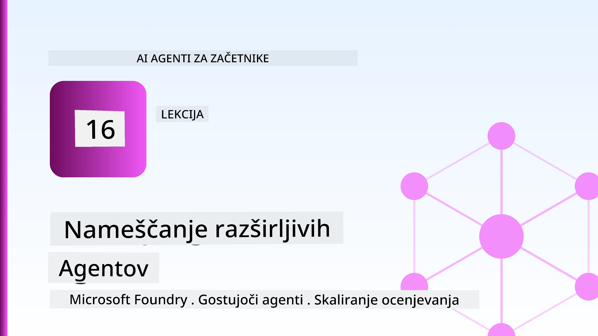
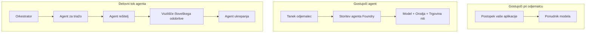
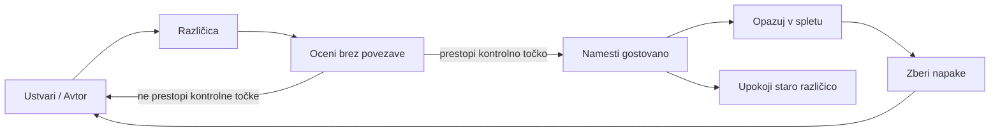
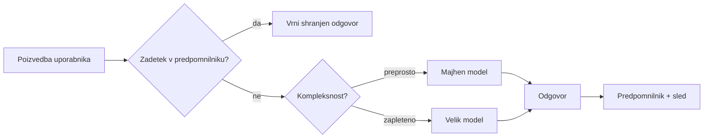
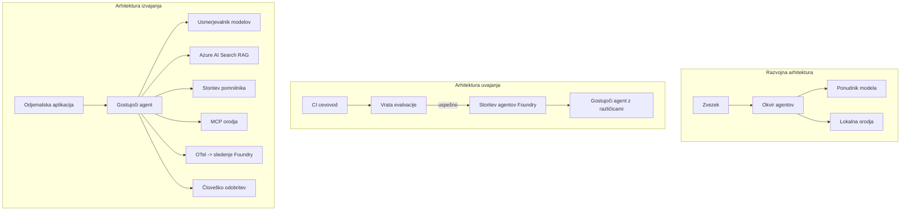

# Uvajanje skalabilnih agentov z Microsoft Foundry



Do te točke v tečaju ste zgradili agente, ki tečejo na vašem prenosniku, znotraj zapiska, upravljani z `az login` in nekaj okoljskimi spremenljivkami. To je natanko pravi način za učenje. To ni pravi način za zagon agenta, od katerega odvisno tisoče strank ob 3. uri zjutraj.

Ta lekcija govori o razliki med "deluje na mojem računalniku" in "deluje zanesljivo in cenovno dostopno v proizvodnji." To vrzel zapolnimo z uporabo **Microsoft Foundry** in **Microsoft Foundry Agent Service**, tako da zgradimo pravo podporno službo za stranke, ki vključuje orodja, iskanje, pomnenje, ocenjevanje in spremljanje.

## Uvod

Ta lekcija bo zajemala:

- Razliko med **prototipnim agentom** in **uvoženim agentom** ter zakaj je prehod večinoma povezan z vsem, kar je *okoli* modela.
- **Vzorce uvajanja** za agente: gostovani na odjemalcu, gostovani kot storitev (Hosted Agents) in orkestrirani v delovnih tokovih.
- **Cikel življenja agenta** v Microsoft Foundry — ustvarjanje, verzioniranje, uvajanje, ocenjevanje, opazovanje, upokojitev.
- **Strategije skaliranja**: usmerjanje modelov, predpomnjenje, vzporednost in zasnova brez stanja.
- **Opazljivost** z OpenTelemetry in Foundry sleditvijo.
- **Optimizacija stroškov** z izbiro modela, usmerjanjem in vrati za ocenjevanje.
- **Zahteve podjetij**: upravljanje, človeško odobravanje in varno izvajanje MCP strežnikov v proizvodnji.

## Cilji učenja

Po končani tej lekciji boste znali:

- Izbrati pravi vzorec uvajanja za določen delovni tok agenta.
- Uvajati agenta v Microsoft Foundry Agent Service, da bo verzioniran, upravljan in opazen.
- Instrumentirati agenta za sledenje in povezati ocenjevalno cevovod, ki teče pred vsakim izidom.
- Uporabljati usmerjanje modelov in predpomnjenje za nadzor latence in stroškov na obsegu.
- Dodati človeško odobritveno vrata za visokorizične akcije in integrirati MCP strežnik na varen način za proizvodnjo.

## Predpogoji

Ta lekcija predvideva, da ste končali prej omenjene lekcije in se počutite udobno pri:

- Izgradnji agentov z [Microsoft Agent Framework](../14-microsoft-agent-framework/README.md) (Lekcija 14).
- [Uporaba orodij](../04-tool-use/README.md) (Lekcija 4) in [Agentic RAG](../05-agentic-rag/README.md) (Lekcija 5).
- [Pomnilnik agenta](../13-agent-memory/README.md) (Lekcija 13) in [Agentic Protocols / MCP](../11-agentic-protocols/README.md) (Lekcija 11).
- [Opazovanje in ocenjevanje](../10-ai-agents-production/README.md) (Lekcija 10) — to lekcijo neposredno gradi na tej.

Prav tako boste potrebovali:

- **Azure naročnino** in **Microsoft Foundry projekt** z vsaj enim uvajenim klepetalnim modelom.
- Avtoriziran Azure CLI (`az login`).
- Python 3.12+ in pakete v repozitoriju [`requirements.txt`](../../../requirements.txt).

## Od prototipa do produkcije: kaj se dejansko spremeni

Prototipni agent in produkcijski agent imata enako osnovno zanko — razmišljanje, klic orodij, odzivanje. Vse se spremeni okoli te zanke. Model je morda 20 % produkcijskega agenta; preostalih 80 % je operativni skelet.

| Zadeva | Prototip | Produkcija |
| --- | --- | --- |
| **Gostovanje** | Teče v vašem zapisku | Teče kot gostovana storitev, verzionirana in razširjena |
| **Identiteta** | Vaš `az login` žeton | Upravljana identiteta z omejenim RBAC |
| **Stanje** | V pomnilniku, izgubljeno ob ponovnem zagonu | Externalizirano (shramba niti, pomnilniška storitev) |
| **Napaka** | Vidite sled napake | Ponovitve, rezervni postopki, mrtvi sporočilni vmesnik, opozorila |
| **Strošek** | "Je nekaj centov" | Sledeno na zahtevo, usmerjano, predpomnjeno, v proračunu |
| **Kakovost** | Vizualno ocenjujete izhod | Samodejno ocenjeno pred vsakim izidom |
| **Zaupanje** | Vsako dejanje odobrite | Politika + človek v zanki pri tvegani akciji |

Zapomnite si to tabelo. Vsak razdelek spodaj ustreza eni od teh vrstic.

## Vzorce uvajanja agentov

Obstajajo trije vzorci, ki jih boste uporabljali, pogosto v kombinaciji.

### 1. Agenti gostovani na odjemalcu

Objekt agenta živi znotraj *vašega* procesnega okolja aplikacije. Vaša koda kliče model neposredno; zanka razmišljanja teče v vaši storitvi. To je tisto, kar so naredile vse prejšnje lekcije.

- **Uporabite, kadar** potrebujete popoln nadzor nad zanko, prilagojene vmesne sloje ali vgrajujete agenta znotraj obstoječe backend rešitve.
- ** kompromis**: sami skrbite za skaliranje, stanje in odpornost.

### 2. Gostovani agenti (Foundry Agent Service)

Agent je *registriran kot vir* v Microsoft Foundry. Foundry gosti zanko razmišljanja, shranjuje niti, uveljavlja varnost vsebine in RBAC ter agentu omogoča vidnost v nadzorni plošči Foundry. Vaša aplikacija postane tanek odjemalec, ki ustvarja niti in bere odzive.

- **Uporabite, kadar** želite vzdržljivost, vgrajeno opazljivost, upravljanje in manj operativne površine.
- **kompromis**: manj nizkonivojskega nadzora v zameno za upravljan čas izvajanja.

### 3. Delovni tokovi agentov

Več agentov (in orodij) je združenih v graf z eksplicitnim nadzorom toka — zaporedni koraki, vejitev, vozlišča za človeško odobritve in trajne kontrolne točke, ki lahko pavzirajo in nadaljujejo. To je zmožnost **Workflows** v Microsoft Agent Framework, uporabljena na ravni uvedbe.

- **Uporabite, kadar** ena naloga zajema več specializiranih agentov ali zahteva korak odobritve vmes.
- **kompromis**: več gibljivih delov; potrebuje opazljivost na ravni orkestracije.



## Cikel življenja agenta v Microsoft Foundry

Uvajanje agenta ni enkratni `push`. To je zanka in izgleda zelo podobno ciklu izdajanja programske opreme, ker je to točno to.



Ključna ideja, povzeta iz [Lekcije 10](../10-ai-agents-production/README.md): **ocenjevanje brez povezave je vrata, ne stranski produkt.** Nova verzija agenta ni izdana, razen če prestane vašo prago ocenjevanja. Opazljivost v živo nato vrača napake iz resničnega sveta nazaj v vaš testni niz brez povezave. To je celotna zanka.

## Strategije skaliranja

Skaliranje agenta se razlikuje od skaliranja brezstaničnega spletnega API-ja, saj lahko vsak zahtevek sproži več dragih klicev modela in orodij. Štiri tehnike nosijo večino obremenitve.

**Brezstanično upravljanje zahtevkov.** Ne hranite nobenega stanja na uporabnika v pomnilniku procesa. Ohranjajte pogovorne niti v shrambi Foundry ali pomnilniški storitvi, da lahko vsak primerek obravnava katerokoli zahtevo. To vam omogoča horizontalno skaliranje — dodate primerke, brez lepljivih sej.

**Usmerjanje modela.** Vsak zahtevek ne potrebuje vašega najbolj zmožnega (in najdražjega) modela. Usmerite preproste zahteve — klasifikacijo namena, kratke faktografske odgovore — na majhen, hiter model in rezervirajte velik model za resnično razmišljanje. Foundryjev **Model Router** to lahko naredi za vas ali pa sami izvedete lahkoten klasifikator. DIY različico boste sestavili v laboratoriju.

**Predpomnjenje odgovorov.** Veliko vprašanj podpore so skoraj podvojena ("kako ponastavim geslo?"). Odgovore na pogosta vprašanja predpomnite in jih postrezite brez klica modela. Že zmeren odstotek udarcev v predpomnilniku pomembno zniža stroške in latenco.

**Vzporednost in pritisk nazaj.** Ponudniki modelov imajo omejitve hitrosti. Omejite svojo vzporednost, uporabljajte ponovitve z eksponentno zaustavitvijo in v primeru neuspeha reagirajte elegantno (vrsta "grem na to" odziva je boljša kot 500 napaka).



## Opazljivost v proizvodnji

Ne morete upravljati tistega, česar ne vidite. Kot je obravnavano v Lekciji 10, Microsoft Agent Framework nativno oddaja **OpenTelemetry** sledove — vsak klic modela, klic orodja in korak orkestracije postaneta razpon. V proizvodnji te razpone izvozite v Microsoft Foundry (ali katerikoli OTel združljiv zadnji sistem), da lahko:

- Sledite eni sami pritožbi stranke od začetka do konca preko vseh klicev modela in orodij.
- Spremljate latenco p50/p95 in stroške na zahtevo skozi čas.
- Opozorite na nenadne poraste stopnje napak in stroškovne anomalije preden jih opazijo vaši uporabniki (ali finančna ekipa).

```python
from agent_framework.observability import get_tracer

tracer = get_tracer()

with tracer.start_as_current_span("support_request") as span:
    span.set_attribute("customer.tier", "enterprise")
    span.set_attribute("routed.model", "gpt-5-nano")
    # izvajanje agenta se samodejno sledi znotraj tega intervala
```

Atributi, kot sta `customer.tier` in `routed.model`, so tisti, ki iz stene sledov ustvarijo odgovarljive poizvedbe ("ali se podjetniške stranke prepogosto usmerjajo na majhen model?").

## Optimizacija stroškov

Stroške v produkcijskih agentih največ narekuje število tokenov. Tri vzvode, po vplivu:

1. **Primerno velik model.** Majhen model, ki prestane vaša ocenjevalna vrata, je skoraj vedno cenejši kot velik, ki jih prav tako prestane. Uporabite ocenjevanje, da *dokažete*, da je majhen model dovolj dober, namesto da zaradi previdnosti izberete največjega.
2. **Usmerjanje po zahtevnosti.** Kot zgoraj — plačajte ceno velikega modela le za zahteve, ki potrebujejo razmišljanje velikega modela.
3. **Agresivno predpomnjenje.** Najcenejši klic modela je tisti, ki ga nikoli ne opravite.

Ocenjevalna vrata in nadzor stroškov sta ista disciplina, gledana iz dveh zornih kotov: ocenjevanje kaže *kakovostno dno*, usmerjanje in predpomnjenje pa vas držijo čim bližje *stroškovnemu* dnu.

## Premisleki ob uvajanju v podjetju

**Upravljanje.** Gostovani agenti dedujejo RBAC, varnost vsebine in revizijske dnevnike Foundry. Dajte vsakemu agentu upravljano identiteto z najmanjšimi privilegiji — bralni dostop do baze znanja, omejen dostop do API za vstopnice, nič več.

**Človek v zanki.** Nekateri ukrepi so preveč usodni za avtomatizacijo — vračilo denarja, brisanje računa, eskalacija pravni ekipi. Microsoft Agent Framework podpira orodja, ki zahtevajo **odobritev**: agent predlaga dejanje, izvajanje se pavzira, človek odobri ali zavrne, nato se delovni tok nadaljuje. Primarno ste videli v [Lekciji 6](../06-building-trustworthy-agents/README.md); tukaj ga uvajate.

**MCP v produkciji.** [MCP](../11-agentic-protocols/README.md) omogoča agentu uporabo zunanjih orodij preko standardnega vmesnika. V produkciji ravnajte z vsakim MCP strežnikom kot z nezaupanja vredno mejo: zaklenite različico strežnika, ga zaženite z omejeno identiteto, preverjajte izhode in nikoli ne razkrivajte skrivnosti. MCP strežnik je odvisnost, odvisnosti pa se patche, revidira in omejuje po hitrosti.



Ta tri diagrama — razvoj, uvajanje, čas izvajanja — predstavljajo istega agenta v treh fazah življenja. Laboratorij, ki sledi, vas vodi skozi njegovo gradnjo.

## Praktični laboratorij: agent podpore strankam, pripravljen za produkcijo

Odprite [`code_samples/16-python-agent-framework.ipynb`](./code_samples/16-python-agent-framework.ipynb) in ga preglejte od začetka do konca. Sestavili boste **Contoso agenta podpore strankam** z vključenimi vsemi proizvodnimi zahtevami:

1. **Klic orodij** — poizvedba o stanju naročila in odprtje podpornih vstopnic.
2. **RAG** — odgovori na vprašanja o politikah iz baze znanja (Azure AI Search, z varnostnim padcem v pomnilniku, tako da zvezek deluje brez Search vira).
3. **Pomnilnik** — spominjanje stranke skozi kroge pogovora.
4. **Usmerjanje modelov** — klasifikator zahtevnosti usmerja vsak zahtevek na majhen ali velik model.
5. **Predpomnjenje odgovorov** — ponovljena vprašanja postrežena iz predpomnilnika.
6. **Človeška odobritev** — vračila nad pragom pavzirajo za človeški podpis.
7. **Ocenjevalna cevovod** — majhen offline testni niz ocenjuje agenta in služi kot vrata za izdajo.
8. **Opazljivost** — OpenTelemetry sledenje vsaki zahtevi.

### Vodič skozi korake

Zvezek je organiziran tako, da je vsak proizvodni vidik samostojen, izvedljiv razdelek. Srce je upravljalnik zahtev z usmerjanjem in predpomnjenjem:

```python
async def handle_support_request(query: str, customer_id: str) -> str:
    # 1. Strežemo iz predpomnilnika, kadar lahko.
    cached = response_cache.get(normalize(query))
    if cached:
        return cached

    # 2. Usmerjaj glede na zahtevnost za nadzor stroškov.
    model = "gpt-5-nano" if is_simple(query) else "gpt-5-mini"

    # 3. Za opazovanje zaženi agenta znotraj časovnega sleda.
    with tracer.start_as_current_span("support_request") as span:
        span.set_attribute("routed.model", model)
        span.set_attribute("customer.id", customer_id)
        response = await support_agent.run(query, model=model)

    # 4. Predpomni in vrni.
    response_cache.set(normalize(query), response.text)
    return response.text
```

Ocenjevalna vrata za zagotavljanje izida zgledajo takole:

```python
async def evaluation_gate(agent, test_cases, threshold: float = 0.8) -> bool:
    passed = 0
    for case in test_cases:
        result = await agent.run(case["input"])
        if score_response(result.text, case["expected"]) >= 0.8:
            passed += 1
    pass_rate = passed / len(test_cases)
    print(f"Evaluation pass rate: {pass_rate:.0%} (gate: {threshold:.0%})")
    return pass_rate >= threshold  # izvajaj le, če vrata uspešno prestanejo preverjanje
```

Preberite vsako vrstico — zvezek namenoma ohranja primitivne dele majhne, da ničesar ne skriva za klicem okvira.

## Validacija uvajanega agenta s preizkusi dimnega testa

Ocenjevalna vrata zgoraj delujejo *brez povezave* na vaš objekt agenta. Ko je agent uveden kot gostovani agent, potrebujete še en, še cenejši pregled: **ali dejanski končni točki odgovarja?**

Uspešno uvajanje samo dokazuje, da je kontrolna ravnina sprejela definicijo — ne dokazuje, da agent odgovarja. Manjkajoča odvisnost, napačno usmerjanje modela ali potekla povezava lahko pustijo prijazno zeleni uvod, ki nič ne vrača. **Dimni test** to ujame v nekaj sekundah, ob vsakem uvajanju, brez stroškov popolnega ocenjevanja.

Ta repozitorij vključuje pripravljen cevovod dimnega testa, zgrajen na podlagi [AI Smoke Test](https://github.com/marketplace/actions/ai-smoke-test) GitHub akcije:

- **Katalog** — [`tests/lesson-16-smoke-tests.json`](../../../tests/lesson-16-smoke-tests.json) vsebuje pozive in trditve za Contoso podpornega agenta (odgovori, utemeljeni na pravilnikih, poizvedba naročila, vzdrževanje teme, večkrogi kontinuiteta dialoga). Katalogi za agente drugih lekcij so zraven — glej [`tests/README.md`](../tests/README.md).
- **Delovni tok** — [`.github/workflows/smoke-test.yml`](../../../.github/workflows/smoke-test.yml) prijavi se prek Azure OIDC in POST-a vsak poziv na odzivno točko agenta, pri vsaki napačni trditvi pa podvaja nalogo.

```yaml
- name: Smoke-test hosted agent
  uses: JFolberth/ai-smoketest@v1
  with:
    project_endpoint: ${{ inputs.project_endpoint }}
    agent_name: ContosoSupportAgent
    tests_file: tests/lesson-16-smoke-tests.json
```


Zaženite ga z zavihka **Actions**, ko je vaš agent nameščen, tako da navedete končno točko projekta Foundry in ime agenta. Federirana identiteta potrebuje vlogo **Azure AI User** v obsegu projekta Foundry. Plasti si predstavljajte kot piramido: dimne teste (dosegljiv in odgovarja?) je treba izvajati ob vsakem nameščanju, ocenjevanje brez povezave (dovolj dobro za izdajo?) pred promocijo, in ocenjevanje v živo (kako se obnese v praksi?) poteka neprekinjeno.

## Preverjanje znanja

Preizkusite svoje razumevanje, preden nadaljujete do naloge.

**1. Približno koliko proizvodnega agenta je "model" in kaj je ostalo?**

<details>
<summary>Odgovor</summary>

Model je manjšina sistema — pogosto je navedeno okoli 20%. Ostalo je operativni okvir: gostovanje in verzioniranje, identiteta in RBAC, eksternalizirano stanje, upravljanje napak, spremljanje stroškov, evaluacija in kontrole s človekom v zanki. Prehod v produkcijo je predvsem gradnja vsega *okrog* zanke razmišljanja.
</details>

**2. Kdaj bi raje izbrali Hosted Agent kot odjemalca gostujočega agenta?**

<details>
<summary>Odgovor</summary>

Ko želite upravljano izvajanje z vgrajeno vzdržljivostjo (niti, ki trajajo in se lahko nadaljujejo), opazovanje, varnost vsebine in RBAC, ter ste pripravljeni zamenjati nekaj nizkonivojskega nadzora z manjšo operativno površino. Gostujoči odjemalec je priporočljiv, ko potrebujete popoln nadzor nad zanko ali vgrajujete agenta v obstoječ strežnik.
</details>

**3. Zakaj mora biti skalabilen agent brezstaten v svojem procesu spomina?**

<details>
<summary>Odgovor</summary>

Tako lahko katerakoli instanca obdela katerokoli zahtevo, kar omogoča horizontalno skaliranje brez lepljivih sej. Stanje pogovora na uporabnika se eksternalizira v skladišče niti ali spominsko storitev. Če bi stanje živelo v pomnilniku procesa, bi ga ob restartu izgubili in ne bi mogli svobodno distribuirati naloge.
</details>

**4. Katero težavo rešuje usmerjanje modela in kako se povezuje z evaluacijo?**

<details>
<summary>Odgovor</summary>

Usmerjanje pošlje preproste zahteve malemu, poceni in hitremu modelu ter velikega modela rezervira za resno razmišljanje, s čimer nadzira tako latenco kot stroške. Povezano je z evaluacijo, ker evaluacija *dokazuje*, da je mali model dovolj dober za določeno vrsto zahtev — usmerjanje brez evaluacije je ugibanje.
</details>

**5. Kaj je "evalvacijski prehod" in kje se nahaja v življenjskem ciklu?**

<details>
<summary>Odgovor</summary>

Evalvacijski prehod izvede offline testni nabor proti novi različici agenta in blokira nameščanje, razen če stopnja uspešnosti preseže prag. Nahaja se med "verzijo" in "nameščanjem" v življenjskem ciklu, kar naredi kakovost predpogoj za izdajo namesto preverjanja po izdaji.
</details>

**6. Zakaj je treba MCP strežnik v produkciji obravnavati kot ne-zaupanja vredno mejo?**

<details>
<summary>Odgovor</summary>

Ker gre za zunanjo odvisnost, v katero vaš agent kliče. Njeno verzijo je treba zakleniti, zagnati z omejeno identiteto, validirati njene izhode, omejiti zahteve in ji nikoli ne izpostavljati skrivnosti — enaka disciplina kot pri vsaki tretji odvisnosti. Njeni izhodi vplivajo na razmišljanje agenta, zato nepreverjeno zaupanje pomeni varnostno tveganje.
</details>

**7. Katera posamezna sprememba običajno najbolj vpliva na stroške proizvodnega agenta in zakaj?**

<details>
<summary>Odgovor</summary>

Pravilna velikost modela — uporaba najmanjšega modela, ki še vedno prestreža vaš evalvacijski prehod. Stroški so odvisni od števila tokenov, in manjši model, ki doseže kakovostni nivo, je skoraj vedno cenejši od večjega. Predpomnjenje in usmerjanje nato še dodatno znižata stroške, a pravilen izbor osnovnega modela ima največji učinek prvega reda.
</details>

**8. Kakšno vlogo igrajo atributi sledi, kot so `customer.tier` in `routed.model`, v opazovanju?**

<details>
<summary>Odgovor</summary>

Spremeni surove sledove v poslovno vprašanja, na katera je mogoče odgovoriti. Brez atributov imate zid sledi; z atributi lahko vprašate "ali se podjetniški uporabniki preveč pogosto preusmerjajo na mali model?" ali "kateri model obdeluje naše najpočasnejše zahteve?" Atributi so način, da razčlenite telemetrijo po dimenzijah, ki so pomembne za vaše delovanje.
</details>

## Naloga

Vzemite agenta za podporo strankam iz laboratorija in ga utrdite za specifičen scenarij: **agent za podporo naročniškega zaračunavanja v podjetju SaaS.**

Vaša oddaja mora:

1. **Zamenjati orodja** z relevantnimi za zaračunavanje: `get_subscription_status`, `get_invoice` in `issue_credit` (krediti nad 50 $ zahtevajo odobritev človeka).
2. **Dodati tri RAG dokumente** o politiki vračila denarja, obračunskem ciklu in politiki preklica podjetja.
3. **Razširiti nabor evaluacije** na najmanj osem primerov, vključno z vsaj dvema, ki *morata* sprožiti pot potrditve človeka, in potrditi, da vaš evalvacijski prehod pravilno uspe ali neuspe.
4. **Dodati eno poročilo o stroških**: po zagonu desetih mešanih poizvedb preko agenta natisnite, koliko jih je šlo na mali model, koliko na veliki model in koliko jih je bilo streženo iz predpomnilnika.

Napišite kratek odstavek (v markdown celici), ki razloži, katero pravilo usmerjanja modela ste izbrali in kako bi ga validirali z dejanskim prometom. Enotnega pravilnega odgovora ni — ocenjuje se, ali so produkcijska vprašanja povezano zasnovana.

## Povzetek

V tej lekciji ste agenta premaknili iz prototipa v produkcijo z Microsoft Foundry:

- Prehod v produkcijo je predvsem o **operativnem okviru** okoli modela — gostovanje, identiteta, stanje, upravljanje napak, stroški, kakovost in zaupanje.
- Naučili ste se treh **vzorcev nameščanja** — gostujoči odjemalec, Hosted Agenti in Agent Workflows — in kdaj kateri ustreza.
- Sprehodili ste se skozi **življenjski cikel agenta**, kjer offline **evaluacija deluje kot prehod za izdajo** in online opazovanje vrača napake v testni nabor.
- Uporabili ste **strategije skaliranja** — brezstaten dizajn, usmerjanje modela, predpomnjenje in omejena sočasnost — ter jih povezali s **optimizacijo stroškov**.
- Vključili ste **podjetniške kontrole**: RBAC, odobritev človeka v zanki in produkcijsko varno integracijo MCP.
- Zgradili ste **produkcijsko pripravljenega agenta za podporo strankam**, ki povezuje vse te vidike v izvajajočo se kodo.

Naslednja lekcija gre v nasprotno smer: namesto da bi agente skalirali v oblak, jih boste *spustili* na en sam razvijalski računalnik in pognali povsem lokalno.

## Dodatni viri

- <a href="https://learn.microsoft.com/azure/ai-foundry/what-is-azure-ai-foundry" target="_blank">Dokumentacija Microsoft Foundry</a>
- <a href="https://learn.microsoft.com/azure/ai-foundry/agents/overview" target="_blank">Pregled storitve Microsoft Foundry Agent</a>
- <a href="https://learn.microsoft.com/en-us/agent-framework/overview/?wt.mc_id=youtube_26688_organicsocial_reactor&pivots=programming-language-python" target="_blank">Microsoft Agent Framework</a>
- <a href="https://learn.microsoft.com/azure/ai-foundry/concepts/model-router" target="_blank">Usmerjevalnik modelov v Microsoft Foundry</a>
- <a href="https://learn.microsoft.com/azure/search/search-what-is-azure-search" target="_blank">Azure AI Search</a>
- <a href="https://opentelemetry.io/" target="_blank">OpenTelemetry</a>
- <a href="https://github.com/marketplace/actions/ai-smoke-test" target="_blank">AI Smoke Test GitHub Action</a>
- <a href="https://modelcontextprotocol.io/" target="_blank">Model Context Protocol (MCP)</a>

## Prejšnja lekcija

[Gradnja agentov za uporabo računalnika (CUA)](../15-browser-use/README.md)

## Naslednja lekcija

[Ustvarjanje lokalnih AI agentov](../17-creating-local-ai-agents/README.md)

---

<!-- CO-OP TRANSLATOR DISCLAIMER START -->
**Omejitev odgovornosti**:
Ta dokument je bil preveden z uporabo AI prevajalske storitve [Co-op Translator](https://github.com/Azure/co-op-translator). Čeprav si prizadevamo za natančnost, vas prosimo, da upoštevate, da avtomatizirani prevodi lahko vsebujejo napake ali netočnosti. Izvirni dokument v njegovem izvirnem jeziku je treba obravnavati kot avtoritativni vir. Za kritične informacije je priporočljiv strokovni človeški prevod. Ne odgovarjamo za morebitna nesporazume ali napačne interpretacije, ki izhajajo iz uporabe tega prevoda.
<!-- CO-OP TRANSLATOR DISCLAIMER END -->