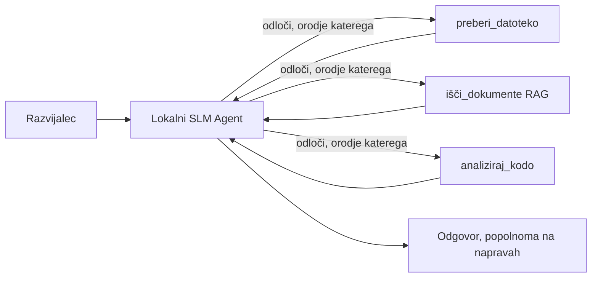
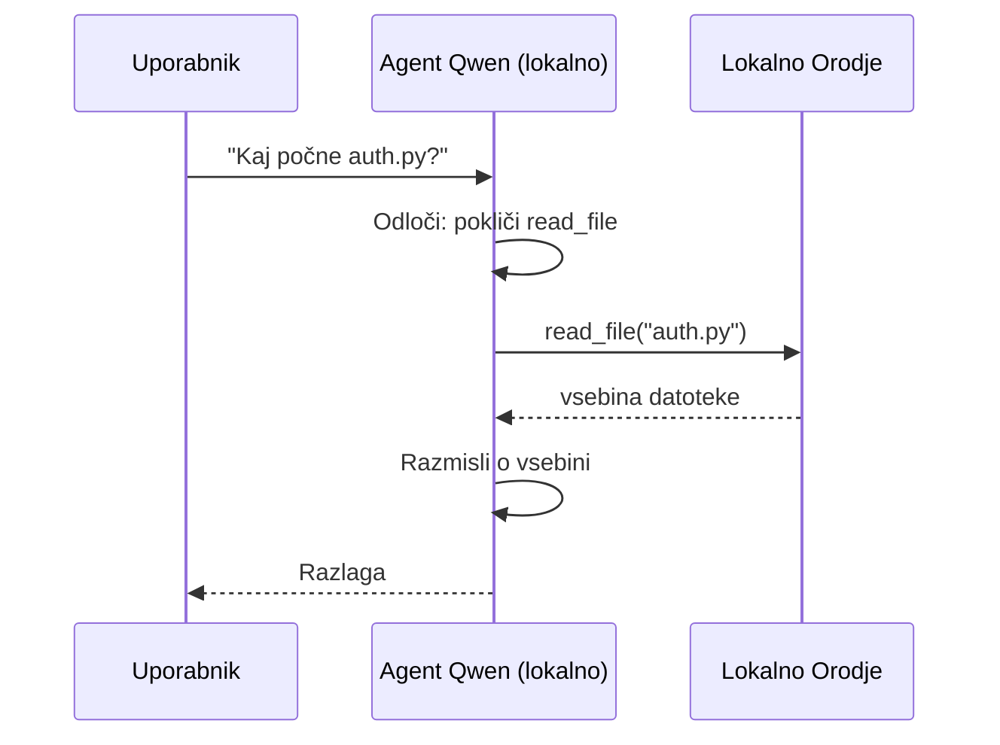
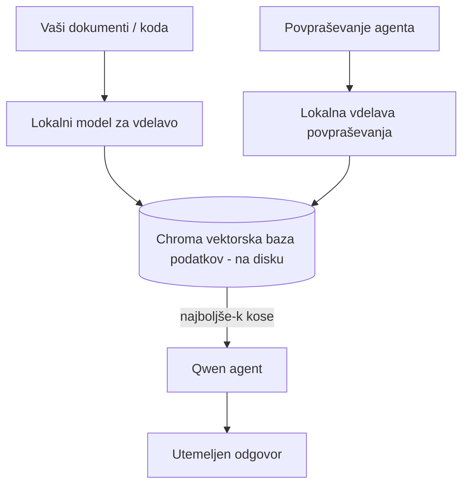
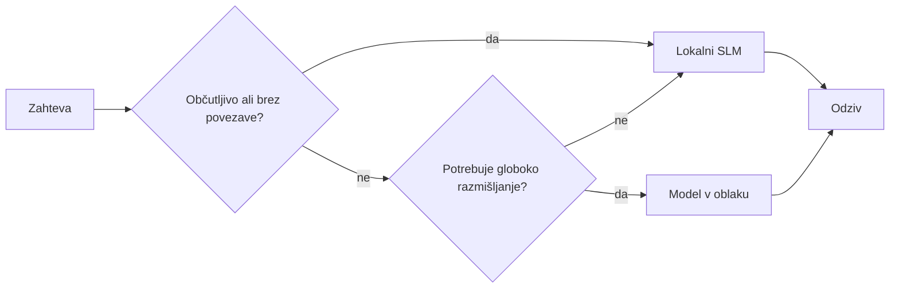

# Ustvarjanje lokalnih AI agentov z Microsoft Foundry Local in Qwen


Prejšnja lekcija je razširila agente *v* oblak. Ta jih prinaša *dol* na eno napravo. Na koncu boste imeli delujočega inženirskega pomočnika, ki razmišlja, kliče orodja, bere vaše datoteke in išče po vaši dokumentaciji — **brez niti enega klica v oblaku za sklepanje.**

Zakaj bi to želeli? Tri razlogi, ki se pogosto pojavljajo pri dejanskem inženirskem delu:

- **Zasebnost.** Koda in dokumenti nikoli ne zapustijo naprave. Noben poziv, noben izvleček, nobeni podatki stranke ne prečkajo omrežne meje.
- **Stroški.** Lokalno sklepanje ne zaračunava na token. Lahko iterirate ves dan za ceno električne energije.
- **Brez povezave.** Na letalu, v varnem objektu ali med izpadom delovanja agent še vedno deluje.

Omejitev je, da zamenjate najnaprednejši oblačni model za **Majhen jezikovni model (SLM)**, ki teče na vašem CPU, GPU ali NPU. Ta lekcija govori o gradnji agentov, ki so *dobri* v okviru te omejitve, namesto da bi se pretvarjali, da omejitve ni.

## Uvod

Ta lekcija bo zajemala:

- **Majhne jezikovne modele (SLM)** — kaj so, kje uspevajo in kje ne.
- **Microsoft Foundry Local** — runtime, ki prenese in postreže modele na napravi prek **API-ja, združljivega z OpenAI**.
- **Qwen modele za klicanje funkcij** — SLM-je, ki zanesljivo ustvarjajo klice orodjem, kar omogoča lokalne *agente* (ne le lokalni klepet).
- **Lokalna orodja, lokalni RAG in lokalni MCP** — opremljanje agenta z zmogljivostmi brez oblaka.
- **Hibridni vzorci** — kdaj obdržati stvari lokalne in kdaj poseči po oblaku.

## Cilji učenja

Po zaključku te lekcije boste znali:

- Razložiti kompromise SLM-jev in izbrati ustrezne primere uporabe lokalnih agentov.
- Lokalno postreči Qwen model z Foundry Local in se nanj povezati prek OpenAI-kompatibilne točke.
- Zgraditi agent, ki kliče orodja in teče v celoti na vaši delovni postaji.
- Dodati lokalni RAG nad vašimi dokumenti z lokalno vektorsko bazo (Chroma).
- Povezati agenta z lokalnim MCP strežnikom in razmišljati o hibridnih lokalnih/oblačnih dizajnih.

## Predpogoji

Ta lekcija predvideva, da ste opravili predhodne lekcije in se dobro znajdete pri:

- [Uporaba orodij](../04-tool-use/README.md) (Lekcija 4) in [Agentic RAG](../05-agentic-rag/README.md) (Lekcija 5).
- [Agentni protokoli / MCP](../11-agentic-protocols/README.md) (Lekcija 11).
- [Microsoft Agent Framework](../14-microsoft-agent-framework/README.md) (Lekcija 14).

Prav tako potrebujete:

- Razvojno delovno postajo. **8 GB RAM je realistični minimum**; 16 GB+ je udobno. GPU ali NPU pomagata, a nista nujna.
- Instaliran **Microsoft Foundry Local** (glej spodnji odsek za namestitev).
- Python 3.12+ in pakete v repozitoriju [`requirements.txt`](../../../requirements.txt), skupaj z `foundry-local-sdk`, `openai` in `chromadb` za to lekcijo.

## Majhni jezikovni modeli: Pravo orodje za lokalno delo

Najnaprednejši oblačni model ima na stotine milijard parametrov in za sabo data center. SLM ima nekaj milijard parametrov in mora stati v RAM vašega prenosnika. Ta razlika postavi jasna pričakovanja.

**SLM-ji so dobri pri:**

- Strukturiranih, omejenih nalogah — razvrščanje, izvleček, povzemanje znanega dokumenta.
- **Klicanju orodij** — odločanje, katero funkcijo poklicati in s katerimi argumenti.
- Hitrih, poceni in zasebnih iteracijah nad vašimi lastnimi podatki.

**SLM-ji so šibkejši pri:**

- Odprtih, večslojnih sklepih po velikem kontekstu.
- Splošnem znanju o svetu (videli so manj, pozabljajo več).

Zmagovalna strategija za lokalne agente je torej: **naj SLM orkestrira, orodja pa naj opravijo težko delo.** Model ne potrebuje, da bi *poznal* vašo kodo — mora vedeti, kdaj poklicati `read_file` in `search_docs`. To je neposredna prednost SLM-ja.



## Microsoft Foundry Local

**Microsoft Foundry Local** je lahkoten runtime, ki na vaši napravi prenese, upravlja in postreže modele. Njegova najpomembnejša lastnost za nas je, da izpostavlja **OpenAI-kompatibilno HTTP točko** — kar pomeni, da OpenAI SDK in OpenAI klient Microsoft Agent Frameworka delujeta nanj le z zamenjavo `base_url`. Vse, kar ste se naučili o gradnji agentov, se prenese neposredno; samo točka se premakne iz oblaka na `localhost`.

Foundry Local tudi samodejno izbere najboljšo verzijo modela za vašo strojno opremo — CPU verzijo, CUDA/GPU ali NPU — tako da ne optimizirate ročno za vsako napravo.

### Namestitev

Namestite Foundry Local (glej [dokumentacijo](https://learn.microsoft.com/azure/ai-foundry/foundry-local/) za svoj OS) in nato preverite, da deluje:

```bash
# Namestite (na primer; sledite dokumentaciji za vašo platformo)
winget install Microsoft.FoundryLocal      # Windows
# brew install microsoft/foundrylocal/foundrylocal   # macOS

# Prenesite in zaženite model Qwen, nato zaženite lokalno storitev
foundry model run qwen2.5-7b-instruct
foundry service status
```

Ko je storitev zagnana, imate lokalno, OpenAI-kompatibilno točko (običajno `http://localhost:PORT/v1`). Zvezek uporablja `foundry-local-sdk`, da samodejno odkrije točko, zato vam ni treba trdo kodirati vrat.

## Qwen klicanje funkcij: Zakaj je pomembno

Agent je agent le, če lahko kliče orodja. Veliko SLM-jev lahko klepeta, a proizvede nezanesljive, napačne klice orodij. **Qwen** modeli so trenirani za klicanje funkcij in dosledno sproducirajo pravilne strukture klicev orodij — kar je natanko tisto, kar spremeni lokalni klepet v lokalnega *agenta*.

Tok je standardni krog klicanja orodij, ki ga že poznate, le da teče neposredno na napravi:



## Lokalni RAG

Iskanje po dokumentaciji je področje, kjer lokalni agenti upravičijo svojo uporabo. Namesto da bi upali, da je SLM memoriziral dokumentacijo vašega okvira, to dokumentacijo vdelate v **lokalno vektorsko bazo** in agentu omogočite, da po potrebi pridobi ustrezne koščke.

Uporabljamo **Chroma**, vgrajeni vektorski shrambo, ki teče v procesu brez strežnika za upravljanje. Celotna poteka je lokalna: lokalni vdelani model → lokalni vektorji → lokalno pridobivanje → lokalni SLM.



To je isti vzorec Agentic RAG iz Lekcije 5 — edina sprememba je, da vse komponente tečejo na vaši napravi.

## Lokalni MCP strežniki

[MCP](../11-agentic-protocols/README.md) je transport, ne oblačna storitev. MCP strežnik lahko teče kot lokalni proces na `stdio`, kjer agentu preko standardnega protokola izpostavi orodja. To vam omogoča ponovno uporabo rastočega ekosistema MCP strežnikov — dostop do datotečnega sistema, git operacij, poizvedb v podatkovnih bazah — povsem brez povezave.

Varnostni položaj je drugačen od oblaka, a ni odsoten: lokalni MCP strežnik še vedno teče z vašimi uporabniškimi dovoljenji, zato omejite, kaj lahko dostopa (npr. projektna mapa, ne vaša celotna domača mapa) in ravnajte z njegovimi izhodi kot z vhodom za preverjanje.

## Hibridni vzorci oblaka in lokalnega

Lokalno-prvo ne pomeni samo lokalno. Zreli sistemi usmerjajo glede na občutljivost in težavnost:

| Situacija | Kje teče |
| --- | --- |
| Občutljiva koda / podatki ali brez povezave | **Lokalni SLM** |
| Preprosta, omejena naloga | **Lokalni SLM** (cenovno ugodno, hitro) |
| Težko večstopenjsko sklepanja na neobčutljivih podatkih | **Oblačni model** |
| Vse, med izpadom | **Lokalni SLM** (prijazno poslabšanje) |

To odraža zamisel **usmerjanja modelov** iz Lekcije 16 — razen da je zdaj ena izmed "modelov" vaša naprava. Robustna zasnova se v primeru nedosegljivega oblaka zanaša na lokalno, tako da agent postopoma poslabša kakovost, namesto da povsem odpove.



## Praktična vaja: lokalni inženirski pomočnik

Odprite [`code_samples/17-local-agent-foundry-local.ipynb`](./code_samples/17-local-agent-foundry-local.ipynb) in ga preglejte. Zgradili boste **lokalnega inženirskega pomočnika**, ki teče v celoti na vaši delovni postaji in lahko:

1. **Kliče orodja** — prek Qwen klicanja funkcij preko Foundry Local.
2. **Izvaja lokalne operacije z datotekami** — navaja in bere datoteke v projektni mapi.
3. **Analizira kodo** — poroča o osnovnih metrikah na izvorni datoteki.
4. **Išče v dokumentaciji** — lokalni RAG preko mape z dokumenti s Chromo.
5. **Uporablja MCP** — poveže se z lokalnim MCP strežnikom (z učtljivim preskokom, če ni konfiguriran).

Nikjer se ne uporablja sklepanje v oblaku.

### Vodnik po korakih

Pomočnik se poveže z Foundry Local prek OpenAI-kompatibilne točke, zato je koda agenta skoraj enaka kot v oblačnih lekcijah — spremeni se le odjemalec:

```python
from foundry_local import FoundryLocalManager
from openai import OpenAI

# Foundry Local odkrije/prenese model in nam zagotovi lokalno končno točko.
manager = FoundryLocalManager(\"qwen2.5-7b-instruct\")
client = OpenAI(base_url=manager.endpoint, api_key=manager.api_key)  # api_key je lokalni nadomestni simbol
```

Orodja so običajne Python funkcije, omejene na projektno mapo:

```python
def read_file(path: str) -> str:
    \"\"\"Read a file, but only inside the sandboxed project directory.\"\"\"
    full = (PROJECT_ROOT / path).resolve()
    if PROJECT_ROOT not in full.parents and full != PROJECT_ROOT:
        return \"Access denied: path is outside the project directory.\"
    return full.read_text(encoding=\"utf-8\")
```

Opozorite na preverjanje peskovnika — tudi lokalno je orodje, ki bere poljubne poti, tveganje. Zvezek omeji vsako orodje na eno projektno korenino.

## Preverjanje znanja

Preizkusite svoje razumevanje pred nadaljevanjem k nalogi.

**1. Navedite dva konkretna razloga, zakaj pognati agenta lokalno namesto v oblaku.**

<details>
<summary>Odgovor</summary>

Katera koli dva iz: **zasebnost** (koda in podatki nikoli ne zapustijo naprave), **stroški** (ni stroška na token sklepanja) in **delovanje brez povezave** (deluje brez omrežja — na letalu, v varnem objektu ali med izpadom). Regulativne omejitve, ki prepovedujejo pošiljanje podatkov iz naprave, so pogost vzrok za zasebnost.
</details>

**2. Kakšna je priporočena delitev dela med SLM in orodji v lokalnem agentu in zakaj?**

<details>
<summary>Odgovor</summary>

Naj SLM **orkestrira** (odloči, katero orodje poklicati in s katerimi argumenti), orodja pa naj **opravljajo težko delo** (branje datotek, iskanje dokumentov, računanje rezultatov). SLM-je odlikujejo omejene odločitve, kot je izbira orodja, a so šibki v širšem znanju in dolgih večstopenjskih sklepih, zato je opiranje na orodja njihova prednost.
</details>

**3. Kaj omogoča ponovno uporabo kode oblačnega agenta z Foundry Local?**

<details>
<summary>Odgovor</summary>

Foundry Local izpostavlja **OpenAI-kompatibilno HTTP točko**. OpenAI SDK in OpenAI klient Agent Frameworka delujeta nanj z zamenjavo le `base_url` (in uporabo lokalnega nadomestnega API ključa). Vse ostalo pri kodi agenta ostane enako.
</details>

**4. Zakaj posebej uporabljamo Qwen model za klicanje funkcij namesto kateregakoli SLM-ja?**

<details>
<summary>Odgovor</summary>

Ker agent mora proizvesti zanesljive, pravilno oblikovane **klice orodij**. Veliko SLM-jev lahko klepeta, a oddajajo napačne ali neustrezne strukture klicev orodij. Qwen modeli so trenirani za klicanje funkcij in dosledno proizvajajo klice orodij, kar lokalni klepet spremeni v delujočega lokalnega agenta.
</details>

**5. Katere komponente tečejo na napravi v lokalnem RAG-pijplajnu?**

<details>
<summary>Odgovor</summary>

Vse: vdelani model, vektorska baza (Chroma, na disku), korak iskanja in SLM. Dokumenti so lokalno vdelani, lokalno shranjeni, lokalno pridobljeni in lokalni model jih obdeluje — nobena komponenta ne dostopajo do oblaka.
</details>

**6. Lokalni MCP strežnik teče na vaši napravi. Ali je to avtomatično varno? Kaj morate še vedno upoštevati?**

<details>
<summary>Odgovor</summary>

Ne. Lokalni MCP strežnik teče z dovoljenji vašega uporabnika, zato lahko dostopa do vsega, kar vi lahko. Omejite ga na tisto, kar potrebuje (npr. samo eno projektno mapo, ne celotne domače mape) in z njegovimi izhodi ravnajte kot z vhodnimi podatki, ki jih morate preveriti, preden ukrepate.
</details>

**7. Opisite smiselno hibridno pravilo usmerjanja, ki vključuje lokalni model.**

<details>
<summary>Odgovor</summary>

Usmerjajte občutljive ali zahteve brez povezave na lokalni SLM; preproste omejene naloge naj tečejo na lokalnem SLM-ju zaradi hitrosti in stroškov; zahtevno večstopenjsko sklepanje na neobčutljivih podatkih na oblačni model; in uporabite lokalni SLM, če oblak ni dosegljiv, da agent prijazno poslabša kakovost namesto povsem odpove. To je usmerjanje modelov (Lekcija 16) z lokalno napravo kot enim izmed modelov.
</details>

**8. Kakšna je realistična minimalna količina RAM-a za poganjanje lokalnega agenta v tej lekciji in kaj dobite z več RAM-a?**

<details>
<summary>Odgovor</summary>

Približno **8 GB** je realistični minimum; 16 GB+ je udobno. Več RAM-a omogoča poganjanje večjih, zmogljivejših modelov in hranjenje več konteksta v spominu. GPU ali NPU pospešujeta sklepanje, a nista nujna — Foundry Local izbere CPU verzijo, če ni na voljo pospeševalnika.
</details>

## Naloga

Razširite lokalnega inženirskega pomočnika v **lokalnega recenzenta dokumentacije** za manjši projekt po vaši izbiri (lahko uporabite eno iz lekcijskih map tega repozitorija).

Vaša rešitev naj:

1. **Indeksira resnično mapo z dokumentacijo/kodo** v Chromo (vsaj pet datotek).
2. **Doda orodje `find_todos`**, ki preišče projekt za komentarje `TODO`/`FIXME` in jih vrne z datoteko in številko vrstice — ob uporabi istega preverjanja peskovnika kot `read_file`.

3. **Postavite agentu tri vprašanja**, ki ga prisilijo k združevanju orodij: eno čisto RAG vprašanje, eno, ki zahteva branje določene datoteke, in eno, ki zahteva iskanje TODOjev.
4. **Izmerite ga**: merite čas vsakega od treh odgovorov in jih zapišite v markdown celico. Komentirajte, ali je zakasnitev sprejemljiva za vaš predvideni delovni proces.

Nato napišite kratek odstavek o **tem, kaj bi premaknili v oblak in kaj bi obdržali lokalno** za tega pregledovalca, in zakaj. Ovrednoteni boste glede na to, ali so lokalne komponente pravilno povezane in ali je vaše hibridno razmišljanje smiselno — ne glede na kakovost modela.

## Povzetek

V tej lekciji ste zgradili agenta, ki teče povsem na vašem lastnem računalniku:

- **SLMs** zamenjajo širino z zasebnostjo, stroški in delovanjem brez povezave — in izstopajo, ko **orkestrirajo orodja** namesto da bi nosili vse znanje sami.
- **Foundry Local** streže modele na napravi za **OpenAI-kompatibilno končno točko**, tako da se vaša koda oblačnega agenta prenese z eno vrstico spremembe.
- **Qwen modeli za klic funkcij** omogočajo zanesljiv lokalni klic orodij — in s tem lokalne *agente*.
- **Lokalni RAG** (Chroma) in **lokalni MCP** dajejo agentu zmogljivost, ne da bi zapustil računalnik.
- **Hibridni vzorci** vam omogočajo usmerjanje glede na občutljivost in zahtevnost, pri čemer je lokalno prijazen padec nazaj.

S tem je zaključen razpon uvajanja: lekcija 16 je razširila agente v Microsoft Foundry, in ta lekcija jih je skrčila na eno delovno postajo. Naslednja lekcija se osredotoča na zagotavljanje varnosti nameščenih agentov.

## Dodatni viri

- <a href="https://learn.microsoft.com/azure/ai-foundry/foundry-local/" target="_blank">Dokumentacija Microsoft Foundry Local</a>
- <a href="https://learn.microsoft.com/azure/ai-foundry/what-is-azure-ai-foundry" target="_blank">Dokumentacija Microsoft Foundry</a>
- <a href="https://learn.microsoft.com/en-us/agent-framework/overview/?wt.mc_id=youtube_26688_organicsocial_reactor&pivots=programming-language-python" target="_blank">Microsoft Agent Framework</a>
- <a href="https://qwen.readthedocs.io/en/latest/framework/function_call.html" target="_blank">Dokumentacija klicev funkcij Qwen</a>
- <a href="https://modelcontextprotocol.io/" target="_blank">Model Context Protocol (MCP)</a>
- <a href="https://docs.trychroma.com/" target="_blank">Chroma vektorska baza podatkov</a>

## Prejšnja lekcija

[Uvajanje razširljivih agentov](../16-deploying-scalable-agents/README.md)

## Naslednja lekcija

[Zagotavljanje varnosti AI agentov](../18-securing-ai-agents/README.md)

---

<!-- CO-OP TRANSLATOR DISCLAIMER START -->
**Omejitev odgovornosti**:
Ta dokument je bil preveden z uporabo AI prevajalske storitve [Co-op Translator](https://github.com/Azure/co-op-translator). Čeprav si prizadevamo za natančnost, vas prosimo, da upoštevate, da avtomatizirani prevodi lahko vsebujejo napake ali netočnosti. Izvirni dokument v njegovem izvirnem jeziku je treba obravnavati kot avtoritativni vir. Za kritične informacije je priporočljiv strokovni človeški prevod. Ne odgovarjamo za morebitna nesporazume ali napačne interpretacije, ki izhajajo iz uporabe tega prevoda.
<!-- CO-OP TRANSLATOR DISCLAIMER END -->