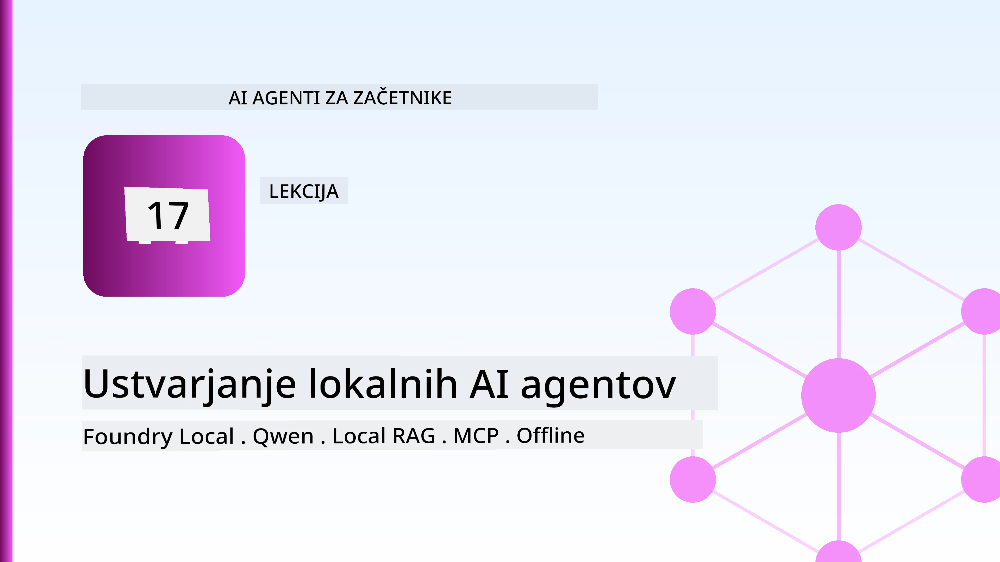
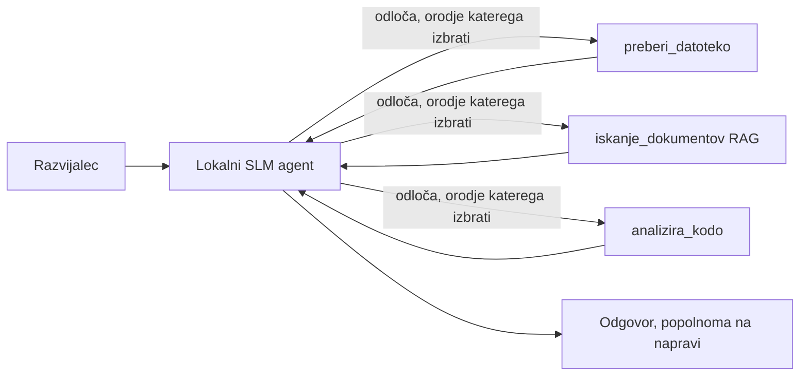
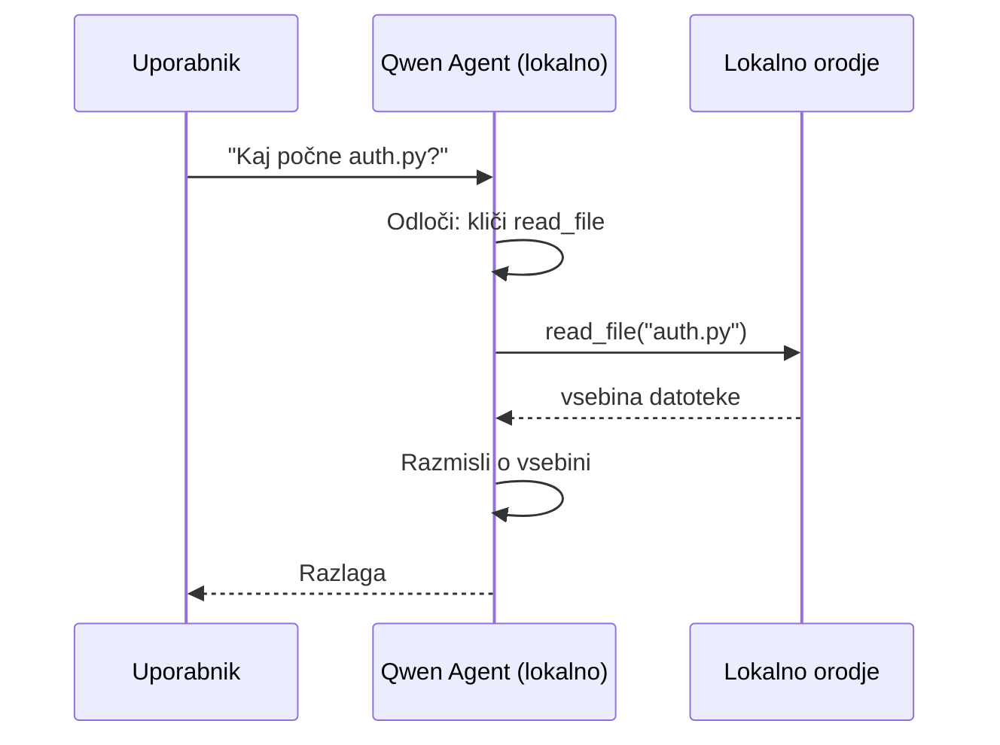
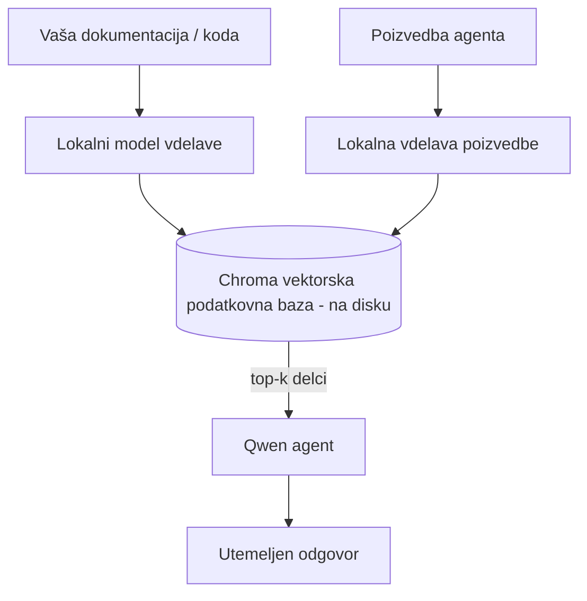
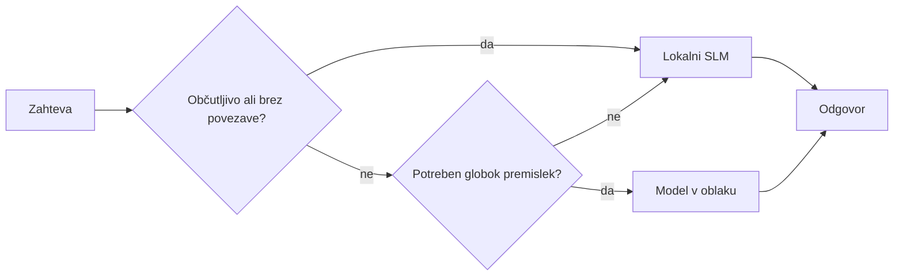

# Ustvarjanje lokalnih AI agentov z Microsoft Foundry Local in Qwen



Prejšnja lekcija je razširila agente *v oblak*. Ta jih prenese *dol* na en sam računalnik. Do konca boste imeli delujočega inženirskega asistenta, ki razmišlja, kliče orodja, bere vaše datoteke in išče v vaši dokumentaciji — **brez enega samega klica k oblaku za inferenco.**

Zakaj bi to želeli? Tri razloga, ki se stalno pojavljajo v resničnem inženirskem delu:

- **Zasebnost.** Koda in dokumenti nikoli ne zapustijo računalnika. Noben ukaz, noben izsek, nobeni podatki stranke ne prečkajo omrežne meje.
- **Stroški.** Lokalno izvajanje ne zaračunava na token. Lahko iterirate cel dan za ceno elektrike.
- **Brez povezave.** Na letalu, v varni ustanovi ali med izpadom, agent še vedno deluje.

Ujem je, da zamenjujete napreden oblačni model za **majhen jezikovni model (SLM)**, ki teče na vašem CPU-ju, GPU-ju ali NPU-ju. Ta lekcija je o gradnji agentov, ki so *dobri* znotraj tega omejitvenega okvira, ne pa da bi se pretvarjali, da omejitev ni.

## Uvod

Ta lekcija bo zajemala:

- **Majhne jezikovne modele (SLM-je)** — kaj so, kje izstopajo in kje ne.
- **Microsoft Foundry Local** — runtime, ki prenese in streže modele na napravi prek **OpenAI združljivega API-ja**.
- **Qwen modele za klicanje funkcij** — SLM-je, ki zanesljivo ustvarijo klice orodij, kar omogoča lokalne *agente* (ne samo lokalne klepete).
- **Lokalna orodja, lokalni RAG in lokalni MCP** — ki agentu omogočajo delovanje brez oblaka.
- **Hibridni vzorci** — kdaj nekaj obdržati lokalno in kdaj posegati v oblak.

## Cilji učenja

Po zaključku te lekcije boste znali:

- Pojasniti izmenjave pri SLM-jih in izbrati primerne scenarije za lokalne agente.
- Lokalno postreči Qwen model z Foundry Local in se povezat nanj prek OpenAI združljivega končnega mesta.
- Zgraditi agenta za klicanje orodij, ki teče povsem na vaši delovni postaji.
- Dodati lokalni RAG čez lastne dokumente z lokalno vektorsko bazo podatkov (Chroma).
- Povezati agenta s lokalnim MCP strežnikom in razmišljati o hibridnih lokalnih/oblačnih zasnovah.

## Predpogoji

Ta lekcija predvideva, da ste opravili prejšnje lekcije in da ste udobni z:

- [Uporaba orodij](../04-tool-use/README.md) (Lekcija 4) in [Agentic RAG](../05-agentic-rag/README.md) (Lekcija 5).
- [Agentic protokoli / MCP](../11-agentic-protocols/README.md) (Lekcija 11).
- [Microsoft Agent Framework](../14-microsoft-agent-framework/README.md) (Lekcija 14).

Potrebovali boste tudi:

- Razvojno delovno postajo. **8 GB RAM je realističen minimum**; 16 GB+ je udobno. GPU ali NPU pomaga, ni pa nujno.
- Namestitev **Microsoft Foundry Local** (oglejte si spodnji razdelek za namestitev).
- Python 3.12+ in pakete iz repozitorija [`requirements.txt`](../../../requirements.txt), plus `foundry-local-sdk`, `openai` in `chromadb` za to lekcijo.

## Majhni jezikovni modeli: Pravo orodje za lokalno delo

Napreden oblačni model ima na stotine milijard parametrov in podatkovni center za sabo. SLM ima le nekaj milijard parametrov in mora v prostor vaše prenosnika. Ta razlika postavi jasna pričakovanja.

**SLM-ji so dobri pri:**

- Strukturiranih, omejenih nalogah — razvrščanju, izvlečku, povzetku znanega dokumenta.
- **Klicanju orodij** — odločanju, katero funkcijo poklicati in s kakšnimi argumenti.
- Hitrih, poceni in zasebnih iteracijah na lastnih podatkih.

**SLM-ji so šibkejši pri:**

- Odprtih, večstopenjskih sklepih prek velikega konteksta.
- Širokem svetovnem znanju (videli so manj in hitreje pozabljajo).

Zmagovalna strategija za lokalne agente je zato: **naj SLM orkestrira, orodja pa naj opravijo težko delo.** Model ne potrebuje, da *pozna* vaš kôd — mora vedeti, kdaj kliče `read_file` in `search_docs`. To neposredno igra v prednosti SLM-ja.



## Microsoft Foundry Local

**Microsoft Foundry Local** je lahkoten runtime, ki prenese, upravlja in streže modele povsem na vašem računalniku. Najpomembnejša lastnost za nas je, da razkriva **OpenAI združljiv HTTP endpoint** — kar pomeni, da OpenAI SDK in Microsoft Agent Framework-ov OpenAI klient delujeta nanj z le spremembo `base_url`. Vse, kar ste se naučili o gradnji agentov, se prenese neposredno; zgolj endpoint se seli iz oblaka v `localhost`.

Foundry Local tudi samodejno izbere najboljšo različico modela za vašo strojno opremo — CPU različico, CUDA/GPU različico ali NPU različico — zato vam ni treba ročno optimizirati za vsako napravo.

### Namestitev

Namestite Foundry Local (glejte [dokumentacijo](https://learn.microsoft.com/azure/ai-foundry/foundry-local/) za vaš OS) in nato potrdite, da deluje:

```bash
# Namestite (primer; sledite dokumentaciji za vašo platformo)
winget install Microsoft.FoundryLocal      # Windows
# brew install microsoft/foundrylocal/foundrylocal   # macOS

# Prenesite in zaženite model Qwen, nato zaženite lokalno storitev
foundry model run qwen2.5-7b-instruct
foundry service status
```

Ko storitev teče, imate lokalno, OpenAI združljivo končno točko (običajno `http://localhost:PORT/v1`). Zvezek uporablja `foundry-local-sdk` za samodejno odkrivanje endpointa, tako da vam ni treba ročno nastavljati porta.

## Qwen klicanje funkcij: Zakaj je pomembno

Agent je agent le, če lahko kliče orodja. Veliko SLM-jev zna klepetati, a proizvajajo nezanesljive, neustrezne klice orodij. **Qwen** modeli so usposobljeni za klicanje funkcij in konsistentno ustvarjajo pravilno oblikovane strukture klicev orodij — to je tisto, kar spremeni lokalni klepet v lokalnega *agenta*.

Potek je standardni zanka za klicanje orodij, ki jo že poznate, le da teče na napravi:



## Lokalni RAG

Iskanje v dokumentaciji je, kjer lokalni agenti opravijo svojo vlogo. Namesto da bi upali, da je SLM zapomnil dokumentacijo vašega ogrodja, te dokumente vdelate v **lokalno vektorsko bazo podatkov** in agentu omogočite, da po potrebi poišče ustrezne dele.

Uporabljamo **Chroma**, vgrajeno vektorsko shrambo, ki teče znotraj procesa brez potrebe po upravljanju strežnika. Potek je povsem lokalni: lokalni vdelani model → lokalni vektorji → lokalno iskanje → lokalni SLM.



To je isti vzorec Agentic RAG iz Lekcije 5 — edina sprememba je, da vsi deli tečejo na vaši napravi.

## Lokalni MCP strežniki

[MCP](../11-agentic-protocols/README.md) je prenosni protokol, ne oblačna storitev. MCP strežnik lahko teče kot lokalni proces na `stdio`, agentu pa preko standardnega protokola nudi orodja. To omogoča ponovno uporabo rastočega ekosistema MCP strežnikov — dostop do datotečnega sistema, git operacije, poizvedbe v bazo — povsem brez povezave.

Varnostni položaj lokalno je drugačen, a ne odsoten: lokalni MCP strežnik še vedno teče z dovoljenji vašega uporabnika, zato omejite, kaj lahko dostopa (npr. projektna mapa, ne celotna domača mapa) in obravnavajte njegove izhode kot vhodne podatke za preverjanje.

## Hibridni oblačno-lokalni vzorci

Lokalno najprej ne pomeni samo lokalno. Zreli sistemi usmerjajo zahteve glede na občutljivost in zahtevnost:

| Situacija | Kje teče |
| --- | --- |
| Občutljiva koda / podatki ali brez povezave | **Lokalni SLM** |
| Preprosta, omejena naloga | **Lokalni SLM** (cenejši, hitrejši) |
| Zahtevno večstopenjsko sklepanje o neobčutljivih podatkih | **Oblačni model** |
| Vse med izpadom | **Lokalni SLM** (prijazna degradacija) |

To odraža idejo **usmerjanja modelov** iz Lekcije 16 — razen da je eden od "modelov" zdaj vaš lasten računalnik. Robustna zasnova se ob neuspehu oblaka umakne lokalnemu, tako da agent izgublja kakovost in ne odpove povsem.



## Praktična delavnica: lokalni inženirski pomočnik

Odprite [`code_samples/17-local-agent-foundry-local.ipynb`](./code_samples/17-local-agent-foundry-local.ipynb) in prehodite skozi. Zgradili boste **lokalnega inženirskega pomočnika**, ki teče povsem na vaši delovni postaji in lahko:

1. **Kliče orodja** — prek Qwen klicanja funkcij z Foundry Local.
2. **Izvaja lokalne operacije z datotekami** — vrstni red in branje datotek v projektni mapi.
3. **Analizira kodo** — poroča osnovne metrike o izvorni datoteki.
4. **Išče po dokumentaciji** — lokalni RAG preko mape z dokumenti s Chromo.
5. **Uporablja MCP** — poveže se z lokalnim MCP strežnikom (s prijaznim preskokom, če ni nastavljen).

Nobenega klica v oblak se ne uporablja.

### Korak za korakom

Pomočnik se poveže na Foundry Local prek OpenAI združljivega endpointa, tako da koda agenta izgleda skoraj enako kot v oblačnih lekcijah — spremeni se le klient:

```python
from foundry_local import FoundryLocalManager
from openai import OpenAI

# Foundry Local odkrije/pridobi model in nam zagotovi lokalno končno točko.
manager = FoundryLocalManager(\"qwen2.5-7b-instruct\")
client = OpenAI(base_url=manager.endpoint, api_key=manager.api_key)  # api_key je lokalni nadomestni znak
```

Orodja so običajne Python funkcije omejene na projektno mapo:

```python
def read_file(path: str) -> str:
    \"\"\"Read a file, but only inside the sandboxed project directory.\"\"\"
    full = (PROJECT_ROOT / path).resolve()
    if PROJECT_ROOT not in full.parents and full != PROJECT_ROOT:
        return \"Access denied: path is outside the project directory.\"
    return full.read_text(encoding=\"utf-8\")
```

Opazite preverjanje peskovnika — tudi lokalno je orodje, ki bere poljubne poti, tveganje. Zvezek omeji vsa orodja na eno projektno korensko mapo.

## Preverjanje znanja

Preizkusite svoje razumevanje pred premikom k nalogi.

**1. Naštejte dva konkretna razloga, zakaj bi agenta poganjali lokalno namesto v oblaku.**

<details>
<summary>Odgovor</summary>

Katera koli dva izmed: **zasebnost** (koda in podatki nikoli ne zapustijo naprave), **stroški** (ni zaračunavanja na token inferenco), in **zmožnost brez povezave** (deluje brez omrežja — na letalu, v varni ustanovi ali med izpadom). Regulatorne/uvozne omejitve, ki prepovedujejo pošiljanje podatkov z naprave, so pogost vzrok za zasebnost.
</details>

**2. Kakšna naj bo priporočena razporeditev dela med SLM-jem in njegovimi orodji v lokalnem agentu in zakaj?**

<details>
<summary>Odgovor</summary>

Naj SLM **orkestrira** (odloča, katero orodje poklicati in s kakšnimi argumenti), orodja pa naj **izvedejo težko delo** (branje datotek, iskanje po dokumentih, izračun rezultatov). SLM-ji so močni pri omejenih odločitvah, kot je izbira orodja, a šibkejši pri širokem znanju in dolgih večstopenjskih sklepih, zato je zanašanje na orodja njihova prednost.
</details>

**3. Kaj omogoča ponovno uporabo oblačne kode agenta z Foundry Local?**

<details>
<summary>Odgovor</summary>

Foundry Local razkriva **OpenAI združljivo HTTP končno točko**. OpenAI SDK in Agent Framework-ov OpenAI klient delujeta nanj s spremembo le `base_url` (in uporabo lokalnega nadomestnega API ključa). Vse drugo glede kode agenta ostane enako.
</details>

**4. Zakaj uporabljamo prav Qwen model za klicanje funkcij, ne pa kar kateri koli SLM?**

<details>
<summary>Odgovor</summary>

Ker mora agent proizvajati zanesljive, pravilno oblikovane **klice orodij**. Veliko SLM-jev zna klepetati, a oddajajo nepravilne ali nedosledne strukture klicev orodij. Qwen modeli so usposobljeni za klicanje funkcij in proizvajajo dosledne klice orodij, kar spremeni lokalni klepet v delujočega lokalnega agenta.
</details>

**5. Katere komponente v lokalnem RAG poteku tečejo na napravi?**

<details>
<summary>Odgovor</summary>

Vse: model vdelave, vektorska baza podatkov (Chroma, na disku), korak iskanja in SLM. Dokumenti se vdelajo lokalno, shranijo lokalno, poiščejo lokalno in nad njimi sklepa lokalni model — nobena komponenta ne dostopa do oblaka.
</details>

**6. Lokalni MCP strežnik teče na vaši napravi. Ali to pomeni, da je avtomatično varen? Katero previdnost morate vseeno upoštevati?**

<details>
<summary>Odgovor</summary>

Ne. Lokalni MCP strežnik teče z dovoljenji vašega uporabnika, zato lahko dostopa do vsega, do česar lahko tudi vi. Omejite ga na tisto, kar potrebuje (npr. ena projektna mapa, ne celotna domača mapa) in njegove izhode obravnavajte kot vhode za preverjanje, preden ukrepate.
</details>

**7. Opišite razumljivo pravilo hibridnega usmerjanja, ki vključuje lokalni model.**

<details>
<summary>Odgovor</summary>

Usmerite občutljive ali brez povezave zahteve na lokalni SLM; preproste omejene naloge na lokalni SLM zaradi hitrosti in stroškov; zahtevno večstopenjsko sklepanje o neobčutljivih podatkih na oblačni model; in se ob neuspehu oblaka umaknite nazaj na lokalni SLM, da agent prijazno degradira namesto da odpove povsem. To je usmerjanje modelov (Lekcija 16) s to napravo kot enim od modelov.
</details>

**8. Kakšna je realistična minimalna količina RAM-a za pogon lokalnega agenta v tej lekciji in kaj vam prinese več RAM-a?**

<details>
<summary>Odgovor</summary>

Približno **8 GB** je realističen minimum; 16 GB+ je udobno. Več RAM-a omogoča pogon večjih, zmogljivejših modelov in bolj shranjen kontekst v spominu. GPU ali NPU pospeši inferenco, ni pa nujno — Foundry Local izbere CPU različico, če ni pospeševalca.
</details>

## Naloga

Razširite lokalnega inženirskega pomočnika v **lokalnega pregledovalca dokumentacije** za majhen projekt po vaši izbiri (po želji uporabite eno izmed map lekcij v tem repozitoriju).

Vaša oddaja naj:

1. **Indeksira pravo mapo z dokumenti/kodo** v Chromo (vsaj pet datotek).
2. **Doda orodje `find_todos`**, ki pregleda projekt za komentarje `TODO`/`FIXME` in jih vrne z imenom datoteke in številko vrstice — pri tem ohranja enako preverjanje peskovnika kot `read_file`.

3. **Vprašajte agenta tri vprašanja**, ki ga prisilijo v kombiniranje orodij: eno čisto RAG vprašanje, eno, ki zahteva branje določenega datoteke, in eno, ki zahteva iskanje TODO-jev.
4. **Izmerite ga**: čas vsakega od treh odgovorov in jih zabeležite v markdown celico. Komentirajte, ali je latenca sprejemljiva za vaš predvideni potek dela.

Nato napišite kratek odstavek o tem, **kaj bi premaknili v oblak in kaj bi obdržali lokalno** za tega pregledovalca ter zakaj. Ocenjeni ste glede na to, ali so lokalne komponente pravilno povezane in ali je vaše hibridno sklepanje smiselno — ne glede na kakovost modela.

## Povzetek

V tej lekciji ste zgradili agenta, ki deluje v celoti na vašem lastnem računalniku:

- **SLM-i** zamenjajo širino za zasebnost, stroške in brez povezave delovanje — in izstopajo, ko **usklajujejo orodja**, namesto da bi nosili vse znanje sami.
- **Foundry Local** streže modele na napravi prek **OpenAI-kompatibilne točke konca**, zato se vaša koda za agenta v oblaku prenese z eno vrstico spremembe.
- **Qwen modeli za klic funkcij** omogočajo zanesljiv lokalni klic orodij — in torej lokalne *agente*.
- **Lokalni RAG** (Chroma) in **lokalni MCP** agentu zagotavljata zmogljivosti brez zapuščanja naprave.
- **Hibridni vzorci** vam omogočajo usmerjanje glede na občutljivost in zahtevnost, pri čemer je lokalno elegantna rezerva.

S tem je zaključen krog uvajanja: Lekcija 16 je razširila agente v Microsoft Foundry, ta lekcija pa jih je zmanjšala na eno delovno postajo. Naslednja lekcija se posveča varnemu uvajanju agentov.

## Dodatni viri

- <a href="https://learn.microsoft.com/azure/ai-foundry/foundry-local/" target="_blank">Dokumentacija Microsoft Foundry Local</a>
- <a href="https://learn.microsoft.com/azure/ai-foundry/what-is-azure-ai-foundry" target="_blank">Dokumentacija Microsoft Foundry</a>
- <a href="https://learn.microsoft.com/en-us/agent-framework/overview/?wt.mc_id=youtube_26688_organicsocial_reactor&pivots=programming-language-python" target="_blank">Microsoft Agent Framework</a>
- <a href="https://qwen.readthedocs.io/en/latest/framework/function_call.html" target="_blank">Dokumentacija za Qwen klic funkcij</a>
- <a href="https://modelcontextprotocol.io/" target="_blank">Model Context Protocol (MCP)</a>
- <a href="https://docs.trychroma.com/" target="_blank">Chroma vektorska baza podatkov</a>

## Prejšnja lekcija

[Uvajanje razširljivih agentov](../16-deploying-scalable-agents/README.md)

## Naslednja lekcija

[Varnost AI agentov](../18-securing-ai-agents/README.md)

---

<!-- CO-OP TRANSLATOR DISCLAIMER START -->
**Omejitev odgovornosti**:
Ta dokument je bil preveden z uporabo AI prevajalske storitve [Co-op Translator](https://github.com/Azure/co-op-translator). Čeprav si prizadevamo za natančnost, vas prosimo, da upoštevate, da avtomatizirani prevodi lahko vsebujejo napake ali netočnosti. Izvirni dokument v njegovem izvirnem jeziku je treba obravnavati kot avtoritativni vir. Za kritične informacije je priporočljiv strokovni človeški prevod. Ne odgovarjamo za morebitna nesporazume ali napačne interpretacije, ki izhajajo iz uporabe tega prevoda.
<!-- CO-OP TRANSLATOR DISCLAIMER END -->