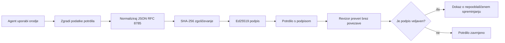
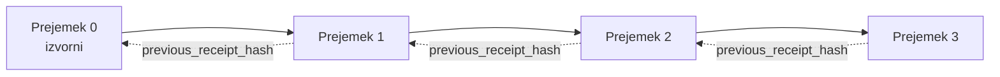

[Oglejte si video lekcije: Zavarovanje AI agentov s kriptografskimi potrdili](https://youtu.be/PLACEHOLDER_VIDEO_ID)

> _(Video lekcije in sličico bo po združitvi dodala Microsoftova vsebinska ekipa, v skladu s vzorcem lekcij 14 / 15.)_

# Zavarovanje AI agentov s kriptografskimi potrdili

## Uvod

V tej lekciji boste spoznali:

- Zakaj so revizijske sledi za AI agente pomembne za skladnost, odpravljanje napak in zaupanje.
- Kaj je kriptografsko potrdilo in kako se razlikuje od nepodpisane vrstic dnevnika.
- Kako izdelati podpisano potrdilo za klic orodja agenta v navadnem Pythonu.
- Kako preveriti potrdilo brez povezave in zaznati manipulacijo.
- Kako verižiti potrdila, tako da odstranjevanje ali preurejanje enega prekine verigo.
- Kaj potrdila dokazujejo in česa izrecno ne dokazujejo.

## Cilji učenja

Po zaključku te lekcije boste znali:

- Prepoznati načine napak, ki upravičujejo kriptografski izvor za ukrepe agenta.
- Izdelati Ed25519-podpisano potrdilo nad kanoničnim JSON-nabiralom.
- Neodvisno preveriti potrdilo z uporabo samo javnega ključa podpisovalca.
- Zaznati manipulacijo z ponovnim izvajanjem preverjanja na spremenjenem potrdilu.
- Zgraditi verigo potrdil s kriptografskim zgoščevanjem in pojasniti, zakaj je veriga pomembna.
- Prepoznati mejo med tem, kaj potrdila dokazujejo (pritrditev, integriteta, vrstni red) in česa ne (pravilen ukrep, veljavnost politike).

## Problem: revizijska sled vašega agenta

Predstavljajte si, da ste za Contoso Travel uvedli AI agenta. Agent bere zahteve strank, kliče API za lete, da poišče možnosti, in rezervira sedeže v imenu strank. V preteklem četrtletju je agent obdelal 50.000 rezervacij.

Danes pride revizor in postavi preprosto vprašanje: "Pokažite mi, kaj je vaš agent naredil."

Predate mu svoje dnevniške datoteke. Revizor jih pregleda in postavi težje vprašanje: "Kako vem, da ti dnevniki niso bili urejeni?"

To je problem revizijskih sledi. Večina današnjih uvedb agentov se zanaša na:

- **Dnevniške evidence aplikacij**: zapisane s strani samega agenta, jih lahko ureja kdorkoli z dostopom do datotečnega sistema.
- **Storitve beleženja v oblaku**: na platformni ravni so vidne manipulacije, vendar le, če revizor zaupa upravljavcu platforme.
- **Dnevniške transakcije baze podatkov**: primerne za spremembe baz podatkov, ne pa za poljubne klice orodij.

Nobena od teh možnosti ne zadošča brez, da bi moral revizor zaupati nekomu (vam, vašemu ponudniku oblaka, prodajalcu baze podatkov). Za notranjo uporabo je to pogosto sprejemljivo. Za regulirane naloge (finančne, zdravstvene, karkoli pod EU AI aktom) pa ni.

Kriptografska potrdila to rešujejo tako, da je vsak ukrep agenta neodvisno preverljiv. Revizor vam ni dolžan zaupati. Potrebuje le vaš javni ključ in samo potrdilo.

## Kaj je kriptografsko potrdilo?

Potrdilo je JSON-objekt, ki zabeleži, kaj je agent naredil, podpisan z digitalnim podpisom.



Minimalno potrdilo izgleda tako:

```json
{
  "type": "agent.tool_call.v1",
  "agent_id": "contoso-travel-bot",
  "tool_name": "lookup_flights",
  "tool_args_hash": "sha256:a3f9c1...",
  "result_hash": "sha256:7b2e1d...",
  "policy_id": "contoso-travel-policy-v3",
  "timestamp": "2026-04-25T14:30:00Z",
  "sequence": 47,
  "previous_receipt_hash": "sha256:9d4e6a...",
  "signature": {
    "alg": "EdDSA",
    "sig": "c5af83...",
    "public_key": "8f3b2c..."
  }
}
```

Tri lastnosti opravijo delo:

1. **Podpis**. Potrdilo podpiše vstopna točka agenta z vsebnim Ed25519 zasebnim ključem. Kdor ima ustrezni javni ključ, lahko podpis preveri brez povezave. Vsaka manipulacija polja razveljavi podpis.

2. **Kanonično kodiranje**. Pred podpisom je potrdilo serijalizirano po JSON Canonicalization Scheme (JCS, RFC 8785). To zagotavlja, da dve implementaciji, ki proizvedeta enako logično potrdilo, proizvedeta tudi bajtovno identičen izhod. Brez kanonizacije bi različni JSON serilizatorji proizvedli različne podpise za isto vsebino.

3. **Veriga zgoščenk**. Polje `previous_receipt_hash` povezuje vsako potrdilo s predhodnim. Odstranitev ali preurejanje potrdila prekine vsak naslednji del verige. Manipulacija postane vidna na ravni verige, tudi če so posamezni podpisi zaobšli.

Skupaj te lastnosti zagotavljajo tri jamstva:

- **Pritrditev**: Ta ključ je podpisal to vsebino.
- **Integriteta**: vsebina se od podpisa ni spremenila.
- **Vrstni red**: to potrdilo je sledilo tistemu v verigi.

## Izdelava potrdila v Pythonu

Ne potrebujete posebne knjižnice za izdelavo potrdila. Kriptografski gradniki so široko dostopni, logika pa je nekaj deset vrstic Pythona.

Praktične vaje v `code_samples/18-signed-receipts.ipynb` vodijo skozi celoten potek. Povzetek:

```python
import json
import hashlib
import base64
from nacl import signing
from jcs import canonicalize  # RFC 8785 kanoničen JSON

def b64url_nopad(data: bytes) -> str:
    return base64.urlsafe_b64encode(data).decode("ascii").rstrip("=")

def sha256_canonical(obj) -> str:
    """SHA-256 of a Python object's JCS-canonical JSON form."""
    return f"sha256:{hashlib.sha256(canonicalize(obj)).hexdigest()}"

# Ustvari ali naloži ključ za podpisovanje (v proizvodnji shrani v varno skladišče ključev)
signing_key = signing.SigningKey.generate()
verify_key = signing_key.verify_key

# Ustvari vsebino potrdila (še brez podpisa)
tool_args = {"origin": "SYD", "destination": "LAX"}
tool_result = [{"flight": "QF11", "price": 1850, "stops": 0}]

payload = {
    "type": "agent.tool_call.v1",
    "agent_id": "contoso-travel-bot",
    "tool_name": "lookup_flights",
    "tool_args_hash": sha256_canonical(tool_args),
    "result_hash": sha256_canonical(tool_result),
    "policy_id": "contoso-travel-policy-v3",
    "timestamp": "2026-04-25T14:30:00Z",
    "sequence": 0,
    "previous_receipt_hash": None,
}

# Kanoniziraj, zgošči, podpiši.
canonical_bytes = canonicalize(payload)
message_hash = hashlib.sha256(canonical_bytes).digest()
signature_bytes = signing_key.sign(message_hash).signature

# Priloži strukturiran podpisni objekt.
receipt = {
    **payload,
    "signature": {
        "alg": "EdDSA",
        "sig": b64url_nopad(signature_bytes),
        "public_key": b64url_nopad(bytes(verify_key)),
    },
}
```

To je celotna podpisna cevovodna linija. Vaje v zvezku vodijo skozi vsak korak.

## Preverjanje potrdila in zaznavanje manipulacij

Preverjanje je obratna operacija:

```python
import base64
import hashlib
from nacl import signing
from nacl.exceptions import BadSignatureError
from jcs import canonicalize

def b64url_decode(s: str) -> bytes:
    padding = "=" * ((4 - len(s) % 4) % 4)
    return base64.urlsafe_b64decode(s + padding)

def verify_receipt(receipt: dict) -> bool:
    # Podpis je strukturiran objekt: {"alg", "sig", "public_key"}.
    sig_obj = receipt.get("signature")
    if not sig_obj or sig_obj.get("alg") != "EdDSA":
        return False

    # Rekonstruirajte vsebino, ki je bila dejansko podpisana (vse razen podpisa).
    payload = {k: v for k, v in receipt.items() if k != "signature"}

    canonical_bytes = canonicalize(payload)
    message_hash = hashlib.sha256(canonical_bytes).digest()

    try:
        verify_key = signing.VerifyKey(b64url_decode(sig_obj["public_key"]))
        verify_key.verify(message_hash, b64url_decode(sig_obj["sig"]))
        return True
    except BadSignatureError:
        return False
```

Ta funkcija vzame potrdilo in vrne `True`, če je podpis veljaven, sicer `False`. Brez omrežnih klicev, brez odvisnosti od storitev, brez zaupanja v tretjo osebo.

Da si ogledate zaznavanje manipulacij v praksi, zvezek vodi skozi:

1. Izdelavo veljavnega potrdila in potrditev njegovega preverjanja.
2. Spremembo enega bajta v polju `tool_args_hash`.
3. Ponovno preverjanje in opažanje neuspeha.

To je praktični dokaz, da so potrdila odporna na manipulacijo: vsaka sprememba, ne glede na majhnost, prekine podpis.

## Verižitev potrdil za večstopenjske agente

Eno podpisano potrdilo ščiti en ukrep. Veriga potrdil ščiti zaporedje.



Vsako potrdilo zabeleži zgoščeno vrednost prejšnjega potrdila. Da bi napadalec tiho odstranil potrdilo 2, bi moral:

- Spremeniti polje `previous_receipt_hash` potrdila 3 (to prekine podpis potrdila 3), ALI
- Ponarediti nov podpis nad spremenjenim potrdilom 3 (zahteva zasebni ključ agenta).

Če je zasebni ključ shranjen v strojni varnostni shrambi in javni ključ objavite s katerimkoli potrdilom, noben od teh napadov ni izvedljiv brez zaznave.

Zvezek vodi skozi:

1. Zgraditev verige treh potrdil.
2. Preverjanje, da se `previous_receipt_hash` vsakega potrdila ujema z dejansko zgoščeno vrednostjo predhodnega.
3. Manipulacijo s potrdilom v sredini in opažanje prekinitve verige natanko tam.

Tako izdelate revizijsko sled, ki jo lahko zunanji revizor preveri ne da bi vam moral zaupati.

## Kaj potrdila dokazujejo (in kaj ne)

To je najpomembnejši del te lekcije. Potrdila so močna, a njihova moč je omejena.

**Potrdila dokazujejo tri stvari:**

1. **Pritrditev**: določen ključ je podpisal določen nabiral.
2. **Integriteta**: nabiral se od podpisa ni spremenil.
3. **Vrstni red**: to potrdilo je prišlo po tem v verigi.

**Potrdila NE dokazujejo:**

1. **Pravilnosti**: da je bil ukrep agenta pravilen. Potrdilo je lahko podpisano tudi za napačen odgovor tako gladko kot za pravilen.
2. **Skladnosti s politiko**: da je bila politika v `policy_id` dejansko ovrednotena ali da bi dovoljevala ta ukrep, če bi bila preverjena. Potrdilo zabeleži le, kar je bilo trdjeno, ne pa kar je bilo izvršeno.
3. **Identitete preko ključa**: potrdilo pravi "ta ključ je podpisal to vsebino". Ne navaja "ta človek je odobril to". Povezovanje ključa z osebo ali organizacijo zahteva ločeno identiteto infrastrukturo (imenik, register javnih ključev itd.).
4. **Resničnosti vhodov**: če agent dobi manipuliran poziv in ukrepa po njem, potrdilo zvesto zabeleži ukrep. Potrdila so po vhodni validaciji, ne njen nadomestek.

Ta meja je pomembna iz dveh razlogov:

- Pove vam, za kaj so potrdila uporabna: za revizijsko dokazljiv in odporen na manipulacije agentov vedenje, tudi med organizacijami.
- Pove vam, katere dodatne plasti še potrebujete: validacijo vhodov (Lekcija 6), izvrševanje politik (kratko opisano spodaj) in infrastrukturo identitete (izven obsega te lekcije).

Pogosta napaka je, da se domneva, da "imamo potrdila" pomeni "imamo upravljanje". Ne drži. Potrdila so temelj. Upravljanje je sistem, ki ga zgradite nad tem temeljem.

## Produkcijske reference

Python koda v tej lekciji je namenoma minimalna, da lahko preberete vsako vrstico in razumete, kaj se dogaja. V produkciji imate dve možnosti:

1. **Gradite neposredno na kriptografskih gradnikih.** 50 vrstic, kot jih vidite zgoraj, zadostuje za mnoge primere uporabe. PyNaCl (Ed25519) in paket `jcs` (kanonični JSON) sta dobro vzdrževani in pregledani knjižnici.

2. **Uporabite produkcijsko knjižnico za potrdila.** Več odprtokodnih projektov izvaja isti vzorec z dodatnimi funkcijami (rotacija ključev, paketno preverjanje, distribucija JWK seta, integracija s pogonci politik):
   - Format potrdila, uporabljen v tej lekciji, sledi IETF internetni osnutku (`draft-farley-acta-signed-receipts`), ki je trenutno v postopku standardizacije.
   - Microsoft Agent Governance Toolkit sestavlja potrdila s Cedar-pogodbenimi odločitvami; glejte vadnico 33 v tem repozitoriju za primer od začetka do konca.
   - Paketka `protect-mcp` (npm) in `@veritasacta/verify` (npm) nudita implementacijo podpisovanja in preverjanja potrdil brez povezave za Node, namenjeno ovitju kateregakoli MCP strežnika z dokazljivo revizijsko sledjo.
   - **[nobulex](https://github.com/arian-gogani/nobulex)** Python SDK (`pip install nobulex`) zagotavlja isti Ed25519 + JCS podpisni vzorec v Pythonu z integracijama LangChain in CrewAI, vključno z objavljenimi testnimi vektorji za prečnopregled in skladbeno preslikavo preko [OWASP PR #2210](https://github.com/OWASP/CheatSheetSeries/pull/2210).

Odločitev med lastno rešitvijo in uporabo knjižnice je podobna kot pri izbiri med pisanjem svoje JWT knjižnice ali uporabo preverjene: obe sta razumni; knjižnica prihrani čas in zmanjša površino pregleda; izdelava iz nič pa vas prisili razumeti vsak gradnik. Ta lekcija uči pot od začetka, da imate temelj za kateri koli izbor.

## Preverjanje znanja

Preverite svoje razumevanje pred nadaljevanjem k praktični vaji.

**1. Potrdilo je podpisano z zasebnim Ed25519 ključem agenta. Revizor ima le javni ključ. Ali lahko revizor potrdilo preveri brez povezave?**

<details>
<summary>Odgovor</summary>

Da. Preverjanje Ed25519 zahteva samo javni ključ in podpisane bajte. Brez omrežnih klicev, brez odvisnosti od storitev. To je lastnost, ki dela potrdila uporabna v zračnih režah, večorganizacijskih in nizko-zaupanjaških revizijskih okoljih.
</details>

**2. Napadalec spremeni polje `policy_id` potrdila, da trdi, da je bilo upravljanje s permisivnejšo politiko. Podpis je bil izveden nad originalnim nabiralom. Kaj se zgodi med preverjanjem?**

<details>
<summary>Odgovor</summary>

Preverjanje ne uspe. Podpis je bil izračunan nad kanoničnimi bajti izvirnega nabirala; sprememba katerega koli polja spremeni kanonične bajte, kar spremeni SHA-256 zgoščeno vrednost, kar naredi podpis neveljaven. Napadalec bi potreboval zasebni ključ za izdelavo novega veljavnega podpisa, česar nima.
</details>

**3. Zakaj potrdilo vključuje `tool_args_hash` in `result_hash` namesto surovih argumentov in rezultatov?**

<details>
<summary>Odgovor</summary>

Dva razloga. Prvič, potrdilo je morda treba arhivirati ali prenesti v okoljih, kjer je uhajanje surove vsebine (osebni podatki, poslovni podatki) problem. Zgoščevanje ohranja potrdilo majhno in vsebino zasebno; revizor preveri, da zgoščena vrednost ustreza ločeno shranjeni kopiji dejanske vsebine. Drugič, zgoščene vrednosti imajo fiksno velikost; potrdilo z zgoščenkami je omejeno po velikosti ne glede na velikost vhodov in izhodov.
</details>

**4. Polje `previous_receipt_hash` povezuje vsako potrdilo s predhodnim. Če napadalec tiho izbriše eno potrdilo iz sredine verige, kaj postane neveljavno?**

<details>
<summary>Odgovor</summary>

Vsako potrdilo, ki je sledilo izbrisanemu. Njihova polja `previous_receipt_hash` se ne ujemajo z dejansko verigo (ker izbrano potrdilo ne obstaja več ali veriga kaže na drugega predhodnika). Da bi skril izbris, bi moral napadalec ponovno podpisati vsako poznejše potrdilo, kar zahteva zasebni ključ.
</details>

**5. Potrdilo se preveri v redu. Ali to dokazuje, da je ukrep agenta pravilen, veljaven ali skladen s politiko?**

<details>
<summary>Odgovor</summary>

Ne. Veljavno potrdilo dokazuje tri stvari: pritrditev (ta ključ je podpisal to vsebino), integriteto (vsebina ni spremenjena) in vrstni red (to potrdilo je sledilo tistemu v verigi). Ne dokazuje, da je bil ukrep pravilen, da je bila politika `policy_id` dejansko ovrednotena ali da je agent sledil vsem pravilom. Potrdila omogočajo revizijsko sledljivost agenta, ne pa nujno pravilnost. To je najpomembnejša meja lekcije.
</details>

## Praktična vaja

Odprite `code_samples/18-signed-receipts.ipynb` in dokončajte vseh štiri razdelke:

1. **Razdelek 1**: Podpišite svoje prvo potrdilo in ga preverite.
2. **Razdelek 2**: Manipulirajte s potrdilom in opazujte neuspeh preverjanja.
3. **Razdelek 3**: Zgradite verigo treh potrdil in preverite integriteto verige.
4. **Razdelek 4**: Uporabite vzorec na agentu, zgrajenem z Microsoft Agent Framework: zavijte klic orodja v podpisovanje potrdila, nato potrdilo neodvisno preverite.
**Izziv raztegovanja 1:** razširite shemo potrdila z dodatnim poljem po lastni izbiri (na primer ID zahteve za sledenje), posodobite logiko kanoničnega podpisovanja, da ga vključi, in potrdite, da potrdilo še vedno uspešno prehaja preverjanje. Nato spremenite polje po podpisu in potrdite, da preverjanje ne uspe. Tako boste razumeli, kako vsak bajt kanonične kodiranosti prispeva k podpisu.

**Izziv raztegovanja 2:** SHA-256-hashajte dve svoji potrdili skupaj (združite njune kanonične bajte v determinističnem zaporedju) in vstavite nastali digest kot novo polje v tretje potrdilo pred podpisom. Preverite, da vse tri potrdila še vedno uspešno prehajajo preverjanje. Ravnokar ste zgradili enostopenjski dokaz vključenosti: vsakdo, ki ima tretje potrdilo, lahko dokaže, da sta prva dva obstajala ob času podpisa, brez potrebe po razkrivanju njune vsebine. To je vzorec, ki ga pri večjem obsegu uporabljajo potrdila s selektivnim razkritjem (Merklejeve zaveze, RFC 6962).

## Zaključek

Kriptografska potrdila dajejo AI agentom revizijsko sled, ki je:

- **Neposredno preverljiva**: vsak dobičnik z javnim ključem lahko preveri, brez odvisnosti od storitev.
- **Očitno nezlorabljiva**: vsaka sprememba razveljavi podpis.
- **Prenosljiva**: potrdilo je majhna JSON datoteka; lahko se arhivira, prenaša in preverja kjerkoli.
- **Skupno standardom**: zgrajena na Ed25519 (RFC 8032), JCS (RFC 8785) in SHA-256, vse široko uporabljene primitivke.

Niso nadomestilo za preverjanje vhodnih podatkov, izvajanje politik ali identitetno infrastrukturo. So temelj za te plasti. Ko uvajate agente v regulirane delovne tokove, medorganizacijske procese ali katero koli okolje, kjer ni mogoče predvidevati zaupanja nekomu v prihodnosti, so potrdila način, kako narediti revizijsko sled pošteno.

Najpomembnejši zaključek: potrdila dokazujejo, kdo je kaj rekel in kdaj. Ne dokazujejo, da je bilo rečeno resnično ali pravilno. To razliko držite trdno. To je razlika med poštenim sistemom izvora in zavajajočim.

## Proizvodni kontrolni seznam

Ko ste pripravljeni stopiti z te lekcije na uvedbo agentov s podpisanimi potrdili v resnično okolje:

- [ ] **Prenesite podpisni ključ s prenosnika razvijalca.** Uporabite Azure Key Vault, AWS KMS ali strojni varnostni modul. Zasebni ključ, ki podpisuje vaša potrdila, nikoli ne sme živeti v nadzorni kodi ali v navadnem besedilu na strežniških strojih.
- [ ] **Objavite javni ključ za preverjanje.** Revidenti ga potrebujejo za offline preverjanje. Standardni vzorec je JWK Set na dobro znanem URL-ju (RFC 7517), npr. `https://your-org.example.com/.well-known/agent-keys.json`.
- [ ] **Zunanje sidrajte verigo.** Občasno zapišite najnovejši glavni hash verige v pregledniški dnevnik (Sigstore Rekor, RFC 3161 timestamp authority ali drugi notranji sistem), da lahko zunanji deležnik potrdi "ta veriga je obstajala ob tem času."
- [ ] **Hranite potrdila neodstranljivo.** Shramba z dodajanjem brez brisanja (Azure Storage z imutabilnostnimi politikami, AWS S3 Object Lock) preprečuje notranjim osebam prepisovanje zgodovine na nivoju shrambe.
- [ ] **Odločite o zadržanju podatkov.** Mnoga skladnostna pravila zahtevajo večletno hrambo. Načrtujte rast potrdil (vsako potrdilo je ~500 bajtov; agent, ki izvaja 10.000 klicev dnevno, proizvede ~1,8 GB letno).
- [ ] **Dokumentirajte, kaj potrdila ne zajemajo.** Potrdila dokazujejo pripadnost, integriteto in zaporedje. Vaš runbook naj jasno navede, kateri dodatni nadzorni mehanizmi (preverjanje vnosov, izvajanje politik, omejevanje hitrosti, identitetna infrastruktura) so skupaj s potrdili v vaši upravljalski državi.

### Imate več vprašanj o varovanju AI agentov?

Pridružite se [Microsoft Foundry Discord](https://aka.ms/ai-agents/discord) in spoznajte druge učence, udeležite se uradnih ur ter pridobite odgovore na vprašanja o AI agentih.

## Onkraj te lekcije

Ta lekcija pokriva podpisovanje enega potrdila in verig iz hashov. Enake primitivke sestavljajo več naprednih vzorcev, ki jih boste srečali, ko bo vaše upravljanje zrelo:

- **Selektivno razkritje.** Ko so polja potrdila neodvisno zavezana (Merklejev drevesni slog po RFC 6962), lahko za posamezne revizorje razkrijete določena polja in dokažete, da so druga nespremenjena, ne da bi jih razkrili. Koristno, ko mora isto potrdilo zadovoljiti obsežno revizijo (ki hoče celovitost) in predpise o minimizaciji podatkov, kot je GDPR (ki želi, da revizor vidi čim manj).
- **Razveljavitev potrdil.** Če je podpisni ključ ogrožen, potrebujete način, da vsa potrdila, podpisana s tem ključem, od določenega trenutka naprej označite kot nezanesljiva. Standardni vzorci: kratkoročni podpisni ključi plus objavljeni seznam razveljavitev ali pregledniški dnevnik z vnosi razveljavitev.
- **Dvostranska / deljena potrdila s podpisom.** Nekatere implementacije razdelijo podpisano vsebino na pred-izvedbeno („authorization_*“) in po-izvedbeno („result_*“) polovico z neodvisnimi podpisi, uporabno, ko avtoritativna odločitev in opažen rezultat prihajata od različnih akterjev ali ob različnih časih. To nadgrajuje podpisni format, predstavljen v tej lekciji.
- **Sestava vsebine.** Potrdilo zgladi katerekoli bajte, ki jih postavite v `result_hash`. Realni nabori podatkov so pogosto bogatejši od enega rezultata ukaza: predhodno odločanje (napoved modela, obravnavane možnosti, dokazi in njihova popolnost, ocena tveganja, veriženje odgovornosti, izid preverjanja) vse lahko živi v vsebini, zapečateni z enim potrdilom. To ohranja format potrdila minimalen, hkrati pa omogoča razvoj shem vsebine po domenah.
- **Preverjanje skladnosti med implementacijami.** Več neodvisnih implementacij istega formata potrdila (Python, TypeScript, Rust, Go) izvajajo križno preverjanje na podlagi skupnih testnih vektorjev. Če razvijate svojo implementacijo, potrjevanje na osnovi objavljenih vektorjev potrjuje združljivost pretoka podatkov.
- **Migracija po kvantni dobi.** Ed25519 je danes široko razširjen, a ni odporen proti kvantnim napadom. Format potrdila je algoritemsko prilagodljiv: polje `signature.alg` lahko nosi `ML-DSA-65` (standard za podkvantni podpis, NIST), ko načrtujete migracijo. Predvidite prehodno obdobje, ko so potrdila podpisana z dvema podpiskoma.

## Dodatni viri

- <a href="https://datatracker.ietf.org/doc/draft-farley-acta-signed-receipts/" target="_blank">IETF Internet-Draft: Podpisana potrdila odločitev za strojno-do-strojni nadzor dostopa</a>
- <a href="https://learn.microsoft.com/azure/ai-studio/responsible-use-of-ai-overview" target="_blank">Pregled odgovorne uporabe AI (Azure AI)</a>
- <a href="https://datatracker.ietf.org/doc/html/rfc8032" target="_blank">RFC 8032: Algoritem digitalnega podpisa Edwardsove krivulje (EdDSA)</a>
- <a href="https://datatracker.ietf.org/doc/html/rfc8785" target="_blank">RFC 8785: Shema kanonizacije JSON (JCS)</a>
- <a href="https://datatracker.ietf.org/doc/html/rfc6962" target="_blank">RFC 6962: Transparentnost certifikatov</a> (Merklejeva drevesna konstrukcija, uporabljena pri potrdilih s selektivnim razkritjem)
- <a href="https://github.com/microsoft/agent-governance-toolkit/blob/main/docs/tutorials/33-offline-verifiable-receipts.md" target="_blank">Microsoft Agent Governance Toolkit, Tutorial 33: Offline-preverljiva potrdila odločitev</a>
- <a href="https://github.com/ScopeBlind/agent-governance-testvectors" target="_blank">Testni vektorji skladnosti med implementacijami</a> za format potrdila iz te lekcije (Apache-2.0)
- <a href="https://pynacl.readthedocs.io/" target="_blank">Dokumentacija PyNaCl</a> (Ed25519 v Pythonu)

## Predhodna lekcija

[Gradnja agentov za uporabo računalnika (CUA)](../15-browser-use/README.md)

## Naslednja lekcija

_(Bo določena s strani vzdrževalcev učnega načrta)_

---

<!-- CO-OP TRANSLATOR DISCLAIMER START -->
**Omejitev odgovornosti**:
Ta dokument je bil preveden z uporabo AI prevajalske storitve [Co-op Translator](https://github.com/Azure/co-op-translator). Čeprav si prizadevamo za natančnost, vas prosimo, da upoštevate, da avtomatizirani prevodi lahko vsebujejo napake ali netočnosti. Izvirni dokument v njegovem izvirnem jeziku je treba obravnavati kot avtoritativni vir. Za kritične informacije je priporočljiv strokovni človeški prevod. Ne odgovarjamo za morebitna nesporazume ali napačne interpretacije, ki izhajajo iz uporabe tega prevoda.
<!-- CO-OP TRANSLATOR DISCLAIMER END -->