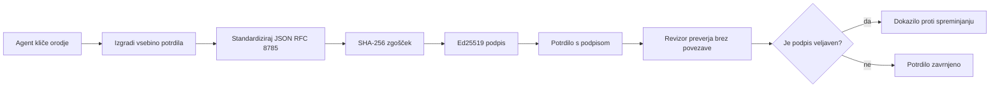
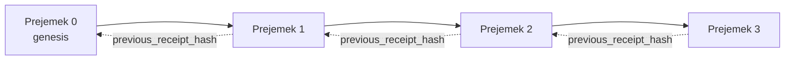

[Ogled video lekcije: Zavarovanje AI agentov s kriptografskimi potrdili](https://youtu.be/PLACEHOLDER_VIDEO_ID)

> _(Video lekcije in sličica bosta dodana s strani Microsoftovega vsebinskega tima po združitvi, skladno s predlogo lekcij 14 / 15.)_

# Zavarovanje AI agentov s kriptografskimi potrdili

## Uvod

V tej lekciji bomo obravnavali:

- Zakaj so revizijske sledi za AI agente pomembne za skladnost, odpravljanje napak in zaupanje.
- Kaj je kriptografsko potrdilo in kako se razlikuje od nepodpisane beležke v dnevniku.
- Kako ustvariti podpisano potrdilo za klic orodja agenta v običajnem Pythonu.
- Kako potrditi potrdilo brez povezave in zaznati manipulacije.
- Kako povezati potrdila tako, da odstranitev ali premik enega prekine verigo.
- Kaj potrdila dokazujejo in kaj izrecno ne dokazujejo.

## Cilji učenja

Po zaključenem lekciji boste znali:

- Prepoznati načine napak, ki motivirajo kriptografski izvor za dejanja agenta.
- Ustvariti Ed25519-podpisano potrdilo nad kanoničnim JSON paketom.
- Samostojno potrditi potrdilo z uporabo zgolj javnega ključa podpisnika.
- Zaznati manipulacije z ponovno potrditvijo spremenjenega potrdila.
- Zgraditi sekvenco potrdil z verigo zgoščenk (hash chaining) in pojasniti njen pomen.
- Prepoznati mejo med tem, kaj potrdila dokazujejo (pripadnost, celovitost, vrstni red) in česar ne dokazujejo (pravilen potek dejanja, veljavnost politike).

## Problem: revizijska sled vašega agenta

Predstavljajte si, da ste uvedli AI agenta za Contoso Travel. Agent bere zahteve strank, kliče API za lete, da poišče možnosti, in rezervira sedeže v imenu stranke. V preteklem četrtletju je agent obdelal 50.000 rezervacij.

Danes pride revizor in zastavi preprosto vprašanje: "Pokažite, kaj je vaš agent storil."

Predate mu vaše dnevniške datoteke. Revizor jih pregleda in zastavi težje vprašanje: "Kako vem, da ti dnevniki niso bili urejeni?"

To je problem revizijske sledi. Večina današnjih implementacij agentov se zanaša na:

- **Dnevniške zapise aplikacij**: ki jih piše sam agent, a jih lahko ureja vsak, ki ima dostop do datotečnega sistema.
- **Storitve dnevniškega beleženja v oblaku**: vidno so zaščitene pred manipulacijo na ravni platforme, a samo če revizor zaupa upravljavcu platforme.
- **Transakcijske dnevnike v bazah podatkov**: primerni za spremembe v bazi, ne pa za poljubne klice orodij.

Noben od teh ne zna brez dodatnega zaupanja odgovoriti revizorju. Takšno zaupanje je za interno uporabo pogosto sprejemljivo, za regulirane delovne obremenitve (finančni sektor, zdravstvo, karkoli pod EU AI aktom) pa ni.

Kriptografska potrdila to rešujejo tako, da je vsako dejanje agenta neodvisno preverljivo. Revizor vam ne rabi zaupat. Potrebuje le vaš javni ključ in samo potrdilo.

## Kaj je kriptografsko potrdilo?

Potrdilo je JSON objekt, ki beleži, kaj je agent storil, podpisan z digitalnim podpisom.



Minimalno potrdilo izgleda tako:

```json
{
  "type": "agent.tool_call.v1",
  "agent_id": "contoso-travel-bot",
  "tool_name": "lookup_flights",
  "tool_args_hash": "sha256:a3f9c1...",
  "result_hash": "sha256:7b2e1d...",
  "policy_id": "contoso-travel-policy-v3",
  "timestamp": "2026-04-25T14:30:00Z",
  "sequence": 47,
  "previous_receipt_hash": "sha256:9d4e6a...",
  "signature": {
    "alg": "EdDSA",
    "sig": "c5af83...",
    "public_key": "8f3b2c..."
  }
}
```

Tri lastnosti opravljajo delo:

1. **Podpis**. Potrdilo podpiše prehod (gateway) agenta s privatnim ključem Ed25519. Kdor ima pripadajoči javni ključ, lahko podpis potrdi brez povezave. Vsaka sprememba katerega koli polja razveljavi podpis.

2. **Kanonično kodiranje**. Pred podpisom je potrdilo serializirano s shemo kanonične JSON predstavitve (JCS, RFC 8785). To zagotavlja, da dve implementaciji, ki proizvedeta isto logično potrdilo, ustvarita bitno enak izhod. Brez kanonične predstavitve bi različni JSON serializerji ustvarili različne podpise za isto vsebino.

3. **Veriga zgoščenk (hash chaining)**. Polje `previous_receipt_hash` povezuje vsako potrdilo s prejšnjim. Odstranitev ali premik potrdila prekine vsako potrdilo, ki sledi. Manipulacija je vidna na ravni verige, tudi če se posamezni podpisi obidejo.

Skupaj te lastnosti zagotavljajo tri jamstva:

- **Pripadnost**: ta ključ je podpisal to vsebino.
- **Celovitost**: vsebina se od podpisa ni spremenila.
- **Vrstni red**: to potrdilo je prišlo po tistem potrdilu v verigi.

## Izdelava potrdila v Pythonu

Za izdelavo potrdila ne potrebujete posebne knjižnice. Kriptografski primitivni postopki so široko dostopni, logika je nekaj deset vrstic Pythona.

Praktične vaje v `code_samples/18-signed-receipts.ipynb` vodijo skozi celoten postopek. Povzetek:

```python
import json
import hashlib
import base64
from nacl import signing
from jcs import canonicalize  # RFC 8785 kanonični JSON

def b64url_nopad(data: bytes) -> str:
    return base64.urlsafe_b64encode(data).decode("ascii").rstrip("=")

def sha256_canonical(obj) -> str:
    """SHA-256 of a Python object's JCS-canonical JSON form."""
    return f"sha256:{hashlib.sha256(canonicalize(obj)).hexdigest()}"

# Ustvari ali naloži ključ za podpisovanje (v produkciji shranjuj v ključni zakladnici)
signing_key = signing.SigningKey.generate()
verify_key = signing_key.verify_key

# Sestavi vsebino potrdila (še brez podpisa)
tool_args = {"origin": "SYD", "destination": "LAX"}
tool_result = [{"flight": "QF11", "price": 1850, "stops": 0}]

payload = {
    "type": "agent.tool_call.v1",
    "agent_id": "contoso-travel-bot",
    "tool_name": "lookup_flights",
    "tool_args_hash": sha256_canonical(tool_args),
    "result_hash": sha256_canonical(tool_result),
    "policy_id": "contoso-travel-policy-v3",
    "timestamp": "2026-04-25T14:30:00Z",
    "sequence": 0,
    "previous_receipt_hash": None,
}

# Kanoniziraj, zgoščuj, podpiši.
canonical_bytes = canonicalize(payload)
message_hash = hashlib.sha256(canonical_bytes).digest()
signature_bytes = signing_key.sign(message_hash).signature

# Priloži strukturiran objekt podpisa.
receipt = {
    **payload,
    "signature": {
        "alg": "EdDSA",
        "sig": b64url_nopad(signature_bytes),
        "public_key": b64url_nopad(bytes(verify_key)),
    },
}
```

To je celoten podpisni potek. Vaje v zvezku vodijo po vsakem koraku.

## Potrditev potrdila in zaznavanje manipulacij

Potrditev je obratna operacija:

```python
import base64
import hashlib
from nacl import signing
from nacl.exceptions import BadSignatureError
from jcs import canonicalize

def b64url_decode(s: str) -> bytes:
    padding = "=" * ((4 - len(s) % 4) % 4)
    return base64.urlsafe_b64decode(s + padding)

def verify_receipt(receipt: dict) -> bool:
    # Podpis je strukturiran objekt: {"alg", "sig", "public_key"}.
    sig_obj = receipt.get("signature")
    if not sig_obj or sig_obj.get("alg") != "EdDSA":
        return False

    # Rekonstruirajte vsebino, ki je bila dejansko podpisana (vse razen podpisa).
    payload = {k: v for k, v in receipt.items() if k != "signature"}

    canonical_bytes = canonicalize(payload)
    message_hash = hashlib.sha256(canonical_bytes).digest()

    try:
        verify_key = signing.VerifyKey(b64url_decode(sig_obj["public_key"]))
        verify_key.verify(message_hash, b64url_decode(sig_obj["sig"]))
        return True
    except BadSignatureError:
        return False
```

Ta funkcija prejme potrdilo in vrne `True`, če je podpis veljaven, `False` sicer. Brez omrežnih klicev, brez storitvene odvisnosti, brez potrebe po zaupanju tretji strani.

Da vidite delovanje zaznavanja manipulacij, zvezek pokaže:

1. Izdelavo veljavnega potrdila in potrditve njegove pravilnosti.
2. Spremembo enega bajta v polju `tool_args_hash`.
3. Ponovno preverjanje in opazovanje neuspeha.

To je praktični dokaz, da so potrdila vidno zaščitena pred manipulacijo: vsaka, celo najmanjša sprememba, prekine podpis.

## Povezovanje potrdil za agente z več koraki

Eno podpisano potrdilo ščiti eno dejanje. Veriga potrdil ščiti zaporedje.



Vsako potrdilo beleži zgoščenk prejšnjega. Da bi napadalec tiho odstranil potrdilo 2, bi moral:

- Spremeniti polje `previous_receipt_hash` potrdila 3 (s tem bi podpis potrdila 3 postal neveljaven), ALI
- Ponarediti nov podpis na spremenjenem potrdilu 3 (za kar je potreboval zasebni ključ agenta).

Če je zasebni ključ shranjen v strojni ključni shrambi in javni ključ objavite z vsakim potrdilom, noben napad ni izvedljiv brez zaznave.

Zvezek vodi skozi:

1. Izgradnjo verige treh potrdil.
2. Potrditev, da `previous_receipt_hash` vsakega potrdila ustreza dejanski zgoščeni vrednosti prejšnjega.
3. Manipulacijo z enim potrdilom v sredini in opazovanje prekinitve verige ravno na tej točki.

Tako ustvarite revizijsko sled, ki jo lahko zunanji revizor preveri brez zaupanja v vas.

## Kaj potrdila dokazujejo (in česa ne)

To je najpomembnejši del lekcije. Potrdila so močna, a njihova moč je omejena.

**Potrdila dokazujejo tri stvari:**

1. **Pripadnost**: določen ključ je podpisal določen paket.
2. **Celovitost**: paket se po podpisu ni spremenil.
3. **Vrstni red**: to potrdilo je prišlo po tistem v verigi zgoščenk.

**Potrdila NE dokazujejo:**

1. **Pravilnosti**: da je bilo dejanje agenta prav. Potrdilo je lahko podpisano tudi za napačen odgovor prav tako kot za pravilen.
2. **Skladnosti s politiko**: da je bila politika iz `policy_id` dejansko ovrednotena ali bi dejansko dovolila dejanje, če bi jo preverili. Potrdilo beleži, kar se je trdilo, ne kar je bilo izvršeno.
3. **Identitete onkraj ključa**: potrdilo pove, da je "ta ključ podpisal to vsebino". Ne pove, da je "ta človek odobril to." Povezovanje ključa s človekom ali organizacijo zahteva ločeno identitetno infrastrukturo (imenik, javni registr ključev itd.).
4. **Resničnosti vhodnih podatkov**: če agent dobi manipuliran poziv in na njem ukrepa, potrdilo zvesto beleži dejanje. Potrdila so vzporedni proces preverjanja vhodnih podatkov, ne nadomestek zanje.

Ta meja je pomembna zaradi dveh razlogov:

- Pove, za kaj so potrdila uporabna: za auditabilnost vedenja agentov in vidnost manipulacij, tudi čez organizacijske meje.
- Pove, katere dodatne plasti še potrebujete: preverjanje vhodov (Lekcija 6), izvrševanje politik (kratek opis spodaj) in identitetno infrastrukturo (izven obsega te lekcije).

Pogosta zmota je misliti, da "imamo potrdila" pomeni "imamo upravljanje in nadzor." Ne pomeni. Potrdila so temelj. Upravljanje je sistem, ki ga zgradite na njem.

## Produkcijske reference

Python koda v tej lekciji je namerno minimalna, da lahko preberete vsako vrstico in razumete natanko, kaj se dogaja. V produkciji imate dve možnosti:

1. **Gradite neposredno na kriptografskih primitivih.** 50 vrstic kode, ki jih vidite zgoraj, zadostuje za številne primere uporabe. PyNaCl (Ed25519) in paket `jcs` (kanonični JSON) sta dobro vzdrževani in revizirani knjižnici.

2. **Uporabite produkcijsko knjižnico za potrdila.** Več odprtokodnih projektov implementira enak vzorec z dodatnimi funkcijami (rotacija ključev, množična potrditev, distribucija JWK nabora, integracija s politiko):
   - Format potrdil v tej lekciji sledi IETF Internet-Draftu (`draft-farley-acta-signed-receipts`), ki je v postopku standardizacije.
   - Microsoft Agent Governance Toolkit združuje potrdila z odločitvami na bazi Cedarja; poglejte Tutorial 33 v tem repozitoriju za primer od začetka do konca.
   - Paketa `protect-mcp` (npm) in `@veritasacta/verify` (npm) zagotavljata implementacijo podpisa potrdil in potrditve brez povezave na Node.js, namenjena zavijanju kateregakoli MCP strežnika z vidnim revizijskim sledenjem.

Odločitev med lastno rešitvijo in uporabo knjižnice je podobna odločitvi med pisanjem lastne knjižnice JWT ali uporabo preverjene: oba pristopa sta razumljiva; knjižnica prihrani čas in zmanjša površino za revizijo; izvorna implementacija zahteva razumevanje vsakega primitiva. Ta lekcija vas uči izvorne poti, da imate temelj za katerokoli izbiro.

## Preverjanje znanja

Preizkusite svoje znanje pred nadaljevanjem na praktično vajo.

**1. Potrdilo je podpisano z zasebnim Ed25519 ključem agenta. Revizor ima le javni ključ. Ali lahko revizor potrdi potrdilo brez povezave?**

<details>
<summary>Odgovor</summary>

Da. Potrditev Ed25519 zahteva samo javni ključ in podpisane bajte. Brez omrežnih klicev in odvisnosti od storitev. To je lastnost, ki naredi potrdila uporabna v auditih z zračno režo, med več organizacijami ali z nizkim zaupanjem.
</details>

**2. Napadalec spremeni polje `policy_id` potrdila, da trdi, da je bilo nadzorovano z bolj permisivno politiko. Podpis je bil narejen nad originalnim paketom. Kaj se zgodi pri potrditvi?**

<details>
<summary>Odgovor</summary>

Preverjanje ne uspe. Podpis je bil izračunan nad kanoničnimi bajti originalnega paketa; sprememba poljubnega polja spremeni kanonične bajte, kar spremeni SHA-256 zgoščeno vrednost in s tem naredi podpis neveljaven. Napadalec bi potreboval zasebni ključ, da ustvari nov veljaven podpis, tega nima.
</details>

**3. Zakaj potrdilo namesto surovih argumentov in rezultata vsebuje samo `tool_args_hash` in `result_hash`?**

<details>
<summary>Odgovor</summary>

Dva razloga. Prvič, potrdilo je morda treba arhivirati ali prenašati v okoljih, kjer je razkrivanje surove vsebine (osebni podatki, poslovni podatki) problematično. Zgoščevanje ohranja potrdilo majhno in vsebino zasebno; revizor potrdi, da zgoščenka ustreza ločeno shranjeni kopiji dejanske vsebine. Drugič, zgoščene vrednosti imajo fiksno velikost; potrdilo z njihovo uporabo je neodvisno od velikosti vhodov in izhodov.
</details>

**4. Polje `previous_receipt_hash` veže vsako potrdilo na prejšnjega. Če napadalec tiho izbriše eno potrdilo sredi verige, kaj postane neveljavno?**

<details>
<summary>Odgovor</summary>

Vsako potrdilo, ki je prišlo za izbranim. Njihova polja `previous_receipt_hash` ne bodo več ustrezala dejanski verigi (ker potrdilo, na katerega so se sklicevali, ne obstaja več ali veriga sedaj kaže na drugega predhodnika). Da bi prikril izbris, bi moral napadalec ponovno podpisati vsa poznejša potrdila, kar zahteva zasebni ključ.
</details>

**5. Potrdilo uspešno potrdi. Ali to dokazuje, da je dejanje agenta bilo pravilno, učinkovito ali skladno s politiko?**

<details>
<summary>Odgovor</summary>

Ne. Veljavno potrdilo dokazuje tri stvari: pripadnost (ta ključ je podpisal to vsebino), celovitost (vsebina ni spremenjena) in vrstni red (to potrdilo je prišlo po tistem). NE dokazuje, da je bilo dejanje pravilno, da je politika v `policy_id` dejansko ocenjena ali da je agent sledil vsem pravilom. Potrdila omogočajo revizijsko sled vedenja agentov, ne zagotavljajo pravilnosti. To je najpomembnejša meja v lekciji.
</details>

## Praktična vaja

Odprite `code_samples/18-signed-receipts.ipynb` in dokončajte vseh štiri razdelke:

1. **Razdelek 1**: Podpišite prvo potrdilo in ga potrdite.
2. **Razdelek 2**: Manipulirajte s potrdilom in opazujte neuspeh potrditve.
3. **Razdelek 3**: Zgradite verigo treh potrdil in potrdite celovitost verige.
4. **Razdelek 4**: Uporabite vzorec na agentu, zgrajenem z Microsoft Agent Framework: zavijte klic orodja v podpisovanje potrdila, nato potrdilo neodvisno preverite.

**Dodatni izziv 1:** razširite shemo potrdila z dodatnim poljem po vaši izbiri (npr. ID zahtevka za sledenje), posodobite kanonično logiko podpisa, da ga vključi, in potrdite, da potrdilo še vedno uspešno prehaja potrditve. Nato polje spremenite po podpisu in potrdite, da preverjanje ne uspe. To vas prisili, da razumete, kako vsak bajt kanonične predstavitve prispeva k podpisu.
**Stretch izziv 2:** SHA-256-zgoščite skupaj dva svoja računa (združite njune kanonične bajte v determinističnem vrstnem redu) in vstavite nastali digest kot novo polje na tretji račun, preden ga podpišete. Preverite, ali se vsi trije računi še vedno pravilno pretvorijo. Pravkar ste ustvarili dokaz vključenosti v enem koraku: vsak, ki ima tretji račun, lahko dokaže, da sta prva dva obstajala ob času podpisa, brez potrebe po razkritju njihove vsebine. To je vzorec, ki ga računi z izborčno razkritostjo uporabljajo v velikem merilu (Merkle obveznosti, RFC 6962).

## Zaključek

Kriptografski računi dajejo AI agentom revizijsko sled, ki je:

- **Neodvisno preverljiva**: vsak, ki ima javni ključ, lahko potrdi, brez odvisnosti od storitev.
- **Odpornost proti spreminjanju**: vsaka sprememba spremeni podpis.
- **Prenosljiva**: račun je majhna JSON datoteka; jo je mogoče arhivirati, prenašati in preverjati kjerkoli.
- **V skladu s standardi**: zgrajena na Ed25519 (RFC 8032), JCS (RFC 8785) in SHA-256, vse široko uporabljene primitivne funkcije.

Niso nadomestilo za preverjanje vhodnih podatkov, izvajanje pravilnikov ali infrastrukturo identitete. So temelj za te plasti. Ko uvajate agente v regulirane delovne obremenitve, delovne tokove med več organizacijami ali v katerem koli okolju, kjer ni mogoče predpostaviti zaupanje bodočega revizorja, so računi način, kako zagotoviti pošteno revizijsko sled.

Najpomembnejši sklep: računi dokazujejo, kdo je kaj povedal in kdaj. Ne dokazujejo, da je bilo povedano resnično ali pravilno. Ta razliko vzdržujte strogo. To je razlika med poštenim sistemom izvora in zavajajočim.

## Seznam za produkcijo

Ko ste pripravljeni preiti iz tega lekcije na uvajanje agentov s podpisanimi računi v realnem okolju:

- [ ] **Odstranite ključ za podpis z razvijalskega prenosnika.** Uporabite Azure Key Vault, AWS KMS ali strojni varnostni modul. Zasebni ključ, ki podpisuje vaše račune, ne sme nikoli biti v nadzoru različic ali kot navaden tekst na strežnikih aplikacij.
- [ ] **Objavite javni ključ za preverjanje.** Revizorji ga potrebujejo za preverjanje brez povezave. Standardni vzorec je JWK Set na poznanem URL-ju (RFC 7517), npr. `https://your-org.example.com/.well-known/agent-keys.json`.
- [ ] **Zunanje sidranje verige.** Občasno zapišite najnovejši glavni hash verige v dnevnik transparentnosti (Sigstore Rekor, RFC 3161 overovatelj časovnih žigov ali drug notranji sistem), da lahko zunanji organ potrdi "ta veriga je obstajala v tem času."
- [ ] **Shranjujte račune nemenjljivo.** Shramba samo za dodajanje (Azure Storage z nemenjljivimi politikami, AWS S3 Object Lock) preprečuje notranjim uporabnikom prepisovanje zgodovine na nivoju shrambe.
- [ ] **Odločite se za hrambo.** Veliko skladnosti zahteva večletno hranjenje. Načrtujte rast računov (vsak račun je ~500 bajtov; agent, ki naredi 10.000 klicev dnevno, ustvari približno 1,8 GB na leto).
- [ ] **Dokumentirajte, kaj računi ne pokrivajo.** Računi dokazujejo avtorstvo, integriteto in vrstni red. Vaš dejanski načrt bi moral jasno navesti, kateri dodatni nadzorni mehanizmi (preverjanje vhodnih podatkov, izvajanje pravilnikov, omejevanje hitrosti, infrastruktura identitete) stojijo poleg računov v vaši upravljavski politiki.

### Imate več vprašanj o varovanju AI agentov?

Pridružite se [Microsoft Foundry Discord](https://aka.ms/ai-agents/discord), kjer se lahko srečate z drugimi učenci, obiskujete pisarne in dobite odgovore na vprašanja o AI agentih.

## Onkraj te lekcije

Ta lekcija pokriva enotni podpis računa in verigo hashiranih računov. Enake primitivne funkcije sestavljajo še več naprednih vzorcev, ki jih lahko srečate, ko se vaša upravljavska praktika razvija:

- **Izborčna razkritost.** Ko so polja računa neodvisno zavezana (RFC 6962-stil Merkle drevo), lahko razkrijete določena polja določenim revizorjem in dokažete, da ostala niso spremenjena, ne da bi jih razkrili. Uporabno, kadar isti račun mora zadovoljiti tako celovito revizijo (ki zahteva popolnost) kot predpise o minimizaciji podatkov, kot je GDPR (ki revizorju želijo prikazati le tisto, kar je potrebno).
- **Razveljavitev računa.** Če je ključ za podpis kompromitiran, potrebujete način za označitev vseh računov, podpisanih s tem ključem, kot nezaupanja vrednih od točke v času naprej. Standardni vzorci: kratkotrajni ključi za podpis skupaj z objavljenim seznamom razveljavitev ali dnevnik transparentnosti z vnosi razveljavitev.
- **Dvosmerni / deljeni podpis računi.** Nekatere implementacije delijo podpisano vsebino na polovici pred izvajanjem (`authorization_*`) in po izvajanju (`result_*`) z neodvisnimi podpisi, uporabno, ko odločitev za pooblastilo in opažen rezultat ustvarjata različni akterji ali v različnih časih. To se aditivno sestavi na vrh formata računa, ki je predstavljen v tej lekciji.
- **Sestava vsebine.** Račun zapakira vse bajte, ki jih vnesete v `result_hash`. Dejanske vsebine so pogosto bogatejše od rezultatov enega orodja: razlogi pred odločitvijo (napoved modela, obravnavane možnosti, dokazi in njihova popolnost, ocena tveganja, veriga odgovornosti, rezultat presoje) lahko vsi živijo znotraj vsebine, zaprti z enim računom. To ohranja format računa minimalen, hkrati pa omogoča postopno rast shem vsebine po domenah.
- **Preverjanje skladnosti med implementacijami.** Več neodvisnih implementacij istega formata računa (Python, TypeScript, Rust, Go) se medsebojno preverja s skupnimi testnimi vektorji. Če zgradite svojo lastno implementacijo, potrjevanje na podlagi objavljenih vektorjev potrjuje združljivost.
- **Migracija po kvantnem odpornem standardu.** Ed25519 je danes široko uporabljen, vendar ni kvantno odporen. Format računa je agilen glede algoritmov: polje `signature.alg` lahko nosi `ML-DSA-65` (NIST-ov standard po kvantnem podpisa), ko morate preiti. Načrtujte prehodno obdobje, ko so računi dvojno podpisani.

## Dodatni viri

- <a href="https://datatracker.ietf.org/doc/draft-farley-acta-signed-receipts/" target="_blank">IETF Internet-Draft: Podpisani sklepi za nadzor dostopa stroj-stroju</a>
- <a href="https://learn.microsoft.com/azure/ai-studio/responsible-use-of-ai-overview" target="_blank">Pregled odgovorne uporabe AI (Azure AI)</a>
- <a href="https://datatracker.ietf.org/doc/html/rfc8032" target="_blank">RFC 8032: Digitalni podpis z Edwards krivuljo (EdDSA)</a>
- <a href="https://datatracker.ietf.org/doc/html/rfc8785" target="_blank">RFC 8785: JSON Canonicalization Scheme (JCS)</a>
- <a href="https://datatracker.ietf.org/doc/html/rfc6962" target="_blank">RFC 6962: Transparentnost potrdil</a> (Merkle drevesna konstrukcija, ki se uporablja pri računih z izborčno razkritostjo)
- <a href="https://github.com/microsoft/agent-governance-toolkit/blob/main/docs/tutorials/33-offline-verifiable-receipts.md" target="_blank">Microsoft Agent Governance Toolkit, vodič 33: Preverljivi računi brez povezave</a>
- <a href="https://github.com/ScopeBlind/agent-governance-testvectors" target="_blank">Testni vektorji za preverjanje skladnosti</a> formata računa, uporabljenega v tej lekciji (Apache-2.0)
- <a href="https://pynacl.readthedocs.io/" target="_blank">Dokumentacija PyNaCl</a> (Ed25519 v Pythonu)

## Predhodna lekcija

[Gradnja agentov za uporabo računalnika (CUA)](../15-browser-use/README.md)

## Naslednja lekcija

_(Določi jo curriculum vzdrževalci)_

---

<!-- CO-OP TRANSLATOR DISCLAIMER START -->
**Omejitev odgovornosti**:
Ta dokument je bil preveden z uporabo AI prevajalske storitve [Co-op Translator](https://github.com/Azure/co-op-translator). Čeprav si prizadevamo za natančnost, vas prosimo, da upoštevate, da avtomatizirani prevodi lahko vsebujejo napake ali netočnosti. Izvirni dokument v njegovem izvirnem jeziku je treba obravnavati kot avtoritativni vir. Za kritične informacije je priporočljiv strokovni človeški prevod. Ne odgovarjamo za morebitna nesporazume ali napačne interpretacije, ki izhajajo iz uporabe tega prevoda.
<!-- CO-OP TRANSLATOR DISCLAIMER END -->