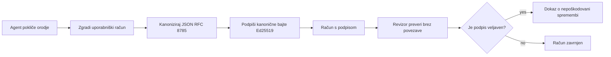
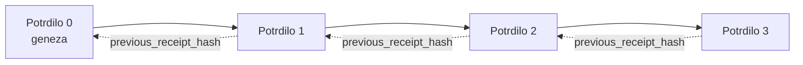

[Ogled učnega videa: Zavarovanje AI agentov s kriptografskimi potrdili](https://youtu.be/PLACEHOLDER_VIDEO_ID)

> _(Učni video in sličica bosta dodana s strani Microsoftove ekipe za vsebino po združitvi, v skladu z vzorcem lekcij 14 / 15.)_

# Zavarovanje AI agentov s kriptografskimi potrdili

## Uvod

Ta lekcija bo zajemala:

- Zakaj so revizijski sledovi za AI agente pomembni za skladnost, odpravljanje napak in zaupanje.
- Kaj je kriptografsko potrdilo in kako se razlikuje od nepodpisane vrstice dnevnika.
- Kako ustvariti podpisano potrdilo za klic orodja agenta v navadnem Pythonu.
- Kako preveriti potrdilo brez povezave in zaznati manipulacijo.
- Kako verižiti potrdila tako, da odstranjevanje ali prerazporeditev enega prekine verigo.
- Kaj potrdila dokazujejo in kaj izrecno ne dokazujejo.

## Cilji učenja

Po zaključku te lekcije boste znali:

- Prepoznati načine napak, ki motivirajo kriptografsko sledljivost dejanj agenta.
- Ustvariti Ed25519-podpisano potrdilo nad kanoničnim JSON-om.
- Neodvisno preveriti potrdilo z uporabo le javnega ključa podpisnika.
- Zaznati manipulacijo z ponovnim izvajanjem preverjanja na spremenjenem potrdilu.
- Zgraditi veriženo zaporedje potrdil in pojasniti, zakaj je veriga pomembna.
- Prepoznati mejo med tem, kaj potrdila dokazujejo (pripis, integriteta, vrstni red) in čemur ne (npr. pravilnosti dejanja, ustreznosti politike).

## Problem: Revizijska sled vašega agenta

Predstavljajte si, da ste uvedli AI agenta za Contoso Travel. Agent bere zahteve strank, kliče API za lete, da poišče možnosti, in rezervira sedeže v imenu strank. V preteklem četrtletju je agent obdelal 50.000 rezervacij.

Danes pride inšpektor. Postavi preprosto vprašanje: "Pokažite mi, kaj je vaš agent storil."

Izročite mu datoteke z dnevniki. Inšpektor jih pregleda in zastavi težje vprašanje: "Kako vem, da ti dnevniki niso bili urejani?"

To je problem revizijske sledi. Večina današnjih uvedb agentov se zanaša na:

- **Dnevnike aplikacij**: ki jih piše sam agent, jih lahko ureja kdorkoli z dostopom do datotečnega sistema.
- **Oblačne storitve za beleženje**: odporne proti manipulaciji na ravni platforme, a le če inšpektor zaupa operaterju platforme.
- **Dnevnike transakcij podatkovnih zbirk**: primerni za spremembe podatkov, ne pa za poljubne klice orodij.

Nobeden od teh ne more odgovoriti na vprašanje inšpektorja brez, da bi moral inšpektor z nekom zaupati (vam, vašemu ponudniku oblaka, vašemu prodajalcu podatkovne baze). Za interno uporabo je to pogosto sprejemljivo. Za regulirane delovne obremenitve (finance, zdravstvo, karkoli po EU AI zakonu) ni.

Kriptografska potrdila to rešujejo tako, da vsakemu dejanju agenta omogočajo neodvisno preverljivost. Inšpektor vam ne rabi zaupati. Potrebuje samo vaš javni ključ in samo potrdilo.

## Kaj je kriptografsko potrdilo?

Potrdilo je JSON objekt, ki beleži, kaj je agent storil, podpisan z digitalnim podpisom.


```mermaid
flowchart LR
    A[Agent pokliče orodje] --> B[Zgradi uporabniški račun]
    B --> C[Kanoniziraj JSON RFC 8785]
    C --> E[Podpiši kanonične bajte Ed25519]
    E --> F[Račun s podpisom]
    F --> G[Revizor preveri brez povezave]
    G --> H{Je podpis veljaven?}
    H -- yes --> I[Dokaz o nepoškodovani spremembi]
    H -- no --> J[Račun zavrnjen]
```

Minimalno potrdilo izgleda takole:

```json
{
  "type": "agent.tool_call.v1",
  "agent_id": "contoso-travel-bot",
  "tool_name": "lookup_flights",
  "tool_args_hash": "sha256:a3f9c1...",
  "result_hash": "sha256:7b2e1d...",
  "policy_id": "contoso-travel-policy-v3",
  "timestamp": "2026-04-25T14:30:00Z",
  "sequence": 47,
  "previous_receipt_hash": "sha256:9d4e6a...",
  "signature": {
    "alg": "EdDSA",
    "sig": "c5af83...",
    "public_key": "8f3b2c..."
  }
}
```

Tri lastnosti opravljajo delo:

1. **Podpis**. Potrdilo podpiše agentov prehod s pomoči zasebnega ključa Ed25519. Kdor koli ima ustrezen javni ključ, lahko podpis preveri brez povezave. Vsaka manipulacija katerega koli polja razveljavi podpis.

2. **Kanonično kodiranje**. Pred podpisovanjem se potrdilo seralizira z uporabo sheme JSON Canonicalization Scheme (JCS, RFC 8785). To zagotavlja, da dve implementaciji, ki ustvarita isto logično potrdilo, ustvarita bitno identičen izhod. Brez kanonizacije bi različni JSON seralizatorji ustvarili različne podpise za isto vsebino.

3. **Veriženje z zgoščenkami**. Polje `previous_receipt_hash` povezuje vsako potrdilo s prejšnjim. Odstranitev ali prerazporeditev potrdila prekine vsako potrdilo, ki sledi. Manipulacija postane vidna na nivoju verige, tudi če se posamezni podpisi spregledajo.

Te lastnosti skupaj zagotavljajo tri zagotovila:

- **Pripis**: ta ključ je podpisal to vsebino.
- **Integriteta**: vsebina se od podpisa ni spremenila.
- **Vrstni red**: to potrdilo je v verigi prišlo po tistem potrdilu.

## Ustvarjanje potrdila v Pythonu

Za ustvarjanje potrdila ne potrebujete posebne knjižnice. Kriptografski primitivni gradniki so široko dostopni, logika pa je le nekaj deset vrstic Pythona.

Praktične vaje v `code_samples/18-signed-receipts.ipynb` vas vodijo skozi celoten postopek. Povzetek:

```python
import json
import hashlib
import base64
from nacl import signing
from jcs import canonicalize  # RFC 8785 kanonični JSON

def b64url_nopad(data: bytes) -> str:
    return base64.urlsafe_b64encode(data).decode("ascii").rstrip("=")

def sha256_canonical(obj) -> str:
    """SHA-256 of a Python object's JCS-canonical JSON form."""
    return f"sha256:{hashlib.sha256(canonicalize(obj)).hexdigest()}"

# Ustvari ali naloži podpisni ključ (v produkciji shrani v zakladnico ključev)
signing_key = signing.SigningKey.generate()
verify_key = signing_key.verify_key

# Zgradi vsebino potrdila (še brez podpisa)
tool_args = {"origin": "SYD", "destination": "LAX"}
tool_result = [{"flight": "QF11", "price": 1850, "stops": 0}]

payload = {
    "type": "agent.tool_call.v1",
    "agent_id": "contoso-travel-bot",
    "tool_name": "lookup_flights",
    "tool_args_hash": sha256_canonical(tool_args),
    "result_hash": sha256_canonical(tool_result),
    "policy_id": "contoso-travel-policy-v3",
    "timestamp": "2026-04-25T14:30:00Z",
    "sequence": 0,
    "previous_receipt_hash": None,
}

# Kanoniziraj in neposredno podpiši JCS bajte. PureEdDSA znotraj uporablja hash funkcije.
canonical_bytes = canonicalize(payload)
signature_bytes = signing_key.sign(canonical_bytes).signature

# Pripni strukturirano podpisno objekt.
receipt = {
    **payload,
    "signature": {
        "alg": "EdDSA",
        "sig": b64url_nopad(signature_bytes),
        "public_key": b64url_nopad(bytes(verify_key)),
    },
}
```

To je celoten podpisni potek. Vaje v zvezku pojasnjujejo vsak korak.

## Preverjanje potrdila in zaznavanje manipulacij

Preverjanje je obratna operacija:

```python
import base64
import hashlib
from nacl import signing
from nacl.exceptions import BadSignatureError
from jcs import canonicalize

def b64url_decode(s: str) -> bytes:
    padding = "=" * ((4 - len(s) % 4) % 4)
    return base64.urlsafe_b64decode(s + padding)

def verify_receipt(receipt: dict) -> bool:
    # Podpis je strukturiran objekt: {"alg", "sig", "public_key"}.
    sig_obj = receipt.get("signature")
    if not sig_obj or sig_obj.get("alg") != "EdDSA":
        return False

    # Rekonstruiraj šeprto, ki je bila dejansko podpisana (vse razen podpisa).
    payload = {k: v for k, v in receipt.items() if k != "signature"}

    canonical_bytes = canonicalize(payload)

    try:
        verify_key = signing.VerifyKey(b64url_decode(sig_obj["public_key"]))
        verify_key.verify(canonical_bytes, b64url_decode(sig_obj["sig"]))
        return True
    except BadSignatureError:
        return False
```

Ta funkcija sprejme potrdilo in vrne `True`, če je podpis veljaven, sicer `False`. Brez klicev v omrežje, brez odvisnosti od storitev, brez zaupanja v tretjo osebo.

Za praktični vpogled v zaznavanje manipulacij zvezek prikazuje:

1. Ustvarjanje veljavnega potrdila in potrditev njegove preverljivosti.
2. Spremembo enega bajta v polju `tool_args_hash`.
3. Ponovno preverjanje in zaznavo neuspeha.

To je praktični dokaz, da so potrdila odporna na manipulacijo: vsaka sprememba, tudi najmanjša, prekine podpis.

## Verižitev potrdil za agente z več koraki

Enotno podpisano potrdilo varuje eno dejanje. Veriga potrdil varuje niz dejanj.


```mermaid
flowchart LR
    R0[Potrdilo 0<br/>geneza] --> R1[Potrdilo 1]
    R1 --> R2[Potrdilo 2]
    R2 --> R3[Potrdilo 3]
    R1 -. previous_receipt_hash .-> R0
    R2 -. previous_receipt_hash .-> R1
    R3 -. previous_receipt_hash .-> R2
```

Vsako potrdilo beleži zgoščeno vrednost potrdila pred njim. Za tiho odstranitev potrdila 2 bi napadalec moral:

- Spremeniti polje `previous_receipt_hash` potrdila 3 (kar prekine podpis potrdila 3), ALI
- Ponarediti nov podpis na spremenjenem potrdilu 3 (zahteva zasebni ključ agenta).

Če je zasebni ključ shranjen v strojni ključavnici in javni ključ objavite z vsakim potrdilom, nobeden od napadov ni izvedljiv brez zaznave.

Zvezek prikazuje:

1. Gradnjo verige treh potrdil.
2. Preverjanje, da polje `previous_receipt_hash` vsakega potrdila ustreza dejanski zgoščeni vrednosti prejšnjega potrdila.
3. Manipulacijo enega potrdila v sredini in vidno prekinitvijo verige prav na tej točki.

Tako ustvarite revizijsko sled, ki jo lahko zunanji inšpektor preveri brez zaupanja v vas.

## Kaj potrdila dokazujejo (in kaj ne)

To je najpomembnejši del te lekcije. Potrdila so močna, a njihova moč je omejena.

**Potrdila dokazujejo tri stvari:**

1. **Pripis**: določen ključ je podpisal določen vsebnik.
2. **Integriteta**: vsebnik se od podpisa ni spremenil.
3. **Vrstni red**: to potrdilo sledi določenemu potrdilu v zgoščeni verigi.

**Potrdila NE dokazujejo:**

1. **Pravilnost**: da je bilo dejanje agenta pravilno. Potrdilo je mogoče podpisati za napačen odgovor enako kot za pravilen.
2. **Skladnost s politiko**: da je bila politika, navedena v `policy_id`, dejansko ocenjena, ali da bi ta dejanja dovolila ob preverjanju. Potrdilo beleži, kaj je bilo trjeno, ne kaj je bilo izvršeno.
3. **Identiteta za ključem**: potrdilo pravi "ta ključ je podpisal to vsebino." Ne pravi "ta človek je to odobril." Povezovanje ključa s posameznikom ali organizacijo zahteva ločeno infrastrukturo identitete (imenike, registre javnih ključev itd.).
4. **Resničnost vhodnih podatkov**: če agent prejme manipuliran ukaz in ga izvaja, potrdilo zvesto beleži dejanje. Potrdila so zatemnjenega presojanja (validated) vhodnih podatkov, ne njihov nadomestek.

Ta meja je pomembna iz dveh razlogov:

- Pove, za kaj so potrdila uporabna: za omogočanje revizije in zaznavanja manipulacij v delovanju agentov, tudi preko organizacijskih meja.
- Pove, katere dodatne plasti potrebujete: validacijo vhodnih podatkov (Lekcija 6), izvajanje politik (kratko zajeto spodaj) in infrastrukturo identitete (izven obsega te lekcije).

Pogosta napaka je meniti, da "imeti potrdila" pomeni "imeti upravljanje." Ne pomeni. Potrdila so osnova. Upravljanje je sistem, ki ga zgradite na tej podlagi.

## Dokaz, da je človek odobril točno dejanje

Tretja točka zgoraj je vredna lastnega razdelka: potrdilo o dejanju pravi "ta ključ je podpisal to vsebino," nikoli pa "ta človek je to odobril." Za visoko tveganje (vračila, izbrisi, bančna nakazila) pravila upravljanja vse bolj zahtevajo prav tisto izjavo, ki manka, in lahko se jo izdela z istimi gradniki, ki ste jih že sestavili v tej lekciji.

Nadaljnji zvezek `code_samples/human-authorization-receipts.ipynb` dodaja drugo vrsto potrdila, `human.approval.v1`, v isti obliki ovojnice kot potrdila v tej lekciji (tipiziran vsebnik, podpisan z Ed25519 preko kanoničnih JCS bajtov, z objektom `signature` zunaj podpisanih bajtov). Imenovani odobritel podpisuje **celotno kanonično dejanje in njegov zgošček** pred izvedbo; potrdilo dejanja agenta vsebuje **isti zgošček dejanja** in `parent_approval_ref`, tj. `receipt_hash` odobritve, isti konvencijski pristop kot `previous_receipt_hash` v verigi, ki ste jo zgradili zgoraj. Ena funkcija `verify_chain` preveri oba artefakta z **ločeno fiksiranima registrov ključev** (ključ avtorizatorja zoper ključe agenta), tako da je koda skupna, a oblasti nikoli niso.

Lastnost, ki jo to prinaša, je previdno izražena: *človek je odobril točno to dejanje in agent je izvedel ravno to odobreno dejanje.* Zvezkove zavrnitve so tisto, kar to lastnost naredi resnično, ne samo trditev:

- klasični nabor: manipulacije, zmedeni zastopnik, ponovitve, ponarejeni ključi na katerikoli strani, nepravilen vhod;
- **zastarela pooblastila**: podpis, ki je še veljaven, a zavrnjen, ker se je verzija politike spremenila, ključ odobritelja je bil odstranjen iz registra ali je odobritev potekla pred izvedbo;
- **zamenjava zgoščka**: veljavno podpisano potrdilo dejanja, ki kaže na *resnično* odobritev, ki pa veže *drugo* kanonično dejanje.

Vsaka napaka se zavrne z različnim razlogom, tako lahko inšpektor ob branju zavrnitve ve, ali je pooblastilo zastaralo ali se je dejanje spremenilo. Pravilo, ki se ga zvezek nauči: podpisana odobritev sama po sebi ni pooblastilo. Pooblastilo obstaja le, če sta obe potrdili še vezani na isto kanonično dejanje ob času izvedbe. Potrdilo o odobritvi človeka je izobraževalna sestava, ki jo definira ta lekcija, ne pa vrsta potrdila, določena v `draft-farley-acta-signed-receipts`.

## Produkcijske reference

Python koda v tej lekciji je namenoma minimalna, da lahko preberete vsako vrstico in natančno razumete, kaj se dogaja. V produkciji imate dve možnosti:

1. **Gradite neposredno na kriptografskih primitivih.** 50 vrstic, ki ste jih videli zgoraj, je dovolj za številne primere uporabe. PyNaCl (Ed25519) in paket `jcs` (kanonični JSON) so dobro vzdrževani in pregledani knjižnici.

2. **Uporabite produkcijsko knjižnico za potrdila.** Več odprtokodnih projektov implementira isti vzorec z dodatnimi funkcijami (rotacija ključev, skupinska preverba, distribucija JWK seta, integracija s politiki):
   - Podpisni potek uporablja konvencije JCS in obsega podpisa v neodvisnem osnutku IETF Internet-Draft ([`draft-farley-acta-signed-receipts`](https://datatracker.ietf.org/doc/draft-farley-acta-signed-receipts/), revizija 02). Učna ploska potrdila se razlikujejo od ovojnice `{payload, signature}` osnutka in niso predstavljena kot skladna implementacija. Osnutek objavlja skupen komplet testov skladnosti ([agent-governance-testvectors](https://github.com/ScopeBlind/agent-governance-testvectors)) za implementacije, ki ciljajo na njegov podatkovni format.
   - Microsoft Agent Governance Toolkit združuje potrdila z odločbami politik na osnovi Cedarja; glejte vadnico 33 v tem repozitoriju za primer od začetka do konca.
   - Paketa `protect-mcp` (npm) in `@veritasacta/verify` (npm) zagotavljata izvedbo podpisovanja in preverjanja potrdil v Node.js-ju, namenjeno zaščiti kateregakoli MCP strežnika s sledljivim in odporenim na manipulacijo revizijskim sledom, vključno s tokom za so-podpisovanje, kjer premorjeno dejanje izdaja potrdilo o odobritvi, vezano na zgošček dejanja (podprto z WebAuthn v namiznem toku), enak vzorec potrdila o odobritvi kot v zgornjem zvezku za avtentikacijo človeka.
   - Python SDK **[nobulex](https://github.com/arian-gogani/nobulex)** (`pip install nobulex`) ponuja isti vzorec podpisovanja Ed25519 + JCS v Pythonu z LangChain in CrewAI integracijami, vključno z objavljenimi testnimi vektorji za križno preverjanje in pripisom skladnosti prek [OWASP PR #2210](https://github.com/OWASP/CheatSheetSeries/pull/2210).

Odločitev med lastno implementacijo in uporabo knjižnice je podobna odločitvi med pisanjem lastne knjižnice JWT ali uporabo preizkušene: obe sta razumni; knjižnica prihrani čas in zmanjša površino revizije; lastna pot pa vas prisili, da razumete vsak primitiv. Ta lekcija uči pot od začetka, da boste imeli osnovo za obe možnosti.

## Preverjanje znanja

Preizkusite svoje razumevanje pred nadaljevanjem na praktično vajo.

**1. Potrdilo je podpisano z agentovim zasebnim ključen Ed25519. Inšpektor ima samo javni ključ. Ali lahko inšpektor preveri potrdilo brez povezave?**

<details>
<summary>Odgovor</summary>

Da. Preverjanje Ed25519 zahteva le javni ključ in podpisane bajte. Brez omrežnih klicev, brez odvisnosti od zunanjih storitev. To je lastnost, zaradi katere so potrdila uporabna v izoliranih, večorganizacijskih ali nizko-zaupanja revizijskih okoljih.
</details>

**2. Napadalec spremeni polje `policy_id` v potrdilu, da trdi, da je bilo potrdilo podvrženo bolj permisivni politiki. Podpis je bil na izvirnem vsebniku. Kaj se zgodi pri preverjanju?**

<details>
<summary>Odgovor</summary>


Preverjanje ne uspe. Podpis je bil izračunan nad kanoničnimi bajti izvorne vsebine; sprememba katerega koli polja spremeni te bajte, zaradi česar je podpis neveljaven. Napadalec bi potreboval zasebni ključ, da bi ustvaril nov veljaven podpis, katerega nima.
</details>

**3. Zakaj račun vključuje `tool_args_hash` in `result_hash` namesto surovih argumentov in rezultata?**

<details>
<summary>Odgovor</summary>

Dva razloga. Prvič, račun je lahko potrebno arhivirati ali poslati v okoljih, kjer je razkritje surove vsebine (PII, poslovni podatki) težava. Z zgoščevanjem ostane račun majhen in vsebina zasebna; revizor preveri, ali se zgoščenka ujema s posebej shranjeno kopijo dejanske vsebine. Drugič, zgoščenke imajo fiksno velikost; račun z zgoščenkami je velikostno omejen ne glede na to, kako veliki so bili vnosi in izhodi.
</details>

**4. Polje `previous_receipt_hash` povezuje vsak račun s predhodnikom. Če napadalec tiho izbriše en račun sredi verige, kaj postane neveljavno?**

<details>
<summary>Odgovor</summary>

Vsak račun, ki je sledil izbrisanemu. Njihova polja `previous_receipt_hash` se ne ujemajo več z dejansko verigo (ker račun, na katerega so se nanašali, ne obstaja več ali pa veriga zdaj kaže na drugega predhodnika). Da bi skril izbris, bi moral napadalec ponovno podpisati vsak kasnejši račun, kar zahteva zasebni ključ.
</details>

**5. Račun se preveri brez napak. Ali to dokazuje, da je bilo dejanje agenta pravilno, pravilno izvedeno ali skladno s politiko?**

<details>
<summary>Odgovor</summary>

Ne. Veljaven račun dokazuje tri stvari: pripis (ta ključ je podpisal to vsebino), celovitost (vsebina ni bila spremenjena) in zaporednost (ta račun je sledil temu računu). NE dokazuje, da je bilo dejanje pravilno, da je bila politika, navedena v `policy_id`, dejansko ocenjena ali da je agent sledil vsem pravilom. Računi omogočajo revizijo vedenja agenta, a ne nujno njegovo pravilnost. To je najpomembnejša meja lekcije.
</details>

## Vaja za prakso

Odprite `code_samples/18-signed-receipts.ipynb` in dokončajte vse štiri odseke:

1. **Odsek 1**: Podpišite svoj prvi račun in ga preverite.
2. **Odsek 2**: Spremenite račun in opazujte, kako preverjanje ne uspe.
3. **Odsek 3**: Zgradite verigo treh računov in preverite celovitost verige.
4. **Odsek 4**: Uporabite vzorec za agenta, zgrajenega z Microsoft Agent Framework: ovijte klic orodja v podpisovanje računa, nato neodvisno preverite račun.

**Razširjeni izziv 1:** razširite shemo računa z dodatnim poljem po lastni izbiri (na primer ID zahteve za sledenje), posodobite kanonično logiko podpisa, da ga vključi, in potrdite, da račun še vedno prehaja preverjanje. Nato po podpisu polje spremenite in potrdite, da preverjanje ne uspe. To vas prisili, da razumete, kako vsak bajt kanonične kodirane vsebine prispeva k podpisu.

**Razširjeni izziv 2:** Za SHA-256 združite dva svoja računa skupaj (združite njune kanonične bajte v determinističnem vrstnem redu) in dobljen digest vdelajte kot novo polje na tretjem računu pred podpisom. Preverite, da vsi trije računi še vedno uspešno prehajajo preverjanje. Pravkar ste zgradili dokaz o vključitvi v enem koraku: vsak, ki ima tretji račun, lahko dokaže, da sta prva dva obstajala ob času podpisa, ne da bi razkril vsebino. To je vzorec, ki ga uporabljajo računi z izbirno razkritjem v velikem obsegu (Merkle zaveze, RFC 6962).

## Zaključek

Kriptografski računi dajejo AI agentom revizijsko sled, ki je:

- **Neodvisno preverljiva**: katera koli stran z javnim ključem lahko preveri, brez odvisnosti od storitev.
- **Očitno poseg zaščiten**: vsaka sprememba naredi podpis neveljaven.
- **Prenosljiva**: račun je majhna JSON datoteka; lahko se arhivira, prenaša in preverja kjerkoli.
- **Standarden skladna**: temelji na Ed25519 (RFC 8032), JCS (RFC 8785) in SHA-256, vse široko uporabljene primitive.

Ne nadomeščajo preverjanja vhodnih podatkov, uveljavljanja politik ali identitetne infrastrukture. So temelj za te plasti. Ko uvajate agente v regulirane delovne obremenitve, v delovne procese več organizacij ali katerekoli okolje, kjer ni mogoče predpostaviti, da vam bo bodoči revizor zaupal, so računi način, kako narediti revizijsko sled pošteno.

Najpomembnejše sporočilo: računi dokazujejo, kdo je kaj rekel in kdaj. Ne dokazujejo, da je bilo povedano res ali pravilno. Ta razlikovanje držite trdno. To je razlika med poštenim sistemom izvora in zavajajočim.

## Kontrolni seznam za proizvodnjo

Ko ste pripravljeni napredovati iz te lekcije k uvajanju agentov s podpisanimi računi v resničnem okolju:

- [ ] **Premaknite podpisni ključ s prenosnika razvijalca.** Uporabite Azure Key Vault, AWS KMS ali varnostni modul strojne opreme. Zasebni ključ, ki podpisuje vaše račune, ne sme nikoli živeti v nadzoru različic ali v nešifrirani obliki na aplikacijskih napravah.
- [ ] **Objavite javni ključ za preverjanje.** Revizorji ga potrebujejo za offline preverjanje. Standardni vzorec je JWK Set na dobro znanem URL-ju (RFC 7517), npr. `https://your-org.example.com/.well-known/agent-keys.json`.
- [ ] **Zunanje sidrajte verigo.** Občasno zapišite najnovejši hash glave verige v dnevnik preglednosti (Sigstore Rekor, RFC 3161 časovni žig, ali drugi interni sistem), da lahko zunanja stran potrdi "ta veriga je obstajala ob tem času."
- [ ] **Shranjujte račune neizbrisno.** Shranjevanje samo z dodajanjem (Azure Storage s politikami nespremenljivosti, AWS S3 Object Lock) preprečuje, da bi notranja oseba spreminjala zgodovino na nivoju shranjevanja.
- [ ] **Odločite o hrambi.** Mnogi režimi skladnosti zahtevajo večletno hranjenje. Načrtujte rast računov (vsak račun je ~500 bajtov; agent, ki naredi 10 tisoč klicev na dan, ustvari ~1,8 GB letno).
- [ ] **Dokumentirajte, kaj računi ne pokrivajo.** Računi dokazujejo pripis, celovitost in zaporedje. Vaš delovni postopek naj izrecno navaja, katere dodatne kontrole (preverjanje vhodnih podatkov, uveljavljanje politik, omejevanje hitrosti, identitetna infrastruktura) so zraven računov v vašem upravljalskem okviru.

### Imate več vprašanj o varovanju AI agentov?

Pridružite se [Microsoft Foundry Discord](https://aka.ms/ai-agents/discord), da se povežete z drugimi učečimi, obiskujete uradne ure in dobite odgovore na vaša vprašanja o AI agentih.

## Onkraj te lekcije

Ta lekcija pokriva podpis posameznega računa in verižne sekvence z zgoščenkami. Enake primitive sestavljajo več naprednih vzorcev, s katerimi se lahko srečate, ko vaš upravljalski okvir dozori:

- **Izbirno razkritje.** Ko so polja računa neodvisno zavezana (Merkle drevo po RFC 6962), lahko razkrijete določena polja določenim revizorjem in dokažete, da ostala niso spremenjena, brez razkrivanja. Uporabno, ko isti račun mora zadovoljiti celovito revizijo (ki zahteva popolnost) in predpise o minimizaciji podatkov, kot je GDPR (ki želijo, da revizor vidi čim manj).
- **Razveljavitev računa.** Če je podpisni ključ kompromitiran, morate imeti način označiti vse račune, ki jih je podpisal ta ključ, kot nezaupanja vredne po določenem času. Standardni vzorci: kratkotrajni podpisni ključi in objavljen seznam razveljavitev ali dnevnik preglednosti z vnosi za razveljavitev.
- **Dvosmerni / razdeljeni podpisi računov.** Nekatere implementacije razdelijo podpisano vsebino na polovici pred izvajanjem (`authorization_*`) in po izvajanju (`result_*`) z neodvisnimi podpisi, uporabno, ko odločitev o pooblastilu in opažen rezultat izvajata različni entiteti ali ob različnih časih. To dodano sestoji na formatu računa, predstavljenem v tej lekciji.
- **Sestava vsebine.** Račun zapakira katerikoli podatke, ki jih vstavite v `result_hash`. Dejanske vsebine so pogosto bogatejše od enega rezultata klica orodja: lahko vključujejo predhodna razmišljanja (napoved modela, upoštevane možnosti, dokazi in njihova popolnost, tveganja, veriga odgovornosti, izid prehoda), vse zaprto z enim računom. Tako je format računa minimalen, a lahko sheme vsebine rastejo po domenah.
- **Združljivost med implementacijami.** Več neodvisnih implementacij istega formata računa (Python, TypeScript, Rust, Go) medsebojno preverja z deljenimi testnimi vektorji. Če zgradite svojo implementacijo, validacija z objavljenimi vektorji potrjuje kompatibilnost na protokolu.
- **Migracija po kvantnem odpornosti.** Ed25519 je danes široko uporabljen, vendar ni odporen na kvantno računalništvo. Format računa je algoritmično prilagodljiv: polje `signature.alg` lahko nosi `ML-DSA-65` (NIST standard po kvantni dobi), ko potrebujete migracijo. Načrtujte prehodno obdobje, ko so računi podpisani z obema algoritmoma.

## Dodatni viri

- <a href="https://datatracker.ietf.org/doc/draft-farley-acta-signed-receipts/" target="_blank">IETF Internet-Draft: Podpisani računi odločitev za nadzor dostopa med stroji</a>
- <a href="https://learn.microsoft.com/azure/ai-studio/responsible-use-of-ai-overview" target="_blank">Pregled odgovorne uporabe AI (Azure AI)</a>
- <a href="https://datatracker.ietf.org/doc/html/rfc8032" target="_blank">RFC 8032: Digitalni podpis Edwardsove krivulje (EdDSA)</a>
- <a href="https://datatracker.ietf.org/doc/html/rfc8785" target="_blank">RFC 8785: Shema canonicalizacije JSON (JCS)</a>
- <a href="https://datatracker.ietf.org/doc/html/rfc6962" target="_blank">RFC 6962: Transparentnost certifikatov</a> (Merkle drevesna konstrukcija, ki jo uporabljajo računi z izbirnim razkritjem)
- <a href="https://github.com/microsoft/agent-governance-toolkit/blob/main/docs/tutorials/33-offline-verifiable-receipts.md" target="_blank">Microsoft Agent Governance Toolkit, vadnica 33: Offline preverljivi računi odločitev</a>
- <a href="https://github.com/ScopeBlind/agent-governance-testvectors" target="_blank">Testni vektorji za skladnost med implementacijami</a> za format računov, uporabljen v tej lekciji (Apache-2.0)
- <a href="https://pynacl.readthedocs.io/" target="_blank">Dokumentacija PyNaCl</a> (Ed25519 v Pythonu)

## Prejšnja lekcija

[Ustvarjanje lokalnih AI agentov](../17-creating-local-ai-agents/README.md)

---

<!-- CO-OP TRANSLATOR DISCLAIMER START -->
**Omejitev odgovornosti**:
Ta dokument je bil preveden z uporabo AI prevajalske storitve [Co-op Translator](https://github.com/Azure/co-op-translator). Čeprav si prizadevamo za natančnost, vas prosimo, da upoštevate, da avtomatizirani prevodi lahko vsebujejo napake ali netočnosti. Izvirni dokument v njegovem izvirnem jeziku je treba obravnavati kot avtoritativni vir. Za kritične informacije je priporočljiv strokovni človeški prevod. Ne odgovarjamo za morebitna nesporazume ali napačne interpretacije, ki izhajajo iz uporabe tega prevoda.
<!-- CO-OP TRANSLATOR DISCLAIMER END -->