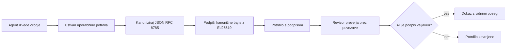

[Oglejte si video lekcije: Varnost AI agentov s kriptografskimi potrdili](https://youtu.be/PLACEHOLDER_VIDEO_ID)

> _(Video lekcije in sličica bosta dodana s strani Microsoftove vsebinske ekipe po združitvi, skladno s predlogom za lekciji 14 / 15.)_

# Varnost AI agentov s kriptografskimi potrdili

## Uvod

Ta lekcija bo zajemala:

- Zakaj so revizijske sledi za AI agente pomembne za skladnost, odpravljanje napak in zaupanje.
- Kaj je kriptografsko potrdilo in kako se razlikuje od neodpodpisane vrstice dnevnika.
- Kako ustvariti podpisano potrdilo za klic orodja agenta v običajnem Pythonu.
- Kako preveriti potrdilo brez povezave in zaznati poseg.
- Kako povezati potrdila tako, da odstranjevanje ali prerazvrščanje enega prekine verigo.
- Kaj potrdila dokazujejo in kaj izrecno ne dokazujejo.

## Cilji učenja

Po zaključku te lekcije boste znali:

- Prepoznati načine odpovedi, ki motivirajo kriptografsko sledljivost za dejanja agenta.
- Ustvariti Ed25519 podpisano potrdilo nad kanoničnim JSON sporočilom.
- Neodvisno preveriti potrdilo samo z uporabo javnega ključa podpisnika.
- Zaznati poseg z ponovnim preverjanjem na spremenjenem potrdilu.
- Zgraditi zaporedje potrdil s sklenjeno zaporedno zgoščenko in pojasniti, zakaj je veriga pomembna.
- Prepoznati mejo med tem, kaj potrdila dokazujejo (pripis, celovitost, vrstni red) in čemur ne (pravilen odziv agenta, smiselnost politike).

## Težava: revizijska sled vašega agenta

Predstavljajte si, da ste uvedli AI agenta za Contoso Travel. Agent bere zahteve strank, kliče API za lete, da poišče možnosti, in rezervira sedeže v imenu stranke. V zadnjem četrtletju je agent obdelal 50.000 rezervacij.

Danes pride revizor. Postavi preprosto vprašanje: "Pokažite mi, kaj je vaš agent naredil."

Predložite datoteke dnevnikov. Revizor jih pogleda in postavi težje vprašanje: "Kako vem, da ti dnevniki niso bili urejeni?"

To je problem revizijske sledi. Večina današnjih namestitev agentov se zanaša na:

- **Aplikacijske dnevnike**: piše jih sam agent, jih lahko ureja vsakdo z dostopom do datotečnega sistema.
- **Oblačne storitve za beleženje**: dokaz, da ni posegov na ravni platforme, ampak le če revizor zaupa upravljavcu platforme.
- **Dnevnike transakcij v podatkovnih bazah**: primerni za spremembe v bazi, ne pa za poljubne klice orodij.

Nobeden od teh ne more odgovoriti na revizorjevo vprašanje brez zahteve, da revizor zaupa nekomu (vam, vašemu ponudniku oblaka, prodajalcu baze). Za notranjo uporabo je takšno zaupanje pogosto sprejemljivo. Za regulirane naloge (finance, zdravstvo, karkoli po Uredbi EU o AI) pa ni.

Kriptografska potrdila rešujejo ta problem tako, da je vsako dejanje agenta neodvisno preverljivo. Revizor vam ni dolžan zaupati. Potrebuje le vaš javni ključ in samo potrdilo.

## Kaj je kriptografsko potrdilo?

Potrdilo je JSON objekt, ki beleži, kaj je agent naredil, in je podpisano z digitalnim podpisom.


```mermaid
flowchart LR
    A[Agent izvede orodje] --> B[Ustvari uporabnino potrdila]
    B --> C[Kanoniziraj JSON RFC 8785]
    C --> E[Podpiši kanonične bajte z Ed25519]
    E --> F[Potrdilo s podpisom]
    F --> G[Revizor preverja brez povezave]
    G --> H{Ali je podpis veljaven?}
    H -- yes --> I[Dokaz z vidnimi posegi]
    H -- no --> J[Potrdilo zavrnjeno]
```

Minimalno potrdilo izgleda takole:

```json
{
  "type": "agent.tool_call.v1",
  "agent_id": "contoso-travel-bot",
  "tool_name": "lookup_flights",
  "tool_args_hash": "sha256:a3f9c1...",
  "result_hash": "sha256:7b2e1d...",
  "policy_id": "contoso-travel-policy-v3",
  "timestamp": "2026-04-25T14:30:00Z",
  "sequence": 47,
  "previous_receipt_hash": "sha256:9d4e6a...",
  "signature": {
    "alg": "EdDSA",
    "sig": "c5af83...",
    "public_key": "8f3b2c..."
  }
}
```

Tri lastnosti opravljajo delo:

1. **Podpis**. Potrdilo je podpisano na vmesniku agenta z Ed25519 zasebnim ključem. Kdor ima ustrezen javni ključ, lahko podpis preveri brez povezave. Vsaka sprememba polja razveljavi podpis.

2. **Kanonična kodifikacija**. Pred podpisom se potrdilo serializira z uporabo JSON Canonicalization Scheme (JCS, RFC 8785). To zagotavlja, da dve implementaciji, ki ustvarita isto logično potrdilo, proizvedeta identičen niz bajtov. Brez kanonizacije bi različni JSON serializatorji proizvedli različne podpise za isto vsebino.

3. **Verižna zgoščenka**. Polje `previous_receipt_hash` povezuje vsako potrdilo s prejšnjim. Odstranjevanje ali prerazvrščanje potrdila prekine vsako potrdilo, ki sledi. Posegi so vidni na ravni verige, tudi če se posamezni podpisi zaobidejo.

Te lastnosti skupaj nudijo tri zagotovila:

- **Pripis**: ta ključ je podpisal to vsebino.
- **Celovitost**: vsebina se od podpisa ni spremenila.
- **Vrstni red**: to potrdilo je nastalo po določenem potrdilu v verigi.

## Ustvarjanje potrdila v Pythonu

Za izdelavo potrdila ne potrebujete posebne knjižnice. Kriptografski primitivi so široko dostopni, logika pa je le nekaj deset vrstic Pythona.

Praktične vaje v `code_samples/18-signed-receipts.ipynb` vodijo skozi celoten potek. Povzetek:

```python
import json
import hashlib
import base64
from nacl import signing
from jcs import canonicalize  # RFC 8785 kanonični JSON

def b64url_nopad(data: bytes) -> str:
    return base64.urlsafe_b64encode(data).decode("ascii").rstrip("=")

def sha256_canonical(obj) -> str:
    """SHA-256 of a Python object's JCS-canonical JSON form."""
    return f"sha256:{hashlib.sha256(canonicalize(obj)).hexdigest()}"

# Ustvari ali naloži podpisni ključ (v produkciji shranjuj v ključavnico ključev)
signing_key = signing.SigningKey.generate()
verify_key = signing_key.verify_key

# Sestavi vsebino potrdila (še brez podpisa)
tool_args = {"origin": "SYD", "destination": "LAX"}
tool_result = [{"flight": "QF11", "price": 1850, "stops": 0}]

payload = {
    "type": "agent.tool_call.v1",
    "agent_id": "contoso-travel-bot",
    "tool_name": "lookup_flights",
    "tool_args_hash": sha256_canonical(tool_args),
    "result_hash": sha256_canonical(tool_result),
    "policy_id": "contoso-travel-policy-v3",
    "timestamp": "2026-04-25T14:30:00Z",
    "sequence": 0,
    "previous_receipt_hash": None,
}

# Kanoniziraj in podpiši JCS bajte neposredno. PureEdDSA znotraj izvaja zgoščevanje.
canonical_bytes = canonicalize(payload)
signature_bytes = signing_key.sign(canonical_bytes).signature

# Pripni strukturirani objekt podpisa.
receipt = {
    **payload,
    "signature": {
        "alg": "EdDSA",
        "sig": b64url_nopad(signature_bytes),
        "public_key": b64url_nopad(bytes(verify_key)),
    },
}
```

To je celoten podpisni potek. Vaje v zvezku pojasnjujejo vsak korak.

## Preverjanje potrdila in zaznavanje posegov

Preverjanje je obratna operacija:

```python
import base64
import hashlib
from nacl import signing
from nacl.exceptions import BadSignatureError
from jcs import canonicalize

def b64url_decode(s: str) -> bytes:
    padding = "=" * ((4 - len(s) % 4) % 4)
    return base64.urlsafe_b64decode(s + padding)

def verify_receipt(receipt: dict) -> bool:
    # Podpis je strukturiran objekt: {"alg", "sig", "public_key"}.
    sig_obj = receipt.get("signature")
    if not sig_obj or sig_obj.get("alg") != "EdDSA":
        return False

    # Rekonstruirajte vsebino, ki je bila dejansko podpisana (vse razen podpisa).
    payload = {k: v for k, v in receipt.items() if k != "signature"}

    canonical_bytes = canonicalize(payload)

    try:
        verify_key = signing.VerifyKey(b64url_decode(sig_obj["public_key"]))
        verify_key.verify(canonical_bytes, b64url_decode(sig_obj["sig"]))
        return True
    except BadSignatureError:
        return False
```

Funkcija prejme potrdilo in vrne `True`, če je podpis veljaven, `False` sicer. Brez klica omrežja, brez odvisnosti storitev, brez zaupanja v tretjo osebo.

Za prikaz zaznave posegov zvezek vodi skozi:

1. Ustvarjanje veljavnega potrdila in potrditev, da se preveri.
2. Spremembo enega bajta polja `tool_args_hash`.
3. Ponovno preverjanje in opazovanje neuspeha.

To je praktični dokaz, da so potrdila odporna na posege: vsaka sprememba, še tako majhna, prekine podpis.

## Verižna potrdila za večstopenjske agente

En sam podpisan račun varuje eno dejanje. Veriga potrdil varuje zaporedje dejanj.


```mermaid
flowchart LR
    R0[Prejemek 0<br/>genesis] --> R1[Prejemek 1]
    R1 --> R2[Prejemek 2]
    R2 --> R3[Prejemek 3]
    R1 -. previous_receipt_hash .-> R0
    R2 -. previous_receipt_hash .-> R1
    R3 -. previous_receipt_hash .-> R2
```

Vsako potrdilo beleži zgoščenko prejšnjega potrdila. Da bi napadalec tiho odstranil potrdilo 2, bi moral:

- Spremeniti polje `previous_receipt_hash` potrdila 3 (prekine podpis potrdila 3), ALI
- Izdelati nov podpis na spremenjenem potrdilu 3 (zahteva zasebni ključ agenta).

Če je zasebni ključ v strojno zaščitenem ključnem skladišču in javni ključ objavite z vsakim potrdilom, nobeden napad ni izvedljiv brez odkritja.

Zvezek vodi skozi:

1. Izgradnjo verige treh potrdil.
2. Preverjanje, da se `previous_receipt_hash` vsakega potrdila ujema s pravo zgoščenko prejšnjega potrdila.
3. Zaznavanje posega z enim potrdilom na sredini in opazovanje prekinitve verige na prav tistem mestu.

Tako ustvarite revizijsko sled, ki jo lahko zunanji revizor preveri brez zaupanja v vas.

## Kaj potrdila dokazujejo (in kaj ne)

To je najpomembnejši del te lekcije. Potrdila so močna, a njihova moč je omejena.

**Potrdila dokazujejo tri stvari:**

1. **Pripis**: določen ključ je podpisal določen prenos podatkov.
2. **Celovitost**: vsebina se od podpisa ni spremenila.
3. **Vrstni red**: to potrdilo je prišlo po določenem potrdilu v verigi.

**Potrdila ne dokazujejo:**

1. **Pravilnosti**: da je bil ukrep agenta pravilen. Potrdilo se lahko podpiše tudi za napačen odgovor enako kot za pravilen.
2. **Skladnosti s politiko**: da je politika, navedena v `policy_id`, dejansko ocenjevala ali bi dovolila dejanje, če bi bila preverjena. Potrdilo beleži trditve, ne pa izvrševanja.
3. **Identitete onkraj ključa**: potrdilo pravi "ta ključ je podpisal to vsebino". Ne pravi "ta človek je to odobril". Povezovanje ključa s človekom ali organizacijo zahteva ločeno identitetno infrastrukturo (imenik, register javnih ključev itd.).
4. **Resničnosti vhodnih podatkov**: če agent prejme manipulirano zahtevo in ukrepa, potrdilo odsevno beleži dejanje. Potrdila so posledica preverjanja vhodnih podatkov, ne njegova zamenjava.

Ta meja je pomembna iz dveh razlogov:

- Pove, za kaj so potrdila uporabna: za preglednost in dokazljivost vedenja agenta, tudi čez organizacijske meje.
- Pove, kakšne dodatne sloje še potrebujete: preverjanje vhodov (Lekcija 6), izvrševanje politik (kratko obravnano spodaj) in identitetno infrastrukturo (izven obsega te lekcije).

Pogosta napaka je domnevati, da "imamo potrdila" pomeni "upravljani smo". Ne pomeni. Potrdila so temelj. Upravljanje je sistem, ki ga zgradite na tem temelju.

## Dokazati, da je človek odobril točno dejanje

Tretja točka zgoraj je vredna lastnega razdelka: potrdilo dejanja pravi "ta ključ je podpisal to vsebino", nikoli "človek je to odobril". Za dejanja z visokim tveganjem (vračila, brisanja, prenos sredstev) okviri upravljanja vse bolj zahtevajo prav to manjkajočo izjavo, ki jo lahko ustvarite z istimi gradniki, ki ste jih že izdelali v tej lekciji.

Nadaljnji zvezek `code_samples/human-authorization-receipts.ipynb` doda drugo vrsto potrdila, `human.approval.v1`, v isti obliki ovojnice kot potrdila lekcije (tipiziran prenos podatkov, podpisan z Ed25519 prek kanoničnih JCS bajtov, s `signature` objektom zunaj podpisanih bajtov). Imenovani odobritelj podpiše **celotno kanonično dejanje in njegov digest** pred izvedbo; potrdilo agenta nosi **isti digest dejanja** in `parent_approval_ref`, `receipt_hash` odobritve, enako konvencijo kot `previous_receipt_hash` v prej zgrajeni verigi. Ena funkcija `verify_chain` preveri oba artefakta pod **ločenimi registri pritrjenih ključev** (ključ odobritelja proti ključem agenta), tako da je koda skupna, a oblasti nikoli.

Lastnost, ki jo to prinaša, natančno povedano: *človek je odobril točno to dejanje, agent pa je izvedel prav to odobreno dejanje.* Zavrnitev v zvezku so tiste, ki lastnost naredijo resnično, ne samo trditev:

- klasični nabor: poseg, zmeden posrednik (confused deputy), ponavljanje, ponarejeni ključi na obeh straneh, napačno oblikovan vhod;
- **zastarela oblast**: podpis, ki se še vedno preveri, a je zavrnjen, ker se je različica politike spremenila, ključ odobritelja je bil odstranjen iz registra ali je odobritev potekla pred izvedbo;
- **zamenjava digestov**: veljavno podpisano potrdilo dejanja, ki kaže na *pravo* odobritev, ki zavezuje *drugo* kanonično dejanje.

Vsaka napaka se zavrne z različnim razlogom, tako da revizor ob branju zavrnitve lahko zazna, ali je oblast zastarala ali se je izvedeno dejanje spremenilo. Pravilo, ki ga uči zvezek: podpisana odobritev sama po sebi ni oblast. Oblast obstaja le, če se obe potrdili še vedno nanašata na isto kanonično dejanje ob času izvedbe. Potrdilo človeške odobritve je izobraževalna sestava, definirana v tej lekciji, ne vrsta potrdila po `draft-farley-acta-signed-receipts`.

## Proizvodni viri

Python koda v tej lekciji je namensko minimalna, da lahko preberete vsak vrstico in natančno razumete, kaj se dogaja. V produkciji imate dve možnosti:

1. **Gradite neposredno na kriptografskih primitivih.** 50 vrstic, ki ste jih videli zgoraj, zadostuje za mnoge primere uporabe. PyNaCl (Ed25519) in paket `jcs` (kanonični JSON) so dobro vzdrževane in pregledane knjižnice.

2. **Uporabite knjižnico za proizvodnjo potrdil.** Nekateri odprtokodni projekti implementirajo isti vzorec z dodatnimi funkcijami (rotacija ključev, množično preverjanje, distribucija JWK seta, integracija s politiki):
   - Podpisni potek uporablja JCS in konvencije obsega podpisa v neodvisnem IETF Internet-Draftu ([`draft-farley-acta-signed-receipts`](https://datatracker.ietf.org/doc/draft-farley-acta-signed-receipts/), revizija 02). Izobraževalno plosko potrdilo iz te lekcije se razlikuje od ovojnice `{payload, signature}` osnutka in ni predstavljeno kot skladna implementacija. Osnutek objavlja skupen skladnostni paket ([agent-governance-testvectors](https://github.com/ScopeBlind/agent-governance-testvectors)) za implementacije, ki ciljajo na njegov žični format.
   - Microsoft Agent Governance Toolkit združuje potrdila s politiki Cedar; glejte Tutorial 33 v repozitoriju za primer od začetka do konca.
   - Paketi `protect-mcp` (npm) in `@veritasacta/verify` (npm) zagotavljajo implementacijo podpisovanja potrdil in preverjanja brez povezave v Node okolju, namenjeno ovojitvi vsakega MCP strežnika z revizijsko sledjo, vključno z operacijo so-podpisa, kjer ustavljeno dejanje ustvari odobritev povezano z digestom dela (WebAuthn podprt v namiznem toku), isti vzorec odobritve kot v zvezku za človeško avtorizacijo zgoraj.
   - **[nobulex](https://github.com/arian-gogani/nobulex)** Python SDK (`pip install nobulex`) zagotavlja isti vzorec podpisovanja Ed25519 + JCS s Pythonom ter integracijo z LangChain in CrewAI, vključno z objavljenimi preizkusnimi vektorji in prispevkom za skladnost preko [OWASP PR #2210](https://github.com/OWASP/CheatSheetSeries/pull/2210).

Odločitev med lastno implementacijo in uporabo knjižnice je podobna odločitvi med pisanjem lastne JWT knjižnice in uporabo preverjene: obe sta upravičeni; knjižnica prihrani čas in zmanjša površino revizije; pristop iz nič zahteva popolno razumevanje vsakogar primitiva. Ta lekcija uči pristop iz nič, da imate temelj za obe možnosti.

## Preverjanje znanja

Preizkusite svoje razumevanje pred začetkom praktičnega dela.

**1. Potrdilo je podpisano z agentovim zasebnim Ed25519 ključem. Revizor ima samo javni ključ. Ali lahko revizor potrdilo preveri brez povezave?**

<details>
<summary>Odgovor</summary>

Da. Preverjanje Ed25519 zahteva samo javni ključ in podpisane bajte. Brez klica omrežja, brez odvisnosti od storitev. To je lastnost, ki naredi potrdila uporabna v ločenih, večorganizacijskih ali nizkoverjetnih okoljih revizij.
</details>

**2. Napadalec spremeni polje `policy_id` potrdila, da trdi, da ga upravlja bolj dovoljevalna politika. Podpis je bil na originalni prenos podatkov. Kaj se zgodi med preverjanjem?**

<details>
<summary>Odgovor</summary>


Preverjanje spodleti. Podpis je bil izračunan preko kanoničnih bajtov izvirne vsebine; sprememba katerega koli polja spremeni te bajte, zaradi česar postane podpis neveljaven. Napadalec bi potreboval zasebni ključ, da bi ustvaril novega veljavnega podpisa, česar nima.
</details>

**3. Zakaj račun vsebuje `tool_args_hash` in `result_hash` namesto surovih argumentov in rezultata?**

<details>
<summary>Odgovor</summary>

Dva razloga. Prvič, račun je morda treba arhivirati ali prenesti v okolja, kjer je razkrivanje surove vsebine (osebni podatki, poslovni podatki) problematično. Z zgoščevanjem račun ostane majhen in vsebina zasebna; revizor preveri, da se zgoščenka ujema z ločeno shranjeno kopijo dejanske vsebine. Drugič, zgoščenke imajo fiksno velikost; račun z zgoščenkami je omejen po velikosti ne glede na velikost vhodov in izhodov.
</details>

**4. Polje `previous_receipt_hash` poveže vsak račun s predhodnikom. Če napadalec tiho izbriše en račun sredi verige, kaj postane neveljavno?**

<details>
<summary>Odgovor</summary>

Vsak račun, ki je bil po izbrisanem. Njihova polja `previous_receipt_hash` se ne ujemajo več z dejansko verigo (ker račun, na katerega so se sklicevali, ne obstaja več, ali pa veriga zdaj kaže na drugega predhodnika). Da bi prikril izbris, bi moral napadalec ponovno podpisati vsak kasnejši račun, kar zahteva zasebni ključ.
</details>

**5. Račun je validno preverjen. Ali to dokazuje, da je bila akcija agenta pravilna, smiselna ali skladna s politiko?**

<details>
<summary>Odgovor</summary>

Ne. Veljaven račun dokaže tri stvari: prisvojitev (ta ključ je podpisal to vsebino), integriteto (vsebina se ni spremenila) in vrstni red (ta račun je prišel za tistim računom). Ne dokazuje, da je bila akcija pravilna, da je bila politika določena v `policy_id` res ocenjena, ali da je agent upošteval vsa pravila. Računi omogočajo revidiranje vedenja agenta, ne nujno pravilnost. To je najpomembnejša meja v lekciji.
</details>

## Praktična vaja

Odprite `code_samples/18-signed-receipts.ipynb` in dokončajte vseh štiri razdelke:

1. **Razdelek 1**: Podpišite vaš prvi račun in ga preverite.
2. **Razdelek 2**: Spremenite račun in opazujte, da preverjanje spodleti.
3. **Razdelek 3**: Zgradite verigo treh računov in preverite celovitost verige.
4. **Razdelek 4**: Uporabite vzorec za agenta zgrajenega z Microsoft Agent Framework: zavijte klic orodja v podpisovanje računa, nato račun preverite ločeno.

**Izziv razširitve 1:** razširite shemo računa z dodatnim lastnim poljem (na primer ID zahteve za sledenje), posodobite kanonično logiko podpisovanja, da ga vključite, in potrdite, da račun še vedno prehaja preverjanje. Nato spremenite polje po podpisu in potrdite, da preverjanje spodleti. To vas sili razumeti, kako vsak bajt kanoničnega kodiranja prispeva k podpisu.

**Izziv razširitve 2:** Združite SHA-256 zgoščenkama dveh vaših računov (združite njihove kanonične bajte v determinističnem vrstnem redu) in vdelajte nastali povzetek kot novo polje na tretjem računu pred podpisom. Preverite, da vsi trije računi še vedno prehajajo preverjanje. Pravkar ste ustvarili dokaz enostopenjske vključenosti: vsak, ki ima tretji račun, lahko dokaže, da sta prva dva obstajala v času podpisa, brez razkrivanja njune vsebine. To je vzorec, ki ga uporabljajo računi z izbirnim razkritjem v velikem merilu (Merkle obveznosti, RFC 6962).

## Zaključek

Kriptografski računi dajejo AI agentom revizijsko sled, ki je:

- **Neodvisno preverljiva**: vsak, ki ima javni ključ, lahko preveri, brez odvisnosti od storitve.
- **Odpornost na spreminjanje**: vsaka sprememba naredi podpis neveljaven.
- **Prenosljiva**: račun je majhna JSON datoteka; lahko se arhivira, prenaša in preverja kjerkoli.
- **Skupna s standardi**: temelji na Ed25519 (RFC 8032), JCS (RFC 8785) in SHA-256, vseh široko uporabljenih primitivih.

Niso nadomestilo za validacijo vhodov, izvajanje politik ali infrastrukturo identitete. So temelj za te plasti. Ko nameščate agente v regulirana okolja, delovne procese več organizacij ali kjerkoli, kjer prihodnji revizor ne more zaupat, so računi način, da revizijska sled ostane poštena.

Najpomembnejša ugotovitev: računi dokazujejo, kdo je kaj povedal in kdaj. Ne dokazujejo, da je bilo povedano resnično ali pravilno. To razliko se držite tesno. Je razlika med poštenim in zavajajočim sistemom izvora.

## Kontrolni seznam za produkcijo

Ko ste pripravljeni zaključiti to lekcijo in namestiti agente s podpisovanjem računov v resničnem okolju:

- [ ] **Premaknite podpisni ključ s prenosnika razvijalca.** Uporabite Azure Key Vault, AWS KMS ali strojni varnostni modul. Zasebni ključ, s katerim podpisujete račune, nikoli ne sme biti v kontrolnem sistemu ali v nešifrirani obliki na aplikacijskih napravah.
- [ ] **Objavite javni ključ za preverjanje.** Revizorji ga potrebujejo za preverjanje brez povezave. Standardni vzorec je JWK Set na znanem URL-ju (RFC 7517), npr. `https://your-org.example.com/.well-known/agent-keys.json`.
- [ ] **Zunanje sidranje verige.** Občasno zapišite zadnjo glavo verige v dnevnik transparentnosti (Sigstore Rekor, RFC 3161 časovni žig ali drugi notranji sistem), da lahko zunanji udeleženec potrdi "ta veriga je obstajala v tem času."
- [ ] **Shranjevanje računov brez možnosti spreminjanja.** Enačinski pomnilnik samo za dodajanje (Azure Storage z neizbrisnimi politikami, AWS S3 Object Lock) preprečuje prepisovanje zgodovine na ravni shranjevanja s strani notranjih oseb.
- [ ] **Odločitev o zadrževanju.** Mnogo skladnostnih režimov zahteva večletno zadrževanje. Načrtujte rast računov (vsak račun je ~500 bajtov; agent, ki opravi 10,000 klicev dnevno, ustvari ~1.8 GB na leto).
- [ ] **Dokumentirajte, kaj računi ne zajemajo.** Računi dokazujejo prisvojitev, integriteto in vrstni red. Vaša izvedbena navodila naj jasno navajajo dodatne kontrole (validacija vhodov, izvajanje politik, omejevanje hitrosti, infrastruktura identitete), ki gredo z računi v vaši upravljavski drži.

### Imate več vprašanj o varovanju AI agentov?

Pridružite se [Microsoft Foundry Discord](https://aka.ms/ai-agents/discord), da se povežete z drugimi učenci, udeležite ur uradnih ur in dobite odgovore na vprašanja o AI agentih.

## Onkraj te lekcije

Ta lekcija pokriva podpis posameznega računa in verigo na osnovi zgoščenk. Enake primitive sestavljajo več naprednih vzorcev, na katere lahko naletite z razvojem upravljavske drže:

- **Izbirno razkritje.** Ko so polja računa neodvisno obljubljena (Merkle drevo po RFC 6962), lahko razkrijete določena polja določenim revizorjem in dokažete, da so ostala nespremenjena, brez razkrivanja njihove vsebine. Uporabno, ko isti račun zadosti celoviti reviziji (ki zahteva popolnost) in regulativam o minimizaciji podatkov, kot je GDPR (ki zahtevajo, da revizor vidi čim manj).
- **Razveljavitev računov.** Če je podpisni ključ kompromitiran, potrebujete način, da označite vse račune, podpisane s tem ključem, kot nezaupanja vredne od določenega trenutka naprej. Standardni vzorci: kratkotrajni podpisni ključi in javno objavljen seznam razveljavitev ali dnevnik transparentnosti z vnosi o razveljavitvi.
- **Dvojni / razdeljeni podpisi računov.** Nekatere implementacije razdelijo podpisano vsebino v polprevidno (`authorization_*`) in poizvedeno (`result_*`) polovico z neodvisnimi podpisi, uporabno, ko odločitev o avtorizaciji in opazovani rezultat nastaneta pri različnih akterjih ali ob različnih časih. To se doda na format računa, predstavljen v tej lekciji.
- **Sestava vsebine.** Račun zapečati katerikoli niz bajtov, ki jih vstavite v `result_hash`. Dejanske vsebine so pogosto bogatejše od rezultata posameznega klica orodja: predhodno razmišljanje (napoved modela, upoštevane možnosti, dokazi in njihova popolnost, tveganjska drža, sledljivost, izid začetne pregrade) lahko vse teče znotraj vsebine, zapečateno z enim računom. To ohranja format računa minimalen in omogoča razvoj shem vsebine po domenah.
- **Skladnost med implementacijami.** Več neodvisnih implementacij istega formata računa (Python, TypeScript, Rust, Go) križno preverja na skupnih testnih vektorjih. Če naredite svojo implementacijo, preverjanje na objavljenih vektorjih potrdi združljivost s protokolom.
- **Migracija po kvantni varnosti.** Ed25519 je danes široko uporabljen, vendar ni odporen na kvantne napade. Format računa je algoritemsko agilen: polje `signature.alg` lahko nosi `ML-DSA-65` (NIST-ov post-kvantni podpisni standard), ko je potrebna migracija. Načrtujte prehodno obdobje, ko so računi podvojen podpisani.

## Dodatni viri

- <a href="https://datatracker.ietf.org/doc/draft-farley-acta-signed-receipts/" target="_blank">IETF Internet-Draft: Podpisani računi odločitev za nadzor dostopa med stroji</a>
- <a href="https://learn.microsoft.com/azure/ai-studio/responsible-use-of-ai-overview" target="_blank">Pregled Odgovorne umetne inteligence (Azure AI)</a>
- <a href="https://datatracker.ietf.org/doc/html/rfc8032" target="_blank">RFC 8032: Digitalni podpis po Edwardsovi krivulji (EdDSA)</a>
- <a href="https://datatracker.ietf.org/doc/html/rfc8785" target="_blank">RFC 8785: Shema kanonizacije JSON (JCS)</a>
- <a href="https://datatracker.ietf.org/doc/html/rfc6962" target="_blank">RFC 6962: Transparentnost potrdil</a> (uporaba konstrukcije Merkle drevesa za račune z izbirnim razkritjem)
- <a href="https://github.com/microsoft/agent-governance-toolkit/blob/main/docs/tutorials/33-offline-verifiable-receipts.md" target="_blank">Microsoft Agent Governance Toolkit, Lekcija 33: Računi odločitev preverljivi brez povezave</a>
- <a href="https://github.com/ScopeBlind/agent-governance-testvectors" target="_blank">Testni vektorji za preverjanje skladnosti formatov računov, uporabljenih v tej lekciji (Apache-2.0)</a>
- <a href="https://pynacl.readthedocs.io/" target="_blank">Dokumentacija PyNaCl</a> (Ed25519 v Pythonu)

## Prejšnja lekcija

[Ustvarjanje lokalnih AI agentov](../17-creating-local-ai-agents/README.md)

---

<!-- CO-OP TRANSLATOR DISCLAIMER START -->
**Omejitev odgovornosti**:
Ta dokument je bil preveden z uporabo AI prevajalske storitve [Co-op Translator](https://github.com/Azure/co-op-translator). Čeprav si prizadevamo za natančnost, vas prosimo, da upoštevate, da avtomatizirani prevodi lahko vsebujejo napake ali netočnosti. Izvirni dokument v njegovem izvirnem jeziku je treba obravnavati kot avtoritativni vir. Za kritične informacije je priporočljiv strokovni človeški prevod. Ne odgovarjamo za morebitna nesporazume ali napačne interpretacije, ki izhajajo iz uporabe tega prevoda.
<!-- CO-OP TRANSLATOR DISCLAIMER END -->