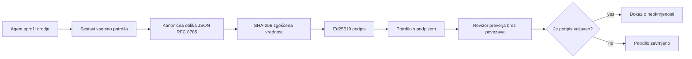
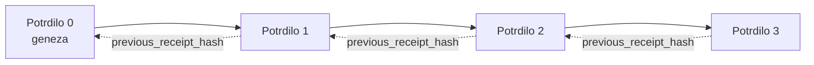

[Oglejte si video lekcije: Varnost AI agentov s kriptografskimi prejemki](https://youtu.be/PLACEHOLDER_VIDEO_ID)

> _(Video lekcije in sličica bosta dodana s strani Microsoftove vsebinske ekipe po združitvi, skladno s pravilom za lekciji 14 / 15.)_

# Varnost AI agentov s kriptografskimi prejemki

## Uvod

Ta lekcija bo zajemala:

- Zakaj so revizijske sledi za AI agente pomembne za skladnost, odpravljanje napak in zaupanje.
- Kaj je kriptografski prejemek in kako se razlikuje od nepodpisane vrstice dnevnika.
- Kako ustvariti podpisan prejemek za klic orodja agenta v preprostem Pythonu.
- Kako preveriti prejemek brez povezave in zaznati manipulacijo.
- Kako povezati prejemke tako, da odstranitev ali preurejanje enega pretrga verigo.
- Kaj prejemki dokazujejo in kaj izrecno ne dokazujejo.

## Cilji učenja

Po zaključku te lekcije boste znali:

- Prepoznati načine napak, ki motivirajo kriptografski izvor za akcije agentov.
- Ustvariti Ed25519-podpisan prejemek nad canonical JSON vsebino.
- Neodvisno preveriti prejemek z uporabo samo javnega ključa podpisnika.
- Zaznati manipulacije z ponovnim izvajanjem preverjanja na spremenjenem prejemku.
- Zgraditi hashsko povezano zaporedje prejemkov in pojasniti, zakaj je veriga pomembna.
- Prepoznati mejo med tem, kar prejemki dokazujejo (pripis, celovitost, vrstni red) in tem, česar ne dokazujejo (pravilnost dejanja, utemeljenost politike).

## Problem: Revizijska sled vašega agenta

Predstavljajte si, da ste implementirali AI agenta za Contoso Travel. Agent bere zahteve strank, kliče API za lete, da poišče možnosti, in rezervira sedeže v imenu stranke. V preteklem četrtletju je agent obdelal 50.000 rezervacij.

Danes pride revizor. Postavi preprosto vprašanje: "Pokažite mi, kaj je vaš agent storil."

Predložite svoje dnevniške datoteke. Revizor jih pregleda in postavi težje vprašanje: "Kako vem, da ti dnevniki niso bili urejeni?"

To je problem revizijske sledi. Večina današnjih namestitev agentov se zanaša na:

- **Dnevnike aplikacij**: zapisane s strani samega agenta, jih lahko ureja kdorkoli s sistemskim dostopom.
- **Storitve oblačnega dnevnika**: odporne proti manipulacijam na ravni platforme, vendar samo če revizor zaupa upravljavcu platforme.
- **Dnevniške zapise transakcij v podatkovni bazi**: primerni za spremembe v bazi, vendar ne za poljubne klice orodij.

Nobeden od teh ne more odgovoriti na vprašanje revizorja brez zaupanja v nekoga (vas, vašega ponudnika oblaka, prodajalca baze). Za notranjo uporabo je to zaupanje pogosto sprejemljivo. Za regulirane obremenitve (finančne, zdravstvene, karkoli pod EU AI zakonom) pa ni.

Kriptografski prejemki to rešujejo tako, da naredijo vsako akcijo agenta neodvisno preverljivo. Revizor vam ne rabi zaupati. Potrebuje le vaš javni ključ in sam prejemek.

## Kaj je kriptografski prejemek?

Prejemek je JSON objekt, ki beleži, kaj je agent storil, podpisan z digitalnim podpisom.


```mermaid
flowchart LR
    A[Agent sproži orodje] --> B[Sestavi vsebino potrdila]
    B --> C[Kanonična oblika JSON RFC 8785]
    C --> D[SHA-256 zgoščena vrednost]
    D --> E[Ed25519 podpis]
    E --> F[Potrdilo s podpisom]
    F --> G[Revizor preverja brez povezave]
    G --> H{Je podpis veljaven?}
    H -- yes --> I[Dokaz o neokrnjenosti]
    H -- no --> J[Potrdilo zavrnjeno]
```

Minimalni prejemek izgleda takole:

```json
{
  "type": "agent.tool_call.v1",
  "agent_id": "contoso-travel-bot",
  "tool_name": "lookup_flights",
  "tool_args_hash": "sha256:a3f9c1...",
  "result_hash": "sha256:7b2e1d...",
  "policy_id": "contoso-travel-policy-v3",
  "timestamp": "2026-04-25T14:30:00Z",
  "sequence": 47,
  "previous_receipt_hash": "sha256:9d4e6a...",
  "signature": {
    "alg": "EdDSA",
    "sig": "c5af83...",
    "public_key": "8f3b2c..."
  }
}
```

Tri lastnosti opravljajo delo:

1. **Podpis**. Prejemek podpiše agentov prehod z uporabo Ed25519 zasebnega ključa. Kdor ima pripadajoči javni ključ, lahko podpis preveri brez povezave. Vsaka manipulacija s katerim koli poljem prekine veljavnost podpisa.

2. **Kanonikalna koda**. Pred podpisom se prejemek serializira s shemo za kanonikalizacijo JSON (JCS, RFC 8785). To zagotavlja, da dve implementaciji, ki proizvedeta isti logični prejemek, ustvarita binarno identičen izhod. Brez kanonikalizacije bi različni JSON serializatorji dali različne podpise za isto vsebino.

3. **Verižni hash**. Polje `previous_receipt_hash` povezuje vsak prejemek s predhodnim. Odstranitev ali preurejanje prejemka prebije vsak kasnejši prejemek. Manipulacija je vidna že na ravni verige, tudi če so posamezni podpisi spregledani.

Skupaj te lastnosti zagotavljajo tri jamstva:

- **Pripis**: ta ključ je podpisal to vsebino.
- **Celovitost**: vsebina se od podpisa ni spremenila.
- **Vrstni red**: ta prejemek je sledil temu v verigi.

## Ustvarjanje prejemka v Pythonu

Za ustvarjanje prejemka ne potrebujete posebne knjižnice. Kriptografski gradniki so široko dostopni in logika je nekaj deset vrstic Pythona.

Praktične vaje v `code_samples/18-signed-receipts.ipynb` vodijo skozi celoten postopek. Povzetek:

```python
import json
import hashlib
import base64
from nacl import signing
from jcs import canonicalize  # RFC 8785 kanonični JSON

def b64url_nopad(data: bytes) -> str:
    return base64.urlsafe_b64encode(data).decode("ascii").rstrip("=")

def sha256_canonical(obj) -> str:
    """SHA-256 of a Python object's JCS-canonical JSON form."""
    return f"sha256:{hashlib.sha256(canonicalize(obj)).hexdigest()}"

# Generirajte ali naložite ključ za podpisovanje (v produkciji shranjujte v varnem ključu)
signing_key = signing.SigningKey.generate()
verify_key = signing_key.verify_key

# Zgradite vsebino potrdila (še brez podpisa)
tool_args = {"origin": "SYD", "destination": "LAX"}
tool_result = [{"flight": "QF11", "price": 1850, "stops": 0}]

payload = {
    "type": "agent.tool_call.v1",
    "agent_id": "contoso-travel-bot",
    "tool_name": "lookup_flights",
    "tool_args_hash": sha256_canonical(tool_args),
    "result_hash": sha256_canonical(tool_result),
    "policy_id": "contoso-travel-policy-v3",
    "timestamp": "2026-04-25T14:30:00Z",
    "sequence": 0,
    "previous_receipt_hash": None,
}

# Kanonizirajte, zglejte, podpišite.
canonical_bytes = canonicalize(payload)
message_hash = hashlib.sha256(canonical_bytes).digest()
signature_bytes = signing_key.sign(message_hash).signature

# Priložite strukturiran objekt podpisa.
receipt = {
    **payload,
    "signature": {
        "alg": "EdDSA",
        "sig": b64url_nopad(signature_bytes),
        "public_key": b64url_nopad(bytes(verify_key)),
    },
}
```

To je celoten podpisni postopek. Vaje v zvezku razložijo vsak korak.

## Preverjanje prejemka in zaznavanje manipulacije

Preverjanje je obratna operacija:

```python
import base64
import hashlib
from nacl import signing
from nacl.exceptions import BadSignatureError
from jcs import canonicalize

def b64url_decode(s: str) -> bytes:
    padding = "=" * ((4 - len(s) % 4) % 4)
    return base64.urlsafe_b64decode(s + padding)

def verify_receipt(receipt: dict) -> bool:
    # Podpis je strukturiran objekt: {"alg", "sig", "public_key"}.
    sig_obj = receipt.get("signature")
    if not sig_obj or sig_obj.get("alg") != "EdDSA":
        return False

    # Rekonstruirajte vsebino, ki je bila dejansko podpisana (vse razen podpisa).
    payload = {k: v for k, v in receipt.items() if k != "signature"}

    canonical_bytes = canonicalize(payload)
    message_hash = hashlib.sha256(canonical_bytes).digest()

    try:
        verify_key = signing.VerifyKey(b64url_decode(sig_obj["public_key"]))
        verify_key.verify(message_hash, b64url_decode(sig_obj["sig"]))
        return True
    except BadSignatureError:
        return False
```

Ta funkcija prejme prejemek in vrne `True`, če je podpis veljaven, drugače `False`. Brez klicev v omrežje, brez odvisnosti od storitev, brez potrebe po zaupanju tretji strani.

Za prikaz zaznavanja manipulacij zvezek razloži:

1. Ustvarjanje veljavnega prejemka in potrditev, da se preveri.
2. Spreminjanje enega bajta v polju `tool_args_hash`.
3. Ponovno izvajanje preverjanja in opazovanje neuspela.

To je praktični dokaz, da so prejemki odporni na manipulacije: vsaka sprememba, tudi najmanjša, prekine podpis.

## Verižna povezava prejemkov za agenta z več koraki

En prejemek ščiti eno akcijo. Veriga prejemkov ščiti zaporedje.


```mermaid
flowchart LR
    R0[Potrdilo 0<br/>geneza] --> R1[Potrdilo 1]
    R1 --> R2[Potrdilo 2]
    R2 --> R3[Potrdilo 3]
    R1 -. previous_receipt_hash .-> R0
    R2 -. previous_receipt_hash .-> R1
    R3 -. previous_receipt_hash .-> R2
```

Vsak prejemek beleži hash predhodnega prejemka. Za tiho odstranitev prejemka 2 mora napadalec ali:

- Spremeniti polje `previous_receipt_hash` prejemka 3 (prekine podpis prejemka 3), ALI
- Ponarediti nov podpis na spremenjenem prejemku 3 (potrebuje agentov zasebni ključ).

Če je zasebni ključ v strojni shrambi ključev in javni ključ objavite z vsakim prejemkom, nobeden napad ni izvedljiv brez odkritja.

Zvezek razloži:

1. Gradnjo verige treh prejemkov.
2. Preverjanje, da polje `previous_receipt_hash` vsakega prejemka ustreza dejanskemu hashu prejšnjega.
3. Manipulacijo s prejemkom na sredini in opazovanje prekinitve verige natanko tam.

Tako ustvarite revizijsko sled, ki jo lahko zunanji revizor preveri brez zaupanja v vas.

## Kaj prejemki dokazujejo (in česa ne)

To je najpomembnejši del te lekcije. Prejemki imajo močno moč, vendar so njene meje jasne.

**Prejemki dokazujejo tri stvari:**

1. **Pripis**: določen ključ je podpisal določen token.
2. **Celovitost**: token se od podpisa ni spremenil.
3. **Vrstni red**: ta prejemek je sledil temu v verigi hash.

**Prejemki ne dokazujejo:**

1. **Pravilnosti**: da je bila dejanja agenta prava. Prejemek se lahko podpiše tudi za napačen odgovor tako gladko kot za pravi.
2. **Skladnosti s politiko**: da je bila politika iz `policy_id` dejansko ovrednotena ali da bi dovolila to dejanje, če bi bila preverjena. Prejemek beleži, kar je bilo trjeno, ne kar je bilo uveljavljeno.
3. **Identiteta onkraj ključa**: prejemek pravi "ta ključ je podpisal to vsebino." Ne pravi "ta človek je to odobril." Povezava ključa z osebo ali organizacijo zahteva ločeno identitetno infrastrukturo (imenik, register javnih ključev itd.).
4. **Resničnost vhodnih podatkov**: če agent prejme manipuliran poziv in ukrepa na podlagi tega, prejemek zvesto beleži dejanje. Prejemki so podvrženi preverjanju vhodov, ne nadomestilo zanj.

Ta meja je pomembna iz dveh razlogov:

- Pove, za kaj so prejemki uporabni: za narediti vedenje agenta preverljivo in odporno na manipulacije, tudi prek organizacijskih meja.
- Pove, katere dodatne plasti še potrebujete: preverjanje vhodov (Lekcija 6), uveljavljanje politike (na kratko podana spodaj) in identitetno infrastrukturo (izven obsega te lekcije).

Pogosta napaka je domnevati, da "imamo prejemke" pomeni "upravljamo." Ne pomeni. Prejemki so temelj. Upravljanje je sistem, ki ga zgradite nad tem.

## Referenčni materiali za produkcijo

Python koda v tej lekciji je namenoma minimalna, da lahko preberete vsako vrstico in natanko razumete, kaj se dogaja. V produkciji imate dve možnosti:

1. **Graditi neposredno na kriptografskih gradnikih.** 50 vrstic, kot ste jih videli zgoraj, zadostuje za mnoge primere uporabe. PyNaCl (Ed25519) in paket `jcs` (kanonični JSON) so dobro vzdrževane in revidirane knjižnice.

2. **Uporabiti knjižnico za produkcijske prejemke.** Več odprtokodnih projektov implementira isti vzorec z dodatnimi funkcijami (rotacija ključev, skupinsko preverjanje, distribucija JWK seta, integracija s politiki):
   - Oblika prejemka v tej lekciji sledi IETF Internet-Draftu (`draft-farley-acta-signed-receipts`), ki je trenutno v postopku standardizacije.
   - Microsoft Agent Governance Toolkit sestavi prejemke z odločitvami politike v Cedarju; glejte Tutorial 33 v tem repozitoriju za primer od začetka do konca.
   - Paketa `protect-mcp` (npm) in `@veritasacta/verify` (npm) nudita implementacijo podpisovanja in preverjanja prejemkov v Node-u, namenjena ovijanju kateregakoli MCP strežnika z odporno revizijsko sledjo.
   - **[nobulex](https://github.com/arian-gogani/nobulex)** Python SDK (`pip install nobulex`) nudi isti vzorec podpisa Ed25519 + JCS v Pythonu z integracijami LangChain in CrewAI, vključno s testnimi vektorji za navzkrižno preverjanje in mapiranjem skladnosti, ki ga je prispeval [OWASP PR #2210](https://github.com/OWASP/CheatSheetSeries/pull/2210).

Odločitev med lastno implementacijo in uporabo knjižnice je podobna odločitvi med pisanjem lastne JWT knjižnice in uporabo preizkušene: obe sta razumni; knjižnica prihrani čas in zmanjša površino revizije; pristop od začetka vas sili razumeti vsak gradnik. Ta lekcija uči pot od začetka, da imate temelj za obe izbiri.

## Preverjanje znanja

Preizkusite svoje razumevanje pred nadaljevanjem na praktično vajo.

**1. Prejemek je podpisan z agentovim zasebnim Ed25519 ključem. Revizor ima samo javni ključ. Ali revizor lahko preveri prejemek brez povezave?**

<details>
<summary>Odgovor</summary>

Da. Preverjanje Ed25519 zahteva samo javni ključ in podpisane bajte. Brez klicev omrežju, brez odvisnosti od storitev. To je lastnost, ki naredi prejemke uporabne v okoljih z zračno režo, večorganizacijskih ali nizkega zaupanja.
</details>

**2. Napadalec spremeni polje `policy_id` v prejemku, da trdi, da je bila politika bolj permisivna. Podpis je bil nad prvotno vsebino. Kaj se zgodi med preverjanjem?**

<details>
<summary>Odgovor</summary>

Preverjanje ne uspe. Podpis je bil izračunan nad kanoničnimi bajti prvotne vsebine; spreminjanje poljubnega polja spremeni kanonične bajte, kar spremeni SHA-256 hash, zaradi česar podpis ni veljaven. Napadalec bi potreboval zasebni ključ za ustvarjanje novega veljavnega podpisa, katerega nima.
</details>

**3. Zakaj prejemek vključuje `tool_args_hash` in `result_hash` namesto surovih argumentov in rezultata?**

<details>
<summary>Odgovor</summary>

Dva razloga. Prvič, prejemek je morda treba arhivirati ali poslati v okoljih, kjer je puščanje surove vsebine (osebni podatki, poslovni podatki) problem. Hashiranje ohranja prejemek majhen in vsebino zasebno; revizor preveri, da hash ustreza ločeno shranjeni kopiji dejanske vsebine. Drugič, heši imajo fiksno velikost; prejemek s hashi ima omejeno velikost ne glede na velikost vhodov in izhodov.
</details>

**4. Polje `previous_receipt_hash` povezuje vsak prejemek s predhodnim. Če napadalec tiho odstrani en prejemek iz sredine verige, kaj postane neveljavno?**

<details>
<summary>Odgovor</summary>

Vsak prejemek, ki je sledil izbrisanemu. Njihova polja `previous_receipt_hash` ne ustrezajo dejanski verigi (ker prejemek, na katerega se nanašajo, ne obstaja več, ali ker veriga zdaj kaže na drugačnega predhodnika). Da bi prikril izbris, bi moral napadalec ponovno podpisati vsak kasnejši prejemek, kar zahteva zasebni ključ.
</details>

**5. Prejemek se čisto preveri. Ali to dokazuje, da je bilo dejanje agenta pravilno, utemeljeno ali skladno s politiko?**

<details>
<summary>Odgovor</summary>

Ne. Veljaven prejemek dokazuje tri stvari: pripis (ta ključ je podpisal to vsebino), celovitost (vsebina se ni spremenila) in vrstni red (ta prejemek sledi temu). Ne dokazuje, da je bilo dejanje pravilno, da je bila politika v `policy_id` abrootno ovrednotena ali da je agent spoštoval vse pravila. Prejemki naredijo vedenje agenta preverljivo, ne nujno pravilno. To je najpomembnejša meja v lekciji.
</details>

## Praktična vaja

Odprite `code_samples/18-signed-receipts.ipynb` in dokončajte vseh štiri razdelke:

1. **Razdelek 1**: Podpišite svoj prvi prejemek in ga preverite.
2. **Razdelek 2**: Manipulirajte s prejemkom in opazujte neuspeh preverjanja.
3. **Razdelek 3**: Zgradite verigo treh prejemkov in preverite celovitost verige.
4. **Razdelek 4**: Uporabite vzorec za agenta, zgrajenega z Microsoft Agent Framework: ovijte klic orodja v podpisovanje prejemka, nato prejemek neodvisno preverite.


**Izziv za raztezanje 1:** razširite shemo potrdila z dodatnim poljem po lastni izbiri (na primer ID zahtevka za sledenje), posodobite logiko kanoničnega podpisovanja, da ga vključuje, in potrdite, da potrdilo še vedno uspešno prehaja preverjanje. Nato spremenite polje po podpisu in potrdite, da preverjanje ne uspe. To vas prisili, da razumete, kako vsak bajt kanonične kodirane oblike prispeva k podpisu.

**Izziv za raztezanje 2:** SHA-256 zgoščite dve vaši potrdili skupaj (združite njuna kanonična bajta v determinističnem vrstnem redu) in rezultat zgoščenke vgradite kot novo polje v tretje potrdilo pred podpisom. Preverite, da vsa tri potrdila še vedno uspešno prehajajo preverjanje. Pravkar ste zgradili dokaz vključenosti v enem koraku: vsak, ki ima tretje potrdilo, lahko dokaže, da sta prva dve obstajali v času podpisa, ne da bi bilo treba razkriti njuno vsebino. To je vzorec, ki ga uporabljajo potrdila z izborčno razkritjem v velikem obsegu (Merklejeve obveznosti, RFC 6962).

## Zaključek

Kriptografska potrdila dajejo AI agentom revizijski sled, ki je:

- **Neodvisno preverljiva:** kakršna koli stran z javnim ključem lahko preveri, brez odvisnosti od storitev.
- **Zaznavno poškodovana:** kakršna koli sprememba razveljavi podpis.
- **Prenosljiva:** potrdilo je majhna JSON datoteka; lahko se arhivira, prenaša in preverja kjerkoli.
- **Skladna s standardi:** zgrajena na Ed25519 (RFC 8032), JCS (RFC 8785) in SHA-256, vsi široko uporabljeni primitivni gradniki.

Niso nadomestilo za preverjanje vnosa, izvajanje pravilnikov ali infrastrukturo identitete. So temelj za te plasti. Ko uvajate agente v reguliranih delovnih obremenitvah, medorganizacijskih potekih dela ali kjerkoli, kjer prihodnji revizorju ne morete zaupati, so potrdila način, kako narediti revizijsko sled pošteno.

Najpomembnejši zaključek: potrdila dokazujejo, kdo je kaj rekel in kdaj. Ne dokazujejo, da je bilo povedano resnično ali pravilno. To razlikovanje strogo zadržite. To je razlika med poštenim sistemom izvora in zavajajočim.

## Kontrolni seznam za produkcijo

Ko ste pripravljeni napredovati iz te lekcije k uvajanju agentov s podpisanimi potrdili v realnem okolju:

- [ ] **Premaknite podpisni ključ iz prenosnika razvijalca.** Uporabite Azure Key Vault, AWS KMS ali strojno varnostni modul. Zasebni ključ, ki podpisuje vaša potrdila, nikoli ne sme biti v sistemu za upravljanje s izvorno kodo ali v navadnem besedilu na strežniških računalnikih.
- [ ] **Objavite javni ključ za preverjanje.** Revizorji ga potrebujejo za preverjanje brez povezave. Standardni vzorec je JWK Set na dobro poznanem URL-ju (RFC 7517), npr. `https://your-org.example.com/.well-known/agent-keys.json`.
- [ ] **Zunanje sidrajte verigo.** Občasno zapišite najnovejšo glavo verige v transparentni dnevnik (Sigstore Rekor, RFC 3161 overitelj časovnih žigov ali drugi notranji sistem), da lahko zunanja stran potrdi "da je ta veriga obstajala ob tem času."
- [ ] **Shranjujte potrdila nespremenljivo.** Shramba z dodajanjem samo na konec (Azure Storage z neizbrisnimi pravilniki, AWS S3 Object Lock) preprečuje notranjemu sodelavcu prepisovanje zgodovine na ravni shrambnega sistema.
- [ ] **Odločite se o hrambi.** Veliko skladnostnih režimov zahteva večletno hrambo. Načrtujte rast potrdil (vsako potrdilo je ~500 bajtov; agent, ki izvaja 10.000 klicev dnevno, ustvari ~1,8 GB letno).
- [ ] **Določite, kaj potrdila ne pokrivajo.** Potrdila dokazujejo pripadnost, integriteto in vrstni red. Vaš vodnik za izvajanje naj eksplicitno navede dodatne kontrole (preverjanje vhodnih podatkov, izvajanje pravilnikov, omejevanje hitrosti, infrastruktura identitete), ki so poleg potrdil vključene v vašo upravljavsko držo.

### Imate več vprašanj o varovanju AI agentov?

Pridružite se [Microsoft Foundry Discordu](https://aka.ms/ai-agents/discord), da spoznate druge učence, se udeležite ur za vprašanja in dobite odgovore na vprašanja o AI agentih.

## Onkraj te lekcije

Ta lekcija pokriva podpisovanje enega potrdila in verigo zgoščenk. Isti primitivni gradniki sestavljajo več naprednih vzorcev, s katerimi se boste srečevali, ko bo vaša upravljavska drža dozorela:

- **Izborčna razkritja.** Ko so polja potrdila neodvisno zavezana (Merklejevo drevo v stilu RFC 6962), lahko razkrijete določena polja določenim revizorjem in dokažete, da so ostala nespremenjena, ne da bi jih razkrivali. Uporabno, kadar mora isto potrdilo zadovoljiti obširno revizijo (ki zahteva popolnost) in predpise o minimizaciji podatkov, kot je GDPR (ki želijo, da revizor vidi čim manj).
- **Razveljavitev potrdil.** Če je bil podpisni ključ ogrožen, morate imeti način, da od točke naprej označite vsa potrdila, podpisana s tem ključem, kot nezaupanja vredna. Standardni vzorci: začasni podpisni ključi s seznamom razveljavitev, ali transparentni dnevnik z vpisi razveljavitev.
- **Dvostranska / deljena potrdila s podpisom.** Nekatere implementacije delijo podpisano vsebino na poljub pred izvršitvijo (`authorization_*`) in po izvršitvi (`result_*`) z neodvisnimi podpisi, uporabno, ko odločitev o avtorizaciji in opažen rezultat proizvajajo različni izvajalci ali v različnih časih. To se ališči nad format potrdila, ki ga poučujemo v tej lekciji.
- **Sestava uporabnih podatkov.** Potrdilo zapečati kakršnekoli bajte, ki jih vstavite v `result_hash`. Pravi podatki so pogosto bogatejši kot le rezultat enega orodja: predizvedbeni razlogi (napoved modela, obravnavane možnosti, dokazi in njihova popolnost, tvegana drža, sled odgovornosti, izid kontrole) vse to lahko živi znotraj uporabnih podatkov, zapakirano v potrdilu. To ohranja format potrdila minimalen, hkrati pa omogoča razvoj shem uporabnih podatkov po domenah.
- **Usklajenost med implementacijami.** Več neodvisnih implementacij istega formata potrdila (Python, TypeScript, Rust, Go) se med seboj preverja proti skupnim testnim vektorjem. Če zgradite lastno implementacijo, preverjanje proti objavljenim vektorjem potrjuje združljivost.
- **Migracija po kvantnem obdobju.** Ed25519 je danes široko uporabljen, vendar ni odporen na kvantne računalnike. Format potrdila je algoritemsko prilagodljiv: polje `signature.alg` lahko nosi `ML-DSA-65` (standard za kvantno odporne podpise iz NIST) za čas migracije. Načrtujte prehodno obdobje, ko bodo potrdila podpisana dvakrat.

## Dodatni viri

- <a href="https://datatracker.ietf.org/doc/draft-farley-acta-signed-receipts/" target="_blank">IETF Internet-Draft: Podpisana potrdila o odločitvah za nadzor dostopa med stroji</a>
- <a href="https://learn.microsoft.com/azure/ai-studio/responsible-use-of-ai-overview" target="_blank">Pregled odgovorne uporabe AI (Azure AI)</a>
- <a href="https://datatracker.ietf.org/doc/html/rfc8032" target="_blank">RFC 8032: Digitalni podpis Edwardsove krivulje (EdDSA)</a>
- <a href="https://datatracker.ietf.org/doc/html/rfc8785" target="_blank">RFC 8785: Shema kanonične oblikovanja JSON (JCS)</a>
- <a href="https://datatracker.ietf.org/doc/html/rfc6962" target="_blank">RFC 6962: Transparentnost certifikatov</a> (zgradba Merklejevega drevesa, uporabljana pri potrdilih z izborčnim razkritjem)
- <a href="https://github.com/microsoft/agent-governance-toolkit/blob/main/docs/tutorials/33-offline-verifiable-receipts.md" target="_blank">Microsoft Agent Governance Toolkit, Vadnica 33: Potrdila o odločitvah, ki jih je mogoče preveriti brez povezave</a>
- <a href="https://github.com/ScopeBlind/agent-governance-testvectors" target="_blank">Testni vektorji za usklajenost med implementacijami</a> za format potrdila, uporabljen v tej lekciji (Apache-2.0)
- <a href="https://pynacl.readthedocs.io/" target="_blank">Dokumentacija PyNaCl</a> (Ed25519 v Pythonu)

## Prejšnja lekcija

[Gradnja agentov za računalniško uporabo (CUA)](../15-browser-use/README.md)

---

<!-- CO-OP TRANSLATOR DISCLAIMER START -->
**Omejitev odgovornosti**:
Ta dokument je bil preveden z uporabo AI prevajalske storitve [Co-op Translator](https://github.com/Azure/co-op-translator). Čeprav si prizadevamo za natančnost, vas prosimo, da upoštevate, da avtomatizirani prevodi lahko vsebujejo napake ali netočnosti. Izvirni dokument v njegovem izvirnem jeziku je treba obravnavati kot avtoritativni vir. Za kritične informacije je priporočljiv strokovni človeški prevod. Ne odgovarjamo za morebitna nesporazume ali napačne interpretacije, ki izhajajo iz uporabe tega prevoda.
<!-- CO-OP TRANSLATOR DISCLAIMER END -->