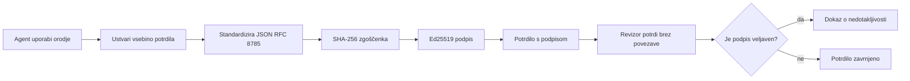
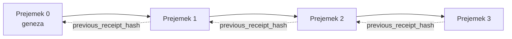

[Ogled videoposnetka lekcije: Zavarovanje AI agentov s kriptografskimi potrdili](https://youtu.be/PLACEHOLDER_VIDEO_ID)

> _(Videoposnetek lekcije in sličica bosta dodana s strani Microsoftove vsebinske ekipe po združitvi, skladno z vzorcem lekcij 14 / 15.)_

# Zavarovanje AI agentov s kriptografskimi potrdili

## Uvod

Ta lekcija bo zajemala:

- Zakaj so revizijske sledi za AI agente pomembne za skladnost, odpravljanje napak in zaupanje.
- Kaj je kriptografsko potrdilo in kako se razlikuje od neoverjene zapisnice.
- Kako v običajnem Pythonu ustvariti podpisano potrdilo za klic orodja agenta.
- Kako potrditi potrdilo brez povezave in zaznati morebitne spremembe.
- Kako povezati potrdila tako, da odstranjevanje ali ponovna razporeditev enega prekine verigo.
- Kaj potrdila dokazujejo in kaj izrecno ne dokazujejo.

## Cilji učenja

Po zaključku te lekcije boste znali:

- Prepoznati načine odpovedi, ki motivirajo kriptografski izvor za akcije agentov.
- Ustvariti Ed25519-podpisano potrdilo nad kanoničnim JSON naborom podatkov.
- Neodvisno preveriti potrdilo samo z javnim ključem podpisnika.
- Zaznati spreminjanje s ponovnim izvajanjem preverjanja na spremenjenem potrdilu.
- Zgraditi z verigami povezan niz potrdil in pojasniti, zakaj je veriga pomembna.
- Prepoznati mejo med tem, kaj potrdila dokazujejo (pripadnost, integriteta, vrstni red) in česa ne (pravilnost akcije, ustreznost politike).

## Problem: Revizijska sled vašega agenta

Predstavljajte si, da ste za Contoso Travel namestili AI agenta. Agent obravnava zahteve strank, kliče API za lete za iskanje možnosti in rezervira sedeže v imenu stranke. V zadnjem četrtletju je agent obdelal 50.000 rezervacij.

Danes pride revizor. Postavi preprosto vprašanje: "Pokažite mi, kaj je vaš agent storil."

Izročite svoje dnevniške datoteke. Revizor jih pogleda in postavi bolj zahtevno vprašanje: "Kako vem, da te zapise niso spreminjali?"

To je problem revizijske sledi. Večina današnjih namestitev agentov se zanaša na:

- **Aplikacijske dnevnike**: jih piše sam agent, jih lahko ureja kdorkoli z dostopom do datotečnega sistema.
- **Storitve za beleženje v oblaku**: vidno zaščiteno pred manipulacijo na ravni platforme, a le če revizor zaupa ponudniku platforme.
- **Dnevniške zapise baz podatkov**: primerni za spremembe v podatkovni zbirki, a ne za poljubne klice orodij.

Noben od teh ne more odgovoriti na revizorjevo vprašanje brez zaupanja v nekoga (vas, vašega ponudnika oblaka, vašega prodajalca baze). Za notranjo uporabo je to pogosto sprejemljivo. Za regulirane naloge (finančni sektor, zdravstvo, karkoli, kar ureja EU-jev zakon o AI) ni.

Kriptografska potrdila to rešujejo tako, da omogočajo neodvisno preverljivost vsake akcije agenta. Revizor vam ni dolžan zaupati. Potrebuje samo vaš javni ključ in samo potrdilo.

## Kaj je kriptografsko potrdilo?

Potrdilo je JSON objekt, ki beleži, kaj je agent storil, podpisan z digitalnim podpisom.


```mermaid
flowchart LR
    A[Agent uporabi orodje] --> B[Ustvari vsebino potrdila]
    B --> C[Standardizira JSON RFC 8785]
    C --> D[SHA-256 zgoščenka]
    D --> E[Ed25519 podpis]
    E --> F[Potrdilo s podpisom]
    F --> G[Revizor potrdi brez povezave]
    G --> H{Je podpis veljaven?}
    H -- da --> I[Dokaz o nedotakljivosti]
    H -- ne --> J[Potrdilo zavrnjeno]
```

Minimalno potrdilo izgleda takole:

```json
{
  "type": "agent.tool_call.v1",
  "agent_id": "contoso-travel-bot",
  "tool_name": "lookup_flights",
  "tool_args_hash": "sha256:a3f9c1...",
  "result_hash": "sha256:7b2e1d...",
  "policy_id": "contoso-travel-policy-v3",
  "timestamp": "2026-04-25T14:30:00Z",
  "sequence": 47,
  "previous_receipt_hash": "sha256:9d4e6a...",
  "signature": {
    "alg": "EdDSA",
    "sig": "c5af83...",
    "public_key": "8f3b2c..."
  }
}
```

Tri lastnosti opravijo delo:

1. **Podpis**. Potrdilo je podpisal prehod agenta z Ed25519 zasebnim ključem. Kdor ima ustrezen javni ključ, lahko podpis preveri brez povezave. Sprememba katerega koli polja naredi podpis neveljaven.

2. **Kanonično kodiranje**. Pred podpisom je potrdilo serijalizirano po shemi kanoničnega JSON (JCS, RFC 8785). To zagotavlja, da dve implementaciji, ki ustvarjata logično enako potrdilo, proizvedeta enake bajtne zapise. Brez kanonizacije bi različni JSON serializerji proizvedli različne podpise za isto vsebino.

3. **Verižno povezovanje pomoči**. Polje `previous_receipt_hash` povezuje vsako potrdilo s prejšnjim. Odstranitev ali sprememba zaporedja potrdila pokvari vso verigo, ki sledi. Manipulacije so vidne na ravni verige tudi, če so posamezni podpisi spregledani.

Skupaj te lastnosti nudijo tri zagotovila:

- **Pripadnost**: ta ključ je podpisal to vsebino.
- **Integriteta**: vsebina se od podpisa ni spremenila.
- **Vrstni red**: to potrdilo je prišlo za tem v verigi.

## Ustvarjanje potrdila v Pythonu

Za izdelavo potrdila ne potrebujete posebne knjižnice. Kriptografski primitivci so široko dostopni, logika pa je le nekaj deset vrstic Pythona.

Praktične vaje v `code_samples/18-signed-receipts.ipynb` vas vodijo skozi celoten postopek. Povzetek:

```python
import json
import hashlib
import base64
from nacl import signing
from jcs import canonicalize  # RFC 8785 kanonični JSON

def b64url_nopad(data: bytes) -> str:
    return base64.urlsafe_b64encode(data).decode("ascii").rstrip("=")

def sha256_canonical(obj) -> str:
    """SHA-256 of a Python object's JCS-canonical JSON form."""
    return f"sha256:{hashlib.sha256(canonicalize(obj)).hexdigest()}"

# Ustvari ali naloži ključ za podpisovanje (v produkciji shrani v ključavnico)
signing_key = signing.SigningKey.generate()
verify_key = signing_key.verify_key

# Ustvari vsebino potrdila (še brez podpisa)
tool_args = {"origin": "SYD", "destination": "LAX"}
tool_result = [{"flight": "QF11", "price": 1850, "stops": 0}]

payload = {
    "type": "agent.tool_call.v1",
    "agent_id": "contoso-travel-bot",
    "tool_name": "lookup_flights",
    "tool_args_hash": sha256_canonical(tool_args),
    "result_hash": sha256_canonical(tool_result),
    "policy_id": "contoso-travel-policy-v3",
    "timestamp": "2026-04-25T14:30:00Z",
    "sequence": 0,
    "previous_receipt_hash": None,
}

# Kanoniziraj, zgošči, podpiši.
canonical_bytes = canonicalize(payload)
message_hash = hashlib.sha256(canonical_bytes).digest()
signature_bytes = signing_key.sign(message_hash).signature

# Priloži strukturiran objekt podpisa.
receipt = {
    **payload,
    "signature": {
        "alg": "EdDSA",
        "sig": b64url_nopad(signature_bytes),
        "public_key": b64url_nopad(bytes(verify_key)),
    },
}
```

To je celoten podpisni postopek. Vaje v zvezku podrobno razlagajo vsak korak.

## Preverjanje potrdila in zaznavanje sprememb

Preverjanje je obratni postopek:

```python
import base64
import hashlib
from nacl import signing
from nacl.exceptions import BadSignatureError
from jcs import canonicalize

def b64url_decode(s: str) -> bytes:
    padding = "=" * ((4 - len(s) % 4) % 4)
    return base64.urlsafe_b64decode(s + padding)

def verify_receipt(receipt: dict) -> bool:
    # Podpis je strukturiran objekt: {"alg", "sig", "public_key"}.
    sig_obj = receipt.get("signature")
    if not sig_obj or sig_obj.get("alg") != "EdDSA":
        return False

    # Rekonstruirajte vsebino, ki je bila dejansko podpisana (vse razen podpisa).
    payload = {k: v for k, v in receipt.items() if k != "signature"}

    canonical_bytes = canonicalize(payload)
    message_hash = hashlib.sha256(canonical_bytes).digest()

    try:
        verify_key = signing.VerifyKey(b64url_decode(sig_obj["public_key"]))
        verify_key.verify(message_hash, b64url_decode(sig_obj["sig"]))
        return True
    except BadSignatureError:
        return False
```

Funkcija vzame potrdilo in vrne `True`, če je podpis veljaven, sicer `False`. Brez omrežnih klicev, brez odvisnosti od strežnikov, brez zaupanja v tretjo stran.

Za prikaz zaznavanja sprememb, važenček vodi skozi:

1. Ustvarjanje veljavnega potrdila in potrditev njegove veljavnosti.
2. Spreminjanje enega bajta v polju `tool_args_hash`.
3. Ponovno preverjanje in občutek napake.

To je praktičen dokaz, da so potrdila vidna za manipulacijo: vsaka sprememba, pa naj bo še tako majhna, prekine podpis.

## Povezovanje potrdil za večstopenjske agente

Eno podpisano potrdilo zaščiti eno akcijo. Veriga potrdil ščiti zaporedje.


```mermaid
flowchart LR
    R0[Prejemek 0<br/>geneza] --> R1[Prejemek 1]
    R1 --> R2[Prejemek 2]
    R2 --> R3[Prejemek 3]
    R1 -. previous_receipt_hash .-> R0
    R2 -. previous_receipt_hash .-> R1
    R3 -. previous_receipt_hash .-> R2
```

Vsako potrdilo beleži zgoščenko potrdila pred njim. Da bi napadalec tiho odstranil potrdilo 2, bi moral:

- Spremeniti polje `previous_receipt_hash` potrdila 3 (prekine podpis potrdila 3), ALI
- Ponarediti nov podpis na spremenjenem potrdilu 3 (zahteva zasebni ključ agenta).

Če je zasebni ključ v strojni ključavnici, vi pa javni ključ objavite z vsakim potrdilom, nobena izmed teh možnosti ni izvedljiva brez zaznave.

Zvezek vodi skozi:

1. Izgradnjo verige treh potrdil.
2. Preverjanje, da polje `previous_receipt_hash` vsakega potrdila ustreza dejanski zgoščenki prejšnjega.
3. Spremembo enega potrdila v sredini in opažanje prekinitve verige prav na tem mestu.

Tako ustvarite revizijsko sled, ki jo lahko zunanji revizor preveri brez zaupanja v vas.

## Kaj potrdila dokazujejo (in česa ne)

To je najpomembnejši del te lekcije. Potrdila so močna, a njihova moč je omejena.

**Potrdila dokazujejo tri stvari:**

1. **Pripadnost**: določen ključ je podpisal določen nabor podatkov.
2. **Integriteto**: nabor podatkov se od podpisa ni spremenil.
3. **Vrstni red**: to potrdilo je v verigi prišlo za tistim potrdilom.

**Potrdila NE dokazujejo:**

1. **Pravilnost**: da je bila akcija agenta pravilna. Potrdilo se lahko podpiše tudi za napačen odgovor, prav tako elegantno kot za pravilen.
2. **Skladnost s politiko**: da je bila politika, omenjena v `policy_id`, dejansko ocenjena ali da bi dovolila ta ukrep, če bi jo preverili. Potrdilo beleži, kar je bilo zatrjevano, ne pa, kar je bilo izvršeno.
3. **Identiteto onkraj ključa**: potrdilo pravi "ta ključ je podpisal to vsebino." Ne pravi "ta človek je pooblastil to." Povezava ključa s osebo ali organizacijo zahteva ločeno identitetno infrastrukturo (imenik, register javnih ključev itd.).
4. **Resničnost vhodnih podatkov**: če agent prejme manipulirano navodilo in ukrepa po njem, potrdilo zvesto beleži akcijo. Potrdila so spodnji del procesa validacije podatkov, niso nadomestilo zanj.

Ta meja je pomembna zaradi dveh razlogov:

- Pove vam, za kaj so potrdila uporabna: omogočajo revizijsko sled in vidnost manipulacij agentovega delovanja, tudi čez organizacijske meje.
- Pove vam, katere dodatne plasti še potrebujete: validacijo vhodnih podatkov (lekcija 6), uveljavljanje politike (kratko zajeto spodaj) in identitetno infrastrukturo (izven obsega te lekcije).

Pogosta napaka je predvidevati, da "imamo potrdila" pomeni "imamo upravljanje." Ne pomeni. Potrdila so temelj. Upravljanje je sistem, ki ga zgradite na tem.

## Referenčni viri za proizvodnjo

Python koda v tej lekciji je namenoma minimalna, da lahko preberete vsako vrstico in razumete, kaj se točno dogaja. Za proizvodnjo imate dve možnosti:

1. **Izgradite neposredno na kriptografskih primitivih.** 50 vrstic, ki ste jih videli zgoraj, je dovolj za številne primere uporabe. PyNaCl (Ed25519) in paket `jcs` (kanonični JSON) sta dobro vzdrževani in pregledani knjižnici.

2. **Uporabite proizvodno knjižnico za potrdila.** Več odprtokodnih projektov implementira isti vzorec z dodatnimi funkcionalnostmi (rotacija ključev, skupinska validacija, distribucija JWK seta, integracije s politiki):
   - Format potrdil, uporabljen v tej lekciji, sledi IETF internetnemu osnutku (`draft-farley-acta-signed-receipts`), ki je trenutno v procesu standardizacije.
   - Microsoft Agent Governance Toolkit združuje potrdila s politiko na osnovi Cedar; glejte navodilo 33 v tistem repozitoriju za celovit primer.
   - Paketi `protect-mcp` (npm) in `@veritasacta/verify` (npm) nudijo implementacijo podpisa in preverjanja potrdil v Node.js, namenjeno zavijanju kateregakoli MCP strežnika z vidnim revizijskim sledjem.
   - **[nobulex](https://github.com/arian-gogani/nobulex)** Python SDK (`pip install nobulex`) nudi isti Ed25519 + JCS podpisni vzorec v Pythonu z LangChain in CrewAI integracijami, vključno z objavljenimi testnimi vektorji in preslikavo skladnosti, prispevano preko [OWASP PR #2210](https://github.com/OWASP/CheatSheetSeries/pull/2210).

Odločitev med izdelavo lastne rešitve in uporabo knjižnice je podobna odločanju med pisanjem lastne JWT knjižnice in uporabo testirane: obe sta razumljivi; knjižnica prihrani čas in zmanjša površino revizije; pristop od začetka zahteva, da razumete vsak primitiv. Ta lekcija uči pot od začetka, da imate temelj za katerokoli izbiro.

## Preverjanje znanja

Preizkusite svoje razumevanje, preden nadaljujete z vajo.

**1. Potrdilo je podpisano z zasebnim Ed25519 ključem agenta. Revizor ima samo javni ključ. Ali lahko revizor potrdi potrdilo brez povezave?**

<details>
<summary>Odgovor</summary>

Da. Verifikacija Ed25519 zahteva samo javni ključ in podpisane bajte. Brez omrežnih klicev, brez storitvenih odvisnosti. To lastnost izkoriščajo revizije v zračnih režah, več- organizacijskih okoljih in okoljih z nizkim zaupanjem.
</details>

**2. Napadalec spremeni polje `policy_id` v potrdilu, da trdi, da je bila politka bolj dopuščujoča. Podpis je nad originalno vsebino. Kaj se zgodi pri preverjanju?**

<details>
<summary>Odgovor</summary>

Preverjanje ne uspe. Podpis je bil narejen nad kanoničnimi bajti originalne vsebine; sprememba katerega koli polja spremeni bajtno zaporedje, s tem tudi SHA-256 zgoščenko, kar naredi podpis neveljaven. Napadalec bi potreboval zasebni ključ za proizvajanje veljavnega novega podpisa, česar nima.
</details>

**3. Zakaj potrdilo vključuje `tool_args_hash` in `result_hash` namesto surovih argumentov in rezultatov?**

<details>
<summary>Odgovor</summary>

Dva razloga. Prvič, potrdilo je morda potrebno arhivirati ali prenašati v okoljih, kjer je razkritje surove vsebine (osebni podatki, poslovni podatki) problematično. Zgoščevanje ohranja potrdilo majhno in vsebino zasebno; revizor preveri, da zgoščenka ustreza ločeno shranjeni kopiji dejanske vsebine. Drugič, zgoščene vrednosti so fiksne velikosti; tako je velikost potrdila omejena ne glede na velikost vhodov in izhodov.
</details>

**4. Polje `previous_receipt_hash` povezuje vsako potrdilo s predhodnikom. Če napadalec tiho izbriše potrdilo iz sredine verige, kaj postane neveljavno?**

<details>
<summary>Odgovor</summary>

Vsako potrdilo, ki je sledilo izbrisanemu. Njihova polja `previous_receipt_hash` ne ustrezajo več dejanski verigi (ker potrdilo, na katerega so se sklicevali, ne obstaja ali veriga zdaj kaže na drugega predhodnika). Da bi prikril brisanje, bi moral napadalec ponovno podpisati vsa poznejša potrdila, kar zahteva zasebni ključ.
</details>

**5. Potrdilo uspešno preveri. Ali to dokazuje, da je bila akcija agenta pravilna, ustrezna ali skladna s politiko?**

<details>
<summary>Odgovor</summary>

Ne. Veljavno potrdilo dokazuje tri stvari: pripadnost (ta ključ je podpisal to vsebino), integriteto (vsebina se ni spremenila) in vrstni red (to potrdilo je v verigi za tistim potrdilom). Ne dokazuje, da je bila akcija pravilna, da je bila politika v `policy_id` dejansko ocenjena, ali da je agent upošteval vsa pravila. Potrdila omogočajo revizijo vedenja agenta, ne pa nujno pravilnost. To je najpomembnejša meja v lekciji.
</details>

## Praktična vaja

Odprite `code_samples/18-signed-receipts.ipynb` in dokončajte vse štiri razdelke:

1. **Razdelek 1**: Podpišite svoje prvo potrdilo in ga preverite.
2. **Razdelek 2**: Spremenite potrdilo in opazujte neuspeh preverjanja.
3. **Razdelek 3**: Zgradite verigo treh potrdil in preverite integriteto verige.
4. **Razdelek 4**: Uporabite vzorec na agentu, zgrajenem z Microsoft Agent Framework: zavijte klic orodja v podpis potrdila, nato neodvisno preverite potrdilo.
**Razširjen izziv 1:** razširite shemo prejemka z dodatnim poljem po vaši izbiri (na primer ID zahteve za sledenje), posodobite kanonično logiko podpisovanja, da ga vključite, in potrdite, da prejemek še vedno uspešno prehiti preverjanje. Nato spremenite polje po podpisu in potrdite, da preverjanje ne uspe. To vas prisili, da razumete, kako vsak bajt kanoničnega kodiranja prispeva k podpisu.

**Razširjen izziv 2:** zgoščite SHA-256 dva svoja prejemka skupaj (povežite njune kanonične bajte v determinističnem vrstnem redu) in vstavite nastali odtis kot novo polje na tretjem prejemku pred podpisom. Preverite, da vsi trije prejemki še vedno uspešno prehajajo preverjanje. Pravkar ste zgradili dokaz o vključenosti v enem koraku: kdorkoli, ki ima tretji prejemek, lahko dokaže, da sta prva dva ob njenem podpisu obstajala, brez razkritja njune vsebine. To je vzorec, ki ga prejemki z izbirnim razkritjem uporabljajo v velikem obsegu (Merklejeve obveznosti, RFC 6962).

## Zaključek

Kriptografski prejemki AI agentom zagotavljajo revizijsko sled, ki je:

- **Neodvisno preverljiva**: kdorkoli z javnim ključem lahko preveri, brez odvisnosti od storitev.
- **Očitna za posege**: vsaka sprememba razveljavi podpis.
- **Prenosljiva**: prejemek je majhna JSON datoteka; lahko se arhivira, prenaša in preverja kjerkoli.
- **V skladu s standardi**: temelji na Ed25519 (RFC 8032), JCS (RFC 8785) in SHA-256, vseh široko razširjenih primitivih.

Niso nadomestilo za preverjanje vhodnih podatkov, uveljavljanje politik ali identitetno infrastrukturo. So temelj za te plasti. Ko uvajate agente v regulirana delovna okolja, večorganacijske delovne tokove ali kjerkoli, kjer ni mogoče predpostaviti zaupanja s strani bodočega revizorja, so prejemki način, kako naredite revizijsko sled pošteno.

Najpomembnejša spoznanja: prejemki dokazujejo, kdo je kaj rekel in kdaj. Ne dokazujejo resničnosti ali pravilnosti izrečenega. Ta razliko si dobro zapomnite. To je razlika med poštenim sistemom izvora podatkov in zavajajočim.

## Seznam za produkcijo

Ko ste pripravljeni preiti od te lekcije do uvajanja agentov s podpisanimi prejemki v resničnem okolju:

- [ ] **Premaknite ključ za podpisovanje z razvijalskega prenosnika.** Uporabite Azure Key Vault, AWS KMS ali varnostni strojni modul. Zasebni ključ, ki podpira vaše prejemke, nikoli ne sme biti v sistemu za nadzor različic ali v navadnem besedilu na aplikacijskih računalnikih.
- [ ] **Objavite javni ključ za preverjanje.** Revizorji ga potrebujejo za offline preverjanje. Standardni vzorec je JWK set na dobro poznanem URL-ju (RFC 7517), npr. `https://your-org.example.com/.well-known/agent-keys.json`.
- [ ] **Zunanje sidranje verige.** Občasno zapišite zgoščeno vrednost najnovejšega glave verige v dnevnik transparentnosti (Sigstore Rekor, RFC 3161 timestamp authority ali drug notranji sistem), da lahko zunanja stran potrdi "ta veriga je obstajala ob tem času."
- [ ] **Shranjujte prejemke nespremenljivo.** Shramba, ki dopušča le dodajanje (Azure Storage z neizbrisnimi pravilniki, AWS S3 Object Lock), preprečuje notranjemu napadalcu prepisovanje zgodovine na plasti shranjevanja.
- [ ] **Odločite o zadrževanju.** Številni predpisi zahtevajo večletno hrambo. Načrtujte rast prejemkov (vsak prejemek je ~500 bajtov; agent, ki ustvari 10.000 klicev na dan, proizvede ~1,8 GB na leto).
- [ ] **Dokumentirajte, kaj prejemki ne zajemajo.** Prejemki dokazujejo pripis, integriteto in vrstni red. Vaš načrt delovanja naj eksplicitno navede, kateri dodatni mehanizmi nadzora (preverjanje vnosa, uveljavljanje politike, omejevanje hitrosti, identitetna infrastruktura) sodelujejo s prejemki pri vašem upravljanju.

### Imate več vprašanj o varovanju AI agentov?

Pridružite se [Microsoft Foundry Discordu](https://aka.ms/ai-agents/discord), da se srečate z drugimi udeleženci, obiščete izbirne ure in dobite odgovore na vaša vprašanja o AI agentih.

## Za tem lekcijo

Ta lekcija zajema podpisovanje enega prejemka in verigo z verižnimi zgoščinami. Enake primitive sestavljajo več naprednih vzorcev, s katerimi se lahko srečate, ko vaš upravljalski položaj napreduje:

- **Izbirno razkritje.** Ko so polja prejemka neodvisno obvezana (Merklejevo drevo po RFC 6962), lahko določena polja razkrijete določenim revizorjem in dokažete, da ostala niso spremenjena, brez razkrivanja le-teh. Uporabno, kadar mora isti prejemek zadovoljiti tako celovito revizijo (ki želi celovitost) kot pravila zmanjševanja podatkov, kot je GDPR (ki želijo, da revizor vidi čim manj).
- **Razveljavitev prejemka.** Če je bil ključ za podpisovanje ogrožen, morate imeti način, da vse prejemke, podpisane s tem ključem, označite kot nezaupanja vredne od določenega časa naprej. Standardni vzorci: kratkotrajni ključi za podpisovanje in objavljene sezname razveljavitev ali dnevnik transparentnosti z zapisom razveljavitve.
- **Dvostranski / deljeni podpisni prejemki.** Nekatere implementacije ločijo podpisano vsebino na polovici pred izvršitvijo (`authorization_*`) in po izvršitvi (`result_*`) z neodvisnimi podpisi, kar je uporabno, kadar avtoritativna odločitev in opazovani rezultat prihajata od različnih izvajalcev ali ob različnih časih. To se nadgradi na format prejemkov iz te lekcije.
- **Sestava podatkovne vsebine.** Prejemek zapakira vse bajte, ki jih vstavite v `result_hash`. Resnični podatki so pogosto bogatejši od enega rezultata orodja: predodločitveno razmišljanje (napoved modela, obravnavane možnosti, dokazi in njihova popolnost, ocena tveganja, sled odgovornosti, izid preverjanja) lahko živi znotraj vsebine, zaprto v enem prejemku. To ohranja format prejemka minimalen in hkrati omogoča razvoj shem vsebine po domenah.
- **Medimplementacijska skladnost.** Več neodvisnih implementacij istega formata prejemkov (Python, TypeScript, Rust, Go) preizkuša medsebojno skladnost s skupnimi testnimi primeri. Če zgradite svojo implementacijo, potrditev z objavljenimi primeri zagotovi združljivost pretoka podatkov.
- **Migracija po kvantnem času.** Ed25519 je danes široko uporabljen, ni pa odporen proti kvantnim računalnikom. Format prejemkov je algoritemsko prilagodljiv: polje `signature.alg` lahko nosi `ML-DSA-65` (NIST standard za podpis po kvantnem času), ko potrebujete migracijo. Načrtujte prehodno obdobje, ko bodo prejemki podpisani dvojno.

## Dodatni viri

- <a href="https://datatracker.ietf.org/doc/draft-farley-acta-signed-receipts/" target="_blank">IETF Internet-nacrt: Podpisani odločilni prejemki za strojni dostop</a>
- <a href="https://learn.microsoft.com/azure/ai-studio/responsible-use-of-ai-overview" target="_blank">Pregled odgovorne uporabe AI (Azure AI)</a>
- <a href="https://datatracker.ietf.org/doc/html/rfc8032" target="_blank">RFC 8032: Digitalni podpisni algoritem Edwardsove krivulje (EdDSA)</a>
- <a href="https://datatracker.ietf.org/doc/html/rfc8785" target="_blank">RFC 8785: JSON kanonizacijska shema (JCS)</a>
- <a href="https://datatracker.ietf.org/doc/html/rfc6962" target="_blank">RFC 6962: Transparentnost potrdil</a> (Merklejeva drevesna struktura, ki jo uporabljajo prejemki z izbirnim razkritjem)
- <a href="https://github.com/microsoft/agent-governance-toolkit/blob/main/docs/tutorials/33-offline-verifiable-receipts.md" target="_blank">Microsoft Agent Governance Toolkit, Vadnica 33: Prejemki odločitev z offline preverjanjem</a>
- <a href="https://github.com/ScopeBlind/agent-governance-testvectors" target="_blank">Preizkusni primeri skladnosti med implementacijami</a> za format prejemkov uporabljenih v tej lekciji (Apache-2.0)
- <a href="https://pynacl.readthedocs.io/" target="_blank">PyNaCl dokumentacija</a> (Ed25519 v Pythonu)

## Prejšnja lekcija

[Gradnja agentov za uporabo računalnika (CUA)](../15-browser-use/README.md)

---

<!-- CO-OP TRANSLATOR DISCLAIMER START -->
**Omejitev odgovornosti**:
Ta dokument je bil preveden z uporabo AI prevajalske storitve [Co-op Translator](https://github.com/Azure/co-op-translator). Čeprav si prizadevamo za natančnost, vas prosimo, da upoštevate, da avtomatizirani prevodi lahko vsebujejo napake ali netočnosti. Izvirni dokument v njegovem izvirnem jeziku je treba obravnavati kot avtoritativni vir. Za kritične informacije je priporočljiv strokovni človeški prevod. Ne odgovarjamo za morebitna nesporazume ali napačne interpretacije, ki izhajajo iz uporabe tega prevoda.
<!-- CO-OP TRANSLATOR DISCLAIMER END -->