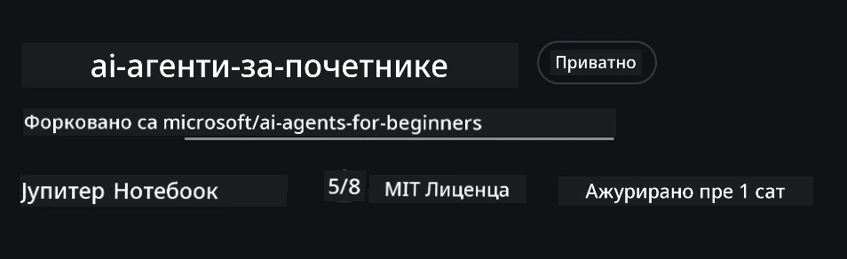
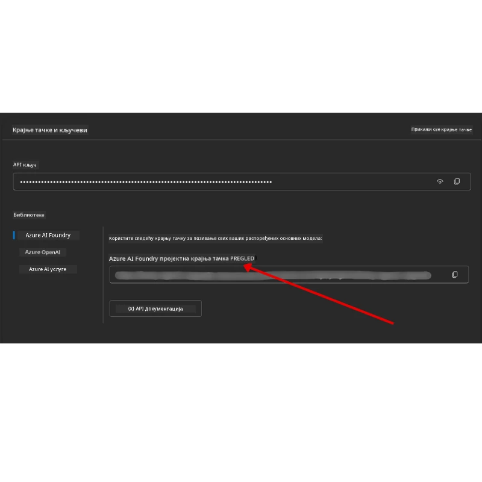

# Подешавање курса

## Увод

Ова лекција покрива како да покренете примерe кода из овог курса.

## Придружите се другим ученицима и добијте помоћ

Пре него што почнете да клонирате свој репозиторијум, придружите се Discord каналу [AI Agents For Beginners Discord channel](https://aka.ms/ai-agents/discord) да бисте добили помоћ при подешавању, поставили питања о курсу или повезали се са другим ученицима.

## Клонирање или форковање овог репозиторијума

Да бисте почели, молимо вас да клонирате или форкујете GitHub репозиторијум. Ово ће направити вашу верзију материјала курса тако да можете да покрећете, тестирате и прилагођавате код!

This can be done by clicking the link to <a href="https://github.com/microsoft/ai-agents-for-beginners/fork" target="_blank">форкујте репозиторијум</a>

You should now have your own forked version of this course in the following link:



### Плитко клонирање (препоручено за радионице / Codespaces)

  >Цео репозиторијум може бити велики (~3 GB) када преузмете пуну историју и све фајлове. Ако идете само на радионицу или вам је потребно само неколико фасцикли са лекцијама, плитко клонирање (или sparse клонирање) избегава већину тог преузимања скраћујући историју и/или прескачући блобове.

#### Брзо плитко клонирање — минимална историја, сви фајлови

Replace `<your-username>` in the below commands with your fork URL (or the upstream URL if you prefer).

To clone only the latest commit history (small download):

```bash|powershell
git clone --depth 1 https://github.com/<your-username>/ai-agents-for-beginners.git
```

To clone a specific branch:

```bash|powershell
git clone --depth 1 --branch <branch-name> https://github.com/<your-username>/ai-agents-for-beginners.git
```

#### Делимично (sparse) клонирање — минимални блобови + само изабране фасцикле

This uses partial clone and sparse-checkout (requires Git 2.25+ and recommended modern Git with partial clone support):

```bash|powershell
git clone --depth 1 --filter=blob:none --sparse https://github.com/<your-username>/ai-agents-for-beginners.git
```

Traverse into the repo folder:

```bash|powershell
cd ai-agents-for-beginners
```

Then specify which folders you want (example below shows two folders):

```bash|powershell
git sparse-checkout set 00-course-setup 01-intro-to-ai-agents
```

After cloning and verifying the files, if you only need files and want to free space (no git history), please delete the repository metadata (💀неповратно — изгубићете сву Git функционалност: нема комита, pull-ова, push-ова, или приступа историји).

```bash
# зш/баш
rm -rf .git
```

```powershell
# ПауерШел
Remove-Item -Recurse -Force .git
```

#### Коришћење GitHub Codespaces (препоручено да се избегну велика локална преузимања)

- Направите нови Codespace за овај репо преко [GitHub UI](https://github.com/codespaces).  

- У терминалу ново-креираног codespace-а покрените једну од горе наведених shallow/sparse clone команди да бисте у workspace Codespace-а донели само фасцикле са лекцијама које су вам потребне.
- Опционо: након клонирања унутар Codespaces-а, обришите .git да бисте повратили додатни простор (видети команде за брисање изнад).
- Напомена: Ако више волите да отворите репо директно у Codespaces (без додатног клонирања), имајте на уму да ће Codespaces конструисати devcontainer окружење и можда ће ипак поставити више него што вам треба. Клонирање плитке копије унутар свежег Codespace-а даје вам већу контролу над коришћењем диска.

#### Савети

- Увек замените clone URL са вашим форком ако желите да уређујете/комитујете.
- Ако вам касније затреба више историје или фајлова, можете их дохватити или прилагодити sparse-checkout да укључи додатне фасцикле.

## Покретање кода

Овaј курс нуди низ Jupyter нотебоока које можете покренути да бисте стекли практично искуство у изградњи AI агената.

The code samples use **Microsoft Agent Framework (MAF)** with the `AzureAIProjectAgentProvider`, which connects to **Azure AI Agent Service V2** (the Responses API) through **Microsoft Foundry**.

All Python notebooks are labelled `*-python-agent-framework.ipynb`.

## Захтеви

- Python 3.12+
  - **НАПОМЕНА**: Ако немате инсталиран Python3.12, обавезно га инсталирајте.  Затем креирајте ваше venv користећи python3.12 да бисте осигурали да се правилне верзије инсталирају из фајла requirements.txt.
  
    >Пример

    Create Python venv directory:

    ```bash|powershell
    python -m venv venv
    ```

    Then activate venv environment for:

    ```bash
    # zsh/bash
    source venv/bin/activate
    ```
  
    ```dos
    # Command Prompt for Windows
    venv\Scripts\activate
    ```

- .NET 10+: За примерe кода који користе .NET, уверите се да имате инсталиран [.NET 10 SDK](https://dotnet.microsoft.com/download/dotnet/10.0) или новији. Затим проверите верзију инсталираног .NET SDK-а:

    ```bash|powershell
    dotnet --list-sdks
    ```

- **Azure CLI** — Потребан за аутентификацију. Инсталирајте са [aka.ms/installazurecli](https://aka.ms/installazurecli).
- **Azure Subscription** — За приступ Microsoft Foundry и Azure AI Agent Service.
- **Microsoft Foundry Project** — Пројекат са деплојованим моделом (нпр. `gpt-4o`). Погледајте [Корак 1](../../../00-course-setup) испод.

We have included a `requirements.txt` file in the root of this repository that contains all the required Python packages to run the code samples.

You can install them by running the following command in your terminal at the root of the repository:

```bash|powershell
pip install -r requirements.txt
```

We recommend creating a Python virtual environment to avoid any conflicts and issues.

## Подешавање VSCode

Уверите се да користите исправну верзију Pythona у VSCode.


## Подешавање Microsoft Foundry и Azure AI Agent Service

### Корак 1: Креирање Microsoft Foundry пројекта

Потребан вам је Azure AI Foundry **hub** и **project** са деплојованим моделом да бисте покренули нотебуке.

1. Идите на [ai.azure.com](https://ai.azure.com) и пријавите се својим Azure налогом.
2. Креирајте **hub** (или користите постојећи). Видети: [Преглед ресурса хаба](https://learn.microsoft.com/azure/ai-foundry/concepts/ai-resources).
3. Унутар хаба креирајте **project**.
4. Деплојирајте модел (нпр. `gpt-4o`) из **Models + Endpoints** → **Deploy model**.

### Корак 2: Добијте Endpoint вашег пројекта и назив деплоја модела

From your project in the Microsoft Foundry portal:

- **Project Endpoint** — Идите на страницу **Overview** и копирајте endpoint URL.



- **Model Deployment Name** — Идите на **Models + Endpoints**, изаберите ваш деплојовани модел и забележите **Deployment name** (нпр. `gpt-4o`).

### Корак 3: Пријавите се у Azure помоћу `az login`

Сви нотебуци користе **`AzureCliCredential`** за аутентификацију — нема потребе за API кључевима. Ово захтева да будете пријављени преко Azure CLI.

1. **Инсталирајте Azure CLI** ако то већ нисте урадили: [aka.ms/installazurecli](https://aka.ms/installazurecli)

2. **Пријавите се** покретањем:

    ```bash|powershell
    az login
    ```

    Or if you're in a remote/Codespace environment without a browser:

    ```bash|powershell
    az login --use-device-code
    ```

3. **Изаберите вашу претплату** ако се то затражи — одаберите ону која садржи ваш Foundry пројекат.

4. **Проверите** да ли сте пријављени:

    ```bash|powershell
    az account show
    ```

> **Зашто `az login`?** Нотебуци се аутентификују користећи `AzureCliCredential` из пакета `azure-identity`. То значи да ваша Azure CLI сесија обезбеђује креденцијале — нема API кључева или тајни у вашем `.env` фајлу. Ово је [безбедносна најбоља пракса](https://learn.microsoft.com/azure/developer/ai/keyless-connections).

### Корак 4: Креирајте ваш `.env` фајл

Копирајте пример фајла:

```bash
# zsh/bash
cp .env.example .env
```

```powershell
# ПоверШел
Copy-Item .env.example .env
```

Отворите `.env` и попуните ове две вредности:

```env
AZURE_AI_PROJECT_ENDPOINT=https://<your-project>.services.ai.azure.com/api/projects/<your-project-id>
AZURE_AI_MODEL_DEPLOYMENT_NAME=gpt-4o
```

| Променљива | Где је пронаћи |
|----------|-----------------|
| `AZURE_AI_PROJECT_ENDPOINT` | Foundry портал → ваш пројекат → страница **Overview** |
| `AZURE_AI_MODEL_DEPLOYMENT_NAME` | Foundry портал → **Models + Endpoints** → назив вашег деплоја модела |

То је то за већину лекција! Нотебуци ће се аутоматски аутентификовати преко ваше `az login` сесије.

### Корак 5: Инсталирајте Python зависности

```bash|powershell
pip install -r requirements.txt
```

Препоручујемо да ово покренете у виртуелном окружењу које сте претходно направили.

## Допунско подешавање за Лекцију 5 (Agentic RAG)

Лекција 5 користи **Azure AI Search** за retrieval-augmented генерацију. Ако планирате да покренете ту лекцију, додајте ове променљиве у ваш `.env` фајл:

| Променљива | Где је пронаћи |
|----------|-----------------|
| `AZURE_SEARCH_SERVICE_ENDPOINT` | Azure портал → ваш **Azure AI Search** ресурс → **Overview** → URL |
| `AZURE_SEARCH_API_KEY` | Azure портал → ваш **Azure AI Search** ресурс → **Settings** → **Keys** → primary admin key |

## Допунско подешавање за Лекцију 6 и Лекцију 8 (GitHub Models)

Неки нотебуци у лекцијама 6 и 8 користе **GitHub Models** уместо Azure AI Foundry. Ако планирате да покренете те примере, додајте ове променљиве у ваш `.env` фајл:

| Променљива | Где је пронаћи |
|----------|-----------------|
| `GITHUB_TOKEN` | GitHub → **Settings** → **Developer settings** → **Personal access tokens** |
| `GITHUB_ENDPOINT` | Use `https://models.inference.ai.azure.com` (default value) |
| `GITHUB_MODEL_ID` | Model name to use (e.g. `gpt-4o-mini`) |

## Допунско подешавање за Лекцију 8 (Bing Grounding Workflow)

The conditional workflow notebook in lesson 8 uses **Bing grounding** via Azure AI Foundry. If you plan to run that sample, add this variable to your `.env` file:

| Променљива | Где је пронаћи |
|----------|-----------------|
| `BING_CONNECTION_ID` | Azure AI Foundry портал → ваш пројекат → **Management** → **Connected resources** → ваша Bing веза → копирајте connection ID |

## Решавање проблема

### SSL грешке приликом верификације сертификата на macOS

If you are on macOS and encounter an error like:

```plaintext
ssl.SSLCertVerificationError: [SSL: CERTIFICATE_VERIFY_FAILED] certificate verify failed: self-signed certificate in certificate chain
```

Ово је познат проблем са Python-ом на macOS-у где системски SSL сертификати нису аутоматски поуздани. Покушајте следећа решења по реду:

**Опција 1: Покрените Python скрипту Install Certificates (препоручено)**

```bash
# Замените 3.XX са вашом инсталираном верзијом Питона (нпр. 3.12 или 3.13):
/Applications/Python\ 3.XX/Install\ Certificates.command
```

**Опција 2: Употребите `connection_verify=False` у вашем нотебуку (само за нотебуке са GitHub Models)**

In the Lesson 6 notebook (`06-building-trustworthy-agents/code_samples/06-system-message-framework.ipynb`), a commented-out workaround is already included. Uncomment `connection_verify=False` when creating the client:

```python
client = ChatCompletionsClient(
    endpoint=endpoint,
    credential=AzureKeyCredential(token),
    connection_verify=False,  # Онемогућите верификацију SSL-а ако наиђете на грешке са сертификатом
)
```

> **⚠️ Упозорење:** Онемогућавање SSL верификације (`connection_verify=False`) смањује безбедност тако што прескаче проверу сертификата. Користите ово само као привремено решење у развојним окружењима, никада не у продукцији.

**Опција 3: Инсталирајте и користите `truststore`**

```bash
pip install truststore
```

Затим додајте следеће на врх вашег нотебука или скрипте пре било каквих мрежних позива:

```python
import truststore
truststore.inject_into_ssl()
```

## Заглављени негде?

Ако имате било каквих проблема са покретањем овог подешавања, придружите се нашем <a href="https://discord.gg/kzRShWzttr" target="_blank">Discord за Azure AI заједницу</a> или <a href="https://github.com/microsoft/ai-agents-for-beginners/issues?WT.mc_id=academic-105485-koreyst" target="_blank">отворите issue</a>.

## Следећа лекција

Сада сте спремни да покренете код за овај курс. Срећно у даљем учењу о свету AI агената! 

[Увод у AI агенте и употребне случајеве](../01-intro-to-ai-agents/README.md)

---

<!-- CO-OP TRANSLATOR DISCLAIMER START -->
**Изјава о одрицању одговорности**:
Овај документ је преведен уз помоћ AI услуге за превођење [Co-op Translator](https://github.com/Azure/co-op-translator). Иако настојимо да обезбедимо тачност, имајте у виду да аутоматски преводи могу садржати грешке или нетачности. Изворни документ на његовом оригиналном језику треба сматрати ауторитетним извором. За критичне информације препоручује се професионалан превод од стране човека. Не сносимо одговорност за било какве неспоразуме или погрешна тумачења која произилазе из употребе овог превода.
<!-- CO-OP TRANSLATOR DISCLAIMER END -->