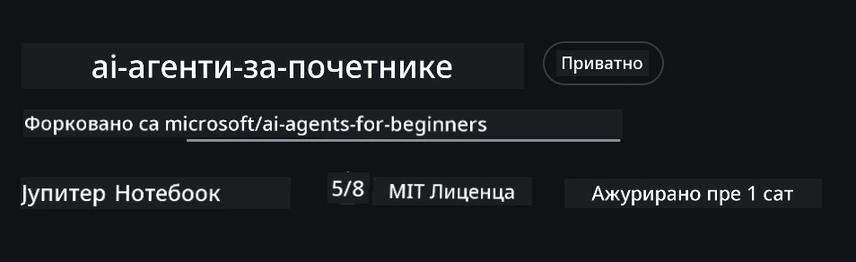
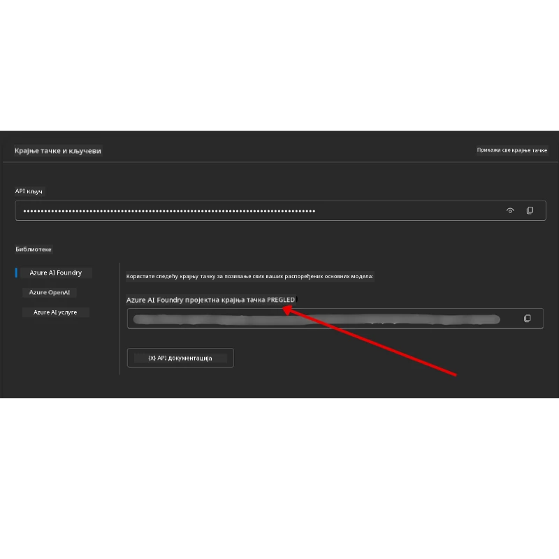

# Постављање курса

## Увод

Ова лекција ће обрадити како покренути примере кода овог курса.

## Придружите се другим ученицима и добијте помоћ

Пре него што почнете да клонирате ваш репозиторијум, прикључите се на [AI Agents For Beginners Discord канал](https://aka.ms/ai-agents/discord) за помоћ око подешавања, питања у вези курса, или да се повежете са другим ученицима.

## Клонирање или форковање овог репозиторијума

За почетак, молимо вас да клонирате или форкате GitHub репозиторијум. Ово ће направити вашу верзију материјала курса тако да можете покретати, тестирати и прилагођавати код!

Ово се може урадити кликом на линк <a href="https://github.com/microsoft/ai-agents-for-beginners/fork" target="_blank">fork the repo</a>

Сада би требало да имате вашу форковану верзију овог курса на следећем линку:



### Плитко клонирање (препоручено за радионицу / Codespaces)

  >Цео репозиторијум може бити велик (~3 GB) када преузмете комплетну историју и све фајлове. Ако идете само на радионицу или вам треба само неколико фолдера лекција, плитко клонирање (или делимично клонирање) избегава већину тог преузимања скраћујући историју и/или прескачући blobs.

#### Брзо плитко клонирање — минимална историја, сви фајлови

Замените `<your-username>` у следећим командама са URL-ом вашег форка (или са upstream URL-ом ако преферирате).

Да клонирате само најновију историју комита (мали download):

```bash|powershell
git clone --depth 1 https://github.com/<your-username>/ai-agents-for-beginners.git
```

Да клонирате специфичну грану:

```bash|powershell
git clone --depth 1 --branch <branch-name> https://github.com/<your-username>/ai-agents-for-beginners.git
```

#### Делимично (sparse) клонирање — минимални blobs + само одабрани фолдери

Ово користи делимично клонирање и sparse-checkout (захтева Git 2.25+ и препоручује се модерни Git са подршком за делимично клонирање):

```bash|powershell
git clone --depth 1 --filter=blob:none --sparse https://github.com/<your-username>/ai-agents-for-beginners.git
```

Уђите у фолдер репозиторијума:

```bash|powershell
cd ai-agents-for-beginners
```

Затим наведите које фолдере желите (пример испод показује два фолдера):

```bash|powershell
git sparse-checkout set 00-course-setup 01-intro-to-ai-agents
```

Након клонирања и провере фајлова, ако вам требају само фајлови и желите да ослободите простор (без git историје), избришите метаподатке репозиторијума (💀непоправљиво — изгубићете сву Git функционалност: нема комита, пула, пуша или приступа историји).

```bash
# zsh/bash
rm -rf .git
```

```powershell
# ПоверШелл
Remove-Item -Recurse -Force .git
```

#### Коришћење GitHub Codespaces (препоручено да избегнете велика локална преузимања)

- Направите нови Codespace за овај репозиторијум преко [GitHub UI](https://github.com/codespaces).  

- У терминалу новокреираног codespace-а, покрените једну од командa за плитко/делимично клонирање горе да бисте унели само потребне фолдере лекција у Codespace радна окружења.
- Опционо: након клонирања у Codespaces, уклоните .git да ослободите додатни простор (погледајте команде за уклањање горе).
- Напомена: ако више волите да отворите репо директно у Codespaces (без додатног клонирања), имајте у виду да ће Codespaces поставити devcontainer окружење и можда ће ипак бити подешено више него што вам треба. Клонирање плитке копије у свежем Codespace-у даје вам више контроле над коришћењем диска.

#### Савети

- Увек замените URL клонирања URL-ом вашег форка ако желите да уређујете/правите комите.
- Ако касније затребате више историје или фајлова, можете их дохватити или подесити sparse-checkout да укључи додатне фолдере.

## Покретање кода

Овај курс нуди серију Jupyter Notebooks које можете покретати да стекнете практично искуство у изградњи AI агената.

Примерци кода користе **Microsoft Agent Framework (MAF)** са `FoundryChatClient`, који се повезује на **Microsoft Foundry Agent Service V2** (Responses API) преко **Microsoft Foundry**.

Сви Python notebook-ови су означени као `*-python-agent-framework.ipynb`.

## Захтеви

- Python 3.12+
  - **НАПОМЕНА**: Ако немате инсталиран Python3.12, уверите се да га инсталирате. Затим креирајте ваш виртуелни енвиронмент (venv) користећи python3.12 како бисте осигурали исправне верзије из requirements.txt фајла.
  
    >Пример

    Креирајте Python venv директоријум:

    ```bash|powershell
    python -m venv venv
    ```

    Затим активирајте venv окружење за:

    ```bash
    # зш/баш
    source venv/bin/activate
    ```
  
    ```dos
    # Command Prompt for Windows
    venv\Scripts\activate
    ```

- .NET 10+: За пример кодове у .NET-у, уверите се да имате инсталиран [.NET 10 SDK](https://dotnet.microsoft.com/download/dotnet/10.0) или новији. Затим проверите верзију инсталираног .NET SDK-а:

    ```bash|powershell
    dotnet --list-sdks
    ```

- **Azure CLI** — Потребан за аутентификацију. Инсталирајте са [aka.ms/installazurecli](https://aka.ms/installazurecli).
- **Azure претплата** — За приступ Microsoft Foundry и Microsoft Foundry Agent Service-у.
- **Microsoft Foundry Пројекат** — Пројекат са распоређеним моделом (нпр., `gpt-4o`). Погледајте [Корак 1](#корак-1-креирање-microsoft-foundry-пројекта) испод.

Укључили смо `requirements.txt` фајл у корен овог репозиторијума који садржи све потребне Python пакете за покретање примера кода.

Можете их инсталирати покретањем следеће команде у вашем терминалу у корену репозиторијума:

```bash|powershell
pip install -r requirements.txt
```

Препоручујемо креирање Python виртуелног окружења да избегнете конфликте и проблеме.

## Постављање VSCode-а

Уверите се да користите исправну верзију Python-а у VSCode-у.


## Постављање Microsoft Foundry и Microsoft Foundry Agent Service-а

### Корак 1: Креирање Microsoft Foundry Пројекта

Потребан вам је Microsoft Foundry **hub** и **пројекат** са распоређеним моделом да бисте покренули notebook-ове.

1. Идите на [ai.azure.com](https://ai.azure.com) и пријавите се са вашим Azure налогом.
2. Креирајте **hub** (или користите постојећи). Погледајте: [Hub resources overview](https://learn.microsoft.com/azure/ai-foundry/concepts/ai-resources).
3. Унутар hub-а, направите **пројекат**.
4. Распоредите модел (нпр., `gpt-4o`) из **Models + Endpoints** → **Deploy model**.

### Корак 2: Преузмите ваш Endpoint пројекта и име распоређеног модела

Из вашег пројекта у Microsoft Foundry порталу:

- **Project Endpoint** — Идите на страницу **Overview** и копирајте URL endpoint-а.



- **Model Deployment Name** — Идите на **Models + Endpoints**, изаберите распоређени модел, и забележите **Deployment name** (нпр., `gpt-4o`).

### Корак 3: Пријавите се у Azure са `az login`

Сви notebook-ови користе **`AzureCliCredential`** за аутентификацију — нема потребе за управљањем API кључевима. Ово захтева да будете пријављени преко Azure CLI.

1. **Инсталирајте Azure CLI** ако га немате: [aka.ms/installazurecli](https://aka.ms/installazurecli)

2. **Пријавите се** покретањем:

    ```bash|powershell
    az login
    ```

    Или ако сте у удаљеном/Codespace окружењу без прегледача:

    ```bash|powershell
    az login --use-device-code
    ```

3. **Одаберите вашу претплату** ако вас то пита — изаберите ону која садржи ваш Foundry пројекат.

4. **Потврдите** да сте пријављени:

    ```bash|powershell
    az account show
    ```

> **Зашто `az login`?** Notebook-ови аутентификују користећи `AzureCliCredential` из `azure-identity` пакета. То значи да ваша Azure CLI сесија обезбеђује креденцијале — без API кључева или тајни у вашем `.env` фајлу. Ово је [безбедносна најбоља пракса](https://learn.microsoft.com/azure/developer/ai/keyless-connections).

### Корак 4: Креирајте ваш `.env` фајл

Копирајте пример фајла:

```bash
# зш/баш
cp .env.example .env
```

```powershell
# PowerShell
Copy-Item .env.example .env
```

Отворите `.env` и попуните ове две вредности:

```env
AZURE_AI_PROJECT_ENDPOINT=https://<your-project>.services.ai.azure.com/api/projects/<your-project-id>
AZURE_AI_MODEL_DEPLOYMENT_NAME=gpt-4o
```

| Варијабла | Где је пронаћи |
|----------|-----------------|
| `AZURE_AI_PROJECT_ENDPOINT` | Foundry портал → ваш пројекат → страница **Overview** |
| `AZURE_AI_MODEL_DEPLOYMENT_NAME` | Foundry портал → **Models + Endpoints** → име вашег распоређеног модела |

То је све за већину лекција! Notebook-ови ће се аутоматски аутентификовати преко ваше `az login` сесије.

### Корак 5: Инсталирање Python зависности

```bash|powershell
pip install -r requirements.txt
```

Препоручујемо да покренете ово унутар виртуелног окружења које сте раније креирали.

## Додатна подешавања за Лекцију 5 (Agentic RAG)

Лекција 5 користи **Azure AI Search** за retrieval-augmented генерацију. Ако планирате да покренете ту лекцију, додајте ове варијабле у ваш `.env` фајл:

| Варијабла | Где је пронаћи |
|----------|-----------------|
| `AZURE_SEARCH_SERVICE_ENDPOINT` | Azure портал → ваш **Azure AI Search** ресурс → **Overview** → URL |
| `AZURE_SEARCH_API_KEY` | Azure портал → ваш **Azure AI Search** ресурс → **Settings** → **Keys** → примарни администраторски кључ |

## Додатна подешавања за лекције које директно позивају Azure OpenAI (Лекције 6 и 8)

Неки notebook-ови из лекција 6 и 8 директно користе **Azure OpenAI** (користећи **Responses API**) уместо Microsoft Foundry пројекта. Ови примерци су раније користили GitHub Models, који је обустављен (пензионише се у јулу 2026) и не подржава Responses API. Ако планирате да покренете те примерке, додајте ове варијабле у ваш `.env` фајл:

| Варијабла | Где је пронаћи |
|----------|-----------------|
| `AZURE_OPENAI_ENDPOINT` | Azure портал → ваш **Azure OpenAI** ресурс → **Keys and Endpoint** → Endpoint (нпр., `https://<your-resource>.openai.azure.com`) |
| `AZURE_OPENAI_DEPLOYMENT` | Име вашег распоређеног модела (нпр., `gpt-4o-mini`) који подржава Responses API |
| `AZURE_OPENAI_API_KEY` | Опционо — само ако користите аутентификацију базирану на кључу уместо `az login` / Entra ID |

> Responses API користи стабилан `/openai/v1/` endpoint, тако да није потребна `api-version`. Пријавите се помоћу `az login` за коришћење аутентификације без кључа (Entra ID).

## Алтернативни провајдер: MiniMax (OpenAI-компатибилан)

[MiniMax](https://platform.minimaxi.com/) пружа моделе са великим контекстом (до 204К токена) преко OpenAI-компатибилног API-ја. Пошто Microsoft Agent Framework-ов `OpenAIChatClient` ради са било којим OpenAI-компатибилним endpoint-ом, можете користити MiniMax као алтернативу Azure OpenAI или OpenAI.

Додајте ове варијабле у ваш `.env` фајл:

| Варијабла | Где је пронаћи |
|----------|-----------------|
| `MINIMAX_API_KEY` | [MiniMax Platform](https://platform.minimaxi.com/) → API Keys |
| `MINIMAX_BASE_URL` | Користите `https://api.minimax.io/v1` (подразумевана вредност) |
| `MINIMAX_MODEL_ID` | Име модела за коришћење (нпр., `MiniMax-M3`) |

**Пример модела**: `MiniMax-M3` (препоручено), `MiniMax-M2.7`, `MiniMax-M2.7-highspeed` (бржи одговори). Имена модела и доступност могу се мењати током времена, а приступ одређеном моделу може зависити од вашег налога или региона — проверите [MiniMax Platform](https://platform.minimaxi.com/) за тренутну листу. Ако `MiniMax-M3` није доступан вашем налогу, подесите `MINIMAX_MODEL_ID` на модел који имате приступ (нпр. `MiniMax-M2.7`).

Примерци кода који користе `OpenAIChatClient` (нпр. Лекција 14 радни ток резервације хотела) ће аутоматски детектовати и користити вашу MiniMax конфигурацију када је `MINIMAX_API_KEY` подешен.

## Алтернативни провајдер: Foundry Local (покретање модела на уређају)

[Foundry Local](https://foundrylocal.ai) је лагано окружење које преузима, управља и сервира језичке моделе **исключиво на вашем рачунару** преко OpenAI-компатибилног API-ја — без облака, без Azure претплате и без API кључева. Одлична опција за офлајн развој, експериментисање без трошкова облака или чувaње података на уређају.

Пошто Microsoft Agent Framework-ов `OpenAIChatClient` ради са било којим OpenAI-компатибилним endpoint-ом, Foundry Local је једноставна локална алтернатива Azure OpenAI.

**1. Инсталирајте Foundry Local**

```bash
# Виндоус
winget install Microsoft.FoundryLocal

# мацОС
brew install foundrylocal
```

**2. Преузмите и покрените модел** (ово такође покреће локални сервис):

```bash
foundry model list          # види доступне моделе
foundry model run phi-4-mini
```

**3. Инсталирајте Python SDK** који се користи за проналажење локалног endpoint-а:

```bash
pip install foundry-local-sdk
```

**4. Покажите Microsoft Agent Framework на ваш локални модел:**

```python
from foundry_local import FoundryLocalManager
from agent_framework.openai import OpenAIChatClient

# Преузима (ако је потребно) и покреће модел локално, затим открива крајњу тачку/порт.
manager = FoundryLocalManager("phi-4-mini")

chat_client = OpenAIChatClient(
    base_url=manager.endpoint,      # нпр. http://localhost:<port>/v1
    api_key=manager.api_key,        # увек "није потребно" за Foundry Local
    model_id=manager.get_model_info("phi-4-mini").id,
)

agent = chat_client.as_agent(
    name="LocalAgent",
    instructions="You are a helpful assistant running fully on-device.",
)
```

> **Напомена:** Foundry Local излаже OpenAI-компатибилан **Chat Completions** endpoint. Користите га за локални развој и офлајн сценарије. За пуни скуп функција **Responses API** (држене конверзације, дубока оркестрација алата и развој у стилу агента), циљајте на **Azure OpenAI** или **Microsoft Foundry** пројекат као што је показано у лекцијама. Погледајте [Foundry Local документацију](https://foundrylocal.ai) за тренутни каталог модела и подршку платформе.

## Додатна подешавања за Лекцију 8 (Bing Grounding Workflow)


Зависна радна свеска из локације 8 користи **Bing основање** преко Microsoft Foundry. Ако планирате да покренете тај пример, додајте ову променљиву у ваш `.env` фајл:

| Променљива | Где је пронаћи |
|----------|-----------------|
| `BING_CONNECTION_ID` | Microsoft Foundry портал → ваш пројекат → **Management** → **Connected resources** → ваша Bing веза → копирајте connection ID |

## Решавање проблема

### Грешке приликом провере SSL сертификата на macOS

Ако користите macOS и наиђете на грешку као што је:

```plaintext
ssl.SSLCertVerificationError: [SSL: CERTIFICATE_VERIFY_FAILED] certificate verify failed: self-signed certificate in certificate chain
```

Ово је познат проблем са Python-ом на macOS где системски SSL сертификати нису аутоматски поуздани. Покушајте следећа решења по реду:

**Опција 1: Покрените Python-ов скрипт Install Certificates (препоручено)**

```bash
# Замените 3.XX са вашом инсталираном верзијом Питона (нпр. 3.12 или 3.13):
/Applications/Python\ 3.XX/Install\ Certificates.command
```

**Опција 2: Користите `connection_verify=False` у вашој радној свесци (само за GitHub Models радне свеске)**

У радној свесци из Лекције 6 (`06-building-trustworthy-agents/code_samples/06-system-message-framework.ipynb`), већ је укључен закоментарисани заобилазни рад. Оскоментаришите `connection_verify=False` приликом креирања клијента:

```python
client = ChatCompletionsClient(
    endpoint=endpoint,
    credential=AzureKeyCredential(token),
    connection_verify=False,  # Онемогућите проверу SSL-а ако наиђете на грешке у сертификату
)
```

> **⚠️ Упозорење:** Искључивање SSL верификације (`connection_verify=False`) смањује безбедност прескакањем валидације сертификата. Користите ово само као привремено решење у развојним окружењима, никада у продукцији.

**Опција 3: Инсталирајте и користите `truststore`**

```bash
pip install truststore
```

Затим додајте следеће на врх ваше радне свеске или скрипте пре позивања било каквих мрежних позива:

```python
import truststore
truststore.inject_into_ssl()
```

## Заглавили сте негде?

Ако имате било каквих проблема са покретањем ове конфигурације, придружите нам се на <a href="https://discord.gg/kzRShWzttr" target="_blank">Azure AI Community Discord</a> или <a href="https://github.com/microsoft/ai-agents-for-beginners/issues?WT.mc_id=academic-105485-koreyst" target="_blank">направите issue</a>.

## Следећа лекција

Сада сте спремни да покренете код за овај курс. Срећно учење више о свету AI Агената!

[Introduction to AI Agents and Agent Use Cases](../01-intro-to-ai-agents/README.md)

---

<!-- CO-OP TRANSLATOR DISCLAIMER START -->
**Изјава о одрицању одговорности**:
Овај документ је преведен коришћењем услуге за аутоматски превод [Co-op Translator](https://github.com/Azure/co-op-translator). Иако тежимо тачности, имајте у виду да аутоматски преводи могу садржати грешке или нетачности. Оригинални документ на његовом изворном језику треба сматрати ауторитативним извором. За критичне информације препоручује се професионални људски превод. Нисмо одговорни за било каква неспоразума или погрешна тумачења која произилазе из коришћења овог превода.
<!-- CO-OP TRANSLATOR DISCLAIMER END -->