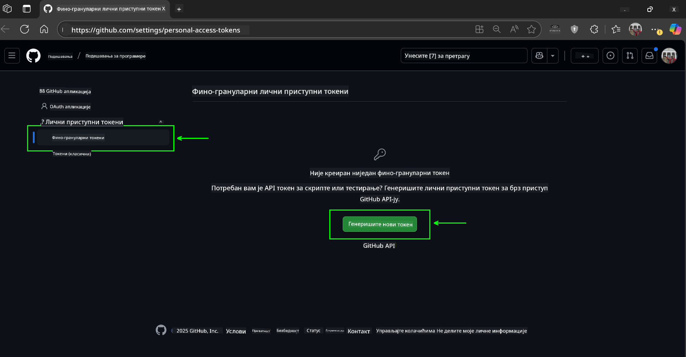
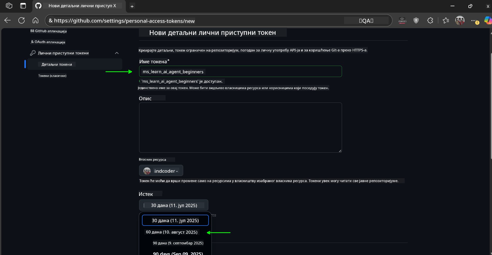
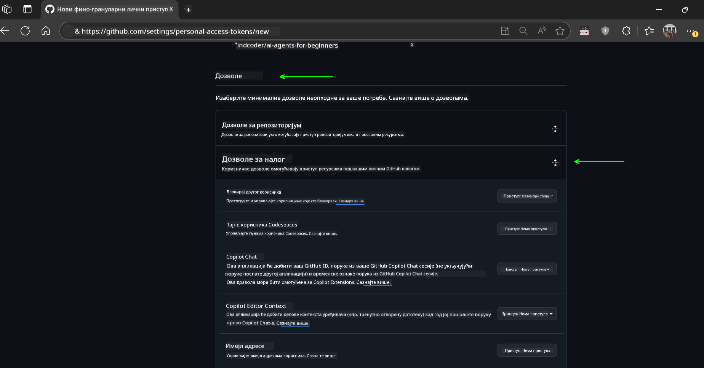
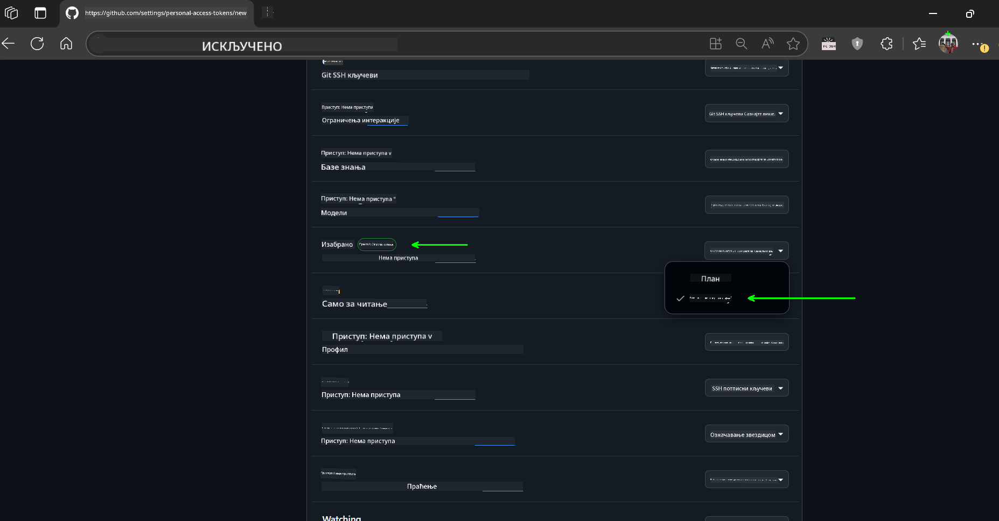
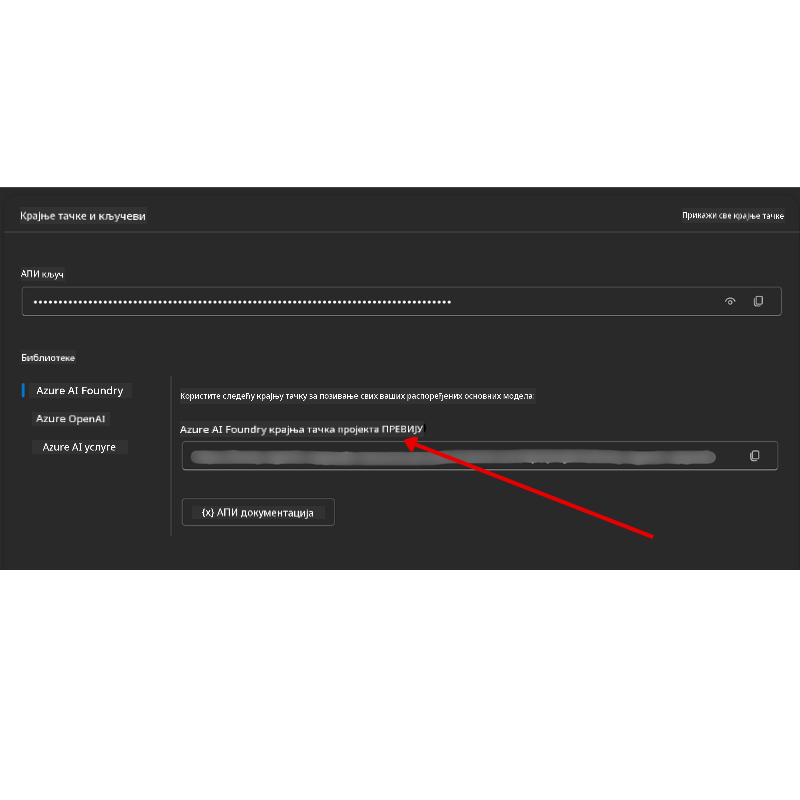

<!--
CO_OP_TRANSLATOR_METADATA:
{
  "original_hash": "c6a79c8f2b56a80370ff7e447765524f",
  "translation_date": "2025-07-24T09:07:02+00:00",
  "source_file": "00-course-setup/README.md",
  "language_code": "sr"
}
-->
# Подешавање курса

## Увод

Ова лекција ће обухватити како да покренете примере кода из овог курса.

## Клонирајте или форкујте овај репозиторијум

За почетак, клонирајте или форкујте GitHub репозиторијум. Ово ће направити вашу верзију материјала курса како бисте могли да покрећете, тестирате и прилагођавате код!

Ово можете урадити кликом на линк до

Требало би да сада имате своју форковану верзију овог курса на следећем линку:


## Покретање кода

Овај курс нуди серију Jupyter Notebook-ова које можете покренути како бисте стекли практично искуство у изградњи AI агената.

Примери кода користе:

**Потребан GitHub налог - бесплатно**:

1) Semantic Kernel Agent Framework + GitHub Models Marketplace. Ознака (semantic-kernel.ipynb)
2) AutoGen Framework + GitHub Models Marketplace. Ознака (autogen.ipynb)

**Потребна Azure претплата**:
3) Azure AI Foundry + Azure AI Agent Service. Ознака (azureaiagent.ipynb)

Препоручујемо вам да испробате све три врсте примера како бисте видели која вам најбоље одговара.

Опција коју изаберете одредиће које кораке за подешавање треба да следите у наставку:

## Захтеви

- Python 3.12+
  - **НАПОМЕНА**: Ако немате инсталиран Python 3.12, уверите се да сте га инсталирали. Затим креирајте свој venv користећи python3.12 како бисте осигурали да су исправне верзије инсталиране из датотеке requirements.txt.
- GitHub налог - за приступ GitHub Models Marketplace-у
- Azure претплата - за приступ Azure AI Foundry-у
- Azure AI Foundry налог - за приступ Azure AI Agent Service-у

У корену овог репозиторијума укључили смо датотеку `requirements.txt` која садржи све потребне Python пакете за покретање примера кода.

Можете их инсталирати покретањем следеће команде у вашем терминалу у корену репозиторијума:

```bash
pip install -r requirements.txt
```
Препоручујемо креирање Python виртуелног окружења како бисте избегли било какве конфликте и проблеме.

## Подешавање VSCode-а
Уверите се да користите исправну верзију Python-а у VSCode-у.


## Подешавање за примере који користе GitHub моделе 

### Корак 1: Преузмите свој GitHub Personal Access Token (PAT)

Овај курс користи GitHub Models Marketplace, који пружа бесплатан приступ великим језичким моделима (LLMs) које ћете користити за изградњу AI агената.

Да бисте користили GitHub моделе, потребно је да креирате [GitHub Personal Access Token](https://docs.github.com/en/authentication/keeping-your-account-and-data-secure/managing-your-personal-access-tokens).

Ово можете урадити тако што ћете отићи на свој

GitHub налог.

Молимо вас да следите [Принцип најмање привилегије](https://docs.github.com/en/get-started/learning-to-code/storing-your-secrets-safely) приликом креирања вашег токена. То значи да треба да дате токену само оне дозволе које су му потребне за покретање примера кода у овом курсу.

1. Изаберите опцију `Fine-grained tokens` на левој страни екрана.

    Затим изаберите `Generate new token`.

    

1. Унесите описно име за ваш токен које одражава његову сврху, како би га касније лако идентификовали. Поставите датум истека (препоручено: 30 дана; можете изабрати краћи период, као што је 7 дана, ако желите сигурнији приступ.)

    

1. Ограничите опсег токена на ваш форк овог репозиторијума.

    

1. Ограничите дозволе токена: Под **Permissions**, укључите **Account Permissions**, идите до **Models** и омогућите само потребан приступ за читање GitHub модела.

    

    

Копирајте свој нови токен који сте управо креирали. Сада ћете га додати у вашу `.env` датотеку укључену у овај курс.

### Корак 2: Креирајте своју `.env` датотеку

Да бисте креирали `.env` датотеку, покрените следећу команду у вашем терминалу.

```bash
cp .env.example .env
```

Ово ће копирати пример датотеке и креирати `.env` у вашем директоријуму где ћете попунити вредности за променљиве окружења.

Са копираним токеном, отворите `.env` датотеку у вашем омиљеном текст едитору и налепите ваш токен у поље `GITHUB_TOKEN`.

Сада би требало да можете да покренете примере кода из овог курса.

## Подешавање за примере који користе Azure AI Foundry и Azure AI Agent Service

### Корак 1: Преузмите свој Azure Project Endpoint

Пратите кораке за креирање хаба и пројекта у Azure AI Foundry-у који се налазе овде: [Hub resources overview](https://learn.microsoft.com/en-us/azure/ai-foundry/concepts/ai-resources)

Када креирате свој пројекат, потребно је да преузмете стринг за повезивање вашег пројекта.

Ово можете урадити тако што ћете отићи на страницу **Overview** вашег пројекта у Azure AI Foundry порталу.



### Корак 2: Креирајте своју `.env` датотеку

Да бисте креирали `.env` датотеку, покрените следећу команду у вашем терминалу.

```bash
cp .env.example .env
```

Ово ће копирати пример датотеке и креирати `.env` у вашем директоријуму где ћете попунити вредности за променљиве окружења.

Са копираним токеном, отворите `.env` датотеку у вашем омиљеном текст едитору и налепите ваш токен у поље `PROJECT_ENDPOINT`.

### Корак 3: Пријавите се на Azure

Као најбољу праксу за безбедност, користићемо [аутентификацију без кључа](https://learn.microsoft.com/azure/developer/ai/keyless-connections?tabs=csharp%2Cazure-cli?WT.mc_id=academic-105485-koreyst) за аутентификацију на Azure OpenAI са Microsoft Entra ID.

Затим, отворите терминал и покрените `az login --use-device-code` да се пријавите на ваш Azure налог.

Када се пријавите, изаберите своју претплату у терминалу.

## Додатне променљиве окружења - Azure Search и Azure OpenAI 

За лекцију Agentic RAG - Лекција 5 - постоје примери који користе Azure Search и Azure OpenAI.

Ако желите да покренете ове примере, потребно је да додате следеће променљиве окружења у вашу `.env` датотеку:

### Страница прегледа (Пројекат)

- `AZURE_SUBSCRIPTION_ID` - Проверите **Project details** на страници **Overview** вашег пројекта.

- `AZURE_AI_PROJECT_NAME` - Погледајте врх странице **Overview** вашег пројекта.

- `AZURE_OPENAI_SERVICE` - Пронађите ово у картици **Included capabilities** за **Azure OpenAI Service** на страници **Overview**.

### Центар за управљање

- `AZURE_OPENAI_RESOURCE_GROUP` - Идите на **Project properties** на страници **Overview** у **Management Center**.

- `GLOBAL_LLM_SERVICE` - Под **Connected resources**, пронађите име везе за **Azure AI Services**. Ако није наведено, проверите **Azure portal** у вашој групи ресурса за име ресурса AI Services.

### Страница модела + крајњих тачака

- `AZURE_OPENAI_EMBEDDING_DEPLOYMENT_NAME` - Изаберите свој модел за уграђивање (нпр. `text-embedding-ada-002`) и забележите **Deployment name** из детаља модела.

- `AZURE_OPENAI_CHAT_DEPLOYMENT_NAME` - Изаберите свој модел за ћаскање (нпр. `gpt-4o-mini`) и забележите **Deployment name** из детаља модела.

### Azure портал

- `AZURE_OPENAI_ENDPOINT` - Потражите **Azure AI services**, кликните на њега, затим идите на **Resource Management**, **Keys and Endpoint**, скролујте до "Azure OpenAI endpoints", и копирајте ону која каже "Language APIs".

- `AZURE_OPENAI_API_KEY` - Са истог екрана, копирајте KEY 1 или KEY 2.

- `AZURE_SEARCH_SERVICE_ENDPOINT` - Пронађите свој **Azure AI Search** ресурс, кликните на њега, и погледајте **Overview**.

- `AZURE_SEARCH_API_KEY` - Затим идите на **Settings** и затим **Keys** да копирате примарни или секундарни администраторски кључ.

### Спољна веб страница

- `AZURE_OPENAI_API_VERSION` - Посетите страницу [API version lifecycle](https://learn.microsoft.com/en-us/azure/ai-services/openai/api-version-deprecation#latest-ga-api-release) под **Latest GA API release**.

### Подешавање аутентификације без кључа

Уместо да хардкодирате своје акредитиве, користићемо везу без кључа са Azure OpenAI. Да бисмо то урадили, увешћемо `DefaultAzureCredential` и касније позвати функцију `DefaultAzureCredential` да добијемо акредитив.

```python
from azure.identity import DefaultAzureCredential, InteractiveBrowserCredential
```

## Заглављени негде?

Ако имате било каквих проблема са покретањем овог подешавања, придружите се нашем

или.

## Следећа лекција

Сада сте спремни да покренете код за овај курс. Срећно у учењу више о свету AI агената!

[Увод у AI агенте и њихове случајеве употребе](../01-intro-to-ai-agents/README.md)

**Одрицање од одговорности**:  
Овај документ је преведен коришћењем услуге за превођење помоћу вештачке интелигенције [Co-op Translator](https://github.com/Azure/co-op-translator). Иако тежимо тачности, молимо вас да имате у виду да аутоматски преводи могу садржати грешке или нетачности. Оригинални документ на свом изворном језику треба сматрати ауторитативним извором. За критичне информације препоручује се професионални превод од стране људи. Не сносимо одговорност за било каква неспоразумевања или погрешна тумачења која могу произаћи из коришћења овог превода.