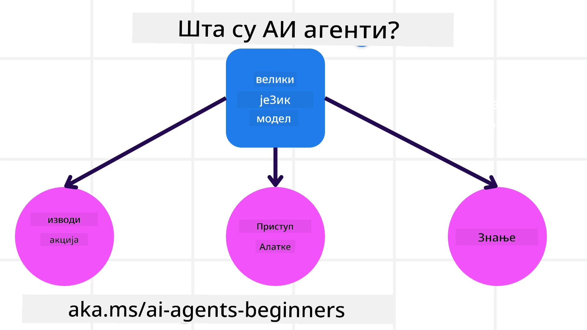
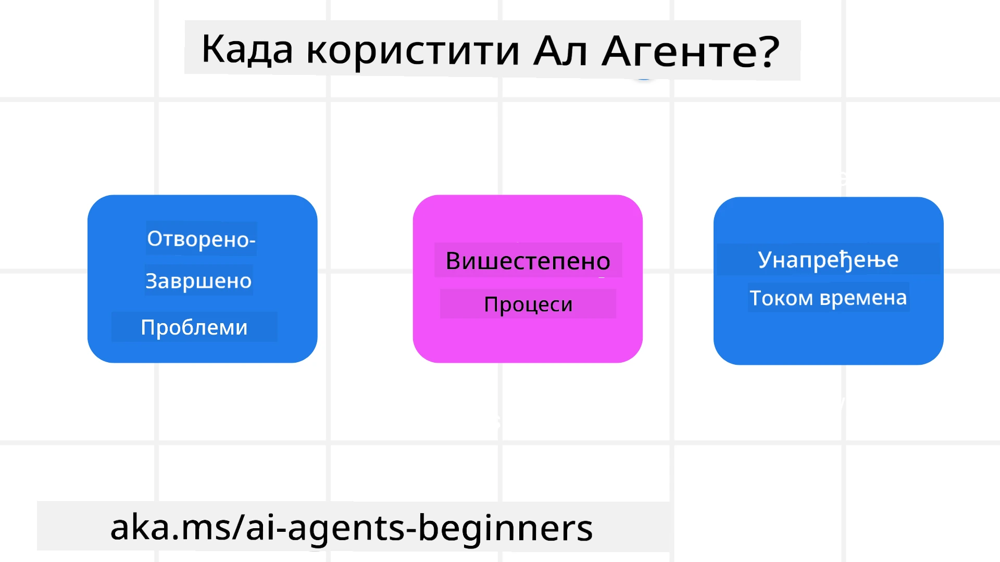

> _(Кликните на слику изнад да бисте погледали видео о овој лекцији)_

# Увод у AI агенте и случајеве употребе агената

Добродошли на курс "AI Agents for Beginners"! Овај курс пружа основна знања и примере примене за изградњу AI агената.

Придружите се <a href="https://discord.gg/kzRShWzttr" target="_blank">Azure AI Discord заједници</a> да упознате друге полазнике и градитеље AI агената и поставите питања у вези са овим курсом.

Да бисмо започели овај курс, почећемо бољим разумевањем шта су AI агенти и како их можемо користити у апликацијама и токовима рада које правимо.

## Увод

Ова лекција обухвата:

- Шта су AI агенти и који су различити типови агената?
- Који случајеви употребе су најпогоднији за AI агенте и како нам они могу помоћи?
- Који су неки од основних грађевних блокова при дизајнирању агентских решења?

## Циљеви учења
Након завршетка ове лекције, требало би да будете у стању да:

- Разумете концепте AI агената и како се разликују од других AI решења.
- Најефикасније примените AI агенте.
- Производно дизајнирате агентска решења за кориснике и клијенте.

## Дефинисање AI агената и типови AI агената

### Шта су AI агенти?

AI агенти су **системи** који омогућавају **велике језичке моделе (LLMs)** да **извршавају радње** проширујући своје могућности тако што LLM-овима дају **приступ алатима** и **знању**.

Разложимо ову дефиницију на мање делове:

- **System** - Важно је размишљати о агентима не као о једној компоненти већ као о систему састављеном од више компоненти. На базичном нивоу, компоненте AI агента су:
  - **Environment** - Дефинисани простор у коме AI агент делује. На пример, ако бисмо имали агента за резервацију путовања, окружење би могао бити систем за резервацију путовања који агент користи да заврши задатке.
  - **Sensors** - Окружења имају информације и пружају повратне информације. AI агенти користе сензоре да прикупе и тумаче те информације о тренутном стању окружења. У примеру агента за резервацију путовања, систем за резервацију може да пружи информације као што су доступност хотела или цене летова.
  - **Actuators** - Када AI агент прими тренутно стање окружења, за тренутни задатак агент одређује коју акцију да изврши како би променио окружење. За агента за резервацију путовања то може бити да резервише слободну собу за корисника.

**Велики језички модели (LLMs)** - Концепт агената постојао је и пре стварања LLM-ова. Предност изградње AI агената са LLM-овима јесте њихова способност да тумаче људски језик и податке. Ова способност омогућава LLM-овима да интерпретирају информације из окружења и дефинишу план за промену окружења.

**Извршавање радњи** - Изван система AI агената, LLM-ови су ограничени на ситуације у којима је радња генерисање садржаја или информација на основу упита корисника. Унутар система AI агената, LLM-ови могу да постигну задатке тумачењем корисничког захтева и коришћењем алата доступних у њиховом окружењу.

**Приступ алатима** - Којим алатима LLM има приступ дефинисано је 1) окружењем у коме делује и 2) програмером AI агента. У примеру нашег агента за путовања, алати агента ограничени су операцијама доступним у систему за резервацију, и/или програмер може ограничити приступ алата агента на летове.

**Меморија+Знање** - Меморија може бити краткорочна у контексту разговора између корисника и агента. Дугорочно, осим информација које пружа окружење, AI агенти такође могу да преузимају знање из других система, сервиса, алата и чак других агената. У примеру агента за путовања, ово знање може бити информација о корисничким преференцијама која се налази у бази података о клијентима.

### Различити типови агената

Сада када имамо општу дефиницију AI агената, погледајмо неке специфичне типове агената и како би се примењивали на агента за резервацију путовања.

| **Тип агента**                | **Опис**                                                                                                                             | **Пример**                                                                                                                                                                                                                   |
| ----------------------------- | ------------------------------------------------------------------------------------------------------------------------------------- | ----------------------------------------------------------------------------------------------------------------------------------------------------------------------------------------------------------------------------- |
| **Једноставни рефлексни агенти**      | Извршавају непосредне акције на основу унапред дефинисаних правила.                                                                                  | Агент за путовања тумачи контекст е-поште и прослеђује жалбе везане за путовања служби за кориснике.                                                                                                                          |
| **Рефлексни агенти засновани на моделу** | Извршавају акције на основу модела света и промена тог модела.                                                              | Агент за путовања даје приоритет рутама са значајним променама цена на основу приступа историјским подацима о ценама.                                                                                                             |
| **Агенти засновани на циљевима**         | Креирају планове за постизање одређених циљева тумачењем циља и одређивањем акција за његово постизање.                                  | Агент за путовања резервише путовање одређујући неопходне аранжмане (аутомобил, јавни превоз, летови) од тренутне локације до одредишта.                                                                                |
| **Агенти засновани на корисности**      | Разматрају преференције и бројчано вреднују компромисе како би одредили како постићи циљеве.                                               | Агент за путовања максимизира корисност вагом удобности у односу на цену приликом резервације путовања.                                                                                                                                          |
| **Учећи агенти**           | Побољшавају се током времена реагујући на повратне информације и прилагођавајући акције у складу с тим.                                                        | Агент за путовања побољшава рад користећи повратне информације корисника из анкета након путовања како би прилагодио будуће резервације.                                                                                                               |
| **Хијерархијски агенти**       | Карактеришу их више агената у слојевитом систему, при чему виши нивои разлажу задатке на потзадатке које нижи нивои извршавају. | Агент за путовања отказује путовање делећи задатак на потзадатке (на пример, отказивање појединачних резервација) и имајући нижестепене агенте да их доврше, извештавајући вишем агенту.                                     |
| **Системи више агената (MAS)** | Агенти довршавају задатке независно, било кооперативно или конкурентно.                                                           | Кооперативно: Више агената резервише специфичне услуге путовања као што су хотели, летови и забавни садржаји. Конкурентно: Више агената управља и такмичи се за заједнички календар резервација хотела како би смештали клијенте. |

## Када користити AI агенте

У претходном одељку користили смо пример агента за путовања да бисмо објаснили како се различити типови агената могу користити у различитим сценаријима резервације путовања. Наставићемо да користимо ову апликацију током целог курса.

Погледајмо типове случајева употребе за које су AI агенти најпогоднији:

- **Отворени проблеми** - омогућавају LLM-у да одреди потребне кораке за завршетак задатка јер то не може увек бити унапред дефинисано у току рада.
- **Вишестепени процеси** - задаци који захтевају ниво сложености у којем агент треба да користи алате или информације кроз више корака уместо једнократног преузимања.  
- **Побољшање током времена** - задаци у којима се агент може побољшавати временом примајући повратне информације из окружења или од корисника како би обезбедио већу корист.

У лекцији "Building Trustworthy AI Agents" покривамо више разматрања о коришћењу AI агената.

## Основе агентских решења

### Развој агента

Први корак у дизајнирању система AI агента је дефинисање алата, акција и понашања. На овом курсу се концентришемо на коришћење **Azure AI Agent Service** за дефинисање наших агената. Он нуди функције као што су:

- Избор отворених модела као што су OpenAI, Mistral и Llama
- Користење лиценцираних података преко провајдера као што је Tripadvisor
- Користење стандардизованих OpenAPI 3.0 алата

### Агентски обрасци

Комуникација са LLM-овима се врши преко упита (prompts). С обзиром на полуаутономну природу AI агената, није увек могуће или потребно ручно поново упитати LLM након промене у окружењу. Користимо **агентске обрасце** који нам омогућавају да упитамо LLM кроз више корака на скалабилнији начин.

Овај курс је подељен на неке од тренутно популарних агентских образаца.

### Агентски оквири

Агентски оквири омогућавају програмерима да имплементирају агентске обрасце кроз код. Ови оквири нуде шаблоне, додатке и алате за бољу сарадњу AI агената. Ове предности пружају могућности за бољу видљивост и отклањање грешака у системима AI агената.

На овом курсу истражићемо Microsoft Agent Framework (MAF) за изградњу агената спремних за производњу.

## Примери кода

- Python: [Агентски оквир](./code_samples/01-python-agent-framework.ipynb)
- .NET: [Агентски оквир](./code_samples/01-dotnet-agent-framework.md)

## Имате још питања о AI агентима?

Придружите се [Microsoft Foundry Discord](https://aka.ms/ai-agents/discord) да упознате друге учеснике, посетите канцеларијске сате и добијете одговоре на питања о вашим AI агентима.

## Претходна лекција

[Подешавање курса](../00-course-setup/README.md)

## Следећа лекција

[Истраживање агентских оквира](../02-explore-agentic-frameworks/README.md)

---

<!-- CO-OP TRANSLATOR DISCLAIMER START -->
Ограничење одговорности:
Овај документ је преведен помоћу AI сервиса за превођење [Co-op Translator](https://github.com/Azure/co-op-translator). Иако настојимо да преводи буду тачни, имајте у виду да аутоматски преводи могу да садрже грешке или нетачности. Оригинални документ на његовом изворном језику треба сматрати ауторитетним извором. За критичне информације препоручује се професионалан људски превод. Не сносимо одговорност за било какве неспоразуме или погрешна тумачења која произилазе из употребе овог превода.
<!-- CO-OP TRANSLATOR DISCLAIMER END -->