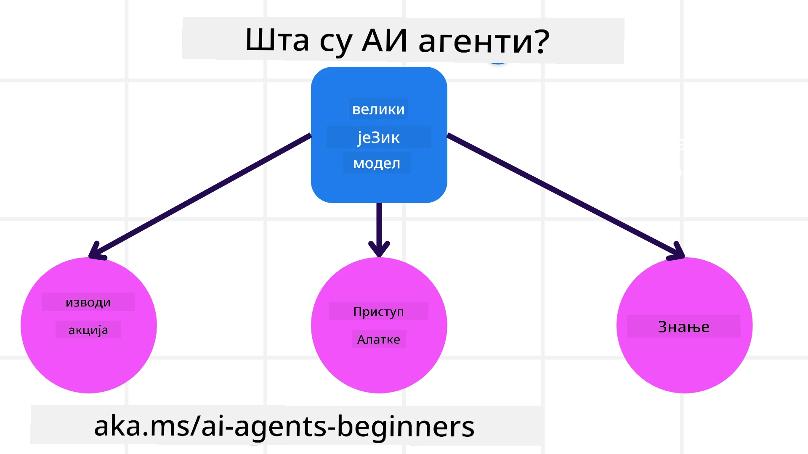
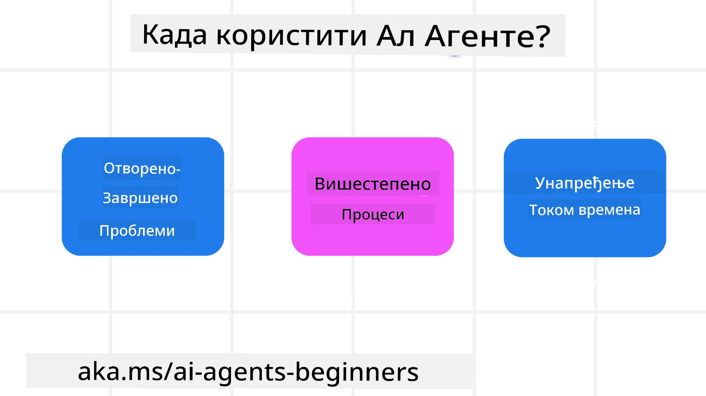

> _(Кликните на слику изнад да бисте погледали видео за ову лекцију)_

# Увод у AI агенте и употребне случајеве агената

Добро дошли у курс **AI агенти за почетнике**! Овај курс вам пружа основно знање — и прави радни код — да почнете да градите AI агенте од нуле.

Дођите да се поздравимо у <a href="https://discord.gg/kzRShWzttr" target="_blank">Azure AI Discord заједници</a> — пуна је ученика и градитеља AI-а који ће радо одговорити на питања.

Пре него што започнемо са прављењем, хајде да се уверимо да заиста разумемо шта је AI агент и када има смисла користити га.

---

## Увод

Ова лекција покрива:

- Шта су AI агенти и које различите врсте постоје
- Које врсте задатака су најпогодније за AI агенте
- Основне саставне јединице које ћете користити при дизајнирању агентског решења

## Циљеви учења

На крају ове лекције, требало би да будете у стању да:

- Објасните шта је AI агент и како се разликује од уобичајеног AI решења
- Знате када треба користити AI агента (а када не треба)
- Скицирате основни дизајн агентског решења за стварни проблем

---

## Дефинисање AI агената и врсте AI агената

### Шта су AI агенти?

Ево једноставан начин да размислите о томе:

> **AI агенти су системи који омогућавају Великим језичким моделима (LLM) да заправо *раде ствари* — тако што им пружају алате и знање да утичу на свет, а не само да одговарају на команде.**

Хајде да то мало разложимо:

- **Систем** — AI агент није само једна ствар. То је скуп делова који раде заједно. У сржи, сваки агент има три дела:
  - **Окружење** — Простор у коме агент ради. За агента за резервацију путовања, то би била сама платформа за резервацију.
  - **Сензори** — Како агент чита тренутно стање свог окружења. Наш агент за путовања може проверавати доступност хотела или цене летова.
  - **Извршиоци** — Како агент предузима радње. Путнички агент може резервисати собу, послати потврду или отказати резервацију.

- **Велики језички модели** — Агенти су постојали пре LLM-ова, али LLM-ови су оно што модерне агенте чини тако моћним. Они могу разумети природан језик, резоновати о контексту и претворити нејасан кориснички захтев у конкретан план деловања.

- **Извођење радњи** — Без агентног система, LLM само генерише текст. Унутар агентног система, LLM заправо може *извршити* кораке — претраживати базу података, позивати API, слаати поруке.

- **Приступ алатима** — Које алате агент може користити зависи од (1) окружења у коме ради и (2) шта му је програмер омогућио. Путнички агент може тражити летове али не и мењати записе купаца — све зависи од тога шта се све повеже.

- **Меморија + Знање** — Агенти могу имати краткорочну меморију (тренутни разговор) и дугорочну меморију (базу података о клијентима, претходне интеракције). Путнички агент може „сећати се“ да више волите седишта уз прозор.

---

### Различите врсте AI агената

Ни сви агенти нису изграђени на исти начин. Ево расподеле главних типова, користећи агента за резервацију путовања као пример:

| **Врста агента** | **Шта ради** | **Пример агента за путовања** |
|---|---|---|
| **Једноставни агенти рефлексије** | Прате унапред дефинисана правила — немају меморију, немају планирање. | Види жалбени емаил → прослеђује га служби за кориснике. То је све. |
| **Агенти рефлексије на бази модела** | Чувају унутрашњи модел света и ажурирају га како се ствари мењају. | Прати историјске цене летова и упозорава на руте које су изненада скупе. |
| **Агенти са циљем** | Имају за циљ и откривају како да га постигну корак по корак. | Резервисује цело путовање (летове, ауто, хотел) од ваше тренутне локације до одредишта. |
| **Агенти засновани на корисности** | Не проналазе само *решење* — проналазе *најбоље* тако што процењују компромисе. | Балансира трошкове и погодност да пронађе путовање које највише одговара вашим преференцијама. |
| **Агенти који уче** | Постају бољи током времена учењем из повратних информација. | Прилагођава будуће препоруке за резервације на основу анкета после путовања. |
| **Хијерархијски агенти** | Виши ниво агента распоређује посао у подзадатке и делегира нижим агентима. | Захтев за "отказивање путовања" се дели на: отказивање лета, хотела, изнајмљивања аута — сваки од њих обрађује под-агент. |
| **Вишегентски системи (MAS)** | Више независних агената који раде заједно (или се такмиче). | Кооперативни: посебни агенти се баве хотелима, летовима и забавом. Такмичарски: више агената се такмичи да попуне хотелске собе по најбољој цени. |

---

## Када користити AI агенте

Само зато што *можете* користити AI агента не значи да увек *треба*. Ево ситуација када агенти стварно сјаје:

- **Отворени проблеми** — Када кораке за решавање проблема није могуће унапред програмирати. Потребно је да LLM динамички открије пут.
- **Вишестепени процеси** — Задаци који захтевају коришћење алата кроз више корака, не само појединачно претраживање или генерисање.
- **Унапређење током времена** — Када желите да систем постане паметнији на основу корисничких повратних информација или показалаца из окружења.

Детаљније ћемо проучити када (и када *не*) користити AI агенте у лекцији **Прављење поузданих AI агената** касније у курсу.

---

## Основе агентских решења

### Развој агената

Прва ствар коју радите при грађењу агента је да дефинишете *шта он може да ради* — његове алате, акције и понашања.

У овом курсу користимо **Microsoft Foundry Agent Service** као нашу главну платформу. Подржава:

- Моделе од добављача као што су OpenAI, Mistral и Meta (Llama)
- Лиценциране податке од добављача као што је Tripadvisor
- Стандартизоване дефиниције алата у OpenAPI 3.0 формату

### Агентски обрасци

Комуницирате са LLM-овима кроз упите (prompt). Са агентима, не можете увек ручно правити сваки упит — агент мора да изврши акције у више корака. Ту долазе **агентски обрасци**. То су поново употребљиве стратегије за формирање и оркестрацију LLM-ова на скалабилнији и поузданији начин.

Овај курс је структуиран око најчешћих и најкориснијих агентских образаца.

### Агентског оквири

Агентски оквири пружају програмерима готове шаблоне, алате и инфраструктуру за прављење агената. Олакшавају:

- Повезивање алата и капацитета
- Праћење шта агент ради (и отклањање грешака када нешто пође по злу)
- Сарадњу између више агената

У овом курсу се фокусирамо на **Microsoft Agent Framework (MAF)** за израду агената спремних за производњу.

---

## Примери кода

Спремни да видите како то функционише? Ево примерa кода за ову лекцију:

- 🐍 Python: [Agent Framework](./code_samples/01-python-agent-framework.ipynb)
- 🔷 .NET: [Agent Framework](./code_samples/01-dotnet-agent-framework.md)

---

## Имате питања?

Придружите се [Microsoft Foundry Discord](https://discord.com/invite/ATgtXmAS5D) да се повежете са другим ученицима, присуствујете радним сатима и добијете одговоре на питања о AI агентима од заједнице.

---

## Претходна лекција

[Подешавање курса](../00-course-setup/README.md)

## Следећа лекција

[Истраживање агентских оквира](../02-explore-agentic-frameworks/README.md)

---

<!-- CO-OP TRANSLATOR DISCLAIMER START -->
**Изјава о одрицању одговорности**:
Овај документ је преведен коришћењем услуге за аутоматски превод [Co-op Translator](https://github.com/Azure/co-op-translator). Иако тежимо тачности, имајте у виду да аутоматски преводи могу садржати грешке или нетачности. Оригинални документ на његовом изворном језику треба сматрати ауторитативним извором. За критичне информације препоручује се професионални људски превод. Нисмо одговорни за било каква неспоразума или погрешна тумачења која произилазе из коришћења овог превода.
<!-- CO-OP TRANSLATOR DISCLAIMER END -->