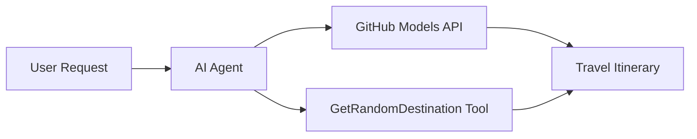

# 🌍 AI туристички агент са Microsoft Agent Framework (.NET)

## 📋 Преглед сценарија

Овај нотебук показује како да направите интелигентног агента за планирање путовања користећи Microsoft Agent Framework за .NET. Агенат може аутоматски да генерише персонализоване дневне итинераре за насумичне дестинације широм света.

**Кључне могућности:**
- 🎲 **Насумичан избор дестинације**: Користи прилагођени алат за одабир места за одмор
- 🗺️ **Интелигентно планирање путовања**: Креира детаљне дневне итинераре
- 🔄 **Стриминг у реалном времену**: Подржава одговоре у реалном времену и стриминг
- 🛠️ **Интеграција прилагођених алата**: Показује како проширити могућности агента

## 🔧 Техничка архитектура

### Основне технологије
- **Microsoft Agent Framework**: Најновија .NET имплементација за развој AI агената
- **Интеграција GitHub модела**: Користи GitHub-ову услугу за инференцију AI модела
- **Компатибилност са OpenAI API**: Ослања се на OpenAI клијентске библиотеке са прилагођеним ендпоинтима
- **Сигурна конфигурација**: Управљање API кључевима засновано на окружењу

### Кључне компоненте
1. **AIAgent**: Главни оркестратор агента који управља током разговора
2. **Прилагођени алати**: Функција `GetRandomDestination()` доступна агенту
3. **Chat Client**: Интерфејс за разговор подржан GitHub моделима
4. **Подршка за стриминг**: Могућност генерисања одговора у реалном времену

### Шема интеграције


## 🚀 Почетак рада

**Предуслови:**
- .NET 9.0 или новији
- Приступни токен за GitHub Models API
- Конфигурисане променљиве окружења у `.env` датотеци

**Потребне променљиве окружења:**
```env
GITHUB_TOKEN=your_github_token
GITHUB_ENDPOINT=https://models.inference.ai.azure.com
GITHUB_MODEL_ID=gpt-4o-mini
```

Покрените ћелије испод редом да бисте видели агента за путовања у акцији!

---

## .NET Single File App: AI Travel Agent Example

See `01-dotnet-agent-framework.cs` for the complete runnable code sample.

Покрените пример кода испод:

```bash
dotnet run 01-dotnet-agent-framework.cs
```

### Sample Code

```csharp
static string GetRandomDestination()
{
    var destinations = new List<string>
    {
        "Paris, France",
        "Tokyo, Japan",
        "New York City, USA",
        "Sydney, Australia",
        "Rome, Italy",
        "Barcelona, Spain",
        "Cape Town, South Africa",
        "Rio de Janeiro, Brazil",
        "Bangkok, Thailand",
        "Vancouver, Canada"
    };
    var random = new Random();
    int index = random.Next(destinations.Count);
    return destinations[index];
}

// Extract configuration from environment variables
var github_endpoint = Environment.GetEnvironmentVariable("GITHUB_ENDPOINT") ?? throw new InvalidOperationException("GITHUB_ENDPOINT is not set.");
var github_model_id = Environment.GetEnvironmentVariable("GITHUB_MODEL_ID") ?? "gpt-4o-mini";
var github_token = Environment.GetEnvironmentVariable("GITHUB_TOKEN") ?? throw new InvalidOperationException("GITHUB_TOKEN is not set.");

// Configure OpenAI Client Options
var openAIOptions = new OpenAIClientOptions()
{
    Endpoint = new Uri(github_endpoint)
};

// Initialize OpenAI Client with GitHub Models Configuration
var openAIClient = new OpenAIClient(new ApiKeyCredential(github_token), openAIOptions);

// Create AI Agent with Travel Planning Capabilities
AIAgent agent = openAIClient
    .GetChatClient(github_model_id)
    .CreateAIAgent(
        instructions: "You are a helpful AI Agent that can help plan vacations for customers at random destinations",
        tools: [AIFunctionFactory.Create(GetRandomDestination)]
    );

// Execute Agent: Plan a Day Trip (Non-Streaming)
Console.WriteLine(await agent.RunAsync("Plan me a day trip"));

// Execute Agent: Plan a Day Trip (Streaming Response)
await foreach (var update in agent.RunStreamingAsync("Plan me a day trip"))
{
    Console.Write(update);
}
```
