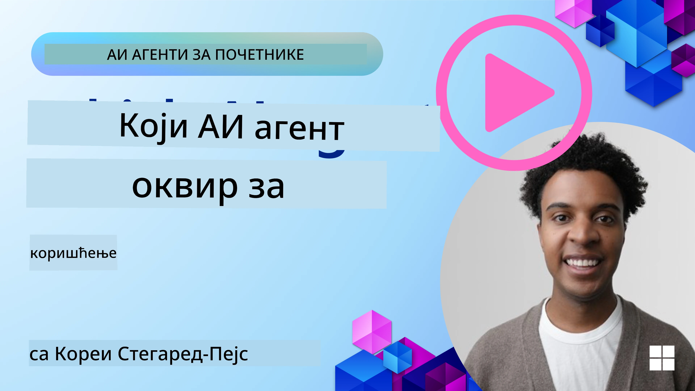

[](https://youtu.be/ODwF-EZo_O8?si=1xoy_B9RNQfrYdF7)

> _(Кликните на слику изнад да бисте гледали видео о овој лекцији)_

# Истражите оквире за AI агенте

AI оквири за агенте су софтверске платформе дизајниране да поједноставе креирање, развој и управљање AI агентима. Ови оквири пружају програмерима унапред изграђене компоненте, апстракције и алате који убрзавају развој сложених AI система.

Ови оквири помажу програмерима да се фокусирају на јединствене аспекте својих апликација пружајући стандардизоване приступе уобичајеним изазовима у развоју AI агената. Они унапређују скалабилност, доступност и ефикасност у изградњи AI система.

## Увод

Ова лекција ће обухватити:

- Шта су оквири за AI агенте и шта омогућавају програмерима да постигну?
- Како тимови могу да их користе да брзо праве прототипе, итерације и побољшавају могућности свог агента?
- Које су разлике између оквира и алата које је створио Microsoft (<a href="https://aka.ms/ai-agents-beginners/ai-agent-service" target="_blank">Azure AI Agent Service</a> и <a href="https://learn.microsoft.com/azure/ai-services/openai/how-to/responses" target="_blank">Microsoft Agent Framework</a>)?
- Могу ли да интегришем постојеће алате из Azure екосистема директно, или су ми потребна самостална решења?
- Шта је Azure AI Agents сервис и како ми ово помаже?

## Циљеви учења

Циљеви ове лекције су да вам помогну да разумете:

- Улогу оквира за AI агенте у развоју AI.
- Како искористити оквире за AI агенте за изградњу интелигентних агената.
- Кључне могућности које омогућавају оквири за AI агенте.
- Разлике између Microsoft Agent Framework и Azure AI Agent Service.

## Шта су оквири за AI агенте и шта омогућавају програмерима да ураде?

Традиционални AI оквири вам могу помоћи да интегришете AI у своје апликације и учините те апликације бољим на следеће начине:

- **Персонализација**: AI може анализирати понашање корисника и преференције како би пружио персонализоване препоруке, садржај и искуства.
Пример: Стриминг сервиси попут Netflix-а користе AI да предлажу филмове и серије на основу историје гледања, чиме повећавају ангажовање и задовољство корисника.
- **Аутоматизација и ефикасност**: AI може аутоматизовати понављајуће задатке, поједноставити токове рада и побољшати оперативну ефикасност.
Пример: Апликације за корисничку подршку користе ћаскање вођено AI-јем да обрађују уобичајене упите, смањују време одговора и ослобађају људске агенте за сложенија питања.
- **Побољшано корисничко искуство**: AI може побољшати укупно корисничко искуство пружањем интелигентних функција као што су препознавање гласа, обрада природног језика и предиктивни текст.
Пример: Виртуелни помоћници као Siri и Google Assistant користе AI да разумеју и одговарају на гласовне команде, олакшавајући корисницима интеракцију са уређајима.

### Све то звучи одлично, па зашто нам треба оквир за AI агенте?

Оквири за AI агенте представљају нешто више од самих AI оквира. Они су дизајнирани да омогуће креирање интелигентних агената који могу да интерагују са корисницима, другим агентима и окружењем како би постигли специфичне циљеве. Ови агенти могу показивати аутономно понашање, доносити одлуке и прилагођавати се променљивим условима. Погледајмо неке кључне могућности које омогућавају оквири за AI агенте:

- **Сарадња и координација агената**: Омогућавају креирање више AI агената који могу да раде заједно, комуницирају и координишу се како би решили сложене задатке.
- **Аутоматизација и управљање задацима**: Пружају механизме за аутоматизацију мулти-степених токова рада, делегирање задатака и динамичко управљање задацима међу агентима.
- **Контекстуално разумевање и прилагођавање**: Опремају агенте способношћу да разумеју контекст, прилагођавају се промењивим окружењима и доносе одлуке на основу информација у реалном времену.

Дакле, у закључку, агенти вам омогућавају да урадите више, да подигнете аутоматизацију на виши ниво и да креирате интелигентније системе који се могу прилагођавати и учити из свог окружења.

## Како брзо направити прототип, итерирати и побољшати могућности агента?

Ово је брзо промењиво поље, али постоје неке ствари које су заједничке већини оквира за AI агенте и које вам могу помоћи да брзо направите прототип и итерирате — наиме модуларне компоненте, колаборативни алати и учење у реалном времену. Хајде да погледамо ово:

- **Користите модуларне компоненте**: AI SDK-ови нуде унапред изграђене компоненте као што су AI и Memory конектори, позивање функција коришћењем природног језика или code plugins, шаблони за prompt-ове и још много тога.
- **Искористите колаборативне алате**: Дизајнирајте агенте са специфичним улогама и задацима, омогућавајући им да тестирају и усавршавају колаборативне токове рада.
- **Учење у реалном времену**: Имплементирајте повратне петље у којима агенти уче из интеракција и динамички прилагођавају своје понашање.

### Користите модуларне компоненте

SDK-ови попут Microsoft Agent Framework нуде унапред изграђене компоненте као што су AI конектори, дефиниције алата и управљање агенатима.

**Како тимови могу да их користе**: Тимови могу брзо саставити ове компоненте да би креирали функционални прототип без почетка од нуле, што омогућава брзо експериментисање и итерацију.

**Како то функционише у пракси**: Можете користити унапред изграђен parser да извучете информације из корисничког уноса, модул меморије за чување и преузимање података и генератор prompt-ова за интеракцију са корисницима, све то без потребе да градите те компоненте од нуле.

**Пример кода**. Погледајмо пример како можете користити Microsoft Agent Framework са `AzureAIProjectAgentProvider` да модел одговара на кориснички унос позивањем алата:

``` python
# Пример Microsoft Agent Framework-а у Питону

import asyncio
import os
from typing import Annotated

from agent_framework.azure import AzureAIProjectAgentProvider
from azure.identity import AzureCliCredential


# Дефинишите пример функције алата за резервацију путовања
def book_flight(date: str, location: str) -> str:
    """Book travel given location and date."""
    return f"Travel was booked to {location} on {date}"


async def main():
    provider = AzureAIProjectAgentProvider(credential=AzureCliCredential())
    agent = await provider.create_agent(
        name="travel_agent",
        instructions="Help the user book travel. Use the book_flight tool when ready.",
        tools=[book_flight],
    )

    response = await agent.run("I'd like to go to New York on January 1, 2025")
    print(response)
    # Пример излаза: Ваш лет за Њујорк 1. јануара 2025. успешно је резервисан. Срећан пут! ✈️🗽


if __name__ == "__main__":
    asyncio.run(main())
```

Оно што можете видети из овог примера је како можете искористити унапред изграђен parser да извучете кључне информације из корисничког уноса, као што су исходиште, одредиште и датум за захтев за резервацију лета. Ова модуларна метода вам омогућава да се фокусирате на логичку спољну страну.

### Искористите колаборативне алате

Оквири попут Microsoft Agent Framework олакшавају креирање више агената који могу да раде заједно.

**Како тимови могу да их користе**: Тимови могу да дизајнирају агенте са специфичним улогама и задацима, омогућавајући им да тестирају и усавршавају колаборативне токове рада и побољшају укупну ефикасност система.

**Како то функционише у пракси**: Можете креирати тим агената у којем сваки агент има специјализовану функцију, као што су преузимање података, анализа или доношење одлука. Ови агенти могу да комуницирају и деле информације како би постигли заједнички циљ, као што је одговор на кориснички упит или завршетак задатка.

**Пример кода (Microsoft Agent Framework)**:

```python
# Креирање више агената који раде заједно користећи Microsoft Agent Framework

import os
from agent_framework.azure import AzureAIProjectAgentProvider
from azure.identity import AzureCliCredential

provider = AzureAIProjectAgentProvider(credential=AzureCliCredential())

# Агент за преузимање података
agent_retrieve = await provider.create_agent(
    name="dataretrieval",
    instructions="Retrieve relevant data using available tools.",
    tools=[retrieve_tool],
)

# Агент за анализу података
agent_analyze = await provider.create_agent(
    name="dataanalysis",
    instructions="Analyze the retrieved data and provide insights.",
    tools=[analyze_tool],
)

# Покрени агенте узастопно на задатку
retrieval_result = await agent_retrieve.run("Retrieve sales data for Q4")
analysis_result = await agent_analyze.run(f"Analyze this data: {retrieval_result}")
print(analysis_result)
```

Оно што видите у претходном коду је како можете креирати задатак који подразумева више агената који раде заједно на анализи података. Сваки агент обавља одређену функцију, а задатак се извршава координацијом агената како би се постигла жељена целина. Креирањем посвећених агената са специјализованим улогама можете побољшати ефикасност и перформансе задатка.

### Учење у реалном времену

Напредни оквири обезбеђују могућности за разумевање контекста и прилагодљивост у реалном времену.

**Како тимови могу да их користе**: Тимови могу имплементирати повратне петље у којима агенти уче из интеракција и динамички прилагођавају своје понашање, што води ка континуираном побољшању и усавршавању могућности.

**Како то функционише у пракси**: Агенти могу анализирати повратне информације корисника, податке из окружења и резултате задатака како би ажурирали своју базу знања, прилагодили алгоритме доношења одлука и временом побољшали перформансе. Ова итеративна метода учења омогућава агентима да се прилагоде променљивим условима и преференцијама корисника, унапређујући укупну ефикасност система.

## Које су разлике између Microsoft Agent Framework и Azure AI Agent Service?

Постоји много начина да се упореде ови приступи, али погледајмо неке кључне разлике у смислу дизајна, могућности и циљних случајева употребе:

## Microsoft Agent Framework (MAF)

Microsoft Agent Framework пружа поједностављени SDK за изградњу AI агената користећи `AzureAIProjectAgentProvider`. Омогућава програмерима да креирају агенте који користе Azure OpenAI моделе са уграђеним позивом алата, управљањем разговорима и безбедношћу на нивоу предузећа кроз Azure идентитет.

**Употребни случајеви**: Изградња AI агената спремних за производњу са коришћењем алата, вишестепеним токовима рада и сценаријима интеграције у предузеће.

Ево неколико важних основних појмова Microsoft Agent Framework-а:

- **Агенти**. Агент се креира преко `AzureAIProjectAgentProvider` и конфигурише са именом, инструкцијама и алатима. Агент може:
  - **Обрађивати поруке корисника** и генерисати одговоре користећи Azure OpenAI моделе.
  - **Аутоматски позивати алате** на основу контекста разговора.
  - **Одржавати стање разговора** кроз више интеракција.

  Ево исечка кода који показује како се креира агент:

    ```python
    import os
    from agent_framework.azure import AzureAIProjectAgentProvider
    from azure.identity import AzureCliCredential

    provider = AzureAIProjectAgentProvider(credential=AzureCliCredential())
    agent = await provider.create_agent(
        name="my_agent",
        instructions="You are a helpful assistant.",
    )

    response = await agent.run("Hello, World!")
    print(response)
    ```

- **Алате**. Оквир подржава дефинисање алата као Python функција које агент може автоматски да позове. Алате се региструју приликом креирања агента:

    ```python
    def get_weather(location: str) -> str:
        """Get the current weather for a location."""
        return f"The weather in {location} is sunny, 72\u00b0F."

    agent = await provider.create_agent(
        name="weather_agent",
        instructions="Help users check the weather.",
        tools=[get_weather],
    )
    ```

- **Координација више агената**. Можете креирати више агената са различитим специјализацијама и координисати њихов рад:

    ```python
    planner = await provider.create_agent(
        name="planner",
        instructions="Break down complex tasks into steps.",
    )

    executor = await provider.create_agent(
        name="executor",
        instructions="Execute the planned steps using available tools.",
        tools=[execute_tool],
    )

    plan = await planner.run("Plan a trip to Paris")
    result = await executor.run(f"Execute this plan: {plan}")
    ```

- **Интеграција Azure идентитета**. Оквир користи `AzureCliCredential` (или `DefaultAzureCredential`) за сигурну, без-ключну аутентификацију, елиминишући потребу за директним управљањем API кључевима.

## Azure AI Agent Service

Azure AI Agent Service је новији додатак, представљен на Microsoft Ignite 2024. Омогућава развој и распоређивање AI агената са флексибилнијим моделима, као што је директно позивање open-source LLM-ова као што су Llama 3, Mistral и Cohere.

Azure AI Agent Service пружа јаче механизме безбедности за предузећа и методе чувања података, што га чини погодним за ентерпрајз апликације.

Функционише одмах заједно са Microsoft Agent Framework-ом за изградњу и распоређивање агената.

Овај сервис је тренутно у Public Preview и подржава Python и C# за изградњу агената.

Користећи Azure AI Agent Service Python SDK, можемо креирати агента са алатом дефинисаним од стране корисника:

```python
import asyncio
from azure.identity import DefaultAzureCredential
from azure.ai.projects import AIProjectClient

# Дефинишите функције алата
def get_specials() -> str:
    """Provides a list of specials from the menu."""
    return """
    Special Soup: Clam Chowder
    Special Salad: Cobb Salad
    Special Drink: Chai Tea
    """

def get_item_price(menu_item: str) -> str:
    """Provides the price of the requested menu item."""
    return "$9.99"


async def main() -> None:
    credential = DefaultAzureCredential()
    project_client = AIProjectClient.from_connection_string(
        credential=credential,
        conn_str="your-connection-string",
    )

    agent = project_client.agents.create_agent(
        model="gpt-4o-mini",
        name="Host",
        instructions="Answer questions about the menu.",
        tools=[get_specials, get_item_price],
    )

    thread = project_client.agents.create_thread()

    user_inputs = [
        "Hello",
        "What is the special soup?",
        "How much does that cost?",
        "Thank you",
    ]

    for user_input in user_inputs:
        print(f"# User: '{user_input}'")
        message = project_client.agents.create_message(
            thread_id=thread.id,
            role="user",
            content=user_input,
        )
        run = project_client.agents.create_and_process_run(
            thread_id=thread.id, agent_id=agent.id
        )
        messages = project_client.agents.list_messages(thread_id=thread.id)
        print(f"# Agent: {messages.data[0].content[0].text.value}")


if __name__ == "__main__":
    asyncio.run(main())
```

### Основни појмови

Azure AI Agent Service има следеће основне појмове:

- **Агент**. Azure AI Agent Service се интегрише са Microsoft Foundry-ом. Унутар AI Foundry-а, AI агент делује као „паметна“ микросервисна јединица која се може користити за одговарање на питања (RAG), извођење акција или потпуну аутоматизацију токова рада. Ово постиже комбинујући снагу генерисућих AI модела са алатима који му омогућавају приступ и интеракцију са изворима података из стварног света. Ево примера агента:

    ```python
    agent = project_client.agents.create_agent(
        model="gpt-4o-mini",
        name="my-agent",
        instructions="You are helpful agent",
        tools=code_interpreter.definitions,
        tool_resources=code_interpreter.resources,
    )
    ```

    У овом примеру, агент је креиран са моделом `gpt-4o-mini`, именом `my-agent` и инструкцијама `You are helpful agent`. Агент је опремљен алатима и ресурсима за обављање задатака тумачења кода.

- **Thread и поруке**. Thread је још један важан појам. Он представља разговор или интеракцију између агента и корисника. Thread-ови се могу користити за праћење напретка разговора, чување контекстуалних информација и управљање стањем интеракције. Ево примера нити:

    ```python
    thread = project_client.agents.create_thread()
    message = project_client.agents.create_message(
        thread_id=thread.id,
        role="user",
        content="Could you please create a bar chart for the operating profit using the following data and provide the file to me? Company A: $1.2 million, Company B: $2.5 million, Company C: $3.0 million, Company D: $1.8 million",
    )
    
    # Ask the agent to perform work on the thread
    run = project_client.agents.create_and_process_run(thread_id=thread.id, agent_id=agent.id)
    
    # Fetch and log all messages to see the agent's response
    messages = project_client.agents.list_messages(thread_id=thread.id)
    print(f"Messages: {messages}")
    ```

    У претходном коду, нити је креирана. Након тога, порука се шаље у нит. Позивањем `create_and_process_run`, агент је замољен да обави посао у нити. На крају, поруке се дохватају и бележе да би се видео агентов одговор. Поруке указују на напредак разговора између корисника и агента. Такође је важно разумети да поруке могу бити различитих типова као што су текст, слика или датотека, то јест да је рад агената резултирао на пример сликом или текстуалним одговором. Као програмер, онда можете користити ове информације да даље обрадите одговор или га представите кориснику.

- **Интегрише се са Microsoft Agent Framework-ом**. Azure AI Agent Service ради беспрекорно са Microsoft Agent Framework-ом, што значи да можете градити агенте користећи `AzureAIProjectAgentProvider` и распоређивати их преко Agent Service за сценарије производње.

**Употребни случајеви**: Azure AI Agent Service је дизајниран за ентерпрајз апликације које захтевају сигурно, скалабилно и флексибилно распоређивање AI агената.

## Која је разлика између ових приступа?
 
Чини се да постоји преклапање, али постоје неке кључне разлике у смислу дизајна, могућности и циљних случајева употребе:
 
- **Microsoft Agent Framework (MAF)**: Је SDK спреман за производњу за изградњу AI агената. Пружа поједностављен API за креирање агената са позивом алата, управљањем разговором и интеграцијом Azure идентитета.
- **Azure AI Agent Service**: Је платформа и сервис за распоређивање у Azure Foundry за агенте. Нуди уграђену повезаност са сервисима као што су Azure OpenAI, Azure AI Search, Bing Search и извођење кода.
 
Ипак нисте сигурни који да одаберете?

### Употребни сценарији
 
Хајде да видимо да ли вам можемо помоћи пролазећи кроз неке уобичајене употребне случајеве:
 
> P: Правим продукционе апликације за AI агенте и желим да брзо започнем
>

>O: Microsoft Agent Framework је одличан избор. Пружа једноставан, Python-ски API преко `AzureAIProjectAgentProvider` који вам омогућава да дефинишете агенте са алатима и инструкцијама у само неколико редова кода.

>P: Потребна ми је ентерпрајз групна расподела са Azure интеграцијама као што су Search и извођење кода
>
> O: Azure AI Agent Service је најпогоднији избор. То је платформа која пружа уграђене могућности за више модела, Azure AI Search, Bing Search и Azure Functions. Олакшава вам изградњу агената у Foundry порталу и њихово распоређивање у скали.
 
> P: Још увек сам збуњен, само ми дајте једну опцију
>
> O: Почните са Microsoft Agent Framework-ом да изградите своје агенте, а затим користите Azure AI Agent Service када треба да их распоредите и скалирате у производњи. Овај приступ вам омогућава брзо итерирање логике вашег агента уз јасан пут ка ентерпрајз распоређивању.
 
Хајде да сумирамо кључне разлике у табели:

| Framework | Focus | Core Concepts | Use Cases |
| --- | --- | --- | --- |
| Microsoft Agent Framework | Поједностављени SDK за агенте са позивом алата | Агенти, Алате, Azure идентитет | Изградња AI агената, употреба алата, вишестепени радни токови |
| Azure AI Agent Service | Флексибилни модели, ентерпрајз безбедност, генерисање кода, позив алата | Модуларност, Сарадња, Оркестрација процеса | Безбедно, скалабилно и флексибилно распоређивање AI агената |

## Могу ли да интегришем постојеће алате из Azure екосистема директно, или су ми потребна самостална решења?
Одговор је да — можете директно интегрисати своје постојеће алате у Azure екосистему са Azure AI Agent Service-ом, посебно зато што је он изграђен да беспрекорно ради са осталим Azure услугама. На пример, можете интегрисати Bing, Azure AI Search и Azure Functions. Постоји и дубока интеграција са Microsoft Foundry.

Microsoft Agent Framework се такође интегрише са Azure услугама преко `AzureAIProjectAgentProvider` и Azure identity, омогућавајући вам да позивате Azure услуге директно из ваших алата агента.

## Примери кода

- Python: [Agent Framework](./code_samples/02-python-agent-framework.ipynb)
- .NET: [Agent Framework](./code_samples/02-dotnet-agent-framework.md)

## Имате још питања о оквирима за AI агенте?

Придружите се [Microsoft Foundry Discord](https://aka.ms/ai-agents/discord) да упознате друге полазнике, присуствујете консултативним сатима и добијете одговоре на питања о вашим AI агентима.

## Референце

- <a href="https://techcommunity.microsoft.com/blog/azure-ai-services-blog/introducing-azure-ai-agent-service/4298357" target="_blank">Azure Agent Service</a>
- <a href="https://learn.microsoft.com/azure/ai-services/openai/how-to/responses" target="_blank">Microsoft Agent Framework - Azure OpenAI Responses</a>
- <a href="https://learn.microsoft.com/azure/ai-services/agents/overview" target="_blank">Azure AI Agent service</a>

## Претходна лекција

[Увод у AI агенте и случајеве употребе](../01-intro-to-ai-agents/README.md)

## Следећа лекција

[Разумевање образаца дизајна за агенте](../03-agentic-design-patterns/README.md)

---

<!-- CO-OP TRANSLATOR DISCLAIMER START -->
Одрицање одговорности:
Овај документ је преведен помоћу услуге за превођење засноване на вештачкој интелигенцији [Co-op Translator](https://github.com/Azure/co-op-translator). Иако настојимо да обезбедимо тачност, имајте у виду да аутоматски преводи могу садржати грешке или нетачности. Оригинални документ на његовом изворном језику треба сматрати званичним извором. За критичне информације препоручује се превод од стране професионалног преводиоца. Не сносимо одговорност за било каква неспоразума или погрешна тумачења која произилазе из употребе овог превода.
<!-- CO-OP TRANSLATOR DISCLAIMER END -->