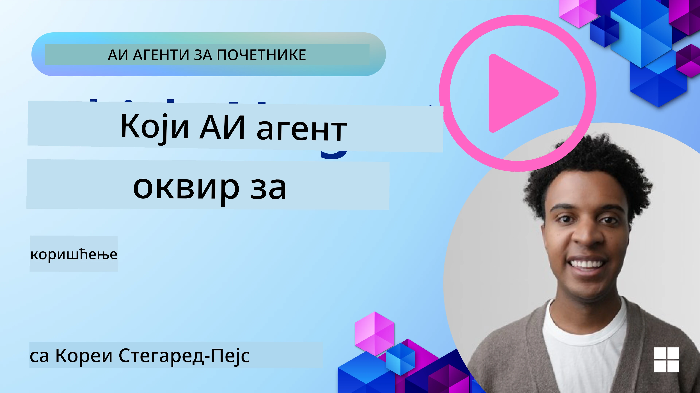

[](https://youtu.be/ODwF-EZo_O8?si=1xoy_B9RNQfrYdF7)

> _(Кликните на слику изнад да бисте гледали видео о овом часу)_

# Истражите оквире за AI агенте

Оквири за AI агенте су софтверске платформе дизајниране да поједноставе креирање, имплементацију и управљање AI агентима. Ови оквири пружају програмерима унапред израђене компоненте, абстракције и алате који поједностављују развој сложених AI система.

Ови оквири помажу програмерима да се фокусирају на јединствене аспекте својих апликација пружајући стандардизоване приступе за уобичајене изазове у развоју AI агената. Побољшавају скалабилност, приступачност и ефикасност у изградњи AI система.

## Увод

Овај час ће покрити:

- Шта су оквири за AI агенте и шта програмерима омогућавају да остваре?
- Како тимови могу користити ове оквире да брзо направе прототип, итерацију и побољшају способност свог агента?
- Које су разлике између оквира и алата које је креирао Microsoft (<a href="https://aka.ms/ai-agents-beginners/ai-agent-service" target="_blank">Azure AI Agent Service</a> и <a href="https://learn.microsoft.com/azure/ai-services/openai/how-to/responses" target="_blank">Microsoft Agent Framework</a>)?
- Могу ли директно интегрисати своје постојеће Azure алате или ми требају самостална решења?
- Шта је Azure AI Agents сервис и како ми помаже?

## Циљеви учења

Циљеви овог часа су да вам помогну да разумете:

- Улогу оквира за AI агенте у развоју AI.
- Како искористити оквире за AI агенте за изградњу интелигентних агената.
- Кључне могућности које нуде оквири за AI агенте.
- Разлике између Microsoft Agent Framework-а и Azure AI Agent Service-а.

## Шта су оквири за AI агенте и шта програмерима омогућавају?

Традиционални AI оквири могу вам помоћи да интегришете AI у своје апликације и унапредите их на следеће начине:

- **Персонализација**: AI може анализирати понашање и преференције корисника да пружи персонализоване препоруке, садржаје и искуства.
Пример: Стриминг сервис као што је Netflix користи AI да предлажe филмове и серије на основу историје гледања, повећавајући ангажовање и задовољство корисника.
- **Аутоматизација и ефикасност**: AI може аутоматизовати понављајуће задатке, убрзати радне токове и побољшати оперативну ефикасност.
Пример: Апликације за корисничку подршку користе чатботове покретане AI-ом да решавају честе упите, смањују време одговора и ослобађају људске агенте за сложеније проблеме.
- **Побољшано корисничко искуство**: AI може побољшати укупно корисничко искуство пружајући интелигентне функције као што су препознавање гласа, обрада природног језика и предиктивни текст.
Пример: Виртуални асистенти као што су Siri и Google Assistant користе AI да разумеју и одговарају на гласовне команде, олакшавајући корисницима интеракцију са уређајима.

### Све то звучи одлично, али зашто нам онда треба оквир за AI агенте?

Оквири за AI агенте представљају нешто више од само AI оквира. Они су дизајнирани да омогуће креирање интелигентних агената који могу да комуницирају са корисницима, другим агентима и окружењем ради остварења специфичних циљева. Ови агенти могу показивати аутономно понашање, доносити одлуке и прилагођавати се променљивим условима. Погледајмо неке кључне могућности које омогућавају оквири за AI агенте:

- **Сарадња и координација агената**: Омогућавају стварање више AI агената који могу радити заједно, комуницирати и координирати се да реше сложене задатке.
- **Аутоматизација и управљање задацима**: Пружају механизме за аутоматизацију вишестепених радних токова, делегирање и динамично управљање задацима међу агентима.
- **Контекстуално разумевање и прилагођавање**: Опремају агенте способношћу разумевања контекста, прилагођавања променљивом окружењу и доношења одлука на основу информација у реалном времену.

Дакле, укратко, агенти вам омогућавају више функција, подижу аутоматизацију на виши ниво и стварају интелигентније системе који се могу прилагодити и учити из окружења.

## Како брзо направити прототип, итерацију и побољшати могућности агента?

Ово је брзо развијајуће поље, али постоје неке ствари које су заједничке већини оквира за AI агенте и могу вам помоћи да брзо направите прототип и итерацију, а то су модуларне компоненте, колаборативни алати и учење у реалном времену. Хајде да их детаљније размотримо:

- **Користите модуларне компоненте**: AI SDK-ови нуде унапред израђене компоненте као што су AI и меморијски конектори, позив функција користећи природни језик или додатке засноване на коду, шаблоне упита и друго.
- **Искоришћавајте колаборативне алате**: Дизајнирајте агенте са специфичним улогама и задацима, омогућавајући им тестирање и усавршавање заједничких радних токова.
- **Учите у реалном времену**: Имплементирајте повратне петље где агенти уче из интеракција и динамички прилагођавају своје понашање.

### Користите модуларне компоненте

SDK-ови попут Microsoft Agent Framework-а нуде унапред израђене компоненте као што су AI конектори, дефиниције алата и управљање агентима.

**Како тимови могу ово искористити**: Тимови могу брзо саставити ове компоненте да креирају функционални прототип без почињања од нуле, омогућавајући брзо експериментисање и итерацију.

**Како то функционише у пракси**: Можете користити унапред израђен парсер да извучете информације из улаза корисника, модул за меморију за чување и враћање података и генератор упита за интеракцију са корисницима, све без потребе да градите ове компоненте од нуле.

**Пример кода**. Погледајмо пример како користити Microsoft Agent Framework са `AzureAIProjectAgentProvider` да модел одговори на улаз корисника позивом алата:

``` python
# Microsoft Agent Framework Python пример

import asyncio
import os
from typing import Annotated

from agent_framework.azure import AzureAIProjectAgentProvider
from azure.identity import AzureCliCredential


# Дефинишите узор функције алата за резервацију путовања
def book_flight(date: str, location: str) -> str:
    """Book travel given location and date."""
    return f"Travel was booked to {location} on {date}"


async def main():
    provider = AzureAIProjectAgentProvider(credential=AzureCliCredential())
    agent = await provider.create_agent(
        name="travel_agent",
        instructions="Help the user book travel. Use the book_flight tool when ready.",
        tools=[book_flight],
    )

    response = await agent.run("I'd like to go to New York on January 1, 2025")
    print(response)
    # Пример излаза: Ваш лет за Њујорк 1. јануара 2025. успешно је резервисан. Срећно путовање! ✈️🗽


if __name__ == "__main__":
    asyncio.run(main())
```

Оно што видите из овог примера је како можете искористити унапред израђен парсер за издвајање кључних информација из улаза корисника, као што су порекло, одредиште и датум захтева за резервисање лета. Овај модуларни приступ вам омогућава фокусирање на логику високог нивоа.

### Искоришћавајте колаборативне алате

Оквири као што је Microsoft Agent Framework олакшавају креирање више агената који могу радити заједно.

**Како тимови могу ово испробати**: Тимови могу дизајнирати агенте са специфичним улогама и задацима, омогућавајући им да тестирају и усавршавају колаборативне радне токове и побољшају укупну ефикасност система.

**Како то функционише у пракси**: Можете створити тим агената где сваки агент има специјализовану функцију, као што су преузимање података, анализа или доношење одлука. Ови агенти могу комуницирати и размењивати информације да остваре заједнички циљ, као што је одговор на кориснички упит или извршавање задатка.

**Пример кода (Microsoft Agent Framework)**:

```python
# Креирање више агената који раде заједно користећи Microsoft Agent Framework

import os
from agent_framework.azure import AzureAIProjectAgentProvider
from azure.identity import AzureCliCredential

provider = AzureAIProjectAgentProvider(credential=AzureCliCredential())

# Агент за преузимање података
agent_retrieve = await provider.create_agent(
    name="dataretrieval",
    instructions="Retrieve relevant data using available tools.",
    tools=[retrieve_tool],
)

# Агент за анализу података
agent_analyze = await provider.create_agent(
    name="dataanalysis",
    instructions="Analyze the retrieved data and provide insights.",
    tools=[analyze_tool],
)

# Покрени агенте један по један на задатку
retrieval_result = await agent_retrieve.run("Retrieve sales data for Q4")
analysis_result = await agent_analyze.run(f"Analyze this data: {retrieval_result}")
print(analysis_result)
```

У претходном коду видите како можете креирати задатак који укључује више агената који раде заједно на анализи података. Сваки агент извршава одређену функцију, а задатак се реализује координацијом агената за постизање жељеног резултата. Креирањем посвећених агената са специјализованим улогама можете побољшати ефикасност и перформансе задатка.

### Учите у реалном времену

Напредни оквири пружају могућности за контекстуално разумевање и прилагођавање у реалном времену.

**Како тимови могу ово искористити**: Тимови могу имплементирати повратне петље где агенти уче из интеракција и динамички прилагођавају своје понашање, што доводи до континуираног побољшања и усавршавања могућности.

**Како то функционише у пракси**: Агенти могу анализирати повратне информације од корисника, податке о окружењу и резултате задатака да ажурирају своју базу знања, подешавају алгоритме доношења одлука и временом побољшавају перформансе. Овај итеративни процес учења омогућава агентима прилагођавање променљивим условима и преференцијама корисника, повећавајући укупну ефикасност система.

## Које су разлике између Microsoft Agent Framework и Azure AI Agent Service?

Постоји много начина да се упореде ови приступи, али погледајмо неке кључне разлике у погледу дизајна, могућности и циљних случајева употребе:

## Microsoft Agent Framework (MAF)

Microsoft Agent Framework пружа једноставан SDK за изградњу AI агената користећи `AzureAIProjectAgentProvider`. Омогућава програмерима да креирају агенте који користе Azure OpenAI моделе са уграђеним позивом алата, управљањем разговором и корпоративном безбедношћу преко Azure идентификације.

**Случајеви употребе**: Изградња производних AI агената са коришћењем алата, вишестепеним радним токовима и сценаријима интеграције у предузећу.

Ево неких важних основних концепата Microsoft Agent Framework-а:

- **Агенти**. Агент се креира преко `AzureAIProjectAgentProvider` и конфигурише са именом, упутствима и алатима. Агент може:
  - **Обрађивати поруке корисника** и генерисати одговоре користећи Azure OpenAI моделе.
  - **Аутоматски позивати алате** на основу контекста разговора.
  - **Одржавати стање разговора** током више интеракција.

  Ево исечка кода који показује како се креира агент:

    ```python
    import os
    from agent_framework.azure import AzureAIProjectAgentProvider
    from azure.identity import AzureCliCredential

    provider = AzureAIProjectAgentProvider(credential=AzureCliCredential())
    agent = await provider.create_agent(
        name="my_agent",
        instructions="You are a helpful assistant.",
    )

    response = await agent.run("Hello, World!")
    print(response)
    ```

- **Алате**. Оквир подржава дефинисање алата као Python функција које агент може аутоматски позивати. Алате се региструју приликом креирања агента:

    ```python
    def get_weather(location: str) -> str:
        """Get the current weather for a location."""
        return f"The weather in {location} is sunny, 72\u00b0F."

    agent = await provider.create_agent(
        name="weather_agent",
        instructions="Help users check the weather.",
        tools=[get_weather],
    )
    ```

- **Координација више агената**. Можете креирати више агената са различитим специјализацијама и координирати њихов рад:

    ```python
    planner = await provider.create_agent(
        name="planner",
        instructions="Break down complex tasks into steps.",
    )

    executor = await provider.create_agent(
        name="executor",
        instructions="Execute the planned steps using available tools.",
        tools=[execute_tool],
    )

    plan = await planner.run("Plan a trip to Paris")
    result = await executor.run(f"Execute this plan: {plan}")
    ```

- **Интеграција Azure идентификације**. Оквир користи `AzureCliCredential` (или `DefaultAzureCredential`) за безбедну аутентификацију без кључева, елиминишући потребу за управљањем API кључевима директно.

## Azure AI Agent Service

Azure AI Agent Service је новији додатак, представљен на Microsoft Ignite 2024. Омогућава развој и имплементацију AI агената са флексибилнијим моделима, као што је директно позивање open-source LLM-ова као што су Llama 3, Mistral и Cohere.

Azure AI Agent Service пружа јаче корпоративне безбедносне механизме и методе складиштења података, што га чини погодним за корпоративне апликације.

Ради одмах заједно са Microsoft Agent Framework-ом за изградњу и имплементацију агената.

Овај сервис је тренутно у јавној превјеру и подржава Python и C# за креирање агената.

Коришћењем Azure AI Agent Service Python SDK, можемо креирати агента са алатом дефинисаним од стране корисника:

```python
import asyncio
from azure.identity import DefaultAzureCredential
from azure.ai.projects import AIProjectClient

# Дефинишите функције алата
def get_specials() -> str:
    """Provides a list of specials from the menu."""
    return """
    Special Soup: Clam Chowder
    Special Salad: Cobb Salad
    Special Drink: Chai Tea
    """

def get_item_price(menu_item: str) -> str:
    """Provides the price of the requested menu item."""
    return "$9.99"


async def main() -> None:
    credential = DefaultAzureCredential()
    project_client = AIProjectClient.from_connection_string(
        credential=credential,
        conn_str="your-connection-string",
    )

    agent = project_client.agents.create_agent(
        model="gpt-4o-mini",
        name="Host",
        instructions="Answer questions about the menu.",
        tools=[get_specials, get_item_price],
    )

    thread = project_client.agents.create_thread()

    user_inputs = [
        "Hello",
        "What is the special soup?",
        "How much does that cost?",
        "Thank you",
    ]

    for user_input in user_inputs:
        print(f"# User: '{user_input}'")
        message = project_client.agents.create_message(
            thread_id=thread.id,
            role="user",
            content=user_input,
        )
        run = project_client.agents.create_and_process_run(
            thread_id=thread.id, agent_id=agent.id
        )
        messages = project_client.agents.list_messages(thread_id=thread.id)
        print(f"# Agent: {messages.data[0].content[0].text.value}")


if __name__ == "__main__":
    asyncio.run(main())
```

### Основни концепти

Azure AI Agent Service има следеће основне концепте:

- **Агент**. Azure AI Agent Service се интегрише са Microsoft Foundry. У оквиру AI Foundry, AI агент делује као „паметна“ микросервисна јединица која може одговарати на питања (RAG), извршавати акције или у потпуности аутоматизовати радне токове. Остварује то комбинацијом моћи генеративних AI модела и алата који му омогућавају приступ и интеракцију са стварним изворима података. Ево примера агента:

    ```python
    agent = project_client.agents.create_agent(
        model="gpt-4o-mini",
        name="my-agent",
        instructions="You are helpful agent",
        tools=code_interpreter.definitions,
        tool_resources=code_interpreter.resources,
    )
    ```

    У овом примеру, агент је креиран са моделом `gpt-4o-mini`, именом `my-agent` и упутствима „You are helpful agent“. Агент је опремљен алатима и ресурсима за обављање задатака интерпретације кода.

- **Тема и поруке**. Тема је још један важан концепт. Представља разговор или интеракцију између агента и корисника. Теме се користе за праћење напретка разговора, чување информација о контексту и управљање стањем интеракције. Ево примера теме:

    ```python
    thread = project_client.agents.create_thread()
    message = project_client.agents.create_message(
        thread_id=thread.id,
        role="user",
        content="Could you please create a bar chart for the operating profit using the following data and provide the file to me? Company A: $1.2 million, Company B: $2.5 million, Company C: $3.0 million, Company D: $1.8 million",
    )
    
    # Затражите од агента да обави рад на нити
    run = project_client.agents.create_and_process_run(thread_id=thread.id, agent_id=agent.id)
    
    # Преузмите и забележите све поруке да бисте видели одговор агента
    messages = project_client.agents.list_messages(thread_id=thread.id)
    print(f"Messages: {messages}")
    ```

    У претходном коду тема је креирана. Након тога, порука је послата у тему. Позивањем `create_and_process_run`, агенту је затражено да изврши посао на тој теми. На крају, поруке се преузимају и бележе како би се видео одговор агента. Поруке показују напретак разговора између корисника и агента. Такође је важно разумети да поруке могу бити различитих типова као што су текст, слика или датотека, што значи да је рад агената резултирао на пример сликом или текстуалним одговором. Као програмер, затим можете користити те информације за даљу обраду одговора или његову презентацију кориснику.

- **Интеграција са Microsoft Agent Framework-ом**. Azure AI Agent Service ради беспрекорно са Microsoft Agent Framework-ом, што значи да можете градити агенте користећи `AzureAIProjectAgentProvider` и распоређивати их кроз Agent Service за производне сценарије.

**Случајеви употребе**: Azure AI Agent Service је дизајниран за корпоративне апликације које захтевају безбедну, скалабилну и флексибилну имплементацију AI агената.

## Која је разлика између ових приступа?

Чини се да постоји преклапање, али постоје неке кључне разлике у погледу дизајна, могућности и циљних случајева употребе:

- **Microsoft Agent Framework (MAF)**: Производно спреман SDK за изградњу AI агената. Пружа једноставан API за креирање агената са позивом алата, управљањем разговорима и интеграцијом Azure идентификације.
- **Azure AI Agent Service**: Платформа и сервис за имплементацију у Azure Foundry за агенте. Нуди уграђену повезаност са сервисима као што су Azure OpenAI, Azure AI Search, Bing Search и извршење кода.

Још увек нисте сигурни који одабрати?

### Случајеви употребе

Погледајмо да ли вам можемо помоћи пролазећи кроз неке уобичајене случајеве употребе:

> П: Градим производне апликације са AI агентима и желим брз почетак  
>

>О: Microsoft Agent Framework је одличан избор. Пружа једноставан, Python-ски API преко `AzureAIProjectAgentProvider` који вам омогућава да дефинишете агенте са алатима и упутствима у само неколико редова кода.

>П: Потребна ми је корпоративна имплементација са интеграцијама као што су Search и извршење кода  
>
> О: Azure AI Agent Service је најприкладнији. То је платформа која пружа уграђене могућности за више модела, Azure AI Search, Bing Search и Azure Functions. Омогућава лаку изградњу агената у Foundry порталу и њихову имплементацију у великом обиму.

> П: Још увек сам збуњен, само ми дајте једну опцију  
>
> О: Започните са Microsoft Agent Framework-ом за изградњу својих агената, а затим користите Azure AI Agent Service када вам треба имплементација и скалабилност у производњи. Овај приступ вам омогућава брзе итерације логике агената уз јасан пут ка корпоративној имплементацији.

Хајде да сумирамо кључне разлике у табели:

| Оквир | Фокус | Основни Концепти | Случајеви Употребе |
| --- | --- | --- | --- |
| Microsoft Agent Framework | Једноставан SDK за агенте са позивом алата | Агенти, Алатке, Azure идентификација | Изградња AI агената, коришћење алата, вишестепени радни токови |
| Azure AI Agent Service | Флексибилни модели, корпоративна безбедност, генерисање кода, позив алата | Модуларност, Сарадња, Организација процеса | Безбедна, скалабилна, флексибилна имплементација AI агената |

## Могу ли директно интегрисати своје постојеће Azure алате или ми требају самостална решења?
Одговор је да, можете интегрисати своје постојеће алате из Azure екосистема директно са Azure AI Agent Service нарочито, јер је изграђен да беспрекорно функционише са другим Azure сервисима. На пример, можете интегрисати Bing, Azure AI Search и Azure Functions. Постоји и дубока интеграција са Microsoft Foundry-јем.

Microsoft Agent Framework се такође интегрише са Azure услугама преко `AzureAIProjectAgentProvider` и Azure идентитета, омогућавајући вам да позивате Azure услуге директно из ваших алата агента.

## Примери кода

- Python: [Agent Framework](./code_samples/02-python-agent-framework.ipynb)
- .NET: [Agent Framework](./code_samples/02-dotnet-agent-framework.md)

## Имате још питања о AI Agent Framework-у?

Придружите се [Microsoft Foundry Discord](https://discord.com/invite/ATgtXmAS5D) за сусрет са другим учесницима, учешће на канцеларијским сатима и добијање одговора на ваша питања о AI агентима.

## Референце

- <a href="https://techcommunity.microsoft.com/blog/azure-ai-services-blog/introducing-azure-ai-agent-service/4298357" target="_blank">Azure Agent Service</a>
- <a href="https://learn.microsoft.com/azure/ai-services/openai/how-to/responses" target="_blank">Microsoft Agent Framework - Azure OpenAI одговори</a>
- <a href="https://learn.microsoft.com/azure/ai-services/agents/overview" target="_blank">Azure AI Agent service</a>

## Претходна лекција

[Introduction to AI Agents and Agent Use Cases](../01-intro-to-ai-agents/README.md)

## Следећа лекција

[Understanding Agentic Design Patterns](../03-agentic-design-patterns/README.md)

---

<!-- CO-OP TRANSLATOR DISCLAIMER START -->
**Изјава о одрицању одговорности**:
Овај документ је преведен коришћењем услуге за аутоматски превод [Co-op Translator](https://github.com/Azure/co-op-translator). Иако тежимо тачности, имајте у виду да аутоматски преводи могу садржати грешке или нетачности. Оригинални документ на његовом изворном језику треба сматрати ауторитативним извором. За критичне информације препоручује се професионални људски превод. Нисмо одговорни за било каква неспоразума или погрешна тумачења која произилазе из коришћења овог превода.
<!-- CO-OP TRANSLATOR DISCLAIMER END -->