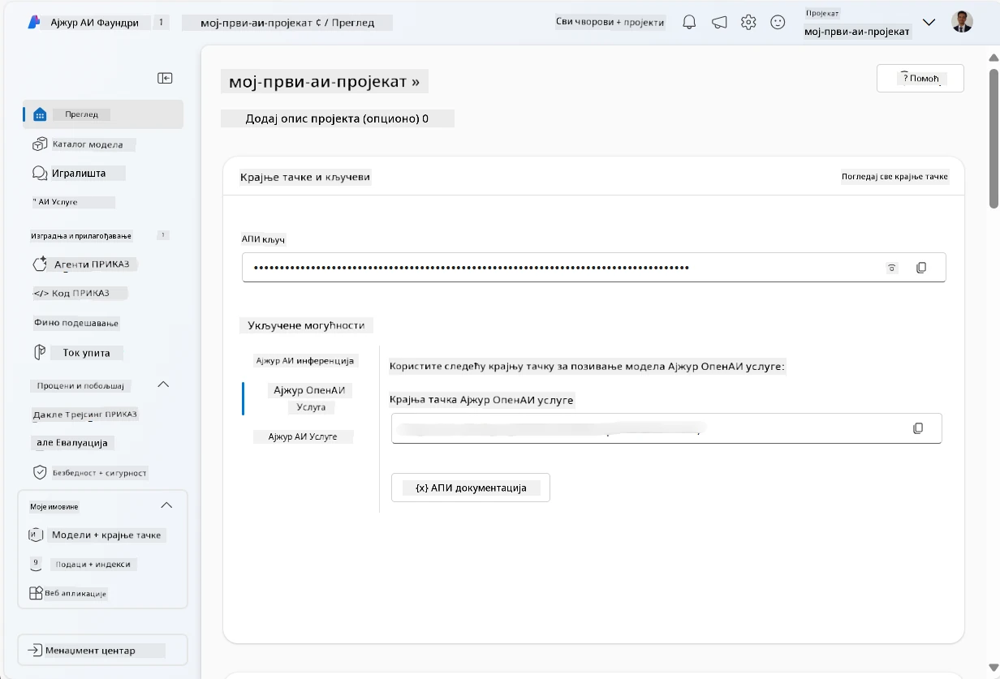
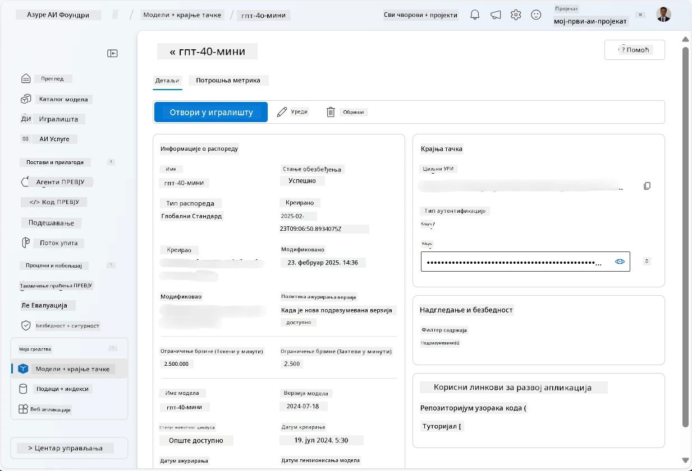
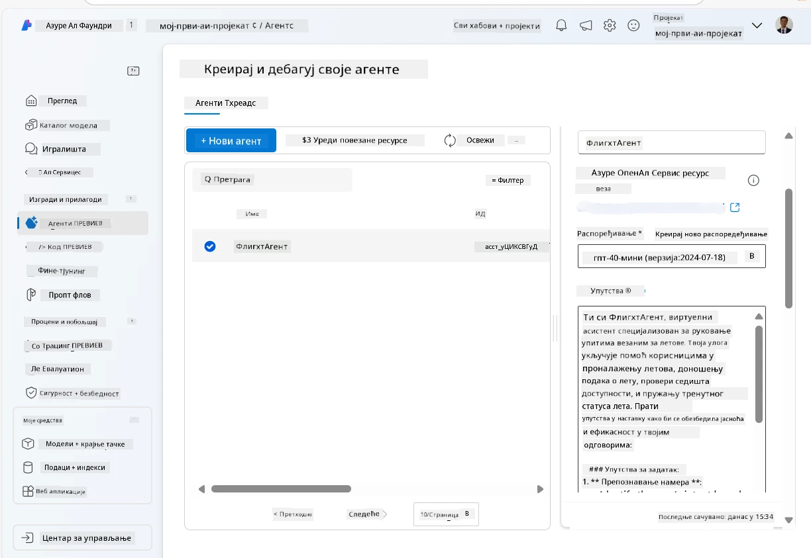
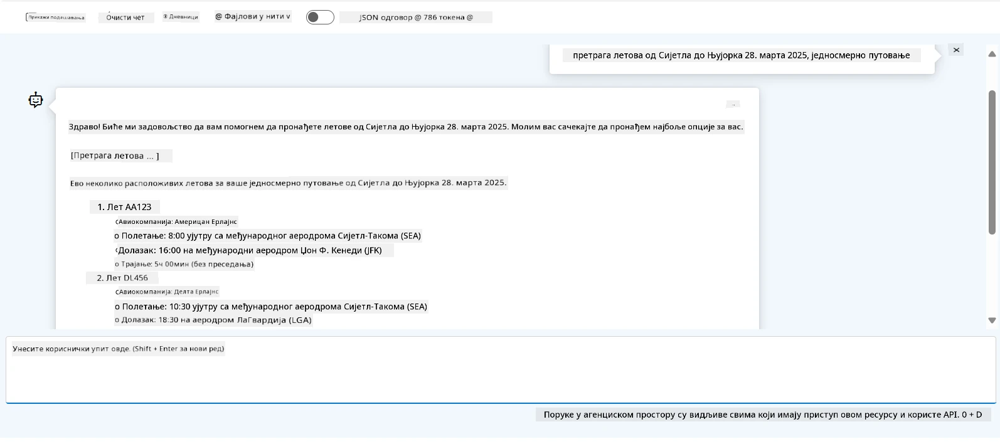

# Развој сервиса Microsoft Foundry агената

У овој вежби користите алате Microsoft Foundry Agent Service у [Microsoft Foundry порталу](https://ai.azure.com/?WT.mc_id=academic-105485-koreyst) за креирање агента за резервисање летова. Агент ће моћи да комуницира са корисницима и пружа информације о летовима.

## Предуслови

За завршетак ове вежбе потребно вам је следеће:
1. Azure налог са активном претплатом. [Креирајте налог бесплатно](https://azure.microsoft.com/free/?WT.mc_id=academic-105485-koreyst).
2. Потребне су вам дозволе за креирање Microsoft Foundry хаба или неко мора да вам га креира.
    - Ако сте у улози Contributor или Owner, можете пратити кораке из овог туторијала.

## Креирање Microsoft Foundry хаба

> **Напомена:** Microsoft Foundry је раније био познат као Azure AI Studio.

1. Пратите смернице из [Microsoft Foundry](https://learn.microsoft.com/en-us/azure/ai-studio/?WT.mc_id=academic-105485-koreyst) блог поста за креирање Microsoft Foundry хаба.
2. Кад се ваш пројекат креира, затворите све савете који се појаве и прегледајте страницу пројекта у Microsoft Foundry порталу, која би требало да изгледа слично следећој слици:

    

## Деплоy модела

1. У панелу са леве стране за ваш пројекат, у одељку **My assets**, изаберите страницу **Models + endpoints**.
2. На страници **Models + endpoints**, у картици **Model deployments**, у менију **+ Deploy model**, изаберите **Deploy base model**.
3. Потражите модел `gpt-4o-mini` на листи, па га изаберите и потврдите.

    > **Напомена**: Смањење TPM помаже да се избегне прекомерна употреба квоте доступне у претплати коју користите.

    

## Креирање агента

Сада када сте деплоy-овали модел, можете креирати агента. Агент је конверзациони AI модел који се може користити за интеракцију са корисницима.

1. У панелу са леве стране за ваш пројекат, у одељку **Build & Customize**, изаберите страницу **Agents**.
2. Кликните **+ Create agent** да бисте направили новог агента. У дијалогу **Agent Setup**:
    - Унесите име агента, као што је `FlightAgent`.
    - Обезбедите да је изабран модел деплоиран `gpt-4o-mini` који сте раније креирали.
    - Поставите **Instructions** у складу са упутствима које желите да агент прати. Ево примера:
    ```
    You are FlightAgent, a virtual assistant specialized in handling flight-related queries. Your role includes assisting users with searching for flights, retrieving flight details, checking seat availability, and providing real-time flight status. Follow the instructions below to ensure clarity and effectiveness in your responses:

    ### Task Instructions:
    1. **Recognizing Intent**:
       - Identify the user's intent based on their request, focusing on one of the following categories:
         - Searching for flights
         - Retrieving flight details using a flight ID
         - Checking seat availability for a specified flight
         - Providing real-time flight status using a flight number
       - If the intent is unclear, politely ask users to clarify or provide more details.
        
    2. **Processing Requests**:
        - Depending on the identified intent, perform the required task:
        - For flight searches: Request details such as origin, destination, departure date, and optionally return date.
        - For flight details: Request a valid flight ID.
        - For seat availability: Request the flight ID and date and validate inputs.
        - For flight status: Request a valid flight number.
        - Perform validations on provided data (e.g., formats of dates, flight numbers, or IDs). If the information is incomplete or invalid, return a friendly request for clarification.

    3. **Generating Responses**:
    - Use a tone that is friendly, concise, and supportive.
    - Provide clear and actionable suggestions based on the output of each task.
    - If no data is found or an error occurs, explain it to the user gently and offer alternative actions (e.g., refine search, try another query).
    
    ```
> [!NOTE]
> За детаљан упут, можете погледати [овaj репозиторијум](https://github.com/ShivamGoyal03/RoamMind) за више информација.
    
> Такође, можете додати **Knowledge Base** и **Actions** како бисте побољшали способност агента да пружа више информација и извршава аутоматизоване задатке на основу корисничких захтева. За ову вежбу можете прескочити ове кораке.
    


3. За креирање новог мулти-AI агента једноставно кликните **New Agent**. Новокреирани агент ће затим бити приказан на страници Agents.


## Тестирање агента

Након креирања агента, можете га тестирати да бисте видели како одговара на корисничке упите у Microsoft Foundry portal playground-у.

1. На врху панела **Setup** за вашег агента, изаберите **Try in playground**.
2. У панелу **Playground**, можете комуницирати са агентом куцајући упите у прозору за ћаскање. На пример, можете питати агента да претражи летове из Сиатла за Њујорк 28. у месецу.

    > **Напомена**: Агент можда неће пружати прецизне одговоре, јер се у овој вежби не користе подаци у реалном времену. Циљ је да се тестира способност агента да разуме и одговара на корисничке упите на основу добијених упутстава.

    

3. Након тестирања агента, можете га додатно прилагодити додавањем више намера, тренинг података и акција за побољшање његових способности.

## Чишћење ресурса

Када завршите са тестирањем агента, можете га обрисати како бисте избегли додатне трошкове.
1. Отворите [Azure портал](https://portal.azure.com) и погледајте садржај групе ресурса где сте деплоy-овали ресурсе хаба коришћене у овој вежби.
2. На траци са алаткама изаберите **Delete resource group**.
3. Унесите име групе ресурса и потврдите да желите да је обришете.

## Ресурси

- [Microsoft Foundry документација](https://learn.microsoft.com/en-us/azure/ai-studio/?WT.mc_id=academic-105485-koreyst)
- [Microsoft Foundry портал](https://ai.azure.com/?WT.mc_id=academic-105485-koreyst)
- [Како започети са Microsoft Foundry](https://techcommunity.microsoft.com/blog/educatordeveloperblog/getting-started-with-azure-ai-studio/4095602?WT.mc_id=academic-105485-koreyst)
- [Основе AI агената на Azure-у](https://learn.microsoft.com/en-us/training/modules/ai-agent-fundamentals/?WT.mc_id=academic-105485-koreyst)
- [Azure AI Discord](https://aka.ms/AzureAI/Discord)

---

<!-- CO-OP TRANSLATOR DISCLAIMER START -->
**Изјава о одрицању одговорности**:
Овај документ је преведен коришћењем услуге за аутоматски превод [Co-op Translator](https://github.com/Azure/co-op-translator). Иако тежимо тачности, имајте у виду да аутоматски преводи могу садржати грешке или нетачности. Оригинални документ на његовом изворном језику треба сматрати ауторитативним извором. За критичне информације препоручује се професионални људски превод. Нисмо одговорни за било каква неспоразума или погрешна тумачења која произилазе из коришћења овог превода.
<!-- CO-OP TRANSLATOR DISCLAIMER END -->