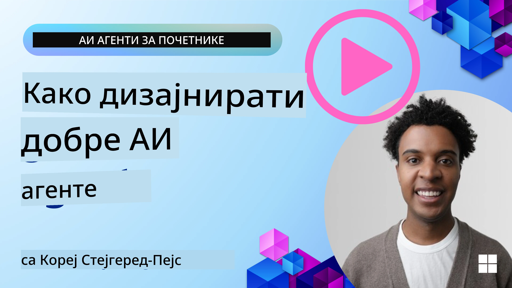
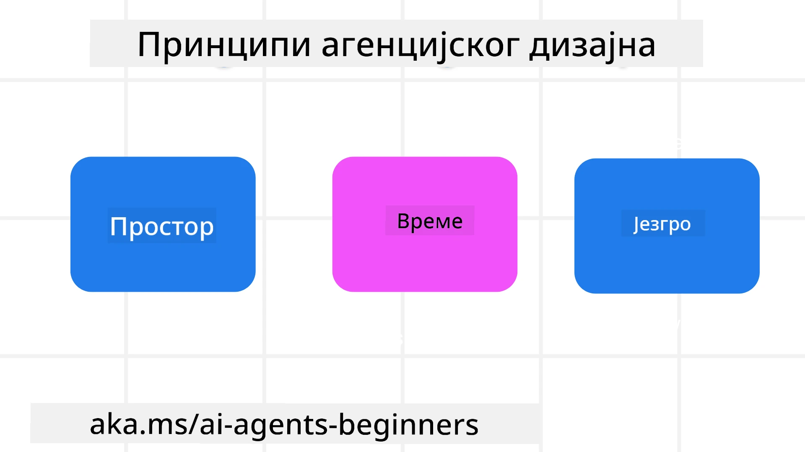

> _(Кликните на слику изнад да бисте погледали видео о овом часу)_
# Принципи AI агентног дизајна

## Увод

Постоји много начина да се размишља о изградњи AI агентних система. С обзиром да је неодређеност карактеристика, а не грешка у дизајну генеративног AI, понекад је инжењерима тешко да схвате где да уопште почну. Креирали смо сет људско-центричних принципа UX дизајна како бисмо омогућили програмерима да граде корисничко-центричне агентне системе за решавање својих пословних потреба. Ови принципи дизајна нису прописана архитектура већ почетна тачка за тимове који дефинишу и развијају агентна искуства.

Уопштено, агенти би требало да:

- Прошире и повећају људске капацитете (бреинсторминг, решавање проблема, аутоматизација итд.)
- Попуне празнине у знању (упознају ме са областима знања, преводом итд.)
- Олакшају и подрже сарадњу на начин на који ми као појединци волимо да радимо са другима
- Учине нас бољим верзијама себе (нпр. животни тренер/управник задатака, помоћ у учењу емоционалне регулације и вештина свесности, изградња отпорности итд.)

## Овај час ће обухватити

- Шта су принципи агентног дизајна
- Која су нека упутства која треба пратити при имплементацији ових принципа дизајна
- Каки су примери коришћења принципа дизајна

## Циљеви учења

Након завршетка овог часа, моћи ћете да:

1. Објасните шта су принципи агентног дизајна
2. Објасните упутства за коришћење принципа агентног дизајна
3. Разумете како изградити агента користећи принципе агентног дизајна

## Принципи агентног дизајна

### Агент (простор)

Ово је окружење у коме агент ради. Ови принципи објашњавају како дизајнирамо агенте за ангажовање у физичким и дигиталним световима.

- **Повезивање, а не урушавање** – помажу у повезивању људи са другим људима, догађајима и доступним знањем ради омогућавања сарадње и повезаности.
- Агенти помажу у повезивању догађаја, знања и људи.
- Агенти приближавају људе. Нису дизајнирани да замену или умање људе.
- **Лако доступан, али понекад невидљив** – агент углавном ради у позадини и само нам укаже када је релевантно и прикладно.
  - Агент је лако пронаћи и приступити му за овлашћене кориснике на било ком уређају или платформи.
  - Агент подржава мултимодалне улазе и излазе (звук, глас, текст итд.).
  - Агент може беспрекорно прелазити између предњег и задњег плана; између проактивног и реактивног, у зависности од свог мишљења о потребама корисника.
  - Агент може радити у невидљивом облику, али је његов позадински процес и сарадња са другим агентима транспарентна и под контролом корисника.

### Агент (време)

Ово је начин на који агент ради током времена. Ови принципи објашњавају како дизајнирамо агенте који интерагују кроз прошлост, садашњост и будућност.

- **Прошлост**: Разматрање историје која укључује и стање и контекст.
  - Агент пружа релевантније резултате засноване на анализи богатијих историјских података који превазилазе само догађај, људе или стања.
  - Агент ствара везе из прошлости и активно разматра сећање да би се укључио у текуће ситуације.
- **Сада**: Подстицање више него обавештавање.
  - Агент оличава свеобухватан приступ интеракцији са људима. Када се деси догађај, агент иде даље од статичног обавештења или друге статичне формалности. Агент може поједноставити токове или динамички генерисати сигнале да усмери пажњу корисника у правом тренутку.
  - Агент испоручује информације засноване на контекстуалном окружењу, друштвеним и културним променама и прилагођене корисниковом намерама.
  - Интеракција са агентом може бити постепена, развијајућа/растућа у сложености како би ојачала кориснике дугорочно.
- **Будућност**: Прилагођавање и развој.
  - Агент се прилагођава разним уређајима, платформама и модалитетима.
  - Агент се прилагођава понашању корисника, потребама приступачности и слободно се прилагођава.
  - Агент је обликовао и развија се кроз сталну интеракцију са корисником.

### Агент (језгро)

Ово су кључни елементи у језгру дизајна агента.

- **Прихватање неодређености али успостављање поверења**.
  - Очекује се одређени ниво неодређености код агента. Неодређеност је кључни елемент дизајна агента.
  - Поверење и транспарентност су основни слојеви дизајна агента.
  - Људи контролишу када је агент укључен/искључен, а статус агента је јасно видљив у сваком тренутку.

## Упутства за имплементацију ових принципа

Када користите претходне принципе дизајна, користите следећа упутства:

1. **Транспарентност**: Обавестите корисника да је AI укључен, како функционише (укључујући прошле радње) и како дати повратне информације и модификовати систем.
2. **Контрола**: Омогућите кориснику да прилагоди, одреди преференције и персонализује, и да има контролу над системом и његовим атрибутима (укључујући могућност заборава).
3. **Конзистентност**: Тежите конзистентним, мултимодалним искуствима преко уређаја и крајњих тачака. Користите познате UI/UX елементе када је могуће (нпр. икона микрофона за гласовну интеракцију) и смањите когнитивно оптерећење корисника колико год је могуће (нпр. тежите концизним одговорима, визуелним помагалима и садржају 'Сазнајте више').

## Како дизајнирати путног агента користећи ове принципе и упутства

Замислите да дизајнирате Путног агента, ево како бисте могли размишљати о коришћењу принципа и упутстава дизајна:

1. **Транспарентност** – Обавестите корисника да је Путни агент AI-ом оспособљен агент. Обезбедите основна упутства како почети (нпр. порука „Здраво“, пример упита). Јасно документацију о овоме на страници производа. Прикажите листу претходних упита корисника. Јасно објасните како дати повратне информације (палац горе или доле, дугме Пошаљи повратну информацију итд.). Јасно артикулишите да ли агент има ограничења коришћења или тема.
2. **Контрола** – Будите сигурни да је кориснику јасно како може модификовати агента након што је створен, користећи ствари попут Системског упита. Омогућите кориснику да бира колико опширно је агент, стил писања и било какве опомене о чему агент не би требало да говори. Омогућите кориснику да погледа и обрише било које повезане датотеке или податке, упите и претходне разговоре.
3. **Конзистентност** – Будите сигурни да су иконе за дељење упита, додавање датотеке или фотографије и обележавање некога или нечега стандардне и препознатљиве. Користите икону спајалице да означите отпремање/дељење датотека са агентом, и икону слике да означите отпремање графика.

## Примери кода

- Python: [Agent Framework](./code_samples/03-python-agent-framework.ipynb)
- .NET: [Agent Framework](./code_samples/03-dotnet-agent-framework.md)

## Имате још питања о AI агентним дизајн шаблонима?

Придружите се [Microsoft Foundry Discord](https://discord.com/invite/ATgtXmAS5D) да упознате друге ученике, присуствујете канцеларијским сатима и добијете одговоре на питања о AI агентима.

## Додатни ресурси

- <a href="https://openai.com" target="_blank">Практике за управљање агентним AI системима | OpenAI</a>
- <a href="https://microsoft.com" target="_blank">Пројекат HAX алата - Microsoft Research</a>
- <a href="https://responsibleaitoolbox.ai" target="_blank">Одговорни AI алат</a>

## Претходни час

[Истраживање агентних оквира](../02-explore-agentic-frameworks/README.md)

## Следећи час

[Шаблон за употребу алата](../04-tool-use/README.md)

---

<!-- CO-OP TRANSLATOR DISCLAIMER START -->
**Изјава о одрицању одговорности**:
Овај документ је преведен коришћењем услуге за аутоматски превод [Co-op Translator](https://github.com/Azure/co-op-translator). Иако тежимо тачности, имајте у виду да аутоматски преводи могу садржати грешке или нетачности. Оригинални документ на његовом изворном језику треба сматрати ауторитативним извором. За критичне информације препоручује се професионални људски превод. Нисмо одговорни за било каква неспоразума или погрешна тумачења која произилазе из коришћења овог превода.
<!-- CO-OP TRANSLATOR DISCLAIMER END -->