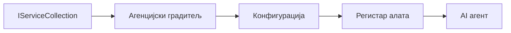

# 🎨 Agentски дизајн обрасци са Azure OpenAI (Responses API) (.NET)

## 📋 Циљеви учења

Овај пример демонстрира пословне дизајн образце за грађење интелигентних агената користећи Microsoft Agent Framework у .NET-у са Azure OpenAI (Responses API) интеграцијом. Научићете професионалне обрасце и архитектонске приступе који чине агенте спремним за производњу, одрживим и скалабилним.

### Пословни дизајн обрасци

- 🏭 **Factory Pattern**: Стандаризовано креирање агената уз dependency injection
- 🔧 **Builder Pattern**: Флуентна конфигурација и подешавање агената
- 🧵 **Thread-Safe Patterns**: Управа за конкордног вођења разговора
- 📋 **Repository Pattern**: Организовано управљање алатима и функцијама

## 🎯 Архитектонске предности специфичне за .NET

### Пословне карактеристике

- **Снажна типизација**: Валидација при компилацији и IntelliSense подршка
- **Dependency Injection**: Уграђена DI контејнер интеграција
- **Управљање конфигурацијом**: IConfiguration и Options обрасци
- **Async/Await**: Прва класа подршка асинхроном програмирању

### Обрасци спремни за производњу

- **Логирање интеграција**: ILogger и подршка структурираног логирања
- **Провере здравља**: Уграђено праћење и дијагностика
- **Валидација конфигурације**: Снажна типизација са подацима о белешкама
- **Обрада грешака**: Структурисано управљање изузецима

## 🔧 Техничка архитектура

### Основне .NET компоненте

- **Microsoft.Extensions.AI**: Уједињене апстракције за AI услуге
- **Microsoft.Agents.AI**: Пословни оквир за оркестрацију агената
- **Azure OpenAI (Responses API)**: Високопродуктивни API клијентски обрасци
- **Систем конфигурације**: appsettings.json и интеграција окружења

### Имплементација дизајн образаца



## 🏗️ Приказани пословни обрасци

### 1. **Креативни обрасци**

- **Agent Factory**: Централизовано креирање агената са конзистентном конфигурацијом
- **Builder Pattern**: Флуент API за комплексну конфигурацију агената
- **Singleton Pattern**: Заједнички ресурси и управљање конфигурацијом
- **Dependency Injection**: Лако повезивање и тестабилност

### 2. **Понашајни обрасци**

- **Strategy Pattern**: Замјењиве стратегије извршавања алата
- **Command Pattern**: Инкапсулиране операције агената са undo/redo
- **Observer Pattern**: Догађаји вођено управљање животним циклом агената
- **Template Method**: Стандаризовани токови извршавања агената

### 3. **Структурални обрасци**

- **Adapter Pattern**: Azure OpenAI (Responses API) интеграциони слој
- **Decorator Pattern**: Побољшање могућности агената
- **Facade Pattern**: Једноставни интерфејси за интеракцију са агентом
- **Proxy Pattern**: Лениво учитавање и кеширање ради перформанси

## 📚 .NET дизајн принципи

### SOLID принципи

- **Једна одговорност**: Свака компонента има јасну сврху
- **Отворен/затворен**: Проширив без измена
- **Лисков замена**: Имплементације алата засноване на интерфејсу
- **Segregacija интерфејса**: Фокусирани, кохезивни интерфејси
- **Инверзија зависности**: Зависност од апстракција, не од конкретних типова

### Чиста архитектура

- **Domain Layer**: Основне апстракције агената и алата
- **Application Layer**: Оркестрација агената и токови рада
- **Infrastructure Layer**: Azure OpenAI (Responses API) интеграција и спољне услуге
- **Presentation Layer**: Корисничка интеракција и формат одговора

## 🔒 Пословна разматрања

### Безбедност

- **Управљање акредитацијама**: Сигурно руковање API кључевима уз IConfiguration
- **Улазна валидација**: Снажна типизација и валидација података
- **Очишћавање излаза**: Сигурна обрада и филтрација одговора
- **Аудит логирање**: Комплетно праћење операција

### Перформансе

- **Async обрасци**: Не-блокирајуће I/O операције
- **Connection Pooling**: Ефикасно управљање HTTP клијентом
- **Кеширање**: Кеширање одговора за побољшане перформансе
- **Управљање ресурсима**: Исправно ослобађање и обрасци чишћења

### Скалирање

- **Сигурност нити**: Подршка за паралелно извршавање агената
- **Упропотреба ресурса**: Ефикасна употреба ресурса
- **Управљање оптерећењем**: Ограничење учесталости и руковање притиском
- **Праћење**: Метрике перформанси и провере здравља

## 🚀 Производна примена

- **Управљање конфигурацијом**: Подешавања специфична за окружење
- **Стратегија логирања**: Структурирано логирање са correlation ID
- **Обрада грешака**: Глобално руковање изузецима уз одговарајући опоравак
- **Праћење**: Аппликатион инсигхтс и бројачи перформанси
- **Тестирање**: Јединични, интеграциони и оптерећенски тест образци

Спремни да изградите пословне интелигентне агенте са .NET? Хајде да архитектурамо нешто робусно! 🏢✨

## 🚀 Почетак рада

### Захтеви

- [.NET 10 SDK](https://dotnet.microsoft.com/download/dotnet/10.0) или новији
- [Azure претплата](https://azure.microsoft.com/free/) са Azure OpenAI ресурсом и моделом који је распореден
- [Azure CLI](https://learn.microsoft.com/cli/azure/install-azure-cli) — пријавите се са `az login`

### Потребне променљиве окружења

```bash
# zsh/bash
export AZURE_OPENAI_ENDPOINT=https://<your-resource>.openai.azure.com
export AZURE_OPENAI_DEPLOYMENT=gpt-4o-mini
# Затим се пријавите тако да AzureCliCredential може добити токен
az login
```

```powershell
# PowerShell
$env:AZURE_OPENAI_ENDPOINT = "https://<your-resource>.openai.azure.com"
$env:AZURE_OPENAI_DEPLOYMENT = "gpt-4o-mini"
# Затим се пријавите како би AzureCliCredential могао да добије токен
az login
```

### Пример кода

За покретање примера кода,

```bash
# зш/баш
chmod +x ./03-dotnet-agent-framework.cs
./03-dotnet-agent-framework.cs
```

Или користећи dotnet CLI:

```bash
dotnet run ./03-dotnet-agent-framework.cs
```

Погледајте [`03-dotnet-agent-framework.cs`](../../../../03-agentic-design-patterns/code_samples/03-dotnet-agent-framework.cs) за комплетан код.

```csharp
#!/usr/bin/dotnet run

#:package Microsoft.Extensions.AI@10.*
#:package Microsoft.Agents.AI.OpenAI@1.*-*
#:package Azure.AI.OpenAI@2.1.0
#:package Azure.Identity@1.13.1

using System.ComponentModel;

using Microsoft.Agents.AI;
using Microsoft.Extensions.AI;

using Azure.AI.OpenAI;
using Azure.Identity;

// Tool Function: Random Destination Generator
// This static method will be available to the agent as a callable tool
// The [Description] attribute helps the AI understand when to use this function
// This demonstrates how to create custom tools for AI agents
[Description("Provides a random vacation destination.")]
static string GetRandomDestination()
{
    // List of popular vacation destinations around the world
    // The agent will randomly select from these options
    var destinations = new List<string>
    {
        "Paris, France",
        "Tokyo, Japan",
        "New York City, USA",
        "Sydney, Australia",
        "Rome, Italy",
        "Barcelona, Spain",
        "Cape Town, South Africa",
        "Rio de Janeiro, Brazil",
        "Bangkok, Thailand",
        "Vancouver, Canada"
    };

    // Generate random index and return selected destination
    // Uses System.Random for simple random selection
    var random = new Random();
    int index = random.Next(destinations.Count);
    return destinations[index];
}

// Azure OpenAI with the Responses API (stable v1 endpoint). Sign in with `az login`.
var azureEndpoint = Environment.GetEnvironmentVariable("AZURE_OPENAI_ENDPOINT")
    ?? throw new InvalidOperationException("AZURE_OPENAI_ENDPOINT is not set.");
var deployment = Environment.GetEnvironmentVariable("AZURE_OPENAI_DEPLOYMENT") ?? "gpt-4o-mini";

var azureClient = new AzureOpenAIClient(new Uri(azureEndpoint), new AzureCliCredential());

// Define Agent Identity and Comprehensive Instructions
// Agent name for identification and logging purposes
var AGENT_NAME = "TravelAgent";

// Detailed instructions that define the agent's personality, capabilities, and behavior
// This system prompt shapes how the agent responds and interacts with users
var AGENT_INSTRUCTIONS = """
You are a helpful AI Agent that can help plan vacations for customers.

Important: When users specify a destination, always plan for that location. Only suggest random destinations when the user hasn't specified a preference.

When the conversation begins, introduce yourself with this message:
"Hello! I'm your TravelAgent assistant. I can help plan vacations and suggest interesting destinations for you. Here are some things you can ask me:
1. Plan a day trip to a specific location
2. Suggest a random vacation destination
3. Find destinations with specific features (beaches, mountains, historical sites, etc.)
4. Plan an alternative trip if you don't like my first suggestion

What kind of trip would you like me to help you plan today?"

Always prioritize user preferences. If they mention a specific destination like "Bali" or "Paris," focus your planning on that location rather than suggesting alternatives.
""";

// Create AI Agent with Advanced Travel Planning Capabilities
// Get the Responses client for the deployment and create the AI agent
// Configure agent with name, detailed instructions, and available tools
// This demonstrates the .NET agent creation pattern with full configuration
AIAgent agent = azureClient
    .GetOpenAIResponseClient(deployment)
    .CreateAIAgent(
        name: AGENT_NAME,
        instructions: AGENT_INSTRUCTIONS,
        tools: [AIFunctionFactory.Create(GetRandomDestination)]
    );

// Create New Conversation Thread for Context Management
// Initialize a new conversation thread to maintain context across multiple interactions
// Threads enable the agent to remember previous exchanges and maintain conversational state
// This is essential for multi-turn conversations and contextual understanding
AgentThread thread = agent.GetNewThread();

// Execute Agent: First Travel Planning Request
// Run the agent with an initial request that will likely trigger the random destination tool
// The agent will analyze the request, use the GetRandomDestination tool, and create an itinerary
// Using the thread parameter maintains conversation context for subsequent interactions
await foreach (var update in agent.RunStreamingAsync("Plan me a day trip", thread))
{
    await Task.Delay(10);
    Console.Write(update);
}

Console.WriteLine();

// Execute Agent: Follow-up Request with Context Awareness
// Demonstrate contextual conversation by referencing the previous response
// The agent remembers the previous destination suggestion and will provide an alternative
// This showcases the power of conversation threads and contextual understanding in .NET agents
await foreach (var update in agent.RunStreamingAsync("I don't like that destination. Plan me another vacation.", thread))
{
    await Task.Delay(10);
    Console.Write(update);
}
```

---

<!-- CO-OP TRANSLATOR DISCLAIMER START -->
**Изјава о одрицању одговорности**:
Овај документ је преведен коришћењем услуге за аутоматски превод [Co-op Translator](https://github.com/Azure/co-op-translator). Иако тежимо тачности, имајте у виду да аутоматски преводи могу садржати грешке или нетачности. Оригинални документ на његовом изворном језику треба сматрати ауторитативним извором. За критичне информације препоручује се професионални људски превод. Нисмо одговорни за било каква неспоразума или погрешна тумачења која произилазе из коришћења овог превода.
<!-- CO-OP TRANSLATOR DISCLAIMER END -->