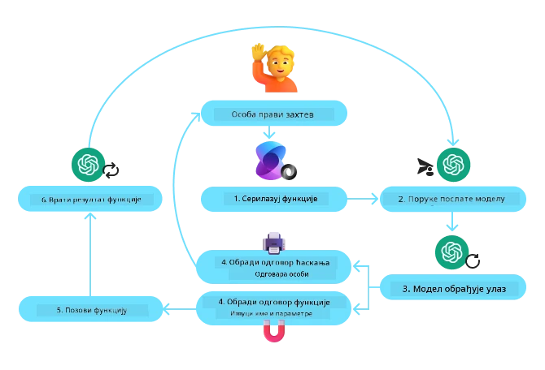
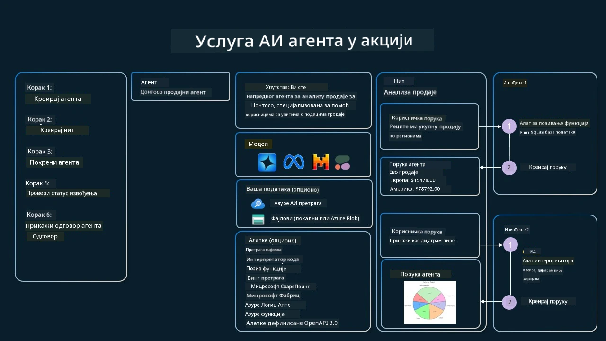

[](https://youtu.be/vieRiPRx-gI?si=cEZ8ApnT6Sus9rhn)

> _(Кликните на слику изнад да бисте погледали видео о овој лекцији)_

# Образац дизајна Коришћење алата

Алатке су занимљиве јер омогућавају AI агентима да имају шири спектар могућности. Уместо да агент има ограничен скуп акција које може извршити, додавањем алатке, агент сада може извршавати широк спектар радњи. У овом поглављу ћемо погледати Образац дизајна Коришћење алата, који описује како AI агенти могу користити одређене алатке да постигну своје циљеве.

## Увод

У овој лекцији ћемо покушати да одговоримо на следећа питања:

- Шта је образац дизајна коришћења алата?
- За које случајеве употребе се може применити?
- Који су елементи/грађевински блокови потребни за имплементацију обрасца дизајна?
- Које су посебне смернице за коришћење обрасца дизајна Коришћење алата за изградњу поузданих AI агената?

## Циљеви учења

Након завршетка ове лекције, моћи ћете да:

- Дефинишете Образац дизајна коришћења алата и његову сврху.
- Идентификујете случајеве употребе где је Образац дизајна коришћења алата применљив.
- Разумете главне елементе потребне за имплементацију обрасца дизајна.
- Препознате смернице за обезбеђивање поузданости AI агената који користе овај образац дизајна.

## Шта је Образац дизајна Коришћење алата?

**Образац дизајна Коришћење алата** фокусира се на давање могућности LLM моделима да интерагују са спољашњим алаткама како би постигли одређене циљеве. Алатке су код који агент може извршити да би обавио радње. Алатка може бити проста функција као што је калкулатор, или API позив према сервису треће стране, као што су проналажење цене акција или прогноза времена. У контексту AI агената, алатке су дизајниране да их агенти извршавају као одговор на **позиве функција генерисане моделом**.

## За које случајеве употребе се може применити?

AI агенти могу користити алатке за извршавање сложених задатака, проналажење информација или доношење одлука. Образац дизајна коришћења алата често се користи у сценаријима који захтевају динамичку интеракцију са спољашњим системима, као што су базе података, веб сервиси или тумачи кода. Ова могућност је корисна за бројне различите случајеве употребе укључујући:

- **Динамично проналажење информација:** Агенти могу упитивати спољашње API-је или базе података да извлаче најновије податке (нпр. упити у SQLite базу за анализу података, дохватање цена акција или информација о времену).
- **Извршавање и тумачење кода:** Агенти могу покретати код или скрипте да реше математичке проблеме, генеришу извештаје или изводе симулације.
- **Аутоматизација радних токова:** Аутоматизација понављајућих или више корака рада интеграцијом алата као што су распоређивачи задатака, сервисе за мејлове или податочне цевоводе.
- **Корисничка подршка:** Агенти могу интераговати са CRM системима, платформама за тикете или базама знања да реше корисничке упите.
- **Генерисање и уређење садржаја:** Агенти могу користити алате као што су провера граматике, резимирање текста или процене безбедности садржаја да помогну у задацима креирања садржаја.

## Који су елементи/грађевински блокови потребни за имплементацију обрасца дизајна коришћења алата?

Ови грађевински блокови омогућавају AI агенту да обавља широк спектар задатака. Погледајмо кључне елементе потребне за имплементацију Обрасца дизајна Коришћење алата:

- **Шеме функција/алата:** Детаљни описи доступних алата, укључујући назив функције, сврху, потребне параметре и очекиване излазе. Ове шеме омогућавају LLM да разуме које алатке су доступне и како да конструише важеће захтеве.

- **Логика извршења функције:** Управља када и како се алатке позивају на основу намере корисника и контекста разговора. Ово може укључивати модуле планирања, механизме рутирања или условне токове који динамички одређују коришћење алата.

- **Систем руковања порукама:** Компоненте које управљају током конверзације између улаза корисника, одговора LLM-а, позива алата и резултата алата.

- **Интеграциони оквир за алатке:** Инфраструктура која повезује агента са различитим алатима, без обзира да ли су једноставне функције или сложени спољашњи сервиси.

- **Руковање грешкама и валидација:** Механизми за управљање неуспесима у извршењу алата, валидацију параметара и руковање неочекиваним одговорима.

- **Управљање стањем:** Праћење контекста разговора, претходних интеракција са алатима и упорних података да би се обезбедила доследност кроз вишеслојне интеракције.

Следеће, хајде да детаљније погледамо Позив функција/алата.
 
### Позив функција/алата

Позив функција је примарни начин на који омогућавамо Великим језичким моделима (LLM) да интерагују са алатима. Често ћете видети да се 'Функција' и 'Алат' користе наизменично јер су „функције“ (делови поновно употребљивог кода) алатке које агенти користе за извршавање задатака. Да би се код функције позвао, LLM мора упоредити кориснички захтев са описом функције. За то се шаље шема која садржи описа свих доступних функција LLM-у. LLM затим бира најприкладнију функцију за задатак и враћа њено име и аргументе. Изабрана функција се извршава, одговор се шаље назад LLM-у, који затим користи те информације да одговори на кориснички захтев.

За програмере који желе да имплементирају позив функција за агенте, потребно је:

1. LLM модел који подржава позив функција
2. Шема која садржи описе функција
3. Код за сваку описану функцију

Показаћемо пример добијања тренутног времена у граду:

1. **Иницијализујте LLM који подржава позив функција:**

    Ни модели не подржавају функцијски позив, па је важно проверити да ли LLM који користите то има. <a href="https://learn.microsoft.com/azure/ai-services/openai/how-to/function-calling" target="_blank">Azure OpenAI</a> подржава позив функција. Можемо почети иницијализацијом Azure OpenAI клијента.

    ```python
    # Иницијализујте Azure OpenAI клијент
    client = AzureOpenAI(
        azure_endpoint = os.getenv("AZURE_AI_PROJECT_ENDPOINT"), 
        api_key=os.getenv("AZURE_OPENAI_API_KEY"),  
        api_version="2024-05-01-preview"
    )
    ```

1. **Креирање шеме функције:**

    Следеће ћемо дефинисати JSON шему која садржи име функције, опис шта функција ради и имена и описи параметара функције.
    Затим ћемо ову шему проследити раније креираном клијенту заједно са корисничким захтевом да се пронађе време у Сан Франциску. Важно је нагласити да је **позив алата** оно што се враћа, **не** коначни одговор на питање. Као што смо претходно рекли, LLM враћа назив функције коју је изабрао за задатак и аргументе који ће јој бити прослеђени.

    ```python
    # Опис функције коју модел треба да прочита
    tools = [
        {
            "type": "function",
            "function": {
                "name": "get_current_time",
                "description": "Get the current time in a given location",
                "parameters": {
                    "type": "object",
                    "properties": {
                        "location": {
                            "type": "string",
                            "description": "The city name, e.g. San Francisco",
                        },
                    },
                    "required": ["location"],
                },
            }
        }
    ]
    ```
   
    ```python
  
    # Почетна порука корисника
    messages = [{"role": "user", "content": "What's the current time in San Francisco"}] 
  
    # Први позив API-ја: Замолите модел да користи функцију
      response = client.chat.completions.create(
          model=deployment_name,
          messages=messages,
          tools=tools,
          tool_choice="auto",
      )
  
      # Обрадите одговор модела
      response_message = response.choices[0].message
      messages.append(response_message)
  
      print("Model's response:")  

      print(response_message)
  
    ```

    ```bash
    Model's response:
    ChatCompletionMessage(content=None, role='assistant', function_call=None, tool_calls=[ChatCompletionMessageToolCall(id='call_pOsKdUlqvdyttYB67MOj434b', function=Function(arguments='{"location":"San Francisco"}', name='get_current_time'), type='function')])
    ```
  
1. **Код функције потребан за извршење задатка:**

    Сада када је LLM одабрао која функција треба да се покрене, потребно је имплементирати и извршити код који обавља задатак.
    Код за добијање тренутног времена можемо написати у пајтону. Такође је потребно написати код за издвајање имена и аргумената из одговорне поруке (response_message) да бисмо добили крајњи резултат.

    ```python
      def get_current_time(location):
        """Get the current time for a given location"""
        print(f"get_current_time called with location: {location}")  
        location_lower = location.lower()
        
        for key, timezone in TIMEZONE_DATA.items():
            if key in location_lower:
                print(f"Timezone found for {key}")  
                current_time = datetime.now(ZoneInfo(timezone)).strftime("%I:%M %p")
                return json.dumps({
                    "location": location,
                    "current_time": current_time
                })
      
        print(f"No timezone data found for {location_lower}")  
        return json.dumps({"location": location, "current_time": "unknown"})
    ```

     ```python
     # Обрада позива функција
      if response_message.tool_calls:
          for tool_call in response_message.tool_calls:
              if tool_call.function.name == "get_current_time":
     
                  function_args = json.loads(tool_call.function.arguments)
     
                  time_response = get_current_time(
                      location=function_args.get("location")
                  )
     
                  messages.append({
                      "tool_call_id": tool_call.id,
                      "role": "tool",
                      "name": "get_current_time",
                      "content": time_response,
                  })
      else:
          print("No tool calls were made by the model.")  
  
      # Други API позив: Добијање коначног одговора од модела
      final_response = client.chat.completions.create(
          model=deployment_name,
          messages=messages,
      )
  
      return final_response.choices[0].message.content
     ```

     ```bash
      get_current_time called with location: San Francisco
      Timezone found for san francisco
      The current time in San Francisco is 09:24 AM.
     ```

Позив функција је у срцу већине, ако не и свих образаца коришћења алата код агената, али његова имплементација од нуле понекад може бити изазовна.
Као што смо научили у [Лекцији 2](../../../02-explore-agentic-frameworks) агентски оквири пружају нам унапред направљене грађевинске блокове за имплементацију коришћења алата.
 
## Примери коришћења алата са агентским оквирима

Ево неких примера како можете имплементирати Образац дизајна Коришћење алата користећи различите агентске оквире:

### Microsoft Agent Framework

<a href="https://learn.microsoft.com/azure/ai-services/agents/overview" target="_blank">Microsoft Agent Framework</a> је open-source AI оквир за формирање AI агената. Олакшава процес коришћења позива функција тако што вам омогућава да дефинишете алатке као Python функције са `@tool` декоратером. Оквир управља комуникацијом у обе стране између модела и вашег кода. Такође пружа приступ унапред направљеним алаткама као што су Претрага фајлова и Тумач кода преко `AzureAIProjectAgentProvider`.

Следећа дијаграм илуструје процес позива функције помоћу Microsoft Agent Framework-а:



У Microsoft Agent Framework-у алатке се дефинишу као декорисане функције. Функцију `get_current_time` коју смо претходно видели можемо претворити у алат користећи `@tool` декоратер. Оквир ће аутоматски сериализовати функцију и њене параметре, правећи шему која се шаље LLM-у.

```python
from agent_framework import tool
from agent_framework.azure import AzureAIProjectAgentProvider
from azure.identity import AzureCliCredential

@tool
def get_current_time(location: str) -> str:
    """Get the current time for a given location"""
    ...

# Креирај клијента
provider = AzureAIProjectAgentProvider(credential=AzureCliCredential())

# Креирај агента и покрени са алатом
agent = await provider.create_agent(name="TimeAgent", instructions="Use available tools to answer questions.", tools=get_current_time)
response = await agent.run("What time is it?")
```
  
### Azure AI Agent Service

<a href="https://learn.microsoft.com/azure/ai-services/agents/overview" target="_blank">Azure AI Agent Service</a> је новији агентски оквир који има за циљ да омогући програмерима да сигурно граде, распореде и скалирају квалитетне, прошириве AI агенте без потребе да управљају основним ресурсима за израчунавање и складиштење. Он је посебно користан за пословне апликације јер је у потпуности управљани сервис са безбедношћу корпоративног нивоа.

У односу на развој директно са LLM API-јем, Azure AI Agent Service пружа неке предности, укључујући:

- Аутоматски позив алата – нема потребе за парсирањем позива алата, покретањем алата и руковањем одговором; све то се сада обавља на серверу
- Сигурно управљани подаци – уместо да управљате сопственим стањем разговора, можете се ослонити на теме да сачувате све потребне информације
- Алати спремни за коришћење – алати који вам омогућавају да интерагујете са својим изворима података, као што су Bing, Azure AI Search и Azure Functions.

Алати доступни у Azure AI Agent Service-у могу се поделити у две категорије:

1. Алати знања:
    - <a href="https://learn.microsoft.com/azure/ai-services/agents/how-to/tools/bing-grounding?tabs=python&pivots=overview" target="_blank">Повећање („Grounding“) коришћењем Bing претраге</a>
    - <a href="https://learn.microsoft.com/azure/ai-services/agents/how-to/tools/file-search?tabs=python&pivots=overview" target="_blank">Претрага фајлова</a>
    - <a href="https://learn.microsoft.com/azure/ai-services/agents/how-to/tools/azure-ai-search?tabs=azurecli%2Cpython&pivots=overview-azure-ai-search" target="_blank">Azure AI претрага</a>

2. Алати акције:
    - <a href="https://learn.microsoft.com/azure/ai-services/agents/how-to/tools/function-calling?tabs=python&pivots=overview" target="_blank">Позив функција</a>
    - <a href="https://learn.microsoft.com/azure/ai-services/agents/how-to/tools/code-interpreter?tabs=python&pivots=overview" target="_blank">Тумач кода</a>
    - <a href="https://learn.microsoft.com/azure/ai-services/agents/how-to/tools/openapi-spec?tabs=python&pivots=overview" target="_blank">Алатке дефинисане OpenAPI-јем</a>
    - <a href="https://learn.microsoft.com/azure/ai-services/agents/how-to/tools/azure-functions?pivots=overview" target="_blank">Azure функције</a>

Agent Service нам омогућава да користимо ове алате заједно као `скуп алата` (toolset). Такође користи `теме` које прате историју порука из одређеног разговора.

Замислите да сте продајни агент у компанији Contoso. Желите да развијете конверзацијског агента који може одговорити на питања о вашим продајним подацима.

Следећа слика илуструје како можете користити Azure AI Agent Service за анализу ваших продајних података:



За коришћење било ког од ових алата са сервисом можемо креирати клијента и дефинисати алат или скуп алата. Практично, имплементацију можемо урадити коришћењем следећег Python кода. LLM ће моћи да погледа скуп алата и одлучи да ли ће користити кориснички креирану функцију `fetch_sales_data_using_sqlite_query` или уграђени Code Interpreter, у зависности од корисничког захтева.

```python 
import os
from azure.ai.projects import AIProjectClient
from azure.identity import DefaultAzureCredential
from fetch_sales_data_functions import fetch_sales_data_using_sqlite_query # функција fetch_sales_data_using_sqlite_query која се може наћи у фајлу fetch_sales_data_functions.py.
from azure.ai.projects.models import ToolSet, FunctionTool, CodeInterpreterTool

project_client = AIProjectClient.from_connection_string(
    credential=DefaultAzureCredential(),
    conn_str=os.environ["PROJECT_CONNECTION_STRING"],
)

# Иницијализујте скуп алата
toolset = ToolSet()

# Иницијализујте агент за позивање функција са функцијом fetch_sales_data_using_sqlite_query и додајте га у скуп алата
fetch_data_function = FunctionTool(fetch_sales_data_using_sqlite_query)
toolset.add(fetch_data_function)

# Иницијализујте алат Code Interpreter и додајте га у скуп алата.
code_interpreter = code_interpreter = CodeInterpreterTool()
toolset.add(code_interpreter)

agent = project_client.agents.create_agent(
    model="gpt-4o-mini", name="my-agent", instructions="You are helpful agent", 
    toolset=toolset
)
```

## Које су посебне смернице за коришћење Обрасца дизајна Коришћење алата за изградњу поузданих AI агената?

Честа брига код динамички генерисаног SQL-а од стране LLM-а је безбедност, посебно ризик SQL инјекције или злонамерних радњи као што је брисање или манипулација базе података. Иако су ове бриге оправдане, могу се ефикасно ублажити правилним конфигурисањем дозвола приступа бази података. За већину база овде је потребно подесити базу као само за читање. За базне сервисе као што су PostgreSQL или Azure SQL, апликацији треба доделити улогу само за читање (SELECT).

Покретање апликације у сигурном окружењу додатно повећава заштиту. У пословним сценаријима, подаци се обично екстрактују и трансформишу из оперативних система у базу података или складиште података једино за читање са пријатном шемом за корисника. Овим приступом се обезбеђују сигурност, оптимизација перформанси и приступачност података, уз ограничен приступ апликације само за читање.

## Примери кода

- Python: [Agent Framework](./code_samples/04-python-agent-framework.ipynb)
- .NET: [Agent Framework](./code_samples/04-dotnet-agent-framework.md)

## Имате још питања о Обрасцима дизајна Коришћења алата?

Придружите се [Microsoft Foundry Discord](https://aka.ms/ai-agents/discord) за квалификовано друштво других ученика, учешће у канцеларијским сатовима и добијање одговора на ваша питања о AI агентима.

## Додатни ресурси

- <a href="https://microsoft.github.io/build-your-first-agent-with-azure-ai-agent-service-workshop/" target="_blank">Azure AI Agents Service Workshop</a>
- <a href="https://github.com/Azure-Samples/contoso-creative-writer/tree/main/docs/workshop" target="_blank">Contoso Creative Writer Multi-Agent Workshop</a>
- <a href="https://learn.microsoft.com/azure/ai-services/agents/overview" target="_blank">Преглед Microsoft Agent Framework</a>

## Претходна лекција

[Разумевање агентских образаца дизајна](../03-agentic-design-patterns/README.md)

## Следећа лекција
[Агенцијски RAG](../05-agentic-rag/README.md)

---

<!-- CO-OP TRANSLATOR DISCLAIMER START -->
**Одрицање одговорности**:
Овај документ је преведен помоћу AI преводилачке услуге [Co-op Translator](https://github.com/Azure/co-op-translator). Иако тежимо прецизности, молимо вас да имате у виду да аутоматизовани преводи могу садржати грешке или нетачности. Изворни документ на његовом оригиналном језику треба сматрати ауторитетним извором. За критичне информације препоручује се професионални људски превод. Не одговарамо за било каква непоразумевања или погрешна тумачења која произилазе из употребе овог превода.
<!-- CO-OP TRANSLATOR DISCLAIMER END -->