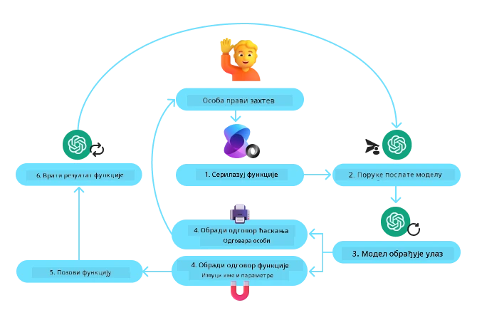
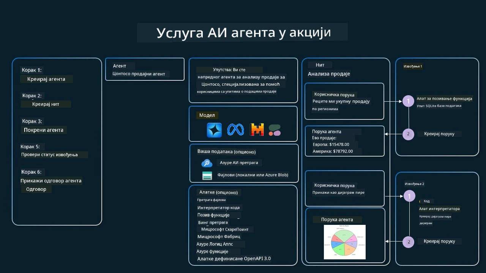

[](https://youtu.be/vieRiPRx-gI?si=cEZ8ApnT6Sus9rhn)

> _(Кликните на слику изнад да бисте гледали видео о овој лекцији)_

# Обрасци коришћења алата

Алатке су интересантне јер омогућавају AI агентима да имају шире могућности. Уместо да агент има ограничен скуп акција које може извршити, додавањем алатке, агент сада може да изврши велики број различитих акција. У овом поглављу ћемо погледати образац коришћења алата, који описује како AI агенти могу да користе одређене алатке да би остварили своје циљеве.

## Увод

У овој лекцији желимо да одговоримо на следећа питања:

- Шта је образац коришћења алата?
- За које случајеве коришћења се овај образац може примењивати?
- Који елементи/грађевински блокови су потребни за имплементацију образаца?
- Које су посебне мере опреза при коришћењу обрасца коришћења алата за изградњу поузданих AI агената?

## Циљеви учења

Након завршетка ове лекције, бићете у могућности да:

- Дефинишете образац коришћења алата и његову сврху.
- Идентификујете случајеве у којима се образац коришћења алата може применити.
- Разумете кључне елементе потребне за имплементацију обрасца.
- Препознате мере за обезбеђивање поузданости AI агената који користе овај образац.

## Шта је образац коришћења алата?

**Образац коришћења алата** фокусира се на давање могућности LLM моделима да интерагују са спољашњим алатима ради остварења специфичних циљева. Алатке су код који агент може да изврши да би обавио неке акције. Алатка може бити једноставна функција као што је калкулатор или позив API-ја треће стране као што је проналажење цене акција или временска прогноза. У контексту AI агената, алатке су дизајниране да буду извршене од стране агената као одговор на **функцијске позиве генерисане моделом**.

## За које случајеве коришћења се може применити?

AI агенти могу користити алатке да заврше сложене задатке, преузму информације или донесу одлуке. Образац коришћења алата често се користи у сценаријима који захтевају динамичку интеракцију са спољашњим системима, као што су базе података, веб сервисе или тумачење кода. Ова могућност је корисна за низ различитих случајева коришћења, укључујући:

- **Динамичко преузимање информација:** Агенти могу да упитују спољашње API-је или базе података како би добили најновије податке (нпр. упит према SQLite бази за анализу података, преузимање цена акција или информација о времену).
- **Извршавање и тумачење кода:** Агенти могу извршавати код или скрипте ради решавања математичких проблема, генерисања извештаја или извођења симулација.
- **Аутоматизација радних токова:** Аутоматизација понављајућих или више корака радних токова интеграцијом алата као што су распоређивачи задатака, услуге е-поште или цевоводи података.
- **Корисничка подршка:** Агенти могу да интерагују са CRM системима, платформама за тикете или базама знања да би решили корисничке упите.
- **Генерација и уређивање садржаја:** Агенти могу користити алате као што су провера граматике, прављење резимеа текста или процена безбедности садржаја да помогну у задацима креирања садржаја.

## Који су елементи/грађевински блокови потребни за имплементацију обрасца коришћења алата?

Ови грађевински блокови омогућавају AI агенту да обави широки спектар задатака. Погледајмо кључне елементе потребне за имплементацију обрасца коришћења алата:

- **Шеме функција/алата**: Детаљне дефиниције доступних алата, укључујући име функције, сврху, потребне параметре и очекиване излазе. Ове шеме омогућавају LLM-у да разуме које су алатке доступне и како да конструише валидне захтеве.

- **Логика извршења функција**: Управља када и како се алатке позивају на основу корисникове намере и контекста разговора. Ово може укључивати модуле за планирање, механизме рутирања или условне токове који динамички одређују коришћење алата.

- **Систем руковања порукама**: Компоненте које управљају током разговора између корисничких уноса, LLM одговора, позива алата и излаза из алата.

- **Фрејмворк интеграције алата**: Инфраструктура која повезује агента са разним алатима, било да су то једноставне функције или сложени спољашњи сервиси.

- **Руковање грешкама и валидација**: Механизми за руковање неуспесима у извршењу алата, проверу параметара и управљање неочекиваним одговорима.

- **Управљање стањем**: Прати контекст разговора, претходне интеракције са алатима и перзистентне податке како би се обезбедила конзистентност током више корака у разговору.

У наставку, детаљније ћемо погледати позив функција/алата.

### Позив функција/алата

Позив функције је основни начин на који омогућавамо моделима великих језика (LLM) да интерагују са алатима. Често ћете видети да се „функција“ и „алат“ користе као синоними јер су „функције“ (блокови поново употребљивог кода) „алати“ које агенти користе да изврше задатке. Да би се код функције извршио, LLM мора упоредити кориснички захтев са описом функције. За то се користи шема која садржи описе свих расположивих функција, која се шаље LLM-у. LLM онда бира најприкладнију функцију за задатак и враћа њено име и аргументе. Изабрана функција се извршава, њен одговор се враћа LLM-у, који користи те информације да одговори на корисников захтев.

За програмере који требају да имплементирају позив функција за агенте, потребно је:

1. LLM модел који подржава позив функција
2. Шема са описима функција
3. Код за сваку описану функцију

Узмимо као пример добијање тренутног времена у неком граду:

1. **Иницијализујте LLM који подржава позив функција:**

    Нису сви модели способни за позив функција, тако да је важно проверити да ли ваш LLM то подржава. <a href="https://learn.microsoft.com/azure/ai-services/openai/how-to/function-calling" target="_blank">Azure OpenAI</a> подржава позив функција. Почнимо иницијализацијом Azure OpenAI клијента.

    ```python
    # Иницијализујте Azure OpenAI клијента
    client = AzureOpenAI(
        azure_endpoint = os.getenv("AZURE_AI_PROJECT_ENDPOINT"), 
        api_key=os.getenv("AZURE_OPENAI_API_KEY"),  
        api_version="2024-05-01-preview"
    )
    ```

2. **Креирајте шему функције:**

    Затим ћемо дефинисати JSON шему која садржи име функције, опис шта функција ради и имена и описе параметара функције. Потом ћемо овај опис проследити клијенту уз кориснички захтев за проналажење времена у Сан Франциску. Важно је приметити да је **позив алата** оно што се враћа, а **не** коначан одговор на питање. Као што је претходно поменуто, LLM враћа име функције коју је изабрао за задатак и аргументе који ће јој бити прослеђени.

    ```python
    # Опис функције за модел да прочита
    tools = [
        {
            "type": "function",
            "function": {
                "name": "get_current_time",
                "description": "Get the current time in a given location",
                "parameters": {
                    "type": "object",
                    "properties": {
                        "location": {
                            "type": "string",
                            "description": "The city name, e.g. San Francisco",
                        },
                    },
                    "required": ["location"],
                },
            }
        }
    ]
    ```
   
    ```python
  
    # Почетна порука корисника
    messages = [{"role": "user", "content": "What's the current time in San Francisco"}] 
  
    # Први позив API-ја: Затражите од модела да користи функцију
      response = client.chat.completions.create(
          model=deployment_name,
          messages=messages,
          tools=tools,
          tool_choice="auto",
      )
  
      # Обрадити одговор модела
      response_message = response.choices[0].message
      messages.append(response_message)
  
      print("Model's response:")  

      print(response_message)
  
    ```

    ```bash
    Model's response:
    ChatCompletionMessage(content=None, role='assistant', function_call=None, tool_calls=[ChatCompletionMessageToolCall(id='call_pOsKdUlqvdyttYB67MOj434b', function=Function(arguments='{"location":"San Francisco"}', name='get_current_time'), type='function')])
    ```
  
3. **Код функције потребан за извршење задатка:**

    Сада када је LLM изабрао функцију која треба да се покрене, код који извршава задатак мора да се имплементира и изврши.
    Код за добијање тренутног времена можемо написати у Питону. Такође ћемо морати написати код који извлачи име и аргументе из response_message како бисмо добили коначан резултат.

    ```python
      def get_current_time(location):
        """Get the current time for a given location"""
        print(f"get_current_time called with location: {location}")  
        location_lower = location.lower()
        
        for key, timezone in TIMEZONE_DATA.items():
            if key in location_lower:
                print(f"Timezone found for {key}")  
                current_time = datetime.now(ZoneInfo(timezone)).strftime("%I:%M %p")
                return json.dumps({
                    "location": location,
                    "current_time": current_time
                })
      
        print(f"No timezone data found for {location_lower}")  
        return json.dumps({"location": location, "current_time": "unknown"})
    ```

     ```python
     # Обрада позива функција
      if response_message.tool_calls:
          for tool_call in response_message.tool_calls:
              if tool_call.function.name == "get_current_time":
     
                  function_args = json.loads(tool_call.function.arguments)
     
                  time_response = get_current_time(
                      location=function_args.get("location")
                  )
     
                  messages.append({
                      "tool_call_id": tool_call.id,
                      "role": "tool",
                      "name": "get_current_time",
                      "content": time_response,
                  })
      else:
          print("No tool calls were made by the model.")  
  
      # Други API позив: Добити коначни одговор од модела
      final_response = client.chat.completions.create(
          model=deployment_name,
          messages=messages,
      )
  
      return final_response.choices[0].message.content
     ```

     ```bash
      get_current_time called with location: San Francisco
      Timezone found for san francisco
      The current time in San Francisco is 09:24 AM.
     ```

Позив функција је у сржи већине, ако не и свих, дизајна коришћења алата за агенте, али његова имплементација од нуле може понекад бити изазовна.
Као што смо научили у [Лекцији 2](../../../02-explore-agentic-frameworks), агентски фрејмворци нам пружају унапред изграђене грађевинске блокове за имплементацију коришћења алата.

## Примери коришћења алата са агентским фрејмворцима

Ево неколико примера како можете имплементирати образац коришћења алата користећи различите агентске фрејмворке:

### Microsoft Agent Framework

<a href="https://learn.microsoft.com/azure/ai-services/agents/overview" target="_blank">Microsoft Agent Framework</a> је open-source AI фрејмворк за изградњу AI агената. Поједностављује процес коришћења позива функција тако што вам дозвољава да дефинишете алатке као Python функције са декоратором `@tool`. Фрејмворк управља двосмерном комуникацијом између модела и вашег кода. Такође пружа приступ унапред изграђеним алаткама као што су Pretraga фајлова и Code Interpreter преко `AzureAIProjectAgentProvider`.

Следећи дијаграм илуструје процес позива функција са Microsoft Agent Framework:



У Microsoft Agent Framework-у, алатке се дефинишу као декорисане функције. Можемо претворити функцију `get_current_time` коју смо раније видели у алатку коришћењем декоратора `@tool`. Фрејмворк ће аутоматски сериализовати функцију и њене параметре, стварајући шему која се шаље LLM-у.

```python
from agent_framework import tool
from agent_framework.azure import AzureAIProjectAgentProvider
from azure.identity import AzureCliCredential

@tool
def get_current_time(location: str) -> str:
    """Get the current time for a given location"""
    ...

# Креирајте клијента
provider = AzureAIProjectAgentProvider(credential=AzureCliCredential())

# Креирајте агента и покрените га са алатом
agent = await provider.create_agent(name="TimeAgent", instructions="Use available tools to answer questions.", tools=get_current_time)
response = await agent.run("What time is it?")
```
  
### Azure AI Agent Service

<a href="https://learn.microsoft.com/azure/ai-services/agents/overview" target="_blank">Azure AI Agent Service</a> је новијa агентски фрејмворк дизајниран да омогући програмерима да сигурно граде, развијају и скалирају квалитетне и прошириве AI агенте без потребе за управљањем основним рачунарским и складишним ресурсима. Посебно је корисна за корпоративне апликације јер је потпуно управљана услуга са безбедношћу на нивоу предузећа.

У поређењу са директним развојем коришћењем LLM API-ја, Azure AI Agent Service нуди неке предности, укључујући:

- Аутоматски позив алата – нема потребе за парсирањем позива алата, извршењем алата и руковањем одговором; све се сада ради на серверу
- Сигурно управљани подаци – уместо да управљате сопственим стањем разговора, можете се ослонити на thread-ове да чувају све потребне информације
- Спремне алатке – алатке које можете користити за интеракцију са изворима података као што су Bing, Azure AI Search и Azure Functions.

Алатке доступне у Azure AI Agent Service могу се поделити у две категорије:

1. Алатке за знање:
    - <a href="https://learn.microsoft.com/azure/ai-services/agents/how-to/tools/bing-grounding?tabs=python&pivots=overview" target="_blank">Пружање контекста уз Bing претрагу</a>
    - <a href="https://learn.microsoft.com/azure/ai-services/agents/how-to/tools/file-search?tabs=python&pivots=overview" target="_blank">Претрага фајлова</a>
    - <a href="https://learn.microsoft.com/azure/ai-services/agents/how-to/tools/azure-ai-search?tabs=azurecli%2Cpython&pivots=overview-azure-ai-search" target="_blank">Azure AI претрага</a>

2. Алатке за акције:
    - <a href="https://learn.microsoft.com/azure/ai-services/agents/how-to/tools/function-calling?tabs=python&pivots=overview" target="_blank">Позив функција</a>
    - <a href="https://learn.microsoft.com/azure/ai-services/agents/how-to/tools/code-interpreter?tabs=python&pivots=overview" target="_blank">Тумач кода</a>
    - <a href="https://learn.microsoft.com/azure/ai-services/agents/how-to/tools/openapi-spec?tabs=python&pivots=overview" target="_blank">Алатке дефинисане OpenAPI спецификацијом</a>
    - <a href="https://learn.microsoft.com/azure/ai-services/agents/how-to/tools/azure-functions?pivots=overview" target="_blank">Azure Functions</a>

Agent Service нам омогућава да користимо ове алатке заједно као `скуп алата` (`toolset`). Такође користи `thread-ове` који прате историју порука у одређеном разговору.

Замислите да сте продајни агент у компанији Contoso. Желите да развијете конверзацијског агента који може одговарати на питања о вашим продајним подацима.

Следећа слика илуструје како можете користити Azure AI Agent Service за анализу ваших продајних података:



Да бисмо користили било коју од ових алатки са услугом, можемо направити клијента и дефинисати алатку или скуп алата. За практичну имплементацију можемо користити следећи Python код. LLM ће моћи да погледа скуп алатки и одлучи да ли ће користити кориснички направљену функцију `fetch_sales_data_using_sqlite_query` или унапред изграђени Code Interpreter у зависности од корисничког захтева.

```python 
import os
from azure.ai.projects import AIProjectClient
from azure.identity import DefaultAzureCredential
from fetch_sales_data_functions import fetch_sales_data_using_sqlite_query # функција fetch_sales_data_using_sqlite_query која се може пронаћи у фајлу fetch_sales_data_functions.py.
from azure.ai.projects.models import ToolSet, FunctionTool, CodeInterpreterTool

project_client = AIProjectClient.from_connection_string(
    credential=DefaultAzureCredential(),
    conn_str=os.environ["PROJECT_CONNECTION_STRING"],
)

# Иницијализација скупа алата
toolset = ToolSet()

# Иницијализација агента који позива функције са функцијом fetch_sales_data_using_sqlite_query и додавање у скуп алата
fetch_data_function = FunctionTool(fetch_sales_data_using_sqlite_query)
toolset.add(fetch_data_function)

# Иницијализација алата Code Interpreter и додавање у скуп алата.
code_interpreter = CodeInterpreterTool()toolset.add(code_interpreter)

agent = project_client.agents.create_agent(
    model="gpt-4o-mini", name="my-agent", instructions="You are helpful agent", 
    toolset=toolset
)
```

## Који су посебни аспекти за коришћење обрасца коришћења алата у изградњи поузданих AI агената?

Честа забринутост код SQL упита које динамички генеришу LLM-ови је безбедност, посебно ризик од SQL инјекције или злонамерних акција, као што су брисање или нарушавање базе података. Иако су ове бриге оправдане, могу се ефикасно ублажити правилном конфигурацијом дозвола приступа бази података. За већину база података то подразумева подешавање да база буде само за читање. За сервисе као што су PostgreSQL или Azure SQL, апликацији треба доделити улогу само за читање (SELECT).

Извођење апликације у сигурном окружењу још више повећава заштиту. У корпоративним сценаријима, подаци се обично екстрахују и трансформишу из оперативних система у базу или складиште података са шемом прилагођеном кориснику која је само за читање. Овај приступ осигурава да су подаци безбедни, оптимизовани за перформансе и приступачност, и да апликација има ограничен приступ само за читање.

## Примери кода

- Python: [Agent Framework](./code_samples/04-python-agent-framework.ipynb)
- .NET: [Agent Framework](./code_samples/04-dotnet-agent-framework.md)

## Имате још питања о обрасцима коришћења алата?

Придружите се [Microsoft Foundry Discord](https://discord.com/invite/ATgtXmAS5D) за сусрете са другим ученицима, учествовање у радном времену и добијање одговора на ваша питања о AI агентима.

## Додатни ресурси

- <a href="https://microsoft.github.io/build-your-first-agent-with-azure-ai-agent-service-workshop/" target="_blank">Радна радионица Azure AI Agents Service</a>
- <a href="https://github.com/Azure-Samples/contoso-creative-writer/tree/main/docs/workshop" target="_blank">Contoso Creative Writer Мулти-Агент радионица</a>
- <a href="https://learn.microsoft.com/azure/ai-services/agents/overview" target="_blank">Преглед Microsoft Agent Framework</a>

## Претходна лекција

[Разумевање агентских обрасца](../03-agentic-design-patterns/README.md)

## Следећа лекција
[Agentic RAG](../05-agentic-rag/README.md)

---

<!-- CO-OP TRANSLATOR DISCLAIMER START -->
**Изјава о одрицању одговорности**:
Овај документ је преведен коришћењем услуге за аутоматски превод [Co-op Translator](https://github.com/Azure/co-op-translator). Иако тежимо тачности, имајте у виду да аутоматски преводи могу садржати грешке или нетачности. Оригинални документ на његовом изворном језику треба сматрати ауторитативним извором. За критичне информације препоручује се професионални људски превод. Нисмо одговорни за било каква неспоразума или погрешна тумачења која произилазе из коришћења овог превода.
<!-- CO-OP TRANSLATOR DISCLAIMER END -->