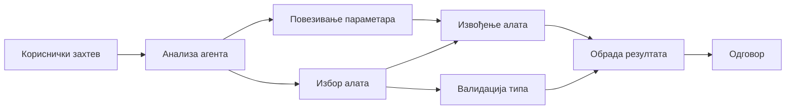

# 🛠️ Напредна употреба алата са Azure OpenAI (Responses API) (.NET)

## 📋 Циљеви учења

Овај нотебоок показује обрасце интеграције алата класе предузећа користећи Microsoft Agent Framework у .NET уз Azure OpenAI (Responses API). Научићете како да градите напредне агенте са више специјализованих алата, користећи снажно типизирање у C# и предузећне карактеристике .NET-а.

### Напредне могућности алата које ћете савладати

- 🔧 **Архитектура са више алата**: Изградња агената са више специјализованих способности
- 🎯 **Извођење алата са безбедним типовима**: Коришћење валидације у време компајлирања у C#
- 📊 **Предузетнички обрасци алата**: Дизајн алата спремних за производњу и руковање грешкама
- 🔗 **Композиција алата**: Комбиновање алата за сложене пословне токове рада

## 🎯 Предности архитектуре алата у .NET-у

### Карактеристике алата за предузећа

- **Валидација у време компајлирања**: Снажна типизација осигурава исправност параметара алата
- **Dependency Injection**: Интеграција IoC контејнера за управљање алатима
- **Обрасци Async/Await**: Неблокирајуће извршавање алата са правилним управљањем ресурсима
- **Структурирано логовање**: Уграђена интеграција логовања за праћење извршавања алата

### Обрасци спремни за производњу

- **Руковање изузецима**: Свеобухватно управљање грешкама са типизираним изузецима
- **Управљање ресурсима**: Правилни обрасци за ослобађање ресурса и управљање меморијом
- **Праћење перформанси**: Уграђене метрике и бројачи перформанси
- **Управљање конфигурацијом**: Безбедна конфигурација са валидацијом

## 🔧 Техничка архитектура

### Основне компоненте алата у .NET-у

- **Microsoft.Extensions.AI**: Унифицирани слој апстракције алата
- **Microsoft.Agents.AI**: Оркестрација алата класе предузећа
- **Azure OpenAI (Responses API)**: API клијент високе перформансе са пулом веза

### Цевовод извршавања алата



## 🛠️ Категорије и образци алата

### 1. **Алатке за обраду података**

- **Валидација уноса**: Снажна типизација са напоменама о подацима
- **Операције трансформације**: Безбедна конверзија и форматирање података
- **Пословна логика**: Алати за специфичне доменске прорачуне и анализу
- **Форматирање излаза**: Генерисање структурисаног одговора

### 2. **Интеграциони алати**

- **API конектори**: Интеграција RESTful сервиса са HttpClient-ом
- **Алати за базу података**: Интеграција Entity Framework-а за приступ подацима
- **Операције са фајловима**: Безбедне операције са фајл системом и валидацијом
- **Спољашњи сервиси**: Обрасци интеграције са услугама трећих страна

### 3. **Помоћни алати**

- **Обрада текста**: Утилитији за манипулацију и форматирање стрингова
- **Операције са датумом/временом**: Израчунавања датума/времена осетљива на културу
- **Математички алати**: Прецизни прорачуни и статистичке операције
- **Алат за валидацију**: Валидација пословних правила и проверa података

Спремни да изградите агенте класе предузећа са моћним алатима са безбедним типовима у .NET-у? Хајде да архитектурамо професионална решења! 🏢⚡

## 🚀 Како почети

### Предуслови

- [.NET 10 SDK](https://dotnet.microsoft.com/download/dotnet/10.0) или новија верзија
- [Azure претплата](https://azure.microsoft.com/free/) са Azure OpenAI ресурсом и дејплојментом модела
- [Azure CLI](https://learn.microsoft.com/cli/azure/install-azure-cli) — пријавите се комадом `az login`

### Потребне променљиве окружења

```bash
# zsh/bash
export AZURE_OPENAI_ENDPOINT=https://<your-resource>.openai.azure.com
export AZURE_OPENAI_DEPLOYMENT=gpt-4o-mini
# Затим пријавите се да би AzureCliCredential могао добити токен
az login
```

```powershell
# PowerShell
$env:AZURE_OPENAI_ENDPOINT = "https://<your-resource>.openai.azure.com"
$env:AZURE_OPENAI_DEPLOYMENT = "gpt-4o-mini"
# Затим се пријавите да би AzureCliCredential могао да добије токен
az login
```

### Пример кода

Да покренете пример кода,

```bash
# zsh/bash
chmod +x ./04-dotnet-agent-framework.cs
./04-dotnet-agent-framework.cs
```

Или користећи dotnet CLI:

```bash
dotnet run ./04-dotnet-agent-framework.cs
```

Погледајте [`04-dotnet-agent-framework.cs`](../../../../04-tool-use/code_samples/04-dotnet-agent-framework.cs) за цео код.

```csharp
#!/usr/bin/dotnet run

#:package Microsoft.Extensions.AI@10.*
#:package Microsoft.Agents.AI.OpenAI@1.*-*
#:package Azure.AI.OpenAI@2.1.0
#:package Azure.Identity@1.13.1

using System.ComponentModel;

using Microsoft.Agents.AI;
using Microsoft.Extensions.AI;

using Azure.AI.OpenAI;
using Azure.Identity;

// Tool Function: Random Destination Generator
// This static method will be available to the agent as a callable tool
// The [Description] attribute helps the AI understand when to use this function
// This demonstrates how to create custom tools for AI agents
[Description("Provides a random vacation destination.")]
static string GetRandomDestination()
{
    // List of popular vacation destinations around the world
    // The agent will randomly select from these options
    var destinations = new List<string>
    {
        "Paris, France",
        "Tokyo, Japan",
        "New York City, USA",
        "Sydney, Australia",
        "Rome, Italy",
        "Barcelona, Spain",
        "Cape Town, South Africa",
        "Rio de Janeiro, Brazil",
        "Bangkok, Thailand",
        "Vancouver, Canada"
    };

    // Generate random index and return selected destination
    // Uses System.Random for simple random selection
    var random = new Random();
    int index = random.Next(destinations.Count);
    return destinations[index];
}

// Azure OpenAI with the Responses API (stable v1 endpoint). Sign in with `az login`.
var azureEndpoint = Environment.GetEnvironmentVariable("AZURE_OPENAI_ENDPOINT")
    ?? throw new InvalidOperationException("AZURE_OPENAI_ENDPOINT is not set.");
var deployment = Environment.GetEnvironmentVariable("AZURE_OPENAI_DEPLOYMENT") ?? "gpt-4o-mini";

var azureClient = new AzureOpenAIClient(new Uri(azureEndpoint), new AzureCliCredential());

// Define Agent Identity and Comprehensive Instructions
// Agent name for identification and logging purposes
var AGENT_NAME = "TravelAgent";

// Detailed instructions that define the agent's personality, capabilities, and behavior
// This system prompt shapes how the agent responds and interacts with users
var AGENT_INSTRUCTIONS = """
You are a helpful AI Agent that can help plan vacations for customers.

Important: When users specify a destination, always plan for that location. Only suggest random destinations when the user hasn't specified a preference.

When the conversation begins, introduce yourself with this message:
"Hello! I'm your TravelAgent assistant. I can help plan vacations and suggest interesting destinations for you. Here are some things you can ask me:
1. Plan a day trip to a specific location
2. Suggest a random vacation destination
3. Find destinations with specific features (beaches, mountains, historical sites, etc.)
4. Plan an alternative trip if you don't like my first suggestion

What kind of trip would you like me to help you plan today?"

Always prioritize user preferences. If they mention a specific destination like "Bali" or "Paris," focus your planning on that location rather than suggesting alternatives.
""";

// Create AI Agent with Advanced Travel Planning Capabilities
// Get the Responses client for the deployment and create the AI agent
// Configure agent with name, detailed instructions, and available tools
// This demonstrates the .NET agent creation pattern with full configuration
AIAgent agent = azureClient
    .GetOpenAIResponseClient(deployment)
    .CreateAIAgent(
        name: AGENT_NAME,
        instructions: AGENT_INSTRUCTIONS,
        tools: [AIFunctionFactory.Create(GetRandomDestination)]
    );

// Create New Conversation Thread for Context Management
// Initialize a new conversation thread to maintain context across multiple interactions
// Threads enable the agent to remember previous exchanges and maintain conversational state
// This is essential for multi-turn conversations and contextual understanding
AgentThread thread = agent.GetNewThread();

// Execute Agent: First Travel Planning Request
// Run the agent with an initial request that will likely trigger the random destination tool
// The agent will analyze the request, use the GetRandomDestination tool, and create an itinerary
// Using the thread parameter maintains conversation context for subsequent interactions
await foreach (var update in agent.RunStreamingAsync("Plan me a day trip", thread))
{
    await Task.Delay(10);
    Console.Write(update);
}

Console.WriteLine();

// Execute Agent: Follow-up Request with Context Awareness
// Demonstrate contextual conversation by referencing the previous response
// The agent remembers the previous destination suggestion and will provide an alternative
// This showcases the power of conversation threads and contextual understanding in .NET agents
await foreach (var update in agent.RunStreamingAsync("I don't like that destination. Plan me another vacation.", thread))
{
    await Task.Delay(10);
    Console.Write(update);
}
```

---

<!-- CO-OP TRANSLATOR DISCLAIMER START -->
**Изјава о одрицању одговорности**:
Овај документ је преведен коришћењем услуге за аутоматски превод [Co-op Translator](https://github.com/Azure/co-op-translator). Иако тежимо тачности, имајте у виду да аутоматски преводи могу садржати грешке или нетачности. Оригинални документ на његовом изворном језику треба сматрати ауторитативним извором. За критичне информације препоручује се професионални људски превод. Нисмо одговорни за било каква неспоразума или погрешна тумачења која произилазе из коришћења овог превода.
<!-- CO-OP TRANSLATOR DISCLAIMER END -->