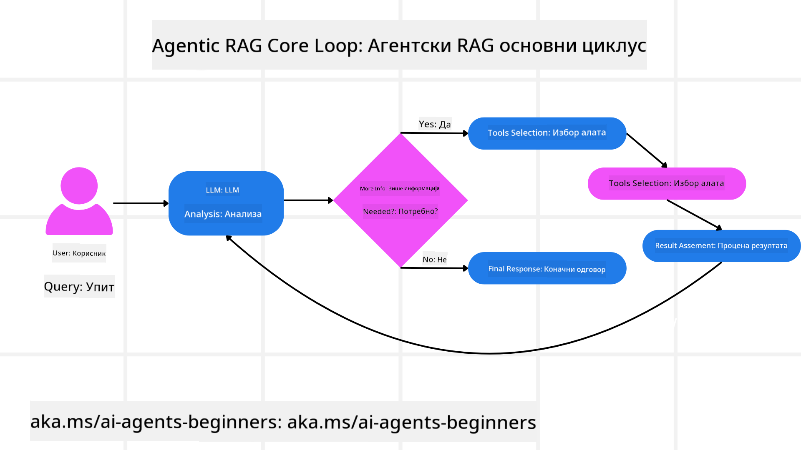
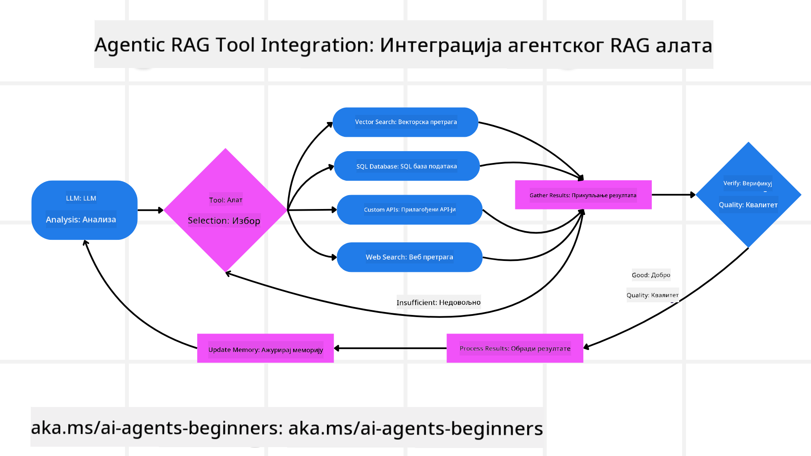
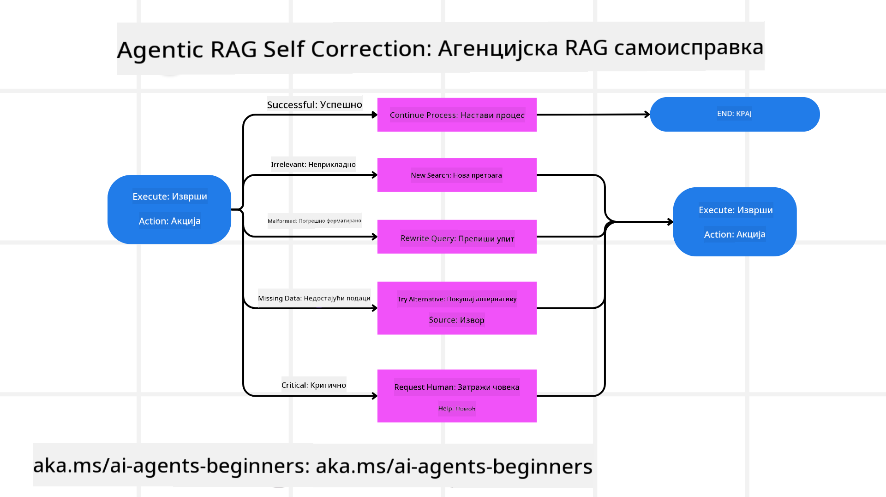

<!--
CO_OP_TRANSLATOR_METADATA:
{
  "original_hash": "d2f04b783b9e1253100329afd698f8ff",
  "translation_date": "2025-08-30T08:55:03+00:00",
  "source_file": "05-agentic-rag/README.md",
  "language_code": "sr"
}
-->

> _(Кликните на слику изнад да бисте погледали видео овог часа)_

# Агентски RAG

Овај час пружа свеобухватан преглед Агентског Приступа Генерацији Уз Подршку Претраживања (Agentic RAG), новог АИ парадигме где велики језички модели (LLMs) аутономно планирају своје следеће кораке док прикупљају информације из спољашњих извора. За разлику од статичких образаца „претражи па прочитај“, Агентски RAG укључује итеративне позиве LLM-у, испреплетене са позивима алата или функција и структурисаним излазима. Систем процењује резултате, прецизира упите, позива додатне алате ако је потребно и наставља овај циклус док се не постигне задовољавајуће решење.

## Увод

Овај час ће обухватити:

- **Разумевање Агентског RAG-а:** Упознајте се са новом парадигмом у АИ где велики језички модели (LLMs) аутономно планирају своје следеће кораке док прикупљају информације из спољашњих извора података.
- **Схватање итеративног Maker-Checker стила:** Разумите циклус итеративних позива LLM-у, испреплетених са позивима алата или функција и структурисаним излазима, дизајнираних да побољшају тачност и реше неисправне упите.
- **Истраживање практичних примена:** Идентификујте сценарије у којима Агентски RAG блиста, као што су окружења где је тачност приоритет, сложене интеракције са базама података и проширени токови рада.

## Циљеви учења

Након завршетка овог часа, знаћете како да/разумете:

- **Разумевање Агентског RAG-а:** Упознајте се са новом парадигмом у АИ где велики језички модели (LLMs) аутономно планирају своје следеће кораке док прикупљају информације из спољашњих извора података.
- **Итеративни Maker-Checker стил:** Схватите концепт циклуса итеративних позива LLM-у, испреплетених са позивима алата или функција и структурисаним излазима, дизајнираних да побољшају тачност и реше неисправне упите.
- **Поседовање процеса размишљања:** Разумите способност система да самостално управља својим процесом размишљања, доносећи одлуке о томе како да приступи проблемима без ослањања на унапред дефинисане путеве.
- **Ток рада:** Разумите како агентски модел самостално одлучује да прикупи извештаје о тржишним трендовима, идентификује податке о конкурентима, корелира интерне продајне метрике, синтетише налазе и процењује стратегију.
- **Итеративни циклуси, интеграција алата и меморија:** Упознајте се са ослањањем система на обрасце интеракције у циклусима, одржавањем стања и меморије током корака како би се избегли понављајући циклуси и донеле информисане одлуке.
- **Руковање модовима неуспеха и самокорекција:** Истражите робусне механизме самокорекције система, укључујући итерацију и поновно постављање упита, коришћење дијагностичких алата и ослањање на људски надзор када је потребно.
- **Границе аутономије:** Разумите ограничења Агентског RAG-а, са фокусом на доменску аутономију, зависност од инфраструктуре и поштовање заштитних мера.
- **Практични случајеви употребе и вредност:** Идентификујте сценарије у којима Агентски RAG блиста, као што су окружења где је тачност приоритет, сложене интеракције са базама података и проширени токови рада.
- **Управљање, транспарентност и поверење:** Упознајте се са значајем управљања и транспарентности, укључујући објашњиво размишљање, контролу пристрасности и људски надзор.

## Шта је Агентски RAG?

Агентски Приступ Генерацији Уз Подршку Претраживања (Agentic RAG) је нова АИ парадигма где велики језички модели (LLMs) аутономно планирају своје следеће кораке док прикупљају информације из спољашњих извора. За разлику од статичких образаца „претражи па прочитај“, Агентски RAG укључује итеративне позиве LLM-у, испреплетене са позивима алата или функција и структурисаним излазима. Систем процењује резултате, прецизира упите, позива додатне алате ако је потребно и наставља овај циклус док се не постигне задовољавајуће решење. Ова итеративна „maker-checker“ метода побољшава тачност, решава неисправне упите и осигурава висококвалитетне резултате.

Систем активно управља својим процесом размишљања, преписујући неуспеле упите, бирајући различите методе претраживања и интегришући више алата—као што су векторско претраживање у Azure AI Search, SQL базе података или прилагођени API-ји—пре него што финализује свој одговор. Посебна карактеристика агентског система је његова способност да самостално управља својим процесом размишљања. Традиционалне RAG имплементације ослањају се на унапред дефинисане путеве, али агентски систем аутономно одређује редослед корака на основу квалитета информација које пронађе.

## Дефинисање Агентског Приступа Генерацији Уз Подршку Претраживања (Agentic RAG)

Агентски Приступ Генерацији Уз Подршку Претраживања (Agentic RAG) је нова парадигма у развоју АИ где LLM-ови не само да прикупљају информације из спољашњих извора података већ и аутономно планирају своје следеће кораке. За разлику од статичких образаца „претражи па прочитај“ или пажљиво скриптованих секвенци упита, Агентски RAG укључује циклус итеративних позива LLM-у, испреплетених са позивима алата или функција и структурисаним излазима. На сваком кораку, систем процењује добијене резултате, одлучује да ли да прецизира упите, позива додатне алате ако је потребно и наставља овај циклус док не постигне задовољавајуће решење.

Ова итеративна „maker-checker“ метода рада дизајнирана је да побољша тачност, реши неисправне упите ка структурисаним базама података (нпр. NL2SQL) и осигура уравнотежене, висококвалитетне резултате. Уместо да се ослања искључиво на пажљиво осмишљене ланце упита, систем активно управља својим процесом размишљања. Може да препише неуспеле упите, изабере различите методе претраживања и интегрише више алата—као што су векторско претраживање у Azure AI Search, SQL базе података или прилагођени API-ји—пре него што финализује свој одговор. Ово уклања потребу за превише сложеним оквирима за оркестрацију. Уместо тога, релативно једноставан циклус „позив LLM-а → коришћење алата → позив LLM-а → …“ може дати софистициране и добро утемељене излазе.

## Управљање процесом размишљања

Посебна карактеристика која чини систем „агентским“ је његова способност да управља својим процесом размишљања. Традиционалне RAG имплементације често зависе од људи који унапред дефинишу пут за модел: ланац размишљања који одређује шта да се претражи и када.  
Али када је систем заиста агентски, он интерно одлучује како да приступи проблему. Не извршава само скрипту; аутономно одређује редослед корака на основу квалитета информација које пронађе.  
На пример, ако му се постави задатак да креира стратегију за лансирање производа, он се не ослања искључиво на упит који детаљно описује цео процес истраживања и доношења одлука. Уместо тога, агентски модел самостално одлучује да:

1. Прикупи извештаје о тренутним тржишним трендовима користећи Bing Web Grounding.
2. Идентификује релевантне податке о конкурентима користећи Azure AI Search.
3. Корелира историјске интерне продајне метрике користећи Azure SQL Database.
4. Синтетише налазе у кохезивну стратегију оркестрирану преко Azure OpenAI Service.
5. Процени стратегију за празнине или недоследности, иницирајући још један круг претраживања ако је потребно.  
Сви ови кораци—прецизирање упита, избор извора, итерација док се не постигне задовољавајући одговор—одлучује модел, а не човек који је унапред скриптовао процес.

## Итеративни циклуси, интеграција алата и меморија

Агентски систем се ослања на образац интеракције у циклусима:

- **Почетни позив:** Циљ корисника (тј. кориснички упит) се представља LLM-у.
- **Позив алата:** Ако модел идентификује недостајуће информације или нејасна упутства, бира алат или метод претраживања—као што је упит у векторску базу података (нпр. Azure AI Search Hybrid претраживање приватних података) или структурисани SQL позив—да би прикупио више контекста.
- **Процена и прецизирање:** Након прегледа враћених података, модел одлучује да ли су информације довољне. Ако нису, прецизира упит, испробава други алат или прилагођава свој приступ.
- **Понављање док не буде задовољан:** Овај циклус се наставља док модел не одлучи да има довољно јасноће и доказа да испоручи коначан, добро образложен одговор.
- **Меморија и стање:** Пошто систем одржава стање и меморију током корака, може да се сети претходних покушаја и њихових исхода, избегавајући понављајуће циклусе и доносећи информисаније одлуке како напредује.

Временом, ово ствара осећај еволуирајућег разумевања, омогућавајући моделу да се креће кроз сложене, вишестепене задатке без потребе за сталном људском интервенцијом или преобликовањем упита.

## Руковање модовима неуспеха и самокорекција

Аутономија Агентског RAG-а такође укључује робусне механизме самокорекције. Када систем наиђе на ћорсокак—као што је прикупљање ирелевантних докумената или наилазак на неисправне упите—може:

- **Итерација и поновно постављање упита:** Уместо да врати одговоре ниске вредности, модел покушава нове стратегије претраживања, преписује упите за базу података или истражује алтернативне скупове података.
- **Коришћење дијагностичких алата:** Систем може позвати додатне функције дизајниране да му помогну у отклањању грешака у корацима размишљања или потврди тачност прикупљених података. Алати као што је Azure AI Tracing биће важни за омогућавање робусне посматраности и праћења.
- **Ослањање на људски надзор:** За задатке високог ризика или сценарије који се понављају, модел може означити несигурност и затражити људско вођење. Када човек пружи корективне повратне информације, модел може да укључи ту лекцију у будућности.

Ова итеративна и динамична метода омогућава моделу да се континуирано побољшава, осигуравајући да није само систем за једнократну употребу, већ онај који учи из својих грешака током одређене сесије.

## Границе аутономије

Упркос својој аутономији у оквиру задатка, Агентски RAG није аналоган Вештачкој Општој Интелигенцији. Његове „агентске“ способности су ограничене на алате, изворе података и политике које су обезбедили људски програмери. Не може самостално измишљати нове алате или излазити изван граница домена који су постављени. Уместо тога, одличан је у динамичкој оркестрацији расположивих ресурса.  
Кључне разлике у односу на напредније облике АИ укључују:

1. **Аутономија специфична за домен:** Агентски RAG системи су фокусирани на постизање циљева које је дефинисао корисник унутар познатог домена, користећи стратегије као што су преписивање упита или избор алата за побољшање резултата.
2. **Зависност од инфраструктуре:** Способности система зависе од алата и података које су интегрисали програмери. Не може превазићи ове границе без људске интервенције.
3. **Поштовање заштитних мера:** Етичке смернице, правила усклађености и пословне политике остају веома важне. Слобода агента је увек ограничена безбедносним мерама и механизмима надзора (надамо се?).

## Практични случајеви употребе и вредност

Агентски RAG блиста у сценаријима који захтевају итеративно прецизирање и прецизност:

1. **Окружења где је тачност приоритет:** У проверама усклађености, регулаторним анализама или правним истраживањима, агентски модел може више пута проверавати чињенице, консултовати више извора и преписивати упите док не произведе темељно проверен одговор.
2. **Сложене интеракције са базама података:** Када се ради са структурисаним подацима где упити често могу да не успеју или захтевају прилагођавање, систем може аутономно прецизирати своје упите користећи Azure SQL или Microsoft Fabric OneLake, осигуравајући да коначни резултат одговара намери корисника.
3. **Проширени токови рада:** Дужи токови рада могу се развијати како се појављују нове информације. Агентски RAG може конт
<a href="https://learn.microsoft.com/training/modules/use-own-data-azure-openai" target="_blank">
Примена Retrieval Augmented Generation (RAG) са Azure OpenAI Service: Научите како да користите сопствене податке са Azure OpenAI Service. Овај Microsoft Learn модул пружа свеобухватан водич за имплементацију RAG-а  
- <a href="https://learn.microsoft.com/azure/ai-studio/concepts/evaluation-approach-gen-ai" target="_blank">Евалуација генеративних AI апликација са Azure AI Foundry: Овај чланак обухвата евалуацију и поређење модела на јавно доступним скуповима података, укључујући Agentic AI апликације и RAG архитектуре</a>  
- <a href="https://weaviate.io/blog/what-is-agentic-rag" target="_blank">Шта је Agentic RAG | Weaviate</a>  
- <a href="https://ragaboutit.com/agentic-rag-a-complete-guide-to-agent-based-retrieval-augmented-generation/" target="_blank">Agentic RAG: Комплетан водич за генерацију засновану на агентима – Вести из света RAG-а</a>  
- <a href="https://huggingface.co/learn/cookbook/agent_rag" target="_blank">Agentic RAG: убрзајте свој RAG са реформулацијом упита и само-упитима! Hugging Face Open-Source AI Cookbook</a>  
- <a href="https://youtu.be/aQ4yQXeB1Ss?si=2HUqBzHoeB5tR04U" target="_blank">Додавање Agentic слојева у RAG</a>  
- <a href="https://www.youtube.com/watch?v=zeAyuLc_f3Q&t=244s" target="_blank">Будућност асистената за знање: Џери Лиу</a>  
- <a href="https://www.youtube.com/watch?v=AOSjiXP1jmQ" target="_blank">Како изградити Agentic RAG системе</a>  
- <a href="https://ignite.microsoft.com/sessions/BRK102?source=sessions" target="_blank">Коришћење Azure AI Foundry Agent Service за скалирање ваших AI агената</a>  

### Академски радови  

- <a href="https://arxiv.org/abs/2303.17651" target="_blank">2303.17651 Self-Refine: Итерирајуће усавршавање са само-повратним информацијама</a>  
- <a href="https://arxiv.org/abs/2303.11366" target="_blank">2303.11366 Reflexion: Језички агенти са вербалним учењем путем појачања</a>  
- <a href="https://arxiv.org/abs/2305.11738" target="_blank">2305.11738 CRITIC: Велики језички модели могу се само-кориговати уз интерактивно критиковање алатима</a>  
- <a href="https://arxiv.org/abs/2501.09136" target="_blank">2501.09136 Agentic Retrieval-Augmented Generation: Преглед Agentic RAG-а</a>  

## Претходна лекција  

[Шаблон за дизајн коришћења алата](../04-tool-use/README.md)  

## Наредна лекција  

[Изградња поузданих AI агената](../06-building-trustworthy-agents/README.md)  

---

**Одрицање од одговорности**:  
Овај документ је преведен коришћењем услуге за превођење помоћу вештачке интелигенције [Co-op Translator](https://github.com/Azure/co-op-translator). Иако се трудимо да превод буде тачан, молимо вас да имате у виду да аутоматизовани преводи могу садржати грешке или нетачности. Оригинални документ на његовом изворном језику треба сматрати меродавним извором. За критичне информације препоручује се професионални превод од стране људи. Не преузимамо одговорност за било каква погрешна тумачења или неспоразуме који могу настати услед коришћења овог превода.