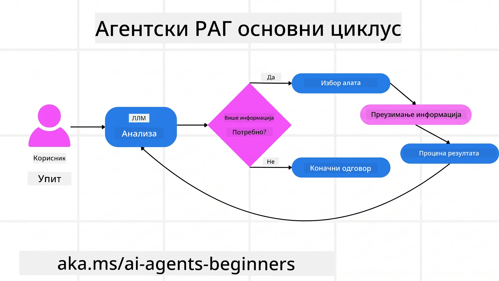
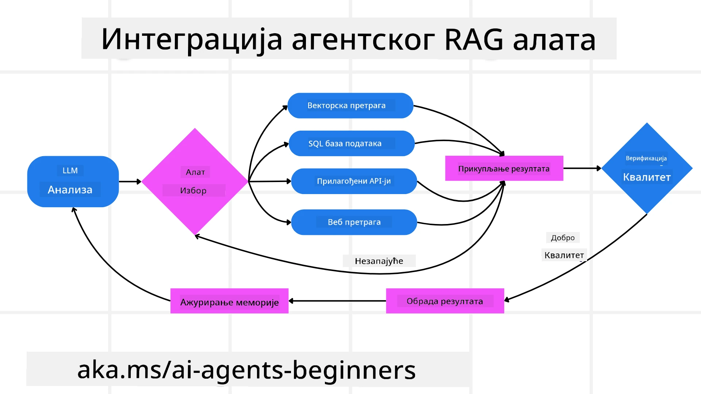
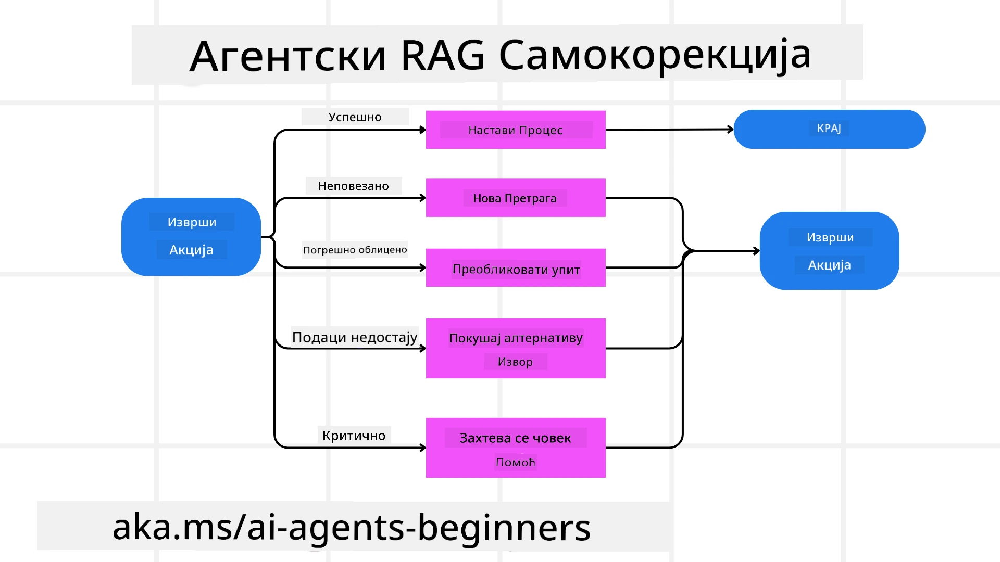
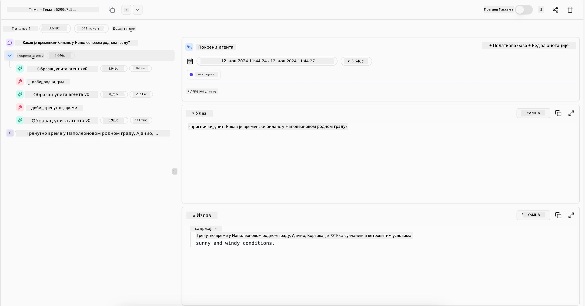

> _(Кликните на слику изнад да бисте гледали видео о овом часу)_

# Agentic RAG

Овај час пружа свеобухватан преглед Agentic Retrieval-Augmented Generation (Agentic RAG), новог парадигмата вештачке интелигенције где велико језичко модели (LLM) аутономно планирају своје наредне кораке док повлаче информације из спољних извора. За разлику од статичних шаблона „преузми па прочитај“, Agentic RAG укључује итеративне позиве LLM-у, испреплетене позивима алатки или функција и структурираним излазима. Систем процењује резултате, усавршава упите, позива додатне алатке ако је потребно и наставља овај циклус док не постигне задовољавајуће решење.

## Увод

На овом часу ће бити покривено

- **Разумевање Agentic RAG:** Упознајте нови парадигмат у ИИ у коме LLM аутономно планирају своје следеће кораке док повлаче информације из спољних извора података.
- **Разумевање итеративног Maker-Checker стила:** Схватите петљу итеративних позива LLM-у, испреплетену позивима алатки или функција и структурираним излазима, дизајнирану да побољша прецизност и рукује неисправним упитима.
- **Истраживање практичних примена:** Идентификујте сценарије у којима Agentic RAG сјаји, као што су окружења са приоритетом на исправности, сложене интеракције са базама података и продужени радни токови.

## Циљеви учења

Након завршетка овог часа, знаћете како да/разумете:

- **Разумевање Agentic RAG:** Учите о новом парадигмату у ИИ где LLM аутономно планирају своје следеће кораке док повлаче информације из спољних извора података.
- **Итеративни Maker-Checker стил:** Схватите концепт петље итеративних позива LLM-у, испреплетене позивима алатки или функција и структурираним излазима, дизајниране да побољша исправност и рукује неисправним упитима.
- **Поседовање процеса расуђивања:** Разумите способност система да поседује свој процес размишљања, доносећи одлуке о томе како приступити проблемима без ослањања на унапред дефинисане путеве.
- **Радни ток:** Разумите како агенцијски модел независно одлучује да преузме извештаје о тржишним трендовима, идентификује податке конкуренције, корелира интерне метрике продаје, синтетише налазе и процењује стратегију.
- **Итеративне петље, интеграција алатки и меморија:** Учите о ослањању система на петљасти интерактивни образац, одржавајући стање и меморију кроз кораке како би се избегле понављајуће петље и доносиле информисане одлуке.
- **Рукавање стањима неуспеха и само-корекција:** Истражите робусне механизме само-корекције система, укључујући итерацију и поновно упитивање, коришћење дијагностичких алатки и ослањање на људски надзор.
- **Границе агенције:** Разумите ограничења Agentic RAG, фокусирајући се на доменску аутономију, зависност од инфраструктуре и поштовање ограничења.
- **Практичне употребе и вредност:** Идентификујте сценарије где Agentic RAG сјаји, као што су окружења са приоритетом на исправности, сложене интеракције са базама података и продужени радни токови.
- **Управљање, транспарентност и поверење:** Учите о важности управљања и транспарентности, укључујући објашњиво расуђивање, контролу пристрасности и људски надзор.

## Шта је Agentic RAG?

Agentic Retrieval-Augmented Generation (Agentic RAG) је нови парадигмат у ИИ где велики језички модели аутономно планирају своје следеће кораке док повлаче информације из спољних извора. За разлику од статичних шаблона „преузми па прочитај“, Agentic RAG укључује итеративне позиве LLM-у, испреплетене позивима алатки или функција и структурираним излазима. Систем процењује резултате, усавршава упите, позива додатне алатке ако је потребно и наставља овај циклус док не постигне задовољавајуће решење. Овај итеративни „maker-checker“ стил побољшава исправност, рукује неисправним упитима и обезбеђује резултате високог квалитета.

Систем активно поседује свој процес расуђивања, преписујући неуспеле упите, бирајући различите методе преузимања и интегришући више алатки — као што су претрага вектора у Azure AI Search, SQL базе података или прилагођени API-ји — пре него што финализује свој одговор. Карактеристична особина агенцијског система је његова способност да поседује процес расуђивања. Традиционалне RAG имплементације ослањају се на унапред дефинисане путеве, али агенцијски систем аутономно одлучује редослед корака заснован на квалитету информација које пронађе.

## Дефинисање Agentic Retrieval-Augmented Generation (Agentic RAG)

Agentic Retrieval-Augmented Generation (Agentic RAG) је нови парадигмат у развоју вештачке интелигенције у коме LLM не само да повлаче информације из спољних извора података већ и аутономно планирају своје наредне кораке. За разлику од статичних шаблона „преузми па прочитај“ или пажљиво скриптованих секвенци упита, Agentic RAG укључује петљу итеративних позива LLM-у, испреплетену позивима алатки или функција и структурираним излазима. На сваком кораку, систем процењује резултате које је добио, одлучује да ли ће усавршити упите, позива додатне алатке ако је потребно и наставља овај циклус док не постигне задовољавајуће решење.

Овај итеративни „maker-checker“ стил рада је дизајниран да побољша исправност, рукује неисправним упитима у структурисаним базама података (нпр. NL2SQL) и обезбеди уравнотежене, квалитетне резултате. Уместо да се ослања искључиво на пажљиво осмишљене ланаце упита, систем активно поседује свој процес расуђивања. Може преписивати упите који не успеју, бирати различите методе претраге и интегрисати више алатки — као што су претрага вектора у Azure AI Search, SQL базе или прилагођени API-ји — пре него што финализује свој одговор. Ово уклања потребу за превише сложеним оквирима за оркестрацију. Уместо тога, релативно једноставна петља „LLM позив → коришћење алата → LLM позив → …“ може произвести сложене и добро утемељене излазе.

## Поседовање процеса расуђивања

Карактеристична особина која систем чини „агенцијским“ је његова способност да поседује свој процес расуђивања. Традиционалне RAG имплементације често зависе од људи који унапред дефинишу моделу пут: ланац мисли који наводи шта и када треба преузети.
Али када је систем заправо агенцијски, он унутрашње одлучује како да приступи проблему. Не извршава само скрипту; он аутономно одређује редослед корака заснован на квалитету информација које пронађе.
На пример, ако му се затражи да створи стратегију лансирања производа, он се не ослања искључиво на упит који описује цео истраживачки и одлучивачки ток рада. Уместо тога, агенцијски модел независно одлучује да:

1. Преузме актуелне извештаје о тржишним трендовима користећи Bing Web Grounding
2. Идентификује релевантне податке о конкуренцији користећи Azure AI Search.
3.	Корелира историјске интерне метрике продаје користећи Azure SQL Database.
4. Синтетише налазе у кохерентну стратегију коју координише Azure OpenAI Service.
5.	Процени стратегију ради празнина или недоследности и, ако је потребно, покреће још један круг преузимања података.
Сви ови кораци — усавршавање упита, бирање извора, итерација док не буде „задовољан“ одговором — доносе се од стране модела, а не унапред скриптовано од стране човека.

## Итеративне петље, интеграција алата и меморија

Агенцијски систем ослања се на петљасти интерактивни образац:

- **Почетни позив:** Циљ корисника (такође познат као кориснички упит) представља се LLM-у.
- **Позив алатки:** Ако модел идентификује да недостају информације или су упутства нејасна, он бира алат или метод преузимања — као што је упит у бази вектора (нпр. Azure AI Search Хибридна претрага преко приватних података) или структурисани SQL позив — да прикупи више контекста.
- **Процена и усавршавање:** Након прегледа повратних података, модел одлучује да ли су информације довољне. Ако нису, усавршава упит, покушава други алат или мења свој приступ.
- **Понављај док не буде задовољан:** Овај циклус се наставља док модел не одлучи да има довољно јасноће и доказа да испоручи коначни, добро објашњени одговор.
- **Меморија и стање:** Пошто систем одржава стање и меморију кроз кораке, може се сетити претходних покушаја и њихових резултата, избегавајући понављајуће петље и донети информисаније одлуке док напредује.

Временом, то ствара осећај развијајућег разумевања, омогућавајући моделу да навигира сложеним, вишестепеним задацима без потребе да човек стално интервенише или мења упит.

## Руководство неуспесима и само-корекција

Аутономија Agentic RAG обухвата и робусне механизме само-корекције. Када систем наиђе на застој — као што је преузимање ирелевантних докумената или сусретање са неисправним упитима — може:

- **Итерација и поновно упитивање:** Уместо да враћа ниске вредности одговоре, модел покушава нове стратегије претраге, преписује упите базе података или прегледа алтернативне скупове података.
- **Коришћење дијагностичких алата:** Систем може позвати додатне функције дизајниране да му помогну у дебаговању корака расуђивања или потврди исправност преузетих података. Алатке као што су Azure AI Tracing биће важне за омогућавање робусне видљивости и надзора.
- **Ослањање на људски надзор:** За сценарије са високим ризиком или понављајућим неуспесима, модел може означити неизвесност и затражити људско вођење. Када човек пружи корективну повратну информацију, модел може укључити ту лекцију убудуће.

Овај итеративни и динамични приступ омогућава моделу континуирано побољшање, обезбеђујући да није само систем једнократног позива већ онај који учи из својих грешака током дате сесије.

## Границе агенције

Упркос својој аутономији у оквиру задатка, Agentic RAG није синоним за Општу вештачку интелигенцију. Његове „агенцијске“ способности ограничене су алатима, изворима података и политикама које обезбеђују људски програмери. Не може измишљати своје алатке нити излазити изван граница домена које су постављене. Међутим, одличан је у динамичкој оркестрацији расположивих ресурса.
Кључне разлике у односу на напредније облике ИИ укључују:

1. **Домен-специфична аутономија:** Agentic RAG системи су фокусирани на постизање кориснички дефинисаних циљева у познатом домену, користећи стратегије као што су преписивање упита или одабир алата за побољшање резултата.
2. **Зависност од инфраструктуре:** Системске способности зависе од алата и података које интегришу програмери. Не може превазићи те границе без људске интервенције.
3. **Поштовање ограничења:** Етички принципи, правила усаглашености и пословне политике остају веома важни. Слобода агента је увек ограничена мерама безбедности и механизамима надзора (надајмо се).

## Практичне употребе и вредност

Agentic RAG сјаји у ситуацијама које захтевају итеративно усавршавање и прецизност:

1. **Окружења са приоритетом на исправности:** У проверама усаглашености, регулаторним анализама или правним истраживањима, агенцијски модел може више пута проверавати чињенице, консултовати више извора и преписивати упите док не произведе темељно провераван одговор.
2. **Сложене интеракције са базама података:** Када се ради са структурисаним подацима где упити често могу пропасти или захтевати прилагођавање, систем може аутономно усавршити упите користећи Azure SQL или Microsoft Fabric OneLake, обезбеђујући да коначно преузимање буде у складу са намерама корисника.
3. **Продужени радни токови:** Дужи сесијски задаци могу се развијати како нове информације постају доступне. Agentic RAG може континуирано укључивати нове податке, мењајући стратегије док учи више о простору проблема.

## Управљање, транспарентност и поверење

Како ови системи постају све аутономнији у свом расуђивању, управљање и транспарентност су кључни:

- **Објашњиво расуђивање:** Модел може пружити евиденцију упита које је направио, извора које је консултовао и корака расуђивања који су довели до закључка. Алатке као што су Azure AI Content Safety и Azure AI Tracing / GenAIOps могу помоћи у одржавању транспарентности и смањењу ризика.
- **Контрола пристрасности и уравнотежено преузимање:** Програмери могу подешавати стратегије преузимања како би осигурали да се узимају у обзир уравнотежени, представнички извори података и редовно ревидирати излазе како би открили пристрасност или искривљене шаблоне помоћу прилагођених модела за напредне организације за науку о подацима које користе Azure Machine Learning.
- **Људски надзор и усаглашеност:** За осетљиве задатке, људска контрола остаје неопходна. Agentic RAG не замењује људски суд у одлукама великог значаја — он га допуњује пружајући темељније проверене опције.

Поседовање алатки које пружају јасан запис радњи је од суштинске важности. Без њих, дебаговање вишестепеног процеса може бити веома тешко. Погледајте следећи пример из Literal AI (компаније иза Chainlit) за покретање агента:

## Закључак

Agentic RAG представља природну еволуцију у начину на који ИИ системи обрађују сложене, подацима интензивне задатке. Усвајањем петљастог интерактивног образца, аутономним избором алата и усавршавањем упита док не постигне квалитетан резултат, систем превазилази статичко праћење упита у више прилагодљивог, контекстуално свесног доносиоца одлука. Док је још увек ограничен људски дефинисаном инфраструктуром и етичким принципима, ове агенцијске способности омогућавају богатије, динамичније и коначено корисније ИИ интеракције како за предузећа тако и за крајње кориснике.

### Имате ли још питања о Agentic RAG?

Придружите се [Microsoft Foundry Discord](https://discord.com/invite/ATgtXmAS5D) да бисте се срели са другим учесницима, присуствовали радним сатима и добили одговоре на питања о вашим AI агентима.

## Додатни ресурси

- <a href="https://learn.microsoft.com/training/modules/use-own-data-azure-openai" target="_blank">Имплементација Retrieval Augmented Generation (RAG) са Azure OpenAI Service: Научите како да користите своје податке са Azure OpenAI Service. Ова Microsoft Learn модула пружа свеобухватан водич за имплементацију RAG</a>
- <a href="https://learn.microsoft.com/azure/ai-studio/concepts/evaluation-approach-gen-ai" target="_blank">Евалуација генеративних AI апликација са Microsoft Foundry: Овај чланак покрива евалуацију и поређење модела на јавним скупова података, укључујући Agentic AI апликације и RAG архитектуре</a>
- <a href="https://weaviate.io/blog/what-is-agentic-rag" target="_blank">Шта је Agentic RAG | Weaviate</a>
- <a href="https://ragaboutit.com/agentic-rag-a-complete-guide-to-agent-based-retrieval-augmented-generation/" target="_blank">Agentic RAG: Потпун водич за агенцијски заснован Retrieval Augmented Generation – News from generation RAG</a>

- <a href="https://huggingface.co/learn/cookbook/agent_rag" target="_blank">Агентски RAG: убрзајте свој RAG помоћу преправљања упита и самоупита! Hugging Face Open-Source AI Cookbook</a>
- <a href="https://youtu.be/aQ4yQXeB1Ss?si=2HUqBzHoeB5tR04U" target="_blank">Додавање агенцких слојева RAG-у</a>
- <a href="https://www.youtube.com/watch?v=zeAyuLc_f3Q&t=244s" target="_blank">Будућност асистената за знање: Џери Лију</a>
- <a href="https://www.youtube.com/watch?v=AOSjiXP1jmQ" target="_blank">Како изградити агенцки RAG систем</a>
- <a href="https://ignite.microsoft.com/sessions/BRK102?source=sessions" target="_blank">Коришћење Microsoft Foundry Agent Service за скалирање ваших AI агената</a>

### Академски радови

- <a href="https://arxiv.org/abs/2303.17651" target="_blank">2303.17651 Self-Refine: Итеративно усавршавање уз самоповратне информације</a>
- <a href="https://arxiv.org/abs/2303.11366" target="_blank">2303.11366 Reflexion: Језички агенти са вербалним појачањем учења</a>
- <a href="https://arxiv.org/abs/2305.11738" target="_blank">2305.11738 CRITIC: Велики језички модели могу сами себе исправљати помоћу алатки за интерактивну критику</a>
- <a href="https://arxiv.org/abs/2501.09136" target="_blank">2501.09136 Агентски препород заснован на генерацији: Преглед агентског RAG-а</a>

## Претходна лекција

[Дизајн шаблона за коришћење алата](../04-tool-use/README.md)

## Следећа лекција

[Изградња поузданих AI агената](../06-building-trustworthy-agents/README.md)

---

<!-- CO-OP TRANSLATOR DISCLAIMER START -->
**Изјава о одрицању одговорности**:
Овај документ је преведен коришћењем услуге за аутоматски превод [Co-op Translator](https://github.com/Azure/co-op-translator). Иако тежимо тачности, имајте у виду да аутоматски преводи могу садржати грешке или нетачности. Оригинални документ на његовом изворном језику треба сматрати ауторитативним извором. За критичне информације препоручује се професионални људски превод. Нисмо одговорни за било каква неспоразума или погрешна тумачења која произилазе из коришћења овог превода.
<!-- CO-OP TRANSLATOR DISCLAIMER END -->