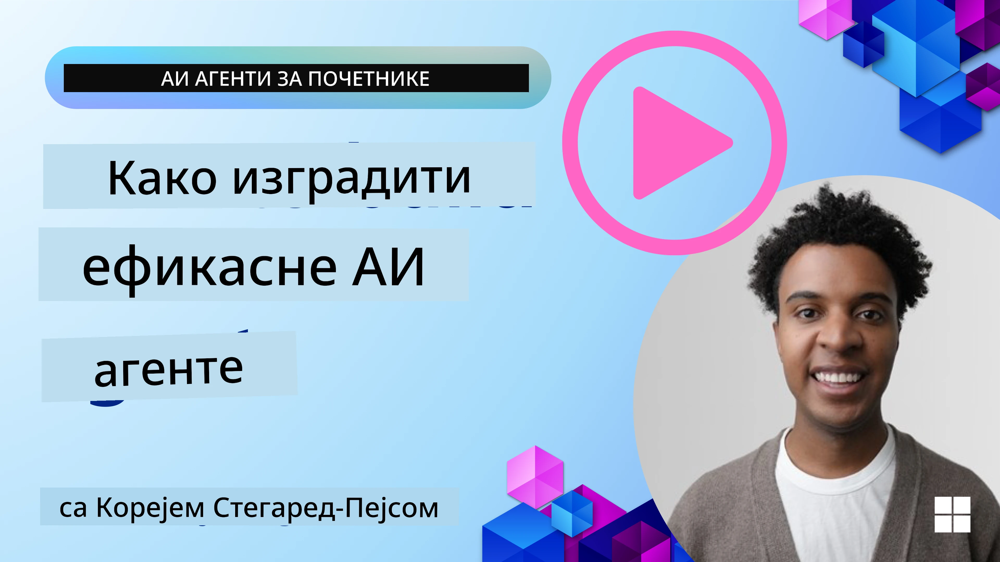
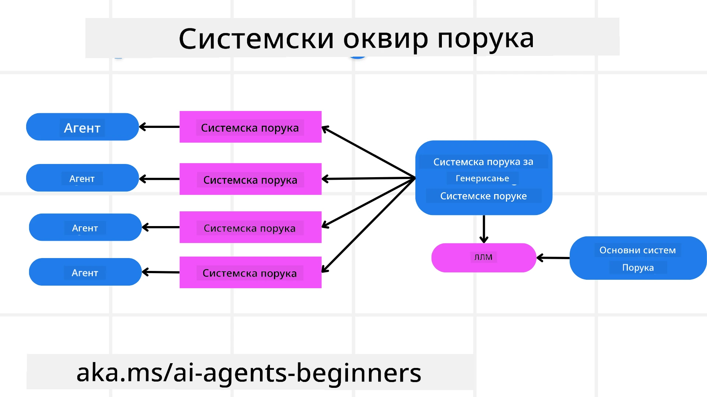
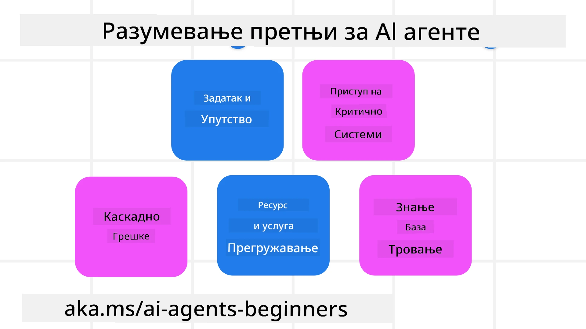
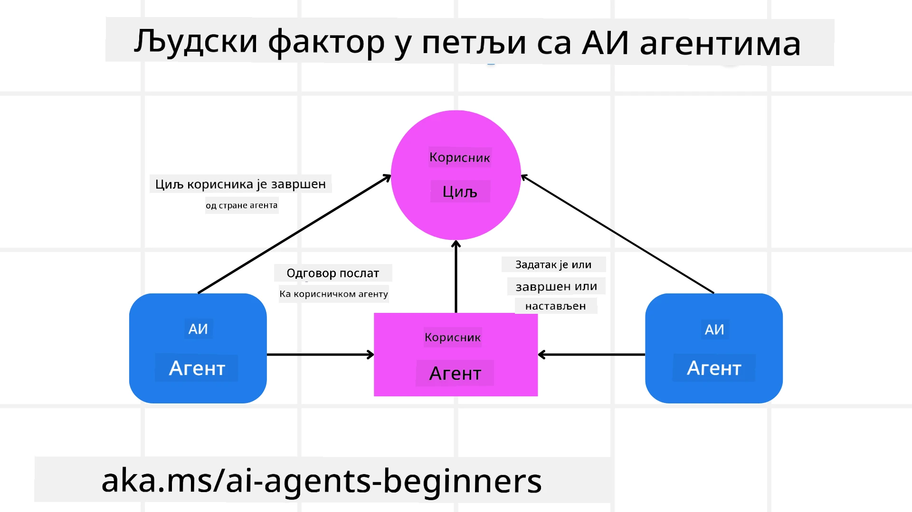

[](https://youtu.be/iZKkMEGBCUQ?si=Q-kEbcyHUMPoHp8L)

> _(Кликните на слику изнад да бисте погледали видео о овом часу)_

# Изградња поузданих AI агената

## Увод

Овај час ће обухватити:

- Како изградити и имплементирати безбедне и ефикасне AI агенте
- Важна безбедносна разматрања при развоју AI агената.
- Како одржавати приватност података и корисника при развоју AI агената.

## Циљеви учења

Након завршетка овог часа, знате како да:

- Идентификујете и ублажите ризике при креирању AI агената.
- Имплементирате мере безбедности да бисте осигурали правилно управљање подацима и приступом.
- Креирате AI агенте који одржавају приватност података и пружају квалитетно корисничко искуство.

## Безбедност

Прво да погледамо изградњу безбедних агентских апликација. Безбедност значи да AI агент функционише како је дизајниран. Као творци агентских апликација, имамо методе и алате да максимизирамо безбедност:

### Изградња оквира системске поруке

Ако сте икада градили AI апликацију користећи великe језичке моделе (LLM), знате колико је важно дизајнирати робустан системски упит или системску поруку. Ови упити постављају мета правила, инструкције и смернице о томе како ће LLM комуницирати са корисником и подацима.

За AI агенте, системски упит је још важнији јер ће AI агенти захтевати врло специфична упутства да заврше задатке које смо им дизајнирали.

За креирање скалабилних системских упита можемо користити оквир системске поруке за изградњу једног или више агената у нашој апликацији:



#### Корак 1: Креирајте мета системску поруку

Мета упит ће користити LLM за генерисање системских упита за агенте које креирамо. Дизајнирамо га као шаблон тако да можемо ефикасно креирати више агената ако је потребно.

Ево примера мета системске поруке коју бисмо дали LLM-у:

```plaintext
You are an expert at creating AI agent assistants. 
You will be provided a company name, role, responsibilities and other
information that you will use to provide a system prompt for.
To create the system prompt, be descriptive as possible and provide a structure that a system using an LLM can better understand the role and responsibilities of the AI assistant. 
```

#### Корак 2: Креирајте основни упит

Следећи корак је да направите основни упит који описује AI агента. Требало би да укључите улогу агента, задатке које ће агент обавити и друге одговорности агента.

Ево примера:

```plaintext
You are a travel agent for Contoso Travel that is great at booking flights for customers. To help customers you can perform the following tasks: lookup available flights, book flights, ask for preferences in seating and times for flights, cancel any previously booked flights and alert customers on any delays or cancellations of flights.  
```

#### Корак 3: Пружите Основну Системску Поруку LLM-у

Сада можемо оптимизовати ову системску поруку тако што ћемо дати мета системску поруку као системску поруку заједно са нашом основном системском поруком.

Ово ће произвести системску поруку која је боље дизајнирана да усмерава наше AI агенте:

```markdown
**Company Name:** Contoso Travel  
**Role:** Travel Agent Assistant

**Objective:**  
You are an AI-powered travel agent assistant for Contoso Travel, specializing in booking flights and providing exceptional customer service. Your main goal is to assist customers in finding, booking, and managing their flights, all while ensuring that their preferences and needs are met efficiently.

**Key Responsibilities:**

1. **Flight Lookup:**
    
    - Assist customers in searching for available flights based on their specified destination, dates, and any other relevant preferences.
    - Provide a list of options, including flight times, airlines, layovers, and pricing.
2. **Flight Booking:**
    
    - Facilitate the booking of flights for customers, ensuring that all details are correctly entered into the system.
    - Confirm bookings and provide customers with their itinerary, including confirmation numbers and any other pertinent information.
3. **Customer Preference Inquiry:**
    
    - Actively ask customers for their preferences regarding seating (e.g., aisle, window, extra legroom) and preferred times for flights (e.g., morning, afternoon, evening).
    - Record these preferences for future reference and tailor suggestions accordingly.
4. **Flight Cancellation:**
    
    - Assist customers in canceling previously booked flights if needed, following company policies and procedures.
    - Notify customers of any necessary refunds or additional steps that may be required for cancellations.
5. **Flight Monitoring:**
    
    - Monitor the status of booked flights and alert customers in real-time about any delays, cancellations, or changes to their flight schedule.
    - Provide updates through preferred communication channels (e.g., email, SMS) as needed.

**Tone and Style:**

- Maintain a friendly, professional, and approachable demeanor in all interactions with customers.
- Ensure that all communication is clear, informative, and tailored to the customer's specific needs and inquiries.

**User Interaction Instructions:**

- Respond to customer queries promptly and accurately.
- Use a conversational style while ensuring professionalism.
- Prioritize customer satisfaction by being attentive, empathetic, and proactive in all assistance provided.

**Additional Notes:**

- Stay updated on any changes to airline policies, travel restrictions, and other relevant information that could impact flight bookings and customer experience.
- Use clear and concise language to explain options and processes, avoiding jargon where possible for better customer understanding.

This AI assistant is designed to streamline the flight booking process for customers of Contoso Travel, ensuring that all their travel needs are met efficiently and effectively.

```

#### Корак 4: Итерирајте и Побољшавајте

Вредност овог оквира системске поруке је у могућности да се скалабилно креирају системске поруке за више агената, као и да се временом побољшавају ваше системске поруке. Ретко кад ћете имати системску поруку која одмах ради за цео ваш случај употребе. Могућност да направите мале измене и побољшања мењањем основне системске поруке и њеним покретањем кроз систем омогућиће вам да упоредите и процените резултате.

## Разумевање претњи

Да бисте изградили поуздане AI агенте, важно је разумети и ублажити ризике и претње по ваш AI агент. Погледајмо само неке од различитих претњи AI агенатима и како боље можете планирати и припремити се за њих.



### Задатак и упутство

**Опис:** Нападачи покушавају да промене упутства или циљеве AI агента путем усмеравања или манипулације улазима.

**Ублажавање:** Спроведите валидационе провере и филтере улаза да бисте открили потенцијално опасне упите пре него што их AI агент обради. Пошто ови напади захтевају честу интеракцију са агентом, ограничавање броја корака у разговору је још један начин да се спрече ове врсте напада.

### Приступ критичним системима

**Опис:** Ако AI агент има приступ системима и услугама које чувају осетљиве податке, нападачи могу компромитовати комуникацију између агента и тих услуга. То могу бити директни напади или индиректни покушаји за добијање информација о овим системима преко агента.

**Ублажавање:** AI агенти треба да имају приступ системима само по потреби како би се спречиле ове врсте напада. Комуникација између агента и система такође треба да буде сигурна. Имплементација аутентификације и контроле приступа још је један начин заштите ових информација.

### Преоптерећење ресурса и услуга

**Опис:** AI агенти могу приступати различитим алатима и услугама да би завршили задатке. Нападачи могу искористити ову способност да нападну те услуге слањем великог броја захтева преко AI агента, што може резултирати отказом система или високим трошковима.

**Ублажавање:** Спроведите политике које ограничавају број захтева које AI агент може упутити некој услузи. Ограничење броја корака у разговору и захтева ка вашем AI агенту још је један начин спречавања ових напада.

### Тровање базе знања

**Опис:** Ова врста напада не циља директно AI агента већ базу знања и друге услуге које ће AI агент користити. Ово може укључивати корупцију података или информација које AI агент користи за обављање задатка, што доводи до пристрасних или нежељених одговора кориснику.

**Ублажавање:** Редовно вршити проверу података које AI агент користи у својим токовима рада. Обезбедити да приступ овим подацима буде сигуран и да их могу мењати само поуздане особе како би се избегла овакав тип напада.

### Каскадне грешке

**Опис:** AI агенти приступају различитим алатима и услугама ради обављања задатака. Грешке изазване нападачима могу довести до отказа других система којима је AI агент повезан, чинећи напад ширим и тежим за решавање.

**Ублажавање:** Један метод да се ово избегне јесте да AI агентом управља ограничено окружење, као што је извршавање задатака у Docker контејнеру, како би се спречили директни напади на систем. Креирање резервних механизама и логике поновног покушаја када одређени системи одговоре са грешком још је један начин спречавања већих отказа система.

## Човек у петљи

Још један ефикасан начин за изградњу поузданих AI агената је коришћење концепта Човека у петљи. Ово ствара ток у којем корисници могу да пружају повратне информације агентима током рада. Корисници у суштини делују као агенти у мулти-агентском систему пружајући одобрење или прекид процеса.



Ево исечка кода који користи Microsoft Agent Framework да покаже како се овај концепт имплементира:

```python
import os
from agent_framework.azure import AzureAIProjectAgentProvider
from azure.identity import AzureCliCredential

# Креирајте провајдера са одобрењем човека у петљи
provider = AzureAIProjectAgentProvider(
    credential=AzureCliCredential(),
)

# Креирајте агента са кораком одобрења од стране човека
response = provider.create_response(
    input="Write a 4-line poem about the ocean.",
    instructions="You are a helpful assistant. Ask for user approval before finalizing.",
)

# Корисник може прегледати и одобрити одговор
print(response.output_text)
user_input = input("Do you approve? (APPROVE/REJECT): ")
if user_input == "APPROVE":
    print("Response approved.")
else:
    print("Response rejected. Revising...")
```
 
## Закључак

Изградња поузданих AI агената захтева пажљив дизајн, робусне безбедносне мере и континуиран рад. Имплементирањем структурираних система мета усмеравања, разумевањем потенцијалних претњи и применом стратегија ублажавања, програмери могу креирати AI агенте који су и безбедни и ефикасни. Такође, укључивање човека у петљу осигурава да AI агенти остану усклађени са потребама корисника уз минимизовање ризика. Како AI наставља да се развија, одржавање проактивног приступа безбедности, приватности и етичким разматрањима биће кључно за неговање поверења и поузданости у системима које покреће AI.

### Имате ли још питања о Изградњи поузданих AI агената?

Придружите се [Microsoft Foundry Discord](https://aka.ms/ai-agents/discord) да упознате друге ученике, присуствујете радним сатима и добијете одговоре на ваша питања о AI агентима.

## Додатни ресурси

- <a href="https://learn.microsoft.com/azure/ai-studio/responsible-use-of-ai-overview" target="_blank">Преглед одговорне употребе AI</a>
- <a href="https://learn.microsoft.com/azure/ai-studio/concepts/evaluation-approach-gen-ai" target="_blank">Евалуација генеративних AI модела и AI апликација</a>
- <a href="https://learn.microsoft.com/azure/ai-services/openai/concepts/system-message?context=%2Fazure%2Fai-studio%2Fcontext%2Fcontext&tabs=top-techniques" target="_blank">Безбедносне системске поруке</a>
- <a href="https://blogs.microsoft.com/wp-content/uploads/prod/sites/5/2022/06/Microsoft-RAI-Impact-Assessment-Template.pdf?culture=en-us&country=us" target="_blank">Образац за процену ризика</a>

## Претходни час

[Agentic RAG](../05-agentic-rag/README.md)

## Следећи час

[Плански дизајн образац](../07-planning-design/README.md)

---

<!-- CO-OP TRANSLATOR DISCLAIMER START -->
**Одрицање од одговорности**:  
Овај документ је преведен коришћењем услуге за аутоматски превод [Co-op Translator](https://github.com/Azure/co-op-translator). Иако тежимо тачности, молимо имајте на уму да аутоматизовани преводи могу садржати грешке или нетачности. Изворни документ на његовом матерњем језику треба сматрати ауторитетним извором. За критичне информације препоручује се професионални превод од стране стручног лингвисте. Нисмо одговорни за било какве неспоразуме или погрешне интерпретације настале коришћењем овог превода.
<!-- CO-OP TRANSLATOR DISCLAIMER END -->