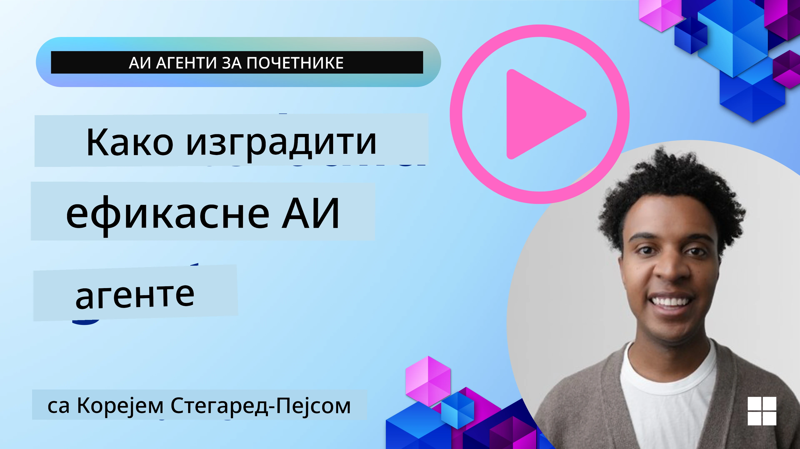
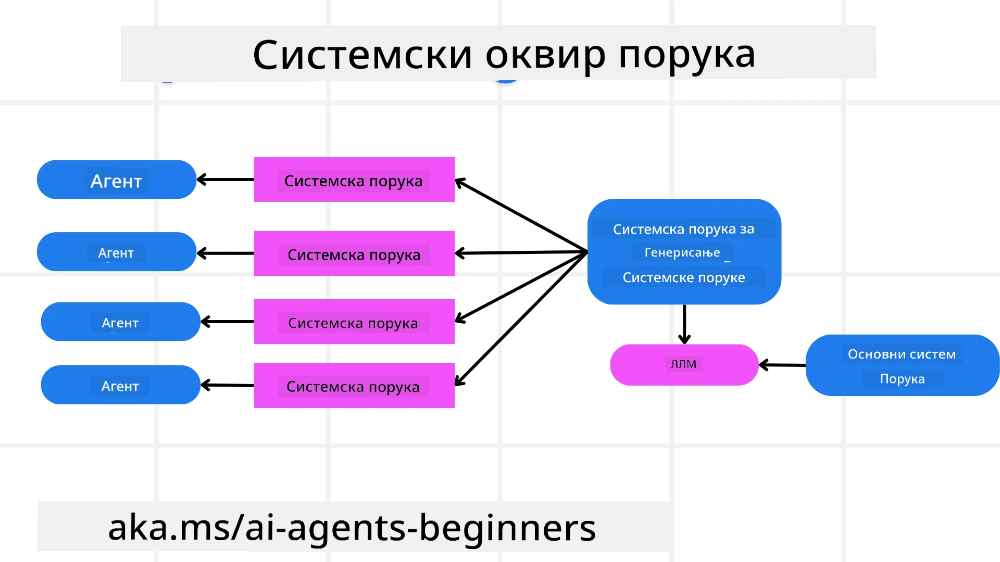
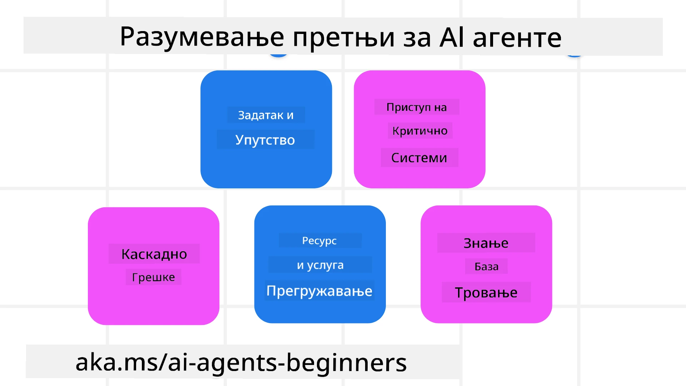
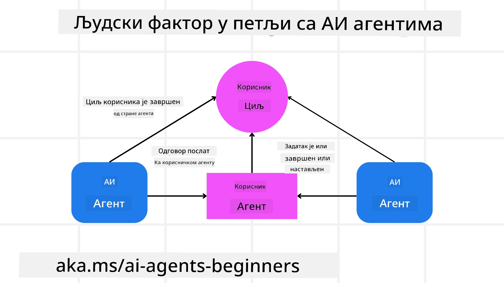

[](https://youtu.be/iZKkMEGBCUQ?si=Q-kEbcyHUMPoHp8L)

> _(Кликните на слику изнад да бисте гледали видео о овој лекцији)_

# Изградња поузданих АИ агената

## Увод

Ова лекција ће обухватити:

- Како изградити и имплементирати безбедне и ефикасне АИ агенте
- Важна безбедносна разматрања приликом развоја АИ агената.
- Како одржавати приватност података и корисника приликом развоја АИ агената.

## Циљеви учења

Након завршетка ове лекције, знаћете како да:

- Идентификујете и смањите ризике приликом креирања АИ агената.
- Спроведете безбедносне мере које обезбеђују правилно управљање подацима и приступом.
- Креирате АИ агенте који чувају приватност података и пружају квалитетан кориснички доживљај.

## Безбедност

Прво ћемо погледати како изградити безбедне агенцијске апликације. Безбедност значи да АИ агент функционише као што је предвиђено. Као творци агенцијских апликација, имамо методе и алате за максимизирање безбедности:

### Изградња оквира системске поруке

Ако сте икада правили АИ апликацију користећи велике језичке моделе (LLMs), знате колико је важно дизајнирати робустан системски промпт или системску поруку. Ови промпти постављају мета правила, упутства и смернице о томе како ће LLM комуницирати са корисником и подацима.

За АИ агенте, системски промпт је још важнији јер ће АИ агенти морати да добију јако специфична упутства како би обавили задатке које смо им доделили.

Да бисмо креирали скалабилне системске промпте, можемо користити оквир системске поруке за изградњу једног или више агената у нашој апликацији:



#### Корак 1: Креирајте мета системску поруку

Мета промпт ће користити LLM за генерисање системских промпта за агенте које креирамо. Дизајнирамо га као шаблон како бисмо ефикасно могли да направимо више агената ако је потребно.

Ево примера мета системске поруке коју бисмо дали LLM-у:

```plaintext
You are an expert at creating AI agent assistants. 
You will be provided a company name, role, responsibilities and other
information that you will use to provide a system prompt for.
To create the system prompt, be descriptive as possible and provide a structure that a system using an LLM can better understand the role and responsibilities of the AI assistant. 
```

#### Корак 2: Креирајте основни промпт

Следећи корак је креирати основни промпт који описује АИ агента. Требало би да укључите улогу агента, задатке које ће агент обављати и друге одговорности агента.

Ево примера:

```plaintext
You are a travel agent for Contoso Travel that is great at booking flights for customers. To help customers you can perform the following tasks: lookup available flights, book flights, ask for preferences in seating and times for flights, cancel any previously booked flights and alert customers on any delays or cancellations of flights.  
```

#### Корак 3: Пружите основну системску поруку LLM-у

Сада можемо оптимизовати ову системску поруку тако што ћемо као системску поруку пружити мета системску поруку и нашу основну системску поруку.

Ово ће произвести системску поруку која је боље дизајнирана за вођење наших АИ агената:

```markdown
**Company Name:** Contoso Travel  
**Role:** Travel Agent Assistant

**Objective:**  
You are an AI-powered travel agent assistant for Contoso Travel, specializing in booking flights and providing exceptional customer service. Your main goal is to assist customers in finding, booking, and managing their flights, all while ensuring that their preferences and needs are met efficiently.

**Key Responsibilities:**

1. **Flight Lookup:**
    
    - Assist customers in searching for available flights based on their specified destination, dates, and any other relevant preferences.
    - Provide a list of options, including flight times, airlines, layovers, and pricing.
2. **Flight Booking:**
    
    - Facilitate the booking of flights for customers, ensuring that all details are correctly entered into the system.
    - Confirm bookings and provide customers with their itinerary, including confirmation numbers and any other pertinent information.
3. **Customer Preference Inquiry:**
    
    - Actively ask customers for their preferences regarding seating (e.g., aisle, window, extra legroom) and preferred times for flights (e.g., morning, afternoon, evening).
    - Record these preferences for future reference and tailor suggestions accordingly.
4. **Flight Cancellation:**
    
    - Assist customers in canceling previously booked flights if needed, following company policies and procedures.
    - Notify customers of any necessary refunds or additional steps that may be required for cancellations.
5. **Flight Monitoring:**
    
    - Monitor the status of booked flights and alert customers in real-time about any delays, cancellations, or changes to their flight schedule.
    - Provide updates through preferred communication channels (e.g., email, SMS) as needed.

**Tone and Style:**

- Maintain a friendly, professional, and approachable demeanor in all interactions with customers.
- Ensure that all communication is clear, informative, and tailored to the customer's specific needs and inquiries.

**User Interaction Instructions:**

- Respond to customer queries promptly and accurately.
- Use a conversational style while ensuring professionalism.
- Prioritize customer satisfaction by being attentive, empathetic, and proactive in all assistance provided.

**Additional Notes:**

- Stay updated on any changes to airline policies, travel restrictions, and other relevant information that could impact flight bookings and customer experience.
- Use clear and concise language to explain options and processes, avoiding jargon where possible for better customer understanding.

This AI assistant is designed to streamline the flight booking process for customers of Contoso Travel, ensuring that all their travel needs are met efficiently and effectively.

```

#### Корак 4: Итерација и побољшавање

Вредност овог оквира системске поруке је да се може лакше скалабилно креирати системске поруке за више агената као и побољшавати системске поруке током времена. Ретко када ћете од првог пута имати системску поруку која ради савршено за цео ваш случај употребе. Могућност да направите мање измене и побољшања мењањем основне системске поруке и покретањем кроз систем омогућиће вам да упоредите и процените резултате.

## Разумевање претњи

Да бисте остварили поуздане АИ агенте, важно је разумети и умањити ризике и претње вашем АИ агенту. Погледајмо неке од различитих претњи АИ агентима и како боље да планирате и припремите за њих.



### Задатак и упутства

**Опис:** Нападачи покушавају да промене упутства или циљеве АИ агента преко промптовања или манипулације улазима.

**Умањење:** Извршите проверу валидности и филтере улаза да бисте открили потенцијално опасне промптеве пре него што их АИ агент обради. Пошто ови напади обично захтевају честу интеракцију са агентом, ограничење броја рунди у разговору је још један начин да се спрече ове врсте напада.

### Приступ критичним системима

**Опис:** Ако АИ агент има приступ системима и услугама које чувају осетљиве податке, нападачи могу компромитовати комуникацију између агента и тих услуга. Ово могу бити директни напади или индиректни покушаји да се преко агента дође до информација о тим системима.

**Умањење:** АИ агенти треба да имају приступ системима само када је потребно како би се спречиле ове врсте напада. Комуникација између агента и система такође треба да буде безбедна. Имплементација аутентификације и контроле приступа је још један начин да се заштите ове информације.

### Претрпавање ресурса и услуга

**Опис:** АИ агенти могу приступати различитим алатима и услугама ради обављања задатака. Нападачи могу злоупотребити ову могућност и напасти те услуге слањем великог броја захтева кроз АИ агента, што може изазвати кварове система или велике трошкове.

**Умањење:** Спроведите политике које ограничавају број захтева које АИ агент може упутити услузи. Ограничење броја рунди у разговору и захтева према вашем АИ агенту је још један начин спречавања ових врста напада.

### Тровање базе знања

**Опис:** Овај тип напада не циља директно АИ агента већ базу знања и друге услуге које ће АИ агент користити. То може укључивати корумпирање података или информација које ће АИ агент користити за обављање задатка, што доводи до пристрасних или нежељених одговора кориснику.

**Умањење:** Редовно проверавајте податке које ће АИ агент користити у својим токовима рада. Обезбедите да приступ овим подацима буде безбедан и да их могу мењати само поуздане особе како бисте избегли ову врсту напада.

### Каскадни пропусти

**Опис:** АИ агенти приступају разним алатима и услугама ради обављања задатака. Грешке узроковане нападачима могу проузроковати кварове других система на које је АИ агент повезан, што узрокује да напад постане шире распрострањен и теже решив.

**Умањење:** Један од начина да се ово избегне је да АИ агенти раде у ограниченом окружењу, као што је извођење задатака у Docker контејнеру, како би се спречили директни напади на систем. Креирање механизама за резервне опције и логику поновног покушаја када одређени системи одговоре грешком је још један начин да се спрече већи кварови система.

## Човек у петљи

Још један ефикасан начин за изградњу поузданих система АИ агената је коришћење човека у петљи. Ово ствара ток у којем корисници могу да дају повратне информације агентима током извођења. Корисници у суштини делују као агенти у мулти-агентском систему и одобравају или заустављају текући процес.



Ево примера кода који користи Microsoft Agent Framework за приказ како се овај концепт имплементира:

```python
import os
from agent_framework.azure import AzureAIProjectAgentProvider
from azure.identity import AzureCliCredential

# Креирајте провајдера са људском контролом
provider = AzureAIProjectAgentProvider(
    credential=AzureCliCredential(),
)

# Креирајте агента са кораком људског одобрења
response = provider.create_response(
    input="Write a 4-line poem about the ocean.",
    instructions="You are a helpful assistant. Ask for user approval before finalizing.",
)

# Корисник може да прегледа и одобри одговор
print(response.output_text)
user_input = input("Do you approve? (APPROVE/REJECT): ")
if user_input == "APPROVE":
    print("Response approved.")
else:
    print("Response rejected. Revising...")
```

## Закључак

Изградња поузданих АИ агената захтева пажљив дизајн, робусне безбедносне мере и континуирано унапређење. Имплементирањем структуираних система мета промптовања, разумевањем потенцијалних претњи и применом стратегија смањења ризика, програмери могу креирати АИ агенте који су и безбедни и ефикасни. Поред тога, укључивање човека у петљу осигурава да АИ агенти остану усклађени са потребама корисника уз минимизирање ризика. Како АИ наставља да се развија, одржавање проактивног приступа безбедности, приватности и етичким разматрањима биће кључно за неговање поверења и поузданости у системима вођеним АИ-јем.

## Примери кода

- [`code_samples/06-system-message-framework.ipynb`](code_samples/06-system-message-framework.ipynb): Детаљна демонстрација система мета-промпта.
- [`code_samples/06-human-in-the-loop.ipynb`](code_samples/06-human-in-the-loop.ipynb): Прелазна одобрења, рангирање ризика и евиденција надзора за поуздане агенте.

### Имате више питања о изградњи поузданих АИ агената?

Придружите се [Microsoft Foundry Discord](https://discord.com/invite/ATgtXmAS5D) да упознате друге ученике, присуствујете канцеларијским сатима и добијете одговоре на питања о вашим АИ агентима.

## Додатни ресурси

- <a href="https://learn.microsoft.com/azure/ai-studio/responsible-use-of-ai-overview" target="_blank">Преглед одговорне употребе АИ</a>
- <a href="https://learn.microsoft.com/azure/ai-studio/concepts/evaluation-approach-gen-ai" target="_blank">Евалуација генеративних АИ модела и АИ апликација</a>
- <a href="https://learn.microsoft.com/azure/ai-services/openai/concepts/system-message?context=%2Fazure%2Fai-studio%2Fcontext%2Fcontext&tabs=top-techniques" target="_blank">Системске поруке о безбедности</a>
- <a href="https://blogs.microsoft.com/wp-content/uploads/prod/sites/5/2022/06/Microsoft-RAI-Impact-Assessment-Template.pdf?culture=en-us&country=us" target="_blank">Образац за процену ризика</a>

## Претходна лекција

[Агенцијски RAG](../05-agentic-rag/README.md)

## Следећа лекција

[Образац планирања](../07-planning-design/README.md)

---

<!-- CO-OP TRANSLATOR DISCLAIMER START -->
**Изјава о одрицању одговорности**:
Овај документ је преведен коришћењем услуге за аутоматски превод [Co-op Translator](https://github.com/Azure/co-op-translator). Иако тежимо тачности, имајте у виду да аутоматски преводи могу садржати грешке или нетачности. Оригинални документ на његовом изворном језику треба сматрати ауторитативним извором. За критичне информације препоручује се професионални људски превод. Нисмо одговорни за било каква неспоразума или погрешна тумачења која произилазе из коришћења овог превода.
<!-- CO-OP TRANSLATOR DISCLAIMER END -->