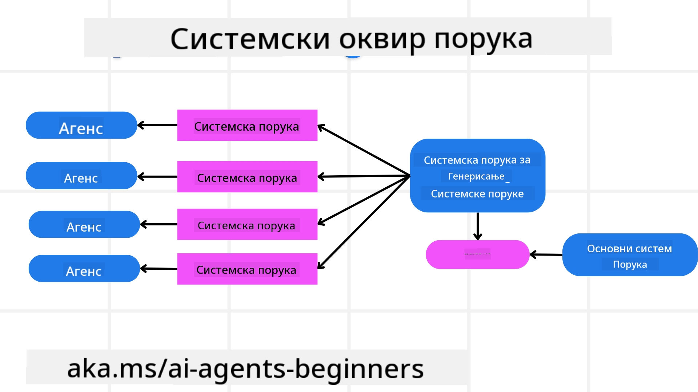
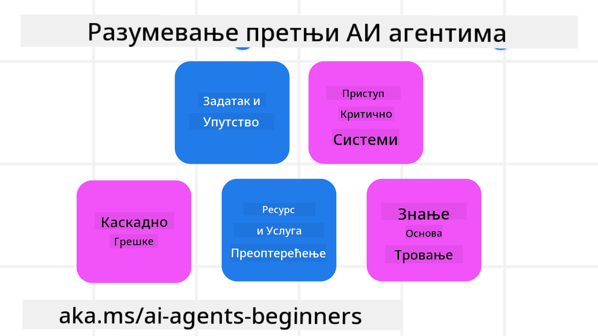
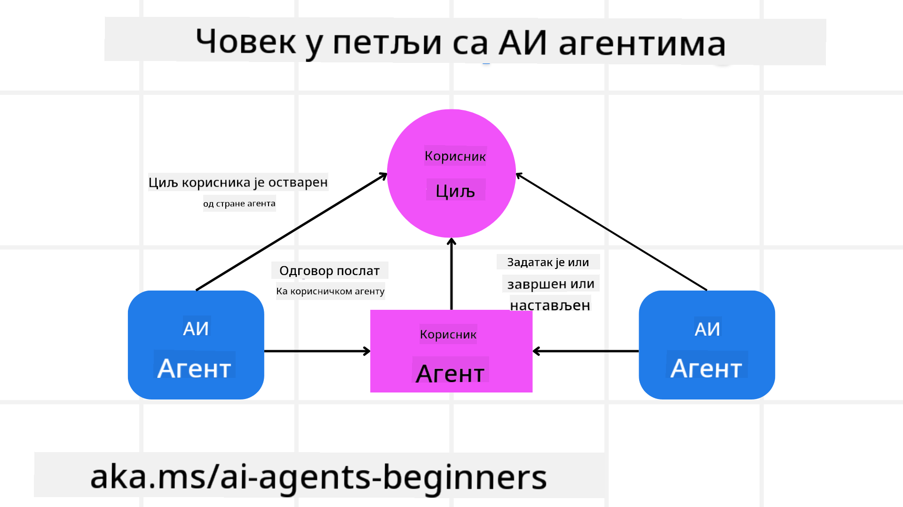

<!--
CO_OP_TRANSLATOR_METADATA:
{
  "original_hash": "498802b4c3c3cc486b86f27a12cebb34",
  "translation_date": "2025-08-30T08:53:11+00:00",
  "source_file": "06-building-trustworthy-agents/README.md",
  "language_code": "sr"
}
-->
[](https://youtu.be/iZKkMEGBCUQ?si=Q-kEbcyHUMPoHp8L)

> _(Кликните на слику изнад да бисте погледали видео овог часа)_

# Изградња поузданих AI агената

## Увод

Овај час ће обухватити:

- Како изградити и применити безбедне и ефикасне AI агенте.
- Важне безбедносне аспекте приликом развоја AI агената.
- Како очувати приватност података и корисника приликом развоја AI агената.

## Циљеви учења

Након завршетка овог часа, знаћете како да:

- Идентификујете и ублажите ризике приликом креирања AI агената.
- Примените безбедносне мере како бисте осигурали правилно управљање подацима и приступом.
- Креирате AI агенте који чувају приватност података и пружају квалитетно корисничко искуство.

## Безбедност

Прво ћемо се осврнути на изградњу безбедних агентских апликација. Безбедност значи да AI агент функционише у складу са дизајном. Као креатори агентских апликација, имамо методе и алате за максимизирање безбедности:

### Изградња оквира за системске поруке

Ако сте икада креирали AI апликацију користећи моделе великог језика (LLMs), знате колико је важно дизајнирати робустан системски упит или системску поруку. Ови упити успостављају основна правила, инструкције и смернице за то како ће LLM комуницирати са корисником и подацима.

За AI агенте, системски упит је још важнији јер ће агенти захтевати веома специфична упутства за извршавање задатака које смо им дизајнирали.

Да бисмо креирали скалабилне системске упите, можемо користити оквир за системске поруке за изградњу једног или више агената у нашој апликацији:



#### Корак 1: Креирајте мета системску поруку

Мета упит ће се користити од стране LLM-а за генерисање системских упита за агенте које креирамо. Дизајнирамо га као шаблон како бисмо ефикасно креирали више агената ако је потребно.

Ево примера мета системске поруке коју бисмо дали LLM-у:

```plaintext
You are an expert at creating AI agent assistants. 
You will be provided a company name, role, responsibilities and other
information that you will use to provide a system prompt for.
To create the system prompt, be descriptive as possible and provide a structure that a system using an LLM can better understand the role and responsibilities of the AI assistant. 
```

#### Корак 2: Креирајте основни упит

Следећи корак је креирање основног упита који описује AI агента. Требало би да укључите улогу агента, задатке које ће агент извршавати и све друге одговорности агента.

Ево примера:

```plaintext
You are a travel agent for Contoso Travel that is great at booking flights for customers. To help customers you can perform the following tasks: lookup available flights, book flights, ask for preferences in seating and times for flights, cancel any previously booked flights and alert customers on any delays or cancellations of flights.  
```

#### Корак 3: Пружите основну системску поруку LLM-у

Сада можемо оптимизовати ову системску поруку тако што ћемо мета системску поруку користити као системску поруку и додати нашу основну системску поруку.

Ово ће произвести системску поруку која је боље дизајнирана за вођење наших AI агената:

```markdown
**Company Name:** Contoso Travel  
**Role:** Travel Agent Assistant

**Objective:**  
You are an AI-powered travel agent assistant for Contoso Travel, specializing in booking flights and providing exceptional customer service. Your main goal is to assist customers in finding, booking, and managing their flights, all while ensuring that their preferences and needs are met efficiently.

**Key Responsibilities:**

1. **Flight Lookup:**
    
    - Assist customers in searching for available flights based on their specified destination, dates, and any other relevant preferences.
    - Provide a list of options, including flight times, airlines, layovers, and pricing.
2. **Flight Booking:**
    
    - Facilitate the booking of flights for customers, ensuring that all details are correctly entered into the system.
    - Confirm bookings and provide customers with their itinerary, including confirmation numbers and any other pertinent information.
3. **Customer Preference Inquiry:**
    
    - Actively ask customers for their preferences regarding seating (e.g., aisle, window, extra legroom) and preferred times for flights (e.g., morning, afternoon, evening).
    - Record these preferences for future reference and tailor suggestions accordingly.
4. **Flight Cancellation:**
    
    - Assist customers in canceling previously booked flights if needed, following company policies and procedures.
    - Notify customers of any necessary refunds or additional steps that may be required for cancellations.
5. **Flight Monitoring:**
    
    - Monitor the status of booked flights and alert customers in real-time about any delays, cancellations, or changes to their flight schedule.
    - Provide updates through preferred communication channels (e.g., email, SMS) as needed.

**Tone and Style:**

- Maintain a friendly, professional, and approachable demeanor in all interactions with customers.
- Ensure that all communication is clear, informative, and tailored to the customer's specific needs and inquiries.

**User Interaction Instructions:**

- Respond to customer queries promptly and accurately.
- Use a conversational style while ensuring professionalism.
- Prioritize customer satisfaction by being attentive, empathetic, and proactive in all assistance provided.

**Additional Notes:**

- Stay updated on any changes to airline policies, travel restrictions, and other relevant information that could impact flight bookings and customer experience.
- Use clear and concise language to explain options and processes, avoiding jargon where possible for better customer understanding.

This AI assistant is designed to streamline the flight booking process for customers of Contoso Travel, ensuring that all their travel needs are met efficiently and effectively.

```

#### Корак 4: Итерирајте и унапређујте

Вредност овог оквира за системске поруке је у томе што омогућава лакше скалирање креирања системских порука за више агената, као и унапређивање ваших системских порука током времена. Ретко се дешава да системска порука ради савршено из првог покушаја за ваш комплетан случај употребе. Могућност прављења малих измена и побољшања променом основне системске поруке и њеним поновним покретањем кроз систем омогућава вам да упоредите и процените резултате.

## Разумевање претњи

Да бисмо изградили поуздане AI агенте, важно је разумети и ублажити ризике и претње за вашег AI агента. Погледајмо неке од различитих претњи за AI агенте и како можете боље планирати и припремити се за њих.



### Задаци и инструкције

**Опис:** Нападачи покушавају да промене инструкције или циљеве AI агента кроз упите или манипулацију улазима.

**Ублажавање:** Извршите провере ваљаности и филтрирање уноса како бисте открили потенцијално опасне упите пре него што их AI агент обради. Пошто ови напади обично захтевају честу интеракцију са агентом, ограничавање броја корака у разговору је још један начин да се спрече овакви напади.

### Приступ критичним системима

**Опис:** Ако AI агент има приступ системима и услугама које чувају осетљиве податке, нападачи могу угрозити комуникацију између агента и тих услуга. Ово могу бити директни напади или индиректни покушаји добијања информација о тим системима преко агента.

**Ублажавање:** AI агенти би требало да имају приступ системима само на основу потребе како би се спречили овакви напади. Комуникација између агента и система такође би требало да буде безбедна. Примена аутентификације и контроле приступа је још један начин заштите ових информација.

### Преоптерећење ресурса и услуга

**Опис:** AI агенти могу приступити различитим алатима и услугама за извршавање задатака. Нападачи могу искористити ову могућност за напад на те услуге слањем великог броја захтева преко AI агента, што може довести до отказа система или високих трошкова.

**Ублажавање:** Примените политике за ограничавање броја захтева које AI агент може упутити услузи. Ограничавање броја корака у разговору и захтева вашем AI агенту је још један начин да се спрече овакви напади.

### Тровање базе знања

**Опис:** Ова врста напада не циља директно AI агента, већ базу знања и друге услуге које AI агент користи. Ово може укључивати корупцију података или информација које AI агент користи за извршавање задатка, што доводи до пристрасних или нежељених одговора кориснику.

**Ублажавање:** Редовно проверавајте податке које AI агент користи у својим радним токовима. Осигурајте да је приступ овим подацима безбедан и да их могу мењати само поуздане особе како бисте избегли овакве нападе.

### Ланчане грешке

**Опис:** AI агенти приступају различитим алатима и услугама за извршавање задатака. Грешке изазване нападима могу довести до отказа других система са којима је AI агент повезан, чиме напад постаје распрострањенији и теже га је решити.

**Ублажавање:** Један од начина да се ово избегне је да AI агент ради у ограниченом окружењу, као што је извршавање задатака у Docker контејнеру, како би се спречили директни напади на систем. Креирање механизама за повратак и логике поновног покушаја када одређени системи одговоре грешком је још један начин да се спрече већи откази система.

## Човек у петљи

Још један ефикасан начин за изградњу поузданих система AI агената је коришћење концепта "човек у петљи". Ово ствара ток у коме корисници могу пружити повратне информације агентима током извршавања. Корисници у суштини делују као агенти у мултиагентском систему, пружајући одобрење или прекид процеса који је у току.



Ево примера кода који користи AutoGen за приказ како се овај концепт примењује:

```python

# Create the agents.
model_client = OpenAIChatCompletionClient(model="gpt-4o-mini")
assistant = AssistantAgent("assistant", model_client=model_client)
user_proxy = UserProxyAgent("user_proxy", input_func=input)  # Use input() to get user input from console.

# Create the termination condition which will end the conversation when the user says "APPROVE".
termination = TextMentionTermination("APPROVE")

# Create the team.
team = RoundRobinGroupChat([assistant, user_proxy], termination_condition=termination)

# Run the conversation and stream to the console.
stream = team.run_stream(task="Write a 4-line poem about the ocean.")
# Use asyncio.run(...) when running in a script.
await Console(stream)

```

## Закључак

Изградња поузданих AI агената захтева пажљив дизајн, робусне безбедносне мере и континуирану итерацију. Применом структурираних система мета упита, разумевањем потенцијалних претњи и применом стратегија ублажавања, програмери могу креирати AI агенте који су и безбедни и ефикасни. Поред тога, укључивање концепта "човек у петљи" осигурава да AI агенти остану усклађени са потребама корисника уз минимизирање ризика. Како AI наставља да се развија, одржавање проактивног приступа безбедности, приватности и етичким разматрањима биће кључно за изградњу поверења и поузданости у AI системе.

### Имате још питања о изградњи поузданих AI агената?

Придружите се [Azure AI Foundry Discord](https://aka.ms/ai-agents/discord) за упознавање са другим ученицима, присуствовање консултацијама и добијање одговора на ваша питања о AI агентима.

## Додатни ресурси

- <a href="https://learn.microsoft.com/azure/ai-studio/responsible-use-of-ai-overview" target="_blank">Преглед одговорног коришћења AI</a>  
- <a href="https://learn.microsoft.com/azure/ai-studio/concepts/evaluation-approach-gen-ai" target="_blank">Евалуација генеративних AI модела и AI апликација</a>  
- <a href="https://learn.microsoft.com/azure/ai-services/openai/concepts/system-message?context=%2Fazure%2Fai-studio%2Fcontext%2Fcontext&tabs=top-techniques" target="_blank">Системске поруке за безбедност</a>  
- <a href="https://blogs.microsoft.com/wp-content/uploads/prod/sites/5/2022/06/Microsoft-RAI-Impact-Assessment-Template.pdf?culture=en-us&country=us" target="_blank">Шаблон за процену ризика</a>  

## Претходни час

[Agentic RAG](../05-agentic-rag/README.md)

## Следећи час

[Planning Design Pattern](../07-planning-design/README.md)

---

**Одрицање од одговорности**:  
Овај документ је преведен коришћењем услуге за превођење помоћу вештачке интелигенције [Co-op Translator](https://github.com/Azure/co-op-translator). Иако се трудимо да превод буде тачан, молимо вас да имате у виду да аутоматизовани преводи могу садржати грешке или нетачности. Оригинални документ на његовом изворном језику треба сматрати меродавним извором. За критичне информације препоручује се професионални превод од стране људи. Не преузимамо одговорност за било каква погрешна тумачења или неспоразуме који могу настати услед коришћења овог превода.