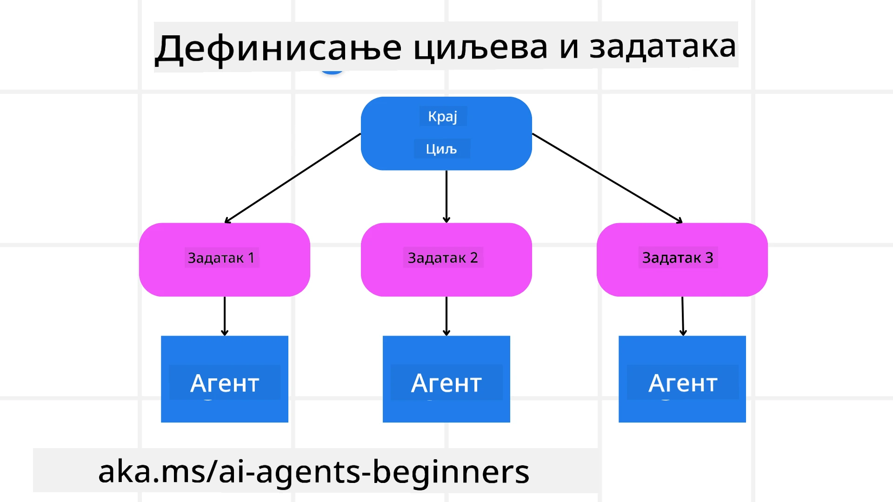

[](https://youtu.be/kPfJ2BrBCMY?si=9pYpPXp0sSbK91Dr)

> _(Кликните на слику изнад да бисте погледали видео о овој лекцији)_

# Дизајн Планирања

## Увод

Ова лекција ће обухватити

* Дефинисање јасног општег циља и разбијање сложеног задатка у управљиве задатке.
* Коришћење структурираног излаза за поузданије и машински читљиве одговоре.
* Примена приступа покретаног догађајима за руковање динамичним задацима и неочекиваним улазима.

## Циљеви Учeња

Након завршетка ове лекције, имаћете разумевање о:

* Идентификовању и постављању општег циља за AI агента, осигуравајући да јасно зна шта треба постићи.
* Разлагању сложеног задатка у управљиве подвртке и организовању у логичан низ.
* Опремању агената правим алатима (нпр. алати за претрагу или аналитичке алате за податке), одлучивању када и како се користе и руковању неочекиваним ситуацијама које се појаве.
* Процени резултата подвртка, мерењу перформанси и понављању радњи како би се побољшао коначни излаз.

## Дефинисање Општег Циља и Разбијање Задатка



Већина стварних задатака је превише сложена да би се решила у једном кораку. AI агенту је потребан сажет циљ који ће водити његово планирање и акције. На пример, размислите о циљу:

    "Направити тродневни путни план."

Док је лако формулисати, овај циљ и даље захтева прецизирање. Што је циљ јаснији, то боље агент (и сви људски сарадници) могу да се фокусирају на постизање правог резултата, као што је креирање свеобухватног плана са опцијама за лет, препорукама за хотел и предлозима активности.

### Декомпозиција Задатка

Велики или сложени задаци постају управљивији када се поделе у мање, циљно оријентисане подвртке.
За пример путног плана, циљ се може распасти на:

* Резервација летења
* Резервација хотела
* Изнајмљивање аутомобила
* Персонализација

Сваки подвртак онда могу решавати посебни агенти или процеси. Један агент можда је специјализован за проналажење најбољих летова, други се фокусира на резервације хотела итд. Координациони или „доњи“ агент тада може саставити ове резултате у један кохерентан итинерар за крајњег корисника.

Ова модуларна метода такође омогућава постепена побољшања. На пример, можете додати специјализоване агенте за препоруке хране или локалне активности и временом усавршавати план.

### Структурирани излаз

Модели великог језика (LLM) могу генерисати структуриран излаз (нпр. JSON) који је лакши за даље агенте или сервисе да анализирају и обраде. Ово је посебно корисно у мулти-агентском контексту, где можемо извршити ове задатке након што добијемо план.

Следећи Python пример представља једног једноставног агента за планирање који раставља циљ на подвртке и генерише структуриран план:

```python
from pydantic import BaseModel
from enum import Enum
from typing import List, Optional, Union
import json
import os
from typing import Optional
from pprint import pprint
from agent_framework.azure import AzureAIProjectAgentProvider
from azure.identity import AzureCliCredential

class AgentEnum(str, Enum):
    FlightBooking = "flight_booking"
    HotelBooking = "hotel_booking"
    CarRental = "car_rental"
    ActivitiesBooking = "activities_booking"
    DestinationInfo = "destination_info"
    DefaultAgent = "default_agent"
    GroupChatManager = "group_chat_manager"

# Модел подзадатка путовања
class TravelSubTask(BaseModel):
    task_details: str
    assigned_agent: AgentEnum  # желимо да доделимо задатак агенту

class TravelPlan(BaseModel):
    main_task: str
    subtasks: List[TravelSubTask]
    is_greeting: bool

provider = AzureAIProjectAgentProvider(credential=AzureCliCredential())

# Дефинишите поруку корисника
system_prompt = """You are a planner agent.
    Your job is to decide which agents to run based on the user's request.
    Provide your response in JSON format with the following structure:
{'main_task': 'Plan a family trip from Singapore to Melbourne.',
 'subtasks': [{'assigned_agent': 'flight_booking',
               'task_details': 'Book round-trip flights from Singapore to '
                               'Melbourne.'}
    Below are the available agents specialised in different tasks:
    - FlightBooking: For booking flights and providing flight information
    - HotelBooking: For booking hotels and providing hotel information
    - CarRental: For booking cars and providing car rental information
    - ActivitiesBooking: For booking activities and providing activity information
    - DestinationInfo: For providing information about destinations
    - DefaultAgent: For handling general requests"""

user_message = "Create a travel plan for a family of 2 kids from Singapore to Melbourne"

response = client.create_response(input=user_message, instructions=system_prompt)

response_content = response.output_text
pprint(json.loads(response_content))
```

### Agent za Planiranje sa Multi-Agent Orkestracijom

У овом примеру, агент семантичког рутирања добија кориснички захтев (нпр. „Треба ми план хотела за моје путовање.“).

Планирач затим:

* Прима план хотела: Планирач узима корисничку поруку и, на основу системске упуте (укључујући детаље о доступним агентима), генерише структуриран путни план.
* Листује агенте и њихове алате: Регистар агената садржи листу агената (нпр. за лет, хотел, изнајмљивање аута и активности) заједно са функцијама или алатима које пружају.
* Усмерава план ка одговарајућим агентима: У зависности од броја подвртка, планирач или шаље поруку директно посебном агенту (за сценарије са једним задатком) или координише преко менаџера групног ћаскања за сарадњу више агената.
* Сажима исход: На крају, планирач прави сажетак генерисаног плана ради прегледности.
Следећи Python пример кода илуструје ове кораке:

```python

from pydantic import BaseModel

from enum import Enum
from typing import List, Optional, Union

class AgentEnum(str, Enum):
    FlightBooking = "flight_booking"
    HotelBooking = "hotel_booking"
    CarRental = "car_rental"
    ActivitiesBooking = "activities_booking"
    DestinationInfo = "destination_info"
    DefaultAgent = "default_agent"
    GroupChatManager = "group_chat_manager"

# Модел потзадатка путовања

class TravelSubTask(BaseModel):
    task_details: str
    assigned_agent: AgentEnum # желимо да доделимо задатак агенту

class TravelPlan(BaseModel):
    main_task: str
    subtasks: List[TravelSubTask]
    is_greeting: bool
import json
import os
from typing import Optional

from agent_framework.azure import AzureAIProjectAgentProvider
from azure.identity import AzureCliCredential

# Креирај клијента

provider = AzureAIProjectAgentProvider(credential=AzureCliCredential())

from pprint import pprint

# Дефиниши поруку корисника

system_prompt = """You are a planner agent.
    Your job is to decide which agents to run based on the user's request.
    Below are the available agents specialized in different tasks:
    - FlightBooking: For booking flights and providing flight information
    - HotelBooking: For booking hotels and providing hotel information
    - CarRental: For booking cars and providing car rental information
    - ActivitiesBooking: For booking activities and providing activity information
    - DestinationInfo: For providing information about destinations
    - DefaultAgent: For handling general requests"""

user_message = "Create a travel plan for a family of 2 kids from Singapore to Melbourne"

response = client.create_response(input=user_message, instructions=system_prompt)

response_content = response.output_text

# Испиши садржај одговора након учитавања као JSON

pprint(json.loads(response_content))
```

Следи излаз из претходног кода који затим можете користити за усмеравање ка `assigned_agent` и сажимање путног плана крајњем кориснику.

```json
{
    "is_greeting": "False",
    "main_task": "Plan a family trip from Singapore to Melbourne.",
    "subtasks": [
        {
            "assigned_agent": "flight_booking",
            "task_details": "Book round-trip flights from Singapore to Melbourne."
        },
        {
            "assigned_agent": "hotel_booking",
            "task_details": "Find family-friendly hotels in Melbourne."
        },
        {
            "assigned_agent": "car_rental",
            "task_details": "Arrange a car rental suitable for a family of four in Melbourne."
        },
        {
            "assigned_agent": "activities_booking",
            "task_details": "List family-friendly activities in Melbourne."
        },
        {
            "assigned_agent": "destination_info",
            "task_details": "Provide information about Melbourne as a travel destination."
        }
    ]
}
```

Пример нотебоок-а са претходним примером кода доступан је [овде](07-python-agent-framework.ipynb).

### Итеративно Планирање

Неколики задаци захтевају комуникацију уназад и напред или поновно планирање, где исход једног подвртка утиче на следећи. На пример, ако агент открије неочекивани формат података током резервације летова, можда ће морати да прилагоди своју стратегију пре него што настави са резервацијом хотела.

Поред тога, повратне информације корисника (нпр. особа која одлучи да жели ранији лет) могу покренути делимично поновно планирање. Ова динамична, итеративна метода осигурава да коначна решења буду у складу са стварним ограничењима и развијајућим преференцама корисника.

нпр. пример кода

```python
from agent_framework.azure import AzureAIProjectAgentProvider
from azure.identity import AzureCliCredential
#.. исто као и претходни код и проследи историју корисника, тренутни план

system_prompt = """You are a planner agent to optimize the
    Your job is to decide which agents to run based on the user's request.
    Below are the available agents specialized in different tasks:
    - FlightBooking: For booking flights and providing flight information
    - HotelBooking: For booking hotels and providing hotel information
    - CarRental: For booking cars and providing car rental information
    - ActivitiesBooking: For booking activities and providing activity information
    - DestinationInfo: For providing information about destinations
    - DefaultAgent: For handling general requests"""

user_message = "Create a travel plan for a family of 2 kids from Singapore to Melbourne"

response = client.create_response(
    input=user_message,
    instructions=system_prompt,
    context=f"Previous travel plan - {TravelPlan}",
)
# .. поново планирај и пошаљи задатке одговарајућим агентима
```

За свеобухватније планирање погледајте Magnetic One <a href="https://www.microsoft.com/research/articles/magentic-one-a-generalist-multi-agent-system-for-solving-complex-tasks" target="_blank">Blogpost</a> за решавање сложених задатака.

## Сажетак

У овом чланку смо прегледали пример како можемо направити планирача који динамички бира доступне дефинисане агенте. Излаз Планирача раставља задатке и додељује агенте тако да могу бити извршени. Подразумева се да агенти имају приступ функцијама/алатима потребним за извршење задатка. Поред агената можете укључити и друге обрасце као што су рефлексија, резимије и редоследно ћаскање за додатну прилагодбу.

## Додатни Ресурси

Magentic One - Генералистички мулти-агентски систем за решавање сложених задатака и постигао је импресивне резултате на више изазовних агенцијских бенчмаркова. Референца: <a href="https://www.microsoft.com/research/articles/magentic-one-a-generalist-multi-agent-system-for-solving-complex-tasks" target="_blank">Magentic One</a>. У овој имплементацији оркестратор креира планове специфичне за задатке и делегира их доступним агентима. Поред планирања, оркестратор такође користи механизам праћења напретка задатка и по потреби поново планира.

### Имате Више Питања о Дизајну Планирања?

Придружите се [Microsoft Foundry Discord](https://aka.ms/ai-agents/discord) да се састанете са другим ученицима, учествујете у канцеларијским сатима и добијете одговоре на ваша питања о AI Агентима.

## Претходна Лекција

[Израда Поузданих AI Агената](../06-building-trustworthy-agents/README.md)

## Следећа Лекција

[Мулти-Агент Дизајн Образац](../08-multi-agent/README.md)

---

<!-- CO-OP TRANSLATOR DISCLAIMER START -->
**Изјава о одговорности**:  
Овај документ је преведен коришћењем AI сервиса за превођење [Co-op Translator](https://github.com/Azure/co-op-translator). Иако се трудимо да превод буде тачан, молимо вас да имате у виду да аутоматски преводи могу садржати грешке или нетачности. Оригинални документ на његовом изворном језику треба сматрати ауторитетним извором. За критичне информације препоручује се професионални превод од стране стручног лица. Нисмо одговорни за било какве неспоразуме или погрешне интерпретације које могу произићи из употребе овог превода.
<!-- CO-OP TRANSLATOR DISCLAIMER END -->