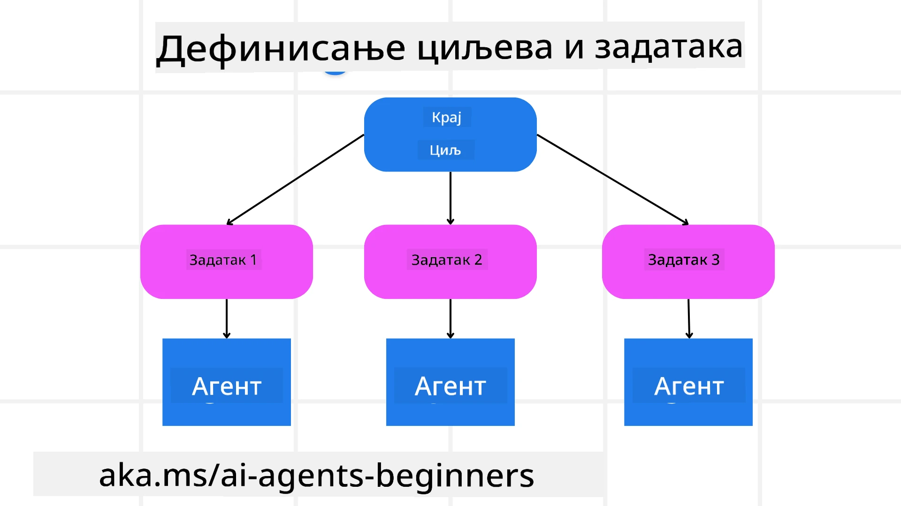

[](https://youtu.be/kPfJ2BrBCMY?si=9pYpPXp0sSbK91Dr)

> _(Кликните на слику изнад да бисте погледали видео о овом часу)_

# Плански дизајн

## Увод

Овај час ће обухватити

* Дефинисање јасног укупног циља и разлагање сложеног задатка на управљиве задатке.
* Коришћење структурисаног излаза за поузданије и машински читљиве одговоре.
* Примена приступа заснованог на догађајима за руковање динамичним задацима и неочекиваним уносима.

## Циљеви учења

Након завршетка овог часа, имаћете разумевање о:

* Идентификовању и постављању укупног циља за AI агента, осигуравајући да јасно зна шта треба постићи.
* Разлагању сложеног задатка на управљиве подсгатке и њихову организацију у логичан низ.
* Опремању агената одговарајућим алатима (нпр. алатима за претрагу или алатима за анализу података), одлучивању када и како се они користе, и руковању неочекиваним ситуацијама које се појаве.
* Процени резултата подсгатка, мерењу перформанси и итерацији на акцијама ради побољшања коначног резултата.

## Дефинисање укупног циља и разлагање задатка



Већина стварних задатака је превише сложена да би се решила у једном кораку. AI агенту је потребан сажет циљ који ће усмеравати његово планирање и акције. На пример, размотрите циљ:

    "Направити тродневни план пута."

Иако је једноставан за изражавање, он и даље захтева дораду. Што је циљ јаснији, тим боље агент (и било који људски сарадници) могу да се усредсреде на постизање правог резултата, као што је креирање свеобухватног плана пута са опцијама за лет, препорукама за хотел и предлозима активности.

### Разлагање задатка

Велики или сложени задаци постају управљивији када се поделе на мање, циљано оријентисане подсгатке.
За пример плана пута, циљ можете разложити на:

* Резервацију лета
* Резервацију хотела
* Изнајмљивање аутомобила
* Персонализацију

Сваки подсгатак затим може обављати посвећени агент или процес. Један агент може бити специјализован за претрагу најбољих понуда за летове, други се фокусира на резервације хотела, и тако даље. Координациони или „доњи“ агент може затим да састави ове резултате у један кохерентан план пута за крајњег корисника.

Овај модуларни приступ такође омогућава поступна побољшања. На пример, можете додати специјализоване агенте за препоруке хране или предлоге за локалне активности и временом усавршавати план пута.

### Структурисани излаз

Велики језички модели (ЛЛМ) могу генерисати структурисани излаз (нпр. JSON) који је лакши за обраду код доњих агената или сервиса. Ово је посебно корисно у контексту вишеструких агената, где можемо извршавати задатке након што се добије излаз из планирања.

Следећи Python пример демонстрира једноставног агента за планирање који разлаже циљ на подсгатке и генерише структурисани план:

```python
from pydantic import BaseModel
from enum import Enum
from typing import List, Optional, Union
import json
import os
from typing import Optional
from pprint import pprint
from agent_framework.azure import AzureAIProjectAgentProvider
from azure.identity import AzureCliCredential

class AgentEnum(str, Enum):
    FlightBooking = "flight_booking"
    HotelBooking = "hotel_booking"
    CarRental = "car_rental"
    ActivitiesBooking = "activities_booking"
    DestinationInfo = "destination_info"
    DefaultAgent = "default_agent"
    GroupChatManager = "group_chat_manager"

# Модел прекуметода путовања
class TravelSubTask(BaseModel):
    task_details: str
    assigned_agent: AgentEnum  # желимо доделити задатак агенту

class TravelPlan(BaseModel):
    main_task: str
    subtasks: List[TravelSubTask]
    is_greeting: bool

provider = AzureAIProjectAgentProvider(credential=AzureCliCredential())

# Дефинишите поруку корисника
system_prompt = """You are a planner agent.
    Your job is to decide which agents to run based on the user's request.
    Provide your response in JSON format with the following structure:
{'main_task': 'Plan a family trip from Singapore to Melbourne.',
 'subtasks': [{'assigned_agent': 'flight_booking',
               'task_details': 'Book round-trip flights from Singapore to '
                               'Melbourne.'}
    Below are the available agents specialised in different tasks:
    - FlightBooking: For booking flights and providing flight information
    - HotelBooking: For booking hotels and providing hotel information
    - CarRental: For booking cars and providing car rental information
    - ActivitiesBooking: For booking activities and providing activity information
    - DestinationInfo: For providing information about destinations
    - DefaultAgent: For handling general requests"""

user_message = "Create a travel plan for a family of 2 kids from Singapore to Melbourne"

response = client.create_response(input=user_message, instructions=system_prompt)

response_content = response.output_text
pprint(json.loads(response_content))
```

### Агенaт за планирање са оркестрацијом више агената

У овом примеру, Семантички рутер агент прима кориснички захтев (нпр. "Треба ми план хотела за моје путовање.").

Планер затим:

* Прима план хотела: Планер узима корисникову поруку и, на основу системске упуте (укључујући детаље о доступним агентима), генерише структурисани путнички план.
* Листује агенте и њихове алате: Регистар агената држи листу агената (нпр. за летове, хотел, изнајмљивање аутомобила и активности) заједно са функцијама или алатима које нуде.
* Усмерава план одговарајућим агентима: У зависности од броја подсгаткова, планер поруку шаље директно посвећеном агенту (за сценарије са једним задатком) или координише преко менаџера групног ћаскања за сарадњу више агената.
* Сумира резултат: На крају, планер сажима генерисани план за јасноћу.
Следећи Python пример кода илуструје ове кораке:

```python

from pydantic import BaseModel

from enum import Enum
from typing import List, Optional, Union

class AgentEnum(str, Enum):
    FlightBooking = "flight_booking"
    HotelBooking = "hotel_booking"
    CarRental = "car_rental"
    ActivitiesBooking = "activities_booking"
    DestinationInfo = "destination_info"
    DefaultAgent = "default_agent"
    GroupChatManager = "group_chat_manager"

# Модел подсистема путовања

class TravelSubTask(BaseModel):
    task_details: str
    assigned_agent: AgentEnum # желимо да доделимо задатак агенту

class TravelPlan(BaseModel):
    main_task: str
    subtasks: List[TravelSubTask]
    is_greeting: bool
import json
import os
from typing import Optional

from agent_framework.azure import AzureAIProjectAgentProvider
from azure.identity import AzureCliCredential

# Креирај клијента

provider = AzureAIProjectAgentProvider(credential=AzureCliCredential())

from pprint import pprint

# Дефиниши корисничку поруку

system_prompt = """You are a planner agent.
    Your job is to decide which agents to run based on the user's request.
    Below are the available agents specialized in different tasks:
    - FlightBooking: For booking flights and providing flight information
    - HotelBooking: For booking hotels and providing hotel information
    - CarRental: For booking cars and providing car rental information
    - ActivitiesBooking: For booking activities and providing activity information
    - DestinationInfo: For providing information about destinations
    - DefaultAgent: For handling general requests"""

user_message = "Create a travel plan for a family of 2 kids from Singapore to Melbourne"

response = client.create_response(input=user_message, instructions=system_prompt)

response_content = response.output_text

# Испечати садржај одговора након учитавања као JSON

pprint(json.loads(response_content))
```

Оно што следи је излаз из претходног кода, који затим можете користити за усмеравање према `assigned_agent` и сажети план пута крајњем кориснику.

```json
{
    "is_greeting": "False",
    "main_task": "Plan a family trip from Singapore to Melbourne.",
    "subtasks": [
        {
            "assigned_agent": "flight_booking",
            "task_details": "Book round-trip flights from Singapore to Melbourne."
        },
        {
            "assigned_agent": "hotel_booking",
            "task_details": "Find family-friendly hotels in Melbourne."
        },
        {
            "assigned_agent": "car_rental",
            "task_details": "Arrange a car rental suitable for a family of four in Melbourne."
        },
        {
            "assigned_agent": "activities_booking",
            "task_details": "List family-friendly activities in Melbourne."
        },
        {
            "assigned_agent": "destination_info",
            "task_details": "Provide information about Melbourne as a travel destination."
        }
    ]
}
```

Пример бележнице са претходним примером кода доступан је [овде](07-python-agent-framework.ipynb).

### Итеративно планирање

Неколико задатака захтева повратну размјену или преконфигурацију, где резултат једног подсгатка утиче на следећи. На пример, ако агент открије неочекивани формат података док резервише летове, можда треба да прилагоди своју стратегију пре него што пређе на резервацију хотела.

Поред тога, кориснички повратак (нпр. када човек одлучи да жели ранији лет) може покренути делимично поновно планирање. Овај динамички, итеративни приступ осигурава да коначно решење буде у складу са стварним ограничењима и еволутивним корисничким преференцама.

нпр. пример кода

```python
from agent_framework.azure import AzureAIProjectAgentProvider
from azure.identity import AzureCliCredential
#.. исто као и претходни код и преноси корисничку историју, тренутни план

system_prompt = """You are a planner agent to optimize the
    Your job is to decide which agents to run based on the user's request.
    Below are the available agents specialized in different tasks:
    - FlightBooking: For booking flights and providing flight information
    - HotelBooking: For booking hotels and providing hotel information
    - CarRental: For booking cars and providing car rental information
    - ActivitiesBooking: For booking activities and providing activity information
    - DestinationInfo: For providing information about destinations
    - DefaultAgent: For handling general requests"""

user_message = "Create a travel plan for a family of 2 kids from Singapore to Melbourne"

response = client.create_response(
    input=user_message,
    instructions=system_prompt,
    context=f"Previous travel plan - {TravelPlan}",
)
# .. поново испланирај и пошаљи задатке одговарајућим агентима
```

За свеобухватније планирање обавезно погледајте Magnetic One <a href="https://www.microsoft.com/research/articles/magentic-one-a-generalist-multi-agent-system-for-solving-complex-tasks" target="_blank">Blogpost</a> за решавање сложених задатака.

## Сажетак

У овом чланку смо погледали пример како можемо направити планер који може динамички одабрати дефинисане доступне агенте. Излаз планера разлаже задатке и додељује агенте тако да задатке могу извршити. Претпоставља се да агенти имају приступ функцијама/алатима који су потребни за извршење задатка. Поред агената, можете укључити и друге обрасце као што су рефлексија, сумаризатор и ротационо ћаскање за додатну прилагођеност.

## Додатни ресурси

Magentic One - Генералистички вишеструки агентски систем за решавање сложених задатака, који је постигао импресивне резултате на више захтевних агентских бенчмаркова. Референца: <a href="https://www.microsoft.com/research/articles/magentic-one-a-generalist-multi-agent-system-for-solving-complex-tasks" target="_blank">Magentic One</a>. У овој имплементацији оркестратор креира задатке специфичне планове и делегира задатке доступним агентима. Поред планирања, оркестратор користи и механизам праћења напретка задатка и планира поново по потреби.

### Имате још питања у вези са планским дизајн обрасцем?

Придружите се [Microsoft Foundry Discord](https://discord.com/invite/ATgtXmAS5D) да упознате друге учеснике, присуствујете радним часовима и добијете одговоре на ваша питања о AI агентима.

## Претходни час

[Прављење поузданих AI агената](../06-building-trustworthy-agents/README.md)

## Следећи час

[Образац вишеструких агената](../08-multi-agent/README.md)

---

<!-- CO-OP TRANSLATOR DISCLAIMER START -->
**Изјава о одрицању одговорности**:
Овај документ је преведен коришћењем услуге за аутоматски превод [Co-op Translator](https://github.com/Azure/co-op-translator). Иако тежимо тачности, имајте у виду да аутоматски преводи могу садржати грешке или нетачности. Оригинални документ на његовом изворном језику треба сматрати ауторитативним извором. За критичне информације препоручује се професионални људски превод. Нисмо одговорни за било каква неспоразума или погрешна тумачења која произилазе из коришћења овог превода.
<!-- CO-OP TRANSLATOR DISCLAIMER END -->