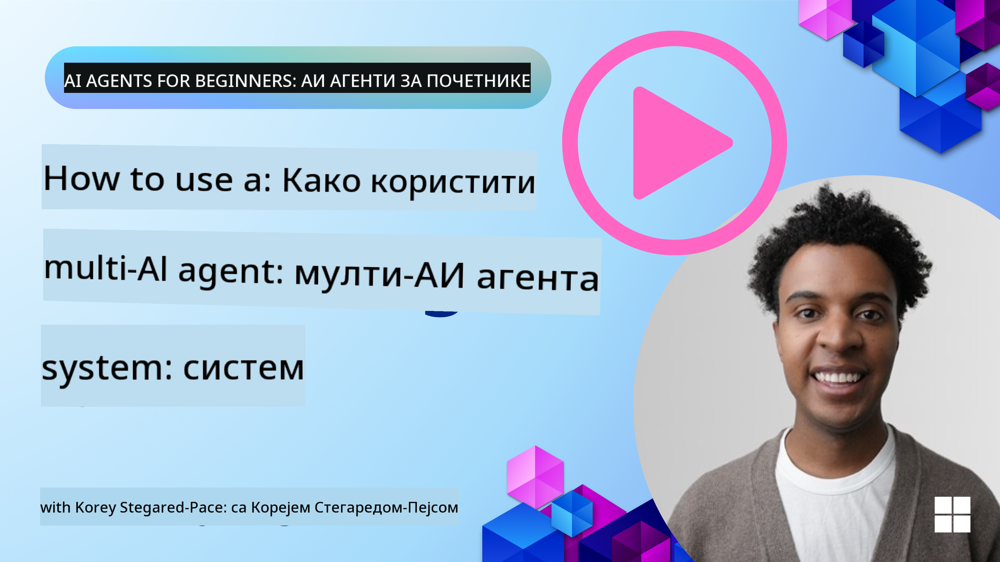
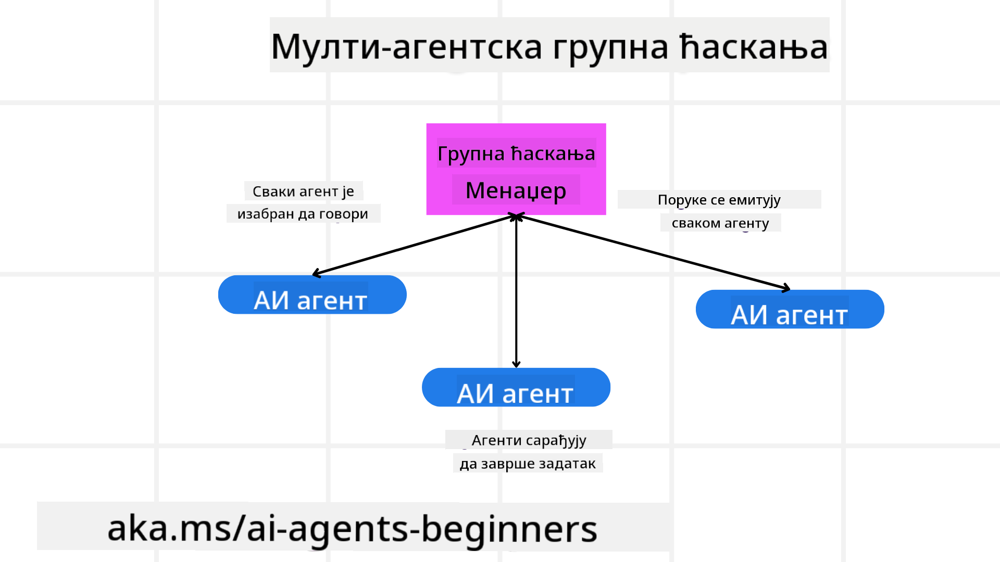
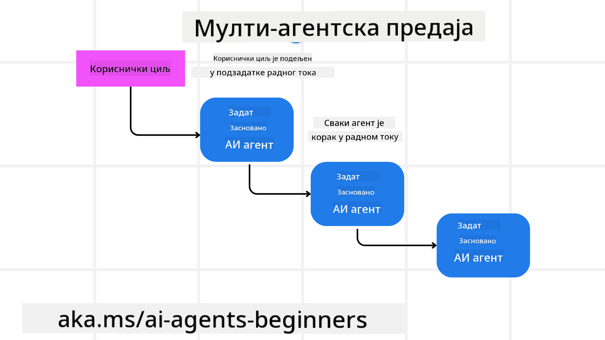
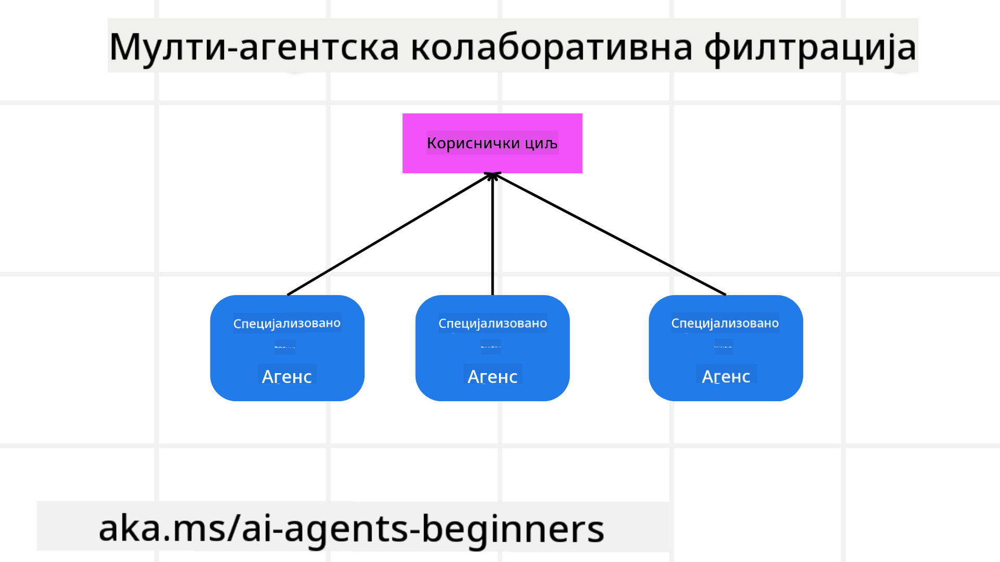

<!--
CO_OP_TRANSLATOR_METADATA:
{
  "original_hash": "1a008c204051cba8d0e253b75f261c41",
  "translation_date": "2025-08-30T08:52:18+00:00",
  "source_file": "08-multi-agent/README.md",
  "language_code": "sr"
}
-->

> _(Кликните на слику изнад да бисте погледали видео овог часа)_

# Шаблони дизајна са више агената

Чим почнете да радите на пројекту који укључује више агената, мораћете да размотрите шаблон дизајна са више агената. Међутим, можда неће одмах бити јасно када прећи на више агената и које су предности тог приступа.

## Увод

У овом часу ћемо покушати да одговоримо на следећа питања:

- У којим сценаријима је примена више агената одговарајућа?
- Које су предности коришћења више агената у односу на једног агента који обавља више задатака?
- Који су основни елементи за имплементацију шаблона дизајна са више агената?
- Како можемо имати увид у то како више агената међусобно комуницирају?

## Циљеви учења

Након овог часа, требало би да будете у могућности да:

- Идентификујете сценарије у којима је примена више агената одговарајућа.
- Препознате предности коришћења више агената у односу на једног агента.
- Разумете основне елементе имплементације шаблона дизајна са више агената.

Шта је шира слика?

*Више агената представља шаблон дизајна који омогућава више агената да раде заједно како би постигли заједнички циљ.*

Овај шаблон се широко користи у различитим областима, укључујући роботику, аутономне системе и дистрибуирано рачунарство.

## Сценарији у којима је примена више агената одговарајућа

Који су то сценарији у којима је корисно користити више агената? Одговор је да постоји много сценарија у којима је примена више агената корисна, посебно у следећим случајевима:

- **Велики обим посла**: Велики обим посла може се поделити на мање задатке и доделити различитим агентима, што омогућава паралелну обраду и брже завршавање. Пример за ово је обрада великих количина података.
- **Комплексни задаци**: Комплексни задаци, као и велики обим посла, могу се разбити на мање подзадатке и доделити различитим агентима, од којих је сваки специјализован за одређени аспект задатка. Добар пример за ово су аутономна возила где различити агенти управљају навигацијом, детекцијом препрека и комуникацијом са другим возилима.
- **Разнолика експертиза**: Различити агенти могу имати разнолику експертизу, што им омогућава да ефикасније обрађују различите аспекте задатка него један агент. Пример за ово је здравство, где агенти могу управљати дијагностиком, плановима лечења и праћењем пацијената.

## Предности коришћења више агената у односу на једног агента

Систем са једним агентом може добро функционисати за једноставне задатке, али за сложеније задатке коришћење више агената може пружити неколико предности:

- **Специјализација**: Сваки агент може бити специјализован за одређени задатак. Недостатак специјализације код једног агента значи да имате агента који може све, али се може збунити када се суочи са сложеним задатком. На пример, може завршити радећи задатак за који није најбоље прилагођен.
- **Скалабилност**: Лакше је скалирати системе додавањем више агената него преоптерећивањем једног агента.
- **Толеранција на грешке**: Ако један агент откаже, други могу наставити да функционишу, чиме се обезбеђује поузданост система.

Узмимо пример резервације путовања за корисника. Систем са једним агентом би морао да обрађује све аспекте процеса резервације путовања, од проналажења летова до резервације хотела и изнајмљивања аутомобила. Да би то постигао, један агент би морао да има алате за обраду свих ових задатака. Ово би могло довести до сложеног и монолитног система који је тешко одржавати и скалирати. Систем са више агената, с друге стране, могао би имати различите агенте специјализоване за проналажење летова, резервацију хотела и изнајмљивање аутомобила. Ово би систем учинило модуларнијим, лакшим за одржавање и скалабилним.

Упоредите ово са туристичком агенцијом коју води мала породична фирма у односу на агенцију која ради као франшиза. Породична фирма би имала једног агента који обрађује све аспекте процеса резервације путовања, док би франшиза имала различите агенте који обрађују различите аспекте процеса резервације.

## Основни елементи имплементације шаблона дизајна са више агената

Пре него што можете имплементирати шаблон дизајна са више агената, потребно је да разумете основне елементе који чине овај шаблон.

Хајде да ово учинимо конкретнијим поново користећи пример резервације путовања за корисника. У овом случају, основни елементи би укључивали:

- **Комуникација између агената**: Агенти за проналажење летова, резервацију хотела и изнајмљивање аутомобила морају комуницирати и делити информације о корисничким преференцијама и ограничењима. Потребно је одлучити о протоколима и методама за ову комуникацију. Конкретно, то значи да агент за проналажење летова мора комуницирати са агентом за резервацију хотела како би се осигурало да је хотел резервисан за исте датуме као и лет.
- **Механизми координације**: Агенти морају координисати своје акције како би осигурали да су корисничке преференције и ограничења испуњени. На пример, корисник може желети хотел близу аеродрома, док је ограничење то што су аутомобили за изнајмљивање доступни само на аеродрому.
- **Архитектура агената**: Агенти морају имати унутрашњу структуру за доношење одлука и учење из интеракција са корисником. На пример, агент за проналажење летова мора имати структуру за доношење одлука о томе које летове да препоручи кориснику.
- **Увид у интеракције између агената**: Потребно је имати алате и технике за праћење активности и интеракција агената. Ово може укључивати алате за логовање и праћење, алате за визуализацију и метрике перформанси.
- **Шаблони за више агената**: Постоје различити шаблони за имплементацију система са више агената, као што су централизоване, децентрализоване и хибридне архитектуре. Потребно је одлучити који шаблон најбоље одговара вашем случају.
- **Човек у петљи**: У већини случајева, човек ће бити укључен у процес, и потребно је дефинисати када агенти треба да траже људску интервенцију.

## Увид у интеракције између агената

Важно је имати увид у то како више агената међусобно комуницирају. Овај увид је кључан за отклањање грешака, оптимизацију и обезбеђивање ефикасности целокупног система. Да бисте то постигли, потребно је имати алате и технике за праћење активности и интеракција агената.

На пример, у случају резервације путовања за корисника, могли бисте имати контролну таблу која приказује статус сваког агента, корисничке преференције и ограничења, као и интеракције између агената. Ова контролна табла би могла приказивати датуме путовања корисника, летове које препоручује агент за летове, хотеле које препоручује агент за хотеле и аутомобиле за изнајмљивање које препоручује агент за изнајмљивање аутомобила.

Хајде да детаљније погледамо ове аспекте:

- **Алати за логовање и праћење**: Желите да свака акција коју агент предузме буде забележена. Унос у лог може садржати информације о агенту који је предузео акцију, акцији која је предузета, времену када је акција предузета и исходу акције.
- **Алати за визуализацију**: Алати за визуализацију могу вам помоћи да видите интеракције између агената на интуитивнији начин. На пример, могли бисте имати графикон који приказује ток информација између агената.
- **Метрике перформанси**: Метрике перформанси могу вам помоћи да пратите ефикасност система са више агената. На пример, могли бисте пратити време потребно за завршетак задатка, број задатака завршених по јединици времена и тачност препорука које агенти дају.

## Шаблони за више агената

Хајде да истражимо неке конкретне шаблоне које можемо користити за креирање апликација са више агената. Ево неких занимљивих шаблона које вреди размотрити:

### Групни чет

Овај шаблон је користан када желите да креирате апликацију за групни чет у којој више агената може међусобно комуницирати. Типични случајеви употребе укључују тимску сарадњу, корисничку подршку и друштвено умрежавање.

У овом шаблону, сваки агент представља корисника у групном чету, а поруке се размењују између агената користећи протокол за размену порука.

### Пренос задатка

Овај шаблон је користан када желите да креирате апликацију у којој више агената може преносити задатке један другом.

Типични случајеви употребе укључују корисничку подршку, управљање задацима и аутоматизацију радних токова.

### Колаборативно филтрирање

Овај шаблон је користан када желите да креирате апликацију у којој више агената може сарађивати како би корисницима дало препоруке.

Зашто бисте желели да више агената сарађује? Зато што сваки агент може имати различиту експертизу и допринети процесу препоруке на различите начине.

## Сценарио: Процес рефундације

Размотримо сценарио у којем корисник покушава да добије рефундацију за производ. У овом процесу може бити укључено доста агената, али хајде да их поделимо на оне специфичне за овај процес и оне који се могу користити у другим процесима.

**Агенти специфични за процес рефундације**:

- **Агент за кориснике**: Представља корисника и одговоран је за покретање процеса рефундације.
- **Агент за продавце**: Представља продавца и одговоран је за обраду рефундације.
- **Агент за плаћања**: Представља процес плаћања и одговоран је за враћање новца кориснику.
- **Агент за решавање проблема**: Одговоран за решавање проблема који се могу јавити током процеса рефундације.
- **Агент за усклађеност**: Осигурава да процес рефундације буде у складу са прописима и политикама.

**Општи агенти**:

- **Агент за доставу**: Одговоран за враћање производа продавцу. Може се користити и за доставу производа приликом куповине.
- **Агент за повратне информације**: Одговоран за прикупљање повратних информација од корисника.
- **Агент за ескалацију**: Одговоран за ескалацију проблема на виши ниво подршке.
- **Агент за обавештења**: Одговоран за слање обавештења кориснику у различитим фазама процеса рефундације.
- **Агент за аналитику**: Одговоран за анализу података везаних за процес рефундације.
- **Агент за ревизију**: Одговоран за ревизију процеса рефундације како би се осигурало да се правилно спроводи.
- **Агент за извештавање**: Одговоран за генерисање извештаја о процесу рефундације.
- **Агент за знање**: Одговоран за одржавање базе знања о процесу рефундације.
- **Агент за безбедност**: Осигурава безбедност процеса рефундације.
- **Агент за квалитет**: Осигурава квалитет процеса рефундације.

Надамо се да вам ово даје идеју како можете одлучити које агенте да користите у вашем систему са више агената.

## Задатак
## Дизајнирање мулти-агентског система за процес корисничке подршке

Идентификујте агенте укључене у процес, њихове улоге и одговорности, као и начин на који међусобно комуницирају. Размотрите како агенте специфичне за процес корисничке подршке, тако и опште агенте који се могу користити у другим деловима вашег пословања.

> Размислите пре него што прочитате следеће решење, можда ће вам требати више агената него што мислите.

> TIP: Размислите о различитим фазама процеса корисничке подршке и такође узмите у обзир агенте потребне за било који систем.

## Решење

[Решење](./solution/solution.md)

## Провера знања

Питање: Када треба размотрити коришћење мулти-агената?

- [ ] A1: Када имате мали обим посла и једноставан задатак.
- [ ] A2: Када имате велики обим посла.
- [ ] A3: Када имате једноставан задатак.

[Решење квиза](./solution/solution-quiz.md)

## Резиме

У овој лекцији смо разматрали дизајн образац мулти-агената, укључујући сценарије у којима су мулти-агенти применљиви, предности коришћења мулти-агената у односу на једног агента, основне елементе имплементације дизајн обрасца мулти-агената, као и како имати увид у то како више агената међусобно комуницирају.

### Имате још питања о дизајн обрасцу мулти-агената?

Придружите се [Azure AI Foundry Discord](https://aka.ms/ai-agents/discord) серверу да бисте се повезали са другим ученицима, присуствовали консултацијама и добили одговоре на ваша питања о AI агентима.

## Додатни ресурси

- ## Претходна лекција

[Планирање дизајна](../07-planning-design/README.md)

## Следећа лекција

[Метакогниција у AI агентима](../09-metacognition/README.md)

---

**Одрицање од одговорности**:  
Овај документ је преведен коришћењем услуге за превођење помоћу вештачке интелигенције [Co-op Translator](https://github.com/Azure/co-op-translator). Иако се трудимо да обезбедимо тачност, молимо вас да имате у виду да аутоматски преводи могу садржати грешке или нетачности. Оригинални документ на његовом изворном језику треба сматрати ауторитативним извором. За критичне информације препоручује се професионални превод од стране људи. Не преузимамо одговорност за било каква погрешна тумачења или неспоразуме који могу настати услед коришћења овог превода.