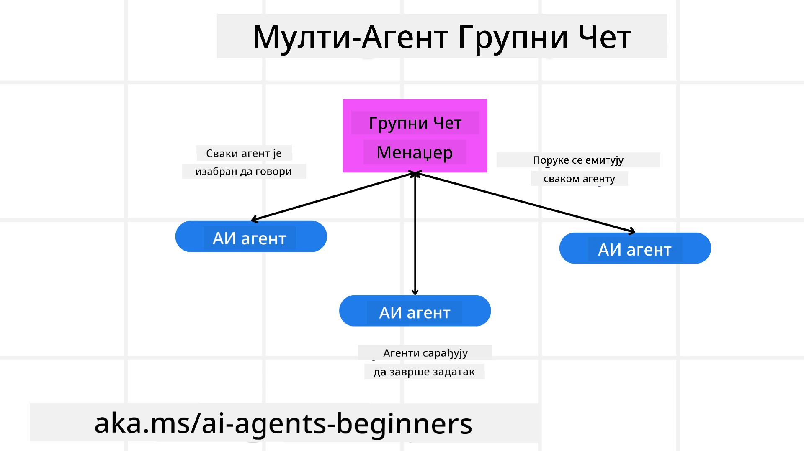
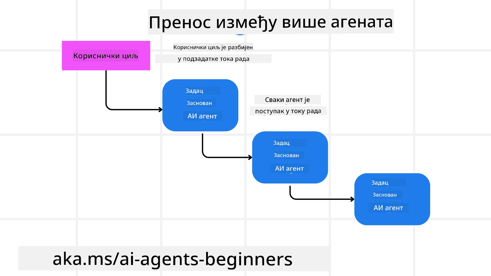
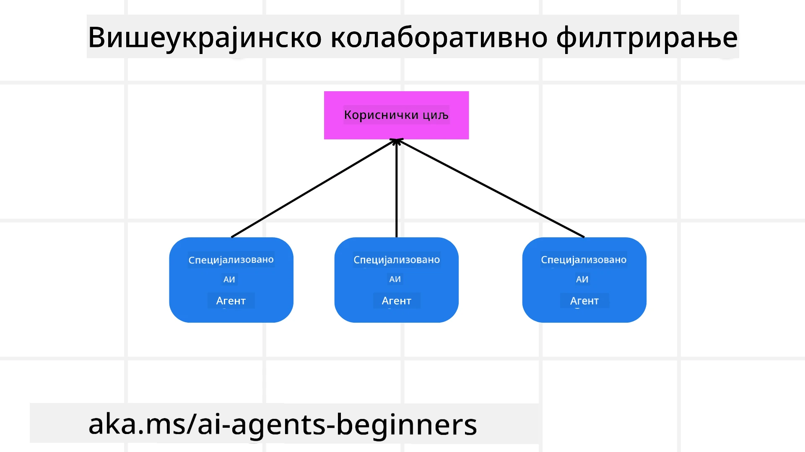

> _(Кликните на слику горе да бисте видели видео о овој лекцији)_

# Обрасци дизајна са више агената

Чим почнете да радите на пројекту који укључује више агената, биће вам потребно да размотрите образац дизајна с више агената. Међутим, можда неће бити одмах јасно када треба прелазити на више агената и које су предности.

## Увод

У овој лекцији ћемо покушати да одговоримо на следећа питања:

- Који су сценарији у којима се примењују више агената?
- Које су предности коришћења више агената у односу на само једног агента који обавља више задатака?
- Који су основни елементи за имплементацију обрасца дизајна са више агената?
- Како имамо увид у то како више агената међусобно комуницирају?

## Циљеви учења

Након ове лекције, требало би да будете у могућности да:

- Идентификујете сценарије у којима су више агената применљиви
- Препознате предности коришћења више агената у односу на једног агента.
- Разумете основне елементе имплементације обрасца дизајна са више агената.

Која је шира слика?

*Више агената је образац дизајна који омогућава да више агената заједно ради на остварењу заједничког циља*.

Овај образац се широко користи у разним областима, укључујући роботску, аутономне системе и дистрибуирано рачунарство.

## Сценарији у којима се примењују више агената

Који су онда добри случајеви за коришћење више агената? Одговор је да постоји много сценарија где је коришћење више агената корисно, посебно у следећим случајевима:

- **Велика количина посла**: Велике количине посла могу се поделити на мање задатке и доделити различитим агентима, што омогућава паралелну обраду и брже завршетак. Пример за ово је велики задатак обраде података.
- **Комплексни задаци**: Као и велики задаци, комплексни задаци могу се разложити на мање подтаксе и доделити различитим агентима, од којих је сваки специјализован за одређени део задатка. Добар пример је код аутономних возила где различити агенти управљају навигацијом, детекцијом препрека и комуникацијом са другим возилима.
- **Различите стручности**: Различити агенти могу имати различите стручности, што им омогућава ефикасније руковање различитим аспектима задатка него што би могао један агент. За овај случај добар пример је у здравству, где агенти могу управљати дијагностиком, плановима лечења и праћењем пацијента.

## Предности коришћења више агената у односу на једног агента

Један агент може добро функционисати за једноставне задатке, али за комплексније задатке коришћење више агената пружа неколико предности:

- **Специјализација**: Сваки агент може бити специјализован за одређени задатак. Недостатак специјализације у једном агенту значи да имате агента који може све, али може се збуњивати шта да ради када се суочи са комплексним задатком. Може, на пример, завршити радећи задатак за који није најпогоднији.
- **Масовност (скалирање)**: Лакше је повећавати капацитете система додавањем више агената него оптерећивањем једног агента.
- **Отпорност на отказе**: Ако један агент не успе, други могу наставити да функционишу, што обезбеђује поузданост система.

Пример: хајде да резервишемо путовање за корисника. Један агент би морао да обради све аспекте резервисања путовања, од проналажења летова до резервације хотела и изнајмљивања аутомобила. Да би то постигао један агент, потребно је да има алате за све те задатке. То може довести до сложеног и монолитног система који је тешко одржавати и проширивати. Са више агената, имали бисте различите агенте специјализоване за проналажење летова, резервацију хотела и аутомобила. То би систем учинило модуларнијим, лакшим за одржавање и скалабилним.

Упоредите то са туристичком агенцијом којом управља породица (мама и тата) у односу на туристичку агенцију која ради као франшиза. Породична агенција би имала једног агента који управља свим аспектима резервисања путовања, док би франшиза имала различите агенте за различите делове процеса.

## Основни елементи имплементације обрасца дизајна са више агената

Пре него што имплементирате образац са више агената, треба да разумете основне елементе који чине тај образац.

Хајде да ово учинимо конкретнијим поново гледајући пример резервације путовања за корисника. У том случају, основни елементи укључују:

- **Комуникација агената**: Агенти за проналажење летова, резервацију хотела и аутомобила треба да комуницирају и размењују информације о корисниковим преференцама и ограничењима. Морате одлучити о протоколима и методама за ту комуникацију. Конкретно, агент за проналажење летова мора комуницирати са агентом за резервацију хотела да би осигурали да је хотел резервисан за исте датуме као и лет. То значи да агенти морају размењивати податке о датумима путовања, што подразумева да морате одлучити *који агенти деле информације и како их деле*.
- **Механизми координације**: Агенти морају координисати своје активности како би осигурали да преференце и ограничења корисника буду испуњени. Преференца може бити да корисник жели хотел близу аеродрома, док ограничење може бити да су аутомобили за изнајмљивање доступни само на аеродрому. Ово захтева да агент за резервацију хотела координира са агентом за резервацију аутомобила да би се испоштовале преференце и ограничења корисника. Треба да одлучите *како агенти координишу своје активности*.
- **Архитектура агената**: Агенти морају имати унутрашњу структуру која им омогућава да доносе одлуке и уче из интеракција са корисником. Агент за проналажење летова, на пример, треба да има унутрашњу структуру за доношење одлука о томе које летове да препоручи кориснику. Треба да одлучите *како агенти доносе одлуке и уче из интеракција са корисником*. Примери учења агента могу бити да агент за проналажење летова користи модел машинског учења за препоруку летова на основу прошлог понашања корисника.
- **Увид у интеракције више агената**: Треба да имате увид у то како више агената комуницирају међусобно. За ово су вам потребни алати и технике за праћење активности и интеракција агената. То може бити у виду алата за логовање и мониторинг, визуелизацију и метрике перформанси.
- **Обрасци са више агената**: Постоје различити обрасци за имплементацију система са више агената, као што су централизоване, децентрализоване и хибридне архитектуре. Треба да изаберете образац који најбоље одговара вашем случају.
- **Човек у петљи**: У већини случајева, имаћете човека укљученог у процес, и морате упутити агенте када да затраже људску интервенцију. То може бити у виду корисника који тражи одређени хотел или лет који агенти нису препоручили, или затражити потврду пре резервације лета или хотела.

## Увид у интеракције више агената

Важан је увид у то како више агената комуницирају један са другим. Овај увид је од суштинског значаја за отклањање грешака, оптимизацију и обезбеђивање укупне ефикасности система. Да бисте то постигли, потребни су вам алати и технике за праћење активности и интеракција агената. То може бити у виду инструмената за логовање и праћење, алата за визуелизацију и показатеља перформанси.

На пример, у случају резервације путовања за корисника, могли бисте имати контролни панел који приказује статус сваког агента, корисникове преференце и ограничења, као и интеракције између агената. Овај панел може приказивати датуме путовања корисника, летове које је препоручио агент за летове, хотеле које је препоручио агент за хотел и аутомобиле које је препоручио агент за изнајмљивање. Тако ћете добити јасан увид у то како агенти комуницирају међусобно и да ли су корисникове преференце и ограничења испуњени.

Погледајмо детаљније сваки од ових аспеката.

- **Алати за логовање и праћење**: Желите да имате евиденцију сваке акције коју агент предузме. Запис може садржати податке о агенту који је извршио акцију, о чему је акција била, када је извршена и који је исход био. Ове информације се могу користити за решавање проблема, оптимизацију и друго.

- **Алати за визуелизацију**: Визуелни алати вам могу помоћи да јасније видите интеракције између агената. На пример, могли бисте имати граф који приказује проток информација између агената. Ово може помоћи у идентификовању застоја, неефикасности и других проблема у систему.

- **Показатељи перформанси**: Показатељи вам помажу да пратите ефикасност система са више агената. На пример, можете пратити време потребно за завршетак задатка, број завршених задатака по јединици времена и тачност препорука које агенти дају. Ове информације помажу у идентификовању места за унапређење и оптимизацију система.

## Обрасци са више агената

Хајде да погледамо неке конкретне обрасце које можете користити за креирање апликација са више агената. Ево неколико занимљивих обрасца вредних разматрања:

### Групни чет

Овај образац је користан када желите да направите апликацију за групни чет у којој више агената може међусобно да комуницира. Типични случајеви употребе укључују тимски рад, корисничку подршку и друштвено умрежавање.

У овом обрасцу сваки агент представља корисника у групном чету, а поруке се размењују између агената коришћењем протокола за слање порука. Агенти могу слати поруке групном чету, примати поруке из групног чета и одговарати на поруке од других агената.

Овај образац може бити имплементиран коришћењем централизоване архитектуре у којој се све поруке воде кроз централни сервер, или децентрализоване архитектуре у којој се поруке размењују директно.

### Преношење задатака

Овај образац је користан када желите направити апликацију у којој више агената могу преносити задатке један другом.

Типични случајеви употребе укључују корисничку подршку, управљање задацима и аутоматизацију радног тока.

У овом обрасцу сваки агент представља задатак или корак у радном току, а агенти могу преносити задатке другим агентима на основу унапред дефинисаних правила.

### Сарадничко филтрирање

Овај образац је користан када желите креирати апликацију у којој више агената сарађује да би препоручили корисницима.

Зашто бисте желели да више агената сарађује? Због тога што сваки агент има различиту стручност и може допринети процесу препорука на различите начине.

Пример: корисник жели препоруку најбоље акције за куповину на берзи.

- **Стручњак за индустрију**: Један агент може бити стручњак за одређену индустрију.
- **Техничка анализа**: Други агент може бити стручњак за техничку анализу.
- **Фундаментална анализа**: и трећи агент може бити стручњак за фундаменталну анализу. Сарадњом, ови агенти могу пружити свеобухватнију препоруку кориснику.

## Сценарио: Процес повраћаја новца

Размотрите сценарио у којем купац покушава да добије повраћај новца за производ. У том процесу може бити укључено доста агената, али хајде да их поделимо на агенте специфичне за овај процес и опште агенте који се могу користити у другим процесима.

**Агенти специфични за процес повраћаја новца**:

Ево неких агената који би могли бити укључени у овај процес:

- **Агент купца**: Представља купца и одговоран је за покретање процеса повраћаја.
- **Агент продавца**: Представља продавца и одговоран је за обраду повраћаја.
- **Агент плаћања**: Представља процес плаћања и одговоран је за повраћај уплаћеног новца купцу.
- **Агент за решавање**: Представља процес решавања и одговоран је за решавање свих проблема који могу настати током процеса повраћаја.
- **Агент за усаглашеност**: Представља процес усаглашености и одговоран је за преглед и обезбеђење да процес повраћаја буде у складу са прописима и политикама.

**Општи агенти**:

Ови агенти могу се користити у другим деловима пословања.

- **Агент за слање**: Представља процес слања и одговоран је за враћање производа продавцу. Овај агент се може користити и за процес повраћаја и за општу испоруку, на пример приликом куповине.
- **Агент за повратне информације**: Представља процес прикупљања повратних информација од купаца. Повратне информације могу се прикупљати у било које време, не само током процеса повраћаја.
- **Агент за ескалацију**: Представља процес ескалације и одговоран је за пренос проблема на виши ниво подршке. Овај тип агента можете користити у било ком процесу где је потребно ескалирати проблем.
- **Агент за обавештења**: Представља процес слања обавештења купцу у различитим фазама процеса повраћаја.
- **Агент за аналитичку обраду**: Одговоран је за анализу података везаних за процес повраћаја.
- **Агент за ревизију**: Представља процес ревизије и одговоран је за провере да ли се процес повраћаја правилно спроводи.
- **Агент за извештавање**: Представља процес припреме извештаја о процесу повраћаја.
- **Агент за знање**: Одговоран је за одржавање базе знања везане за процес повраћаја. Овај агент може бити обучен и за друге делове пословања.
- **Агент за безбедност**: Представља процес обезбеђења безбедности процеса повраћаја.
- **Агент за квалитет**: Одговоран је за осигурање квалитета током процеса повраћаја.

Доста агената је наведено, како оних специфичних за процес повраћаја, тако и општих који могу бити коришћени у другим деловима вашег пословања. Надамо се да вам ово даје идеју како да одлучите које агенте да користите у свом систему са више агената.

## Задатак

Дизајнирајте систем са више агената за процес корисничке подршке. Идентификујте агенте укључене у процес, њихове улоге и одговорности, као и начин њихове међусобне интеракције. Размотрите како специфичне агенте за процес корисничке подршке, тако и опште агенте који се могу користити у другим деловима вашег пословања.
> Размислите пре него што прочитате следеће решење, можда вам треба више агената него што мислите.

> САВЕТ: Размислите о различитим фазама процеса корисничке подршке и такође узмите у обзир агенте потребне за сваки систем.

## Решење

[Решење](./solution/solution.md)

## Провера знања

Питање: Када бисте требали размотрити коришћење више агената?

- [ ] A1: Када имате мали обим посла и једноставан задатак.
- [ ] A2: Када имате велики обим посла
- [ ] A3: Када имате једноставан задатак.

[Квиз решења](./solution/solution-quiz.md)

## Резиме

У овој лекцији смо разгледали мулти-агентски дизајн образац, укључујући сценарије када су мулти-агенти применљиви, предности коришћења мулти-агената у односу на једног агента, основне елементе имплементације мулти-агентског дизајн обрасца и како имати видљивост у интеракцију више агената међу собом.

### Имате још питања о мулти-агентском дизајн обрасцу?

Придружите се [Microsoft Foundry Discord](https://aka.ms/ai-agents/discord) да бисте упознали друге полазнике, учествовали на канцеларијским сатима и добили одговоре на питања везана за AI агенте.

## Додатни ресурси

- <a href="https://learn.microsoft.com/azure/ai-services/agents/overview" target="_blank">Документација за Microsoft Agent Framework</a>
- <a href="https://www.analyticsvidhya.com/blog/2024/10/agentic-design-patterns/" target="_blank">Agentic дизајн обрасци</a>

## Претходна лекција

[Планирање дизајна](../07-planning-design/README.md)

## Следећа лекција

[Метакогниција у AI агентима](../09-metacognition/README.md)

---

<!-- CO-OP TRANSLATOR DISCLAIMER START -->
**Одрицање од одговорности**:  
Овај документ је преведен уз помоћ AI преводилачке услуге [Co-op Translator](https://github.com/Azure/co-op-translator). Иако настојимо да превод буде тачан, имајте у виду да аутоматски преводи могу садржати грешке или нетачности. Изворни документ на његовом оригиналном језику треба сматрати ауторитетним извором. За критичне информације препоручује се професионални људски превод. Нисмо одговорни за било каква недоразумевања или погрешне тумачења која могу произаћи из коришћења овог превода.
<!-- CO-OP TRANSLATOR DISCLAIMER END -->