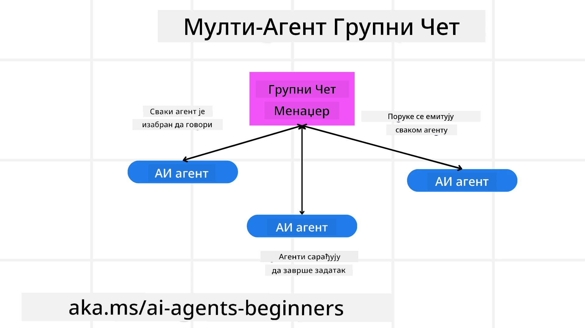
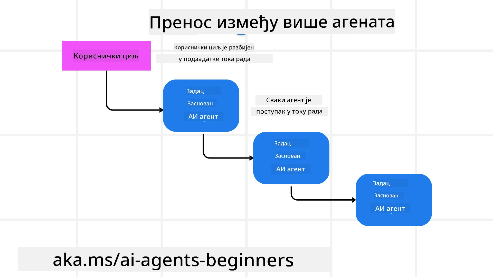
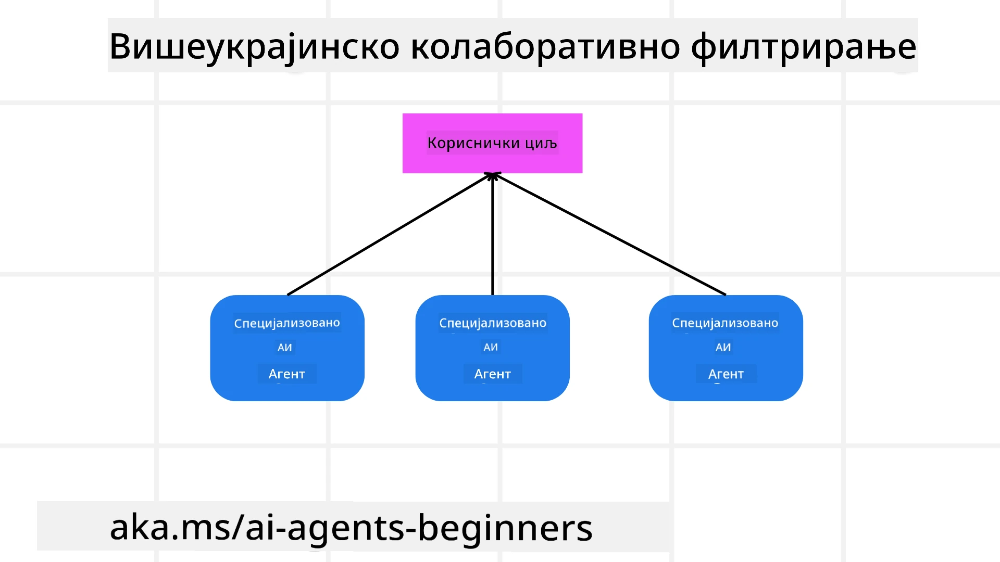

> _(Кликните на слику изнад да бисте погледали видео овог часа)_

# Обрасци дизајна више агената

Чим почнете да радите на пројекту који укључује више агената, мораћете да размотрите образац дизајна више агената. Међутим, можда неће одмах бити јасно када прећи на више агената и које су предности.

## Увод

У овом часу желимо да одговоримо на следећа питања:

- Који су сценарији где је применљив мулти-агентски приступ?
- Које су предности коришћења више агената у односу на само једног агента који обавља више задатака?
- Које су саставне целине за имплементацију образаца дизајна више агената?
- Како имамо увид у то како више агената међусобно интерагује?

## Циљеви учења

Након овог часа требало би да будете у стању да:

- Препознате сценарије где је примена више агената прикладна
- Уочите предности коришћења више агената у односу на једног агента.
- Разумете саставне целине за имплементацију образаца дизајна више агената.

Која је шира слика?

*Више агената је образац дизајна који омогућава да више агената ради заједно како би постигли заједнички циљ*.

Овај образац се широко користи у различитим областима, укључујући роботку, аутономне системе и дистрибуиране рачунарске системе.

## Сценарији у којима је примена више агената прикладна

Који су сценарији добар пример за коришћење више агената? Одговор је да постоји много сценарија где је запошљавање више агената корисно, посебно у следећим случајевима:

- **Велика оптерећења**: Велика оптерећења могу се поделити на мање задатке и доделити различитим агентима, омогућавајући паралелну обраду и брже завршетке. Пример овога је велики задатак обраде података.
- **Комплексни задаци**: Комплексни задаци, као код великих оптерећења, могу се разбити у мање подзадатке и доделити различитим агентима, сваки специјализован за одређени аспект задатка. Добар пример су аутономна возила где различити агенти управљају навигацијом, детекцијом препрека и комуникацијом са другим возилима.
- **Различите стручности**: Различити агенти могу имати различите стручности, што им омогућава да ефикасније обрађују различите аспекте задатка него један агент. Пример за ово су здравствене услуге где агенти могу управљати дијагностиком, плановима лечења и праћењем пацијената.

## Предности коришћења више агената у односу на једног агента

Један агент систем може добро функционисати за једноставне задатке, али за сложеније задатке коришћење више агената може пружити неколико предности:

- **Специјализација**: Сваког агента може бити специјализован за одређени задатак. Недостатак специјализације код једног агента значи да имате агента који може све радити али се може збуњивати шта да уради када се суочи са сложеним задатком. На пример, може завршити обављајући задатак за који није најбоље оспособљен.
- **Скалабилност**: Лакше је повећавати систем додавањем више агената него пребуцивати превише оптерећења на једног агента.
- **Отпорност на кварове**: Ако један агент не успе, други могу наставити да функционишу, обезбеђујући поузданост система.

Узмимо пример, да резервишемо путовање за корисника. Један агент систем морао би да управља свим аспектима процеса резервације путовања, од проналажења летова, до резервације хотела и изнајмљивања аутомобила. Да би ово постигао, тај агент би морао имати алате за сваку од ових активности. То би могло довести до сложеног и монолитног система који је тежак за одржавање и проширење. Мулти-агент систем, с друге стране, могао би имати различите агенте специјализоване за проналажење летова, резервацију хотела и изнајмљивање аутомобила. То би систем учинило модуларнијим, лакшим за одржавање и скалабилним.

Упоредите ово са туристичком агенцијом која ради као мала породична радња у односу на туроператера који је франшиза. Мала радња би имала једног агента који обавља све аспекте резервисања путовања, док би франшиза имала различите агенте који управљају различитим аспектима процеса.

## Саставне целине за имплементацију образаца дизајна више агената

Пре него што можете имплементирати образац дизајна више агената, потребно је да разумете саставне целине које чине образац.

Хајде да ово учинимо конкретнијим поновним примером резервисања путовања за корисника. У овом примеру, саставне целине би обухватиле:

- **Комуникација агената**: Агенти за проналажење летова, резервацију хотела и изнајмљивање аутомобила морају међусобно комуницирати и размењивати информације о корисничким преференцама и ограничењима. Потребно је одлучити о протоколима и методама ове комуникације. Конкретно то значи да агент за проналажење летова мора комуницирати са агентом за резервацију хотела да се увери да је хотел резервисан за исте датуме као лет. То значи да агенти морају делити информације о датумима путовања корисника, што захтева одлуку *који агенти деле информације и како их деле*.
- **Механизми координације**: Агенти морају координисати своје радње како би испунили корисничке преференце и ограничења. Корисничка преференција може бити да желе хотел близу аеродрома, док ограничење може бити да су аутомобили за изнајмљивање доступни само на аеродрому. То значи да агент за резервацију хотела мора координисати са агентом за изнајмљивање аутомобила да би се обезбедило испуњење ових услова. Потребно је одлучити *како агенти координишу своје активности*.
- **Архитектура агената**: Агенти морају имати унутрашњу структуру која им омогућава доношење одлука и учење из интеракција са корисником. То значи да агент за проналажење летова мора имати унутрашњу структуру за доношење одлука о томе које летове да препоручи кориснику. Потребно је одлучити *како агенти доносе одлуке и уче из интеракција са корисником*. Пример како агент учи и унапређује се је да би агент за проналажење летова могао користити модел машинског учења за препоручивање летова кориснику на основу његових претходних преференци.
- **Увид у интеракције мулти-агент система**: Потребно је имати увид у то како више агената међусобно комуницира. То захтева алате и технике за праћење активности и интеракција агената. Ово може бити у виду алата за логовање, праћење, визуелизацију и метрике перформанси.
- **Обрасци мулти-агент система**: Постоје различити обрасци за имплементацију мулти-агентских система, као што су централизована, децентрализована и хибридна архитектура. Потребно је изабрати образац који најбоље одговара вашем случају.
- **Људи у петљи**: У већини случајева људи су укључени у систем и агенти треба да буду упућени када да затраже људску интервенцију. Ово може бити да корисник тражи одређени хотел или лет који агенти нису препоручили или тражи потврду пре резервације лета или хотела.

## Увид у интеракције мулти-агент система

Важан је увид у то како више агената комуницира међусобно. Тај увид је есенцијалан за отклањање грешака, оптимизацију и обезбеђивање ефикасности система у целини. Да бисте то постигли, потребно је имати алате и технике за праћење активности и интеракција агената. Ово може бити кроз логовање, праћење, визуелизацију и метрике перформанси.

На пример, у случају резервисања путовања за корисника, могли бисте имати контролну таблу која приказује статус сваког агента, корисничке преференце и ограничења, као и интеракције између агената. Ова табла може да приказује датуме путовања корисника, летове које је препоручио агент за летове, хотеле које је препоручио агент за хотеле и аутомобиле које је препоручио агент за изнајмљивање. Ово вам даје јасан преглед како агенти интерагују и да ли су корисничке преференције и ограничења испуњена.

Погледајмо детаљније свакан од ових аспеката.

- **Алати за логовање и праћење**: Желите да имате лог сваке радње коју агент предузме. Евиденција лога може да садржи информације о агенту који је предузео радњу, самој радњи, времену када је радња извршена и резултату те радње. Ове информације се могу користити за отклањање грешака, оптимизацију и друго.
- **Алати за визуелизацију**: Алати за визуелизацију помажу да се интерakcиије између агената виде на интуитивнији начин. На пример, могли бисте имати графикон који приказује проток информација између агената. Ово може помоћи у идентификовању уских грла, неефикасности и других проблема у систему.
- **Метрике перформанси**: Метрике помажу да пратите ефикасност мулти-агент система. На пример, можете мерити време потребно за завршавање задатка, број завршених задатака по јединици времена и тачност препорука које агенти дају. Ове информације вам помажу да препознате области за унапређење и да оптимизујете систем.

## Обрасци мулти-агент система

Хајде да погледамо неке конкретне обрасце које можемо користити за креирање мулти-агент апликација. Ево неколико интересантних образаца које вреди размотрити:

### Групни чат

Овај образац је користан када желите да направите апликацију за групни разговор у којој више агената може међусобно комуницирати. Типичне примене овог обрасца укључују тимску сарадњу, корисничку подршку и социјалне мреже.

У овом обрасцу, сваки агент представља корисника у групном чату, а поруке се размењују између агената користећи протокол за слање порука. Агенти могу да шаљу поруке групном чету, примају поруке и одговарају другим агентима.

Овај образац може бити имплементиран коришћењем централизоване архитектуре где све поруке пролазе кроз централни сервер, или децентрализоване архитектуре где се поруке размењују директно.

### Пребацивање задатака

Овај образац је користан када желите апликацију у којој више агената може међусобно пребацивати задатке.

Типичне примене овог обрасца укључују корисничку подршку, управљање задацима и аутоматизацију радних токова.

У овом обрасцу, сваки агент представља задатак или корак у радном току, а агенти могу пребацивати задатке другим агентима на основу унапред дефинисаних правила.

### Колаборативно филтрирање

Овај образац је користан када желите апликацију у којој више агената сарађује да би дало препоруке корисницима.

Зашто бисте желели да више агената сарађује? Зато што сваки агент може имати различите стручности и може допринети процесу препорука на различите начине.

Узмимо пример где корисник жели препоруку за најбољу акцију коју треба купити на берзи.

- **Стручњак за индустрију**: Један агент може бити стручњак за одређену индустрију.
- **Техничка анализа**: Други агент може бити стручњак за техничку анализу.
- **Фундаментална анализа**: Трећи агент може бити стручњак за фундаменталну анализу. Сарађујући, ови агенти могу пружити свеобухватнију препоруку кориснику.

## Сценарио: Процес повраћаја новца

Размотрите сценарио у којем корисник покушава да добије повраћај новца за производ, у процесу може бити укључено доста агената, али хајде да разликујемо агенте који су специфични за процес повраћаја и опште агенте који се могу користити и у другим процесима.

**Агенти специфични за процес повраћаја**:

Следе агенти који би могли бити укључени у процес повраћаја:

- **Агент корисника**: Овај агент представља корисника и одговоран је за покретање процеса повраћаја.
- **Агент продаваца**: Овај агент представља продаваца и одговоран је за обраду повраћаја.
- **Агент плаћања**: Овај агент представља процес плаћања и одговоран је за повраћај новца кориснику.
- **Агент решавања проблема**: Овај агент представља процес решавања и одговоран је за решавање проблема који се појаве током процеса повраћаја.
- **Агент усаглашености**: Овај агент представља процес усаглашености и одговоран је за обезбеђивање да процес повраћаја буде у складу са прописима и политикама.

**Општи агенти**:

Ове агенте можете користити и у другим деловима вашег пословања.

- **Транспортни агент**: Овај агент представља процес транспорта и одговоран је за слање производа назад продавацу. Овај агент се може користити и за процес повраћаја и за обично слање производа, на пример приликом куповине.
- **Агент за повратне информације**: Овај агент представља процес прикупљања повратних информација од корисника. Повратне информације могу се прикупљати у било ком тренутку, а не само током процеса повраћаја.
- **Агент ескалације**: Овај агент представља процес ескалације и одговоран је за преусмеравање проблема на виши ниво подршке. Можете користити овај тип агента за било који процес где је потребна ескалација.
- **Агент обавештења**: Овај агент представља процес обавештавања и одговоран је за слање обавештења кориснику у различитим фазама процеса повраћаја.
- **Агент аналитике**: Овај агент представља процес аналитике и одговоран је за анализу података везаних за процес повраћаја.
- **Аудиторски агент**: Овај агент представља процес ревизије и одговоран је за ревизију процеса повраћаја да би се осигурало да је све исправно изведено.
- **Агент извештавања**: Овај агент представља процес извештавања и одговоран је за генерисање извештаја о процесу повраћаја.
- **Агент знања**: Овај агент управља базом знања везаном за процес повраћаја. Овај агент може бити упућен и у повраћаје и у друге делове вашег пословања.
- **Сигурносни агент**: Овај агент је одговоран за осигурање безбедности процеса повраћаја.
- **Агент за контролу квалитета**: Овај агент је одговоран за контролу квалитета процеса повраћаја.

Постоји доста агената наведено раније, како за конкретан процес повраћаја, тако и за опште агенте који се могу користити у другим деловима пословања. Надамо се да вам ово даје идеју како можете одлучити које агенте да користите у свом мулти-агент систему.

## Задатак

Осмислите мулти-агентски систем за процес корисничке подршке. Идентификујте агенте укључене у процес, њихове улоге и одговорности, и како они међусобно комуницирају. Узмите у обзир и агенте специфичне за процес корисничке подршке као и опште агенте који се могу користити у другим деловима вашег пословања.
> Размислите пре него што прочитате следеће решење, можда ће вам требати више агената него што мислите.

> САВЕТ: Размислите о различитим фазама процеса корисничке подршке и такође узмите у обзир агенте потребне за било који систем.

## Решење

[Solution](./solution/solution.md)

## Провере знања

Питање: Када бисте требали размотрити коришћење више агената?

- [ ] А1: Када имате мали обим посла и једноставан задатак.
- [ ] А2: Када имате велики обим посла
- [ ] А3: Када имате једноставан задатак.

[Solution quiz](./solution/solution-quiz.md)

## Резиме

У овом лекцији смо погледали мулти-агентски дизајн образац, укључујући сценарије у којима су мулти-агенти применљиви, предности коришћења мулти-агената у односу на појединачног агента, основне елементе имплементације мулти-агентског дизајн обрасца и како имати видљивост у то како више агената међусобно комуницирају.

### Имаш још питања о мулти-агентском дизајн обрасцу?

Придружи се [Microsoft Foundry Discord](https://discord.com/invite/ATgtXmAS5D) да упознаш друге ученике, присуствујеш канцеларијским сатима и добијеш одговоре на питања о AI агентима.

## Додатни ресурси

- <a href="https://learn.microsoft.com/azure/ai-services/agents/overview" target="_blank">Microsoft Agent Framework документација</a>
- <a href="https://www.analyticsvidhya.com/blog/2024/10/agentic-design-patterns/" target="_blank">Agentic дизајн обрасци</a>

## Претходна лекција

[Planning Design](../07-planning-design/README.md)

## Следећа лекција

[Metacognition in AI Agents](../09-metacognition/README.md)

---

<!-- CO-OP TRANSLATOR DISCLAIMER START -->
**Изјава о одрицању одговорности**:
Овај документ је преведен коришћењем услуге за аутоматски превод [Co-op Translator](https://github.com/Azure/co-op-translator). Иако тежимо тачности, имајте у виду да аутоматски преводи могу садржати грешке или нетачности. Оригинални документ на његовом изворном језику треба сматрати ауторитативним извором. За критичне информације препоручује се професионални људски превод. Нисмо одговорни за било каква неспоразума или погрешна тумачења која произилазе из коришћења овог превода.
<!-- CO-OP TRANSLATOR DISCLAIMER END -->