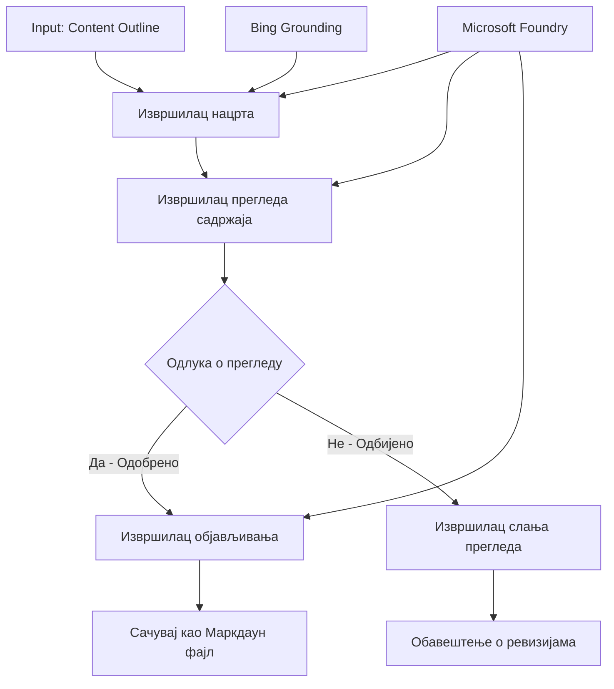

# 🔀 Условни токови задатака агента са Microsoft Foundry (.NET)

## 📋 Туторијал за интелигентне токове рада засноване на одлукама

Овај нотебоок демонстрира **условне шаблоне токова рада** користећи Microsoft Foundry и Microsoft Agent Framework за .NET. Научићете како да изградите софистициране, одлуком вођене токове рада који интелигентно усмеравају процесирање на основу AI анализе, пословних правила и динамичких услова за аутоматизацију на нивоу предузећа.

## 🎯 Циљеви учења

### 🧠 **Интелигентна архитектура одлука**
- **Имплементација условне логике**: Изградња сложених стабала одлука са више разгранавања
- **Рутација управљана AI**: Користите Microsoft Foundry моделе за интелигентне одлуке о усмеравању
- **Динамична адаптација токова рада**: Модификовати понашање токова рада у зависности од анализе и услова у току извршења
- **Интеграција пословних правила**: Укључивање пословне логике и захтева за усаглашеност у токове рада

### 🔀 **Напредни условни шаблони**
- **Доношење одлука на више критеријума**: Процењивање више фактора за одлуке о усмеравању
- **Обрађивање са свешћу о контексту**: Доношење одлука на основу акумулираног контекста и историје токова рада
- **Адаптивна модификација токова рада**: Динамичко подешавање путева процесирања на основу услове у реалном времену
- **Интеграција мотора правила**: Имплементација софистицираних пословних мотора правила у токове рада

### 🏢 **Условне апликације за предузећа**
- **Класификација и усмеравање докумената**: Аутоматска класификација и усмеравање докумената у одговарајуће токове рада
- **Тријажа корисничке службе**: Интелигентно усмеравање корисничких упита ка специјализованим тимовима
- **Обрада усаглашености и ризика**: Примена различитих процеса валидације и прегледа на основу процене ризика
- **Токови рада за контролу квалитета**: Усмеравање садржаја кроз одговарајуће процесе прегледа на основу метрика квалитета

## ⚙️ Претпоставке и подешавање

### 📦 **Потребни NuGet пакети**

Напредни пакети за обраду условних токова рада:

```xml
<!-- Core AI Framework -->
<PackageReference Include="Microsoft.Extensions.AI" Version="9.9.0" />

<!-- Azure AI Agents with Persistent State -->
<PackageReference Include="Azure.AI.Agents.Persistent" Version="1.2.0-beta.5" />

<!-- Azure Identity and Utilities -->
<PackageReference Include="Azure.Identity" Version="1.15.0" />
<PackageReference Include="System.Linq.Async" Version="6.0.3" />
<PackageReference Include="DotNetEnv" Version="3.1.1" />

<!-- Local Workflow Framework References -->
<!-- Microsoft.Agents.Workflows.dll - Advanced workflow orchestration -->
<!-- Microsoft.Agents.AI.AzureAI.dll - Microsoft Foundry integration -->
<!-- Microsoft.Agents.AI.dll - Core agent abstractions -->
```

### 🔑 **Конфигурација Microsoft Foundry**

**Потребни Azure ресурси:**
- Работни простор Microsoft Foundry са моделима за условну обраду
- Azure претплата са одговарајућим квотама за рачунарство и дозволама
- Распоређени AI модели за доношење одлука и анализу садржаја
- (Опционо) Bing Search API конекција за могућности утемељења

**Конфигурација окружења (фајл .env):**
```env
# Microsoft Foundry Configuration
AZURE_AI_PROJECT_ENDPOINT=https://your-project.cognitiveservices.azure.com/
BING_CONNECTION_ID=your-bing-connection-id
```

**Подешавање аутентикације:**
```csharp
// Azure CLI or Managed Identity authentication
using Azure.Identity;
var credential = new AzureCliCredential();

// Load environment configuration
DotNetEnv.Env.Load("../../../.env");
```

### 🏗️ **Архитектура условног токова рада**



**Кључне компоненте:**
- **Извршилац нацрта**: AI агент који креира почетне нацрте садржаја из нацрта
- **Извршилац прегледа садржаја**: AI агент који оцењује квалитет и усаглашеност нацрта
- **Условно усмеравање**: Логика одлука која усмерава на основу резултата прегледа
- **ПуTHеви објаве/прегледа**: Одвојени путеви процесирања за одобрени и одбачени садржај
- **Управљање стањем**: Одржава контекст садржаја и прегледа током целог тока рада

## 🎨 **Обрасци дизајна условних токова рада**

### 📋 **Производња садржаја са контролом квалитета**
```
Outline → Draft Creation → Quality Review → {Approve: Publish | Reject: Revise}
```

### 🎯 **Обрада докумената заснована на ризику**
```
Document → Risk Assessment → {Low: Standard | High: Enhanced Review}
```

### 🔍 **Интелигентно усмеравање корисничке службе**
```
Customer Query → Analysis → {Simple: FAQ Bot | Complex: Human Agent}
```

### 💼 **Токови рада вођени усаглашеношћу**
```
Content → Compliance Check → {Pass: Publish | Fail: Legal Review}
```

## 🏢 **Предности условног рада за предузећа**

### 🎯 **Интелигентна аутоматизација**
- **Паметно доношење одлука**: AI-подржане одлуке о усмеравању базиране на анализи садржаја и контексту
- **Адаптивна обрада**: Токови рада који се аутоматски прилагођавају променљивим условима
- **Примена пословних правила**: Аутоматска примена сложене пословне логике и политика
- **Усмеравање свесно контекста**: Одлуке базиране на пуном историјату токова рада и акумулираном контексту

### 📈 **Оперативна изврсност**
- **Оптимизована алокација ресурса**: Усмеравање посла ка најприкладнијим стручњацима и процесима
- **Смањена ручна интервенција**: Аутоматизовано доношење одлука минимизира потребу за људским усмеравањем
- **Брже време решавања**: Директно усмеравање ка одговарајућој експертизи и могућностима процесирања
- **Конзистентна примена**: Једнолика примена пословних правила и критеријума одлучивања

### 🛡️ **Управљање ризицима и усаглашеност**
- **Аутоматизована процена ризика**: AI-подржана процена садржаја и нивоу ризика ситуације
- **Надзор усаглашености**: Аутоматско усмеравање кроз прописане регулаторне процесе
- **Примена безбедносних протокола**: Појачане безбедносне мере примењене на основу процене ризика
- **Одржавање аудиторског трага**: Комплетна документација одлука о усмеравању и образложења

### 📊 **Аналитика и континуирано унапређење**
- **Аналитика одлука**: Праћење ефикасности и тачности одлука о усмеравању
- **Препознавање образаца**: Идентификовање трендова и образаца у одлукама о усмеравању током времена
- **Оптимизација перформанси**: Континуирано унапређење критеријума одлука и ефикасности усмеравања
- **Пословна интелигенција**: Увид у карактеристике садржаја и захтеве за процесирање

### 🔧 **Техничка изврсност**
- **Перзистентно управљање стањем**: Одржавање сложеног стања током извршења токова рада
- **Скалибилна архитектура**: Руководи захтевима за обрадом велике количине условних задатака
- **Капацитети интеграције**: Беспрекорна интеграција са постојећим пословним системима и процесима
- **Праћење и посматрање**: Свеобухватно праћење перформанси токова рада и одлука

Хајде да изградимо интелигентне, одлуком вођене токове рада за предузећа са .NET! 🚀

## 💻 Покретање кода

Потпуна имплементација је доступна у `04.dotnet-agent-framework-workflow-aifoundry-condition.cs`. Ово демонстрира **ток рада производње садржаја са контролним капијама**:

### 🏗️ **Архитектура токова рада**

```
Content Outline → Draft Creation → Quality Review → Conditional Routing:
                                                      ├─ Approved (>200 words) → Publish
                                                      └─ Rejected (<200 words) → Review Notification
```

**Агенти у току рада:**
1. **Евангелист агент**: Креира туторијалне нацрте из оквира са Bing утемељењем
2. **Агент за преглед садржаја**: Оцењује квалитет нацрта (број речи, потпунност)
3. **Агент за објаву**: Снима одобрени садржај као Markdown фајлове са ознаком времена

**Прилагођени извршиоци:**
1. **DraftExecutor**: Координише креирање нацрта
2. **ContentReviewExecutor**: Спроводи оцену квалитета
3. **PublishExecutor**: Руководи објавом одобреног садржаја
4. **SendReviewExecutor**: Управља обавештењима о одбаченом садржају

### 🚀 Покретање примера

**Претпоставке:**
- Конфигурисан Microsoft Foundry радни простор
- Azure CLI аутентификација (`az login`)
- (Опционо) Bing Search конекција за утемељење

```bash
# Направите скрипту извршном (Unix/Linux/macOS)
chmod +x 04.dotnet-agent-framework-workflow-aifoundry-condition.cs

# Покрените условни ток рада
./04.dotnet-agent-framework-workflow-aifoundry-condition.cs
```

Или на Windows-у:
```powershell
dotnet run 04.dotnet-agent-framework-workflow-aifoundry-condition.cs
```

### 📝 Очекивани излаз

Ток рада ће:
1. **Креирати агенте**: Иницијализовати три специјализована Microsoft Foundry агента
2. **Генерисати нацрт**: Евангелист агент креира нацрт туторијала из оквира
3. **Прегледати садржај**: Агент за преглед оцени квалитет нацрта
4. **Условно усмеравање**:
   - **Ако је одобрено (>200 речи)**: Извршилац за објаву чува као Markdown фајл
   - **Ако је одбачено (<200 речи)**: Слање обавештења о прегледу
5. **Приказ резултата**: Приказати коначни исход тока рада

### 🔧 Опције прилагођавања

**Измена критеријума прегледа:**
```csharp
const string ContentReviewerInstructions = @"
You are a content reviewer...
1. Check if content is more than 500 words (instead of 200)
2. Verify technical accuracy
3. Ensure proper formatting
...";
```

**Додавање више условних путева:**
```csharp
var workflow = new WorkflowBuilder(draftExecutor)
    .AddEdge(draftExecutor, contentReviewerExecutor)
    .AddEdge(contentReviewerExecutor, publishExecutor, condition: GetCondition("Excellent"))
    .AddEdge(contentReviewerExecutor, editExecutor, condition: GetCondition("Good"))
    .AddEdge(contentReviewerExecutor, sendReviewerExecutor, condition: GetCondition("Poor"))
    .Build();
```

**Промена захтева за садржај:**
```csharp
string OUTLINE_Content = @"
# Your Custom Topic
## Section 1
https://your-reference-url
## Section 2
...
";
```

### 🎯 Примене у стварном свету

Овај условни образац тока рада је идеалан за:
- **Системе за управљање садржајем**: Аутоматизовани уређивачки токови рада са контролним капијама
- **Обраду докумената**: Усмеравање докумената на основу класификације и усаглашености
- **Корисничку подршку**: Интелигентно усмеравање тикета на основу сложености и хитности
- **Правни преглед**: Усмеравање уговора на основу процене ризика и вредности
- **ХР процесе**: Усмеравање пријава кроз одговарајуће токове провере

### 🔍 Разумевање условне логике

**Функција услова:**
```csharp
public Func<object?, bool> GetCondition(string expectedResult) =>
    reviewResult => reviewResult is ReviewResult review && review.Result == expectedResult;
```

Ова функција креира предикат који:
1. Проверава да ли је резултат типа `ReviewResult`
2. Упоређује својство `Result` са очекиваном вредношћу
3. Враћа true/false како би одредила усмеравање

**Ивице тока рада са условима:**
```csharp
.AddEdge(contentReviewerExecutor, publishExecutor, condition: GetCondition("Yes"))
.AddEdge(contentReviewerExecutor, sendReviewerExecutor, condition: GetCondition("No"))
```

### 📊 Напредне функције

**Валидација JSON шеме:**
Ток рада користи JSON шеме да осигура структуриране одговоре:

```csharp
// Define response structure
public class ReviewResult
{
    [JsonPropertyName("review_result")]
    public string Result { get; set; } = string.Empty;
    
    [JsonPropertyName("reason")]
    public string Reason { get; set; } = string.Empty;
    
    [JsonPropertyName("draft_content")]
    public string DraftContent { get; set; } = string.Empty;
}

// Apply to agent
ResponseFormat = ChatResponseFormat.ForJsonSchema(
    AIJsonUtilities.CreateJsonSchema(typeof(ReviewResult)), 
    "ReviewResult", 
    "Review Result From DraftContent"
)
```

**Интеграција Bing утемељења:**
Евангелист агент користи Bing утемељење за приступ информацијама у реалном времену:

```csharp
var bingGroundingConfig = new BingGroundingSearchConfiguration(bing_conn_id);
BingGroundingToolDefinition bingGroundingTool = new(
    new BingGroundingSearchToolParameters([bingGroundingConfig])
);
```

Ово омогућава агенту да прати URL адресе у нацрту и извлачи актуелне информације.

### 🛡️ Руковање грешкама

Ток рада укључује робустан систем руковања грешкама за одбачени садржај:
- Неуспеси у прегледу покрећу алтернативни пут
- Обавештења пружају јасне разлоге одбијања
- Садржај је сачуван за ревизију

### 🔄 Проширење тока рада

**Додајте петљу ревизије:**
Креирајте повратну петљу која аутоматски преправља садржај:

```csharp
.AddEdge(contentReviewerExecutor, publishExecutor, condition: GetCondition("Yes"))
.AddEdge(contentReviewerExecutor, draftExecutor, condition: GetCondition("No")) // Loop back
```

**Имплементирајте преглед на више нивоа:**
Додајте више фаза прегледа са различитим критеријумима:

```csharp
.AddEdge(draftExecutor, technicalReviewer)
.AddEdge(technicalReviewer, editorialReviewer, condition: GetCondition("TechPass"))
.AddEdge(editorialReviewer, publishExecutor, condition: GetCondition("EditPass"))
```

Овај условни образац тока рада пружа темељ за изградњу софистицираних, интелигентних система аутоматизације за предузећа! 🚀

---

<!-- CO-OP TRANSLATOR DISCLAIMER START -->
**Изјава о одрицању одговорности**:
Овај документ је преведен коришћењем услуге за аутоматски превод [Co-op Translator](https://github.com/Azure/co-op-translator). Иако тежимо тачности, имајте у виду да аутоматски преводи могу садржати грешке или нетачности. Оригинални документ на његовом изворном језику треба сматрати ауторитативним извором. За критичне информације препоручује се професионални људски превод. Нисмо одговорни за било каква неспоразума или погрешна тумачења која произилазе из коришћења овог превода.
<!-- CO-OP TRANSLATOR DISCLAIMER END -->