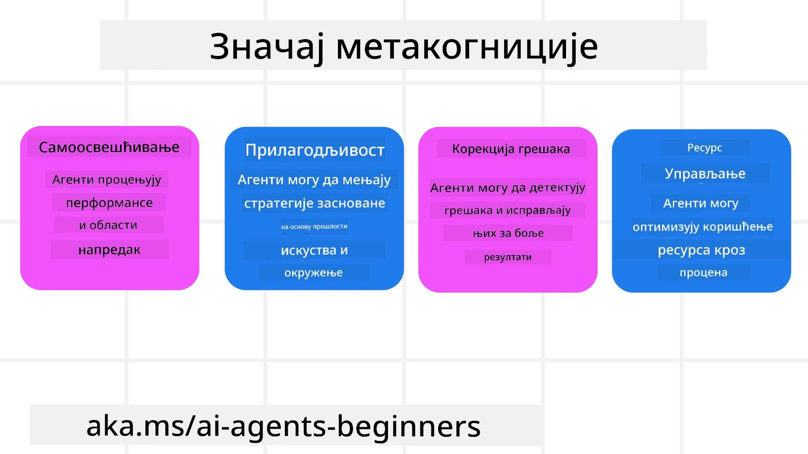
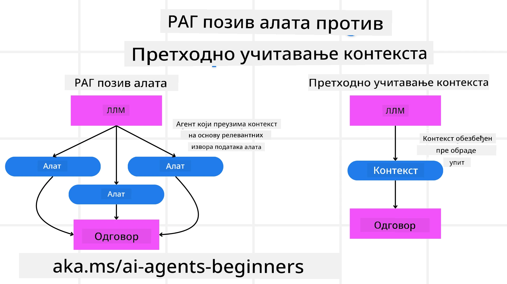

[](https://youtu.be/His9R6gw6Ec?si=3_RMb8VprNvdLRhX)

> _(Кликните слику изнад да бисте гледали видео о овом часу)_
# Метакогниција у AI агентима

## Увод

Добродошли на час о метакогницији у AI агентима! Ово поглавље је намењено почетницима који су знатижељни како AI агенти могу размишљати о својим властитим процесима размишљања. На крају овог часа, разумећете кључне појмове и бићете опремљени практичним примерима за примену метакогниције у дизајну AI агената.

## Циљеви учења

Након завршетка овог часа, моћи ћете да:

1. Разумете импликације петљи резоновања у дефиницијама агената.
2. Користите технике планирања и вредновања да помогнете агентима који се сами коригују.
3. Креирате сопствене агенте способне за манипулацију кодом ради извршења задатака.

## Увод у метакогницију

Метакогниција се односи на когнитивне процесе вишег реда који укључују размишљање о властитом размишљању. За AI агенте, то значи бити способан да процене и прилагоде своје акције на основу самосвести и претходних искустава. Метакогниција, или „размишљање о размишљању“, је важан концепт у развоју агенцијских AI система. Она подразумева да AI системи буду свесни својих унутрашњих процеса и да могу да прате, регулишу и прилагођавају своје понашање у складу с тим. Као што ми радимо када „читамо простор“ или посматрамо проблем. Ова самосвест може помоћи AI системима да доносе боље одлуке, идентификују грешке и побољшају своје учинке током времена – што се поново односи на Тјурингов тест и дебату о томе да ли ће AI преузети контролу.

У контексту агенцијских AI система, метакогниција може помоћи у решавању неколико изазова, као што су:
- Прозирност: Осигурање да AI системи могу објаснити своје резоновање и одлуке.
- Резоновање: Побољшање способности AI система да синтетишу информације и доносе исправне одлуке.
- Прилагођавање: Омогућавање AI системима да се прилагођавају новим окружењима и промењеним условима.
- Перцепција: Побољшање тачности AI система у препознавању и тумачењу података из околине.

### Шта је метакогниција?

Метакогниција, или „размишљање о размишљању“, је когнитивни процес вишег реда који укључује самосвест и саморегулацију когнитивних процеса. У домену AI, метакогниција оснажује агенте да процењују и прилагођавају своје стратегије и акције, што доводи до побољшане способности решавања проблема и доношења одлука. Разумевањем метакогниције, можете дизајнирати AI агенте који нису само интелигентнији већ и прилагодљивији и ефикаснији. Правом метакогницјом, видео бисте како AI експлицитно разматра своје сопствено резоновање.

Пример: „Приоритизовао сам јефтиније летове јер… можда пропуштам директне летове, па хајде да поново проверим.“
Праћење како или зашто је изабрао одређену руту.
- Уочавање да је направио грешке јер се превише ослањао на корисничке преференције из претходног пута, па мења своју стратегију доношења одлука, а не само коначну препоруку.
- Дијагностификација образаца као што је: „Кад год видим да корисник помиње ‘превише гужве,’ не би требало само да уклоним одређене атракције већ и да размотрим да је мој метод избора ‘топ атракција’ погрешан ако их увек рангирам по популарности.“

### Значај метакогниције у AI агентима

Метакогниција игра кључну улогу у дизајну AI агената из више разлога:



- Саморефлексија: Агенти могу проценити своје перформансе и идентификовати области за унапређење.
- Прилагодљивост: Агенти могу модификовати своје стратегије на основу претходних искустава и промењених окружења.
- Корекција грешака: Агенти могу аутономно детектовати и исправљати грешке, што води до прецизнијих резултата.
- Управљање ресурсима: Агенти могу оптимизовати употребу ресурса, као што су време и обрачунска снага, планирањем и вредновањем својих акција.

## Компоненте AI агента

Пре уласка у метакогнитивне процесе, важно је разумети основне компоненте AI агента. AI агент обично се састоји од:

- Персона: Личност и карактеристике агента, које одређују како он комуницира са корисницима.
- Алати: Капацитети и функције које агент може да извршава.
- Вештине: Знање и експертиза која агент поседује.

Ове компоненте раде заједно како би створиле „јединицу стручности“ која може обављати специфичне задатке.

**Пример**:
Размотрите туристичког агента, агентске услуге која не само да планира ваш одмор већ и прилагођава свој ток на основу података у реалном времену и претходних искустава корисничких путовања.

### Пример: Метакогниција у туристичкој агенцији

Замислите да дизајнирате туристичку агенцију која користи AI. Овај агент, „Туристички агент“, помаже корисницима у планирању њихових одмора. Да би унео метакогницију, Туристички агент треба да процени и прилагоди своје акције на основу самосвести и претходних искустава. Ево како метакогниција може играти улогу:

#### Тренутни задатак

Тренутни задатак је да помогне кориснику да испланира путовање у Париз.

#### Кораци за извршење задатка

1. **Прикупљање корисничких преференција**: Питајте корисника о његовим датумима путовања, буџету, интересовањима (нпр. музеји, кухиња, куповина) и специфичним захтевима.
2. **Претрага информација**: Тражите опције летења, смештаја, атракција и ресторана које одговарају корисничким преференцијама.
3. **Генерисање препорука**: Пружите персонализовани итинерер са детаљима летења, резервацијама хотела и предложеним активностима.
4. **Подешавање на основу повратних информација**: Питајте корисника за мишљење о препорукама и направите неопходне измене.

#### Потребни ресурси

- Приступ базама података за резервацију летова и хотела.
- Информације о париским атракцијама и ресторанима.
- Податке о повратним информацијама корисника из претходних интеракција.

#### Искуство и саморефлексија

Туристички агент користи метакогницију како би проценио свој учинак и учио из претходних искустава. На пример:

1. **Анализа повратних информација корисника**: Туристички агент прегледа повратне информације корисника да би утврдио које су препоруке добро прихваћене, а које нису. Прилагођава своје будуће предлоге у складу с тим.
2. **Прилагодљивост**: Ако је корисник раније помињао да не воли гужве, Туристички агент ће у будућности избегавати препоручивање популарних туристичких места у време највеће гужве.
3. **Корекција грешака**: Ако је Туристички агент направио грешку у претходној резервацији, као што је предлог хотела који је био потпуно резервисан, научиће да строже проверава доступност пре изношења препорука.

#### Практичан пример за програмере

Ево поједностављеног примера кода како би изгледао код Туристичког агента који укључује метакогницију:

```python
class Travel_Agent:
    def __init__(self):
        self.user_preferences = {}
        self.experience_data = []

    def gather_preferences(self, preferences):
        self.user_preferences = preferences

    def retrieve_information(self):
        # Претражите летове, хотеле и атракције на основу преференција
        flights = search_flights(self.user_preferences)
        hotels = search_hotels(self.user_preferences)
        attractions = search_attractions(self.user_preferences)
        return flights, hotels, attractions

    def generate_recommendations(self):
        flights, hotels, attractions = self.retrieve_information()
        itinerary = create_itinerary(flights, hotels, attractions)
        return itinerary

    def adjust_based_on_feedback(self, feedback):
        self.experience_data.append(feedback)
        # Анализирајте повратне информације и прилагодите будуће препоруке
        self.user_preferences = adjust_preferences(self.user_preferences, feedback)

# Пример коришћења
travel_agent = Travel_Agent()
preferences = {
    "destination": "Paris",
    "dates": "2025-04-01 to 2025-04-10",
    "budget": "moderate",
    "interests": ["museums", "cuisine"]
}
travel_agent.gather_preferences(preferences)
itinerary = travel_agent.generate_recommendations()
print("Suggested Itinerary:", itinerary)
feedback = {"liked": ["Louvre Museum"], "disliked": ["Eiffel Tower (too crowded)"]}
travel_agent.adjust_based_on_feedback(feedback)
```

#### Зашто је метакогниција важна

- **Саморефлексија**: Агенти могу анализирати свој учинак и идентификовати области за унапређење.
- **Прилагодљивост**: Агенти могу модификовати стратегије на основу повратних информација и промењених услова.
- **Корекција грешака**: Агенти могу аутономно откривати и исправљати грешке.
- **Управљање ресурсима**: Агенти могу оптимизовати коришћење ресурса, као што су време и обрачунска снага.

Увођењем метакогниције, Туристички агент може пружити персонализованије и прецизније препоруке за путовања, побољшавајући укупно корисничко искуство.

---

## 2. Планирање у агентима

Планирање је критична компонента понашања AI агената. Оно укључује опис корака потребних за постизање циља, уз разматрање тренутног стања, ресурса и могућих препрека.

### Елементи планирања

- **Тренутни задатак**: Јасно дефинишите задатак.
- **Кораци за извршење задатка**: Поделите задатак на управљиве кораке.
- **Потребни ресурси**: Идентификујте неопходне ресурсе.
- **Искуство**: Користите претходна искуства за информисање планирања.

**Пример**:
Ево корака које Туристички агент треба да изврши како би ефикасно помогао кориснику да испланира своје путовање:

### Кораци за Туристички агент

1. **Прикупљање корисничких преференција**
   - Питајте корисника за детаље о датумима путовања, буџету, интересовањима и специфичним захтевима.
   - Примери: „Када планирате путовање?“ „Који вам је опсег буџета?“ „Које активности волите на одмору?“

2. **Претрага информација**
   - Тражите релевантне опције путовања на основу преференција корисника.
   - **Летови**: Тражите доступне летове у оквиру корисниковог буџета и желењих датума путовања.
   - **Смештај**: Пронађите хотеле или смештаје који одговарају преференцијама корисника за локацију, цену и садржаје.
   - **Атракције и ресторани**: Идентификујте популарне атракције, активности и опције исхране које одговарају интересовањима корисника.

3. **Генерисање препорука**
   - Компилирајте прикупљене информације у персонализовани итинерер.
   - Пружите детаље као што су опције летења, резервације у хотелу и предложене активности, водећи рачуна о преференцијама корисника.

4. **Презентовање итинерера кориснику**
   - Поделите предложени итинерер са корисником ради прегледа.
   - Пример: „Ево предложеног итинерера за ваше путовање у Париз. Укључује детаље о летовима, резервацијама хотела и списак препоручених активности и ресторана. Јавите ми ваше мишљење!“

5. **Прикупљање повратних информација**
   - Питајте корисника за коментаре о предложеном итинереру.
   - Примери: „Да ли вам се свиђају опције летења?“ „Да ли вам хотел одговара?“ „Постоје ли активности које бисте желели додати или уклонити?“

6. **Подешавање на основу повратних информација**
   - Измените итинерер на основу повратних информација корисника.
   - Направите неопходне измене у препорукама за лет, смештај и активности да боље одговарају корисничким преференцијама.

7. **Коначна потврда**
   - Представите ажурирани итинерер кориснику ради коначне потврде.
   - Пример: „Направио сам измене на основу ваших повратних информација. Ево ажурираног итинерера. Да ли вам све изгледа у реду?“

8. **Резервација и потврда резервација**
   - Кад корисник одобри итинерер, наставите са резервацијом летова, смештаја и било којих планираних активности.
   - Пошаљите детаље потврде кориснику.

9. **Пружање сталне подршке**
   - Будите доступни да помогнете кориснику са изменама или додатним захтевима пре и током путовања.
   - Пример: „Ако вам затреба додатна помоћ током путовања, слободно ми се обратите у било ком тренутку!“

### Пример интеракције

```python
class Travel_Agent:
    def __init__(self):
        self.user_preferences = {}
        self.experience_data = []

    def gather_preferences(self, preferences):
        self.user_preferences = preferences

    def retrieve_information(self):
        flights = search_flights(self.user_preferences)
        hotels = search_hotels(self.user_preferences)
        attractions = search_attractions(self.user_preferences)
        return flights, hotels, attractions

    def generate_recommendations(self):
        flights, hotels, attractions = self.retrieve_information()
        itinerary = create_itinerary(flights, hotels, attractions)
        return itinerary

    def adjust_based_on_feedback(self, feedback):
        self.experience_data.append(feedback)
        self.user_preferences = adjust_preferences(self.user_preferences, feedback)

# Пример коришћења унутар захтева за боокинг
travel_agent = Travel_Agent()
preferences = {
    "destination": "Paris",
    "dates": "2025-04-01 to 2025-04-10",
    "budget": "moderate",
    "interests": ["museums", "cuisine"]
}
travel_agent.gather_preferences(preferences)
itinerary = travel_agent.generate_recommendations()
print("Suggested Itinerary:", itinerary)
feedback = {"liked": ["Louvre Museum"], "disliked": ["Eiffel Tower (too crowded)"]}
travel_agent.adjust_based_on_feedback(feedback)
```

## 3. Корективни РАГ систем

Прво хајде да разумемо разлику између РАГ алата и претходног учитавања контекста



### Ретривал-оугментед генерација (RAG)

РАГ комбинује систем за преузимање са генеративним моделом. Када се постави упит, систем за преузимање дохвата релевантне документе или податке из спољног извора, а те преузете информације се користе за побољшање улаза генеративном моделу. Ово помаже моделу да генерише прецизније и контекстуално релевантне одговоре.

У РАГ систему, агент преузима релевантне податке из базе знања и користи их за генерисање одговарајућих тих одговора или акција.

### Корективни РАГ приступ

Корективни РАГ приступ фокусира се на коришћење РАГ техника за исправљање грешака и побољшање прецизности AI агената. Ово обухвата:

1. **Техника упита**: Користење специфичних упита који воде агента у преузимању релевантних информација.
2. **Алат**: Имплементација алгоритама и механизама који омогућавају агента да оцењива релевантност преузетих информација и генерише тачне одговоре.
3. **Вредновање**: Континуирано оцењивање перформанси агента и вршење прилагођавања ради побољшања прецизности и ефикасности.

#### Пример: Корективни РАГ у претраживачком агенту

Размотрите претраживачки агент који преузима информације са веба да би одговорио на корисничке упите. Приступ Корективног РАГ-а може укључивати:

1. **Техника упита**: Формирање упита за претрагу на основу корисничког уноса.
2. **Алат**: Користећи обраду природног језика и машинско учење за рангирање и филтрирање резултата претраге.
3. **Вредновање**: Анализа корисничких повратних информација ради идентификовања и корекције нетачности у преузетим подацима.

### Корективни РАГ у Туристичком агенту

Корективни РАГ (Retrieval-Augmented Generation) побољшава способност AI да преузима и генерише информације док истовремено исправља било какве нетачности. Погледајмо како Туристички агент може користити приступ Корективног РАГ-а да пружи прецизније и релевантније препоруке за путовања.

Ово укључује:

- **Техника упита:** Користећи специфичне упите који воде агента у претраживању релевантних информација.
- **Алат:** Имплементација алгоритама и механизама који омогућавају агента да оцењује релевантност преузетих података и генерише прецизне одговоре.
- **Вредновање:** Континуирано оцењивање перформанси агента и вршење прилагођавања ради побољшања прецизности и ефикасности.

#### Кораци за имплементацију Корективног РАГ-а у Туристичком агенту

1. **Почетна интеракција са корисником**
   - Туристички агент прикупља почетне преференције корисника као што су дестинација, датуми путовања, буџет и интересовања.
   - Пример:

     ```python
     preferences = {
         "destination": "Paris",
         "dates": "2025-04-01 to 2025-04-10",
         "budget": "moderate",
         "interests": ["museums", "cuisine"]
     }
     ```

2. **Преузимање информација**
   - Туристички агент преузима информације о летовима, смештају, атракцијама и ресторанима на основу корисничких преференција.
   - Пример:

     ```python
     flights = search_flights(preferences)
     hotels = search_hotels(preferences)
     attractions = search_attractions(preferences)
     ```

3. **Генерисање почетних препорука**
   - Туристички агент користи преузете податке да би генерисао персонализовани итинерер.
   - Пример:

     ```python
     itinerary = create_itinerary(flights, hotels, attractions)
     print("Suggested Itinerary:", itinerary)
     ```

4. **Прикупљање повратних информација корисника**
   - Туристички агент тражи коментаре корисника о почетним препорукама.
   - Пример:

     ```python
     feedback = {
         "liked": ["Louvre Museum"],
         "disliked": ["Eiffel Tower (too crowded)"]
     }
     ```

5. **Процес Корективног РАГ-а**
   - **Техника упита**: Туристички агент формулише нове упите за претрагу на основу повратних информација корисника.
     - Пример:

       ```python
       if "disliked" in feedback:
           preferences["avoid"] = feedback["disliked"]
       ```

   - **Алат**: Туристички агент користи алгоритме за рангирање и филтрирање нових резултата претраге, наглашавајући релевантност на основу повратних информација.
     - Пример:

       ```python
       new_attractions = search_attractions(preferences)
       new_itinerary = create_itinerary(flights, hotels, new_attractions)
       print("Updated Itinerary:", new_itinerary)
       ```

   - **Вредновање**: Туристички агент континуирано процењује релевантност и прецизност својих препорука анализом повратних информација и врши неопходна подешавања.
     - Пример:

       ```python
       def adjust_preferences(preferences, feedback):
           if "liked" in feedback:
               preferences["favorites"] = feedback["liked"]
           if "disliked" in feedback:
               preferences["avoid"] = feedback["disliked"]
           return preferences

       preferences = adjust_preferences(preferences, feedback)
       ```

#### Практичан пример

Ево поједностављеног примера Python кода који укључује приступ Корективног РАГ-а у Туристичком агенту:

```python
class Travel_Agent:
    def __init__(self):
        self.user_preferences = {}
        self.experience_data = []

    def gather_preferences(self, preferences):
        self.user_preferences = preferences

    def retrieve_information(self):
        flights = search_flights(self.user_preferences)
        hotels = search_hotels(self.user_preferences)
        attractions = search_attractions(self.user_preferences)
        return flights, hotels, attractions

    def generate_recommendations(self):
        flights, hotels, attractions = self.retrieve_information()
        itinerary = create_itinerary(flights, hotels, attractions)
        return itinerary

    def adjust_based_on_feedback(self, feedback):
        self.experience_data.append(feedback)
        self.user_preferences = adjust_preferences(self.user_preferences, feedback)
        new_itinerary = self.generate_recommendations()
        return new_itinerary

# Пример употребе
travel_agent = Travel_Agent()
preferences = {
    "destination": "Paris",
    "dates": "2025-04-01 to 2025-04-10",
    "budget": "moderate",
    "interests": ["museums", "cuisine"]
}
travel_agent.gather_preferences(preferences)
itinerary = travel_agent.generate_recommendations()
print("Suggested Itinerary:", itinerary)
feedback = {"liked": ["Louvre Museum"], "disliked": ["Eiffel Tower (too crowded)"]}
new_itinerary = travel_agent.adjust_based_on_feedback(feedback)
print("Updated Itinerary:", new_itinerary)
```

### Претходно учитавање контекста


Предузимачко учитавање контекста подразумева учитавање релевантног контекста или позадинских информација у модел пре обраде упита. То значи да модел има приступ овим информацијама од почетка, што му може помоћи да генерише информисаније одговоре без потребе за додатним проналажењем података током процеса.

Ево поједностављеног примера како би предузимачко учитавање контекста могло изгледати за апликацију путничког агента у Пајтону:

```python
class TravelAgent:
    def __init__(self):
        # Унапред учитај популарне дестинације и њихове информације
        self.context = {
            "Paris": {"country": "France", "currency": "Euro", "language": "French", "attractions": ["Eiffel Tower", "Louvre Museum"]},
            "Tokyo": {"country": "Japan", "currency": "Yen", "language": "Japanese", "attractions": ["Tokyo Tower", "Shibuya Crossing"]},
            "New York": {"country": "USA", "currency": "Dollar", "language": "English", "attractions": ["Statue of Liberty", "Times Square"]},
            "Sydney": {"country": "Australia", "currency": "Dollar", "language": "English", "attractions": ["Sydney Opera House", "Bondi Beach"]}
        }

    def get_destination_info(self, destination):
        # Преузми информације о дестинацијама из унапред учитаног контекста
        info = self.context.get(destination)
        if info:
            return f"{destination}:\nCountry: {info['country']}\nCurrency: {info['currency']}\nLanguage: {info['language']}\nAttractions: {', '.join(info['attractions'])}"
        else:
            return f"Sorry, we don't have information on {destination}."

# Пример употребе
travel_agent = TravelAgent()
print(travel_agent.get_destination_info("Paris"))
print(travel_agent.get_destination_info("Tokyo"))
```

#### Објашњење

1. **Иницијализација (`__init__` метода)**: Класа `TravelAgent` претходно учитава речник који садржи информације о популарним дестинацијама попут Париза, Токија, Њујорка и Сиднеја. Тај речник укључује детаље као што су земља, валута, језик и главне атракције за сваку дестинацију.

2. **Проналажење информација (`get_destination_info` метода)**: Када корисник упита о одређеној дестинацији, метод `get_destination_info` добија релевантне информације из претходно учитаног речника контекста.

Претходним учитавањем контекста, апликација путничког агента може брзо одговарати на упите корисника без потребе да у реалном времену проналази те информације из спољашњег извора. То чини апликацију ефикаснијом и реактивнијом.

### Покретање плана са циљем пре итерирања

Покретање плана са циљем подразумева почетак са јасним циљем или жељеним исходом на уму. Дефинисањем тог циља унапред, модел може користити тај циљ као водич кроз цео итеративни процес. Ово помаже да свака итерција буде корак ближе остварењу жељеног резултата, чинећи процес ефикаснијим и фокусиранијим.

Ево примера како бисте могли покренути план путовања са циљем пре итерирања за путничког агента у Пајтону:

### Сценарио

Путнички агент жели да испланира прилагођени одмор за клијента. Циљ је креирати план путовања који максимизира клијентово задовољство на основу њихових преференција и буџета.

### Кораци

1. Дефинишите клијентове преференције и буџет.
2. Покрените почетни план на основу тих преференција.
3. Итеративно усавршавајте план, оптимизујући га за клијентово задовољство.

#### Python код

```python
class TravelAgent:
    def __init__(self, destinations):
        self.destinations = destinations

    def bootstrap_plan(self, preferences, budget):
        plan = []
        total_cost = 0

        for destination in self.destinations:
            if total_cost + destination['cost'] <= budget and self.match_preferences(destination, preferences):
                plan.append(destination)
                total_cost += destination['cost']

        return plan

    def match_preferences(self, destination, preferences):
        for key, value in preferences.items():
            if destination.get(key) != value:
                return False
        return True

    def iterate_plan(self, plan, preferences, budget):
        for i in range(len(plan)):
            for destination in self.destinations:
                if destination not in plan and self.match_preferences(destination, preferences) and self.calculate_cost(plan, destination) <= budget:
                    plan[i] = destination
                    break
        return plan

    def calculate_cost(self, plan, new_destination):
        return sum(destination['cost'] for destination in plan) + new_destination['cost']

# Пример употребе
destinations = [
    {"name": "Paris", "cost": 1000, "activity": "sightseeing"},
    {"name": "Tokyo", "cost": 1200, "activity": "shopping"},
    {"name": "New York", "cost": 900, "activity": "sightseeing"},
    {"name": "Sydney", "cost": 1100, "activity": "beach"},
]

preferences = {"activity": "sightseeing"}
budget = 2000

travel_agent = TravelAgent(destinations)
initial_plan = travel_agent.bootstrap_plan(preferences, budget)
print("Initial Plan:", initial_plan)

refined_plan = travel_agent.iterate_plan(initial_plan, preferences, budget)
print("Refined Plan:", refined_plan)
```

#### Објашњење кода

1. **Иницијализација (`__init__` метода)**: Класа `TravelAgent` је иницијализована са списком потенцијалних дестинација, при чему свака има атрибуте као што су име, трошак и тип активности.

2. **Покретање плана (`bootstrap_plan` метода)**: Ова метода креира почетни план путовања на основу клијентових преференција и буџета. Пролази кроз списак дестинација и додаје их у план ако одговарају клијентовим преференцијама и уклапају се у буџет.

3. **Провера преференција (`match_preferences` метода)**: Ова метода проверава да ли дестинација одговара клијентовим преференцијама.

4. **Итерација плана (`iterate_plan` метода)**: Ова метода усавршава почетни план тако што покушава да замени сваку дестинацију у плану бољом која узима у обзир клијентове преференције и буџетске ограничења.

5. **Израчунавање трошкова (`calculate_cost` метода)**: Ова метода израчунава укупни трошак тренутног плана, укључујући потенцијално нову дестинацију.

#### Пример употребе

- **Почетни план**: Путнички агент креира почетни план на основу клијентових преференција за разгледање и буџета од 2000 долара.
- **Усавршени план**: Путнички агент итерира план, оптимизујући га за клијентове преференције и буџет.

Покретањем плана са јасним циљем (нпр. максимизовање задовољства клијента) и итерирањем ради усавршавања, путнички агент може направити прилагођен и оптимизован план путовања за клијента. Овај приступ обезбеђује да план путовања од почетка буде у складу са клијентиновим преференцијама и буџетом и побољшава се сваким циклусом итерације.

### Коришћење предности LLM за реарењирање и оцењивање

Велики језички модели (LLM) могу да се користе за реарењирање и оцењивање тако што процењују релевантност и квалитет пронађених докумената или генерисаних одговора. Ево како то функционише:

**Проналажење:** Почетни корак проналажења добија скуп кандидата докумената или одговора на основу упита.

**Реарењирање:** LLM процењује те кандидате и поново их рангира на основу релевантности и квалитета. Овај корак осигурава да се најрелевантније и најквалитетније информације представљају прво.

**Оцењивање:** LLM додељује оцене сваком кандидату, одражавајући њихову релевантност и квалитет. Ово помаже у избору најбољег одговора или документа за корисника.

Коришћењем LLM за реарењирање и оцењивање систем може пружити прецизније и контекстуално релевантније информације, побољшавајући укупно корисничко искуство.

Ево примера како путнички агент може користити велики језички модел (LLM) за реарењирање и оцењивање дестинација путовања на основу корисничких преференција у Пајтону:

#### Сценарио - Путовање на основу преференција

Путнички агент жели да препоручи најбоље дестинације путовања клијенту на основу њихових преференција. LLM ће помоћи у реарењирању и оцењивању дестинација како би се обезбедиле најрелевантније опције.

#### Кораци:

1. Прикупите корисничке преференције.
2. Проналажење списка потенцијалних дестинација путовања.
3. Користите LLM за реарењирање и оцењивање дестинација на основу корисничких преференција.

Ево како можете ажурирати претходни пример да користи Azure OpenAI услуге:

#### Захтеви

1. Потребна вам је Azure претплата.
2. Креирајте Azure OpenAI ресурс и набавите ваш API кључ.

#### Пример Python кода

```python
import requests
import json

class TravelAgent:
    def __init__(self, destinations):
        self.destinations = destinations

    def get_recommendations(self, preferences, api_key, endpoint):
        # Генериши упит за Azure OpenAI
        prompt = self.generate_prompt(preferences)
        
        # Дефиниши заглавља и садржај захтева
        headers = {
            'Content-Type': 'application/json',
            'Authorization': f'Bearer {api_key}'
        }
        payload = {
            "prompt": prompt,
            "max_tokens": 150,
            "temperature": 0.7
        }
        
        # Позови Azure OpenAI API да добијеш поново рангиране и оцењене дестинације
        response = requests.post(endpoint, headers=headers, json=payload)
        response_data = response.json()
        
        # Извучи и врати препоруке
        recommendations = response_data['choices'][0]['text'].strip().split('\n')
        return recommendations

    def generate_prompt(self, preferences):
        prompt = "Here are the travel destinations ranked and scored based on the following user preferences:\n"
        for key, value in preferences.items():
            prompt += f"{key}: {value}\n"
        prompt += "\nDestinations:\n"
        for destination in self.destinations:
            prompt += f"- {destination['name']}: {destination['description']}\n"
        return prompt

# Пример коришћења
destinations = [
    {"name": "Paris", "description": "City of lights, known for its art, fashion, and culture."},
    {"name": "Tokyo", "description": "Vibrant city, famous for its modernity and traditional temples."},
    {"name": "New York", "description": "The city that never sleeps, with iconic landmarks and diverse culture."},
    {"name": "Sydney", "description": "Beautiful harbour city, known for its opera house and stunning beaches."},
]

preferences = {"activity": "sightseeing", "culture": "diverse"}
api_key = 'your_azure_openai_api_key'
endpoint = 'https://your-endpoint.com/openai/deployments/your-deployment-name/completions?api-version=2022-12-01'

travel_agent = TravelAgent(destinations)
recommendations = travel_agent.get_recommendations(preferences, api_key, endpoint)
print("Recommended Destinations:")
for rec in recommendations:
    print(rec)
```

#### Објашњење кода - Резервација преференција

1. **Иницијализација**: Класа `TravelAgent` је иницијализована са списком потенцијалних дестинација путовања, при чему свака има атрибуте као што су име и опис.

2. **Добијање препорука (`get_recommendations` метода)**: Ова метода генерише упит за Azure OpenAI сервис на основу корисникових преференција и шаље HTTP POST захтев Azure OpenAI API-ју да добије реарењиране и оцењене дестинације.

3. **Генерисање упита (`generate_prompt` метода)**: Ова метода конструише упит за Azure OpenAI, у који укључује корисникове преференције и списак дестинација. Упит усмерава модел да реарењира и оцени дестинације на основу наведених преференција.

4. **Позив API-ју**: Користи се библиотека `requests` за слање HTTP POST захтева Azure OpenAI API крајњој тачки. Одговор садржи реарењиране и оцењене дестинације.

5. **Пример употребе**: Путнички агент прикупља корисничке преференције (нпр. интересовање за разгледање и разноликост културе) и користи Azure OpenAI сервис да добије реарењиране и оцењене препоруке за дестинације путовања.

Обавезно замените `your_azure_openai_api_key` вашим стварним Azure OpenAI API кључем и `https://your-endpoint.com/...` са стварним URL-ом крајње тачке ваше Azure OpenAI имплементације.

Коришћењем LLM за реарењирање и оцењивање, путнички агент може пружити персонализованије и релевантније препоруке путовања клијентима, побољшавајући њихово укупно искуство.

### RAG: Техника подстицања против алата

Retrieval-Augmented Generation (RAG) може бити и техника подстицања и алат у развоју AI агената. Разумевање разлике између ова два може вам помоћи да ефикасније користите RAG у вашим пројектима.

#### RAG као техника подстицања

**Шта је то?**

- Као техника подстицања, RAG подразумева формулисање специфичних упита или подсетника за усмеравање проналажења релевантних информација из великог корпуса или базе података. Ове информације се затим користе за генерисање одговора или радњи.

**Како функционише:**

1. **Формулисање подсетника**: Креирајте добро структуриране подсетнике или упите на основу задатка или корисничког уноса.
2. **Проналажење информација**: Користите подсетнике за претрагу релевантних података из већ постојеће базе знања или скупа података.
3. **Генерисање одговора**: Комбинујте пронађене информације са генеративним AI моделима да бисте произвели свеобухватан и кохерентан одговор.

**Пример у путничком агенту**:

- Кориснички унос: "Желим да посетим музеје у Паризу."
- Подсетник: "Нађи најбоље музеје у Паризу."
- Пронађене информације: Детаљи о музеју Лувр, Музеју Орсеј итд.
- Генерисани одговор: "Ево неких најбољих музеја у Паризу: музеј Лувр, Музеј Орсеј и Центар Помпиду."

#### RAG као алат

**Шта је то?**

- Као алат, RAG је интегрисани систем који аутоматизује процес проналажења и генерисања, олакшавајући програмерима имплементацију сложених AI функција без ручног формулисања подсетника за сваки упит.

**Како функционише:**

1. **Интеграција**: Уградите RAG у архитектуру AI агента, омогућавајући му аутоматско руковање задацима проналажења и генерисања.
2. **Аутоматизација**: Алат управља целим процесом, од примања корисничког уноса до генерисања коначног одговора, без потребе за експлицитним подсетницима за сваки корак.
3. **Ефикасност**: Побољшава перформансе агента поједностављујући процес проналажења и генерисања, омогућавајући брже и прецизније одговоре.

**Пример у путничком агенту**:

- Кориснички унос: "Желим да посетим музеје у Паризу."
- RAG алат: Аутоматски проналази информације о музејима и генерише одговор.
- Генерисани одговор: "Ево неких најбољих музеја у Паризу: музеј Лувр, Музеј Орсеј и Центар Помпиду."

### Поређење

| Аспект                | Техника подстицања                                     | Алат                                                 |
|-----------------------|--------------------------------------------------------|------------------------------------------------------|
| **Ручно против аутоматског** | Ручно формулисање подсетника за сваки упит.             | Аутоматизовани процес проналажења и генерисања.     |
| **Контрола**           | Пружа већу контролу над процесом проналажења.           | Поједностављује и аутоматизује проналажење и генерисање. |
| **Флексибилност**      | Омогућава прилагођене подсетнике на основу специфичних потреба. | Ефикаснији за имплементације широких размера.        |
| **Комплексност**       | Захтева креирање и подешавање подсетника.               | Лакше се интегрише у архитектуру AI агента.          |

### Практични примери

**Пример технике подстицања:**

```python
def search_museums_in_paris():
    prompt = "Find top museums in Paris"
    search_results = search_web(prompt)
    return search_results

museums = search_museums_in_paris()
print("Top Museums in Paris:", museums)
```

**Пример алата:**

```python
class Travel_Agent:
    def __init__(self):
        self.rag_tool = RAGTool()

    def get_museums_in_paris(self):
        user_input = "I want to visit museums in Paris."
        response = self.rag_tool.retrieve_and_generate(user_input)
        return response

travel_agent = Travel_Agent()
museums = travel_agent.get_museums_in_paris()
print("Top Museums in Paris:", museums)
```

### Оцењивање релевантности

Оцењивање релевантности је кључни аспект перформанси AI агената. Оно осигурава да су информације које агент проналази и генерише адекватне, тачне и корисне кориснику. Погледајмо како се оцењује релевантност у AI агентима, укључујући практичне примере и технике.

#### Кључни појмови у оцењивању релевантности

1. **Свесност контекста**:
   - Агент мора разумети контекст корисничког упита како би проналажео и генерисао релевантне информације.
   - Пример: Ако корисник пита за "најбоље ресторане у Паризу", агент треба узети у обзир корисничке преференције као што су тип кухиње и буџет.

2. **Тачност**:
   - Информације које агент пружа морају бити чињенично исправне и актуелне.
   - Пример: Препоручује ресторане који су тренутно отворени и имају добре оцене, а не застареле или затворене опције.

3. **Намера корисника**:
   - Агент треба да закључи намеру корисника иза упита како би пружио најрелевантније информације.
   - Пример: Ако корисник тражи "повољне хотеле", агент треба да приоритетно препоручи приступачне опције.

4. **Повратна спреза**:
   - Континуирано прикупљање и анализа повратних информација од корисника помаже агенту да усавршава свој процес оцењивања релевантности.
   - Пример: Укључивање оцене корисника и повратних информација о претходним препорукама како би се побољшали будући одговори.

#### Практичне технике за оцењивање релевантности

1. **Оцењивање релевантности (Scoring)**:
   - Доделите оцену релевантности сваком пронађеном предмету на основу тога колико одговара корисничком упиту и преференцијама.
   - Пример:

     ```python
     def relevance_score(item, query):
         score = 0
         if item['category'] in query['interests']:
             score += 1
         if item['price'] <= query['budget']:
             score += 1
         if item['location'] == query['destination']:
             score += 1
         return score
     ```

2. **Филтрирање и рангирање**:
   - Филтрирајте нерелевантне ставке и рангирајте преостале на основу њихове оцене релевантности.
   - Пример:

     ```python
     def filter_and_rank(items, query):
         ranked_items = sorted(items, key=lambda item: relevance_score(item, query), reverse=True)
         return ranked_items[:10]  # Вратити 10 најрелевантнијих ставки
     ```

3. **Обрада природног језика (NLP)**:
   - Користите NLP технике за разумевање корисничког упита и проналажење релевантних информација.
   - Пример:

     ```python
     def process_query(query):
         # Користите обраду природног језика (NLP) за извлачење кључних информација из корисничког упита
         processed_query = nlp(query)
         return processed_query
     ```

4. **Интеграција повратних информација корисника**:
   - Прикупљајте повратне информације корисника о датим препорукама и користите их за прилагођавање будућих оцењивања релевантности.
   - Пример:

     ```python
     def adjust_based_on_feedback(feedback, items):
         for item in items:
             if item['name'] in feedback['liked']:
                 item['relevance'] += 1
             if item['name'] in feedback['disliked']:
                 item['relevance'] -= 1
         return items
     ```

#### Пример: Оцењивање релевантности у путничком агенту

Ево практичног примера како путнички агент може да оцени релевантност препорука за путовање:

```python
class Travel_Agent:
    def __init__(self):
        self.user_preferences = {}
        self.experience_data = []

    def gather_preferences(self, preferences):
        self.user_preferences = preferences

    def retrieve_information(self):
        flights = search_flights(self.user_preferences)
        hotels = search_hotels(self.user_preferences)
        attractions = search_attractions(self.user_preferences)
        return flights, hotels, attractions

    def generate_recommendations(self):
        flights, hotels, attractions = self.retrieve_information()
        ranked_hotels = self.filter_and_rank(hotels, self.user_preferences)
        itinerary = create_itinerary(flights, ranked_hotels, attractions)
        return itinerary

    def filter_and_rank(self, items, query):
        ranked_items = sorted(items, key=lambda item: self.relevance_score(item, query), reverse=True)
        return ranked_items[:10]  # Враћање 10 најрелевантнијих ставки

    def relevance_score(self, item, query):
        score = 0
        if item['category'] in query['interests']:
            score += 1
        if item['price'] <= query['budget']:
            score += 1
        if item['location'] == query['destination']:
            score += 1
        return score

    def adjust_based_on_feedback(self, feedback, items):
        for item in items:
            if item['name'] in feedback['liked']:
                item['relevance'] += 1
            if item['name'] in feedback['disliked']:
                item['relevance'] -= 1
        return items

# Пример коришћења
travel_agent = Travel_Agent()
preferences = {
    "destination": "Paris",
    "dates": "2025-04-01 to 2025-04-10",
    "budget": "moderate",
    "interests": ["museums", "cuisine"]
}
travel_agent.gather_preferences(preferences)
itinerary = travel_agent.generate_recommendations()
print("Suggested Itinerary:", itinerary)
feedback = {"liked": ["Louvre Museum"], "disliked": ["Eiffel Tower (too crowded)"]}
updated_items = travel_agent.adjust_based_on_feedback(feedback, itinerary['hotels'])
print("Updated Itinerary with Feedback:", updated_items)
```

### Претрага са намером

Претрага са намером подразумева разумевање и тумачење основног циља или сврхе иза корисничког упита како би се пронашле и генерисале најрелевантније и најкорисније информације. Овај приступ превазилази обично упоређивање кључних речи и фокусира се на разумевање стварних потреба и контекста корисника.

#### Кључни појмови у претрази са намером

1. **Разумевање намере корисника**:
   - Намера корисника може бити категорисана у три главне врсте: информативна, навигациона и трансакциона.
     - **Информативна намера**: Корисник тражи информације о одређеној теми (нпр. "Који су најбољи музеји у Паризу?").
     - **Навигациона намера**: Корисник жели да пређе на одређени веб-сајт или страницу (нпр. "званична веб-страница музеја Лувр").
     - **Трансакциона намера**: Корисник жели да изврши трансакцију, као што је резервација лета или куповина (нпр. "Резервисати лет за Париз").

2. **Свесност контекста**:
   - Анализа контекста корисничког упита помаже у прецизном идентификовању њихове намере. Ово укључује узимање у обзир претходних интеракција, корисничких преференција и специфичних детаља тренутног упита.

3. **Обрада природног језика (NLP)**:
   - NLP технике се користе за разумевање и тумачење природних језичких упита које корисници пружају. То укључује задатке као што су препознавање ентитета, анализа сентимента и парсирање упита.

4. **Персонализација**:
   - Персонализација резултата претраге на основу корисничке историје, преференција и повратних информација побољшава релевантност пронађених информација.

#### Практичан пример: Претрага са намером у путничком агенту

Узмимо као пример путничког агента да видимо како се може имплементирати претрага са намером.

1. **Прикупљање корисничких преференција**

   ```python
   class Travel_Agent:
       def __init__(self):
           self.user_preferences = {}

       def gather_preferences(self, preferences):
           self.user_preferences = preferences
   ```

2. **Разумевање намере корисника**

   ```python
   def identify_intent(query):
       if "book" in query or "purchase" in query:
           return "transactional"
       elif "website" in query or "official" in query:
           return "navigational"
       else:
           return "informational"
   ```

3. **Свесност контекста**


   ```python
   def analyze_context(query, user_history):
       # Комбинујте тренутни упит са историјом корисника ради бољег разумевања контекста
       context = {
           "current_query": query,
           "user_history": user_history
       }
       return context
   ```

4. **Претрага и персонализација резултата**

   ```python
   def search_with_intent(query, preferences, user_history):
       intent = identify_intent(query)
       context = analyze_context(query, user_history)
       if intent == "informational":
           search_results = search_information(query, preferences)
       elif intent == "navigational":
           search_results = search_navigation(query)
       elif intent == "transactional":
           search_results = search_transaction(query, preferences)
       personalized_results = personalize_results(search_results, user_history)
       return personalized_results

   def search_information(query, preferences):
       # Пример логике претраге за информативну намеру
       results = search_web(f"best {preferences['interests']} in {preferences['destination']}")
       return results

   def search_navigation(query):
       # Пример логике претраге за навигациону намеру
       results = search_web(query)
       return results

   def search_transaction(query, preferences):
       # Пример логике претраге за трансакциону намеру
       results = search_web(f"book {query} to {preferences['destination']}")
       return results

   def personalize_results(results, user_history):
       # Пример логике персонализације
       personalized = [result for result in results if result not in user_history]
       return personalized[:10]  # Врати првих 10 персонализованих резултата
   ```

5. **Пример коришћења**

   ```python
   travel_agent = Travel_Agent()
   preferences = {
       "destination": "Paris",
       "interests": ["museums", "cuisine"]
   }
   travel_agent.gather_preferences(preferences)
   user_history = ["Louvre Museum website", "Book flight to Paris"]
   query = "best museums in Paris"
   results = search_with_intent(query, preferences, user_history)
   print("Search Results:", results)
   ```

---

## 4. Генерисање кода као алат

Агенти за генерисање кода користе AI моделе за писање и извршавање кода, решавајући сложене проблеме и аутоматизујући задатке.

### Агенти за генерисање кода

Агенти за генерисање кода користе генеративне AI моделе за писање и извршавање кода. Ови агенти могу решавати сложене проблеме, аутоматизовати задатке и пружати вредне увиде генеришући и покрећући код на разним програмским језицима.

#### Практичне примене

1. **Аутоматско генерисање кода**: Генеришите кодне исечке за специфичне задатке, као што су анализа података, веб скрејпинг или машинско учење.
2. **SQL као RAG**: Користите SQL упите за проналажење и манипулацију подацима из база података.
3. **Решавање проблема**: Креирајте и извршавајте код за решавање специфичних проблема, као што су оптимизација алгоритама или анализа података.

#### Пример: Агент за генерисање кода за анализу података

Замислите да дизајнирате агента за генерисање кода. Ево како би то могло да функционише:

1. **Задатак**: Анализа скупа података ради идентификовања трендова и узорака.
2. **Кораци**:
   - Учитајте скуп података у алатку за анализу података.
   - Генеришите SQL упите за филтрирање и агрегирање података.
   - Извршите упите и повуците резултате.
   - Користите резултате за генерисање визуализација и увида.
3. **Потребни ресурси**: Приступ скупу података, алатима за анализу података и SQL могућностима.
4. **Искуство**: Користите претходне резултате анализа за побољшање тачности и релевантности будућих анализа.

### Пример: Агент за генерисање кода за агенцију за путовања

У овом примеру дизајнираћемо агента за генерисање кода, Агента за путовања, који помаже корисницима у планирању путовања генеришући и извршавајући код. Овај агент може обрадити задатке као што су проналажење опција путовања, филтрирање резултата и састављање распореда користећи генеративни AI.

#### Преглед агента за генерисање кода

1. **Прикупљање корисничких преференци**: Прикупља уносе корисника као што су дестинација, датуми путовања, буџет и интересовања.
2. **Генерисање кода за преузимање података**: Генерише кодне исечке за преузимање података о летовима, хотелима и атракцијама.
3. **Извршавање генерисаног кода**: Покреће генерисани код за преузимање информација у реалном времену.
4. **Генерисање распореда путовања**: Саставља преузете податке у персонализовани план путовања.
5. **Прилагођавање на основу повратних информација**: Прима повратне информације корисника и поново генерише код ако је потребно ради унапређења резултата.

#### Имплементација корак по корак

1. **Прикупљање корисничких преференци**

   ```python
   class Travel_Agent:
       def __init__(self):
           self.user_preferences = {}

       def gather_preferences(self, preferences):
           self.user_preferences = preferences
   ```

2. **Генерисање кода за преузимање података**

   ```python
   def generate_code_to_fetch_data(preferences):
       # Пример: Генериши код за претрагу летова на основу корисничких преференција
       code = f"""
       def search_flights():
           import requests
           response = requests.get('https://api.example.com/flights', params={preferences})
           return response.json()
       """
       return code

   def generate_code_to_fetch_hotels(preferences):
       # Пример: Генериши код за претрагу хотела
       code = f"""
       def search_hotels():
           import requests
           response = requests.get('https://api.example.com/hotels', params={preferences})
           return response.json()
       """
       return code
   ```

3. **Извршавање генерисаног кода**

   ```python
   def execute_code(code):
       # Изврши генерисани код користећи exec
       exec(code)
       result = locals()
       return result

   travel_agent = Travel_Agent()
   preferences = {
       "destination": "Paris",
       "dates": "2025-04-01 to 2025-04-10",
       "budget": "moderate",
       "interests": ["museums", "cuisine"]
   }
   travel_agent.gather_preferences(preferences)
   
   flight_code = generate_code_to_fetch_data(preferences)
   hotel_code = generate_code_to_fetch_hotels(preferences)
   
   flights = execute_code(flight_code)
   hotels = execute_code(hotel_code)

   print("Flight Options:", flights)
   print("Hotel Options:", hotels)
   ```

4. **Генерисање распореда путовања**

   ```python
   def generate_itinerary(flights, hotels, attractions):
       itinerary = {
           "flights": flights,
           "hotels": hotels,
           "attractions": attractions
       }
       return itinerary

   attractions = search_attractions(preferences)
   itinerary = generate_itinerary(flights, hotels, attractions)
   print("Suggested Itinerary:", itinerary)
   ```

5. **Прилагођавање на основу повратних информација**

   ```python
   def adjust_based_on_feedback(feedback, preferences):
       # Прилагодити поставке на основу корисничких повратних информација
       if "liked" in feedback:
           preferences["favorites"] = feedback["liked"]
       if "disliked" in feedback:
           preferences["avoid"] = feedback["disliked"]
       return preferences

   feedback = {"liked": ["Louvre Museum"], "disliked": ["Eiffel Tower (too crowded)"]}
   updated_preferences = adjust_based_on_feedback(feedback, preferences)
   
   # Поново генерисати и извршити код са ажурираним поставкама
   updated_flight_code = generate_code_to_fetch_data(updated_preferences)
   updated_hotel_code = generate_code_to_fetch_hotels(updated_preferences)
   
   updated_flights = execute_code(updated_flight_code)
   updated_hotels = execute_code(updated_hotel_code)
   
   updated_itinerary = generate_itinerary(updated_flights, updated_hotels, attractions)
   print("Updated Itinerary:", updated_itinerary)
   ```

### Коришћење свести о окружењу и расуђивање

Засновано на шеми табеле може заиста унапредити процес генерисања упита користећи свест о окружењу и расуђивање.

Ево примера како се то може извршити:

1. **Разумевање шеме**: Систем ће разумети шему табеле и користити ову информацију као основу за генерисање упита.
2. **Прилагођавање на основу повратних информација**: Систем ће прилагодити корисничке преференције у складу са повратним информацијама и расуђивати о томе која поља у шеми треба ажурирати.
3. **Генерисање и извршавање упита**: Систем ће генерисати и извршити упите за преузимање ажурираног податка о летовима и хотелима на основу нових преференција.

Ево примера ажурираног Python кода који укључује ове концепте:

```python
def adjust_based_on_feedback(feedback, preferences, schema):
    # Прилагодите преференције на основу повратних информација корисника
    if "liked" in feedback:
        preferences["favorites"] = feedback["liked"]
    if "disliked" in feedback:
        preferences["avoid"] = feedback["disliked"]
    # Закључивање на основу шеме за прилагођавање других повезаних преференција
    for field in schema:
        if field in preferences:
            preferences[field] = adjust_based_on_environment(feedback, field, schema)
    return preferences

def adjust_based_on_environment(feedback, field, schema):
    # Прилагођена логика за прилагођавање преференција на основу шеме и повратних информација
    if field in feedback["liked"]:
        return schema[field]["positive_adjustment"]
    elif field in feedback["disliked"]:
        return schema[field]["negative_adjustment"]
    return schema[field]["default"]

def generate_code_to_fetch_data(preferences):
    # Генеришите код за преузимање података о летовима на основу ажурираних преференција
    return f"fetch_flights(preferences={preferences})"

def generate_code_to_fetch_hotels(preferences):
    # Генеришите код за преузимање података о хотелима на основу ажурираних преференција
    return f"fetch_hotels(preferences={preferences})"

def execute_code(code):
    # Симулирајте извршење кода и вратите фиктивне податке
    return {"data": f"Executed: {code}"}

def generate_itinerary(flights, hotels, attractions):
    # Генеришите план путања на основу летова, хотела и атракција
    return {"flights": flights, "hotels": hotels, "attractions": attractions}

# Пример шеме
schema = {
    "favorites": {"positive_adjustment": "increase", "negative_adjustment": "decrease", "default": "neutral"},
    "avoid": {"positive_adjustment": "decrease", "negative_adjustment": "increase", "default": "neutral"}
}

# Пример употребе
preferences = {"favorites": "sightseeing", "avoid": "crowded places"}
feedback = {"liked": ["Louvre Museum"], "disliked": ["Eiffel Tower (too crowded)"]}
updated_preferences = adjust_based_on_feedback(feedback, preferences, schema)

# Поново генеришите и извршите код са ажурираним преференцијама
updated_flight_code = generate_code_to_fetch_data(updated_preferences)
updated_hotel_code = generate_code_to_fetch_hotels(updated_preferences)

updated_flights = execute_code(updated_flight_code)
updated_hotels = execute_code(updated_hotel_code)

updated_itinerary = generate_itinerary(updated_flights, updated_hotels, feedback["liked"])
print("Updated Itinerary:", updated_itinerary)
```

#### Објашњење - Резервација на основу повратних информација

1. **Свесност о шеми**: Речник `schema` дефинише како треба прилагодити преференције на основу повратних информација. Укључује поља као што су `favorites` и `avoid`, са одговарајућим прилагођавањима.
2. **Прилагођавање преференција (метод `adjust_based_on_feedback`)**: Овај метод прилагођава преференције на основу повратних информација корисника и шеме.
3. **Прилагођавања у складу са окружењем (метод `adjust_based_on_environment`)**: Овај метод прилагођава промене на основу шеме и повратних информација.
4. **Генерисање и извршавање упита**: Систем генерише код за преузимање ажурираног податка о летовима и хотелима на основу прилагођених преференција и симулира извршење ових упита.
5. **Генерисање распореда путовања**: Систем креира ажурирани план путовања на основу нових података о летовима, хотелима и атракцијама.

Чинећи систем свесним окружења и расуђивањем заснованим на шеми, он може генерисати прецизније и релевантније упите, што доводи до бољих препорука за путовања и персонализованијег корисничког искуства.

### Коришћење SQL-а као технике Retrieval-Augmented Generation (RAG)

SQL (Структурирани језик упита) је моћан алат за интеракцију са базама података. Када се користи као део приступа Retrieval-Augmented Generation (RAG), SQL може преузимати релевантне податке из база како би информисао и генерисао одговоре или радње у AI агентима. Хајде да истражимо како се SQL може користити као RAG техника у контексту Агент за путовања.

#### Кључни концепти

1. **Интеракција са базом података**:
   - SQL се користи за упите у базама података, преузимање релевантних информација и манипулацију подацима.
   - Пример: Преузимање детаља о летовима, информација о хотелима и атракцијама из туристичке базе.

2. **Интеграција са RAG**:
   - SQL упити се генеришу на основу корисничког уноса и преференција.
   - Преузети подаци се затим користе за генерисање персонализованих препорука или радњи.

3. **Динамичко генерисање упита**:
   - AI агент генерише динамичке SQL упите засноване на контексту и потребама корисника.
   - Пример: Прилагођавање SQL упита за филтрирање резултата на основу буџета, датума и интересовања.

#### Примене

- **Аутоматско генерисање кода**: Генеришите кодне исечке за специфичне задатке.
- **SQL као RAG**: Користите SQL упите за манипулацију подацима.
- **Решавање проблема**: Креирајте и извршавајте код за решавање проблема.

**Пример**:
Агент за анализу података:

1. **Задатак**: Анализирати скуп података ради пронађених трендова.
2. **Кораци**:
   - Учитавање скуп података.
   - Генерисање SQL упита за филтрирање података.
   - Извршавање упита и преузимање резултата.
   - Генерисање визуализација и увида.
3. **Ресурси**: Приступ скупу података, SQL могућности.
4. **Искуство**: Користите претходне резултате за унапређење будућих анализа.

#### Практичан пример: Коришћење SQL у Агенту за путовања

1. **Прикупљање корисничких преференци**

   ```python
   class Travel_Agent:
       def __init__(self):
           self.user_preferences = {}

       def gather_preferences(self, preferences):
           self.user_preferences = preferences
   ```

2. **Генерисање SQL упита**

   ```python
   def generate_sql_query(table, preferences):
       query = f"SELECT * FROM {table} WHERE "
       conditions = []
       for key, value in preferences.items():
           conditions.append(f"{key}='{value}'")
       query += " AND ".join(conditions)
       return query
   ```

3. **Извршавање SQL упита**

   ```python
   import sqlite3

   def execute_sql_query(query, database="travel.db"):
       connection = sqlite3.connect(database)
       cursor = connection.cursor()
       cursor.execute(query)
       results = cursor.fetchall()
       connection.close()
       return results
   ```

4. **Генерисање препорука**

   ```python
   def generate_recommendations(preferences):
       flight_query = generate_sql_query("flights", preferences)
       hotel_query = generate_sql_query("hotels", preferences)
       attraction_query = generate_sql_query("attractions", preferences)
       
       flights = execute_sql_query(flight_query)
       hotels = execute_sql_query(hotel_query)
       attractions = execute_sql_query(attraction_query)
       
       itinerary = {
           "flights": flights,
           "hotels": hotels,
           "attractions": attractions
       }
       return itinerary

   travel_agent = Travel_Agent()
   preferences = {
       "destination": "Paris",
       "dates": "2025-04-01 to 2025-04-10",
       "budget": "moderate",
       "interests": ["museums", "cuisine"]
   }
   travel_agent.gather_preferences(preferences)
   itinerary = generate_recommendations(preferences)
   print("Suggested Itinerary:", itinerary)
   ```

#### Пример SQL упита

1. **Упит за лет**

   ```sql
   SELECT * FROM flights WHERE destination='Paris' AND dates='2025-04-01 to 2025-04-10' AND budget='moderate';
   ```

2. **Упит за хотел**

   ```sql
   SELECT * FROM hotels WHERE destination='Paris' AND budget='moderate';
   ```

3. **Упит за атракције**

   ```sql
   SELECT * FROM attractions WHERE destination='Paris' AND interests='museums, cuisine';
   ```

Коришћењем SQL-а као дела Retrieval-Augmented Generation (RAG) технике, AI агенти попут Агента за путовања могу динамички преузимати и користити релевантне податке за пружање прецизних и персонализованих препорука.

### Пример метакогниције

Да бисмо демонстрирали имплементацију метакогниције, хајде да креирамо једноставног агента који *размишља о свом процесу доношења одлука* док решава проблем. За овај пример направићемо систем где агент покушава да оптимизује избор хотела, али затим процењује своје расуђивање и прилагођава стратегију уколико направи грешке или неповољне изборе.

Ово ћемо симулирати на једноставном примеру где агент бира хотеле на основу комбинације цене и квалитета, али ће „размишљати“ о својим одлукама и прилагођавати се у складу са тим.

#### Како ово илуструје метакогницију:

1. **Почетна одлука**: Агент ће изабрати најјефтинији хотел, без разумевања утицаја квалитета.
2. **Размишљање и процена**: Након почетног избора, агент ће проверити да ли је хотел „лош“ избор користећи повратне информације корисника. Ако утврди да је квалитет хотела био пренизак, размислиће о свом расуђивању.
3. **Прилагођавање стратегије**: Агент прилагођава стратегију на основу свог размишљања и мења приступ са „најјефтинијег“ на „најквалитетнији“, тиме побољшавајући процес доношења одлука у будућим итерацијама.

Ево примера:

```python
class HotelRecommendationAgent:
    def __init__(self):
        self.previous_choices = []  # Чува претходно одабране хотеле
        self.corrected_choices = []  # Чува кориговане изборе
        self.recommendation_strategies = ['cheapest', 'highest_quality']  # Доступне стратегије

    def recommend_hotel(self, hotels, strategy):
        """
        Recommend a hotel based on the chosen strategy.
        The strategy can either be 'cheapest' or 'highest_quality'.
        """
        if strategy == 'cheapest':
            recommended = min(hotels, key=lambda x: x['price'])
        elif strategy == 'highest_quality':
            recommended = max(hotels, key=lambda x: x['quality'])
        else:
            recommended = None
        self.previous_choices.append((strategy, recommended))
        return recommended

    def reflect_on_choice(self):
        """
        Reflect on the last choice made and decide if the agent should adjust its strategy.
        The agent considers if the previous choice led to a poor outcome.
        """
        if not self.previous_choices:
            return "No choices made yet."

        last_choice_strategy, last_choice = self.previous_choices[-1]
        # Претпоставимо да имамо повратне информације корисника које нам говоре да ли је последњи избор био добар или не
        user_feedback = self.get_user_feedback(last_choice)

        if user_feedback == "bad":
            # Прилагоди стратегију ако је претходни избор био незадовољавајући
            new_strategy = 'highest_quality' if last_choice_strategy == 'cheapest' else 'cheapest'
            self.corrected_choices.append((new_strategy, last_choice))
            return f"Reflecting on choice. Adjusting strategy to {new_strategy}."
        else:
            return "The choice was good. No need to adjust."

    def get_user_feedback(self, hotel):
        """
        Simulate user feedback based on hotel attributes.
        For simplicity, assume if the hotel is too cheap, the feedback is "bad".
        If the hotel has quality less than 7, feedback is "bad".
        """
        if hotel['price'] < 100 or hotel['quality'] < 7:
            return "bad"
        return "good"

# Симулирај листу хотела (цена и квалитет)
hotels = [
    {'name': 'Budget Inn', 'price': 80, 'quality': 6},
    {'name': 'Comfort Suites', 'price': 120, 'quality': 8},
    {'name': 'Luxury Stay', 'price': 200, 'quality': 9}
]

# Креира агента
agent = HotelRecommendationAgent()

# Корак 1: Агенат препоручује хотел користећи стратегију "најјефтинији"
recommended_hotel = agent.recommend_hotel(hotels, 'cheapest')
print(f"Recommended hotel (cheapest): {recommended_hotel['name']}")

# Корак 2: Агенат размишља о избору и по потреби прилагођава стратегију
reflection_result = agent.reflect_on_choice()
print(reflection_result)

# Корак 3: Агенат поново препоручује, овог пута користећи прилагођену стратегију
adjusted_recommendation = agent.recommend_hotel(hotels, 'highest_quality')
print(f"Adjusted hotel recommendation (highest_quality): {adjusted_recommendation['name']}")
```

#### Способности метакогниције агената

Кључно овде је способност агента да:
- Процени своје претходне изборе и процес доношења одлука.
- Прилагоди своју стратегију на основу тог размишљања, тј. примени метакогниције у пракси.

Ово је једноставан облик метакогниције у коме систем може прилагодити свој процес расуђивања на основу унутрашњих повратних информација.

### Закључак

Метакогниција је моћан алат који може знатно унапредити способности AI агената. Укључивањем метакогнитивних процеса можете дизајнирати агенте који су интелигентнији, прилагодљивији и ефикаснији. Користите додатне ресурсе да даље истражите фасцинантни свет метакогниције у AI агентима.

### Имаш још питања о шаблону дизајна метакогниције?

Придружите се [Microsoft Foundry Discord](https://discord.com/invite/ATgtXmAS5D) да се упознате са другим ученицима, присуствујете канцеларијским часовима и добијете одговоре на питања о AI агентима.

## Претходна лекција

[Multi-Agent Design Pattern](../08-multi-agent/README.md)

## Наредна лекција

[AI Agents in Production](../10-ai-agents-production/README.md)

---

<!-- CO-OP TRANSLATOR DISCLAIMER START -->
**Изјава о одрицању одговорности**:
Овај документ је преведен коришћењем услуге за аутоматски превод [Co-op Translator](https://github.com/Azure/co-op-translator). Иако тежимо тачности, имајте у виду да аутоматски преводи могу садржати грешке или нетачности. Оригинални документ на његовом изворном језику треба сматрати ауторитативним извором. За критичне информације препоручује се професионални људски превод. Нисмо одговорни за било каква неспоразума или погрешна тумачења која произилазе из коришћења овог превода.
<!-- CO-OP TRANSLATOR DISCLAIMER END -->