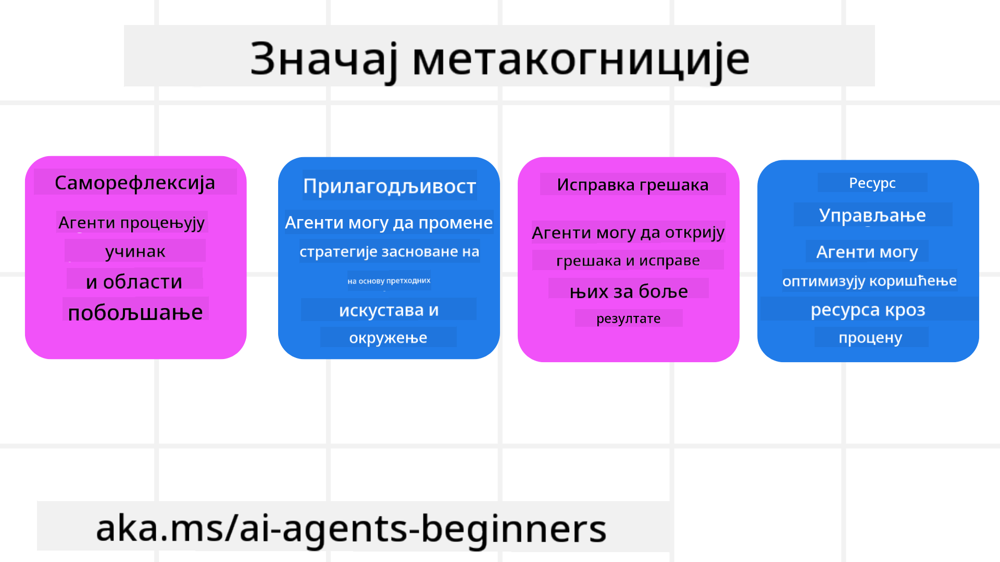
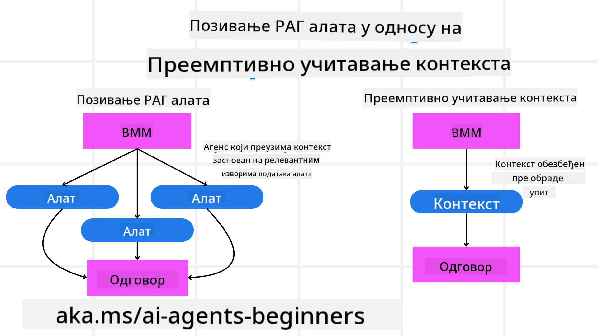

<!--
CO_OP_TRANSLATOR_METADATA:
{
  "original_hash": "5f0deef171fc3a68d5d3d770a8bfb03d",
  "translation_date": "2025-08-30T08:49:36+00:00",
  "source_file": "09-metacognition/README.md",
  "language_code": "sr"
}
-->
[](https://youtu.be/His9R6gw6Ec?si=3_RMb8VprNvdLRhX)

> _(Кликните на слику изнад да бисте погледали видео овог часа)_
# Метакогниција код AI агената

## Увод

Добродошли на лекцију о метакогницији код AI агената! Ово поглавље је намењено почетницима који су радознали како AI агенти могу да размишљају о сопственим процесима размишљања. На крају ове лекције, разумећете кључне концепте и бити опремљени практичним примерима за примену метакогниције у дизајну AI агената.

## Циљеви учења

Након завршетка ове лекције, моћи ћете да:

1. Разумете импликације петљи резоновања у дефиницијама агената.
2. Користите технике планирања и евалуације за помоћ агенатима који се самокоригују.
3. Креирате сопствене агенте способне за манипулацију кодом ради постизања задатака.

## Увод у метакогницију

Метакогниција се односи на когнитивне процесе вишег реда који укључују размишљање о сопственом размишљању. За AI агенте, то значи да могу да процењују и прилагођавају своје акције на основу самосвести и претходних искустава. Метакогниција, или "размишљање о размишљању," је важан концепт у развоју агентских AI система. Она подразумева да AI системи буду свесни сопствених унутрашњих процеса и да могу да прате, регулишу и прилагођавају своје понашање у складу с тим. Слично као што ми радимо када процењујемо ситуацију или приступамо проблему. Ова самосвест може помоћи AI системима да доносе боље одлуке, идентификују грешке и побољшају своје перформансе током времена – поново се враћајући на Тјурингов тест и дебату о томе да ли ће AI преузети контролу.

У контексту агентских AI система, метакогниција може помоћи у решавању неколико изазова, као што су:
- Транспарентност: Осигуравање да AI системи могу објаснити своје резоновање и одлуке.
- Резоновање: Побољшање способности AI система да синтетишу информације и доносе исправне одлуке.
- Адаптација: Омогућавање AI системима да се прилагоде новим окружењима и променљивим условима.
- Перцепција: Побољшање тачности AI система у препознавању и интерпретацији података из окружења.

### Шта је метакогниција?

Метакогниција, или "размишљање о размишљању," је когнитивни процес вишег реда који укључује самосвест и саморегулацију сопствених когнитивних процеса. У домену AI, метакогниција омогућава агентима да процењују и прилагођавају своје стратегије и акције, што доводи до побољшаних способности решавања проблема и доношења одлука. Разумевањем метакогниције, можете дизајнирати AI агенте који су не само интелигентнији, већ и прилагодљивији и ефикаснији. У истинској метакогницији, видели бисте AI који експлицитно резонује о сопственом резоновању.

Пример: „Приоритет сам дао јефтинијим летовима јер... можда пропуштам директне летове, па ћу поново проверити.“
Праћење како или зашто је изабрао одређену руту.
- Бележење да је направио грешке јер се превише ослањао на корисничке преференције из прошлог пута, па модификује своју стратегију доношења одлука, а не само коначну препоруку.
- Дијагностиковање образаца као што је: „Кад год видим да корисник помиње 'превише гужве,' не треба само да уклоним одређене атракције, већ и да схватим да је мој метод избора 'најбољих атракција' погрешан ако увек рангирам по популарности.“

### Значај метакогниције код AI агената

Метакогниција игра кључну улогу у дизајну AI агената из неколико разлога:



- Саморефлексија: Агенти могу проценити сопствене перформансе и идентификовати области за побољшање.
- Прилагодљивост: Агенти могу модификовати своје стратегије на основу претходних искустава и променљивих окружења.
- Корекција грешака: Агенти могу самостално открити и исправити грешке, што доводи до тачнијих резултата.
- Управљање ресурсима: Агенти могу оптимизовати употребу ресурса, као што су време и рачунарска снага, планирањем и евалуацијом својих акција.

## Компоненте AI агента

Пре него што се упустимо у метакогнитивне процесе, важно је разумети основне компоненте AI агента. AI агент обично се састоји од:

- Личност: Личност и карактеристике агента, које дефинишу како он комуницира са корисницима.
- Алатке: Способности и функције које агент може да обавља.
- Вештине: Знање и експертиза које агент поседује.

Ове компоненте раде заједно како би створиле "јединицу експертизе" која може обављати одређене задатке.

**Пример**:
Замислите агента за путовања, услуге агента који не само да планира ваш одмор, већ и прилагођава свој пут на основу података у реалном времену и претходних искустава корисничког путовања.

### Пример: Метакогниција у услузи агента за путовања

Замислите да дизајнирате услугу агента за путовања коју покреће AI. Овај агент, "Агент за путовања," помаже корисницима у планирању њихових одмора. Да бисте укључили метакогницију, Агент за путовања мора да процењује и прилагођава своје акције на основу самосвести и претходних искустава. Ево како метакогниција може играти улогу:

#### Тренутни задатак

Тренутни задатак је помоћи кориснику да испланира путовање у Париз.

#### Кораци за завршетак задатка

1. **Прикупљање корисничких преференција**: Питајте корисника о датумима путовања, буџету, интересовањима (нпр. музеји, кухиња, куповина) и било којим специфичним захтевима.
2. **Проналажење информација**: Претражите опције летова, смештаја, атракција и ресторана који одговарају корисничким преференцијама.
3. **Генерисање препорука**: Пружите персонализовани итинерар са детаљима о летовима, резервацијама хотела и предложеним активностима.
4. **Прилагођавање на основу повратних информација**: Питајте корисника за повратне информације о препорукама и направите потребне измене.

#### Потребни ресурси

- Приступ базама података за резервацију летова и хотела.
- Информације о атракцијама и ресторанима у Паризу.
- Подаци о повратним информацијама корисника из претходних интеракција.

#### Искуство и саморефлексија

Агент за путовања користи метакогницију за процену својих перформанси и учење из претходних искустава. На пример:

1. **Анализа повратних информација корисника**: Агент за путовања прегледа повратне информације корисника како би утврдио које препоруке су добро прихваћене, а које нису. Он прилагођава своје будуће предлоге у складу с тим.
2. **Прилагодљивост**: Ако је корисник раније поменуо да не воли гужве, Агент за путовања ће убудуће избегавати препоруке за популарна туристичка места током вршних сати.
3. **Корекција грешака**: Ако је Агент за путовања направио грешку у претходној резервацији, као што је препоручивање хотела који је био потпуно резервисан, он учи да ригорозније проверава доступност пре него што да препоруке.

#### Практичан пример за програмере

Ево поједностављеног примера како би код Агента за путовања могао изгледати када укључује метакогницију:

```python
class Travel_Agent:
    def __init__(self):
        self.user_preferences = {}
        self.experience_data = []

    def gather_preferences(self, preferences):
        self.user_preferences = preferences

    def retrieve_information(self):
        # Search for flights, hotels, and attractions based on preferences
        flights = search_flights(self.user_preferences)
        hotels = search_hotels(self.user_preferences)
        attractions = search_attractions(self.user_preferences)
        return flights, hotels, attractions

    def generate_recommendations(self):
        flights, hotels, attractions = self.retrieve_information()
        itinerary = create_itinerary(flights, hotels, attractions)
        return itinerary

    def adjust_based_on_feedback(self, feedback):
        self.experience_data.append(feedback)
        # Analyze feedback and adjust future recommendations
        self.user_preferences = adjust_preferences(self.user_preferences, feedback)

# Example usage
travel_agent = Travel_Agent()
preferences = {
    "destination": "Paris",
    "dates": "2025-04-01 to 2025-04-10",
    "budget": "moderate",
    "interests": ["museums", "cuisine"]
}
travel_agent.gather_preferences(preferences)
itinerary = travel_agent.generate_recommendations()
print("Suggested Itinerary:", itinerary)
feedback = {"liked": ["Louvre Museum"], "disliked": ["Eiffel Tower (too crowded)"]}
travel_agent.adjust_based_on_feedback(feedback)
```

#### Зашто је метакогниција важна

- **Саморефлексија**: Агенти могу анализирати своје перформансе и идентификовати области за побољшање.
- **Прилагодљивост**: Агенти могу модификовати стратегије на основу повратних информација и променљивих услова.
- **Корекција грешака**: Агенти могу самостално открити и исправити грешке.
- **Управљање ресурсима**: Агенти могу оптимизовати употребу ресурса, као што су време и рачунарска снага.

Укључивањем метакогниције, Агент за путовања може пружити персонализованије и тачније препоруке за путовања, побољшавајући укупно корисничко искуство.

---

## 2. Планирање код агената

Планирање је критична компонента понашања AI агента. Оно укључује дефинисање корака потребних за постизање циља, узимајући у обзир тренутно стање, ресурсе и могуће препреке.

### Елементи планирања

- **Тренутни задатак**: Јасно дефинисати задатак.
- **Кораци за завршетак задатка**: Разбити задатак на управљиве кораке.
- **Потребни ресурси**: Идентификовати неопходне ресурсе.
- **Искуство**: Користити претходна искуства за информисање планирања.

**Пример**:
Ево корака које Агент за путовања треба да предузме да би ефикасно помогао кориснику у планирању његовог путовања:

### Кораци за Агента за путовања

1. **Прикупљање корисничких преференција**
   - Питајте корисника за детаље о датумима путовања, буџету, интересовањима и било којим специфичним захтевима.
   - Примери: „Када планирате да путујете?“ „Који је ваш распон буџета?“ „Које активности волите на одмору?“

2. **Проналажење информација**
   - Претражите релевантне опције путовања на основу корисничких преференција.
   - **Летови**: Потражите доступне летове у оквиру корисничког буџета и жељених датума путовања.
   - **Смештај**: Пронађите хотеле или изнајмљивање који одговарају корисничким преференцијама за локацију, цену и погодности.
   - **Атракције и ресторани**: Идентификујте популарне атракције, активности и опције за ручавање које се уклапају у корисничка интересовања.

3. **Генерисање препорука**
   - Саставите прикупљене информације у персонализовани итинерар.
   - Пружите детаље као што су опције летова, резервације хотела и предложене активности, водећи рачуна да препоруке буду прилагођене корисничким преференцијама.

4. **Презентација итинерара кориснику**
   - Поделите предложени итинерар са корисником ради прегледа.
   - Пример: „Ево предложеног итинерара за ваше путовање у Париз. Укључује детаље о летовима, резервацијама хотела и листу препоручених активности и ресторана. Реците ми ваше мишљење!“

5. **Прикупљање повратних информација**
   - Питајте корисника за повратне информације о предложеном итинерару.
   - Примери: „Да ли вам се свиђају опције летова?“ „Да ли је хотел погодан за ваше потребе?“ „Да ли постоје активности које бисте желели да додате или уклоните?“

6. **Прилагођавање на основу повратних информација**
   - Измените итинерар на основу корисничких повратних информација.
   - Направите неопходне измене у препорукама за летове, смештај и активности како би боље одговарале корисничким преференцијама.

7. **Коначна потврда**
   - Представите ажурирани итинерар кориснику ради коначне потврде.
   - Пример: „Направио сам измене на основу ваших повратних информација. Ево ажурираног итинерара. Да ли вам све изгледа добро?“

8. **Резервација и потврда**
   - Када корисник одобри итинерар, наставите са резервацијом летова, смештаја и било којих унапред планираних активности.
   - Пошаљите детаље о потврди кориснику.

9. **Пружање континуиране подршке**
   - Будите доступни за помоћ кориснику са било каквим изменама или додатним захтевима пре и током његовог путовања.
   - Пример: „Ако вам је потребна додатна помоћ током путовања, слободно ми се обратите у било ком тренутку!“

### Пример интеракције

```python
class Travel_Agent:
    def __init__(self):
        self.user_preferences = {}
        self.experience_data = []

    def gather_preferences(self, preferences):
        self.user_preferences = preferences

    def retrieve_information(self):
        flights = search_flights(self.user_preferences)
        hotels = search_hotels(self.user_preferences)
        attractions = search_attractions(self.user_preferences)
        return flights, hotels, attractions

    def generate_recommendations(self):
        flights, hotels, attractions = self.retrieve_information()
        itinerary = create_itinerary(flights, hotels, attractions)
        return itinerary

    def adjust_based_on_feedback(self, feedback):
        self.experience_data.append(feedback)
        self.user_preferences = adjust_preferences(self.user_preferences, feedback)

# Example usage within a booing request
travel_agent = Travel_Agent()
preferences = {
    "destination": "Paris",
    "dates": "2025-04-01 to 2025-04-10",
    "budget": "moderate",
    "interests": ["museums", "cuisine"]
}
travel_agent.gather_preferences(preferences)
itinerary = travel_agent.generate_recommendations()
print("Suggested Itinerary:", itinerary)
feedback = {"liked": ["Louvre Museum"], "disliked": ["Eiffel Tower (too crowded)"]}
travel_agent.adjust_based_on_feedback(feedback)
```

## 3. Корективни RAG систем

Прво, хајде да разумемо разлику између RAG алатке и превентивног учитавања контекста.



### Генерација уз помоћ претраживања (RAG)

RAG комбинује систем претраживања са генеративним моделом. Када се постави упит, систем претраживања извлачи релевантне документе или податке из спољашњег извора, а ове извучене информације се користе за допуну уноса генеративном моделу. Ово помаже моделу да генерише тачније и контекстуално релевантне одговоре.

У RAG систему, агент извлачи релевантне информације из базе знања и користи их за генерисање одговарајућих одговора или акција.

### Корективни RAG приступ

Корективни RAG приступ се фокусира на коришћење RAG техника за исправљање грешака и побољшање тачности AI агената. Ово укључује:

1. **Техника упита**: Коришћење специфичних упита за вођење агента у извлачењу релевантних информација.
2. **Алатка**: Имплементацију алгоритама и механизама који омогућавају агенту да процени релевантност извучених информација и генерише тачне одговоре.
3. **Евалуација**: Континуирано процењивање перформанси агента и прављење прилагођавања ради побољшања њег
```python
class Travel_Agent:
    def __init__(self):
        self.user_preferences = {}
        self.experience_data = []

    def gather_preferences(self, preferences):
        self.user_preferences = preferences

    def retrieve_information(self):
        flights = search_flights(self.user_preferences)
        hotels = search_hotels(self.user_preferences)
        attractions = search_attractions(self.user_preferences)
        return flights, hotels, attractions

    def generate_recommendations(self):
        flights, hotels, attractions = self.retrieve_information()
        itinerary = create_itinerary(flights, hotels, attractions)
        return itinerary

    def adjust_based_on_feedback(self, feedback):
        self.experience_data.append(feedback)
        self.user_preferences = adjust_preferences(self.user_preferences, feedback)
        new_itinerary = self.generate_recommendations()
        return new_itinerary

# Example usage
travel_agent = Travel_Agent()
preferences = {
    "destination": "Paris",
    "dates": "2025-04-01 to 2025-04-10",
    "budget": "moderate",
    "interests": ["museums", "cuisine"]
}
travel_agent.gather_preferences(preferences)
itinerary = travel_agent.generate_recommendations()
print("Suggested Itinerary:", itinerary)
feedback = {"liked": ["Louvre Museum"], "disliked": ["Eiffel Tower (too crowded)"]}
new_itinerary = travel_agent.adjust_based_on_feedback(feedback)
print("Updated Itinerary:", new_itinerary)
```

### Превентивно учитавање контекста

Превентивно учитавање контекста подразумева унапред учитавање релевантних информација или позадинских података у модел пре обраде упита. То значи да модел од самог почетка има приступ овим информацијама, што му омогућава да генерише информисаније одговоре без потребе за додатним преузимањем података током процеса.

Ево једноставног примера како би превентивно учитавање контекста могло изгледати за апликацију туристичког агента у Python-у:

```python
class TravelAgent:
    def __init__(self):
        # Pre-load popular destinations and their information
        self.context = {
            "Paris": {"country": "France", "currency": "Euro", "language": "French", "attractions": ["Eiffel Tower", "Louvre Museum"]},
            "Tokyo": {"country": "Japan", "currency": "Yen", "language": "Japanese", "attractions": ["Tokyo Tower", "Shibuya Crossing"]},
            "New York": {"country": "USA", "currency": "Dollar", "language": "English", "attractions": ["Statue of Liberty", "Times Square"]},
            "Sydney": {"country": "Australia", "currency": "Dollar", "language": "English", "attractions": ["Sydney Opera House", "Bondi Beach"]}
        }

    def get_destination_info(self, destination):
        # Fetch destination information from pre-loaded context
        info = self.context.get(destination)
        if info:
            return f"{destination}:\nCountry: {info['country']}\nCurrency: {info['currency']}\nLanguage: {info['language']}\nAttractions: {', '.join(info['attractions'])}"
        else:
            return f"Sorry, we don't have information on {destination}."

# Example usage
travel_agent = TravelAgent()
print(travel_agent.get_destination_info("Paris"))
print(travel_agent.get_destination_info("Tokyo"))
```

#### Објашњење

1. **Иницијализација (`__init__` метод)**: Класа `TravelAgent` унапред учитава речник који садржи информације о популарним дестинацијама као што су Париз, Токио, Њујорк и Сиднеј. Овај речник укључује детаље као што су држава, валута, језик и главне атракције за сваку дестинацију.

2. **Проналажење информација (`get_destination_info` метод)**: Када корисник постави упит о одређеној дестинацији, метод `get_destination_info` преузима релевантне информације из унапред учитаног речника контекста.

Учитавањем контекста унапред, апликација туристичког агента може брзо одговарати на упите корисника без потребе за преузимањем ових информација из спољашњих извора у реалном времену. Ово чини апликацију ефикаснијом и бржом.

### Покретање плана са циљем пре итерације

Покретање плана са циљем подразумева започињање са јасно дефинисаним циљем или жељеним исходом. Дефинисањем овог циља унапред, модел га може користити као водиљу током итеративног процеса. Ово помаже да свака итерација буде усмерена ка постизању жељеног исхода, чинећи процес ефикаснијим и фокусиранијим.

Ево примера како би туристички агент могао покренути план путовања са циљем пре итерације у Python-у:

### Сценарио

Туристички агент жели да планира прилагођени одмор за клијента. Циљ је креирати план путовања који максимално задовољава клијента на основу његових преференција и буџета.

### Кораци

1. Дефинисати преференције и буџет клијента.
2. Покренути иницијални план на основу ових преференција.
3. Итеративно усавршавати план, оптимизујући га за задовољство клијента.

#### Python код

```python
class TravelAgent:
    def __init__(self, destinations):
        self.destinations = destinations

    def bootstrap_plan(self, preferences, budget):
        plan = []
        total_cost = 0

        for destination in self.destinations:
            if total_cost + destination['cost'] <= budget and self.match_preferences(destination, preferences):
                plan.append(destination)
                total_cost += destination['cost']

        return plan

    def match_preferences(self, destination, preferences):
        for key, value in preferences.items():
            if destination.get(key) != value:
                return False
        return True

    def iterate_plan(self, plan, preferences, budget):
        for i in range(len(plan)):
            for destination in self.destinations:
                if destination not in plan and self.match_preferences(destination, preferences) and self.calculate_cost(plan, destination) <= budget:
                    plan[i] = destination
                    break
        return plan

    def calculate_cost(self, plan, new_destination):
        return sum(destination['cost'] for destination in plan) + new_destination['cost']

# Example usage
destinations = [
    {"name": "Paris", "cost": 1000, "activity": "sightseeing"},
    {"name": "Tokyo", "cost": 1200, "activity": "shopping"},
    {"name": "New York", "cost": 900, "activity": "sightseeing"},
    {"name": "Sydney", "cost": 1100, "activity": "beach"},
]

preferences = {"activity": "sightseeing"}
budget = 2000

travel_agent = TravelAgent(destinations)
initial_plan = travel_agent.bootstrap_plan(preferences, budget)
print("Initial Plan:", initial_plan)

refined_plan = travel_agent.iterate_plan(initial_plan, preferences, budget)
print("Refined Plan:", refined_plan)
```

#### Објашњење кода

1. **Иницијализација (`__init__` метод)**: Класа `TravelAgent` се иницијализује са листом потенцијалних дестинација, од којих свака има атрибуте као што су име, цена и тип активности.

2. **Покретање плана (`bootstrap_plan` метод)**: Овај метод креира иницијални план путовања на основу преференција и буџета клијента. Он пролази кроз листу дестинација и додаје их у план ако одговарају преференцијама клијента и уклапају се у буџет.

3. **Усклађивање преференција (`match_preferences` метод)**: Овај метод проверава да ли дестинација одговара преференцијама клијента.

4. **Итерација плана (`iterate_plan` метод)**: Овај метод усавршава иницијални план тако што покушава да замени сваку дестинацију у плану бољом опцијом, узимајући у обзир преференције и буџет клијента.

5. **Израчунавање трошкова (`calculate_cost` метод)**: Овај метод израчунава укупне трошкове тренутног плана, укључујући потенцијалну нову дестинацију.

#### Пример употребе

- **Иницијални план**: Туристички агент креира иницијални план на основу преференција клијента за разгледање и буџета од $2000.
- **Усавршени план**: Туристички агент итеративно усавршава план, оптимизујући га за преференције и буџет клијента.

Покретањем плана са јасним циљем (нпр. максимално задовољство клијента) и итеративним усавршавањем плана, туристички агент може креирати прилагођен и оптимизован план путовања за клијента. Овај приступ осигурава да план путовања од почетка одговара преференцијама и буџету клијента и побољшава се са сваком итерацијом.

### Искоришћавање LLM за ре-рангирање и оцењивање

Модели великог језичког обима (LLM) могу се користити за ре-рангирање и оцењивање кроз процену релевантности и квалитета преузетих докумената или генерисаних одговора. Ево како то функционише:

**Претраживање:** Почетни корак претраживања преузима сет кандидата докумената или одговора на основу упита.

**Ре-рангирање:** LLM процењује ове кандидате и ре-рангира их на основу њихове релевантности и квалитета. Овај корак осигурава да најрелевантније и најквалитетније информације буду представљене прво.

**Оцењивање:** LLM додељује оцене сваком кандидату, одражавајући њихову релевантност и квалитет. Ово помаже у избору најбољег одговора или документа за корисника.

Искоришћавањем LLM-а за ре-рангирање и оцењивање, систем може пружити тачније и контекстуално релевантне информације, побољшавајући укупно корисничко искуство.

Ево примера како туристички агент може користити модел великог језичког обима (LLM) за ре-рангирање и оцењивање туристичких дестинација на основу преференција корисника у Python-у:

#### Сценарио - Путовање на основу преференција

Туристички агент жели да препоручи најбоље туристичке дестинације клијенту на основу његових преференција. LLM ће помоћи у ре-рангирању и оцењивању дестинација како би се осигурало да су најрелевантније опције представљене.

#### Кораци:

1. Прикупити преференције корисника.
2. Преузети листу потенцијалних туристичких дестинација.
3. Користити LLM за ре-рангирање и оцењивање дестинација на основу преференција корисника.

Ево како можете ажурирати претходни пример да користите Azure OpenAI Services:

#### Захтеви

1. Потребно је да имате Azure претплату.
2. Креирајте Azure OpenAI ресурс и добијте свој API кључ.

#### Пример Python кода

```python
import requests
import json

class TravelAgent:
    def __init__(self, destinations):
        self.destinations = destinations

    def get_recommendations(self, preferences, api_key, endpoint):
        # Generate a prompt for the Azure OpenAI
        prompt = self.generate_prompt(preferences)
        
        # Define headers and payload for the request
        headers = {
            'Content-Type': 'application/json',
            'Authorization': f'Bearer {api_key}'
        }
        payload = {
            "prompt": prompt,
            "max_tokens": 150,
            "temperature": 0.7
        }
        
        # Call the Azure OpenAI API to get the re-ranked and scored destinations
        response = requests.post(endpoint, headers=headers, json=payload)
        response_data = response.json()
        
        # Extract and return the recommendations
        recommendations = response_data['choices'][0]['text'].strip().split('\n')
        return recommendations

    def generate_prompt(self, preferences):
        prompt = "Here are the travel destinations ranked and scored based on the following user preferences:\n"
        for key, value in preferences.items():
            prompt += f"{key}: {value}\n"
        prompt += "\nDestinations:\n"
        for destination in self.destinations:
            prompt += f"- {destination['name']}: {destination['description']}\n"
        return prompt

# Example usage
destinations = [
    {"name": "Paris", "description": "City of lights, known for its art, fashion, and culture."},
    {"name": "Tokyo", "description": "Vibrant city, famous for its modernity and traditional temples."},
    {"name": "New York", "description": "The city that never sleeps, with iconic landmarks and diverse culture."},
    {"name": "Sydney", "description": "Beautiful harbour city, known for its opera house and stunning beaches."},
]

preferences = {"activity": "sightseeing", "culture": "diverse"}
api_key = 'your_azure_openai_api_key'
endpoint = 'https://your-endpoint.com/openai/deployments/your-deployment-name/completions?api-version=2022-12-01'

travel_agent = TravelAgent(destinations)
recommendations = travel_agent.get_recommendations(preferences, api_key, endpoint)
print("Recommended Destinations:")
for rec in recommendations:
    print(rec)
```

#### Објашњење кода - Препоруке на основу преференција

1. **Иницијализација**: Класа `TravelAgent` се иницијализује са листом потенцијалних туристичких дестинација, од којих свака има атрибуте као што су име и опис.

2. **Добијање препорука (`get_recommendations` метод)**: Овај метод генерише упит за Azure OpenAI сервис на основу преференција корисника и шаље HTTP POST захтев Azure OpenAI API-ју како би добио ре-рангиране и оцењене дестинације.

3. **Генерисање упита (`generate_prompt` метод)**: Овај метод конструише упит за Azure OpenAI, укључујући преференције корисника и листу дестинација. Упит води модел да ре-рангира и оцени дестинације на основу датих преференција.

4. **API позив**: Библиотека `requests` се користи за слање HTTP POST захтева Azure OpenAI API-ју. Одговор садржи ре-рангиране и оцењене дестинације.

5. **Пример употребе**: Туристички агент прикупља преференције корисника (нпр. интересовање за разгледање и разнолику културу) и користи Azure OpenAI сервис за добијање ре-рангираних и оцењених препорука за туристичке дестинације.

Обавезно замените `your_azure_openai_api_key` својим стварним Azure OpenAI API кључем и `https://your-endpoint.com/...` стварним URL-ом вашег Azure OpenAI ресурса.

Искоришћавањем LLM-а за ре-рангирање и оцењивање, туристички агент може пружити персонализованије и релевантније препоруке за путовања клијентима, побољшавајући њихово укупно искуство.
#### Практични пример: Претрага са намером у туристичкој агенцији

Узмимо туристичку агенцију као пример да видимо како се претрага са намером може имплементирати.

1. **Прикупљање корисничких преференција**

   ```python
   class Travel_Agent:
       def __init__(self):
           self.user_preferences = {}

       def gather_preferences(self, preferences):
           self.user_preferences = preferences
   ```

2. **Разумевање корисничке намере**

   ```python
   def identify_intent(query):
       if "book" in query or "purchase" in query:
           return "transactional"
       elif "website" in query or "official" in query:
           return "navigational"
       else:
           return "informational"
   ```

3. **Свесност контекста**

   ```python
   def analyze_context(query, user_history):
       # Combine current query with user history to understand context
       context = {
           "current_query": query,
           "user_history": user_history
       }
       return context
   ```

4. **Претрага и персонализација резултата**

   ```python
   def search_with_intent(query, preferences, user_history):
       intent = identify_intent(query)
       context = analyze_context(query, user_history)
       if intent == "informational":
           search_results = search_information(query, preferences)
       elif intent == "navigational":
           search_results = search_navigation(query)
       elif intent == "transactional":
           search_results = search_transaction(query, preferences)
       personalized_results = personalize_results(search_results, user_history)
       return personalized_results

   def search_information(query, preferences):
       # Example search logic for informational intent
       results = search_web(f"best {preferences['interests']} in {preferences['destination']}")
       return results

   def search_navigation(query):
       # Example search logic for navigational intent
       results = search_web(query)
       return results

   def search_transaction(query, preferences):
       # Example search logic for transactional intent
       results = search_web(f"book {query} to {preferences['destination']}")
       return results

   def personalize_results(results, user_history):
       # Example personalization logic
       personalized = [result for result in results if result not in user_history]
       return personalized[:10]  # Return top 10 personalized results
   ```

5. **Пример употребе**

   ```python
   travel_agent = Travel_Agent()
   preferences = {
       "destination": "Paris",
       "interests": ["museums", "cuisine"]
   }
   travel_agent.gather_preferences(preferences)
   user_history = ["Louvre Museum website", "Book flight to Paris"]
   query = "best museums in Paris"
   results = search_with_intent(query, preferences, user_history)
   print("Search Results:", results)
   ```

---

## 4. Генерисање кода као алат

Агенти за генерисање кода користе AI моделе за писање и извршавање кода, решавање сложених проблема и аутоматизацију задатака.

### Агенти за генерисање кода

Агенти за генерисање кода користе генеративне AI моделе за писање и извршавање кода. Ови агенти могу решавати сложене проблеме, аутоматизовати задатке и пружати вредне увиде генерисањем и извршавањем кода на различитим програмским језицима.

#### Практичне примене

1. **Аутоматско генерисање кода**: Генерисање делова кода за специфичне задатке, као што су анализа података, веб скрепинг или машинско учење.
2. **SQL као RAG**: Коришћење SQL упита за преузимање и манипулацију подацима из база података.
3. **Решавање проблема**: Креирање и извршавање кода за решавање специфичних проблема, као што су оптимизација алгоритама или анализа података.

#### Пример: Агент за генерисање кода за анализу података

Замислите да дизајнирате агента за генерисање кода. Ево како би то могло изгледати:

1. **Задатак**: Анализирати скуп података како би се идентификовали трендови и обрасци.
2. **Кораци**:
   - Учитавање скупа података у алат за анализу података.
   - Генерисање SQL упита за филтрирање и агрегирање података.
   - Извршавање упита и преузимање резултата.
   - Коришћење резултата за генерисање визуализација и увида.
3. **Потребни ресурси**: Приступ скупу података, алати за анализу података и SQL могућности.
4. **Искуство**: Коришћење претходних резултата анализе за побољшање тачности и релевантности будућих анализа.

### Пример: Агент за генерисање кода за туристичку агенцију

У овом примеру, дизајнираћемо агента за генерисање кода, туристичку агенцију, који помаже корисницима у планирању путовања генерисањем и извршавањем кода. Овај агент може обављати задатке као што су проналажење опција за путовање, филтрирање резултата и састављање итинерера користећи генеративни AI.

#### Преглед агента за генерисање кода

1. **Прикупљање корисничких преференција**: Прикупља уносе корисника као што су дестинација, датуми путовања, буџет и интересовања.
2. **Генерисање кода за преузимање података**: Генерише делове кода за преузимање података о летовима, хотелима и атракцијама.
3. **Извршавање генерисаног кода**: Извршава генерисани код за преузимање информација у реалном времену.
4. **Генерисање итинерера**: Саставља прикупљене податке у персонализовани план путовања.
5. **Прилагођавање на основу повратних информација**: Прима повратне информације од корисника и поново генерише код ако је потребно за прецизније резултате.

#### Корак-по-корак имплементација

1. **Прикупљање корисничких преференција**

   ```python
   class Travel_Agent:
       def __init__(self):
           self.user_preferences = {}

       def gather_preferences(self, preferences):
           self.user_preferences = preferences
   ```

2. **Генерисање кода за преузимање података**

   ```python
   def generate_code_to_fetch_data(preferences):
       # Example: Generate code to search for flights based on user preferences
       code = f"""
       def search_flights():
           import requests
           response = requests.get('https://api.example.com/flights', params={preferences})
           return response.json()
       """
       return code

   def generate_code_to_fetch_hotels(preferences):
       # Example: Generate code to search for hotels
       code = f"""
       def search_hotels():
           import requests
           response = requests.get('https://api.example.com/hotels', params={preferences})
           return response.json()
       """
       return code
   ```

3. **Извршавање генерисаног кода**

   ```python
   def execute_code(code):
       # Execute the generated code using exec
       exec(code)
       result = locals()
       return result

   travel_agent = Travel_Agent()
   preferences = {
       "destination": "Paris",
       "dates": "2025-04-01 to 2025-04-10",
       "budget": "moderate",
       "interests": ["museums", "cuisine"]
   }
   travel_agent.gather_preferences(preferences)
   
   flight_code = generate_code_to_fetch_data(preferences)
   hotel_code = generate_code_to_fetch_hotels(preferences)
   
   flights = execute_code(flight_code)
   hotels = execute_code(hotel_code)

   print("Flight Options:", flights)
   print("Hotel Options:", hotels)
   ```

4. **Генерисање итинерера**

   ```python
   def generate_itinerary(flights, hotels, attractions):
       itinerary = {
           "flights": flights,
           "hotels": hotels,
           "attractions": attractions
       }
       return itinerary

   attractions = search_attractions(preferences)
   itinerary = generate_itinerary(flights, hotels, attractions)
   print("Suggested Itinerary:", itinerary)
   ```

5. **Прилагођавање на основу повратних информација**

   ```python
   def adjust_based_on_feedback(feedback, preferences):
       # Adjust preferences based on user feedback
       if "liked" in feedback:
           preferences["favorites"] = feedback["liked"]
       if "disliked" in feedback:
           preferences["avoid"] = feedback["disliked"]
       return preferences

   feedback = {"liked": ["Louvre Museum"], "disliked": ["Eiffel Tower (too crowded)"]}
   updated_preferences = adjust_based_on_feedback(feedback, preferences)
   
   # Regenerate and execute code with updated preferences
   updated_flight_code = generate_code_to_fetch_data(updated_preferences)
   updated_hotel_code = generate_code_to_fetch_hotels(updated_preferences)
   
   updated_flights = execute_code(updated_flight_code)
   updated_hotels = execute_code(updated_hotel_code)
   
   updated_itinerary = generate_itinerary(updated_flights, updated_hotels, attractions)
   print("Updated Itinerary:", updated_itinerary)
   ```

### Коришћење свесности о окружењу и резоновања

На основу шеме табеле, могуће је побољшати процес генерисања упита коришћењем свесности о окружењу и резоновања.

Ево примера како се то може урадити:

1. **Разумевање шеме**: Систем ће разумети шему табеле и користити те информације за генерисање упита.
2. **Прилагођавање на основу повратних информација**: Систем ће прилагођавати корисничке преференције на основу повратних информација и резоновати о томе која поља у шеми треба ажурирати.
3. **Генерисање и извршавање упита**: Систем ће генерисати и извршавати упите за преузимање ажурираних података о летовима и хотелима на основу нових преференција.

Ево ажурираног примера Python кода који укључује ове концепте:

```python
def adjust_based_on_feedback(feedback, preferences, schema):
    # Adjust preferences based on user feedback
    if "liked" in feedback:
        preferences["favorites"] = feedback["liked"]
    if "disliked" in feedback:
        preferences["avoid"] = feedback["disliked"]
    # Reasoning based on schema to adjust other related preferences
    for field in schema:
        if field in preferences:
            preferences[field] = adjust_based_on_environment(feedback, field, schema)
    return preferences

def adjust_based_on_environment(feedback, field, schema):
    # Custom logic to adjust preferences based on schema and feedback
    if field in feedback["liked"]:
        return schema[field]["positive_adjustment"]
    elif field in feedback["disliked"]:
        return schema[field]["negative_adjustment"]
    return schema[field]["default"]

def generate_code_to_fetch_data(preferences):
    # Generate code to fetch flight data based on updated preferences
    return f"fetch_flights(preferences={preferences})"

def generate_code_to_fetch_hotels(preferences):
    # Generate code to fetch hotel data based on updated preferences
    return f"fetch_hotels(preferences={preferences})"

def execute_code(code):
    # Simulate execution of code and return mock data
    return {"data": f"Executed: {code}"}

def generate_itinerary(flights, hotels, attractions):
    # Generate itinerary based on flights, hotels, and attractions
    return {"flights": flights, "hotels": hotels, "attractions": attractions}

# Example schema
schema = {
    "favorites": {"positive_adjustment": "increase", "negative_adjustment": "decrease", "default": "neutral"},
    "avoid": {"positive_adjustment": "decrease", "negative_adjustment": "increase", "default": "neutral"}
}

# Example usage
preferences = {"favorites": "sightseeing", "avoid": "crowded places"}
feedback = {"liked": ["Louvre Museum"], "disliked": ["Eiffel Tower (too crowded)"]}
updated_preferences = adjust_based_on_feedback(feedback, preferences, schema)

# Regenerate and execute code with updated preferences
updated_flight_code = generate_code_to_fetch_data(updated_preferences)
updated_hotel_code = generate_code_to_fetch_hotels(updated_preferences)

updated_flights = execute_code(updated_flight_code)
updated_hotels = execute_code(updated_hotel_code)

updated_itinerary = generate_itinerary(updated_flights, updated_hotels, feedback["liked"])
print("Updated Itinerary:", updated_itinerary)
```

#### Објашњење - Резервација на основу повратних информација

1. **Свесност о шеми**: Речник `schema` дефинише како треба прилагодити преференције на основу повратних информација. Укључује поља као што су `favorites` и `avoid`, са одговарајућим прилагођавањима.
2. **Прилагођавање преференција (`adjust_based_on_feedback` метод)**: Овај метод прилагођава преференције на основу повратних информација корисника и шеме.
3. **Прилагођавања на основу окружења (`adjust_based_on_environment` метод)**: Овај метод прилагођава преференције на основу шеме и повратних информација.
4. **Генерисање и извршавање упита**: Систем генерише код за преузимање ажурираних података о летовима и хотелима на основу прилагођених преференција и симулира извршавање тих упита.
5. **Генерисање итинерера**: Систем креира ажурирани итинерер на основу нових података о летовима, хотелима и атракцијама.

Коришћењем свесности о окружењу и резоновања на основу шеме, систем може генерисати прецизније и релевантније упите, што доводи до бољих препорука за путовања и персонализованијег корисничког искуства.

### Коришћење SQL-а као Retrieval-Augmented Generation (RAG) технике

SQL (Structured Query Language) је моћан алат за рад са базама података. Када се користи као део Retrieval-Augmented Generation (RAG) приступа, SQL може преузимати релевантне податке из база података како би информисао и генерисао одговоре или акције у AI агентима. Хајде да истражимо како се SQL може користити као RAG техника у контексту туристичке агенције.

#### Кључни концепти

1. **Интеракција са базом података**:
   - SQL се користи за упите база података, преузимање релевантних информација и манипулацију подацима.
   - Пример: Преузимање детаља о летовима, информација о хотелима и атракцијама из базе података за путовања.

2. **Интеграција са RAG**:
   - SQL упити се генеришу на основу уноса и преференција корисника.
   - Преузети подаци се затим користе за генерисање персонализованих препорука или акција.

3. **Динамичко генерисање упита**:
   - AI агент генерише динамичке SQL упите на основу контекста и потреба корисника.
   - Пример: Прилагођавање SQL упита за филтрирање резултата на основу буџета, датума и интересовања.

#### Примене

- **Аутоматско генерисање кода**: Генерисање делова кода за специфичне задатке.
- **SQL као RAG**: Коришћење SQL упита за манипулацију подацима.
- **Решавање проблема**: Креирање и извршавање кода за решавање проблема.

**Пример**:
Агент за анализу података:

1. **Задатак**: Анализирати скуп података како би се пронашли трендови.
2. **Кораци**:
   - Учитавање скупа података.
   - Генерисање SQL упита за филтрирање података.
   - Извршавање упита и преузимање резултата.
   - Генерисање визуализација и увида.
3. **Ресурси**: Приступ скупу података, SQL могућности.
4. **Искуство**: Коришћење претходних резултата за побољшање будућих анализа.

#### Практични пример: Коришћење SQL-а у туристичкој агенцији

1. **Прикупљање корисничких преференција**

   ```python
   class Travel_Agent:
       def __init__(self):
           self.user_preferences = {}

       def gather_preferences(self, preferences):
           self.user_preferences = preferences
   ```

2. **Генерисање SQL упита**

   ```python
   def generate_sql_query(table, preferences):
       query = f"SELECT * FROM {table} WHERE "
       conditions = []
       for key, value in preferences.items():
           conditions.append(f"{key}='{value}'")
       query += " AND ".join(conditions)
       return query
   ```

3. **Извршавање SQL упита**

   ```python
   import sqlite3

   def execute_sql_query(query, database="travel.db"):
       connection = sqlite3.connect(database)
       cursor = connection.cursor()
       cursor.execute(query)
       results = cursor.fetchall()
       connection.close()
       return results
   ```

4. **Генерисање препорука**

   ```python
   def generate_recommendations(preferences):
       flight_query = generate_sql_query("flights", preferences)
       hotel_query = generate_sql_query("hotels", preferences)
       attraction_query = generate_sql_query("attractions", preferences)
       
       flights = execute_sql_query(flight_query)
       hotels = execute_sql_query(hotel_query)
       attractions = execute_sql_query(attraction_query)
       
       itinerary = {
           "flights": flights,
           "hotels": hotels,
           "attractions": attractions
       }
       return itinerary

   travel_agent = Travel_Agent()
   preferences = {
       "destination": "Paris",
       "dates": "2025-04-01 to 2025-04-10",
       "budget": "moderate",
       "interests": ["museums", "cuisine"]
   }
   travel_agent.gather_preferences(preferences)
   itinerary = generate_recommendations(preferences)
   print("Suggested Itinerary:", itinerary)
   ```

#### Примери SQL упита

1. **Упит за летове**

   ```sql
   SELECT * FROM flights WHERE destination='Paris' AND dates='2025-04-01 to 2025-04-10' AND budget='moderate';
   ```

2. **Упит за хотеле**

   ```sql
   SELECT * FROM hotels WHERE destination='Paris' AND budget='moderate';
   ```

3. **Упит за атракције**

   ```sql
   SELECT * FROM attractions WHERE destination='Paris' AND interests='museums, cuisine';
   ```

Коришћењем SQL-а као дела Retrieval-Augmented Generation (RAG) технике, AI агенти попут туристичке агенције могу динамички преузимати и користити релевантне податке за пружање тачних и персонализованих препорука.

### Пример метакогниције

Да бисмо демонстрирали имплементацију метакогниције, креираћемо једноставног агента који *разматра свој процес доношења одлука* док решава проблем. У овом примеру, направићемо систем где агент покушава да оптимизује избор хотела, али затим процењује своје разлоге и прилагођава своју стратегију када направи грешке или субоптималне изборе.

Симулираћемо ово помоћу основног примера где агент бира хотеле на основу комбинације цене и квалитета, али ће "разматрати" своје одлуке и прилагођавати се у складу с тим.

#### Како ово илуструје метакогницију:

1. **Почетна одлука**: Агент ће изабрати најјефтинији хотел, без разумевања утицаја квалитета.
2. **Разматрање и процена**: Након почетног избора, агент ће проверити да ли је хотел био "лош" избор користећи повратне информације корисника. Ако утврди да је квалитет хотела био пренизак, разматраће своје разлоге.
3. **Прилагођавање стратегије**: Агент прилагођава своју стратегију на основу разматрања и прелази са "најјефтинијег" на "најквалитетнији", чиме побољшава свој процес доношења одлука у будућим итерацијама.

Ево примера:

```python
class HotelRecommendationAgent:
    def __init__(self):
        self.previous_choices = []  # Stores the hotels chosen previously
        self.corrected_choices = []  # Stores the corrected choices
        self.recommendation_strategies = ['cheapest', 'highest_quality']  # Available strategies

    def recommend_hotel(self, hotels, strategy):
        """
        Recommend a hotel based on the chosen strategy.
        The strategy can either be 'cheapest' or 'highest_quality'.
        """
        if strategy == 'cheapest':
            recommended = min(hotels, key=lambda x: x['price'])
        elif strategy == 'highest_quality':
            recommended = max(hotels, key=lambda x: x['quality'])
        else:
            recommended = None
        self.previous_choices.append((strategy, recommended))
        return recommended

    def reflect_on_choice(self):
        """
        Reflect on the last choice made and decide if the agent should adjust its strategy.
        The agent considers if the previous choice led to a poor outcome.
        """
        if not self.previous_choices:
            return "No choices made yet."

        last_choice_strategy, last_choice = self.previous_choices[-1]
        # Let's assume we have some user feedback that tells us whether the last choice was good or not
        user_feedback = self.get_user_feedback(last_choice)

        if user_feedback == "bad":
            # Adjust strategy if the previous choice was unsatisfactory
            new_strategy = 'highest_quality' if last_choice_strategy == 'cheapest' else 'cheapest'
            self.corrected_choices.append((new_strategy, last_choice))
            return f"Reflecting on choice. Adjusting strategy to {new_strategy}."
        else:
            return "The choice was good. No need to adjust."

    def get_user_feedback(self, hotel):
        """
        Simulate user feedback based on hotel attributes.
        For simplicity, assume if the hotel is too cheap, the feedback is "bad".
        If the hotel has quality less than 7, feedback is "bad".
        """
        if hotel['price'] < 100 or hotel['quality'] < 7:
            return "bad"
        return "good"

# Simulate a list of hotels (price and quality)
hotels = [
    {'name': 'Budget Inn', 'price': 80, 'quality': 6},
    {'name': 'Comfort Suites', 'price': 120, 'quality': 8},
    {'name': 'Luxury Stay', 'price': 200, 'quality': 9}
]

# Create an agent
agent = HotelRecommendationAgent()

# Step 1: The agent recommends a hotel using the "cheapest" strategy
recommended_hotel = agent.recommend_hotel(hotels, 'cheapest')
print(f"Recommended hotel (cheapest): {recommended_hotel['name']}")

# Step 2: The agent reflects on the choice and adjusts strategy if necessary
reflection_result = agent.reflect_on_choice()
print(reflection_result)

# Step 3: The agent recommends again, this time using the adjusted strategy
adjusted_recommendation = agent.recommend_hotel(hotels, 'highest_quality')
print(f"Adjusted hotel recommendation (highest_quality): {adjusted_recommendation['name']}")
```

#### Метакогнитивне способности агента

Кључно је да агент има способност:
- Процене својих претходних избора и процеса доношења одлука.
- Прилагођавања стратегије на основу тог разматрања, односно метакогниције у акцији.

Ово је једноставан облик метакогниције где је систем способан да прилагоди свој процес резоновања на основу интерних повратних информација.

### Закључак

Метакогниција је моћан алат који може значајно побољшати способности AI агената. Укључивањем метакогнитивних процеса, можете дизајнирати агенте који су интелигентнији, прилагодљивији и ефикаснији. Искористите додатне ресурсе како бисте даље истражили фасцинантан свет метакогниције у AI агентима.

### Имате још питања о дизајн обрасцу метакогниције?

Придружите се [Azure AI Foundry Discord](https://aka.ms/ai-agents/discord) за упознавање са другим ученицима, присуствовање консултацијама и добијање одговора на ваша питања о AI агентима.

## Претходна лекција

[Дизајн образац за више агената](../08-multi-agent/README.md)

## Следећа лекција

[AI агенти у продукцији](../10-ai-agents-production/README.md)

---

**Одрицање од одговорности**:  
Овај документ је преведен коришћењем услуге за превођење помоћу вештачке интелигенције [Co-op Translator](https://github.com/Azure/co-op-translator). Иако се трудимо да обезбедимо тачност, молимо вас да имате у виду да аутоматски преводи могу садржати грешке или нетачности. Оригинални документ на његовом изворном језику треба сматрати ауторитативним извором. За критичне информације препоручује се професионални превод од стране људи. Не преузимамо одговорност за било каква погрешна тумачења или неспоразуме који могу настати услед коришћења овог превода.