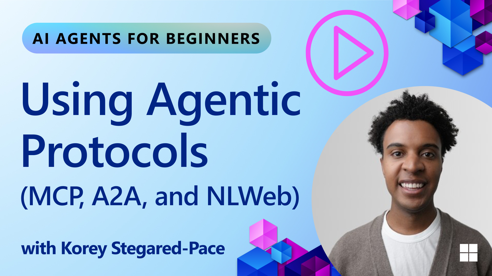
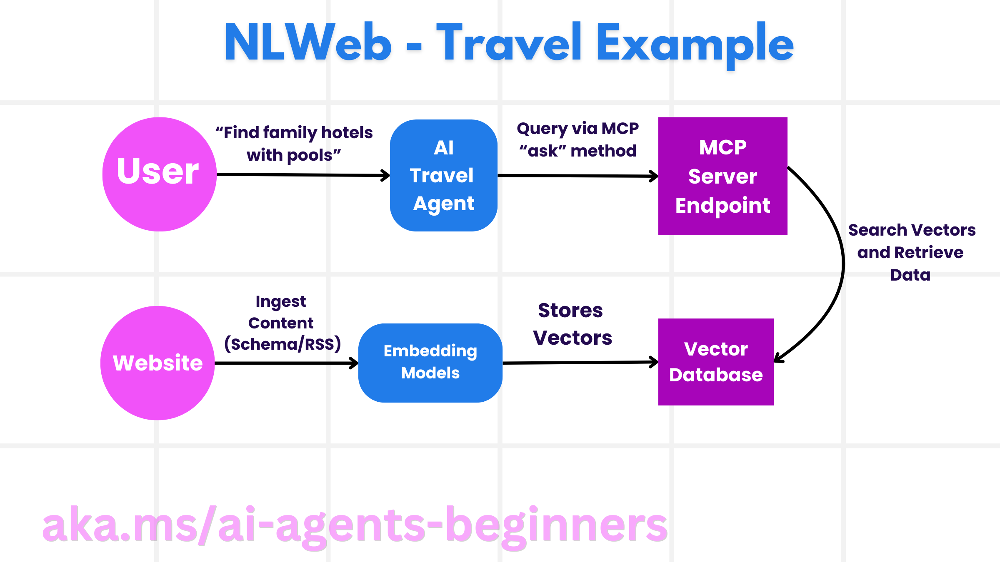

<!--
CO_OP_TRANSLATOR_METADATA:
{
  "original_hash": "f6600bebb86f72f3f62a9163fcce9566",
  "translation_date": "2025-08-30T10:08:36+00:00",
  "source_file": "11-agentic-protocols/README.md",
  "language_code": "sr"
}
-->
# Коришћење агентских протокола (MCP, A2A и NLWeb)

Како употреба AI агената расте, тако расте и потреба за протоколима који обезбеђују стандардизацију, сигурност и подржавају отворене иновације. У овој лекцији ћемо обрадити три протокола која настоје да задовоље ову потребу - Протокол контекста модела (MCP), Агент до агента (A2A) и Природни језички веб (NLWeb).

## Увод

У овој лекцији ћемо обрадити:

• Како **MCP** омогућава AI агентима приступ спољашњим алатима и подацима ради извршавања корисничких задатака.

• Како **A2A** омогућава комуникацију и сарадњу између различитих AI агената.

• Како **NLWeb** доноси интерфејсе на природном језику на било који вебсајт, омогућавајући AI агентима да откривају и интерагују са садржајем.

## Циљеви учења

• **Идентификовати** основну сврху и предности MCP, A2A и NLWeb у контексту AI агената.

• **Објаснити** како сваки протокол олакшава комуникацију и интеракцију између LLM-ова, алата и других агената.

• **Препознати** различите улоге које сваки протокол има у изградњи сложених агентских система.

## Протокол контекста модела

**Протокол контекста модела (MCP)** је отворени стандард који пружа стандардизован начин за апликације да обезбеде контекст и алате за LLM-ове. Ово омогућава "универзални адаптер" за различите изворе података и алате којима AI агенти могу приступити на конзистентан начин.

Погледајмо компоненте MCP-а, предности у односу на директно коришћење API-ја и пример како AI агенти могу користити MCP сервер.

### Основне компоненте MCP-а

MCP функционише на **клијент-сервер архитектури**, а основне компоненте су:

• **Хостови** су LLM апликације (на пример, едитор кода као што је VSCode) које иницирају везе са MCP сервером.

• **Клијенти** су компоненте унутар хост апликације које одржавају један-на-један везе са серверима.

• **Сервери** су лагани програми који излажу одређене могућности.

Протокол укључује три основна примитива, која представљају могућности MCP сервера:

• **Алати**: Ово су појединачне акције или функције које AI агент може позвати ради извршења задатка. На пример, сервис за временску прогнозу може излагати алат "добиј временску прогнозу", или е-комерц сервер може излагати алат "купи производ". MCP сервери оглашавају име, опис и шему улазних/излазних података за сваки алат у својој листи могућности.

• **Ресурси**: Ово су подаци или документи само за читање које MCP сервер може обезбедити, а клијенти их могу преузети по потреби. Примери укључују садржај фајлова, записе из базе података или логове. Ресурси могу бити текстуални (као што су код или JSON) или бинарни (као што су слике или PDF-ови).

• **Подсетници**: Ово су унапред дефинисани шаблони који пружају предложене подсетнике, омогућавајући сложеније токове рада.

### Предности MCP-а

MCP нуди значајне предности за AI агенте:

• **Динамичко откривање алата**: Агенти могу динамички добијати листу доступних алата са сервера заједно са описима њихових функција. Ово је супротно традиционалним API-јима, који често захтевају статичко кодирање за интеграције, што значи да свака промена API-ја захтева ажурирање кода. MCP нуди приступ "интегриши једном", што доводи до веће прилагодљивости.

• **Интероперабилност између LLM-ова**: MCP ради са различитим LLM-овима, пружајући флексибилност за промену основних модела ради бољих перформанси.

• **Стандардизована сигурност**: MCP укључује стандардизован метод аутентификације, што олакшава скалабилност приликом додавања приступа додатним MCP серверима. Ово је једноставније од управљања различитим кључевима и типовима аутентификације за различите традиционалне API-је.

### MCP Пример

Замислите да корисник жели да резервише лет користећи AI асистента који ради на MCP-у.

1. **Повезивање**: AI асистент (MCP клијент) се повезује са MCP сервером који обезбеђује авио-компанија.

2. **Откривање алата**: Клијент пита MCP сервер авио-компаније: "Које алате имате на располагању?" Сервер одговара са алатима као што су "претражи летове" и "резервиши летове".

3. **Позивање алата**: Корисник затим пита AI асистента: "Молим те, претражи лет од Портланда до Хонолулуа." AI асистент, користећи свој LLM, идентификује да треба да позове алат "претражи летове" и прослеђује релевантне параметре (полазиште, одредиште) MCP серверу.

4. **Извршење и одговор**: MCP сервер, који делује као омотач, прави стварни позив интерном API-ју авио-компаније за резервације. Затим добија информације о лету (нпр. JSON податке) и шаље их назад AI асистенту.

5. **Даља интеракција**: AI асистент представља опције лета. Када корисник изабере лет, асистент може позвати алат "резервиши лет" на истом MCP серверу, завршавајући резервацију.

## Протокол Агент до агента (A2A)

Док MCP ставља фокус на повезивање LLM-ова са алатима, **Протокол Агент до агента (A2A)** иде корак даље омогућавајући комуникацију и сарадњу између различитих AI агената. A2A повезује AI агенте из различитих организација, окружења и технолошких платформи ради извршења заједничког задатка.

Испитаћемо компоненте и предности A2A, као и пример његове примене у нашој апликацији за путовања.

### Основне компоненте A2A

A2A се фокусира на омогућавање комуникације између агената и њихову сарадњу ради извршења подзадатка корисника. Свака компонента протокола доприноси овоме:

#### Картица агента

Слично као што MCP сервер дели листу алата, Картица агента садржи:
    ◦ Име агента.  
    ◦ **Опис општих задатака** које извршава.  
    ◦ **Листу специфичних вештина** са описима како би други агенти (или чак људски корисници) разумели када и зашто би желели да позову тог агента.  
    ◦ **Тренутни URL крајње тачке** агента.  
    ◦ **Верзију** и **могућности** агента, као што су стримовање одговора и обавештења о променама.  

#### Извршилац агента

Извршилац агента је одговоран за **пренос контекста корисничког разговора удаљеном агенту**, како би удаљени агент разумео задатак који треба да се изврши. У A2A серверу, агент користи свој сопствени LLM за обраду долазних захтева и извршавање задатака користећи своје интерне алате.

#### Артефакт

Када удаљени агент заврши тражени задатак, његов радни производ се креира као артефакт. Артефакт **садржи резултат рада агента**, **опис онога што је завршено**, и **текстуални контекст** који се шаље кроз протокол. Након што се артефакт пошаље, веза са удаљеним агентом се затвара док поново не буде потребна.

#### Ред догађаја

Ова компонента се користи за **руковање ажурирањима и пренос порука**. Посебно је важна у продукцији за агентске системе како би се спречило затварање везе између агената пре него што се задатак заврши, посебно када извршење задатка може трајати дуже време.

### Предности A2A

• **Побољшана сарадња**: Омогућава агентима различитих добављача и платформи да интерагују, деле контекст и раде заједно, олакшавајући беспрекорну аутоматизацију у традиционално неповезаним системима.

• **Флексибилност у избору модела**: Сваки A2A агент може одлучити који LLM ће користити за обраду својих захтева, омогућавајући оптимизацију или фино подешене моделе по агенту, за разлику од једне LLM везе у неким MCP сценаријима.

• **Уграђена аутентификација**: Аутентификација је директно интегрисана у A2A протокол, пружајући робустан безбедносни оквир за интеракције агената.

### A2A Пример

Проширимо наш сценарио резервације путовања, али овог пута користећи A2A.

1. **Кориснички захтев мулти-агенту**: Корисник комуницира са "Путничким агентом" A2A клијентом/агентом, можда рекавши: "Молим те, резервиши цело путовање за Хонолулу за следећу недељу, укључујући летове, хотел и изнајмљивање аутомобила."

2. **Оркестрација од стране путничког агента**: Путнички агент прима овај сложени захтев. Користи свој LLM да размотри задатак и одреди да треба да комуницира са другим специјализованим агентима.

3. **Комуникација између агената**: Путнички агент затим користи A2A протокол да се повеже са нижим агентима, као што су "Авио агент", "Хотелски агент" и "Агент за изнајмљивање аутомобила" које су креирале различите компаније.

4. **Делегирано извршење задатака**: Путнички агент шаље специфичне задатке овим специјализованим агентима (нпр. "Пронађи летове за Хонолулу," "Резервиши хотел," "Изнајми аутомобил"). Сваки од ових специјализованих агената, који користе своје LLM-ове и своје алате (који могу бити MCP сервери), извршава свој специфични део резервације.

5. **Консолидовани одговор**: Када сви нижи агенти заврше своје задатке, Путнички агент компилира резултате (детаље о лету, потврду хотела, резервацију аутомобила) и шаље свеобухватан, разговорни одговор назад кориснику.

## Природни језички веб (NLWeb)

Вебсајтови су дуго били примарни начин за кориснике да приступе информацијама и подацима на интернету.

Погледајмо различите компоненте NLWeb-а, предности NLWeb-а и пример како NLWeb функционише кроз нашу апликацију за путовања.

### Компоненте NLWeb-а

- **NLWeb апликација (основни сервисни код)**: Систем који обрађује питања на природном језику. Повезује различите делове платформе како би креирао одговоре. Можете га замислити као **мотор који покреће функције природног језика** вебсајта.

- **NLWeb протокол**: Ово је **основни сет правила за интеракцију на природном језику** са вебсајтом. Одговоре шаље у JSON формату (често користећи Schema.org). Његова сврха је да створи једноставну основу за “AI веб,” на исти начин на који је HTML омогућио дељење докумената на мрежи.

- **MCP сервер (крајња тачка Протокола контекста модела)**: Свака NLWeb инсталација такође функционише као **MCP сервер**. Ово значи да може **делити алате (као што је метод “питај”) и податке** са другим AI системима. У пракси, ово чини садржај и могућности вебсајта употребљивим за AI агенте, омогућавајући вебсајту да постане део ширег “екосистема агената.”

- **Модели уграђивања**: Ови модели се користе за **претварање садржаја вебсајта у нумеричке репрезентације зване вектори** (уграђивања). Ови вектори хватају значење на начин који рачунари могу упоређивати и претраживати. Чувају се у посебној бази података, а корисници могу изабрати који модел уграђивања желе да користе.

- **Векторска база података (механизам за преузимање)**: Ова база података **чува уграђивања садржаја вебсајта**. Када неко постави питање, NLWeb проверава векторску базу података како би брзо пронашао најрелевантније информације. Даје брзу листу могућих одговора, рангираних по сличности. NLWeb ради са различитим системима за складиштење вектора као што су Qdrant, Snowflake, Milvus, Azure AI Search и Elasticsearch.

### NLWeb кроз пример

Размотримо наш вебсајт за резервацију путовања, али овог пута, он је покренут NLWeb-ом.

1. **Унос података**: Постојећи каталози производа вебсајта за путовања (нпр. листе летова, описи хотела, туристички пакети) форматирају се користећи Schema.org или се учитавају преко RSS фидова. NLWeb-ови алати уносе ове структуриране податке, креирају уграђивања и чувају их у локалној или удаљеној векторској бази података.

2. **Питање на природном језику (човек)**: Корисник посећује вебсајт и, уместо да прегледа меније, уноси у интерфејс за ћаскање: "Пронађи ми породични хотел у Хонолулуу са базеном за следећу недељу."

3. **Обрада NLWeb-а**: NLWeb апликација прима овај упит. Она шаље упит LLM-у ради разумевања и истовремено претражује своју векторску базу података за релевантне листе хотела.

4. **Прецизни резултати**: LLM помаже у тумачењу резултата претраге из базе података, идентифику

---

**Одрицање од одговорности**:  
Овај документ је преведен коришћењем услуге за превођење помоћу вештачке интелигенције [Co-op Translator](https://github.com/Azure/co-op-translator). Иако се трудимо да обезбедимо тачност, молимо вас да имате у виду да аутоматски преводи могу садржати грешке или нетачности. Оригинални документ на његовом изворном језику треба сматрати меродавним извором. За критичне информације препоручује се професионални превод од стране људи. Не преузимамо одговорност за било каква погрешна тумачења или неспоразуме који могу настати услед коришћења овог превода.