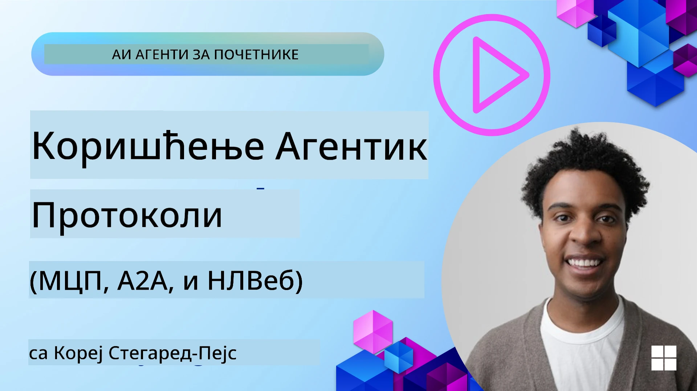
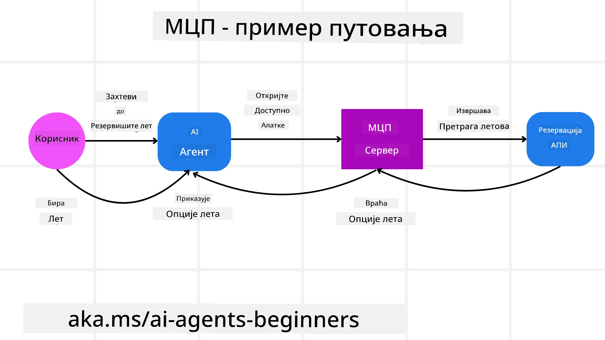
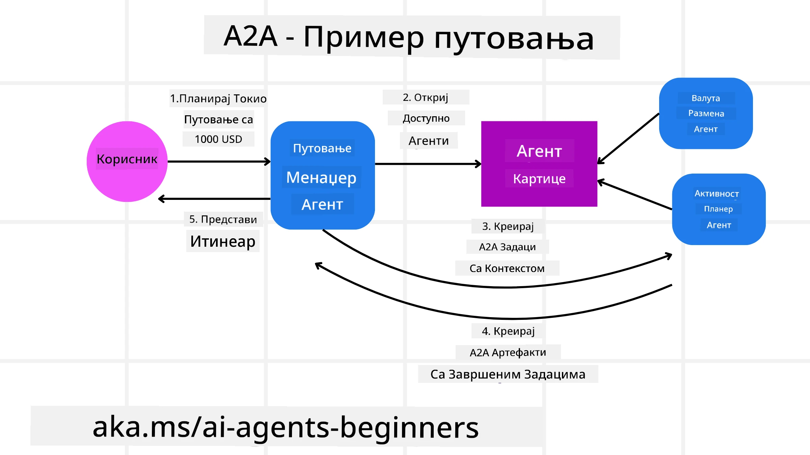
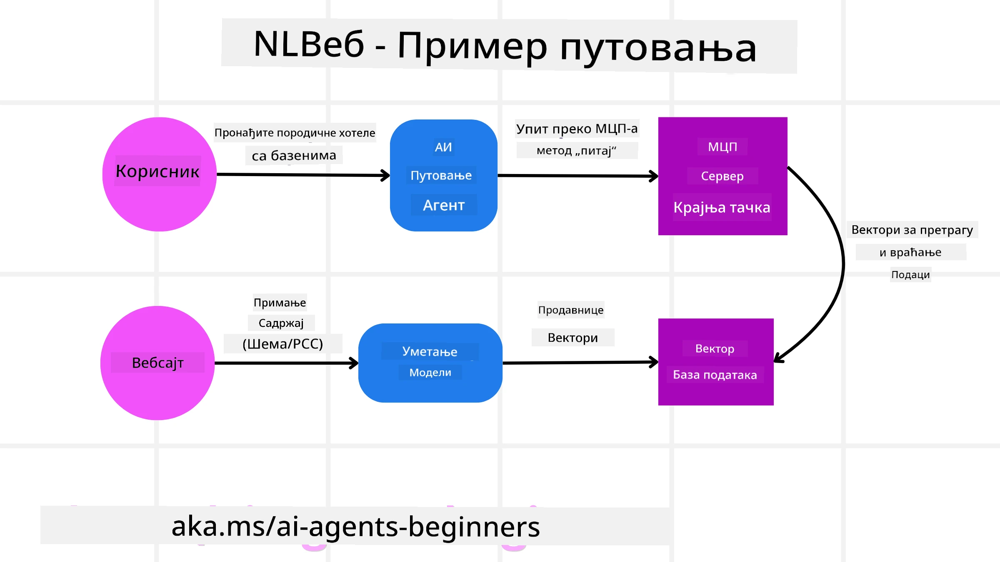

# Користећи агентске протоколе (MCP, A2A и NLWeb)

> _(Кликните на слику изнад да бисте погледали видео о овој лекцији)_

Како употреба AI агената расте, расте и потреба за протоколима који обезбеђују стандардизацију, безбедност и подржавају отворене иновације. У овој лекцији обухватићемо 3 протокола који настоје да задовоље ту потребу - Model Context Protocol (MCP), Agent to Agent (A2A) и Natural Language Web (NLWeb).

## Увод

У овој лекцији ћемо обрадити:

• Како **MCP** омогућава AI агентима приступ спољним алаткама и подацима да би довршили корисничке задатке.

• Како **A2A** омогућава комуникацију и сарадњу између различитих AI агената.

• Како **NLWeb** доноси природнојезичке интерфејсе на било који вебсајт, омогућавајући AI агентима да откривају и интерагују са садржајем.

## Циљеви учења

• **Идентификовати** основну сврху и предности MCP, A2A и NLWeb у контексту AI агената.

• **Објаснити** како сваки протокол олакшава комуникацију и интеракцију између LLM-ова, алатки и других агената.

• **Препознати** јасно различите улоге које сваки протокол игра у изградњи комплексних агентских система.

## Model Context Protocol

The **Model Context Protocol (MCP)** је отворени стандард који пружа стандардизован начин за апликације да обезбеде контекст и алатке LLM-овима. Ово омогућава "универзални адаптер" за различите изворе података и алатке којима AI агенти могу да се повежу на доследан начин.

Да погледамо компоненте MCP, предности у односу на директну употребу API-ја, и пример како AI агенти могу користити MCP сервер.

### Основне компоненте MCP

MCP ради на **client-server архитектури** и основне компоненте су:

• **Hosts** су LLM апликације (на пример уређивач кода као VSCode) које покрећу везе ка MCP серверу.

• **Clients** су компоненте унутар host апликације које одржавају један-на-један везе са серверима.

• **Servers** су лаки програми који излажу специфичне могућности.

Укључене у протокол су три основне примитиве које су могућности MCP сервера:

• **Tools**: То су појединачне акције или функције које AI агент може позвати да изврши радњу. На пример, сервис за временску прогнозу може изложити алатку "get weather", или е-commerce сервер може изложити алатку "purchase product". MCP сервери објављују сваки алат са именом, описом и схемом улаза/излаза у свом списку могућности.

• **Resources**: То су подаци само за читање или документи које MCP сервер може пружити, и клијенти их могу преузимати на захтев. Примери укључују садржај фајлова, записе у бази података или лог фајлове. Ресурси могу бити текст (као код или JSON) или бинарни (као слике или PDF-ови).

• **Prompts**: То су унапред дефинисани шаблони који пружају предложене упите, омогућавајући сложеније токове рада.

### Предности MCP

MCP нуди значајне предности за AI агенте:

• **Динамично откривање алата**: Агенти могу динамично примити листу доступних алата од сервера заједно са описима шта раде. Ово је супротно традиционалним API-јима, који често захтевају статичко кодирање интеграција, што значи да свака промена API-ја захтева ажурирања кода. MCP нуди приступ "интегриши једном", што води ка већој прилагодљивости.

• **Интероперабилност између LLM-ова**: MCP ради са различитим LLM-овима, пружајући флексибилност да се промени основни модел ради боље перформансе.

• **Стандардизована безбедност**: MCP укључује стандардни метод аутентификације, побољшавајући скалабилност приликом додавања приступа додатним MCP серверима. Ово је једноставније од управљања различитим кључевима и типовима аутентификације за разне традиционалне API-је.

### Пример MCP

Замислите да корисник жели да резервише лет користећи AI помоћника који користи MCP.

1. **Веза**: AI помоћник (MCP клијент) се повезује на MCP сервер који пружа авио-компанија.

2. **Откривање алата**: Клијент пита MCP сервер авио-компаније: "Које алатке имате доступне?" Сервер одговара алаткама као што су "search flights" и "book flights".

3. **Позив алата**: Затим тражите од AI помоћника: "Молим те потражи лет од Portland до Honolulu." AI помоћник, користећи свој LLM, идентификује да треба да позове алатку "search flights" и прослеђује релевантне параметре (origin, destination) MCP серверу.

4. **Извршење и одговор**: MCP сервер, делујући као омотач, обавља стварни позив унутрашњег booking API-ја авио-компаније. Он затим добија информације о летовима (нпр. JSON податке) и шаље их назад AI помоћнику.

5. **Даља интеракција**: AI помоћник представља опције летова. Када одаберете лет, помоћник може позвати алатку "book flight" на истом MCP серверу и завршити резервацију.

## Протокол агент-агент (A2A)

Док се MCP фокусира на повезивање LLM-ова са алаткама, **Agent-to-Agent (A2A) протокол** иде корак даље омогућавајући комуникацију и сарадњу између различитих AI агената. A2A повезује AI агенте из различитих организација, окружења и технолошких стекова да би заједно довршили заједнички задатак.

Погледаћемо компоненте и предности A2A, заједно са примером како би се могао применити у нашој апликацији за путовања.

### Основне компоненте A2A

A2A се фокусира на омогућавање комуникације између агената и на њихову сарадњу ради довршетка подзадака корисника. Свака компонента протокола доприноси овоме:

#### Agent Card

Слично као што MCP сервер дели листу алата, Agent Card има:
- Име агента.
- **опис општих задатака** које обавља.
- **листу специфичних вештина** са описима да помогне другим агентима (или чак људским корисницима) да разумеју када и зашто би желели да позову тог агента.
- **тренутни Endpoint URL** агента
- **верзију** и **могућности** агента као што су стримовање одговора и push нотификације.

#### Agent Executor

Agent Executor је одговоран за **преношење контекста корисничког разговора ка удаљеном агенту**, јер удаљени агент треба то како би разумео задатак који треба да се изврши. У A2A серверу, агент користи свој сопствени Large Language Model (LLM) да парсира долазне захтеве и изврши задатке користећи своје интерне алатке.

#### Artifact

Када удаљени агент заврши тражени задатак, његов резултат се креира као артефакт. Артефакт **садржи резултат агентовог рада**, **опис шта је довршено**, и **текстуални контекст** који се шаље кроз протокол. Након слања артефакта, веза са удаљеним агентом се затвара до следеће потребе.

#### Event Queue

Ова компонента се користи за **обраду ажурирања и прослеђивање порука**. Посебно је важна у производном окружењу за агентске системе како би спречила да веза између агената буде затворена пре него што се задатак заврши, посебно када временски оквири за довршавање задатака могу бити дужи.

### Предности A2A

• **Побољшана сарадња**: Омогућава агентима различитих добављача и платформи да међусобно комуницирају, деле контекст и раде заједно, олакшавајући беспрекорну аутоматизацију преко традиционално одвојених система.

• **Флексибилност у избору модела**: Сваки A2A агент може одлучити који LLM користи за обраду својих захтева, омогућавајући оптимизоване или фино подешене моделе по агенту, за разлику од једне LLM везе у неким MCP сценаријима.

• **Уграђена аутентификација**: Аутентификација је интегрисана директно у A2A протокол, пружајући робустан оквир за безбедност агентских интеракција.

### Пример A2A

Проширимо наш сценарио резервације путовања, али овог пута користећи A2A.

1. **Кориснички захтев ка мулти-агенту**: Корисник комуницира са "Travel Agent" A2A клијентом/агентом, можда речима: "Молим те резервиши цело путовање за Honolulu за следећу недељу, укључујући летове, хотел и изнајмљивање аутомобила".

2. **Оркестрација од стране Travel Agent-а**: Travel Agent прими овај комплексни захтев. Користи свој LLM да размишља о задатку и утврди да треба да комуницира са другим специјализованим агентима.

3. **Међуаґентска комуникација**: Travel Agent затим користи A2A протокол да се повеже са downstream агентима, као што су "Airline Agent", "Hotel Agent" и "Car Rental Agent" које су креирале различите компаније.

4. **Делегирано извршење задатака**: Travel Agent шаље специфичне задатке тим специјализованим агентима (нпр. "Пронађи летове за Honolulu", "Резервиши хотел", "Изнајми аутомобил"). Сваки од ових специјализованих агената, покрећући своје LLM-ове и користећи своје алатке (које могу бити и сами MCP сервери), обавља свој део резервације.

5. **Консолидован одговор**: Када сви downstream агенти заврше своје задатке, Travel Agent састави резултате (подаци о летовима, потврда хотела, резервација аутомобила) и пошаље свеобухватан, у формату разговора, назад кориснику.

## Natural Language Web (NLWeb)

Вебсајтови су дуго били примарни начин да корисници приступе информацијама и подацима широм интернета.

Погледајмо различите компоненте NLWeb-а, предности NLWeb-а и пример како наш NLWeb ради гледањем наше апликације за путовања.

### Компоненте NLWeb

- **NLWeb Application (Core Service Code)**: Систем који обрађује природнојезичка питања. Повезује различите делове платформе да би креирао одговоре. Можете га сматрати као **мотор који покреће природнојезичке функције** вебсајта.

- **NLWeb Protocol**: Ово је **основни скуп правила за природнојезичку интеракцију** са вебсајтом. Враћа одговоре у JSON формату (често користећи Schema.org). Његова сврха је да направи једноставну основу за „AI Web“, на исти начин на који је HTML омогућио дељење докумената онлајн.

- **MCP Server (Model Context Protocol Endpoint)**: Свака NLWeb инсталација такође ради као **MCP сервер**. То значи да може **делити алатке (као метод "ask") и податке** са другим AI системима. У пракси, ово чини садржај и могућности вебсајта доступним AI агентима, омогућавајући сајту да постане део ширег „екосистема агената“.

- **Embedding Models**: Ови модели се користе да **претворе садржај вебсајта у нумеричка представљања која се називају вектори (embeddings)**. Ови вектори хватају значење на начин који рачунари могу да пореде и претражују. Чувају се у посебној бази података, и корисници могу одабрати који embedding модел желе да користе.

- **Vector Database (Retrieval Mechanism)**: Ова база података **чува embeddings садржаја вебсајта**. Када неко постави питање, NLWeb проверава векторску базу да брзо пронађе најрелевантније информације. Даје брз списак могућих одговора, рангираних по сличности. NLWeb ради са различитим системима за складиштење вектора као што су Qdrant, Snowflake, Milvus, Azure AI Search и Elasticsearch.

### NLWeb по примеру

Размотримо поново наш сајт за резервацију путовања, али овог пута покреће га NLWeb.

1. **Унос података**: Постојећи продукцијски каталози туристичког сајта (нпр. листе летова, описи хотела, пакети тура) се форматирају користећи Schema.org или се учитавају преко RSS фидова. NLWeb-ови алати уносе те структуриране податке, креирају embeddings, и чувају их у локалној или удаљеној векторској бази података.

2. **Природнојезички упит (човек)**: Корисник посећује сајт и уместо да прегледа меније, уноси у разговорни интерфејс: "Пронађи ми породично-прилагођен хотел у Honolulu са базеном за следећу недељу".

3. **Обрада у NLWeb-у**: NLWeb апликација прими овај упит. Она шаље упит LLM-у ради разумевања и истовремено претражује своју векторску базу података за релевантне листе хотела.

4. **Тачни резултати**: LLM помаже да се протумаче резултати претраге из базе података, идентификују најбоља подударања на основу критеријума "породично-прилагођено", "базен" и "Honolulu", а затим форматира природнојезички одговор. Кључно је да се одговор односи на стварне хотеле из каталога сајта, избегавајући измишљене информације.

5. **Интеракција AI агента**: Пошто NLWeb служи као MCP сервер, спољни AI travel агент такође би се могао повезати на ову NLWeb инстанцу сајта. AI агент би онда могао да користи `ask("Постоје ли у области Honolulu ресторани прилагођени веганима које хотел препоручује?")`. NLWeb инстанца би обрадила ово, користећи своју базу података о информацијама о ресторанима (ако је учитана), и вратила структурирани JSON одговор.

### Имате више питања о MCP/A2A/NLWeb?

Придружите се [Microsoft Foundry Discord](https://aka.ms/ai-agents/discord) да упознате друге ученике, присуствујете терминima за консултације и добијете одговоре на питања о AI агентима.

## Ресурси

- [MCP for Beginners](https://aka.ms/mcp-for-beginners)  
- [MCP Documentation](https://learn.microsoft.com/python/api/overview/azure/ai-projects-readme)
- [NLWeb Repo](https://github.com/nlweb-ai/NLWeb)
- [Microsoft Agent Framework](https://aka.ms/ai-agents-beginners/agent-framewrok)

---

<!-- CO-OP TRANSLATOR DISCLAIMER START -->
Одрицање одговорности:
Овај документ је преведен помоћу услуге за превод уз помоћ вештачке интелигенције Co‑op Translator (https://github.com/Azure/co-op-translator). Иако се трудимо да превод буде тачан, имајте у виду да аутоматски преводи могу садржати грешке или нетачности. Оригинални документ на његовом изворном језику треба сматрати ауторитетним извором. За критичне информације препоручује се професионални, људски превод. Не сносимо одговорност за било какве неспоразуме или погрешна тумачења која проистичу из употребе овог превода.
<!-- CO-OP TRANSLATOR DISCLAIMER END -->