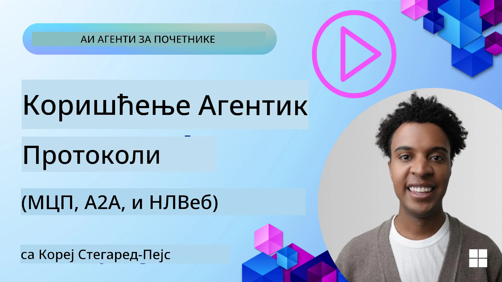
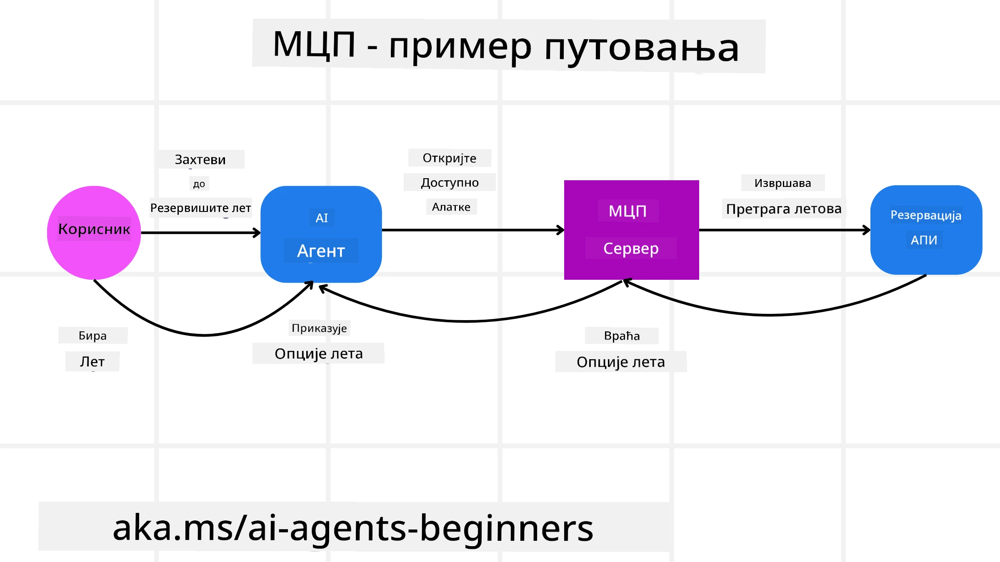
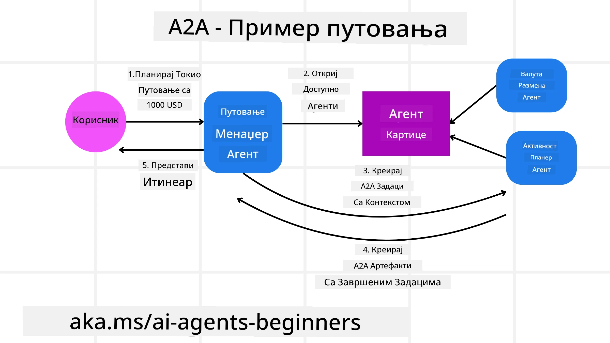
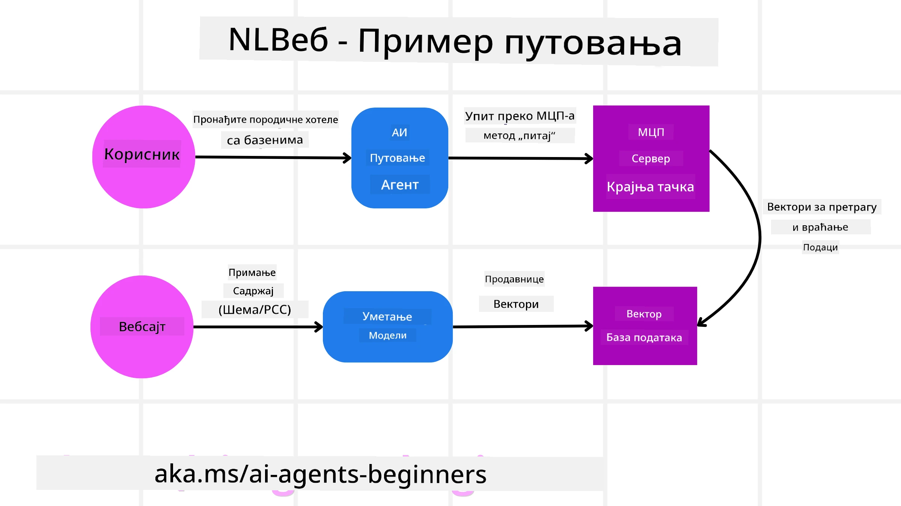

# Коришћење агентских протокола (MCP, A2A и NLWeb)

> _(Кликните на слику изнад да бисте гледали видео о овој лекцији)_

Како расте употреба AI агената, тако расте и потреба за протоколима који обезбеђују стандардизацију, безбедност и подржавају отворене иновације. У овој лекцији ћемо покрити 3 протокола који настоје да испуне ову потребу – Model Context Protocol (MCP), Agent to Agent (A2A) и Natural Language Web (NLWeb).

## Увод

У овој лекцији ћемо обрадити:

• Како **MCP** омогућава AI агентима приступ спољним алатима и подацима ради обављања корисничких задатака.

• Како **A2A** омогућава комуникацију и сарадњу између различитих AI агената.

• Како **NLWeb** уводи интерфејсе природног језика на било који вебсајт омогућавајући AI агенатима да открију и интерагују са садржајем.

## Циљеви учења

• **Препознавање** основне сврхе и користи MCP, A2A и NLWeb у контексту AI агената.

• **Објашњење** како сваки протокол олакшава комуникацију и интеракцију између LLM-ова, алата и других агената.

• **Препознавање** различитих улога које сваки протокол има у изградњи сложених системских агената.

## Model Context Protocol

**Model Context Protocol (MCP)** је отворени стандард који пружа стандардизован начин за апликације да обезбеде контекст и алате за LLM-ове. Ово омогућава „универзални адаптер“ ка различитим изворима података и алатима на које се AI агенти могу доследно повезивати.

Погледајмо компоненте MCP-а, предности у односу на директну употребу API-ја и пример како AI агенти могу користити MCP сервер.

### Основне компоненте MCP-а

MCP ради на **клијент-сервер архитектури** а основне компоненте су:

• **Домаћини (Hosts)** су LLM апликације (на пример уредник кода као што је VSCode) које покрећу везе са MCP сервером.

• **Клијенти (Clients)** су компоненте у оквиру домаћинске апликације које одржавају везе један-на-један са серверима.

• **Сервери (Servers)** су лагани програми који изложују одређене могућности.

У протоколу су укључена три основна примитива која су могућности MCP сервера:

• **Алати**: Ово су дискретне радње или функције које AI агент може позвати да изврши неку радњу. На пример, услуга за време може изложити алат „преузми време“, или сервер е-трговине алат „купите производ“. MCP сервери оглашавају име алата, опис и шему улаза/излаза у својој листи могућности.

• **Ресурси**: Ово су подаци или документи само за читање које MCP сервер може пружити, а клијенти их могу преузимати на захтев. Примери укључују садржај фајлова, записе из базе података или записе дневника. Ресурси могу бити текстуални (као код или JSON) или бинарни (слике или PDF).

• **Подстичући шаблони (Prompts)**: Ово су унапред дефинисани шаблони који пружају предлоге, омогућавајући сложеније радне токове.

### Предности MCP-а

MCP нуди значајне предности за AI Агенте:

• **Динамично откривање алата**: Агенти могу динамички добијати листу доступних алата са сервера заједно са описом њихове функције. Ово је супротно традиционалним API-јима који често захтевају статички код за интеграције, па било каква промена API-ја захтева ажурирања кода. MCP нуди приступ „интегриши једном“, што води ка већој прилагодљивости.

• **Интероперабилност између LLM-ова**: MCP ради преко различитих LLM-ова, пружајући флексибилност за промену основних модела ради бољег перформанса.

• **Стандардизована безбедност**: MCP укључује стандардни метод аутентификације, побољшавајући скалабилност приликом додавања приступа додатним MCP серверима. Ово је једноставније од управљања различитим кључевима и типовима аутентификације за различите традиционалне API-је.

### Пример MCP-а

Замислите да корисник жели да резервише лет помоћу AI асистента који користи MCP.

1. **Повезивање**: AI асистент (клијент MCP-а) се повезује са MCP сервером који пружа авио компанија.

2. **Откривање алата**: Клијент пита MCP сервер авио компаније: „Које алате имате?“ Сервер одговара алатима као што су „претрага летова“ и „резервиши летове“.

3. **Позивање алата**: Затим тражите од AI асистента: „Молим те пронађи лет од Портланда до Хонолулуу.“ AI асистент, користећи свој LLM, идентификује да мора да позове алат „претрага летова“ и прослеђује релевантне параметре (полазна тачка, одредиште) MCP серверу.

4. **Извршење и одговор**: MCP сервер, као обвезница, извршава стварни позив на унутрашњи API авио компаније за резервацију. Затим прима информације о лету (нпр. JSON податке) и шаље их назад AI асистенту.

5. **Даља интеракција**: AI асистент приказује опције летова. Када изаберете лет, асистент може позвати алат „резервиши лет“ на истом MCP серверу, завршавајући резервацију.

## Протокол Агент-Агент (A2A)

Док се MCP фокусира на повезивање LLM-ова са алатима, **протокол Agent-to-Agent (A2A)** иде корак даље омогућавајући комуникацију и сарадњу између различитих AI агената. A2A повезује AI агенте кроз различите организације, окружења и технолошке стекове ради обављања заједничког задатка.

Погледаћемо компоненте и предности A2A, као и пример како се може применити у нашој апликацији за путовања.

### Основне компоненте A2A

A2A се усредсређује на омогућавање комуникације између агената и њихов рад заједно на обављању потзадатка корисника. Свaka компонента протокола доприноси овој функцији:

#### Agent Card (Картица агента)

Слично као што MCP сервер дели листу алата, Agent Card садржи:
- Име агента.
- **опис општих задатака** које извршава.
- **листу специфичних вештина** са описима како би помогле другим агенатима (или чак људским корисницима) да разумеју када и зашто би желели да позову тог агента.
- **тренутну URL адресу крајње тачке (Endpoint)** агента.
- **верзију** и **могућности** агента као што су струјање одговора и дистрибуиране обавештења.

#### Agent Executor (Извршитељ агента)

Agent Executor је одговоран за **прелазак контекста корисничког разговора до удаљеног агента**, јер удаљени агент мора да разуме задатак који треба да изврши. У A2A серверу, агент користи свој LLM за обраду захтева и извршавање задатака коришћењем својих унутрашњих алата.

#### Артефакт

Када удаљени агент заврши тражени задатак, његов радни производ се креира као артефакт. Артефакт **садржи резултат рада агента**, **опис онога што је обављено** и **текстуални контекст** који се шаље протоколом. Након слања артефакта, веза са удаљеним агентом се затвара док поново не буде потребна.

#### Ред догађаја

Ова компонента се користи за **руковање ажурирањима и пренос порука**. Има посебан значај у продукционом окружењу агентских система како би се спречило да се веза између агената затвори пре завршетка задатка, посебно када завршетак задатка може потрајати дуже.

### Предности A2A

• **Побољшана сарадња**: Омогућава агентима из различитих добављача и платформи да комуницирају, деле контекст и заједно раде, олакшавајући беспрекорну аутоматизацију између традиционално одвојених система.

• **Флексибилност избора модела**: Сваки A2A агент може да одлучи који LLM користи за обраду својих захтева, омогућавајући оптимизоване или прилагођене моделе по агенту, за разлику од једне LLM везе у неким MCP сценаријима.

• **Уграђена аутентикација**: Аутентикација је интегрисана директно у A2A протокол, пружајући робустан безбедносни оквир за интеракције агената.

### Пример A2A

Проширимо наш сценарио резервације путовања, али овог пута користећи A2A.

1. **Кориснички захтев мулти-агенту**: Корисник интерагује са „Туристичким агентом“ A2A клијентом/агентом, на пример речима: „Молим резервиши цео пут за Хонолулу следеће недеље, укључујући летове, хотел и изнајмљивање аутомобила“.

2. **Оркестрација од стране туристичког агента**: Туристички агент прима овај сложени захтев. Користи свој LLM да размотри задатак и одлучи да мора да интерагује са другим специјализованим агентима.

3. **Међуагаентна комуникација**: Туристички агент затим користи A2A протокол да се повеже са даљим агентима, као што су „Авио агент“, „Хотел агент“ и „Агент за изнајмљивање аутомобила“ које су створиле различите компаније.

4. **Делегирано извршење задатка**: Туристички агент шаље специфичне задатке тим специјализованим агентима (нпр. „Пронађи летове за Хонолулу“, „Резервиши хотел“, „Изнајми аутомобил“). Свaki од тих специјализованих агената, који користе своје LLM и користе сопствене алате (који могу бити сами MCP сервери), извршава свој део резервације.

5. **Консолидовани одговор**: Када сви даљи агенти заврше своје задатке, Туристички агент компајлира резултате (подаци о лету, потврда хотела, резервација изнајмљивања аута) и шаље свеобухватан одговор у стилу ћаскања кориснику.

## Природни језички веб (NLWeb)

Веб-сајтови су дуго главни начин за кориснике да приступе информацијама и подацима на интернету.

Погледајмо различите компоненте NLWeb-а, предности NLWeb-а и пример како NLWeb ради, користећи нашу апликацију за путовања.

### Компоненте NLWeb-а

- **NLWeb апликација (језгро сервиса)**: Систем који обрађује питања природног језика. Повезује различите делове платформе за креирање одговора. Можете је сматрати **мотором који покреће функције природног језика** на вебсајту.

- **NLWeb протокол**: Основни скуп правила за интеракцију природним језиком са вебсајтом. Враћа одговоре у JSON формату (често користећи Schema.org). Његова сврха је да обезбеди једноставну основу за „AI веб“, на исти начин као што је HTML омогућио дељење докумената на мрежи.

- **MCP сервер (крајња тачка Model Context Protocol-а)**: Свако NLWeb подешавање такође ради као **MCP сервер**. Ово значи да може **делити алате (као метод „ask“) и податке** са другим AI системима. У пракси, ово чини садржај и могућности вебсајта доступним AI агентима, омогућавајући сајту да постане део ширег „екосистема агената“.

- **Ембеддинг модели**: Ови модели се користе за **претварање садржаја вебсајта у нумеричке репрезентације које се зову вектори (ембеддинзи)**. Ови вектори хватају значење на начин који рачунари могу да упоређују и претражују. Складиште се у посебној бази података, а корисници могу бирати који ембеддинг модел желе да користе.

- **Векторска база података (механизам претраге)**: Ова база чува ембеддинге садржаја вебсајта. Када неко постави питање, NLWeb проверава векторску базу да брзо пронађе најрелевантније информације. Даје брзу листу могућих одговора, рангирану по сличности. NLWeb ради са различитим системима складиштења вектора као што су Qdrant, Snowflake, Milvus, Azure AI Search и Elasticsearch.

### NLWeb на примеру

Размотримо поново наш вебсајт за резервацију путовања, али овог пута подржан NLWeb-ом.

1. **Учитавање података**: Постојећи каталози производа вебсајта за путовања (нпр. листе летова, описи хотела, пакети тура) форматирани су помоћу Schema.org или учитани преко RSS фидова. NLWeb алати учитавају ове структуриране податке, креирају ембеддинге и чувају их у локалној или удаљеној векторској бази података.

2. **Питање природним језиком (човек)**: Корисник посећује вебсајт и уместо да прегледа меније куца у ћаскању: „Пронађи хотел погодан за породице у Хонолулуу са базеном за следећу недељу“.

3. **Обрада NLWeb-а**: NLWeb апликација прима овај упит. Шаље упит LLM-у ради разумевања и истовремено претражује векторску базу података за релевантне понуде хотела.

4. **Тачни резултати**: LLM помаже у тумачењу резултата претраге из базе, идентификује најбоље поклапања на основу критеријума „погодно за породице“, „базен“ и „Хонолулу“ и онда форматира одговор на природном језику. Кључно је да одговор упућује на стварне хотеле из каталога, избегавајући измишљене информације.

5. **Интеракција AI агента**: Пошто NLWeb служи као MCP сервер, спољни AI туристички агент такође може да се повеже са овом NLWeb инстанцом вебсајта. AI агент може затим користити MCP метод `ask` да директно упита вебсајт: `ask("Постоје ли било какви ресторани погодни за вегане у региону Хонолулуу које препоручује хотел?")`. NLWeb инстанца би ово обрадила, користећи своју базу података о ресторанима (ако је учитана) и вратила структуриран JSON одговор.

### Имате још питања о MCP/A2A/NLWeb?

Придружите се [Microsoft Foundry Discord](https://discord.com/invite/ATgtXmAS5D) да се упознате са другим полазницима, похађате канцеларијско време и добијете одговоре на питања о AI агентима.

## Ресурси

- [MCP за почетнике](https://aka.ms/mcp-for-beginners)  
- [MCP документација](https://learn.microsoft.com/python/api/overview/azure/ai-projects-readme)
- [NLWeb репо](https://github.com/nlweb-ai/NLWeb)
- [Microsoft Agent Framework](https://aka.ms/ai-agents-beginners/agent-framework)

---

<!-- CO-OP TRANSLATOR DISCLAIMER START -->
**Изјава о одрицању одговорности**:
Овај документ је преведен коришћењем услуге за аутоматски превод [Co-op Translator](https://github.com/Azure/co-op-translator). Иако тежимо тачности, имајте у виду да аутоматски преводи могу садржати грешке или нетачности. Оригинални документ на његовом изворном језику треба сматрати ауторитативним извором. За критичне информације препоручује се професионални људски превод. Нисмо одговорни за било каква неспоразума или погрешна тумачења која произилазе из коришћења овог превода.
<!-- CO-OP TRANSLATOR DISCLAIMER END -->