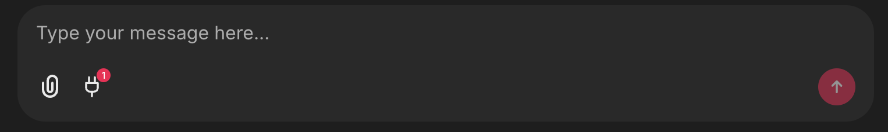

<!--
CO_OP_TRANSLATOR_METADATA:
{
  "original_hash": "9bf0395cbc541ce8db2a9699c8678dfc",
  "translation_date": "2025-08-30T10:29:35+00:00",
  "source_file": "11-agentic-protocols/code_samples/github-mcp/README.md",
  "language_code": "sr"
}
-->
# Github MCP Server Пример

## Опис

Ово је био демо направљен за AI Agents Hackathon који је организовао Microsoft Reactor.

Алат се користи за препоруку пројеката за хакатон на основу корисникових Github репозиторијума.
Ово се ради путем:

1. **Github Agent** - Коришћењем Github MCP Server-а за преузимање репозиторијума и информација о тим репозиторијумима.
2. **Hackathon Agent** - Узима податке од Github Agent-а и осмишљава креативне идеје за хакатон пројекте на основу пројеката, програмских језика које корисник користи и тема за AI Agents хакатон.
3. **Events Agent** - На основу предлога Hackathon Agent-а, Events Agent ће препоручити релевантне догађаје из серије AI Agent Hackathon.

## Покретање кода 

### Енвиронмент променљиве

Овај демо користи Azure Open AI Service, Semantic Kernel, Github MCP Server и Azure AI Search.

Уверите се да сте правилно подесили енвиронмент променљиве за коришћење ових алата:

```python
AZURE_OPENAI_CHAT_DEPLOYMENT_NAME=""
AZURE_OPENAI_EMBEDDING_DEPLOYMENT_NAME=""
AZURE_OPENAI_ENDPOINT=""
AZURE_OPENAI_API_KEY=""
AZURE_OPENAI_API_VERSION=""
AZURE_SEARCH_SERVICE_ENDPOINT=""
AZURE_SEARCH_API_KEY=""
``` 

## Покретање Chainlit Server-а

За повезивање са MCP сервером, овај демо користи Chainlit као интерфејс за ћаскање.

Да бисте покренули сервер, користите следећу команду у вашем терминалу:

```bash
chainlit run app.py -w
```

Ово би требало да покрене ваш Chainlit сервер на `localhost:8000` и да попуни ваш Azure AI Search Index садржајем из `event-descriptions.md`.

## Повезивање са MCP Server-ом

Да бисте се повезали са Github MCP Server-ом, изаберите икону "прикључак" испод кутије за ћаскање "Type your message here..":



Одатле можете кликнути на "Connect an MCP" да додате команду за повезивање са Github MCP Server-ом:

```bash
npx -y @modelcontextprotocol/server-github --env GITHUB_PERSONAL_ACCESS_TOKEN=[YOUR PERSONAL ACCESS TOKEN]
```

Замените "[YOUR PERSONAL ACCESS TOKEN]" вашим стварним Personal Access Token-ом.

Након повезивања, требало би да видите (1) поред иконе прикључка као потврду да је повезано. Ако није, покушајте поново да покренете Chainlit сервер са `chainlit run app.py -w`.

## Коришћење демо-а 

Да бисте започели рад агента за препоруку хакатон пројеката, можете уписати поруку као:

"Препоручи хакатон пројекте за Github корисника koreyspace"

Router Agent ће анализирати ваш захтев и одредити која комбинација агената (GitHub, Hackathon и Events) је најпогоднија за обраду вашег упита. Агенти раде заједно како би пружили свеобухватне препоруке на основу анализе Github репозиторијума, осмишљавања пројеката и релевантних технолошких догађаја.

---

**Одрицање од одговорности**:  
Овај документ је преведен коришћењем услуге за превођење помоћу вештачке интелигенције [Co-op Translator](https://github.com/Azure/co-op-translator). Иако се трудимо да обезбедимо тачност, молимо вас да имате у виду да аутоматски преводи могу садржати грешке или нетачности. Оригинални документ на његовом изворном језику треба сматрати ауторитативним извором. За критичне информације препоручује се професионални превод од стране људи. Не преузимамо одговорност за било каква погрешна тумачења или неспоразуме који могу настати услед коришћења овог превода.