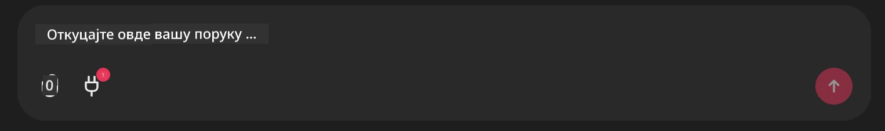

# Пример Github MCP сервера

## Опис

Ово је демо направљен за AI Agents Hackathon који је организовао Microsoft Reactor.

Ови алати се користе да препоруче пројекте за хакатон на основу Github репозиторијума корисника.
То се ради путем:

1. **Github Agent** - Користећи Github MCP Server за преузимање репозиторијума и информација о тим репозиторијумима.
2. **Hackathon Agent** - Прима податке од Github Agent-а и осмишљава креативне идеје за пројекте за хакатон на основу пројеката, језика које корисник користи и тема пројеката за AI Agents hackathon.
3. **Events Agent** - На основу предлога Hackathon агента, Events Agent ће препоручити релевантне догађаје из серије AI Agent Hackathon.
## Покретање кода 

### Поменљиве окружења

Овај демо користи Microsoft Agent Framework, Azure OpenAI Service, the Github MCP Server and Azure AI Search.

Уверите се да имате подешене одговарајуће променљиве окружења да бисте користили ове алате:

```python
AZURE_AI_PROJECT_ENDPOINT=""
AZURE_AI_MODEL_DEPLOYMENT_NAME=""
AZURE_SEARCH_SERVICE_ENDPOINT=""
AZURE_SEARCH_API_KEY=""
``` 

## Покретање Chainlit сервера

Да бисте се повезали на MCP сервер, овај демо користи Chainlit као интерфејс за ћаскање. 

За покретање сервера, користите следећу команду у терминалу:

```bash
chainlit run app.py -w
```

Ово би требало да покрене ваш Chainlit сервер на `localhost:8000` као и да попуни ваш Azure AI Search индекс садржајем из `event-descriptions.md`. 

## Повезивање на MCP сервер

Да бисте се повезали на Github MCP Server, изаберите икону "утикач" испод поља за ћаскање "Унесите своју поруку овде..":



Отуд можете да кликнете на "Повежи MCP" да бисте додали команду за повезивање на Github MCP Server:

```bash
npx -y @modelcontextprotocol/server-github --env GITHUB_PERSONAL_ACCESS_TOKEN=[YOUR PERSONAL ACCESS TOKEN]
```

Replace "[YOUR PERSONAL ACCESS TOKEN]" with your actual Personal Access Token. 

Након повезивања, требало би да видите (1) поред иконе утикача да потврдите да је повезано. Ако не, покушајте поново да покренете chainlit сервер са `chainlit run app.py -w`.

## Коришћење демо-а 

Да бисте покренули ток рада агената који препоручују пројекте за хакатон, можете унети поруку попут: 

"Препоручите пројекте за хакатон за Github корисника koreyspace"

Router Agent ће анализирати ваш захтев и одлучити која комбинација агената (GitHub, Hackathon, and Events) је најпогоднија да обради ваш упит. Агенти раде заједно како би пружили свеобухватне препоруке засноване на анализи GitHub репозиторијума, идејама за пројекте и релевантним техничким догађајима.

---

<!-- CO-OP TRANSLATOR DISCLAIMER START -->
Изјава о одрицању одговорности:
Овај документ је преведен помоћу услуге за превођење засноване на вештачкој интелигенцији Co-op Translator (https://github.com/Azure/co-op-translator). Иако се трудимо да будемо прецизни, имајте у виду да аутоматски преводи могу садржати грешке или нетачности. Изворни документ на његовом оригиналном језику треба сматрати референтним извором. За критичне информације препоручујемо професионални људски превод. Не сносимо одговорност за било каква непоразумевања или погрешне тумачења која произилазе из употребе овог превода.
<!-- CO-OP TRANSLATOR DISCLAIMER END -->