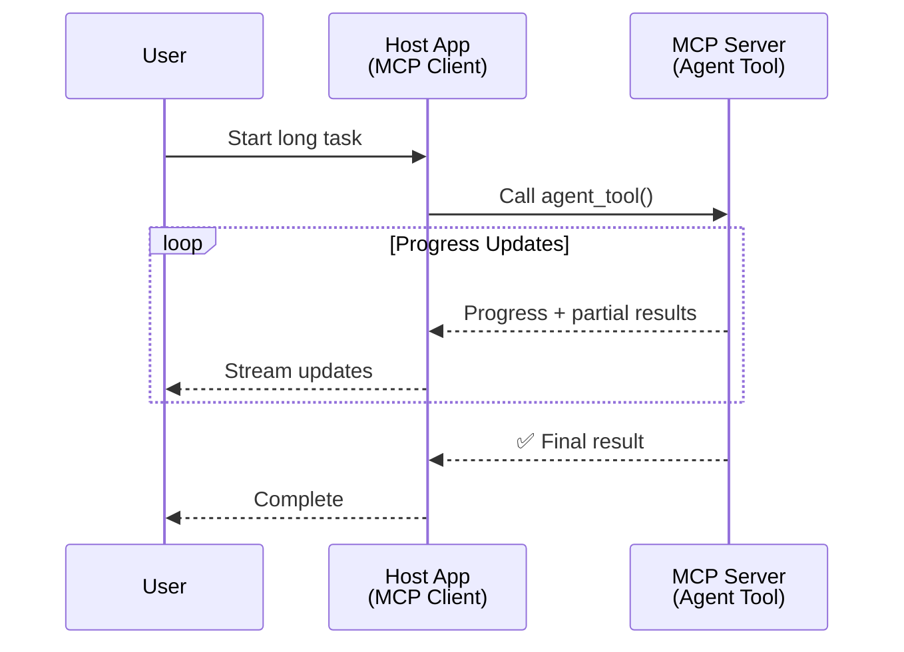
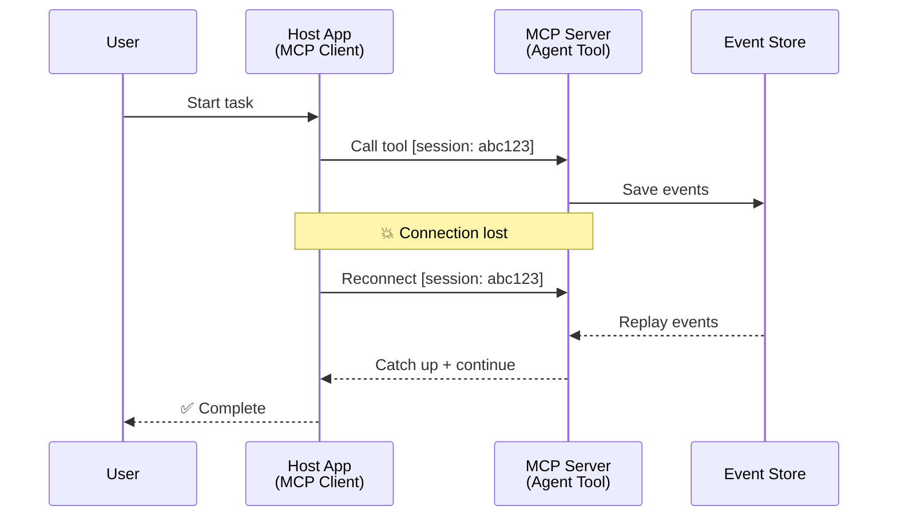
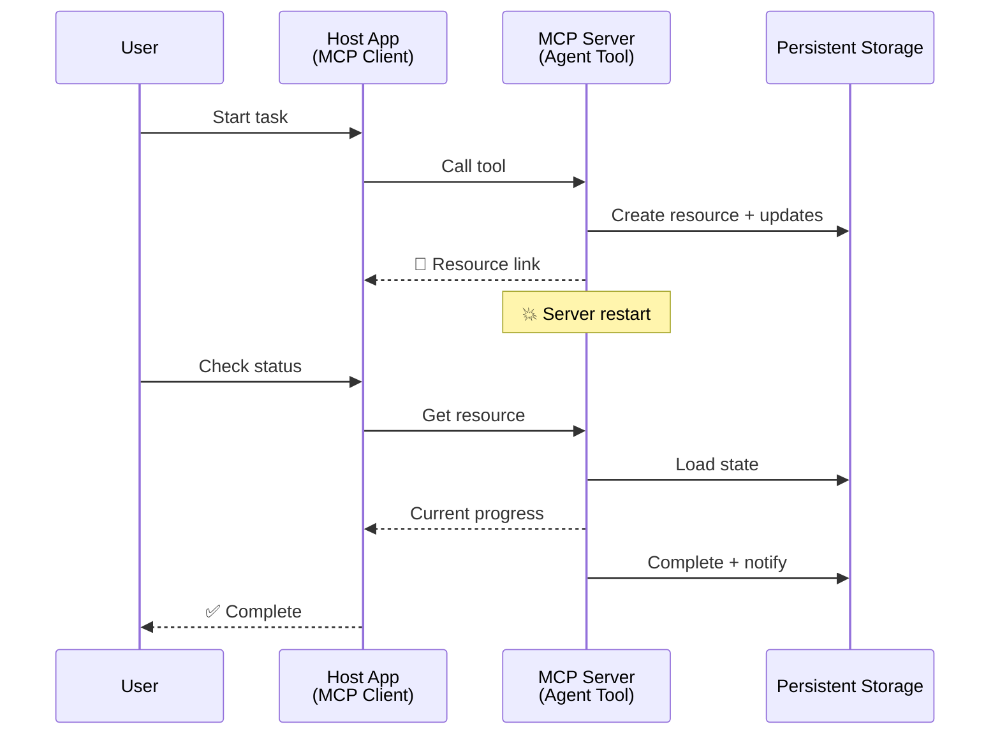
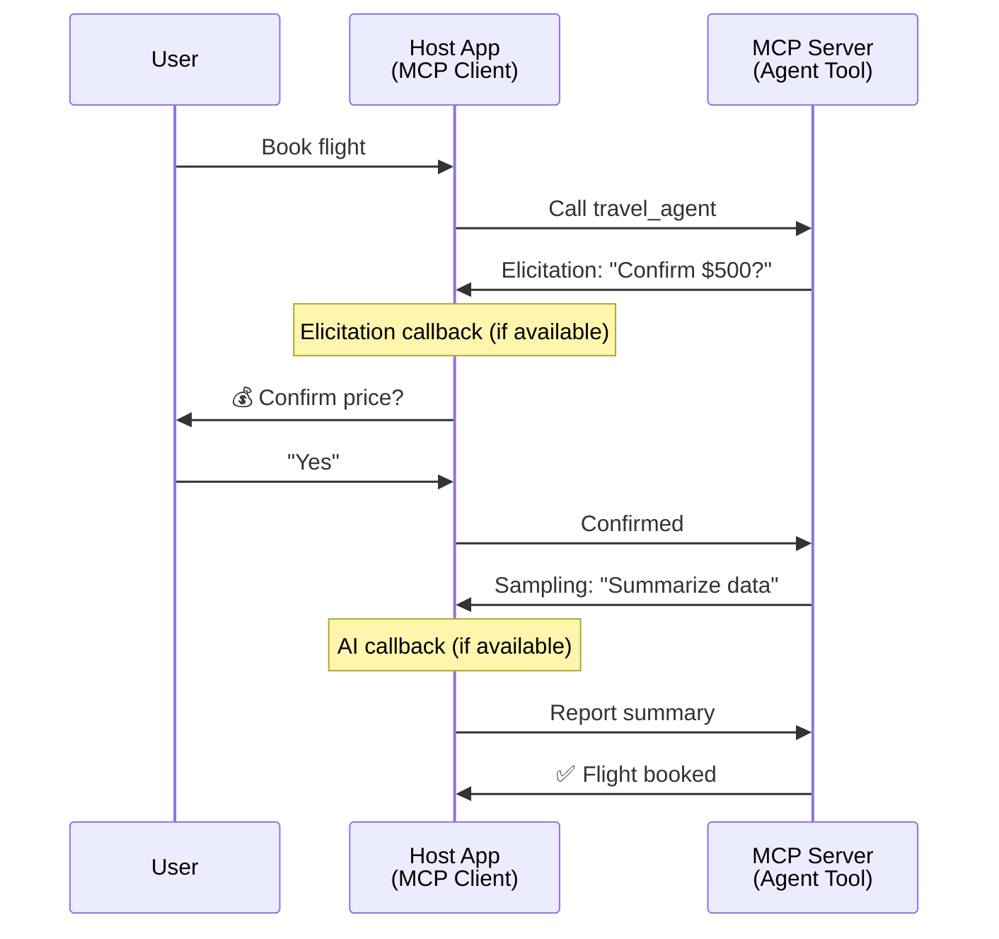
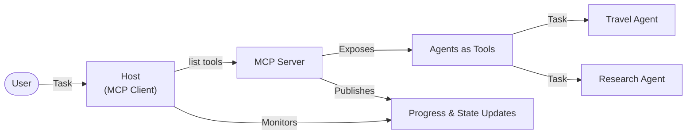

<!--
CO_OP_TRANSLATOR_METADATA:
{
  "original_hash": "5cc6836626047aa055e8960c8484a7d0",
  "translation_date": "2025-08-30T10:21:42+00:00",
  "source_file": "11-agentic-protocols/code_samples/mcp-agents/README.md",
  "language_code": "sr"
}
-->
# Изградња система за комуникацију између агената уз MCP

> Укратко - Можете ли изградити комуникацију између агената уз MCP? Да!

MCP је значајно еволуирао изван своје првобитне сврхе „обезбеђивања контекста за LLM-ове“. Са недавним побољшањима као што су [стримови који се могу наставити](https://modelcontextprotocol.io/docs/concepts/transports#resumability-and-redelivery), [елицитација](https://modelcontextprotocol.io/specification/2025-06-18/client/elicitation), [семплинг](https://modelcontextprotocol.io/specification/2025-06-18/client/sampling) и обавештења ([напредак](https://modelcontextprotocol.io/specification/2025-06-18/basic/utilities/progress) и [ресурси](https://modelcontextprotocol.io/specification/2025-06-18/schema#resourceupdatednotification)), MCP сада пружа робусну основу за изградњу сложених система за комуникацију између агената.

## Заблуда о агенти/алат концепту

Како све више програмера истражује алате са агентским понашањем (дуготрајно извршавање, потреба за додатним уносом током извршења итд.), честа је заблуда да MCP није погодан, углавном зато што су рани примери његових алатских примитива били фокусирани на једноставне обрасце захтев-одговор.

Овај став је застарео. MCP спецификација је значајно побољшана у последњих неколико месеци, са могућностима које омогућавају изградњу дуготрајног агентског понашања:

- **Стриминг и делимични резултати**: Ажурирања напретка у реалном времену током извршења
- **Настављивост**: Клијенти могу поново успоставити везу и наставити након прекида
- **Трајност**: Резултати опстају након рестарта сервера (нпр. преко линкова ка ресурсима)
- **Више корака**: Интерактивни унос током извршења преко елицитације и семплинга

Ове функције могу се комбиновати за омогућавање сложених агентских и мулти-агентских апликација, све на MCP протоколу.

За референцу, агента ћемо називати „алатом“ који је доступан на MCP серверу. Ово подразумева постојање хост апликације која имплементира MCP клијента, успоставља сесију са MCP сервером и може позивати агента.

## Шта MCP алат чини „агентским“?

Пре него што пређемо на имплементацију, хајде да утврдимо које инфраструктурне могућности су потребне за подршку дуготрајним агентима.

> Дефинисаћемо агента као ентитет који може аутономно функционисати током дужег периода, способан да обавља сложене задатке који могу захтевати више интеракција или прилагођавања на основу повратних информација у реалном времену.

### 1. Стриминг и делимични резултати

Традиционални обрасци захтев-одговор нису погодни за дуготрајне задатке. Агенти морају пружати:

- Ажурирања напретка у реалном времену
- Прелиминарне резултате

**Подршка у MCP-у**: Обавештења о ажурирању ресурса омогућавају стриминг делимичних резултата, али је потребан пажљив дизајн како би се избегли конфликти са JSON-RPC моделом 1:1 захтев/одговор.

| Функција                  | Пример употребе                                                                                                                                                                   | Подршка у MCP-у                                                                          |
| ------------------------- | -------------------------------------------------------------------------------------------------------------------------------------------------------------------------------- | --------------------------------------------------------------------------------------- |
| Ажурирања напретка у реалном времену | Корисник захтева миграцију кода. Агент стримује напредак: „10% - Анализа зависности... 25% - Конверзија TypeScript фајлова... 50% - Ажурирање увоза...“                  | ✅ Обавештења о напретку                                                                 |
| Делимични резултати       | Задатак „Генериши књигу“ стримује делимичне резултате, нпр. 1) Преглед приче, 2) Листа поглавља, 3) Свака завршена глава. Хост може прегледати, отказати или преусмерити у било којој фази. | ✅ Обавештења се могу „проширити“ да укључе делимичне резултате, видети предлоге PR 383, 776 |

<div align="center" style="font-style: italic; font-size: 0.95em; margin-bottom: 0.5em;">
<strong>Слика 1:</strong> Овај дијаграм илуструје како MCP агент стримује ажурирања напретка у реалном времену и делимичне резултате хост апликацији током дуготрајног задатка, омогућавајући кориснику да прати извршење у реалном времену.
</div>



### 2. Настављивост

Агенти морају руковати прекидима мреже на елегантан начин:

- Поновно успостављање везе након прекида (клијент)
- Наставак од тачке где су стали (редостављање порука)

**Подршка у MCP-у**: MCP StreamableHTTP транспорт данас подржава наставак сесије и редостављање порука уз помоћ ID-ева сесије и ID-ева последњег догађаја. Важно је напоменути да сервер мора имплементирати EventStore који омогућава репродукцију догађаја при поновном повезивању клијента.  
Напомена: постоји предлог заједнице (PR #975) који истражује транспортно-агностичне стримове који се могу наставити.

| Функција      | Пример употребе                                                                                                                                         | Подршка у MCP-у                                                            |
| ------------- | ------------------------------------------------------------------------------------------------------------------------------------------------------ | -------------------------------------------------------------------------- |
| Настављивост  | Клијент се прекида током дуготрајног задатка. При поновном повезивању, сесија се наставља са репродукцијом пропуштених догађаја, настављајући беспрекорно. | ✅ StreamableHTTP транспорт са ID-евима сесије, репродукцијом догађаја и EventStore |

<div align="center" style="font-style: italic; font-size: 0.95em; margin-bottom: 0.5em;">
<strong>Слика 2:</strong> Овај дијаграм приказује како MCP-ов StreamableHTTP транспорт и EventStore омогућавају беспрекорно настављање сесије: ако се клијент прекине, може се поново повезати и репродуковати пропуштене догађаје, настављајући задатак без губитка напретка.
</div>



### 3. Трајност

Дуготрајни агенти захтевају перзистентно стање:

- Резултати опстају након рестарта сервера
- Статус се може добити ван сесије
- Праћење напретка кроз сесије

**Подршка у MCP-у**: MCP сада подржава тип повратка Resource линка за позиве алата. Данас је могуће дизајнирати алат који креира ресурс и одмах враћа линк ка ресурсу. Алат може наставити да обрађује задатак у позадини и ажурира ресурс. Клијент може изабрати да проверава стање овог ресурса како би добио делимичне или потпуне резултате (на основу ажурирања ресурса које сервер пружа) или да се претплати на ресурс ради обавештења о ажурирањима.

Једно ограничење је да проверавање ресурса или претплата на ажурирања може трошити ресурсе, што има импликације на скалабилност. Постоји отворени предлог заједнице (укључујући #992) који истражује могућност укључивања вебхукова или тригера које сервер може позвати како би обавестио клијента/хост апликацију о ажурирањима.

| Функција    | Пример употребе                                                                                                                                    | Подршка у MCP-у                                                    |
| ----------- | ------------------------------------------------------------------------------------------------------------------------------------------------- | ------------------------------------------------------------------ |
| Трајност    | Сервер се руши током задатка миграције података. Резултати и напредак опстају након рестарта, клијент може проверити статус и наставити са перзистентног ресурса. | ✅ Линкови ка ресурсима са перзистентним складиштењем и обавештењима о статусу |

Данас је уобичајен образац дизајнирати алат који креира ресурс и одмах враћа линк ка ресурсу. Алат може у позадини обрађивати задатак, издавати обавештења о ресурсу која служе као ажурирања напретка или укључивати делимичне резултате, и ажурирати садржај у ресурсу по потреби.

<div align="center" style="font-style: italic; font-size: 0.95em; margin-bottom: 0.5em;">
<strong>Слика 3:</strong> Овај дијаграм демонстрира како MCP агенти користе перзистентне ресурсе и обавештења о статусу како би осигурали да дуготрајни задаци опстану након рестарта сервера, омогућавајући клијентима да провере напредак и преузму резултате чак и након кварова.
</div>



### 4. Интеракције у више корака

Агенти често захтевају додатни унос током извршења:

- Људско појашњење или одобрење
- Помоћ AI-а за сложене одлуке
- Динамичко прилагођавање параметара

**Подршка у MCP-у**: Потпуно подржано преко семплинга (за AI унос) и елицитације (за људски унос).

| Функција                 | Пример употребе                                                                                                                         | Подршка у MCP-у                                       |
| ------------------------ | --------------------------------------------------------------------------------------------------------------------------------------- | --------------------------------------------------- |
| Интеракције у више корака | Агент за резервацију путовања тражи потврду цене од корисника, затим тражи од AI-а да сажме податке о путовању пре него што заврши трансакцију. | ✅ Елицитација за људски унос, семплинг за AI унос |

<div align="center" style="font-style: italic; font-size: 0.95em; margin-bottom: 0.5em;">
<strong>Слика 4:</strong> Овај дијаграм приказује како MCP агенти могу интерактивно тражити људски унос или захтевати помоћ AI-а током извршења, подржавајући сложене, вишестепене токове рада као што су потврде и динамичко доношење одлука.
</div>



## Имплементација дуготрајних агената уз MCP - Преглед кода

Као део овог чланка, пружамо [репозиторијум кода](https://github.com/victordibia/ai-tutorials/tree/main/MCP%20Agents) који садржи потпуну имплементацију дуготрајних агената користећи MCP Python SDK са StreamableHTTP транспортом за наставак сесије и редостављање порука. Имплементација демонстрира како се MCP могућности могу комбиновати за омогућавање софистицираних агентских понашања.

Конкретно, имплементирамо сервер са два примарна алата агента:

- **Агент за путовања** - Симулира услугу резервације путовања са потврдом цене преко елицитације
- **Агент за истраживање** - Извршава истраживачке задатке са AI-асистираним сажецима преко семплинга

Оба агента демонстрирају ажурирања напретка у реалном времену, интерактивне потврде и потпуне могућности наставка сесије.

### Кључни концепти имплементације

Следећи одељци приказују имплементацију агента на страни сервера и руковање хостом на страни клијента за сваку могућност:

#### Стриминг и ажурирања напретка - Статус задатка у реалном времену

Стриминг омогућава агентима да пружају ажурирања напретка у реалном времену током дуготрајних задатака, држећи кориснике информисаним о статусу задатка и прелиминарним резултатима.

**Имплементација на серверу (агент шаље обавештења о напретку):**

```python
# From server/server.py - Travel agent sending progress updates
for i, step in enumerate(steps):
    await ctx.session.send_progress_notification(
        progress_token=ctx.request_id,
        progress=i * 25,
        total=100,
        message=step,
        related_request_id=str(ctx.request_id)
    )
    await anyio.sleep(2)  # Simulate work

# Alternative: Log messages for detailed step-by-step updates
await ctx.session.send_log_message(
    level="info",
    data=f"Processing step {current_step}/{steps} ({progress_percent}%)",
    logger="long_running_agent",
    related_request_id=ctx.request_id,
)
```

**Имплементација на клијенту (хост прима ажурирања напретка):**

```python
# From client/client.py - Client handling real-time notifications
async def message_handler(message) -> None:
    if isinstance(message, types.ServerNotification):
        if isinstance(message.root, types.LoggingMessageNotification):
            console.print(f"📡 [dim]{message.root.params.data}[/dim]")
        elif isinstance(message.root, types.ProgressNotification):
            progress = message.root.params
            console.print(f"🔄 [yellow]{progress.message} ({progress.progress}/{progress.total})[/yellow]")

# Register message handler when creating session
async with ClientSession(
    read_stream, write_stream,
    message_handler=message_handler
) as session:
```

#### Елицитација - Захтев за унос корисника

Елицитација омогућава агентима да траже унос корисника током извршења. Ово је кључно за потврде, појашњења или одобрења током дуготрајних задатака.

**Имплементација на серверу (агент тражи потврду):**

```python
# From server/server.py - Travel agent requesting price confirmation
elicit_result = await ctx.session.elicit(
    message=f"Please confirm the estimated price of $1200 for your trip to {destination}",
    requestedSchema=PriceConfirmationSchema.model_json_schema(),
    related_request_id=ctx.request_id,
)

if elicit_result and elicit_result.action == "accept":
    # Continue with booking
    logger.info(f"User confirmed price: {elicit_result.content}")
elif elicit_result and elicit_result.action == "decline":
    # Cancel the booking
    booking_cancelled = True
```

**Имплементација на клијенту (хост пружа елицитациони повратни позив):**

```python
# From client/client.py - Client handling elicitation requests
async def elicitation_callback(context, params):
    console.print(f"💬 Server is asking for confirmation:")
    console.print(f"   {params.message}")

    response = console.input("Do you accept? (y/n): ").strip().lower()

    if response in ['y', 'yes']:
        return types.ElicitResult(
            action="accept",
            content={"confirm": True, "notes": "Confirmed by user"}
        )
    else:
        return types.ElicitResult(
            action="decline",
            content={"confirm": False, "notes": "Declined by user"}
        )

# Register the callback when creating the session
async with ClientSession(
    read_stream, write_stream,
    elicitation_callback=elicitation_callback
) as session:
```

#### Семплинг - Захтев за AI помоћ

Семплинг омогућава агентима да траже помоћ LLM-а за сложене одлуке или генерисање садржаја током извршења. Ово омогућава хибридне људско-AI токове рада.

**Имплементација на серверу (агент тражи AI помоћ):**

```python
# From server/server.py - Research agent requesting AI summary
sampling_result = await ctx.session.create_message(
    messages=[
        SamplingMessage(
            role="user",
            content=TextContent(type="text", text=f"Please summarize the key findings for research on: {topic}")
        )
    ],
    max_tokens=100,
    related_request_id=ctx.request_id,
)

if sampling_result and sampling_result.content:
    if sampling_result.content.type == "text":
        sampling_summary = sampling_result.content.text
        logger.info(f"Received sampling summary: {sampling_summary}")
```

**Имплементација на клијенту (хост пружа семплинг повратни позив):**

```python
# From client/client.py - Client handling sampling requests
async def sampling_callback(context, params):
    message_text = params.messages[0].content.text if params.messages else 'No message'
    console.print(f"🧠 Server requested sampling: {message_text}")

    # In a real application, this could call an LLM API
    # For demo purposes, we provide a mock response
    mock_response = "Based on current research, MCP has evolved significantly..."

    return types.CreateMessageResult(
        role="assistant",
        content=types.TextContent(type="text", text=mock_response),
        model="interactive-client",
        stopReason="endTurn"
    )

# Register the callback when creating the session
async with ClientSession(
    read_stream, write_stream,
    sampling_callback=sampling_callback,
    elicitation_callback=elicitation_callback
) as session:
```

#### Настављивост - Континуитет сесије након прекида

Настављивост осигурава да дуготрајни задаци агента могу преживети прекиде клијента и наставити се беспрекорно након поновног повезивања. Ово се имплементира кроз складишта догађаја и токене за наставак.

**Имплементација складишта догађаја (сервер чува стање сесије):**

```python
# From server/event_store.py - Simple in-memory event store
class SimpleEventStore(EventStore):
    def __init__(self):
        self._events: list[tuple[StreamId, EventId, JSONRPCMessage]] = []
        self._event_id_counter = 0

    async def store_event(self, stream_id: StreamId, message: JSONRPCMessage) -> EventId:
        """Store an event and return its ID."""
        self._event_id_counter += 1
        event_id = str(self._event_id_counter)
        self._events.append((stream_id, event_id, message))
        return event_id

    async def replay_events_after(self, last_event_id: EventId, send_callback: EventCallback) -> StreamId | None:
        """Replay events after the specified ID for resumption."""
        # Find events after the last known event and replay them
        for _, event_id, message in self._events[start_index:]:
            await send_callback(EventMessage(message, event_id))

# From server/server.py - Passing event store to session manager
def create_server_app(event_store: Optional[EventStore] = None) -> Starlette:
    server = ResumableServer()

    # Create session manager with event store for resumption
    session_manager = StreamableHTTPSessionManager(
        app=server,
        event_store=event_store,  # Event store enables session resumption
        json_response=False,
        security_settings=security_settings,
    )

    return Starlette(routes=[Mount("/mcp", app=session_manager.handle_request)])

# Usage: Initialize with event store
event_store = SimpleEventStore()
app = create_server_app(event_store)
```

**Метаподаци клијента са токеном за наставак (клијент се поново повезује користећи сачувано стање):**

```python
# From client/client.py - Client resumption with metadata
if existing_tokens and existing_tokens.get("resumption_token"):
    # Use existing resumption token to continue where we left off
    metadata = ClientMessageMetadata(
        resumption_token=existing_tokens["resumption_token"],
    )
else:
    # Create callback to save resumption token when received
    def enhanced_callback(token: str):
        protocol_version = getattr(session, 'protocol_version', None)
        token_manager.save_tokens(session_id, token, protocol_version, command, args)

    metadata = ClientMessageMetadata(
        on_resumption_token_update=enhanced_callback,
    )

# Send request with resumption metadata
result = await session.send_request(
    types.ClientRequest(
        types.CallToolRequest(
            method="tools/call",
            params=types.CallToolRequestParams(name=command, arguments=args)
        )
    ),
    types.CallToolResult,
    metadata=metadata,
)
```

Хост апликација локално чува ID-еве сесије и токене за наставак, омогућавајући јој да се поново повеже са постојећим сесијама без губитка напретка или стања.

### Организација кода

<div align="center" style="font-style: italic; font-size: 0.95em; margin-bottom: 0.5em;">
<strong>Слика 5:</strong> Архитектура система агената заснованог на MCP-у
</div>



**Кључни фајлови:**

- **`server/server.py`** - MCP сервер са могућношћу наставка, са агентима за путовања и истраживање који демонстрирају елицитацију, семплинг и ажурирања напретка
- **`client/client.py`** - Интерактивна хост апликација са подршком за наставак, руковањем повратним позивима и управљањем токенима
- **`server/event_store.py`** - Имплементација складишта догађаја која омогућава наставак сесије и редостављање порука

## Проширење на комуникацију између више агената уз MCP

Горња имплементација може се проширити на мулти-агентске системе побољшањем интелигенције и обима хост апликације:


---

**Одрицање од одговорности**:  
Овај документ је преведен коришћењем услуге за превођење помоћу вештачке интелигенције [Co-op Translator](https://github.com/Azure/co-op-translator). Иако се трудимо да обезбедимо тачност, молимо вас да имате у виду да аутоматски преводи могу садржати грешке или нетачности. Оригинални документ на његовом изворном језику треба сматрати ауторитативним извором. За критичне информације препоручује се професионални превод од стране људи. Не преузимамо одговорност за било каква погрешна тумачења или неспоразуме који могу настати услед коришћења овог превода.