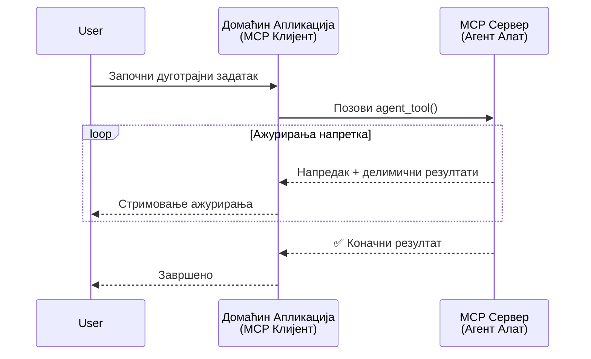
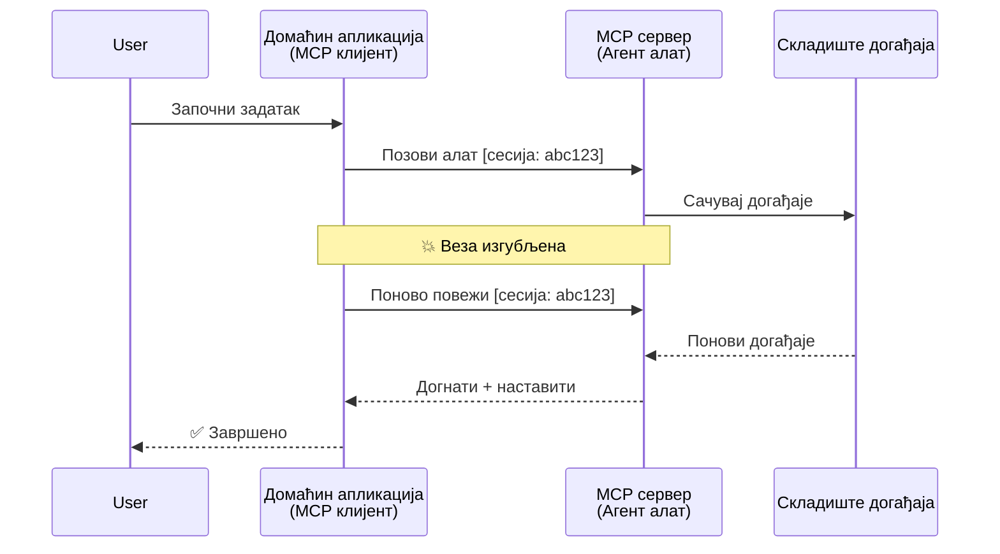
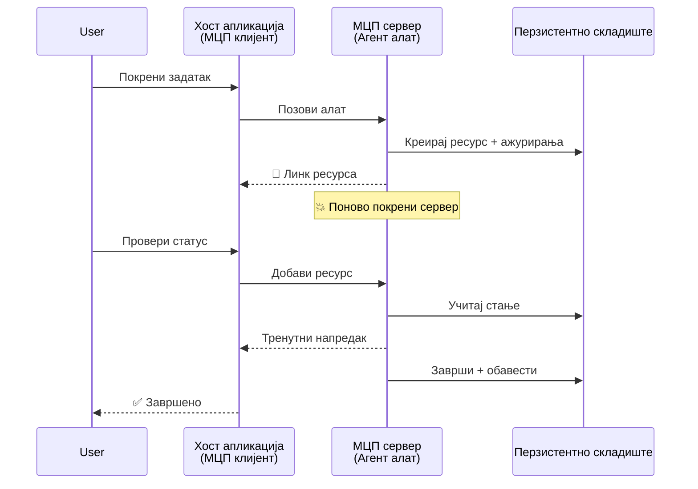
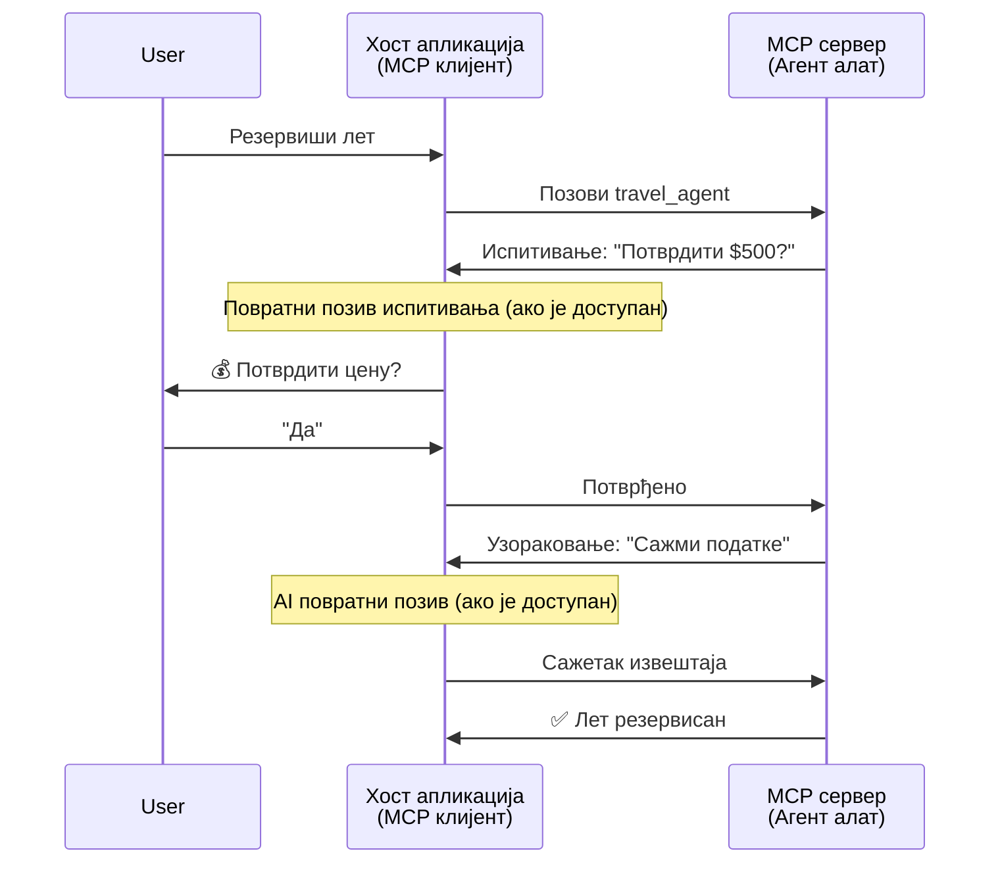
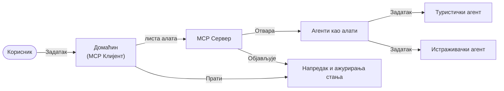

# Изградња система за комуникацију агент-а са агентом помоћу MCP-а

> Лако и брзо - Можете ли изградити комуникацију агент2агент на MCP-у? Можете!

MCP је значајно еволуирао изван свог оригиналног циља „обезбеђивања контекста за LLM-ове“. Са недавним унапређењима укључујући [поновно настављиве токове](https://modelcontextprotocol.io/docs/concepts/transports#resumability-and-redelivery), [елицитацију](https://modelcontextprotocol.io/specification/2025-06-18/client/elicitation), [узорковање](https://modelcontextprotocol.io/specification/2025-06-18/client/sampling) и обавештења ([прогрес](https://modelcontextprotocol.io/specification/2025-06-18/basic/utilities/progress) и [ресурсе](https://modelcontextprotocol.io/specification/2025-06-18/schema#resourceupdatednotification)), MCP сада пружа робусну основу за изградњу сложених система за комуникацију агент-а са агентом.

## Погрешно схватање о агенту/алату

Како све више програмера истражује алате са агентним понашањем (рашчлањују дуготрајне задатке, могу захтевати додатни унос током извршења итд.), уобичајена је погрешна претпоставка да MCP није погодан, пре свега јер су рани примери његових алата били примитивни и фокусирани на једноставне паттерне захтева и одговора.

Ово виђење је застарело. MCP спецификација је у последњих неколико месеци значајно унапређена капацитетима који затварају јаз за изградњу дугорочног агентног понашања:

- **Стриминг и Делимични резултати**: Ажурирања о напретку у реалном времену током извршења
- **Поновно настављање**: Клијенти могу да се поново повежу и наставе након прекида
- **Издржљивост**: Резултати преживљавају рестарте сервера (на пример преко линкова ка ресурсима)
- **Више корака**: Интерактивни унос током извршења преко елицитације и узорковања

Ове карактеристике могу бити састављене како би омогућиле сложене агентне и вишега агентне апликације, све развијене на MCP протоколу.

За референцу, агента ћемо називати „алат“ који је доступан на MCP серверу. То подразумева постојање домаћин апликације која имплементира MCP клијента, успоставља сесију са MCP сервером и може да позове агента.

## Шта чини MCP алат "агентним"?

Пре него што заронимо у имплементацију, хајде да утврдимо које инфраструктурне могућности су потребне за подршку дугорочним агентима.

> Агент ћемо дефинисати као ентитет који може радити аутономно током продужених периода, способан за руковање сложеним задацима који могу захтевати више интеракција или прилагођавања на основу повратних информација у реалном времену.

### 1. Стриминг и Делимични резултати

Традиционални обрасци захтева и одговора не функционишу за дугорочне задатке. Агенти морају обезбедити:

- Ажурирања напретка у реалном времену
- Привремене резултате

**Подршка MCP-а**: Обавештења о ажурирању ресурса омогућавају стриминг делимичних резултата, иако ово захтева пажљив дизајн како би се избегли конфликти са 1:1 моделом захтева/одговора JSON-RPC-а.

| Карактеристика              | Примена                                                                                                                                                              | Подршка MCP-а                                                                            |
| -------------------------- | ------------------------------------------------------------------------------------------------------------------------------------------------------------------ | ---------------------------------------------------------------------------------------- |
| Ажурирања напретка у реалном времену | Корисник тражи задатак миграције кода. Агент стримује прогрес: "10% - Анализа зависности... 25% - Конверзија TypeScript фајлова... 50% - Ажурирање увоза..."           | ✅ Обавештења о напретку                                                                 |
| Делимични резултати        | „Генериши књигу“ задатак стримује делимичне резултате, нпр. 1) Обрис приче, 2) Листа поглавља, 3) Свако поглавље како се завршава. Домаћин може да прегледа, отказује или преусмерава у било којој фази. | ✅ Обавештења се могу „продужити“ да укључују делимичне резултате, видети предлоге у PR 383, 776 |

<div align="center" style="font-style: italic; font-size: 0.95em; margin-bottom: 0.5em;">
<strong>Слика 1:</strong> Овај дијаграм илуструје како MCP агент стримује ажурирања напретка у реалном времену и делимичне резултате ка домаћин апликацији током дугорочног задатка, омогућавајући кориснику да прати извршење у реалном времену.
</div>


```mermaid
sequenceDiagram
    participant User
    participant Host as Домаћин Апликација<br/>(MCP Клијент)
    participant Server as MCP Сервер<br/>(Агент Алат)

    User->>Host: Започни дуготрајни задатак
    Host->>Server: Позови agent_tool()

    loop Ажурирања напретка
        Server-->>Host: Напредак + делимични резултати
        Host-->>User: Стримовање ажурирања
    end

    Server-->>Host: ✅ Коначни резултат
    Host-->>User: Завршено
```

### 2. Поновно настављање

Агенти морају пажљиво руковати прекидима мреже:

- Поновно повезивање након прекида (са клијентске стране)
- Наставак од места где су стали (поновна достава порука)

**Подршка MCP-а**: MCP StreamableHTTP транспорт данас подржава наставак сесије и поновну доставу порука са ID сесије и ID последњег догађаја. Важно је напоменути да сервер мора да имплементира EventStore који омогућава репродукцију догађаја при поновном повезивању клијента.  
Напомена да постоји заједнички предлог (PR #975) који истражује транспортно-агностичке поновно настављиве токове.

| Карактеристика   | Примена                                                                                                                                                   | Подршка MCP-а                                                              |
| --------------- | -------------------------------------------------------------------------------------------------------------------------------------------------------- | -------------------------------------------------------------------------- |
| Поновно настављање | Клијент се искључи током дуготрајног задатка. При поновном повезивању, сесија се наставља са репродукцијом пропуштених догађаја, настављајући непрекидно тамо где је стала. | ✅ StreamableHTTP транспорт са ID сесије, репродукцијом догађаја и EventStore |

<div align="center" style="font-style: italic; font-size: 0.95em; margin-bottom: 0.5em;">
<strong>Слика 2:</strong> Овај дијаграм приказује како MCP StreamableHTTP транспорт и EventStore омогућавају непрекидан наставак сесије: ако се клијент искључи, може се поново повезати и репродуковати пропуштене догађаје, настављајући задатак без губитка напретка.
</div>


```mermaid
sequenceDiagram
    participant User
    participant Host as Домаћин апликација<br/>(MCP клијент)
    participant Server as MCP сервер<br/>(Агент алат)
    participant Store as Складиште догађаја

    User->>Host: Започни задатак
    Host->>Server: Позови алат [сесија: abc123]
    Server->>Store: Сачувај догађаје

    Note over Host,Server: 💥 Веза изгубљена

    Host->>Server: Поново повежи [сесија: abc123]
    Store-->>Server: Понови догађаје
    Server-->>Host: Догнати + наставити
    Host-->>User: ✅ Завршено
```

### 3. Издржљивост

Дуготрајни агенти захтевају упорни стање:

- Резултати преживљавају рестартовање сервера
- Статус се може преузети независно
- Праћење напретка кроз сесије

**Подршка MCP-а**: MCP сада подржава Resource link као тип повратне вредности за позиве алата. Данас, могући образац је дизајнирати алат који креира ресурс и одмах враћа линк ка ресурсу. Алат може наставити да обрађује задатак у позадини и ажурира ресурс. Клијент може изабрати да прати стање овог ресурса да би добио делимичне или комплетне резултате (у зависности од тога каква обавештења о ажурирању сервера добија) или да се пријави на ресурс за обавештења о ажурирању.

Једно ограничење овде је да праћење ресураса или претплата на обавештења може трошити ресурсе са импликацијама на великом обиму. Постоји отворени заједнички предлог (укључујући #992) који истражује могућност укључивања webhooks или тригера које сервер може да позива за обавештавање клијента/домаћин апликације о ажурирањима.

| Карактеристика  | Примена                                                                                                                                         | Подршка MCP-а                                                      |
| -------------- | -------------------------------------------------------------------------------------------------------------------------------------------- | ------------------------------------------------------------------ |
| Издржљивост     | Сервер се сруши током задатка миграције података. Резултати и напредак преживљавају рестарт, клијент може да провери статус и настави са упорним ресурсом. | ✅ Линкови ка ресурсима са упорном меморијом и обавештењима о статусу |

Данас је уобичајени образац дизајнирати алат који креира ресурс и одмах враћа линк ка ресурсу. Алат може у позадини обрађивати задатак, издавати обавештења о ресурсу која служе као ажурирања напретка или укључују делимичне резултате, и ажурирати садржај у ресурсу по потреби.

<div align="center" style="font-style: italic; font-size: 0.95em; margin-bottom: 0.5em;">
<strong>Слика 3:</strong> Овај дијаграм показује како MCP агенти користе упорне ресурсе и обавештења о статусу како би осигурали да дуготрајни задаци преживе рестарте сервера, омогућавајући клијентима да проверавају напредак и преузимају резултате чак и после квара.
</div>


```mermaid
sequenceDiagram
    participant User
    participant Host as Хост апликација<br/>(МЦП клијент)
    participant Server as МЦП сервер<br/>(Агент алат)
    participant DB as Перзистентно складиште

    User->>Host: Покрени задатак
    Host->>Server: Позови алат
    Server->>DB: Креирај ресурс + ажурирања
    Server-->>Host: 🔗 Линк ресурса

    Note over Server: 💥 Поново покрени сервер

    User->>Host: Провери статус
    Host->>Server: Добави ресурс
    Server->>DB: Учитај стање
    Server-->>Host: Тренутни напредак
    Server->>DB: Заврши + обавести
    Host-->>User: ✅ Завршено
```

### 4. Вишекратне интеракције

Агенти често захтевају додатни унос током извршења:

- Човекова појашњења или одобрења
- Помоћ АИ за сложене одлуке
- Динамичка подешавања параметара

**Подршка MCP-а**: Потпуно подржано преко узорковања (за АИ унос) и елицитације (за људски унос).

| Карактеристика           | Примена                                                                                                                                | Подршка MCP-а                                        |
| ----------------------- | ------------------------------------------------------------------------------------------------------------------------------------ | ---------------------------------------------------- |
| Вишекратне интеракције  | Агента за резервацију путовања тражи потврду цене од корисника, затим тражи од АИ да сажме податке о путовању пре завршетка резервације. | ✅ Елицитација за људски унос, узорковање за АИ унос |

<div align="center" style="font-style: italic; font-size: 0.95em; margin-bottom: 0.5em;">
<strong>Слика 4:</strong> Овај дијаграм приказује како MCP агенти интерактивно елицитирају људски унос или траже помоћ АИ током извршења, подржавајући сложене, вишекратне радне токове као што су потврде и динамичко доношење одлука.
</div>


```mermaid
sequenceDiagram
    participant User
    participant Host as Хост апликација<br/>(MCP клијент)
    participant Server as MCP сервер<br/>(Агент алат)

    User->>Host: Резервиши лет
    Host->>Server: Позови travel_agent

    Server->>Host: Испитивање: "Потврдити $500?"
    Note over Host: Повратни позив испитивања (ако је доступан)
    Host->>User: 💰 Потврдити цену?
    User->>Host: "Да"
    Host->>Server: Потврђено

    Server->>Host: Узораковање: "Сажми податке"
    Note over Host: AI повратни позив (ако је доступан)
    Host->>Server: Сажетак извештаја

    Server->>Host: ✅ Лет резервисан
```

## Имплементација дуготрајних агената на MCP-у - Преглед кода

Као део овог чланка, обезбеђујемо [репозиторијум кода](https://github.com/victordibia/ai-tutorials/tree/main/MCP%20Agents) који садржи потпуну имплементацију дуготрајних агената коришћењем MCP Python SDK са StreamableHTTP транспортом за наставак сесије и поновну доставу порука. Имплементација показује како се MCP капацитети могу саставити да омогуће софистициране агентске понашања.

Конкретно, имплементирали смо сервер са два примарна агента-алата:

- **Путнички агент** - Симулира услугу резервације путовања са потврдом цене путем елицитације
- **Истраживачки агент** - Извршава истраживачке задатке са AI-помоћним сажецима путем узорковања

Обоје агената демонстрирају ажурирања напретка у реалном времену, интерактивне потврде и потпуну способност наставка сесије.

### Кључни концепти имплементације

Следећи одељци показују имплементацију агента на страни сервера и руковање домаћина на страни клијента за сваку функцију:

#### Стриминг и ажурирања напретка - Статус задатка у реалном времену

Стриминг омогућава агентима да обезбеде ажурирања напретка у реалном времену током дуготрајних задатака, држећи кориснике обавештеним о статусу задатка и привременим резултатима.

**Имплементација на серверу (агент шаље обавештења о напретку):**

```python
# Са сервер/server.py - Туристички агент који шаље ажурирања напретка
for i, step in enumerate(steps):
    await ctx.session.send_progress_notification(
        progress_token=ctx.request_id,
        progress=i * 25,
        total=100,
        message=step,
        related_request_id=str(ctx.request_id)
    )
    await anyio.sleep(2)  # Симулирај рад

# Алтернатива: Логовати поруке за детаљна корак-по-корак ажурирања
await ctx.session.send_log_message(
    level="info",
    data=f"Processing step {current_step}/{steps} ({progress_percent}%)",
    logger="long_running_agent",
    related_request_id=ctx.request_id,
)
```

**Имплементација на клијенту (домаћин прима ажурирања о напретку):**

```python
# Из client/client.py - Клијент који обрађује обавештења у реалном времену
async def message_handler(message) -> None:
    if isinstance(message, types.ServerNotification):
        if isinstance(message.root, types.LoggingMessageNotification):
            console.print(f"📡 [dim]{message.root.params.data}[/dim]")
        elif isinstance(message.root, types.ProgressNotification):
            progress = message.root.params
            console.print(f"🔄 [yellow]{progress.message} ({progress.progress}/{progress.total})[/yellow]")

# Региструјте обрађивач порука приликом креирања сесије
async with ClientSession(
    read_stream, write_stream,
    message_handler=message_handler
) as session:
```

#### Елицитација - Захтев за унос корисника

Елицитација омогућава агентима да током извршења затраже унос од корисника. Ово је битно за потврде, појашњења или одобрења током дуготрајних задатака.

**Имплементација на серверу (агент захтева потврду):**

```python
# Са сервера/server.py - Туристички агент тражи потврду цене
elicit_result = await ctx.session.elicit(
    message=f"Please confirm the estimated price of $1200 for your trip to {destination}",
    requestedSchema=PriceConfirmationSchema.model_json_schema(),
    related_request_id=ctx.request_id,
)

if elicit_result and elicit_result.action == "accept":
    # Настави са резервацијом
    logger.info(f"User confirmed price: {elicit_result.content}")
elif elicit_result and elicit_result.action == "decline":
    # Откажи резервацију
    booking_cancelled = True
```

**Имплементација на клијенту (домаћин пружа callback за елицитацију):**

```python
# Из client/client.py - Клијентска обрада захтева за добијање информација
async def elicitation_callback(context, params):
    console.print(f"💬 Server is asking for confirmation:")
    console.print(f"   {params.message}")

    response = console.input("Do you accept? (y/n): ").strip().lower()

    if response in ['y', 'yes']:
        return types.ElicitResult(
            action="accept",
            content={"confirm": True, "notes": "Confirmed by user"}
        )
    else:
        return types.ElicitResult(
            action="decline",
            content={"confirm": False, "notes": "Declined by user"}
        )

# Региструј повратни позив приликом креирања сесије
async with ClientSession(
    read_stream, write_stream,
    elicitation_callback=elicitation_callback
) as session:
```

#### Узорковање - Захтев за помоћ АИ

Узорковање омогућава агентима да током извршења затраже помоћ LLM-а за сложене одлуке или генерисање садржаја. Ово омогућава хибридне радне токове човека и АИ.

**Имплементација на серверу (агент тражи помоћ АИ):**

```python
# Из server/server.py - Истраживачки агент захтева AI резиме
sampling_result = await ctx.session.create_message(
    messages=[
        SamplingMessage(
            role="user",
            content=TextContent(type="text", text=f"Please summarize the key findings for research on: {topic}")
        )
    ],
    max_tokens=100,
    related_request_id=ctx.request_id,
)

if sampling_result and sampling_result.content:
    if sampling_result.content.type == "text":
        sampling_summary = sampling_result.content.text
        logger.info(f"Received sampling summary: {sampling_summary}")
```

**Имплементација на клијенту (домаћин пружа callback за узорковање):**

```python
# Из client/client.py - Клијент који обрађује захтеве за узорковање
async def sampling_callback(context, params):
    message_text = params.messages[0].content.text if params.messages else 'No message'
    console.print(f"🧠 Server requested sampling: {message_text}")

    # У стварној апликацији, ово би могло позвати LLM API
    # За демо сврхе, пружамо симулирани одговор
    mock_response = "Based on current research, MCP has evolved significantly..."

    return types.CreateMessageResult(
        role="assistant",
        content=types.TextContent(type="text", text=mock_response),
        model="interactive-client",
        stopReason="endTurn"
    )

# Региструјте повратни позив приликом креирања сесије
async with ClientSession(
    read_stream, write_stream,
    sampling_callback=sampling_callback,
    elicitation_callback=elicitation_callback
) as session:
```

#### Поновно настављање - Континуитет сесије преко прекида

Поновно настављање осигурава да дуготрајни задаци агената могу преживети прекиде клијента и наставити непрекидно након поновног повезивања. Ово се имплементира кроз EventStore и токене за наставак.

**Имплементација Event Store-а (сервер чува стање сесије):**

```python
# Из файла server/event_store.py - Једноставан меморијски продавница догађаја
class SimpleEventStore(EventStore):
    def __init__(self):
        self._events: list[tuple[StreamId, EventId, JSONRPCMessage]] = []
        self._event_id_counter = 0

    async def store_event(self, stream_id: StreamId, message: JSONRPCMessage) -> EventId:
        """Store an event and return its ID."""
        self._event_id_counter += 1
        event_id = str(self._event_id_counter)
        self._events.append((stream_id, event_id, message))
        return event_id

    async def replay_events_after(self, last_event_id: EventId, send_callback: EventCallback) -> StreamId | None:
        """Replay events after the specified ID for resumption."""
        start_index = None
        stream_id = None
        for index, (event_stream_id, event_id, _) in enumerate(self._events):
            if event_id == last_event_id:
                start_index = index + 1
                stream_id = event_stream_id
                break

        if start_index is None:
            return None

        # Репродукујте само касније догађаје из оригиналног тока сесије.
        for event_stream_id, event_id, message in self._events[start_index:]:
            if event_stream_id != stream_id:
                continue
            await send_callback(EventMessage(message, event_id))

        return stream_id

# Из файла server/server.py - Прослеђивање продавнице догађаја менаџеру сесије
def create_server_app(event_store: Optional[EventStore] = None) -> Starlette:
    server = ResumableServer()

    # Креирајте менаџера сесије са продавницом догађаја за наставак
    session_manager = StreamableHTTPSessionManager(
        app=server,
        event_store=event_store,  # Продавница догађаја омогућава наставак сесије
        json_response=False,
        security_settings=security_settings,
    )

    return Starlette(routes=[Mount("/mcp", app=session_manager.handle_request)])

# Употреба: Иницијализујте са продавницом догађаја
event_store = SimpleEventStore()
app = create_server_app(event_store)
```

**Метаподаци клијента са токеном за наставак (клијент се поново повезује користећи сачувано стање):**

```python
# Из датотеке client/client.py - Наставак клијента са метаподацима
if existing_tokens and existing_tokens.get("resumption_token"):
    # Користите постојећи токен наставка да бисте наставили од места где смо стали
    metadata = ClientMessageMetadata(
        resumption_token=existing_tokens["resumption_token"],
    )
else:
    # Креирајте повратни позив да бисте сачували токен наставка када га примите
    def enhanced_callback(token: str):
        protocol_version = getattr(session, 'protocol_version', None)
        token_manager.save_tokens(session_id, token, protocol_version, command, args)

    metadata = ClientMessageMetadata(
        on_resumption_token_update=enhanced_callback,
    )

# Пошаљите захтев са метаподацима наставка
result = await session.send_request(
    types.ClientRequest(
        types.CallToolRequest(
            method="tools/call",
            params=types.CallToolRequestParams(name=command, arguments=args)
        )
    ),
    types.CallToolResult,
    metadata=metadata,
)
```

Домаћин апликација локално чува ID сесије и токене за наставак, омогућавајући да се поново повежe са већ постојећим сесијама без губитка напретка или стања.

### Организација кода

<div align="center" style="font-style: italic; font-size: 0.95em; margin-bottom: 0.5em;">
<strong>Слика 5:</strong> Архитектура система агената заснована на MCP-у
</div>


```mermaid
graph LR
    User([Корисник]) -->|"Задатак"| Host["Домаћин<br/>(MCP Клијент)"]
    Host -->|листа алата| Server[MCP Сервер]
    Server -->|Отвара| AgentsTools[Агенти као алати]
    AgentsTools -->|Задатак| AgentA[Туристички агент]
    AgentsTools -->|Задатак| AgentB[Истраживачки агент]

    Host -->|Прати| StateUpdates[Напредак и ажурирања стања]
    Server -->|Објављује| StateUpdates

    class User user;
    class AgentA,AgentB agent;
    class Host,Server,StateUpdates core;
```

**Кључни фајлови:**

- **`server/server.py`** - MCP сервер са наставком сесије са путничким и истраживачким агентима који демонстрирају елицитацију, узорковање и ажурирања напретка
- **`client/client.py`** - Интерактивна домаћин апликација са подршком за наставак, руковаоцима callback-а и управљањем токенима
- **`server/event_store.py`** - Имплементација Event Store-а која омогућава наставак сесије и поновну доставу порука

## Проширење за вишега агентну комуникацију на MCP-у

Горе наведена имплементација може се проширити на вишега агентне системе унапређењем интелигенције и обима домаћин апликације:

- **Интелигентна декомпозиција задатака**: Домаћин анализира сложене корисничке захтеве и разлаже их у подзадатке за различите специјализоване агенте
- **Координација више сервера**: Домаћин одржава везе са више MCP сервера, од којих сваки нуди различите агенске капацитете
- **Управљање статусом задатака**: Домаћин прати напредак кроз више паралелних агенских задатака, управља зависностима и редоследом
- **Отпорност и поновни покушаји**: Домаћин управља грешкама, имплементира логику поновног покушаја и преусмерава задатке када агенти постану недоступни
- **Синтеза резултата**: Домаћин комбинује излазе више агената у кохерентне коначне резултате

Домаћин се развија из једноставног клијента у интелигентног оркестратора, координирајући расподељене агенске капацитете уз одржавање исте MCP протокол основе.

## Закључак

Унапређене могућности MCP-а - обавештења о ресурсима, елицитација/узорковање, поновно настављиви токови и упорни ресурси - омогућавају сложене интеракције агента са агентом уз одржавање једноставности протокола.

## Како започети

Спремни да изградите свој систем agent2agent? Пратите ове кораке:

### 1. Покрените демонстрацију

```bash
# Покрените сервер са event store-ом за наставак
python -m server.server --port 8006

# У другом терминалу покрените интерактивни клијент
python -m client.client --url http://127.0.0.1:8006/mcp
```

**Доступне команде у интерактивном режиму:**

- `travel_agent` - Резервишите путовање са потврдом цене путем елицитације
- `research_agent` - Истражујте теме са AI-помоћним сажецима путем узорковања
- `list` - Прикажи све доступне алате
- `clean-tokens` - Обриши токене за наставак
- `help` - Прикажи детаљну помоћ за команду
- `quit` - Изађи из клијента

### 2. Тестирајте могућности наставка

- Покрените дуготрајног агента (нпр. `travel_agent`)
- Прекините клијента током извршења (Ctrl+C)
- Поново покрените клијента - он ће аутоматски наставити са места на коме је стао

### 3. Истражите и проширите

- **Истражите примере**: Погледајте овај [mcp-agents](https://github.com/victordibia/ai-tutorials/tree/main/MCP%20Agents)
- **Придружите се заједници**: Учествујте у MCP дискусијама на GitHub-у
- **Експериментишите**: Почните са једноставним дуготрајним задатком и постепено додајте стриминг, поновно настављање, и координацију више агената

Ово показује како MCP омогућава интелигентно агентско понашање уз одржавање једноставности засноване на алатима.

У целини, MCP спецификација протокола се брзо развија; читаоч је охрабрен да прегледа званични сајт документације за најновија ажурирања - https://modelcontextprotocol.io/introduction

---

<!-- CO-OP TRANSLATOR DISCLAIMER START -->
**Изјава о одрицању одговорности**:
Овај документ је преведен коришћењем услуге за аутоматски превод [Co-op Translator](https://github.com/Azure/co-op-translator). Иако тежимо тачности, имајте у виду да аутоматски преводи могу садржати грешке или нетачности. Оригинални документ на његовом изворном језику треба сматрати ауторитативним извором. За критичне информације препоручује се професионални људски превод. Нисмо одговорни за било каква неспоразума или погрешна тумачења која произилазе из коришћења овог превода.
<!-- CO-OP TRANSLATOR DISCLAIMER END -->