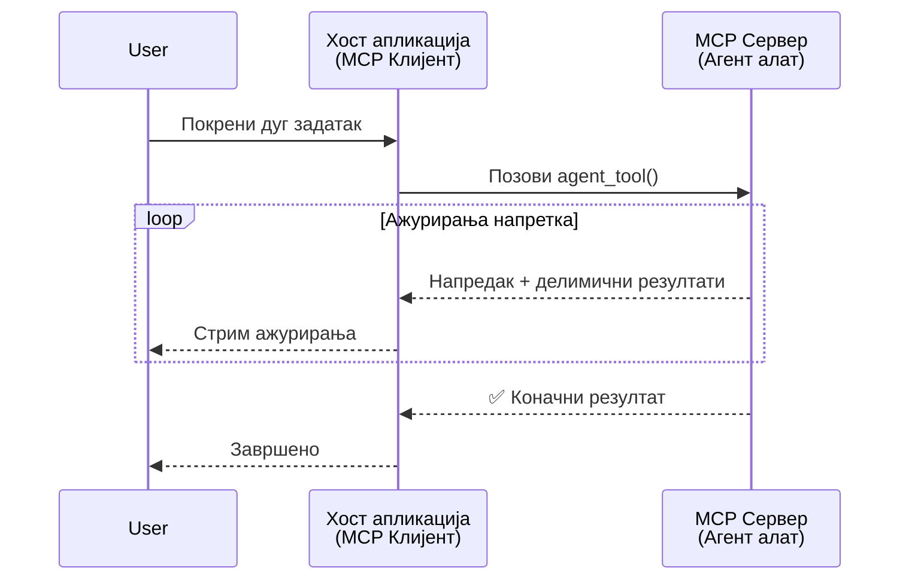
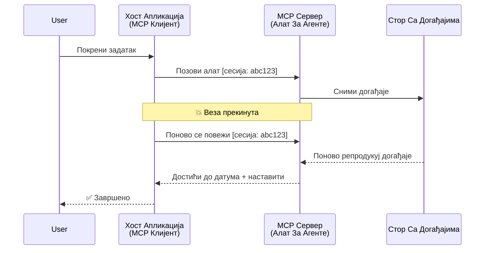
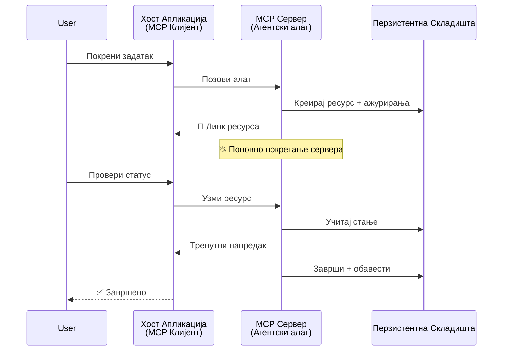
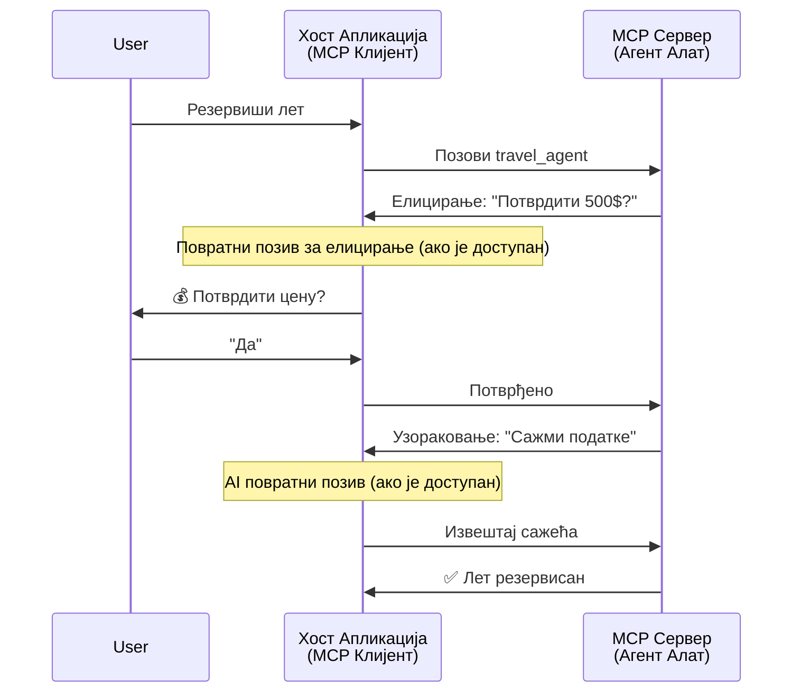
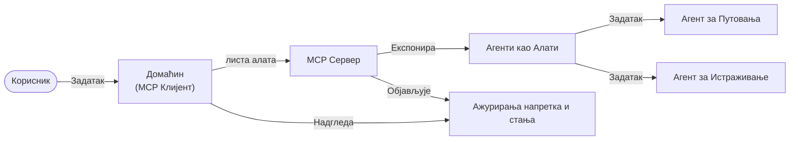

# Прављење система за комуникацију између агената помоћу MCP

> Кратко и јасно - Можете ли направити Agent2Agent комуникацију на MCP? Можете!

MCP се значајно развио у односу на његов изворни циљ „пружања контекста LLM-овима“. Уз недавна унапређења као што су [понављиви токови](https://modelcontextprotocol.io/docs/concepts/transports#resumability-and-redelivery), [елецирање](https://modelcontextprotocol.io/specification/2025-06-18/client/elicitation), [узорковање](https://modelcontextprotocol.io/specification/2025-06-18/client/sampling) и обавештења ([напредак](https://modelcontextprotocol.io/specification/2025-06-18/basic/utilities/progress) и [ресурси](https://modelcontextprotocol.io/specification/2025-06-18/schema#resourceupdatednotification)), MCP сада пружа робусну основу за прављење сложених система за комуникацију између агената.

## Погрешно разумевање агената/алата

Како више развојних програмера истражује алате са агентским понашањем (пуно време извршавања, могућа потреба за додатним уносом у току извршавања итд.), честа заблуда је да MCP није погодан, углавном зато што су рани примери алата били примитивни и фокусирани на једноставне захтев-одговор обрасце.

Ова перцепција је застарела. MCP спецификација је значајно унапређена у последњих неколико месеци са могућностима које смањују јаз за изградњу дугорочног агентског понашања:

- **Стримовање и делимични резултати**: Ажурирања напретка у реалном времену током извршавања
- **Поновљивост**: Клијенти могу поново да се повежу и наставе након прекида
- **Трајност**: Резултати преживљавају рестартове сервера (нпр. преко линкова ка ресурсима)
- **Мулти-турн интеракције**: Интерактивни унос у току извршавања преко елецирања и узорковања

Ове функције се могу комбиновати да омогуће сложене агентске и мулти-агентске апликације, све распоређене на MCP протоколу.

За потребе овог текста, агент ћемо називати „алатом“ који је доступан на MCP серверу. Ово подразумева постојање домаћинске апликације која имплементира MCP клијента који успоставља сесију са MCP сервером и може позивати агента.

## Шта чини MCP алат „агентским“?

Пре уласка у имплементацију, утврдићемо које инфраструктурне способности су потребне за подршку дугорочним агентима.

> Агент ћемо дефинисати као ентитет који може аутономно радити током дужих периода, способан да управља сложеним задацима који могу захтевати више интеракција или прилагођавања на основу повратних информација у реалном времену.

### 1. Стримовање и делимични резултати

Традиционални захтев-одговор образац не ради за дугорочне задатке. Агенти треба да пруже:

- Ажурирања напретка у реалном времену
- Прелиминарне резултате

**Подршка MCP:** Обавештења о ажурирању ресурса омогућавају стримовање делимичних резултата, али то захтева пажљив дизајн да се избегну конфликти са 1:1 моделом захтев-одговор JSON-RPC протокола.

| Карактеристика           | Примена                                                                                                                                                                      | Подршка MCP                                                                                |
| ------------------------ | ----------------------------------------------------------------------------------------------------------------------------------------------------------------------------- | ------------------------------------------------------------------------------------------ |
| Ажурирања напретка уживо | Корисник тражи миграцију кода. Агент стримује напредак: „10% - Анализа зависности... 25% - Претварање TypeScript датотека... 50% - Ажурирање увоза...“                       | ✅ Обавештења о напретку                                                                   |
| Делимични резултати      | Задатак „Направи књигу“ стримује делимичне резултате, нпр. 1) Преглед приче, 2) Листа поглавља, 3) Свако поглавље по завршетку. Домаћин може проверити, отказати или променити. | ✅ Обавештења могу бити „проширена“ да укључују делимичне резултате, види предлоге на PR 383, 776 |

<div align="center" style="font-style: italic; font-size: 0.95em; margin-bottom: 0.5em;">
<strong>Слика 1:</strong> Овај дијаграм илуструје како MCP агент стримује ажурирања напретка и делимичних резултата у реалном времену ка домаћинској апликацији током дугорочног задатка, омогућавајући кориснику да прати извршавање у реалном времену.
</div>


```mermaid
sequenceDiagram
    participant User
    participant Host as Хост апликација<br/>(MCP Клијент)
    participant Server as MCP Сервер<br/>(Агент алат)

    User->>Host: Покрени дуг задатак
    Host->>Server: Позови agent_tool()

    loop Ажурирања напретка
        Server-->>Host: Напредак + делимични резултати
        Host-->>User: Стрим ажурирања
    end

    Server-->>Host: ✅ Коначни резултат
    Host-->>User: Завршено
```

### 2. Поновљивост

Агенти морају да се носе са прекидима везе на мрежи:

- Поновно повезивање након прекида (клијентског)
- Наставак од места где су стали (поновно достављање порука)

**Подршка MCP:** MCP StreamableHTTP транспорт тренутно подржава наставак сесије и поновно достављање порука са ID-јевима сесије и последњег догађаја. Важно је да сервер имплементира EventStore који омогућава репродукцију догађаја приликом поновног повезивања клијента.  
Постоји и предлог заједнице (PR #975) који истражује транспортно-агностичке поновљиве токове.

| Карактеристика  | Примена                                                                                                                                                     | Подршка MCP                                                                        |
| --------------- | ---------------------------------------------------------------------------------------------------------------------------------------------------------- | ---------------------------------------------------------------------------------- |
| Поновљивост     | Клијент се искључи током дугорочног задатка. По поновном повезивању, сесија се наставља са репродукцијом пропуштених догађаја, без прекида рада.              | ✅ StreamableHTTP транспорт са ID-јевима сесије, репродукцијом догађаја и EventStore |

<div align="center" style="font-style: italic; font-size: 0.95em; margin-bottom: 0.5em;">
<strong>Слика 2:</strong> Овај дијаграм приказује како StreamableHTTP транспорт и EventStore омогућавају беспрекорно настављање сесије: ако се клијент искључи, може се поново повезати и репродуковати пропуштене догађаје, настављајући задатак без губитка напретка.
</div>


```mermaid
sequenceDiagram
    participant User
    participant Host as Хост Апликација<br/>(MCP Клијент)
    participant Server as MCP Сервер<br/>(Алат За Агенте)
    participant Store as Стор Са Догађајима

    User->>Host: Покрени задатак
    Host->>Server: Позови алат [сесија: abc123]
    Server->>Store: Сними догађаје

    Note over Host,Server: 💥 Веза прекинута

    Host->>Server: Поново се повежи [сесија: abc123]
    Store-->>Server: Поново репродукуј догађаје
    Server-->>Host: Достићи до датума + наставити
    Host-->>User: ✅ Завршено
```

### 3. Трајност

Дуготрајни агенти треба да имају упорни статус:

- Резултати преживљавају рестартове сервера
- Статус може да се добије ван линије
- Праћење напретка кроз сесије

**Подршка MCP:** MCP сада подржава тип повратног вредносног датума ресурса (Resource link) за позиве алата. Тренутно, могући образац је да алат креира ресурс и одмах врати линк ка ресурсу. Алат може у позадини радити на задатку и ажурирати ресурс. Клијент може да одабере да прати стање овог ресурса за делимичне или комплетне резултате (на основу ажурирања које сервер пружа) или да се претплати на ресорс за обавештења о ажурирањима.

Једно ограничење је да ово праћење или претплата може троши ресурсе што може имати утицаја на већем нивоу. Постоји отворени предлог заједнице (укључујући #992) који истражује могућност да сервер позива вебхукове или тригере да обавесте клијент/домаћина о ажурирањима.

| Карактеристика | Примена                                                                                                                                            | Подршка MCP                                                        |
| -------------- | ------------------------------------------------------------------------------------------------------------------------------------------------- | ------------------------------------------------------------------ |
| Трајност       | Сервер крашира током миграције података. Резултати и напредак преживљавају рестарт, клијент може проверити статус и наставити од упорног ресурса. | ✅ Линкови ка ресурсима са упорном меморијом и обавештењима о статусу |

Тренутно је уобичајен образац да алат креира ресурс и одмах врати линк. Алат у позадини може радити на задатку, слати обавештења као ажурирања напретка или делимичних резултата, и по потреби ажурирати садржај ресурса.

<div align="center" style="font-style: italic; font-size: 0.95em; margin-bottom: 0.5em;">
<strong>Слика 3:</strong> Овај дијаграм показује како MCP агенти користе упорне ресурсе и обавештења о статусу да обезбеде да дугорочни задаци преживљавају рестартове сервера, омогућавајући клијентима да провере напредак и преузму резултате чак и након неуспеха.
</div>


```mermaid
sequenceDiagram
    participant User
    participant Host as Хост Апликација<br/>(MCP Клијент)
    participant Server as MCP Сервер<br/>(Агентски алат)
    participant DB as Перзистентна Складишта

    User->>Host: Покрени задатак
    Host->>Server: Позови алат
    Server->>DB: Креирај ресурс + ажурирања
    Server-->>Host: 🔗 Линк ресурса

    Note over Server: 💥 Поновно покретање сервера

    User->>Host: Провери статус
    Host->>Server: Узми ресурс
    Server->>DB: Учитај стање
    Server-->>Host: Тренутни напредак
    Server->>DB: Заврши + обавести
    Host-->>User: ✅ Завршено
```

### 4. Мулти-турн интеракције

Агентима често треба додатни унос у току извршавања:

- Разјашњење или одобрење од човека
- Помоћ од АИ за сложене одлуке
- Динамичка подешавања параметара

**Подршка MCP:** Потпуно подржано преко узорковања (за АИ унос) и елецирања (за људски унос).

| Карактеристика       | Примена                                                                                                                                                       | Подршка MCP                                     |
| -------------------- | ------------------------------------------------------------------------------------------------------------------------------------------------------------ | ----------------------------------------------- |
| Мулти-турн интеракције | Агенти за резервацију путовања тражи од корисника потврду цене, потом од АИ сажетак података о путовању пре завршетка трансакције резервације.                   | ✅ Елецирање за унос човека, узорковање за АИ унос |

<div align="center" style="font-style: italic; font-size: 0.95em; margin-bottom: 0.5em;">
<strong>Слика 4:</strong> Овај дијаграм приказује како MCP агенти интерактивно траже људски унос или АИ помоћ у току извршавања, подржавајући сложене мулти-турн радне токове као што су потврде и динамичко доношење одлука.
</div>


```mermaid
sequenceDiagram
    participant User
    participant Host as Хост Апликација<br/>(MCP Клијент)
    participant Server as MCP Сервер<br/>(Агент Алат)

    User->>Host: Резервиши лет
    Host->>Server: Позови travel_agent

    Server->>Host: Елицирање: "Потврдити 500$?"
    Note over Host: Повратни позив за елицирање (ако је доступан)
    Host->>User: 💰 Потврдити цену?
    User->>Host: "Да"
    Host->>Server: Потврђено

    Server->>Host: Узораковање: "Сажми податке"
    Note over Host: AI повратни позив (ако је доступан)
    Host->>Server: Извештај сажећа

    Server->>Host: ✅ Лет резервисан
```

## Имплементација дугорочних агената на MCP – преглед кода

Као део овог чланка, пружамо [репозиторијум кода](https://github.com/victordibia/ai-tutorials/tree/main/MCP%20Agents) који садржи комплетну имплементацију дугорочних агената користећи MCP Python SDK са StreamableHTTP транспортом за наставак сесије и поновно достављање порука. Имплементација показује како могућности MCP-а могу бити комбиноване да омогуће софистициране агентске понашања.

Конкретно, имплементирамо сервер са два главна агента:

- **Агент за путовања** – симулира услугу резервације путовања са потврдом цене преко елецирања
- **Агент за истраживање** – обавља истраживачке задатке са АИ асистираним сажетцима преко узорковања

Оба агента приказују ажурирања напретка у реалном времену, интерактивне потврде и комплетне могућности наставка сесије.

### Кључни концепти имплементације

Следећи одељци показују имплементацију агента на серверској страни и руковање на страни клијента за сваку способност:

#### Стримовање и ажурирања напретка – статус задатка у реалном времену

Стримовање омогућава агентима да пруже ажурирања напретка у реалном времену током дугорочних задатака, држећи кориснике упознатим са статусом и делимичним резултатима.

**Имплементација сервера (агент шаље обавештења о напретку):**

```python
# Из сервер/server.py - Туристички агент шаље ажурирања о напретку
for i, step in enumerate(steps):
    await ctx.session.send_progress_notification(
        progress_token=ctx.request_id,
        progress=i * 25,
        total=100,
        message=step,
        related_request_id=str(ctx.request_id)
    )
    await anyio.sleep(2)  # Симулирај рад

# Алтернатива: Запиши поруке за детаљна ажурирања корак по корак
await ctx.session.send_log_message(
    level="info",
    data=f"Processing step {current_step}/{steps} ({progress_percent}%)",
    logger="long_running_agent",
    related_request_id=ctx.request_id,
)
```

**Имплементација клијента (домаћин прими ажурирања напретка):**

```python
# Из client/client.py - Клијент који обрађује обавештења у реалном времену
async def message_handler(message) -> None:
    if isinstance(message, types.ServerNotification):
        if isinstance(message.root, types.LoggingMessageNotification):
            console.print(f"📡 [dim]{message.root.params.data}[/dim]")
        elif isinstance(message.root, types.ProgressNotification):
            progress = message.root.params
            console.print(f"🔄 [yellow]{progress.message} ({progress.progress}/{progress.total})[/yellow]")

# Региструј обрадјивач порука приликом креирања сесије
async with ClientSession(
    read_stream, write_stream,
    message_handler=message_handler
) as session:
```

#### Елецирање – захтев за уносом корисника

Елецирање омогућава агентима да у току извршавања затраже унос од корисника. То је кључно за потврде, разјашњења или одобрења у дугорочним задацима.

**Имплементација сервера (агент тражи потврду):**

```python
# Са сервер/server.py - Туристички агент тражи потврду цене
elicit_result = await ctx.session.elicit(
    message=f"Please confirm the estimated price of $1200 for your trip to {destination}",
    requestedSchema=PriceConfirmationSchema.model_json_schema(),
    related_request_id=ctx.request_id,
)

if elicit_result and elicit_result.action == "accept":
    # Наставити са резервацијом
    logger.info(f"User confirmed price: {elicit_result.content}")
elif elicit_result and elicit_result.action == "decline":
    # Отказати резервацију
    booking_cancelled = True
```

**Имплементација клијента (домаћин обезбеђује елецирање преко повратне функције):**

```python
# Из client/client.py - Обрада захтева за еликацију клијента
async def elicitation_callback(context, params):
    console.print(f"💬 Server is asking for confirmation:")
    console.print(f"   {params.message}")

    response = console.input("Do you accept? (y/n): ").strip().lower()

    if response in ['y', 'yes']:
        return types.ElicitResult(
            action="accept",
            content={"confirm": True, "notes": "Confirmed by user"}
        )
    else:
        return types.ElicitResult(
            action="decline",
            content={"confirm": False, "notes": "Declined by user"}
        )

# Региструјте повратни позив приликом креирања сесије
async with ClientSession(
    read_stream, write_stream,
    elicitation_callback=elicitation_callback
) as session:
```

#### Узорковање – захтев за помоћ АИ-а

Узорковање омогућава агентима да траже помоћ LLM-а за сложене одлуке или генерисање садржаја током извршавања. Ово омогућава хибридне људско-АИ радне токове.

**Имплементација сервера (агент тражи AI помоћ):**

```python
# Из server/server.py - Агента за истраживање који тражи AI резиме
sampling_result = await ctx.session.create_message(
    messages=[
        SamplingMessage(
            role="user",
            content=TextContent(type="text", text=f"Please summarize the key findings for research on: {topic}")
        )
    ],
    max_tokens=100,
    related_request_id=ctx.request_id,
)

if sampling_result and sampling_result.content:
    if sampling_result.content.type == "text":
        sampling_summary = sampling_result.content.text
        logger.info(f"Received sampling summary: {sampling_summary}")
```

**Имплементација клијента (домаћин обезбеђује узорковање преко повратне функције):**

```python
# Из client/client.py - Руковање клијентским захтевима за узорковање
async def sampling_callback(context, params):
    message_text = params.messages[0].content.text if params.messages else 'No message'
    console.print(f"🧠 Server requested sampling: {message_text}")

    # У правој апликацији, ово би могло да позове LLM API
    # За демонстрационе сврхе, обезбеђујемо симулирани одговор
    mock_response = "Based on current research, MCP has evolved significantly..."

    return types.CreateMessageResult(
        role="assistant",
        content=types.TextContent(type="text", text=mock_response),
        model="interactive-client",
        stopReason="endTurn"
    )

# Региструјте повратни позив приликом креирања сесије
async with ClientSession(
    read_stream, write_stream,
    sampling_callback=sampling_callback,
    elicitation_callback=elicitation_callback
) as session:
```

#### Поновљивост – континуитет сесије након прекида

Поновљивост осигурава да дуготрајни агенти могу преживети искључења клијента и наставити интегрално након поновног повезивања. Ово се реализује преко складишта догађаја и токена за наставак.

**Имплементација EventStore (сервер чува стање сесије):**

```python
# Из server/event_store.py - Једноставан догађајни меморијски ток
class SimpleEventStore(EventStore):
    def __init__(self):
        self._events: list[tuple[StreamId, EventId, JSONRPCMessage]] = []
        self._event_id_counter = 0

    async def store_event(self, stream_id: StreamId, message: JSONRPCMessage) -> EventId:
        """Store an event and return its ID."""
        self._event_id_counter += 1
        event_id = str(self._event_id_counter)
        self._events.append((stream_id, event_id, message))
        return event_id

    async def replay_events_after(self, last_event_id: EventId, send_callback: EventCallback) -> StreamId | None:
        """Replay events after the specified ID for resumption."""
        # Пронађи догађаје након последњег познатог и репродукуј их
        for _, event_id, message in self._events[start_index:]:
            await send_callback(EventMessage(message, event_id))

# Из server/server.py - Прослеђивање догађајног слоја менаџеру сесија
def create_server_app(event_store: Optional[EventStore] = None) -> Starlette:
    server = ResumableServer()

    # Креирај менаџера сесија са догађајним слојем за наставак
    session_manager = StreamableHTTPSessionManager(
        app=server,
        event_store=event_store,  # Догађајни слој омогућава наставак сесије
        json_response=False,
        security_settings=security_settings,
    )

    return Starlette(routes=[Mount("/mcp", app=session_manager.handle_request)])

# Употреба: Иницијализуј са догађајним слојем
event_store = SimpleEventStore()
app = create_server_app(event_store)
```

**Мета-подаци клијента са токеном за наставак (клијент се поново повезује уз коришћење сачуваног стања):**

```python
# Из client/client.py - Наставак клијента са метаподацима
if existing_tokens and existing_tokens.get("resumption_token"):
    # Користите постојећи токен за наставак да бисте наставили тамо где смо стали
    metadata = ClientMessageMetadata(
        resumption_token=existing_tokens["resumption_token"],
    )
else:
    # Креирајте повратни позив за чување токена за наставак када се прими
    def enhanced_callback(token: str):
        protocol_version = getattr(session, 'protocol_version', None)
        token_manager.save_tokens(session_id, token, protocol_version, command, args)

    metadata = ClientMessageMetadata(
        on_resumption_token_update=enhanced_callback,
    )

# Пошаљите захтев са метаподацима за наставак
result = await session.send_request(
    types.ClientRequest(
        types.CallToolRequest(
            method="tools/call",
            params=types.CallToolRequestParams(name=command, arguments=args)
        )
    ),
    types.CallToolResult,
    metadata=metadata,
)
```

Домаћинска апликација чува ID сесија и токене за наставак локално, омогућавајући повратак у постојеће сесије без губитка напретка или стања.

### Организација кода

<div align="center" style="font-style: italic; font-size: 0.95em; margin-bottom: 0.5em;">
<strong>Слика 5:</strong> Архитектура система агената базирана на MCP
</div>


```mermaid
graph LR
    User([Корисник]) -->|"Задатак"| Host["Домаћин<br/>(MCP Клијент)"]
    Host -->|листa алата| Server[MCP Сервер]
    Server -->|Експонира| AgentsTools[Агенти као Алати]
    AgentsTools -->|Задатак| AgentA[Агент за Путовања]
    AgentsTools -->|Задатак| AgentB[Агент за Истраживање]

    Host -->|Надгледа| StateUpdates[Ажурирања напретка и стања]
    Server -->|Објављује| StateUpdates

    class User user;
    class AgentA,AgentB agent;
    class Host,Server,StateUpdates core;
```

**Кључне датотеке:**

- **`server/server.py`** – MCP сервер са наставком сесије и агентима за путовања и истраживање који демонстрирају елецирање, узорковање и ажурирања напретка
- **`client/client.py`** – Интерактивна домаћинска апликација са подршком за наставак, обрадом повратних функција и управљањем токенима
- **`server/event_store.py`** – Имплементација складишта догађаја која омогућава наставак сесија и поновно достављање порука

## Проширење на комуникацију више агената на MCP

Горња имплементација може бити проширена на системе са више агената унапређењем интелигенције и обима домаћинске апликације:

- **Интелигентна деобу задатака**: Домаћин анализира сложене захтеве корисника и разбија их на подзадатке за различите специјализоване агенте
- **Координација више сервера**: Домаћин одржава везе са више MCP сервера, од којих сваки пружа различите агентске могућности
- **Управљање статусом задатака**: Домаћин прати напредак више паралелних агентских задатака, управља зависностима и редоследом
- **Отпорност и поновни покушаји**: Домаћин управља неуспесима, имплементира логику поновних покушаја и преусмерава задатке када агенти постану недоступни
- **Синтеза резултата**: Домаћин комбинује излазе више агената у кохерентне коначне резултате

Домаћин еволуира из једноставног клијента у интелигентног оркестратора који координира расподељене могућности агената уз одржавање исте MCP протоколске основе.

## Закључак

Побољшане могућности MCP-а — обавештења о ресурсима, елецирање/узорковање, поновљиви токови и упорни ресурси — омогућавају сложене интеракције између агената уз одржавање једноставности протокола.

## Како почети

Спремни да направите свој agent2agent систем? Следите ове кораке:

### 1. Покрените демо

```bash
# Покрените сервер са event store-ом за наставак
python -m server.server --port 8006

# У другом терминалу покрените интерактивног клијента
python -m client.client --url http://127.0.0.1:8006/mcp
```

**Доступне команде у интерактивном режиму:**

- `travel_agent` – Резервишите путовање са потврдом цене преко елецирања
- `research_agent` – Истражите теме са АИ асистираним сажетцима преко узорковања
- `list` – Прикажи све доступне алате
- `clean-tokens` – Обриши токене за наставак
- `help` – Прикажи детаљна упутства за команду
- `quit` – Излаз из клијента

### 2. Тестирајте могућности наставка

- Покрените дуготрајног агента (нпр. `travel_agent`)
- Прекините клијента током извршавања (Ctrl+C)
- Поново покрените клијента – он ће аутоматски наставити од места где је стао

### 3. Истражујте и проширујте

- **Истражите примере**: Погледајте овај [mcp-agents](https://github.com/victordibia/ai-tutorials/tree/main/MCP%20Agents)
- **Придружите се заједници**: Учествујте у дискусијама о MCP на GitHub-у
- **Експериментишите**: Почните са једноставним дуготрајним задатком и постепено додајте стримовање, поновљивост и координацију више агената

Ово показује како MCP омогућава интелигентно агентско понашање уз одржавање једноставности засноване на алатима.

Укупно, спецификација MCP протокола се брзо развија; читаоци су охрабрени да прегледају званичну документацију за најновија ажурирања – https://modelcontextprotocol.io/introduction

---

<!-- CO-OP TRANSLATOR DISCLAIMER START -->
**Изјава о одрицању одговорности**:
Овај документ је преведен коришћењем услуге за аутоматски превод [Co-op Translator](https://github.com/Azure/co-op-translator). Иако тежимо тачности, имајте у виду да аутоматски преводи могу садржати грешке или нетачности. Оригинални документ на његовом изворном језику треба сматрати ауторитативним извором. За критичне информације препоручује се професионални људски превод. Нисмо одговорни за било каква неспоразума или погрешна тумачења која произилазе из коришћења овог превода.
<!-- CO-OP TRANSLATOR DISCLAIMER END -->